# 浏览器自动化工具

<cite>
**本文档引用文件**   
- [BrowserUseTool.java](file://src/main/java/com/alibaba/cloud/ai/lynxe/tool/browser/BrowserUseTool.java)
- [ChromeDriverService.java](file://src/main/java/com/alibaba/cloud/ai/lynxe/tool/browser/ChromeDriverService.java)
- [InteractiveElementRegistry.java](file://src/main/java/com/alibaba/cloud/ai/lynxe/tool/browser/InteractiveElementRegistry.java)
- [AriaElementHelper.java](file://src/main/java/com/alibaba/cloud/ai/lynxe/tool/browser/AriaElementHelper.java)
- [AriaSnapshot.java](file://src/main/java/com/alibaba/cloud/ai/lynxe/tool/browser/AriaSnapshot.java)
- [NavigateAction.java](file://src/main/java/com/alibaba/cloud/ai/lynxe/tool/browser/actions/NavigateAction.java)
- [ClickByElementAction.java](file://src/main/java/com/alibaba/cloud/ai/lynxe/tool/browser/actions/ClickByElementAction.java)
- [InputTextAction.java](file://src/main/java/com/alibaba/cloud/ai/lynxe/tool/browser/actions/InputTextAction.java)
- [ScreenShotAction.java](file://src/main/java/com/alibaba/cloud/ai/lynxe/tool/browser/actions/ScreenShotAction.java)
- [PlaywrightConfig.java](file://src/main/java/com/alibaba/cloud/ai/lynxe/config/PlaywrightConfig.java)
- [browser-use-tool-zh.yml](file://src/main/resources/i18n/tools/browser-use-tool-zh.yml)
- [extract-interactive-elements.js](file://src/main/resources/tool/extract-interactive-elements.js)
</cite>

## 目录
1. [简介](#简介)
2. [项目结构](#项目结构)
3. [核心组件](#核心组件)
4. [架构概述](#架构概述)
5. [详细组件分析](#详细组件分析)
6. [依赖分析](#依赖分析)
7. [性能考虑](#性能考虑)
8. [故障排除指南](#故障排除指南)
9. [结论](#结论)

## 简介
浏览器自动化工具是一个基于Playwright的高级浏览器自动化系统，旨在实现复杂的网页交互任务。该工具通过BrowserUseTool核心类与Playwright集成，提供了一系列浏览器操作功能，包括页面导航、元素点击、文本输入、JavaScript执行、截图等。系统采用模块化设计，通过Action模式实现各种浏览器操作，同时集成了交互式元素识别、防检测策略和性能优化机制。工具支持在Docker环境中运行，并通过Spring Boot配置进行环境适配。

## 项目结构
浏览器自动化工具的代码结构遵循典型的Java Spring Boot项目布局，核心功能集中在`src/main/java/com/alibaba/cloud/ai/lynxe/tool/browser`包中。该工具通过模块化设计将不同功能分离，包括浏览器操作、元素识别、驱动管理等组件。

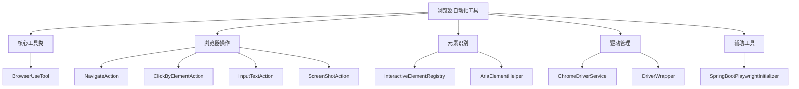

**Diagram sources**
- [BrowserUseTool.java](file://src/main/java/com/alibaba/cloud/ai/lynxe/tool/browser/BrowserUseTool.java)
- [ChromeDriverService.java](file://src/main/java/com/alibaba/cloud/ai/lynxe/tool/browser/ChromeDriverService.java)
- [InteractiveElementRegistry.java](file://src/main/java/com/alibaba/cloud/ai/lynxe/tool/browser/InteractiveElementRegistry.java)

## 核心组件

浏览器自动化工具的核心组件包括BrowserUseTool、ChromeDriverService和InteractiveElementRegistry。BrowserUseTool作为主要入口点，协调各种浏览器操作；ChromeDriverService负责浏览器实例的生命周期管理；InteractiveElementRegistry处理交互式元素的识别和注册。这些组件共同构成了工具的基础架构，支持复杂的网页自动化任务。

**Section sources**
- [BrowserUseTool.java](file://src/main/java/com/alibaba/cloud/ai/lynxe/tool/browser/BrowserUseTool.java#L52-L652)
- [ChromeDriverService.java](file://src/main/java/com/alibaba/cloud/ai/lynxe/tool/browser/ChromeDriverService.java#L50-L911)
- [InteractiveElementRegistry.java](file://src/main/java/com/alibaba/cloud/ai/lynxe/tool/browser/InteractiveElementRegistry.java#L35-L555)

## 架构概述

浏览器自动化工具采用分层架构设计，各组件之间通过清晰的接口进行通信。该架构确保了系统的可维护性和可扩展性，同时提供了强大的浏览器自动化功能。

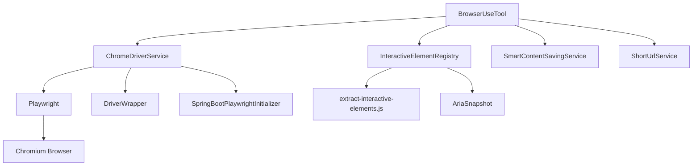

**Diagram sources**
- [BrowserUseTool.java](file://src/main/java/com/alibaba/cloud/ai/lynxe/tool/browser/BrowserUseTool.java#L52-L652)
- [ChromeDriverService.java](file://src/main/java/com/alibaba/cloud/ai/lynxe/tool/browser/ChromeDriverService.java#L50-L911)
- [InteractiveElementRegistry.java](file://src/main/java/com/alibaba/cloud/ai/lynxe/tool/browser/InteractiveElementRegistry.java#L35-L555)
- [extract-interactive-elements.js](file://src/main/resources/tool/extract-interactive-elements.js#L1-L386)

## 详细组件分析

### BrowserUseTool分析
BrowserUseTool是浏览器自动化工具的核心类，负责协调各种浏览器操作。它通过依赖注入获取ChromeDriverService、SmartContentSavingService等服务，并提供统一的接口来执行各种浏览器操作。

#### BrowserUseTool类图
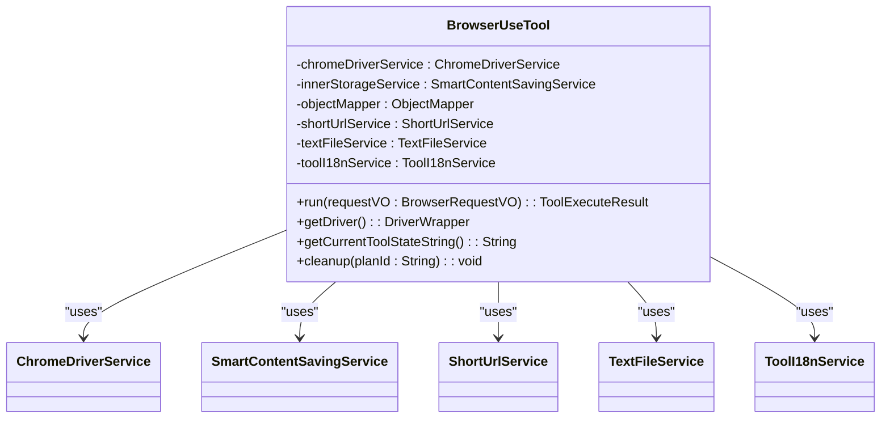

**Diagram sources**
- [BrowserUseTool.java](file://src/main/java/com/alibaba/cloud/ai/lynxe/tool/browser/BrowserUseTool.java#L52-L652)

#### 浏览器操作执行流程
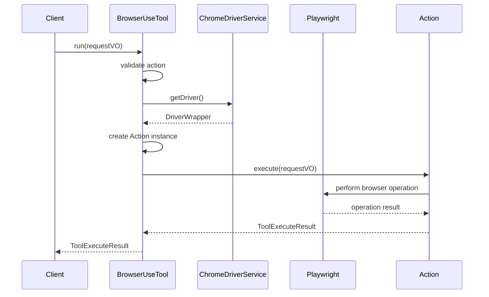

**Diagram sources**
- [BrowserUseTool.java](file://src/main/java/com/alibaba/cloud/ai/lynxe/tool/browser/BrowserUseTool.java#L124-L291)
- [ChromeDriverService.java](file://src/main/java/com/alibaba/cloud/ai/lynxe/tool/browser/ChromeDriverService.java#L105-L157)

### ChromeDriverService分析
ChromeDriverService负责管理Playwright浏览器实例的生命周期，包括创建、获取和销毁浏览器驱动。它采用线程安全的设计，确保在多线程环境下能够正确管理浏览器实例。

#### ChromeDriverService类图
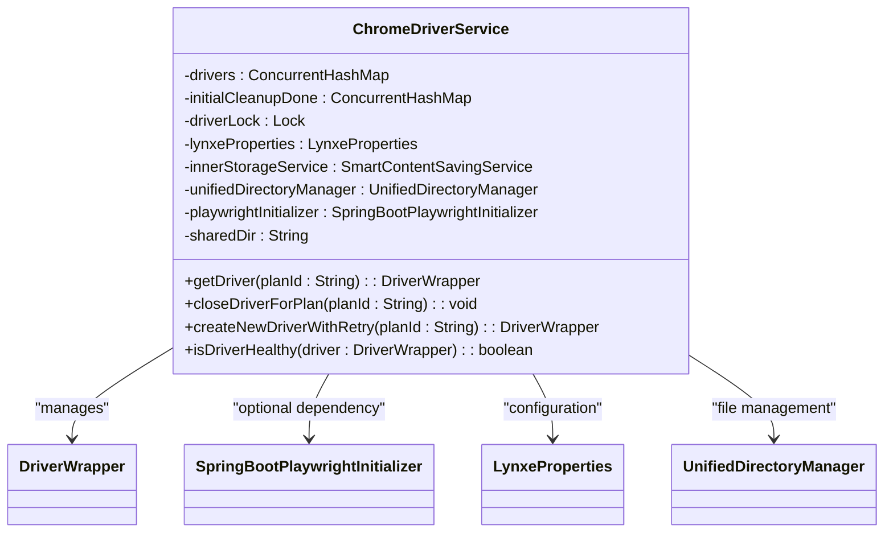

**Diagram sources**
- [ChromeDriverService.java](file://src/main/java/com/alibaba/cloud/ai/lynxe/tool/browser/ChromeDriverService.java#L50-L911)

#### 浏览器驱动创建流程
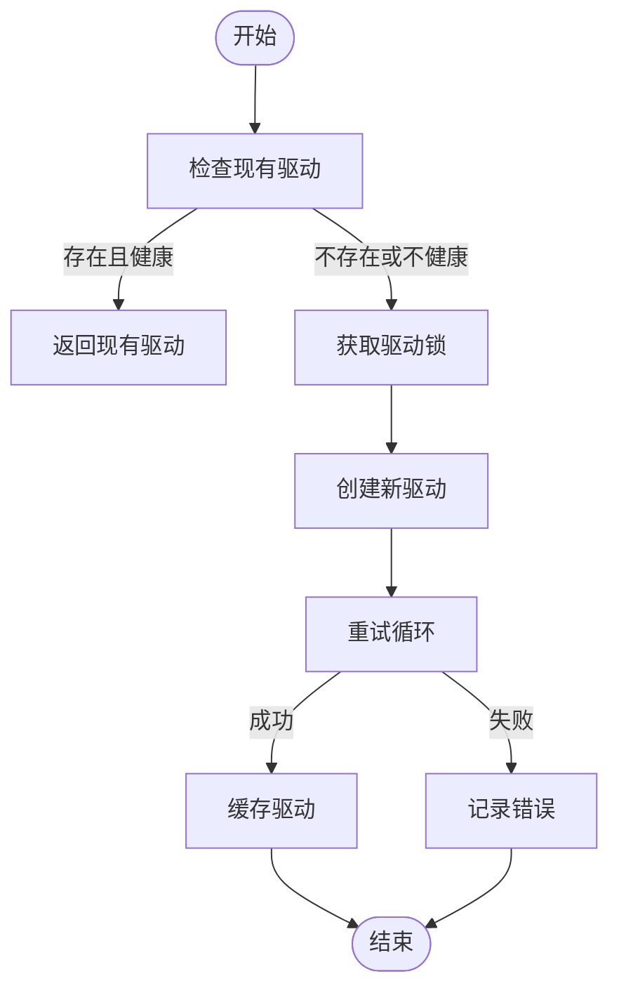

**Diagram sources**
- [ChromeDriverService.java](file://src/main/java/com/alibaba/cloud/ai/lynxe/tool/browser/ChromeDriverService.java#L105-L157)

### 交互式元素识别机制
交互式元素识别是浏览器自动化工具的关键功能，它通过JavaScript脚本分析页面中的可交互元素，并为每个元素分配唯一的索引。

#### 元素识别流程
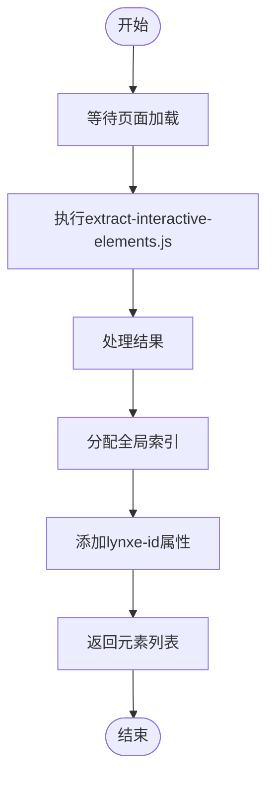

**Diagram sources**
- [InteractiveElementRegistry.java](file://src/main/java/com/alibaba/cloud/ai/lynxe/tool/browser/InteractiveElementRegistry.java#L424-L477)
- [extract-interactive-elements.js](file://src/main/resources/tool/extract-interactive-elements.js#L1-L386)

#### 交互式元素注册类图
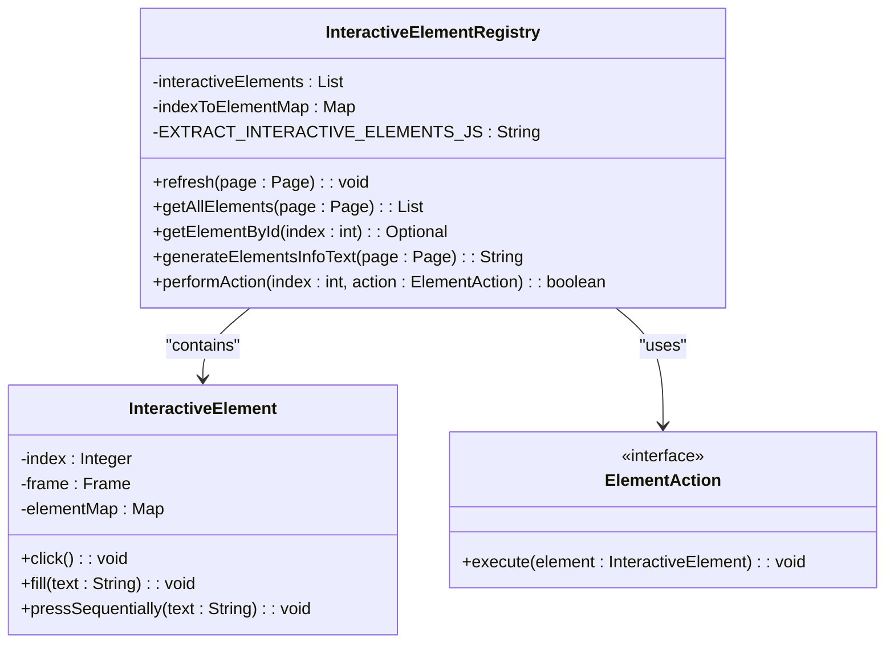

**Diagram sources**
- [InteractiveElementRegistry.java](file://src/main/java/com/alibaba/cloud/ai/lynxe/tool/browser/InteractiveElementRegistry.java#L35-L555)
- [extract-interactive-elements.js](file://src/main/resources/tool/extract-interactive-elements.js#L1-L386)

### 浏览器操作实现分析
浏览器自动化工具通过Action模式实现各种浏览器操作，每个操作都封装在独立的Action类中。

#### 浏览器操作类继承结构
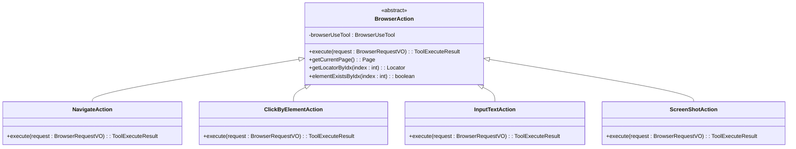

**Diagram sources**
- [BrowserUseTool.java](file://src/main/java/com/alibaba/cloud/ai/lynxe/tool/browser/BrowserUseTool.java#L163-L250)
- [NavigateAction.java](file://src/main/java/com/alibaba/cloud/ai/lynxe/tool/browser/actions/NavigateAction.java#L25-L78)
- [ClickByElementAction.java](file://src/main/java/com/alibaba/cloud/ai/lynxe/tool/browser/actions/ClickByElementAction.java#L23-L87)
- [InputTextAction.java](file://src/main/java/com/alibaba/cloud/ai/lynxe/tool/browser/actions/InputTextAction.java#L22-L88)
- [ScreenShotAction.java](file://src/main/java/com/alibaba/cloud/ai/lynxe/tool/browser/actions/ScreenShotAction.java#L22-L38)

#### 页面导航操作流程
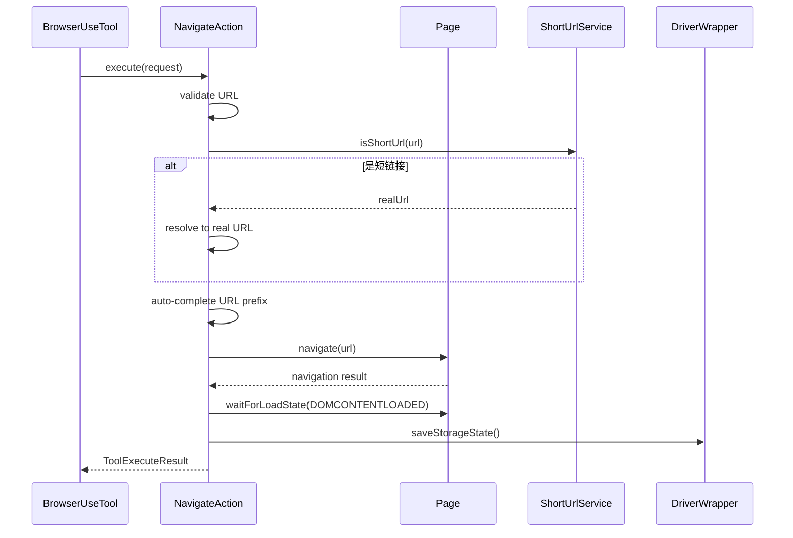

**Diagram sources**
- [NavigateAction.java](file://src/main/java/com/alibaba/cloud/ai/lynxe/tool/browser/actions/NavigateAction.java#L32-L75)

#### 元素点击操作流程
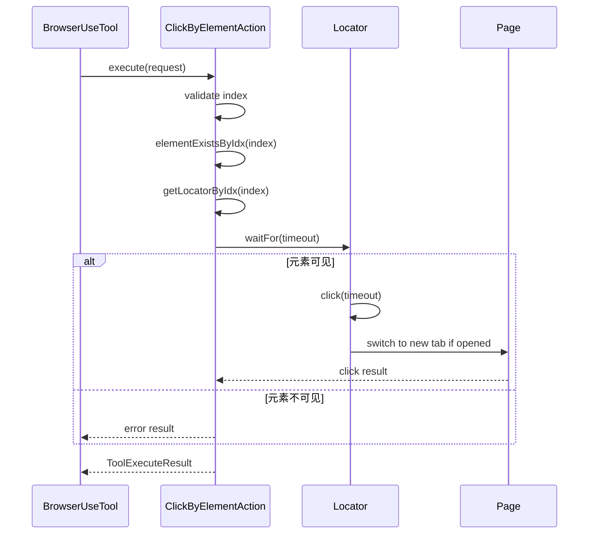

**Diagram sources**
- [ClickByElementAction.java](file://src/main/java/com/alibaba/cloud/ai/lynxe/tool/browser/actions/ClickByElementAction.java#L32-L83)

#### 文本输入操作流程
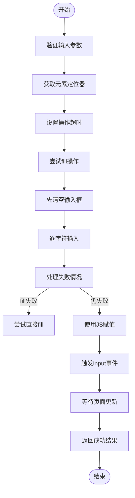

**Diagram sources**
- [InputTextAction.java](file://src/main/java/com/alibaba/cloud/ai/lynxe/tool/browser/actions/InputTextAction.java#L29-L85)

#### 网页内容提取为Markdown流程
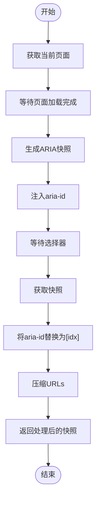

**Diagram sources**
- [AriaElementHelper.java](file://src/main/java/com/alibaba/cloud/ai/lynxe/tool/browser/AriaElementHelper.java#L79-L111)
- [AriaSnapshot.java](file://src/main/java/com/alibaba/cloud/ai/lynxe/tool/browser/AriaSnapshot.java#L63-L108)

## 依赖分析

浏览器自动化工具的依赖关系清晰，各组件之间通过接口和依赖注入进行通信，确保了低耦合和高内聚的设计原则。

```mermaid
graph TD
BrowserUseTool --> ChromeDriverService
BrowserUseTool --> InteractiveElementRegistry
BrowserUseTool --> SmartContentSavingService
BrowserUseTool --> ShortUrlService
BrowserUseTool --> TextFileService
BrowserUseTool --> ToolI18nService
ChromeDriverService --> Playwright
ChromeDriverService --> SpringBootPlaywrightInitializer
ChromeDriverService --> LynxeProperties
ChromeDriverService --> UnifiedDirectoryManager
InteractiveElementRegistry --> extract-interactive-elements.js
InteractiveElementRegistry --> AriaSnapshot
AriaElementHelper --> AriaSnapshot
AriaElementHelper --> ShortUrlService
NavigateAction --> ShortUrlService
ClickByElementAction --> BrowserAction
InputTextAction --> BrowserAction
ScreenShotAction --> BrowserAction
class BrowserUseTool,ChromeDriverService,InteractiveElementRegistry,SmartContentSavingService,ShortUrlService,TextFileService,ToolI18nService,LynxeProperties,UnifiedDirectoryManager,SpringBootPlaywrightInitializer,extract-interactive-elements.js,AriaSnapshot,AriaElementHelper,BrowserAction,NavigateAction,ClickByElementAction,InputTextAction,ScreenShotAction component;
```

**Diagram sources**
- [BrowserUseTool.java](file://src/main/java/com/alibaba/cloud/ai/lynxe/tool/browser/BrowserUseTool.java#L52-L652)
- [ChromeDriverService.java](file://src/main/java/com/alibaba/cloud/ai/lynxe/tool/browser/ChromeDriverService.java#L50-L911)
- [InteractiveElementRegistry.java](file://src/main/java/com/alibaba/cloud/ai/lynxe/tool/browser/InteractiveElementRegistry.java#L35-L555)
- [AriaElementHelper.java](file://src/main/java/com/alibaba/cloud/ai/lynxe/tool/browser/AriaElementHelper.java#L28-L207)
- [AriaSnapshot.java](file://src/main/java/com/alibaba/cloud/ai/lynxe/tool/browser/AriaSnapshot.java#L42-L117)
- [extract-interactive-elements.js](file://src/main/resources/tool/extract-interactive-elements.js#L1-L386)

## 性能考虑

浏览器自动化工具在设计时充分考虑了性能优化，通过多种机制确保高效运行。

### 性能优化策略
1. **连接池管理**：ChromeDriverService使用ConcurrentHashMap管理浏览器驱动实例，避免重复创建和销毁。
2. **重试机制**：关键操作（如驱动创建、浏览器操作）都实现了重试机制，提高可靠性。
3. **超时控制**：所有浏览器操作都设置了合理的超时时间，防止操作挂起。
4. **资源清理**：在JVM关闭时自动清理Playwright进程，防止资源泄漏。
5. **并发安全**：使用ReentrantLock确保多线程环境下的线程安全。

### 防检测策略
1. **用户代理随机化**：在创建浏览器实例时使用随机的User-Agent，避免被识别为自动化工具。
2. **禁用自动化特征**：通过启动参数禁用自动化控制特征，如`--disable-blink-features=AutomationControlled`。
3. **正常模式运行**：浏览器在正常模式下运行（非无痕模式），保留cookies和历史记录，模拟真实用户行为。
4. **性能优化参数**：使用一系列启动参数优化性能并减少被检测的风险。

**Section sources**
- [ChromeDriverService.java](file://src/main/java/com/alibaba/cloud/ai/lynxe/tool/browser/ChromeDriverService.java#L463-L515)
- [PlaywrightConfig.java](file://src/main/java/com/alibaba/cloud/ai/lynxe/config/PlaywrightConfig.java#L67-L75)

## 故障排除指南

### 常见问题及解决方案
1. **浏览器驱动获取失败**
   - 检查ChromeDriverService的getDriver方法，确保驱动锁获取成功
   - 查看日志中是否有"Failed to acquire driver lock"错误
   - 确认Playwright环境是否正确配置

2. **元素点击失败**
   - 检查元素是否可见且可点击
   - 确认元素索引是否正确
   - 查看是否有"Element is not visible"错误

3. **页面导航超时**
   - 检查网络连接是否正常
   - 确认URL是否正确
   - 查看是否有"Timeout error executing action 'navigate'"错误

4. **Playwright初始化失败**
   - 检查Playwright相关环境变量是否设置正确
   - 确认浏览器二进制文件是否存在
   - 查看是否有"Playwright initialization failed"错误

### 调试建议
1. 启用DEBUG日志级别，获取更详细的执行信息
2. 检查application.yml中的日志配置
3. 使用getCurrentToolStateString方法获取当前工具状态
4. 查看Playwright相关的系统属性配置

**Section sources**
- [BrowserUseTool.java](file://src/main/java/com/alibaba/cloud/ai/lynxe/tool/browser/BrowserUseTool.java#L251-L264)
- [ChromeDriverService.java](file://src/main/java/com/alibaba/cloud/ai/lynxe/tool/browser/ChromeDriverService.java#L147-L154)
- [ClickByElementAction.java](file://src/main/java/com/alibaba/cloud/ai/lynxe/tool/browser/actions/ClickByElementAction.java#L71-L81)

## 结论
浏览器自动化工具是一个功能强大且设计精良的系统，通过BrowserUseTool核心类与Playwright的深度集成，实现了复杂的网页自动化任务。该工具采用模块化设计，通过Action模式封装各种浏览器操作，具有良好的可扩展性和可维护性。系统通过ChromeDriverService有效管理浏览器实例的生命周期，确保资源的高效利用。交互式元素识别机制通过JavaScript脚本精确识别页面中的可交互元素，并为每个元素分配唯一索引，便于后续操作。工具还集成了防检测策略和性能优化机制，能够在真实环境中稳定运行。整体架构清晰，组件间依赖关系明确，为浏览器自动化提供了完整的解决方案。