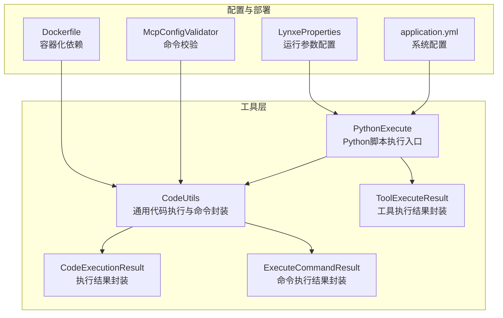
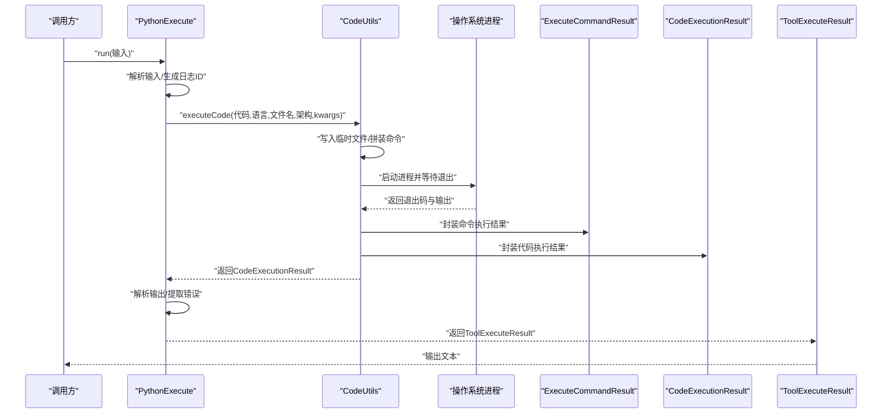
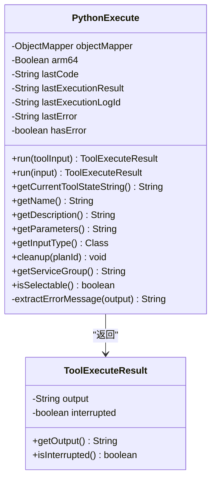
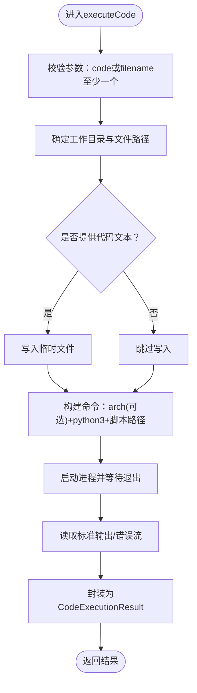
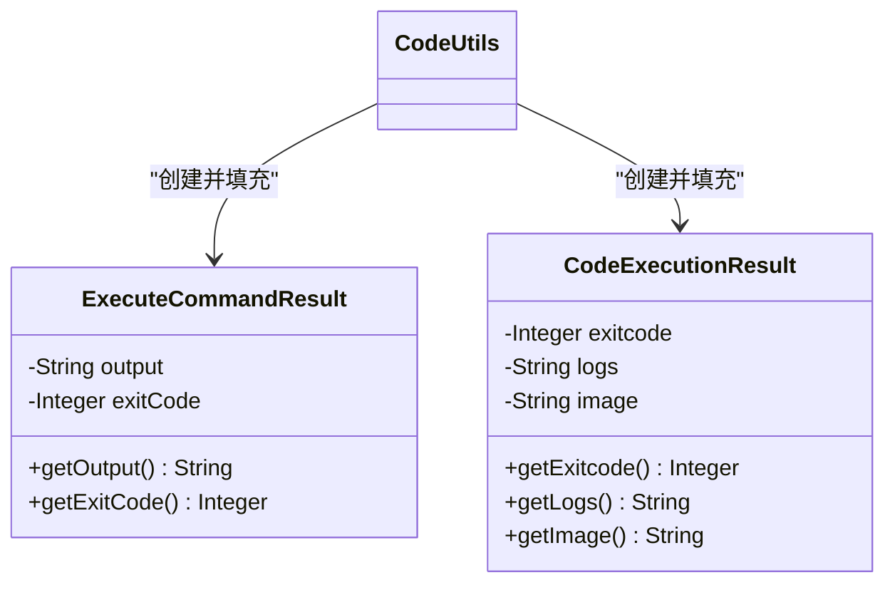
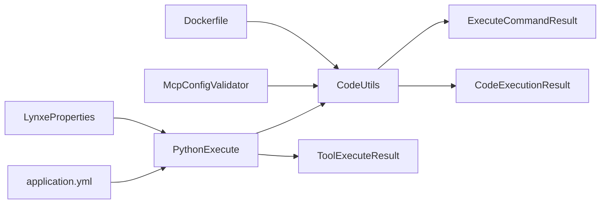

# Python脚本支持

<cite>
**本文引用的文件列表**
- [PythonExecute.java](file://src/main/java/com/alibaba/cloud/ai/lynxe/tool/code/PythonExecute.java)
- [CodeUtils.java](file://src/main/java/com/alibaba/cloud/ai/lynxe/tool/code/CodeUtils.java)
- [CodeExecutionResult.java](file://src/main/java/com/alibaba/cloud/ai/lynxe/tool/code/CodeExecutionResult.java)
- [ExecuteCommandResult.java](file://src/main/java/com/alibaba/cloud/ai/lynxe/tool/code/ExecuteCommandResult.java)
- [ToolExecuteResult.java](file://src/main/java/com/alibaba/cloud/ai/lynxe/tool/code/ToolExecuteResult.java)
- [application.yml](file://src/main/resources/application.yml)
- [LynxeProperties.java](file://src/main/java/com/alibaba/cloud/ai/lynxe/config/LynxeProperties.java)
- [McpConfigValidator.java](file://src/main/java/com/alibaba/cloud/ai/lynxe/mcp/service/McpConfigValidator.java)
- [Dockerfile](file://deploy/Dockerfile)
</cite>

## 目录
1. [简介](#简介)
2. [项目结构](#项目结构)
3. [核心组件](#核心组件)
4. [架构总览](#架构总览)
5. [组件详解](#组件详解)
6. [依赖关系分析](#依赖关系分析)
7. [性能与调优](#性能与调优)
8. [故障排查指南](#故障排查指南)
9. [结论](#结论)
10. [附录](#附录)

## 简介
本文件面向需要在系统中安全、稳定地执行Python脚本的用户与开发者，围绕PythonExecute工具与其背后的核心执行链路进行深入解析。内容涵盖：
- Python解释器调用命令的构建方式与平台选择
- 如何传递脚本路径、参数与运行环境
- 执行结果的解析机制：标准输出捕获、错误信息提取、返回码处理
- ExecuteCommandResult与CodeExecutionResult在封装执行结果时的分工与协作
- 实战案例：执行机器学习脚本、数据处理脚本
- 虚拟环境集成、依赖管理与性能调优最佳实践

## 项目结构
与Python脚本执行直接相关的模块位于工具层的code包内，核心类包括PythonExecute、CodeUtils、CodeExecutionResult、ExecuteCommandResult以及ToolExecuteResult；同时，系统配置与容器化部署文件为脚本执行提供了运行环境保障。

图表来源
- [PythonExecute.java](file://src/main/java/com/alibaba/cloud/ai/lynxe/tool/code/PythonExecute.java#L1-L246)
- [CodeUtils.java](file://src/main/java/com/alibaba/cloud/ai/lynxe/tool/code/CodeUtils.java#L1-L220)
- [CodeExecutionResult.java](file://src/main/java/com/alibaba/cloud/ai/lynxe/tool/code/CodeExecutionResult.java#L1-L51)
- [ExecuteCommandResult.java](file://src/main/java/com/alibaba/cloud/ai/lynxe/tool/code/ExecuteCommandResult.java#L1-L41)
- [ToolExecuteResult.java](file://src/main/java/com/alibaba/cloud/ai/lynxe/tool/code/ToolExecuteResult.java#L1-L60)
- [application.yml](file://src/main/resources/application.yml#L1-L98)
- [LynxeProperties.java](file://src/main/java/com/alibaba/cloud/ai/lynxe/config/LynxeProperties.java#L176-L312)
- [McpConfigValidator.java](file://src/main/java/com/alibaba/cloud/ai/lynxe/mcp/service/McpConfigValidator.java#L106-L215)
- [Dockerfile](file://deploy/Dockerfile#L31-L87)

章节来源
- [PythonExecute.java](file://src/main/java/com/alibaba/cloud/ai/lynxe/tool/code/PythonExecute.java#L1-L246)
- [CodeUtils.java](file://src/main/java/com/alibaba/cloud/ai/lynxe/tool/code/CodeUtils.java#L1-L220)
- [application.yml](file://src/main/resources/application.yml#L1-L98)

## 核心组件
- PythonExecute：对外暴露的Python脚本执行工具，负责接收输入、触发执行、解析输出与错误、封装最终结果。
- CodeUtils：通用代码执行器，负责将代码写入临时文件、拼装命令行、调用系统进程、收集标准输出与错误流、返回统一的结果对象。
- CodeExecutionResult：封装一次代码执行的退出码与日志文本。
- ExecuteCommandResult：封装底层命令执行的退出码与输出文本。
- ToolExecuteResult：封装工具调用返回的输出与中断状态，供上层消费。

章节来源
- [PythonExecute.java](file://src/main/java/com/alibaba/cloud/ai/lynxe/tool/code/PythonExecute.java#L1-L246)
- [CodeUtils.java](file://src/main/java/com/alibaba/cloud/ai/lynxe/tool/code/CodeUtils.java#L92-L163)
- [CodeExecutionResult.java](file://src/main/java/com/alibaba/cloud/ai/lynxe/tool/code/CodeExecutionResult.java#L1-L51)
- [ExecuteCommandResult.java](file://src/main/java/com/alibaba/cloud/ai/lynxe/tool/code/ExecuteCommandResult.java#L1-L41)
- [ToolExecuteResult.java](file://src/main/java/com/alibaba/cloud/ai/lynxe/tool/code/ToolExecuteResult.java#L1-L60)

## 架构总览
下图展示了从工具调用到系统进程执行再到结果回传的完整流程。

图表来源
- [PythonExecute.java](file://src/main/java/com/alibaba/cloud/ai/lynxe/tool/code/PythonExecute.java#L103-L228)
- [CodeUtils.java](file://src/main/java/com/alibaba/cloud/ai/lynxe/tool/code/CodeUtils.java#L139-L163)
- [ExecuteCommandResult.java](file://src/main/java/com/alibaba/cloud/ai/lynxe/tool/code/ExecuteCommandResult.java#L1-L41)
- [CodeExecutionResult.java](file://src/main/java/com/alibaba/cloud/ai/lynxe/tool/code/CodeExecutionResult.java#L1-L51)
- [ToolExecuteResult.java](file://src/main/java/com/alibaba/cloud/ai/lynxe/tool/code/ToolExecuteResult.java#L1-L60)

## 组件详解

### PythonExecute：Python脚本执行入口
- 输入解析：支持字符串JSON输入与强类型输入对象两种形式，均从输入中提取“code”字段作为待执行代码。
- 命令构建：调用CodeUtils.executeCode时，语言固定为“python”，文件名由日志ID生成，平台架构由内部arm64标志决定。
- 结果解析：从CodeExecutionResult获取日志文本后，检查是否包含常见Python异常关键字以判定是否出现错误，并提取错误信息。
- 输出封装：将原始日志文本封装为ToolExecuteResult返回给调用方。

图表来源
- [PythonExecute.java](file://src/main/java/com/alibaba/cloud/ai/lynxe/tool/code/PythonExecute.java#L1-L246)
- [ToolExecuteResult.java](file://src/main/java/com/alibaba/cloud/ai/lynxe/tool/code/ToolExecuteResult.java#L1-L60)

章节来源
- [PythonExecute.java](file://src/main/java/com/alibaba/cloud/ai/lynxe/tool/code/PythonExecute.java#L103-L228)

### CodeUtils：通用代码执行器
- 代码落盘：若提供代码文本，则写入工作目录下的临时文件；若未提供文件名则基于代码内容生成哈希命名。
- 命令组装：当语言为“python”时，根据arm64标志添加arch切换参数（如需要），随后追加“python3”与脚本路径。
- 进程执行：使用ProcessBuilder启动进程，分别读取标准输出与错误流，等待进程结束并返回退出码。
- 结果封装：将命令执行结果映射为CodeExecutionResult，包含退出码与日志文本。

图表来源
- [CodeUtils.java](file://src/main/java/com/alibaba/cloud/ai/lynxe/tool/code/CodeUtils.java#L92-L163)
- [CodeExecutionResult.java](file://src/main/java/com/alibaba/cloud/ai/lynxe/tool/code/CodeExecutionResult.java#L1-L51)
- [ExecuteCommandResult.java](file://src/main/java/com/alibaba/cloud/ai/lynxe/tool/code/ExecuteCommandResult.java#L1-L41)

章节来源
- [CodeUtils.java](file://src/main/java/com/alibaba/cloud/ai/lynxe/tool/code/CodeUtils.java#L92-L219)

### 结果封装：ExecuteCommandResult与CodeExecutionResult
- ExecuteCommandResult：承载底层命令执行的退出码与输出文本，用于区分成功与失败分支。
- CodeExecutionResult：承载更高层的执行结果，包含退出码与日志文本，便于上层工具统一处理。

图表来源
- [ExecuteCommandResult.java](file://src/main/java/com/alibaba/cloud/ai/lynxe/tool/code/ExecuteCommandResult.java#L1-L41)
- [CodeExecutionResult.java](file://src/main/java/com/alibaba/cloud/ai/lynxe/tool/code/CodeExecutionResult.java#L1-L51)
- [CodeUtils.java](file://src/main/java/com/alibaba/cloud/ai/lynxe/tool/code/CodeUtils.java#L139-L163)

章节来源
- [ExecuteCommandResult.java](file://src/main/java/com/alibaba/cloud/ai/lynxe/tool/code/ExecuteCommandResult.java#L1-L41)
- [CodeExecutionResult.java](file://src/main/java/com/alibaba/cloud/ai/lynxe/tool/code/CodeExecutionResult.java#L1-L51)
- [CodeUtils.java](file://src/main/java/com/alibaba/cloud/ai/lynxe/tool/code/CodeUtils.java#L139-L163)

### 工具结果：ToolExecuteResult
- ToolExecuteResult用于向调用方返回最终输出文本与中断标记，PythonExecute将其直接返回给上层。

章节来源
- [ToolExecuteResult.java](file://src/main/java/com/alibaba/cloud/ai/lynxe/tool/code/ToolExecuteResult.java#L1-L60)
- [PythonExecute.java](file://src/main/java/com/alibaba/cloud/ai/lynxe/tool/code/PythonExecute.java#L132-L145)

## 依赖关系分析
- PythonExecute依赖于CodeUtils进行实际的脚本执行，并依赖ToolExecuteResult封装输出。
- CodeUtils依赖ExecuteCommandResult与CodeExecutionResult进行结果封装，并通过ProcessBuilder与操作系统交互。
- 配置层面，application.yml与LynxeProperties提供系统级参数，McpConfigValidator确保命令合法性，Dockerfile提供运行时依赖。

图表来源
- [PythonExecute.java](file://src/main/java/com/alibaba/cloud/ai/lynxe/tool/code/PythonExecute.java#L1-L246)
- [CodeUtils.java](file://src/main/java/com/alibaba/cloud/ai/lynxe/tool/code/CodeUtils.java#L1-L220)
- [application.yml](file://src/main/resources/application.yml#L1-L98)
- [LynxeProperties.java](file://src/main/java/com/alibaba/cloud/ai/lynxe/config/LynxeProperties.java#L176-L312)
- [McpConfigValidator.java](file://src/main/java/com/alibaba/cloud/ai/lynxe/mcp/service/McpConfigValidator.java#L106-L215)
- [Dockerfile](file://deploy/Dockerfile#L31-L87)

章节来源
- [PythonExecute.java](file://src/main/java/com/alibaba/cloud/ai/lynxe/tool/code/PythonExecute.java#L1-L246)
- [CodeUtils.java](file://src/main/java/com/alibaba/cloud/ai/lynxe/tool/code/CodeUtils.java#L1-L220)
- [application.yml](file://src/main/resources/application.yml#L1-L98)
- [LynxeProperties.java](file://src/main/java/com/alibaba/cloud/ai/lynxe/config/LynxeProperties.java#L176-L312)
- [McpConfigValidator.java](file://src/main/java/com/alibaba/cloud/ai/lynxe/mcp/service/McpConfigValidator.java#L106-L215)
- [Dockerfile](file://deploy/Dockerfile#L31-L87)

## 性能与调优
- 进程I/O读取：CodeUtils在进程结束后会先读取标准输出，再读取错误流，避免阻塞问题；建议在长耗时脚本中关注日志分块输出，避免一次性输出过大导致内存压力。
- 平台架构：arm64标志影响命令前缀（如arch -arm64），在多架构环境中可按需切换，减少兼容性问题。
- 工作目录与临时文件：默认使用当前用户目录，可通过kwargs传入work_dir以隔离执行环境，降低文件冲突风险。
- 超时控制：当前实现未显式设置超时，可在调用侧结合系统配置与外部调度策略限制单次执行时长，避免资源占用过高。
- 并发与池化：系统配置中提供线程池大小等参数，可在Agent层面对工具并发进行控制，避免过多脚本同时执行造成资源争用。

章节来源
- [CodeUtils.java](file://src/main/java/com/alibaba/cloud/ai/lynxe/tool/code/CodeUtils.java#L139-L163)
- [application.yml](file://src/main/resources/application.yml#L61-L98)
- [LynxeProperties.java](file://src/main/java/com/alibaba/cloud/ai/lynxe/config/LynxeProperties.java#L287-L312)

## 故障排查指南
- 常见错误识别：PythonExecute会检测输出中是否包含语法错误、缩进错误、名称错误、类型错误、值错误、导入错误等关键字，从而判断是否出现错误并提取错误信息。
- JSON解析失败：当输入为字符串JSON时，若反序列化失败，会返回错误提示；请检查输入格式与字段完整性。
- 命令合法性：McpConfigValidator对命令进行白名单校验，确保仅允许受支持的解释器与脚本运行命令，避免注入与误用。
- 容器依赖：Dockerfile中安装了Node.js与Playwright相关依赖，虽然与Python脚本无直接关系，但保证了系统整体运行环境的一致性。

章节来源
- [PythonExecute.java](file://src/main/java/com/alibaba/cloud/ai/lynxe/tool/code/PythonExecute.java#L120-L161)
- [PythonExecute.java](file://src/main/java/com/alibaba/cloud/ai/lynxe/tool/code/PythonExecute.java#L141-L145)
- [McpConfigValidator.java](file://src/main/java/com/alibaba/cloud/ai/lynxe/mcp/service/McpConfigValidator.java#L106-L215)
- [Dockerfile](file://deploy/Dockerfile#L31-L87)

## 结论
PythonExecute通过清晰的职责划分与稳健的执行链路，实现了对Python脚本的安全执行与结果封装。其核心优势在于：
- 明确的输入解析与错误识别
- 可控的平台架构与工作目录
- 统一的结果封装与工具层对接
配合系统配置与容器化部署，能够在生产环境中稳定运行并满足机器学习与数据处理场景的需求。

## 附录

### 实战案例：执行Python脚本
- 机器学习脚本
  - 将训练/推理逻辑封装为print输出，确保结果可见；若需可视化，请将图像保存至本地并在后续步骤中读取。
  - 使用PythonExecute.run传入包含“code”的输入，查看ToolExecuteResult中的输出文本。
- 数据处理脚本
  - 将清洗、转换、聚合等步骤以print输出关键指标或中间结果，便于审计与排错。
  - 若脚本较长，建议拆分为多个小任务，结合工作目录参数隔离临时文件。

章节来源
- [PythonExecute.java](file://src/main/java/com/alibaba/cloud/ai/lynxe/tool/code/PythonExecute.java#L103-L228)
- [CodeUtils.java](file://src/main/java/com/alibaba/cloud/ai/lynxe/tool/code/CodeUtils.java#L92-L163)

### 虚拟环境与依赖管理最佳实践
- 使用虚拟环境
  - 在脚本中显式激活虚拟环境后再执行（例如通过修改命令行或在脚本内调用激活脚本），确保第三方库可用。
- 依赖声明
  - 在容器镜像中预装常用依赖，或在首次执行时通过pip安装所需包；注意版本锁定与缓存策略。
- 安全与隔离
  - 限制脚本权限与可访问路径，避免对系统敏感资源的误操作。
- 性能优化
  - 合理设置工作目录与临时文件位置，避免磁盘IO瓶颈；
  - 控制并发度，结合系统线程池参数与任务队列进行限流。

章节来源
- [CodeUtils.java](file://src/main/java/com/alibaba/cloud/ai/lynxe/tool/code/CodeUtils.java#L110-L138)
- [application.yml](file://src/main/resources/application.yml#L61-L98)
- [LynxeProperties.java](file://src/main/java/com/alibaba/cloud/ai/lynxe/config/LynxeProperties.java#L287-L312)
- [Dockerfile](file://deploy/Dockerfile#L31-L87)