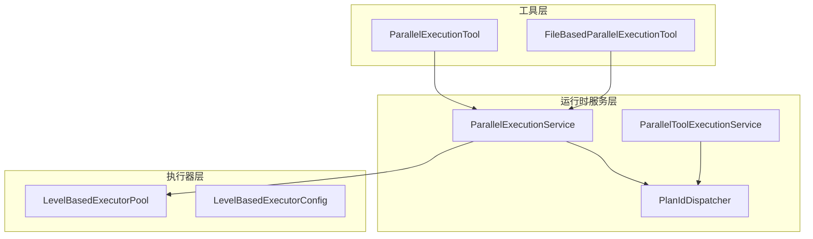
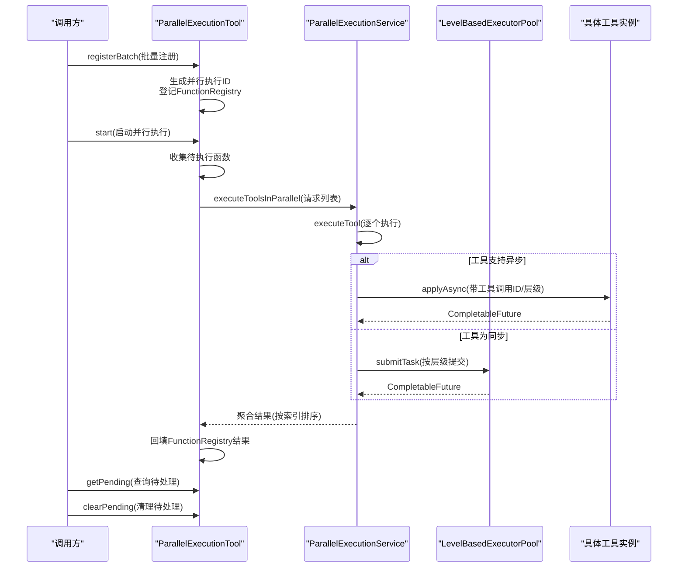
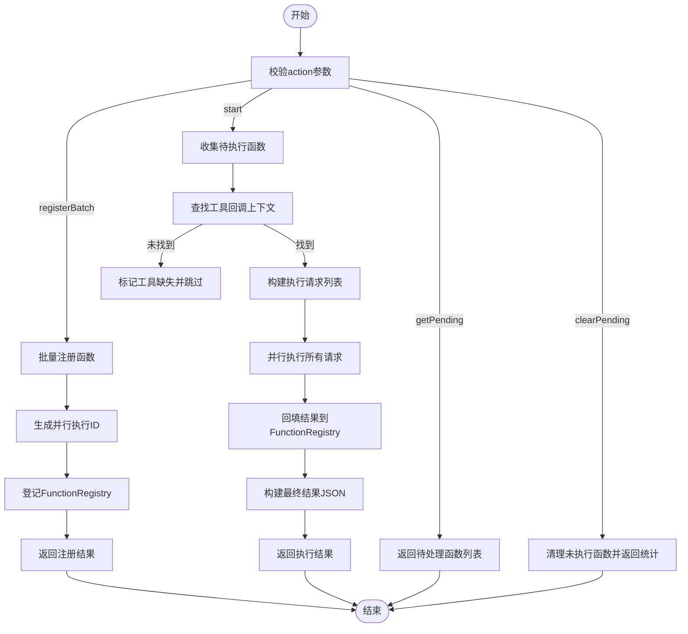
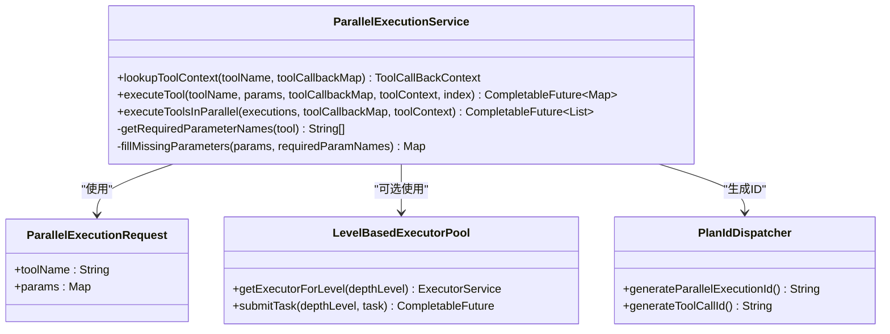
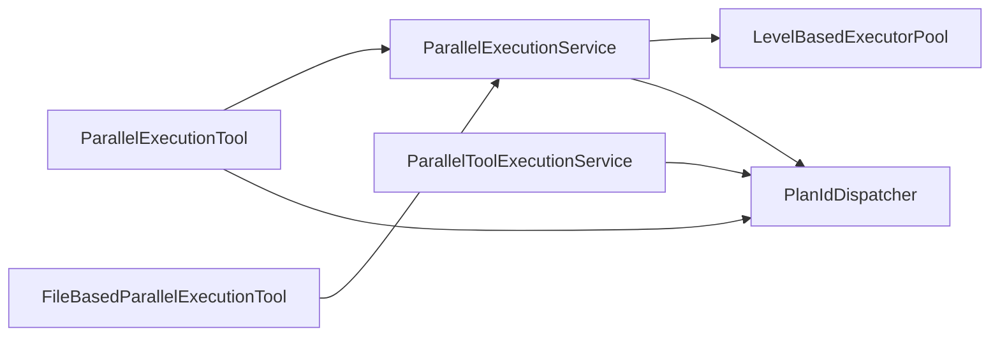

# 并行执行管理

<cite>
**本文引用的文件**
- [ParallelExecutionTool.java](file://src/main/java/com/alibaba/cloud/ai/lynxe/tool/mapreduce/ParallelExecutionTool.java)
- [ParallelExecutionService.java](file://src/main/java/com/alibaba/cloud/ai/lynxe/tool/mapreduce/ParallelExecutionService.java)
- [ParallelToolExecutionService.java](file://src/main/java/com/alibaba/cloud/ai/lynxe/runtime/service/ParallelToolExecutionService.java)
- [PlanIdDispatcher.java](file://src/main/java/com/alibaba/cloud/ai/lynxe/runtime/service/PlanIdDispatcher.java)
- [IPlanIdDispatcher.java](file://src/main/java/com/alibaba/cloud/ai/lynxe/runtime/service/IPlanIdDispatcher.java)
- [LevelBasedExecutorPool.java](file://src/main/java/com/alibaba/cloud/ai/lynxe/runtime/executor/LevelBasedExecutorPool.java)
- [LevelBasedExecutorConfig.java](file://src/main/java/com/alibaba/cloud/ai/lynxe/runtime/executor/LevelBasedExecutorConfig.java)
- [FileBasedParallelExecutionTool.java](file://src/main/java/com/alibaba/cloud/ai/lynxe/tool/mapreduce/FileBasedParallelExecutionTool.java)
- [parallel-execution-tool-en.yml](file://src/main/resources/i18n/tools/parallel-execution-tool-en.yml)
</cite>

## 目录
1. [简介](#简介)
2. [项目结构](#项目结构)
3. [核心组件](#核心组件)
4. [架构总览](#架构总览)
5. [详细组件分析](#详细组件分析)
6. [依赖关系分析](#依赖关系分析)
7. [性能与并发特性](#性能与并发特性)
8. [故障排查指南](#故障排查指南)
9. [结论](#结论)
10. [附录：最佳实践与配置建议](#附录最佳实践与配置建议)

## 简介
本文件系统性梳理并行脚本执行管理的设计与实现，重点围绕以下目标：
- 解析 ParallelToolExecutionService 如何协调多个脚本任务的并发执行
- 说明 ParallelExecutionTool 支持 registerBatch、start、getPending 等操作的异步执行机制
- 基于 CompletableFuture 的非阻塞调用模型与任务状态管理
- PlanIdDispatcher 生成唯一并行执行 ID 的算法（包含时间戳、随机数、线程 ID）
- 提供批量注册、启动并行执行、查询待处理任务的实际案例
- 给出线程池配置、负载控制与故障恢复的最佳实践

## 项目结构
并行执行能力由工具层与运行时服务层协同完成：
- 工具层：ParallelExecutionTool 负责注册、启动、查询待处理任务；FileBasedParallelExecutionTool 提供基于文件的批量执行入口
- 运行时服务层：ParallelExecutionService 统一执行逻辑；ParallelToolExecutionService 提供可复用的并行执行能力；PlanIdDispatcher 提供 ID 生成与转换
- 执行器层：LevelBasedExecutorPool 按层级管理线程池，支持动态调整与统计

图表来源
- [ParallelExecutionTool.java](file://src/main/java/com/alibaba/cloud/ai/lynxe/tool/mapreduce/ParallelExecutionTool.java#L1-L120)
- [ParallelExecutionService.java](file://src/main/java/com/alibaba/cloud/ai/lynxe/tool/mapreduce/ParallelExecutionService.java#L1-L120)
- [ParallelToolExecutionService.java](file://src/main/java/com/alibaba/cloud/ai/lynxe/runtime/service/ParallelToolExecutionService.java#L1-L120)
- [PlanIdDispatcher.java](file://src/main/java/com/alibaba/cloud/ai/lynxe/runtime/service/PlanIdDispatcher.java#L1-L120)
- [LevelBasedExecutorPool.java](file://src/main/java/com/alibaba/cloud/ai/lynxe/runtime/executor/LevelBasedExecutorPool.java#L1-L120)
- [LevelBasedExecutorConfig.java](file://src/main/java/com/alibaba/cloud/ai/lynxe/runtime/executor/LevelBasedExecutorConfig.java#L1-L60)

章节来源
- [ParallelExecutionTool.java](file://src/main/java/com/alibaba/cloud/ai/lynxe/tool/mapreduce/ParallelExecutionTool.java#L1-L120)
- [ParallelExecutionService.java](file://src/main/java/com/alibaba/cloud/ai/lynxe/tool/mapreduce/ParallelExecutionService.java#L1-L120)
- [ParallelToolExecutionService.java](file://src/main/java/com/alibaba/cloud/ai/lynxe/runtime/service/ParallelToolExecutionService.java#L1-L120)
- [PlanIdDispatcher.java](file://src/main/java/com/alibaba/cloud/ai/lynxe/runtime/service/PlanIdDispatcher.java#L1-L120)
- [LevelBasedExecutorPool.java](file://src/main/java/com/alibaba/cloud/ai/lynxe/runtime/executor/LevelBasedExecutorPool.java#L1-L120)
- [LevelBasedExecutorConfig.java](file://src/main/java/com/alibaba/cloud/ai/lynxe/runtime/executor/LevelBasedExecutorConfig.java#L1-L60)

## 核心组件
- ParallelExecutionTool：面向“批量注册 + 异步启动 + 待处理查询”的并行执行工具，内部维护 FunctionRegistry 列表，支持 registerBatch、start、getPending、clearPending 等动作
- ParallelExecutionService：通用并行执行服务，负责工具查找、参数填充、异步/同步执行、结果聚合与排序
- ParallelToolExecutionService：更通用的并行执行服务，支持以 ToolCall 列表形式并行执行，适合在更高层的编排中使用
- PlanIdDispatcher：统一 ID 生成与转换，包括并行执行 ID、工具调用 ID、步骤 ID、思考-行动 ID 等
- LevelBasedExecutorPool：按层级划分的线程池，支持动态调整大小、统计与优雅关闭

章节来源
- [ParallelExecutionTool.java](file://src/main/java/com/alibaba/cloud/ai/lynxe/tool/mapreduce/ParallelExecutionTool.java#L120-L260)
- [ParallelExecutionService.java](file://src/main/java/com/alibaba/cloud/ai/lynxe/tool/mapreduce/ParallelExecutionService.java#L100-L220)
- [ParallelToolExecutionService.java](file://src/main/java/com/alibaba/cloud/ai/lynxe/runtime/service/ParallelToolExecutionService.java#L75-L165)
- [PlanIdDispatcher.java](file://src/main/java/com/alibaba/cloud/ai/lynxe/runtime/service/PlanIdDispatcher.java#L195-L292)
- [LevelBasedExecutorPool.java](file://src/main/java/com/alibaba/cloud/ai/lynxe/runtime/executor/LevelBasedExecutorPool.java#L70-L140)

## 架构总览
并行执行的典型流程如下：
- 工具侧接收 registerBatch 输入，生成唯一并行执行 ID，登记到 FunctionRegistry
- 调用 start 后，收集未执行的 FunctionRegistry，构造 ParallelExecutionRequest 列表
- 通过 ParallelExecutionService 并行执行各请求，返回结果后回填 FunctionRegistry
- getPending/clearPending 用于查询或清理待处理任务

图表来源
- [ParallelExecutionTool.java](file://src/main/java/com/alibaba/cloud/ai/lynxe/tool/mapreduce/ParallelExecutionTool.java#L253-L432)
- [ParallelExecutionService.java](file://src/main/java/com/alibaba/cloud/ai/lynxe/tool/mapreduce/ParallelExecutionService.java#L298-L346)
- [LevelBasedExecutorPool.java](file://src/main/java/com/alibaba/cloud/ai/lynxe/runtime/executor/LevelBasedExecutorPool.java#L105-L142)

章节来源
- [ParallelExecutionTool.java](file://src/main/java/com/alibaba/cloud/ai/lynxe/tool/mapreduce/ParallelExecutionTool.java#L253-L432)
- [ParallelExecutionService.java](file://src/main/java/com/alibaba/cloud/ai/lynxe/tool/mapreduce/ParallelExecutionService.java#L298-L346)
- [LevelBasedExecutorPool.java](file://src/main/java/com/alibaba/cloud/ai/lynxe/runtime/executor/LevelBasedExecutorPool.java#L105-L142)

## 详细组件分析

### ParallelExecutionTool：批量注册与异步执行
- 注册动作 registerBatch
  - 校验 tool_name 与 functions 参数
  - 遍历参数数组，为每个参数项生成唯一并行执行 ID（来自 PlanIdDispatcher），创建 FunctionRegistry 并登记
  - 返回注册结果（含每条记录的 ID、输入、工具名与状态）
- 启动动作 start
  - 收集尚未执行的 FunctionRegistry（无结果即待执行）
  - 通过 ParallelExecutionService 查找工具回调上下文，构建 ParallelExecutionRequest 列表
  - 调用 executeToolsInParallel 并等待所有任务完成，回填结果并序列化最终结果
- 查询与清理
  - getPending：返回尚未执行的函数清单（仅输入、工具名、状态）
  - clearPending：将未执行函数标记为已清理
- 清理与状态
  - cleanup：清空 FunctionRegistry
  - getCurrentToolStateString：返回当前待执行计划（仅待执行函数）

图表来源
- [ParallelExecutionTool.java](file://src/main/java/com/alibaba/cloud/ai/lynxe/tool/mapreduce/ParallelExecutionTool.java#L253-L495)

章节来源
- [ParallelExecutionTool.java](file://src/main/java/com/alibaba/cloud/ai/lynxe/tool/mapreduce/ParallelExecutionTool.java#L253-L495)
- [parallel-execution-tool-en.yml](file://src/main/resources/i18n/tools/parallel-execution-tool-en.yml#L1-L37)

### ParallelExecutionService：通用并行执行与参数处理
- 工具查找与键转换
  - lookupToolContext：优先使用服务组索引转换后的键进行查找，失败再回退原始工具名
- 单工具执行
  - executeTool：根据工具是否实现异步接口选择不同执行路径；支持参数类型转换、必填参数填充、工具调用 ID 与层级传播
  - 若存在 LevelBasedExecutorPool，则按层级提交同步任务；否则直接异步执行
- 多工具并行
  - executeToolsInParallel：为每个请求创建 CompletableFuture，使用 allOf 聚合，完成后按索引排序返回

图表来源
- [ParallelExecutionService.java](file://src/main/java/com/alibaba/cloud/ai/lynxe/tool/mapreduce/ParallelExecutionService.java#L63-L120)
- [ParallelExecutionService.java](file://src/main/java/com/alibaba/cloud/ai/lynxe/tool/mapreduce/ParallelExecutionService.java#L112-L296)
- [ParallelExecutionService.java](file://src/main/java/com/alibaba/cloud/ai/lynxe/tool/mapreduce/ParallelExecutionService.java#L298-L346)
- [LevelBasedExecutorPool.java](file://src/main/java/com/alibaba/cloud/ai/lynxe/runtime/executor/LevelBasedExecutorPool.java#L70-L142)
- [PlanIdDispatcher.java](file://src/main/java/com/alibaba/cloud/ai/lynxe/runtime/service/PlanIdDispatcher.java#L267-L292)

章节来源
- [ParallelExecutionService.java](file://src/main/java/com/alibaba/cloud/ai/lynxe/tool/mapreduce/ParallelExecutionService.java#L63-L120)
- [ParallelExecutionService.java](file://src/main/java/com/alibaba/cloud/ai/lynxe/tool/mapreduce/ParallelExecutionService.java#L112-L296)
- [ParallelExecutionService.java](file://src/main/java/com/alibaba/cloud/ai/lynxe/tool/mapreduce/ParallelExecutionService.java#L298-L346)
- [LevelBasedExecutorPool.java](file://src/main/java/com/alibaba/cloud/ai/lynxe/runtime/executor/LevelBasedExecutorPool.java#L70-L142)
- [PlanIdDispatcher.java](file://src/main/java/com/alibaba/cloud/ai/lynxe/runtime/service/PlanIdDispatcher.java#L267-L292)

### ParallelToolExecutionService：更高层的并行执行
- 接收 ToolCall 列表，逐个提取工具名与参数，生成或继承工具调用 ID，按层级传递
- 对每个 ToolCall 创建 CompletableFuture，使用 allOf 聚合并收集结果
- 提供从 ToolContext 中提取工具调用 ID 与层级的辅助方法

章节来源
- [ParallelToolExecutionService.java](file://src/main/java/com/alibaba/cloud/ai/lynxe/runtime/service/ParallelToolExecutionService.java#L75-L165)
- [ParallelToolExecutionService.java](file://src/main/java/com/alibaba/cloud/ai/lynxe/runtime/service/ParallelToolExecutionService.java#L167-L236)

### PlanIdDispatcher：唯一 ID 生成算法
- 并行执行 ID（generateParallelExecutionId）：前缀 + 时间戳 + 随机数 + 线程 ID，确保高并发下唯一性
- 工具调用 ID（generateToolCallId）：同上策略，便于追踪单次工具调用
- 步骤 ID（generateStepId）、思考-行动 ID（generateThinkActId）：类似策略
- 子计划 ID（generateSubPlanId）：使用不同前缀与纳秒级时间戳、随机数、父 ID 哈希，保证与父 ID 不冲突

章节来源
- [PlanIdDispatcher.java](file://src/main/java/com/alibaba/cloud/ai/lynxe/runtime/service/PlanIdDispatcher.java#L195-L292)
- [IPlanIdDispatcher.java](file://src/main/java/com/alibaba/cloud/ai/lynxe/runtime/service/IPlanIdDispatcher.java#L1-L63)

### FileBasedParallelExecutionTool：基于文件的批量执行
- 从文件读取参数数组，逐条构造 ParallelExecutionRequest，委托 ParallelExecutionService 并行执行
- 统计成功/失败数量，输出结果文件名（工具名-时间戳.json）

章节来源
- [FileBasedParallelExecutionTool.java](file://src/main/java/com/alibaba/cloud/ai/lynxe/tool/mapreduce/FileBasedParallelExecutionTool.java#L139-L207)

## 依赖关系分析
- 工具层依赖运行时服务层与执行器层
- ParallelExecutionTool 与 FileBasedParallelExecutionTool 共享 ParallelExecutionService
- ParallelToolExecutionService 与 ParallelExecutionService 在“工具调用”层面互补
- PlanIdDispatcher 为多处 ID 生成提供统一入口

图表来源
- [ParallelExecutionTool.java](file://src/main/java/com/alibaba/cloud/ai/lynxe/tool/mapreduce/ParallelExecutionTool.java#L1-L120)
- [ParallelExecutionService.java](file://src/main/java/com/alibaba/cloud/ai/lynxe/tool/mapreduce/ParallelExecutionService.java#L1-L120)
- [ParallelToolExecutionService.java](file://src/main/java/com/alibaba/cloud/ai/lynxe/runtime/service/ParallelToolExecutionService.java#L1-L120)
- [PlanIdDispatcher.java](file://src/main/java/com/alibaba/cloud/ai/lynxe/runtime/service/PlanIdDispatcher.java#L1-L120)
- [LevelBasedExecutorPool.java](file://src/main/java/com/alibaba/cloud/ai/lynxe/runtime/executor/LevelBasedExecutorPool.java#L1-L120)

章节来源
- [ParallelExecutionTool.java](file://src/main/java/com/alibaba/cloud/ai/lynxe/tool/mapreduce/ParallelExecutionTool.java#L1-L120)
- [ParallelExecutionService.java](file://src/main/java/com/alibaba/cloud/ai/lynxe/tool/mapreduce/ParallelExecutionService.java#L1-L120)
- [ParallelToolExecutionService.java](file://src/main/java/com/alibaba/cloud/ai/lynxe/runtime/service/ParallelToolExecutionService.java#L1-L120)
- [PlanIdDispatcher.java](file://src/main/java/com/alibaba/cloud/ai/lynxe/runtime/service/PlanIdDispatcher.java#L1-L120)
- [LevelBasedExecutorPool.java](file://src/main/java/com/alibaba/cloud/ai/lynxe/runtime/executor/LevelBasedExecutorPool.java#L1-L120)

## 性能与并发特性
- CompletableFuture 非阻塞模型
  - ParallelExecutionTool 的 start 使用 executeToolsInParallel 返回 CompletableFuture，避免阻塞线程池
  - ParallelExecutionService 在工具为异步时直接返回 CompletableFuture，同步工具通过 LevelBasedExecutorPool 提交任务
- 层级线程池与负载控制
  - LevelBasedExecutorPool 按深度级别管理线程池，支持动态调整核心/最大线程数与队列容量
  - 默认最大深度级别为 10，可通过配置属性调整
- 结果一致性与排序
  - 并行执行结果按请求索引排序，保证输出顺序与输入一致
- 资源管理
  - 提供优雅关闭与监控线程池大小变更的机制

章节来源
- [ParallelExecutionTool.java](file://src/main/java/com/alibaba/cloud/ai/lynxe/tool/mapreduce/ParallelExecutionTool.java#L317-L432)
- [ParallelExecutionService.java](file://src/main/java/com/alibaba/cloud/ai/lynxe/tool/mapreduce/ParallelExecutionService.java#L298-L346)
- [LevelBasedExecutorPool.java](file://src/main/java/com/alibaba/cloud/ai/lynxe/runtime/executor/LevelBasedExecutorPool.java#L185-L312)
- [LevelBasedExecutorConfig.java](file://src/main/java/com/alibaba/cloud/ai/lynxe/runtime/executor/LevelBasedExecutorConfig.java#L1-L60)

## 故障排查指南
- 工具未找到
  - 现象：返回 ERROR 并包含工具缺失提示
  - 排查：确认工具名称与服务组索引映射是否正确；检查工具回调映射是否完整
- 参数类型不匹配
  - 现象：输入转换失败，返回 ERROR
  - 排查：核对工具参数 Schema，必要时使用 fillMissingParameters 填充默认值
- 线程池耗尽或饥饿
  - 现象：任务长时间排队或执行缓慢
  - 排查：查看 LevelBasedExecutorPool 统计信息，适当提高 pool size 或调整队列容量
- 并发冲突
  - 现象：ID 冲突或重复
  - 排查：确认 PlanIdDispatcher 的 ID 生成策略被正确使用（并行执行 ID、工具调用 ID、子计划 ID）

章节来源
- [ParallelExecutionService.java](file://src/main/java/com/alibaba/cloud/ai/lynxe/tool/mapreduce/ParallelExecutionService.java#L112-L220)
- [LevelBasedExecutorPool.java](file://src/main/java/com/alibaba/cloud/ai/lynxe/runtime/executor/LevelBasedExecutorPool.java#L144-L171)
- [PlanIdDispatcher.java](file://src/main/java/com/alibaba/cloud/ai/lynxe/runtime/service/PlanIdDispatcher.java#L267-L292)

## 结论
该并行执行体系通过工具层与服务层的清晰分工，结合 CompletableFuture 的非阻塞模型与层级线程池的负载控制，实现了高吞吐、低阻塞的多脚本并发执行。PlanIdDispatcher 提供了强一致性的 ID 生成策略，确保在复杂嵌套场景下的可追踪性与稳定性。配合 FileBasedParallelExecutionTool，用户可以快速实现基于文件的批量执行。

## 附录：最佳实践与配置建议
- 线程池配置
  - 通过 LevelBasedExecutorConfig 设置默认核心/最大线程数与队列容量
  - 在高并发场景下，适当提高 pool size，并启用动态监控自动调整
- 负载控制
  - 使用 getPoolStatistics 获取各层级线程池状态，结合业务峰值动态扩容
  - 对长耗时工具建议实现异步接口，避免阻塞线程池
- 故障恢复
  - 对关键工具增加超时与重试策略（在工具实现层处理）
  - 使用 PlanIdDispatcher 的工具调用 ID 进行日志关联与问题定位
- 实战案例（步骤说明）
  - 批量注册：调用 registerBatch，传入 tool_name 与 functions 数组，获得每条记录的并行执行 ID
  - 启动并行执行：调用 start，内部会查找工具、构建请求并并行执行，完成后回填结果
  - 查询待处理：调用 getPending，返回尚未执行的函数清单
  - 清理待处理：调用 clearPending，将未执行函数标记为已清理

章节来源
- [LevelBasedExecutorConfig.java](file://src/main/java/com/alibaba/cloud/ai/lynxe/runtime/executor/LevelBasedExecutorConfig.java#L1-L60)
- [LevelBasedExecutorPool.java](file://src/main/java/com/alibaba/cloud/ai/lynxe/runtime/executor/LevelBasedExecutorPool.java#L185-L312)
- [ParallelExecutionTool.java](file://src/main/java/com/alibaba/cloud/ai/lynxe/tool/mapreduce/ParallelExecutionTool.java#L253-L495)
- [ParallelExecutionService.java](file://src/main/java/com/alibaba/cloud/ai/lynxe/tool/mapreduce/ParallelExecutionService.java#L298-L346)
- [PlanIdDispatcher.java](file://src/main/java/com/alibaba/cloud/ai/lynxe/runtime/service/PlanIdDispatcher.java#L267-L292)