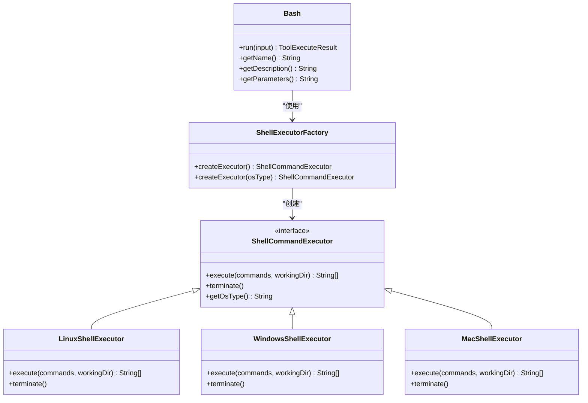
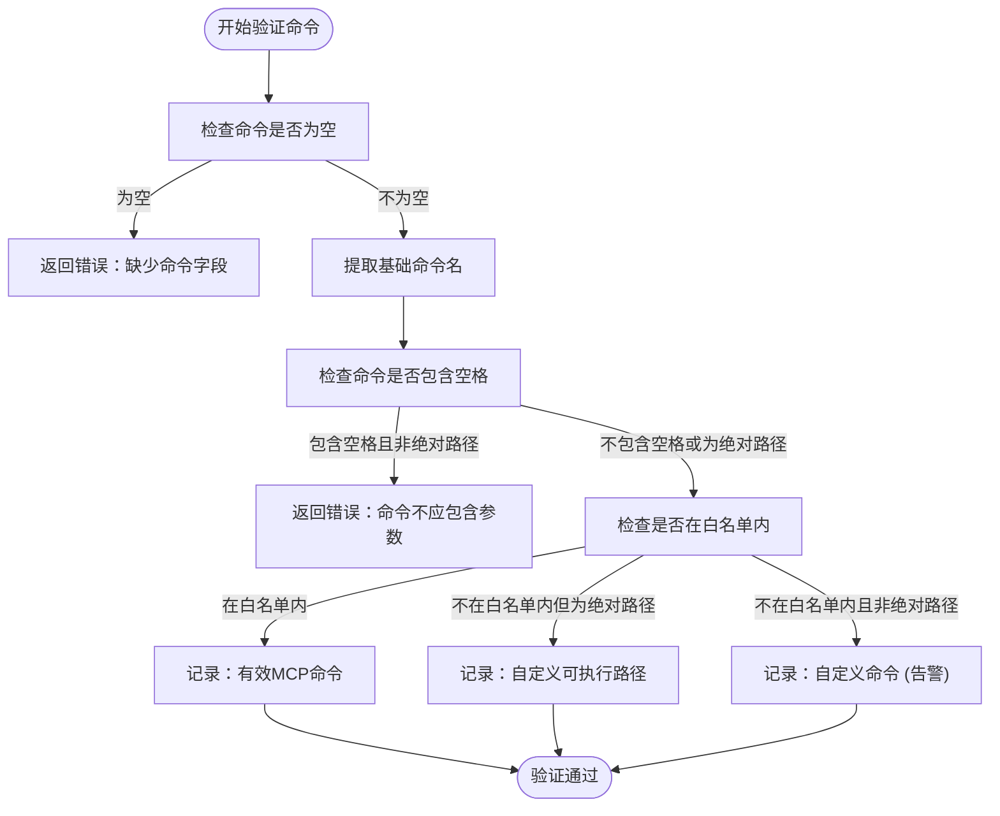
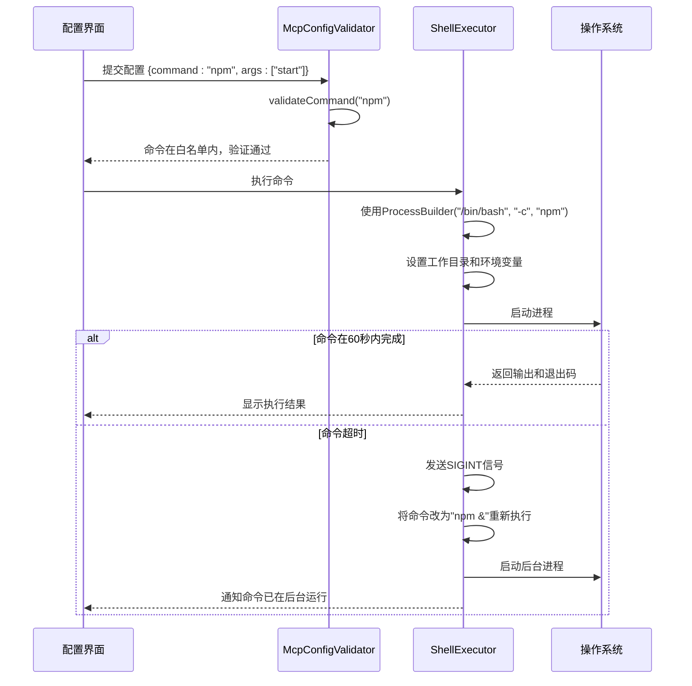

# 执行安全与权限控制

<cite>
**本文档引用的文件**   
- [Bash.java](file://src/main/java/com/alibaba/cloud/ai/lynxe/tool/bash/Bash.java)
- [ShellCommandExecutor.java](file://src/main/java/com/alibaba/cloud/ai/lynxe/tool/bash/ShellCommandExecutor.java)
- [LinuxShellExecutor.java](file://src/main/java/com/alibaba/cloud/ai/lynxe/tool/bash/LinuxShellExecutor.java)
- [WindowsShellExecutor.java](file://src/main/java/com/alibaba/cloud/ai/lynxe/tool/bash/WindowsShellExecutor.java)
- [MacShellExecutor.java](file://src/main/java/com/alibaba/cloud/ai/lynxe/tool/bash/MacShellExecutor.java)
- [ShellExecutorFactory.java](file://src/main/java/com/alibaba/cloud/ai/lynxe/tool/bash/ShellExecutorFactory.java)
- [McpConfigValidator.java](file://src/main/java/com/alibaba/cloud/ai/lynxe/mcp/service/McpConfigValidator.java)
- [McpProperties.java](file://src/main/java/com/alibaba/cloud/ai/lynxe/mcp/config/McpProperties.java)
- [bash-zh.yml](file://src/main/resources/i18n/tools/bash-zh.yml)
</cite>

## 目录
1. [引言](#引言)
2. [Bash工具类与命令执行安全](#bash工具类与命令执行安全)
3. [McpConfigValidator中的命令白名单验证](#mcpconfigvalidator中的命令白名单验证)
4. [命令注入防护机制](#命令注入防护机制)
5. [权限最小化原则与沙箱环境](#权限最小化原则与沙箱环境)
6. [安全配置最佳实践](#安全配置最佳实践)
7. [总结](#总结)

## 引言
本文档详细阐述了系统中执行安全与权限控制的核心机制。重点分析了Bash工具类如何实现安全的命令执行，以及McpConfigValidator组件如何对npx、npm、python、node等常用命令进行安全校验。文档将深入探讨命令注入防护、权限最小化、沙箱环境等安全策略，并提供安全配置的最佳实践，以确保系统的稳定与安全。

## Bash工具类与命令执行安全

Bash工具类是系统中执行shell命令的核心组件，它通过一系列安全机制来确保命令执行的安全性。该类通过`ShellExecutorFactory`工厂模式，根据当前操作系统动态创建相应的执行器（`LinuxShellExecutor`、`WindowsShellExecutor`或`MacShellExecutor`），实现了跨平台的命令执行能力。

**图表来源**
- [Bash.java](file://src/main/java/com/alibaba/cloud/ai/lynxe/tool/bash/Bash.java#L29-L161)
- [ShellCommandExecutor.java](file://src/main/java/com/alibaba/cloud/ai/lynxe/tool/bash/ShellCommandExecutor.java#L24-L47)
- [LinuxShellExecutor.java](file://src/main/java/com/alibaba/cloud/ai/lynxe/tool/bash/LinuxShellExecutor.java#L36-L160)
- [WindowsShellExecutor.java](file://src/main/java/com/alibaba/cloud/ai/lynxe/tool/bash/WindowsShellExecutor.java#L36-L166)
- [MacShellExecutor.java](file://src/main/java/com/alibaba/cloud/ai/lynxe/tool/bash/MacShellExecutor.java#L36-L225)
- [ShellExecutorFactory.java](file://src/main/java/com/alibaba/cloud/ai/lynxe/tool/bash/ShellExecutorFactory.java#L22-L60)

**章节来源**
- [Bash.java](file://src/main/java/com/alibaba/cloud/ai/lynxe/tool/bash/Bash.java#L29-L161)
- [ShellExecutorFactory.java](file://src/main/java/com/alibaba/cloud/ai/lynxe/tool/bash/ShellExecutorFactory.java#L22-L60)

## McpConfigValidator中的命令白名单验证

`McpConfigValidator`是MCP（Model Context Protocol）配置的核心验证器，负责对服务器配置进行严格的安全校验。其核心功能之一是实现命令白名单机制，确保只有经过授权的命令才能被配置和执行。

该验证器通过`validateCommand`方法对命令进行校验。首先，它检查命令字段是否为空；其次，它验证命令中是否包含空格（除非是绝对路径），以防止在命令字段中直接传入参数，从而避免命令注入风险。验证器通过`extractBaseCommand`方法从完整命令中提取出基础命令名，并通过`isCommonMcpCommand`方法检查该命令是否属于预定义的白名单。

白名单包含以下几类安全命令：
- **包管理器**：`npx`, `uvx`, `npm`, `yarn`
- **Python解释器**：`python`, `python3`, `python.exe`, `py`
- **Node.js运行时**：`node`, `nodejs`
- **Shell命令**：`sh`, `bash`, `zsh`, `cmd.exe`, `powershell.exe`
- **自定义可执行文件**：允许使用绝对路径指向特定的可执行文件（如虚拟环境脚本）

此机制确保了配置的命令是可预期和安全的，同时通过日志记录对非白名单命令进行告警，既保证了安全性又保留了灵活性。

**图表来源**
- [McpConfigValidator.java](file://src/main/java/com/alibaba/cloud/ai/lynxe/mcp/service/McpConfigValidator.java#L121-L215)

**章节来源**
- [McpConfigValidator.java](file://src/main/java/com/alibaba/cloud/ai/lynxe/mcp/service/McpConfigValidator.java#L121-L215)

## 命令注入防护机制

系统通过多层次的防护机制来抵御命令注入攻击，确保命令执行的纯净性和安全性。

### 参数过滤与分离
核心防护策略是将“命令”与“参数”严格分离。`McpConfigValidator`强制要求`command`字段只能包含可执行文件的名称，而不能包含任何参数。参数必须通过独立的`args`数组字段传入。这种设计从根本上杜绝了在命令字符串中拼接恶意参数的可能性。例如，攻击者无法通过`command: "ls; rm -rf /"`来执行恶意命令，因为分号会被视为命令名的一部分，而`ls;`这个可执行文件几乎不可能存在。

### 路径合法性检查
系统通过`isAbsolutePath`方法对命令路径进行合法性检查。该方法能准确识别Windows（如`C:\path\to\cmd.exe`）和Unix（如`/usr/bin/python`）风格的绝对路径。这确保了当配置使用绝对路径时，路径格式是正确的，防止了因路径错误导致的意外行为或潜在的路径遍历攻击。

### 特殊字符转义与超时处理
在具体的执行器（如`LinuxShellExecutor`）中，命令是通过`ProcessBuilder`安全地构建的，该类会自动处理特殊字符的转义，避免shell解释器对命令进行意外的解析。此外，系统设置了60秒的默认超时时间。如果命令执行超时，执行器会自动发送`SIGINT`信号尝试中断进程，并将命令重新以后台模式（`&`）运行，这既防止了长时间运行的命令阻塞系统，也避免了因超时而直接终止可能造成的数据不一致。

**图表来源**
- [McpConfigValidator.java](file://src/main/java/com/alibaba/cloud/ai/lynxe/mcp/service/McpConfigValidator.java#L121-L131)
- [LinuxShellExecutor.java](file://src/main/java/com/alibaba/cloud/ai/lynxe/tool/bash/LinuxShellExecutor.java#L72-L87)

**章节来源**
- [LinuxShellExecutor.java](file://src/main/java/com/alibaba/cloud/ai/lynxe/tool/bash/LinuxShellExecutor.java#L47-L100)
- [WindowsShellExecutor.java](file://src/main/java/com/alibaba/cloud/ai/lynxe/tool/bash/WindowsShellExecutor.java#L47-L92)
- [MacShellExecutor.java](file://src/main/java/com/alibaba/cloud/ai/lynxe/tool/bash/MacShellExecutor.java#L47-L94)

## 权限最小化原则与沙箱环境

系统严格遵循权限最小化原则，确保每个组件和命令都在其所需的最小权限范围内运行。

### 沙箱环境
Bash命令的执行被限制在一个由`UnifiedDirectoryManager`管理的特定工作目录中。`ProcessBuilder`的`directory()`方法确保了所有命令都在此沙箱目录内执行，无法直接访问系统根目录或其他敏感路径，有效限制了潜在的破坏范围。

### 资源限制
通过设置`DEFAULT_TIMEOUT`（默认60秒），系统对命令执行时间进行了硬性限制。这防止了恶意或错误的命令（如无限循环）耗尽系统CPU和内存资源，保障了服务的整体稳定性。

### 环境变量控制
执行器在启动进程前会显式设置关键的环境变量，如`LANG=en_US.UTF-8`和`PATH`。这确保了命令在一致且安全的环境中运行，避免了因环境变量污染或劫持而导致的意外行为。

## 安全配置最佳实践

为了最大化系统的安全性，建议遵循以下最佳实践：

### 设置可信命令列表
在配置MCP服务器时，应优先使用白名单中的标准命令（如`npx`, `python3`）。对于自定义脚本，应使用绝对路径，并确保这些脚本本身是安全的。避免使用模糊的命令名。

### 启用执行审计日志
系统通过SLF4J日志框架详细记录了所有关键操作。应确保日志级别设置为`INFO`或`DEBUG`，以记录所有命令执行、超时、终止等事件。日志中包含`Bash command: {}`和`Using shell executor for OS: {}`等信息，是审计和故障排查的重要依据。

### 配置超时阈值
根据实际业务需求，可以在`McpProperties`中通过`timeout`属性调整全局超时时间。对于已知的长时间任务，应明确在命令中使用`&`将其置于后台运行，并将输出重定向到日志文件，如`python3 app.py > server.log 2>&1 &`。

### 应对常见安全威胁
- **命令注入**：通过命令/参数分离和白名单机制，从根本上防御。
- **拒绝服务**：通过超时机制和资源限制，防止资源耗尽。
- **权限提升**：通过沙箱目录和最小权限原则，限制命令的破坏范围。
- **配置错误**：通过`McpConfigValidator`的全面校验，确保URL、环境变量等配置的正确性。

## 总结
本文档详细解析了系统在执行安全与权限控制方面的设计与实现。通过Bash工具类的跨平台安全执行、McpConfigValidator的命令白名单校验、严格的命令注入防护以及权限最小化原则的应用，系统构建了一个坚固的安全防线。遵循推荐的安全配置最佳实践，可以进一步提升系统的安全性和可靠性。