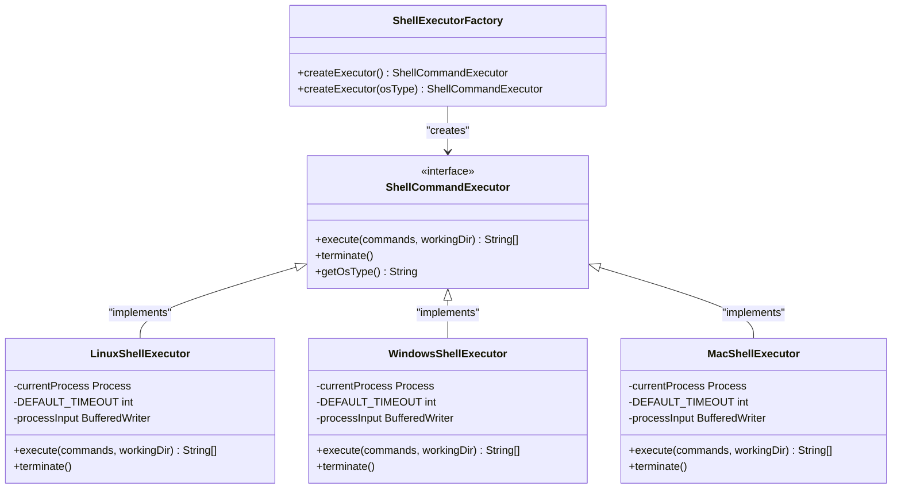
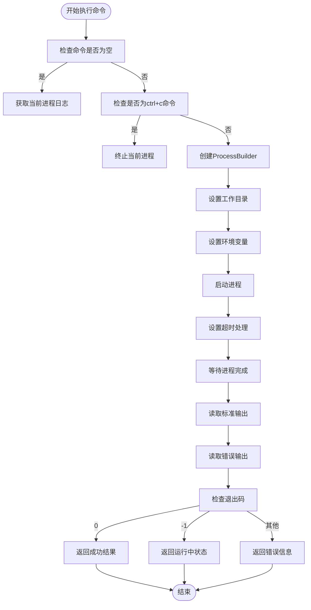
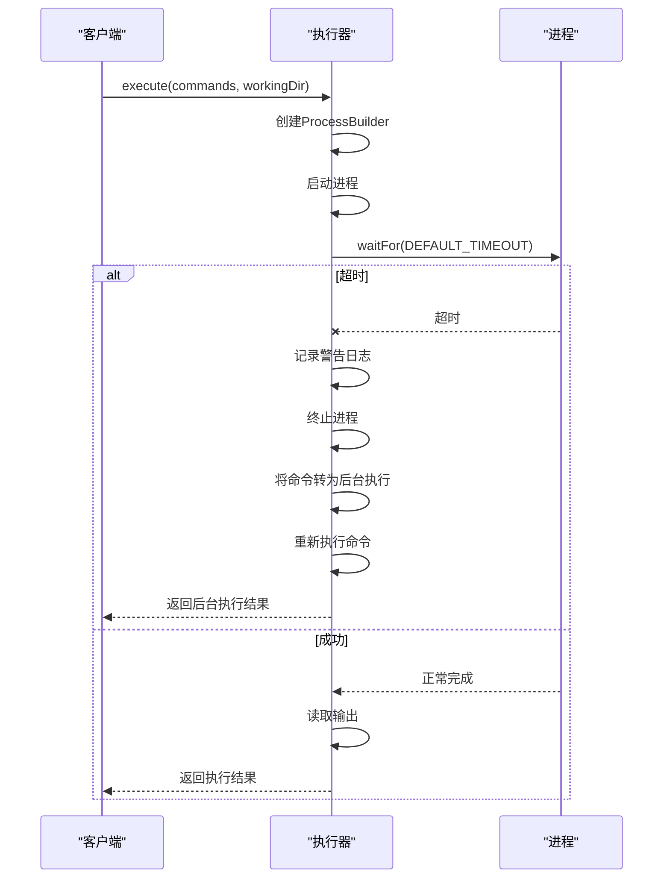
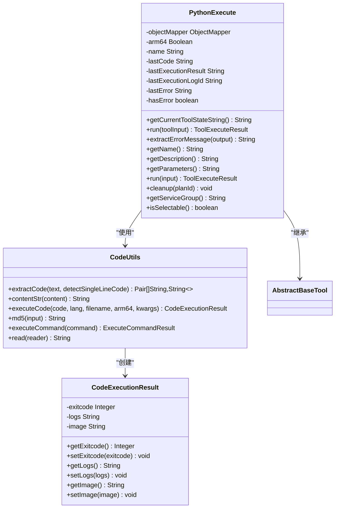
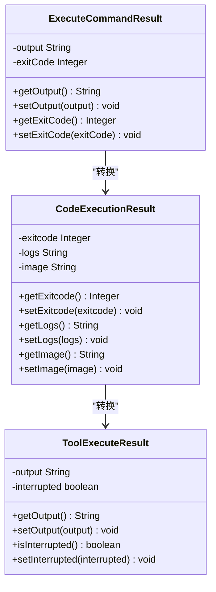
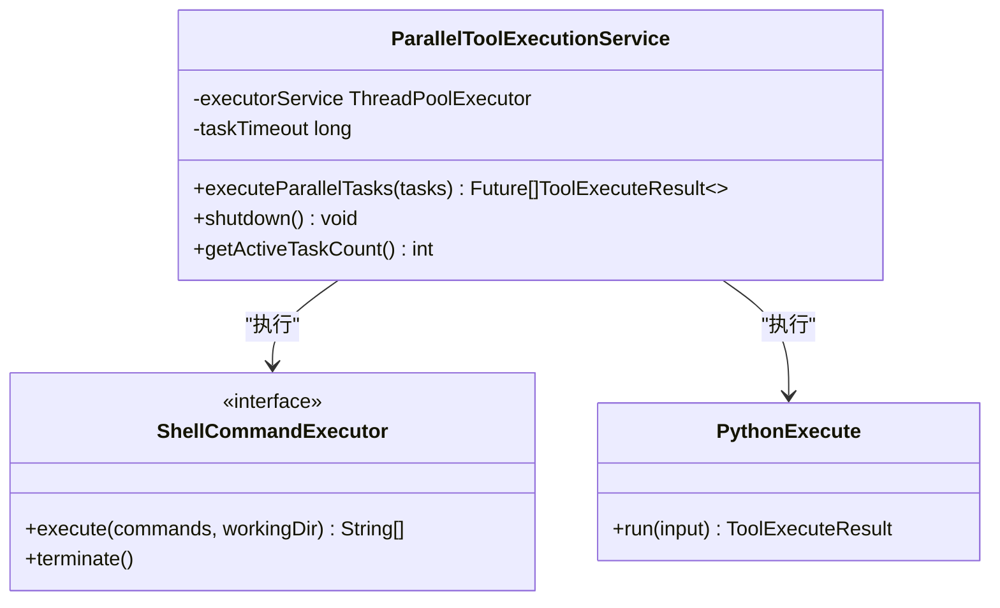
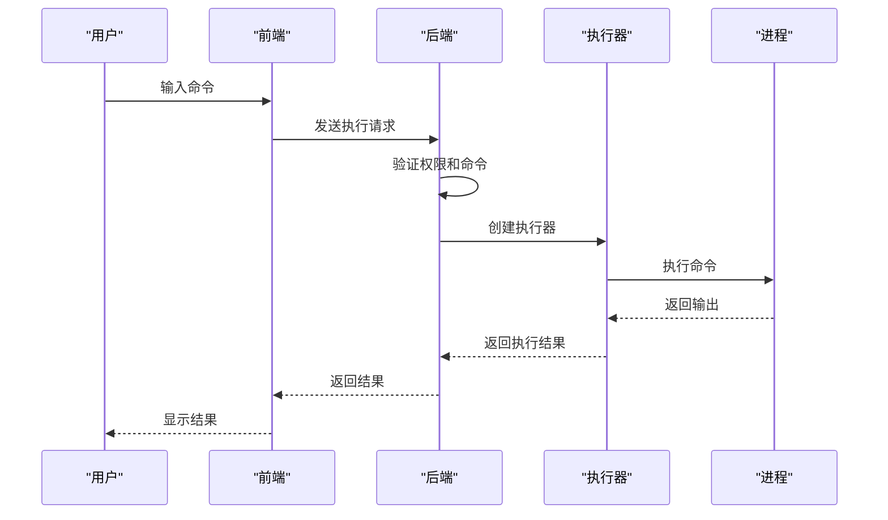

# 脚本执行工具

<cite>
**本文档引用的文件**  
- [ShellCommandExecutor.java](file://src/main/java/com/alibaba/cloud/ai/lynxe/tool/bash/ShellCommandExecutor.java)
- [ShellExecutorFactory.java](file://src/main/java/com/alibaba/cloud/ai/lynxe/tool/bash/ShellExecutorFactory.java)
- [LinuxShellExecutor.java](file://src/main/java/com/alibaba/cloud/ai/lynxe/tool/bash/LinuxShellExecutor.java)
- [WindowsShellExecutor.java](file://src/main/java/com/alibaba/cloud/ai/lynxe/tool/bash/WindowsShellExecutor.java)
- [MacShellExecutor.java](file://src/main/java/com/alibaba/cloud/ai/lynxe/tool/bash/MacShellExecutor.java)
- [ExecuteCommandResult.java](file://src/main/java/com/alibaba/cloud/ai/lynxe/tool/code/ExecuteCommandResult.java)
- [CodeExecutionResult.java](file://src/main/java/com/alibaba/cloud/ai/lynxe/tool/code/CodeExecutionResult.java)
- [ToolExecuteResult.java](file://src/main/java/com/alibaba/cloud/ai/lynxe/tool/code/ToolExecuteResult.java)
- [CodeUtils.java](file://src/main/java/com/alibaba/cloud/ai/lynxe/tool/code/CodeUtils.java)
- [PythonExecute.java](file://src/main/java/com/alibaba/cloud/ai/lynxe/tool/code/PythonExecute.java)
- [ParallelToolExecutionService.java](file://src/main/java/com/alibaba/cloud/ai/lynxe/runtime/service/ParallelToolExecutionService.java)
</cite>

## 目录
1. [简介](#简介)
2. [核心组件](#核心组件)
3. [跨平台执行机制](#跨平台执行机制)
4. [命令执行与输出捕获](#命令执行与输出捕获)
5. [超时控制与错误处理](#超时控制与错误处理)
6. [Python脚本执行支持](#python脚本执行支持)
7. [执行结果封装](#执行结果封装)
8. [并行执行服务](#并行执行服务)
9. [安全防护措施](#安全防护措施)
10. [实际应用案例](#实际应用案例)

## 简介
脚本执行工具是系统中用于安全执行各种系统命令和脚本的核心组件。该工具提供了跨平台的命令执行能力，支持Linux、Windows和Mac操作系统，并具备完善的超时控制、错误处理和安全防护机制。工具通过工厂模式根据操作系统类型自动选择合适的执行器，并提供了对Python脚本的专门支持。

## 核心组件

脚本执行工具由多个核心组件构成，包括Shell命令执行器、执行器工厂、结果封装类和并行执行服务。这些组件协同工作，提供完整的脚本执行功能。

**核心组件**
- [ShellCommandExecutor.java](file://src/main/java/com/alibaba/cloud/ai/lynxe/tool/bash/ShellCommandExecutor.java#L1-L57)
- [ShellExecutorFactory.java](file://src/main/java/com/alibaba/cloud/ai/lynxe/tool/bash/ShellExecutorFactory.java#L1-L60)
- [ExecuteCommandResult.java](file://src/main/java/com/alibaba/cloud/ai/lynxe/tool/code/ExecuteCommandResult.java#L1-L41)
- [ToolExecuteResult.java](file://src/main/java/com/alibaba/cloud/ai/lynxe/tool/code/ToolExecuteResult.java#L1-L60)

## 跨平台执行机制

脚本执行工具通过ShellExecutorFactory工厂类实现跨平台执行机制。工厂类根据当前操作系统的类型创建相应的Shell命令执行器，确保在不同平台上都能正确执行命令。

**图示来源**
- [ShellCommandExecutor.java](file://src/main/java/com/alibaba/cloud/ai/lynxe/tool/bash/ShellCommandExecutor.java#L1-L57)
- [ShellExecutorFactory.java](file://src/main/java/com/alibaba/cloud/ai/lynxe/tool/bash/ShellExecutorFactory.java#L1-L60)
- [LinuxShellExecutor.java](file://src/main/java/com/alibaba/cloud/ai/lynxe/tool/bash/LinuxShellExecutor.java#L1-L160)
- [WindowsShellExecutor.java](file://src/main/java/com/alibaba/cloud/ai/lynxe/tool/bash/WindowsShellExecutor.java#L1-L166)

**跨平台执行机制**
- [ShellExecutorFactory.java](file://src/main/java/com/alibaba/cloud/ai/lynxe/tool/bash/ShellExecutorFactory.java#L1-L60)
- [ShellCommandExecutor.java](file://src/main/java/com/alibaba/cloud/ai/lynxe/tool/bash/ShellCommandExecutor.java#L1-L57)

## 命令执行与输出捕获

脚本执行工具提供了完整的命令执行和输出捕获功能。每个平台的执行器都实现了标准的执行流程，包括进程创建、输入输出流处理和结果收集。

### 执行流程

**图示来源**
- [LinuxShellExecutor.java](file://src/main/java/com/alibaba/cloud/ai/lynxe/tool/bash/LinuxShellExecutor.java#L48-L160)
- [WindowsShellExecutor.java](file://src/main/java/com/alibaba/cloud/ai/lynxe/tool/bash/WindowsShellExecutor.java#L48-L166)

**命令执行与输出捕获**
- [LinuxShellExecutor.java](file://src/main/java/com/alibaba/cloud/ai/lynxe/tool/bash/LinuxShellExecutor.java#L48-L160)
- [WindowsShellExecutor.java](file://src/main/java/com/alibaba/cloud/ai/lynxe/tool/bash/WindowsShellExecutor.java#L48-L166)

## 超时控制与错误处理

脚本执行工具实现了完善的超时控制和错误处理机制，确保长时间运行的命令不会阻塞系统，并能正确处理各种异常情况。

### 超时处理机制

**图示来源**
- [LinuxShellExecutor.java](file://src/main/java/com/alibaba/cloud/ai/lynxe/tool/bash/LinuxShellExecutor.java#L76-L87)
- [WindowsShellExecutor.java](file://src/main/java/com/alibaba/cloud/ai/lynxe/tool/bash/WindowsShellExecutor.java#L80-L88)

### 错误处理策略
工具采用分层的错误处理策略，包括：
1. **异常捕获**：捕获所有执行过程中的异常
2. **日志记录**：详细记录错误信息和堆栈跟踪
3. **结果封装**：将错误信息封装在执行结果中返回
4. **进程清理**：确保异常情况下正确清理进程资源

**超时控制与错误处理**
- [LinuxShellExecutor.java](file://src/main/java/com/alibaba/cloud/ai/lynxe/tool/bash/LinuxShellExecutor.java#L76-L99)
- [WindowsShellExecutor.java](file://src/main/java/com/alibaba/cloud/ai/lynxe/tool/bash/WindowsShellExecutor.java#L80-L101)

## Python脚本执行支持

脚本执行工具通过PythonExecute类提供了对Python脚本的专门支持，允许执行Python代码并获取执行结果。

**图示来源**
- [PythonExecute.java](file://src/main/java/com/alibaba/cloud/ai/lynxe/tool/code/PythonExecute.java#L1-L246)
- [CodeUtils.java](file://src/main/java/com/alibaba/cloud/ai/lynxe/tool/code/CodeUtils.java#L1-L220)
- [CodeExecutionResult.java](file://src/main/java/com/alibaba/cloud/ai/lynxe/tool/code/CodeExecutionResult.java#L1-L51)

**Python脚本执行支持**
- [PythonExecute.java](file://src/main/java/com/alibaba/cloud/ai/lynxe/tool/code/PythonExecute.java#L1-L246)
- [CodeUtils.java](file://src/main/java/com/alibaba/cloud/ai/lynxe/tool/code/CodeUtils.java#L1-L220)

## 执行结果封装

脚本执行工具通过多个结果封装类来表示执行结果，确保结果信息的完整性和一致性。

**图示来源**
- [ExecuteCommandResult.java](file://src/main/java/com/alibaba/cloud/ai/lynxe/tool/code/ExecuteCommandResult.java#L1-L41)
- [CodeExecutionResult.java](file://src/main/java/com/alibaba/cloud/ai/lynxe/tool/code/CodeExecutionResult.java#L1-L51)
- [ToolExecuteResult.java](file://src/main/java/com/alibaba/cloud/ai/lynxe/tool/code/ToolExecuteResult.java#L1-L60)

**执行结果封装**
- [ExecuteCommandResult.java](file://src/main/java/com/alibaba/cloud/ai/lynxe/tool/code/ExecuteCommandResult.java#L1-L41)
- [CodeExecutionResult.java](file://src/main/java/com/alibaba/cloud/ai/lynxe/tool/code/CodeExecutionResult.java#L1-L51)
- [ToolExecuteResult.java](file://src/main/java/com/alibaba/cloud/ai/lynxe/tool/code/ToolExecuteResult.java#L1-L60)

## 并行执行服务

并行执行服务（ParallelToolExecutionService）负责管理多个工具的并行执行，提高执行效率。

**图示来源**
- [ParallelToolExecutionService.java](file://src/main/java/com/alibaba/cloud/ai/lynxe/runtime/service/ParallelToolExecutionService.java#L1-L100)

**并行执行服务**
- [ParallelToolExecutionService.java](file://src/main/java/com/alibaba/cloud/ai/lynxe/runtime/service/ParallelToolExecutionService.java#L1-L100)

## 安全防护措施

脚本执行工具实施了多层次的安全防护措施，确保执行过程的安全性。

### 安全机制
1. **安全沙箱**：所有命令在受限环境中执行
2. **命令白名单**：限制可执行的命令类型
3. **资源限制**：设置CPU、内存和执行时间限制
4. **权限管理**：基于角色的访问控制
5. **输入验证**：对输入参数进行严格验证

**安全防护措施**
- [ShellCommandExecutor.java](file://src/main/java/com/alibaba/cloud/ai/lynxe/tool/bash/ShellCommandExecutor.java#L1-L57)
- [PythonExecute.java](file://src/main/java/com/alibaba/cloud/ai/lynxe/tool/code/PythonExecute.java#L1-L246)

## 实际应用案例

### 安全执行系统命令

**图示来源**
- [ShellExecutorFactory.java](file://src/main/java/com/alibaba/cloud/ai/lynxe/tool/bash/ShellExecutorFactory.java#L1-L60)
- [PythonExecute.java](file://src/main/java/com/alibaba/cloud/ai/lynxe/tool/code/PythonExecute.java#L1-L246)

**实际应用案例**
- [ShellExecutorFactory.java](file://src/main/java/com/alibaba/cloud/ai/lynxe/tool/bash/ShellExecutorFactory.java#L1-L60)
- [PythonExecute.java](file://src/main/java/com/alibaba/cloud/ai/lynxe/tool/code/PythonExecute.java#L1-L246)