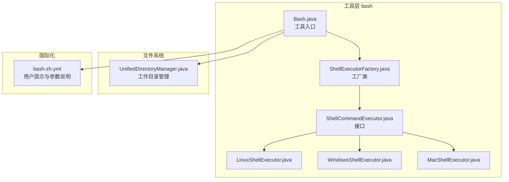
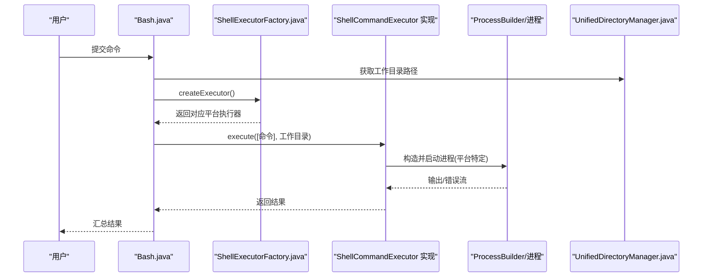
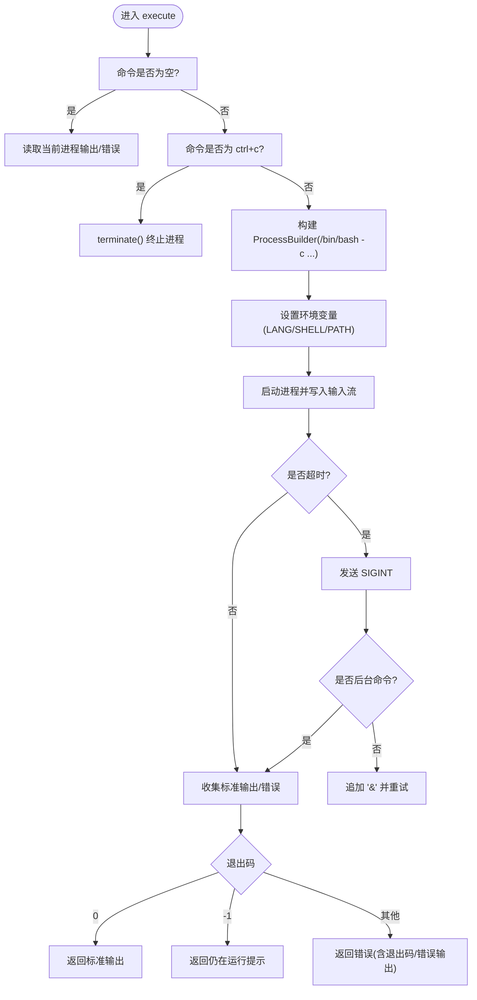
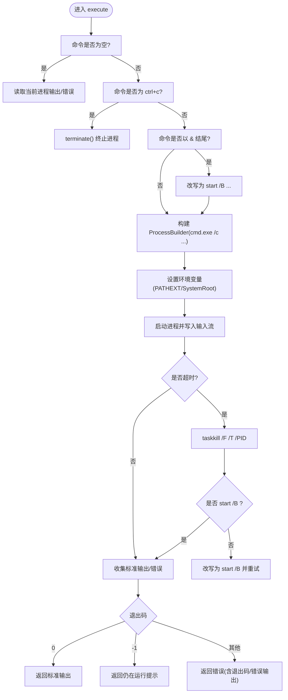
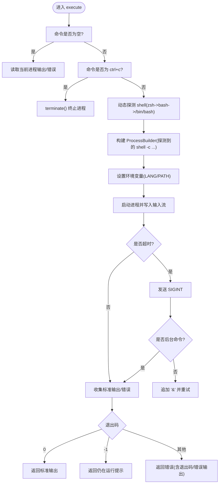
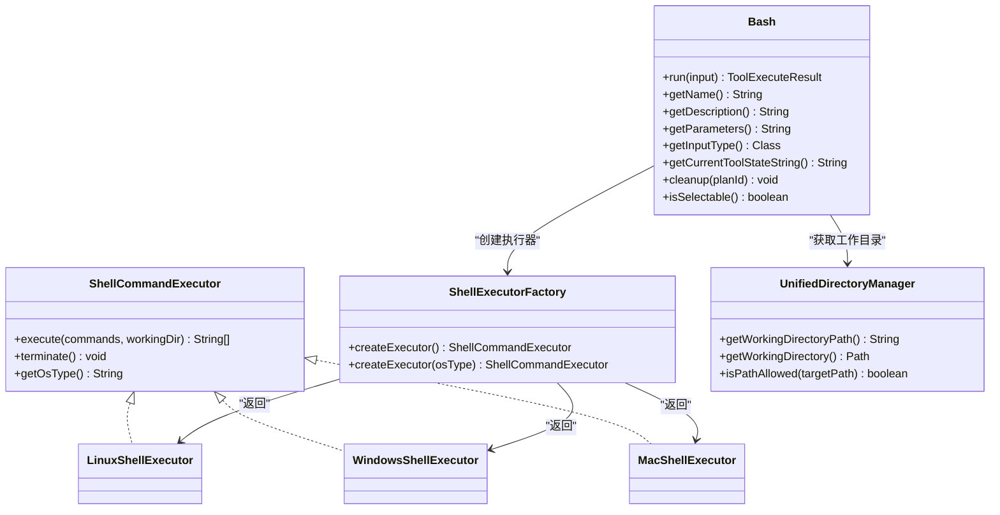

# 跨平台脚本执行

<cite>
**本文引用的文件列表**
- [ShellCommandExecutor.java](file://src/main/java/com/alibaba/cloud/ai/lynxe/tool/bash/ShellCommandExecutor.java)
- [ShellExecutorFactory.java](file://src/main/java/com/alibaba/cloud/ai/lynxe/tool/bash/ShellExecutorFactory.java)
- [LinuxShellExecutor.java](file://src/main/java/com/alibaba/cloud/ai/lynxe/tool/bash/LinuxShellExecutor.java)
- [WindowsShellExecutor.java](file://src/main/java/com/alibaba/cloud/ai/lynxe/tool/bash/WindowsShellExecutor.java)
- [MacShellExecutor.java](file://src/main/java/com/alibaba/cloud/ai/lynxe/tool/bash/MacShellExecutor.java)
- [Bash.java](file://src/main/java/com/alibaba/cloud/ai/lynxe/tool/bash/Bash.java)
- [UnifiedDirectoryManager.java](file://src/main/java/com/alibaba/cloud/ai/lynxe/tool/filesystem/UnifiedDirectoryManager.java)
- [bash-zh.yml](file://src/main/resources/i18n/tools/bash-zh.yml)
</cite>

## 目录
1. [引言](#引言)
2. [项目结构](#项目结构)
3. [核心组件](#核心组件)
4. [架构总览](#架构总览)
5. [组件详解](#组件详解)
6. [依赖关系分析](#依赖关系分析)
7. [性能与可靠性](#性能与可靠性)
8. [故障排查指南](#故障排查指南)
9. [结论](#结论)
10. [附录](#附录)

## 引言
本文件系统性梳理跨平台脚本执行机制，重点解析 ShellCommandExecutor 接口如何统一命令执行流程，ShellExecutorFactory 如何按操作系统动态选择 LinuxShellExecutor、WindowsShellExecutor 或 MacShellExecutor，以及各平台执行器对本地 shell 环境的适配策略（命令行构造、环境变量处理、编码转换）。同时，详细说明进程创建、标准输出/错误流捕获、超时控制与异常终止的实现细节，并通过实际使用场景给出操作建议与性能优化策略。

## 项目结构
与跨平台脚本执行直接相关的模块位于工具层 bash 包内，Bash 工具作为入口，通过 ShellExecutorFactory 获取对应平台执行器，再由执行器封装进程生命周期管理与输出收集。

图表来源
- [Bash.java](file://src/main/java/com/alibaba/cloud/ai/lynxe/tool/bash/Bash.java#L82-L105)
- [ShellExecutorFactory.java](file://src/main/java/com/alibaba/cloud/ai/lynxe/tool/bash/ShellExecutorFactory.java#L28-L59)
- [ShellCommandExecutor.java](file://src/main/java/com/alibaba/cloud/ai/lynxe/tool/bash/ShellCommandExecutor.java#L24-L56)
- [LinuxShellExecutor.java](file://src/main/java/com/alibaba/cloud/ai/lynxe/tool/bash/LinuxShellExecutor.java#L48-L159)
- [WindowsShellExecutor.java](file://src/main/java/com/alibaba/cloud/ai/lynxe/tool/bash/WindowsShellExecutor.java#L48-L166)
- [MacShellExecutor.java](file://src/main/java/com/alibaba/cloud/ai/lynxe/tool/bash/MacShellExecutor.java#L51-L225)
- [UnifiedDirectoryManager.java](file://src/main/java/com/alibaba/cloud/ai/lynxe/tool/filesystem/UnifiedDirectoryManager.java#L95-L105)
- [bash-zh.yml](file://src/main/resources/i18n/tools/bash-zh.yml#L1-L17)

章节来源
- [Bash.java](file://src/main/java/com/alibaba/cloud/ai/lynxe/tool/bash/Bash.java#L82-L105)
- [ShellExecutorFactory.java](file://src/main/java/com/alibaba/cloud/ai/lynxe/tool/bash/ShellExecutorFactory.java#L28-L59)

## 核心组件
- ShellCommandExecutor：跨平台命令执行接口，定义 execute(List<String>, String) 与 terminate()，并提供默认 getOsType()。
- ShellExecutorFactory：根据当前或指定操作系统类型返回具体执行器实例。
- LinuxShellExecutor / WindowsShellExecutor / MacShellExecutor：分别封装 Linux、Windows、macOS 的进程创建、环境变量设置、编码处理、超时与终止策略。
- Bash：面向用户的工具入口，负责接收命令、选择执行器、传递工作目录并汇总结果。
- UnifiedDirectoryManager：提供工作目录路径，供执行器设置 ProcessBuilder 的工作目录。
- bash-zh.yml：提供用户侧的参数说明与行为提示，包括长时间运行命令、交互式命令、超时处理等。

章节来源
- [ShellCommandExecutor.java](file://src/main/java/com/alibaba/cloud/ai/lynxe/tool/bash/ShellCommandExecutor.java#L24-L56)
- [ShellExecutorFactory.java](file://src/main/java/com/alibaba/cloud/ai/lynxe/tool/bash/ShellExecutorFactory.java#L28-L59)
- [LinuxShellExecutor.java](file://src/main/java/com/alibaba/cloud/ai/lynxe/tool/bash/LinuxShellExecutor.java#L48-L159)
- [WindowsShellExecutor.java](file://src/main/java/com/alibaba/cloud/ai/lynxe/tool/bash/WindowsShellExecutor.java#L48-L166)
- [MacShellExecutor.java](file://src/main/java/com/alibaba/cloud/ai/lynxe/tool/bash/MacShellExecutor.java#L51-L225)
- [Bash.java](file://src/main/java/com/alibaba/cloud/ai/lynxe/tool/bash/Bash.java#L82-L105)
- [UnifiedDirectoryManager.java](file://src/main/java/com/alibaba/cloud/ai/lynxe/tool/filesystem/UnifiedDirectoryManager.java#L95-L105)
- [bash-zh.yml](file://src/main/resources/i18n/tools/bash-zh.yml#L1-L17)

## 架构总览
下图展示了从 Bash 工具到具体执行器的调用链路，以及工作目录与环境变量注入的关键点。

图表来源
- [Bash.java](file://src/main/java/com/alibaba/cloud/ai/lynxe/tool/bash/Bash.java#L82-L105)
- [ShellExecutorFactory.java](file://src/main/java/com/alibaba/cloud/ai/lynxe/tool/bash/ShellExecutorFactory.java#L28-L59)
- [UnifiedDirectoryManager.java](file://src/main/java/com/alibaba/cloud/ai/lynxe/tool/filesystem/UnifiedDirectoryManager.java#L95-L105)

## 组件详解

### ShellCommandExecutor 接口
- 职责：统一跨平台命令执行能力，定义 execute(List<String>, String)、terminate()，并提供默认 getOsType()。
- 设计要点：接口最小化，便于扩展新平台；默认方法用于快速识别当前系统类型。

章节来源
- [ShellCommandExecutor.java](file://src/main/java/com/alibaba/cloud/ai/lynxe/tool/bash/ShellCommandExecutor.java#L24-L56)

### ShellExecutorFactory 工厂
- 职责：根据当前系统属性或显式 osType 参数，返回 LinuxShellExecutor、WindowsShellExecutor 或 MacShellExecutor。
- 关键点：
  - 自动检测：通过 System.getProperty("os.name") 判断。
  - 显式指定：支持传入 "windows"/"mac"/"linux"。
  - 错误处理：不支持的 osType 抛出非法参数异常。

章节来源
- [ShellExecutorFactory.java](file://src/main/java/com/alibaba/cloud/ai/lynxe/tool/bash/ShellExecutorFactory.java#L28-L59)

### LinuxShellExecutor 执行器
- 平台特性：
  - 使用 /bin/bash -c 执行命令。
  - 设置 LANG=en_US.UTF-8、SHELL=/bin/bash、PATH 追加 /usr/local/bin。
  - 默认超时 60 秒；非后台命令（不以 & 结尾）设置等待超时，超时后先发送 SIGINT，再强制终止并可重试为后台执行。
  - 支持空命令获取当前进程额外日志；支持 ctrl+c 中断当前进程。
- 编码与输出：
  - 标准输出与错误流均以 UTF-8 解码。
- 终止策略：
  - 先 destroy() 发送 SIGINT，等待 5 秒；若仍存活则 destroyForcibly() 强制终止。

图表来源
- [LinuxShellExecutor.java](file://src/main/java/com/alibaba/cloud/ai/lynxe/tool/bash/LinuxShellExecutor.java#L48-L159)

章节来源
- [LinuxShellExecutor.java](file://src/main/java/com/alibaba/cloud/ai/lynxe/tool/bash/LinuxShellExecutor.java#L48-L159)

### WindowsShellExecutor 执行器
- 平台特性：
  - 使用 cmd.exe /c 执行命令。
  - 对后台命令进行特殊处理：将命令改写为 start /B 前缀，避免阻塞前台。
  - 设置 PATHEXT、SystemRoot 等环境变量。
  - 默认超时 60 秒；非 start /B 命令设置等待超时，超时后终止并可重试为后台。
  - 支持空命令获取当前进程日志；支持 ctrl+c 中断当前进程。
- 编码与输出：
  - 标准输出与错误流以 GBK 解码（Windows 默认编码）。
- 终止策略：
  - 使用 taskkill /F /T /PID 强制终止进程树；随后等待 5 秒，若仍存活则 destroyForcibly()。

图表来源
- [WindowsShellExecutor.java](file://src/main/java/com/alibaba/cloud/ai/lynxe/tool/bash/WindowsShellExecutor.java#L48-L166)

章节来源
- [WindowsShellExecutor.java](file://src/main/java/com/alibaba/cloud/ai/lynxe/tool/bash/WindowsShellExecutor.java#L48-L166)

### MacShellExecutor 执行器
- 平台特性：
  - 动态探测最佳可用 shell：优先 zsh，其次 bash，最后回退到 /bin/bash。
  - 使用探测到的 shell -c 执行命令。
  - 设置 LANG=en_US.UTF-8、PATH 追加 /usr/local/bin。
  - 默认超时 60 秒；非后台命令设置等待超时，超时后先发送 SIGINT，再强制终止并可重试为后台。
  - 支持空命令获取当前进程日志；支持 ctrl+c 中断当前进程。
- 编码与输出：
  - 标准输出与错误流以 UTF-8 解码。
- 终止策略：
  - 先 destroy() 发送 SIGINT，等待 5 秒；若仍存活则 destroyForcibly() 强制终止。

图表来源
- [MacShellExecutor.java](file://src/main/java/com/alibaba/cloud/ai/lynxe/tool/bash/MacShellExecutor.java#L51-L225)

章节来源
- [MacShellExecutor.java](file://src/main/java/com/alibaba/cloud/ai/lynxe/tool/bash/MacShellExecutor.java#L51-L225)

### Bash 工具入口
- 职责：接收用户命令，记录最后一次命令与结果，通过 ShellExecutorFactory 创建执行器并执行，最终将结果封装为工具执行结果。
- 关键点：
  - 从 UnifiedDirectoryManager 获取工作目录路径并传给执行器。
  - 记录 lastCommand 与 lastResult，便于状态查询。
  - 国际化描述包含当前操作系统名称，参数说明来自 bash-zh.yml。

章节来源
- [Bash.java](file://src/main/java/com/alibaba/cloud/ai/lynxe/tool/bash/Bash.java#L82-L105)
- [UnifiedDirectoryManager.java](file://src/main/java/com/alibaba/cloud/ai/lynxe/tool/filesystem/UnifiedDirectoryManager.java#L95-L105)
- [bash-zh.yml](file://src/main/resources/i18n/tools/bash-zh.yml#L1-L17)

## 依赖关系分析

图表来源
- [ShellCommandExecutor.java](file://src/main/java/com/alibaba/cloud/ai/lynxe/tool/bash/ShellCommandExecutor.java#L24-L56)
- [ShellExecutorFactory.java](file://src/main/java/com/alibaba/cloud/ai/lynxe/tool/bash/ShellExecutorFactory.java#L28-L59)
- [LinuxShellExecutor.java](file://src/main/java/com/alibaba/cloud/ai/lynxe/tool/bash/LinuxShellExecutor.java#L48-L159)
- [WindowsShellExecutor.java](file://src/main/java/com/alibaba/cloud/ai/lynxe/tool/bash/WindowsShellExecutor.java#L48-L166)
- [MacShellExecutor.java](file://src/main/java/com/alibaba/cloud/ai/lynxe/tool/bash/MacShellExecutor.java#L51-L225)
- [Bash.java](file://src/main/java/com/alibaba/cloud/ai/lynxe/tool/bash/Bash.java#L82-L105)
- [UnifiedDirectoryManager.java](file://src/main/java/com/alibaba/cloud/ai/lynxe/tool/filesystem/UnifiedDirectoryManager.java#L95-L105)

## 性能与可靠性
- 超时与重试
  - 默认超时 60 秒，非后台命令设置等待；超时后先发送 SIGINT，再强制终止并可重试为后台执行，避免阻塞主线程。
  - Windows 后台命令通过 start /B 避免前台阻塞，超时后同样重试为后台。
- 编码一致性
  - Linux/macOS 使用 UTF-8 解码标准输出/错误流，Windows 使用 GBK，确保不同平台输出正确解析。
- 环境变量
  - Linux/macOS 设置 LANG 与 PATH，Windows 设置 PATHEXT 与 SystemRoot，提升兼容性与可执行性。
- 终止策略
  - 先优雅终止（destroy），等待 5 秒；若仍存活则强制终止（destroyForcibly），保证资源回收。
- 工作目录隔离
  - 通过 UnifiedDirectoryManager 限定工作目录范围，避免越权访问外部路径，提高安全性。

章节来源
- [LinuxShellExecutor.java](file://src/main/java/com/alibaba/cloud/ai/lynxe/tool/bash/LinuxShellExecutor.java#L48-L159)
- [WindowsShellExecutor.java](file://src/main/java/com/alibaba/cloud/ai/lynxe/tool/bash/WindowsShellExecutor.java#L48-L166)
- [MacShellExecutor.java](file://src/main/java/com/alibaba/cloud/ai/lynxe/tool/bash/MacShellExecutor.java#L51-L225)
- [UnifiedDirectoryManager.java](file://src/main/java/com/alibaba/cloud/ai/lynxe/tool/filesystem/UnifiedDirectoryManager.java#L95-L105)

## 故障排查指南
- 命令长时间运行或无响应
  - 行为提示：当退出码为 -1 时，表示进程仍在运行。应再次调用空命令获取更多日志，或发送 ctrl+c 中断进程。
  - 处理方式：Linux/macOS 会发送 SIGINT 并等待；Windows 会使用 taskkill 终止进程树。
- 超时处理
  - 当出现“Command timed out. Sending SIGINT to the process”提示时，应尝试在后台重新运行该命令。
- 编码乱码
  - Windows 输出默认使用 GBK，Linux/macOS 使用 UTF-8。如遇乱码，请确认目标平台编码设置是否正确。
- 进程未退出
  - 若 terminate() 后进程仍存在，检查是否被子进程持有；Windows 可通过 taskkill /F /T /PID 强制终止。
- 工作目录权限
  - 确保命令在 UnifiedDirectoryManager 的工作目录范围内执行，避免路径越权导致失败。

章节来源
- [bash-zh.yml](file://src/main/resources/i18n/tools/bash-zh.yml#L1-L17)
- [LinuxShellExecutor.java](file://src/main/java/com/alibaba/cloud/ai/lynxe/tool/bash/LinuxShellExecutor.java#L103-L121)
- [WindowsShellExecutor.java](file://src/main/java/com/alibaba/cloud/ai/lynxe/tool/bash/WindowsShellExecutor.java#L105-L123)
- [MacShellExecutor.java](file://src/main/java/com/alibaba/cloud/ai/lynxe/tool/bash/MacShellExecutor.java#L107-L125)
- [UnifiedDirectoryManager.java](file://src/main/java/com/alibaba/cloud/ai/lynxe/tool/filesystem/UnifiedDirectoryManager.java#L186-L214)

## 结论
该跨平台脚本执行机制通过统一接口与工厂模式，将 Linux、Windows、macOS 的差异封装在各自执行器中，实现了稳定的命令执行、输出捕获、超时控制与异常终止。配合工作目录管理与编码适配，能够在多平台上一致地执行用户命令并提供可靠的结果反馈。建议在长时间运行命令时采用后台执行与日志轮询策略，并在 Windows 环境下注意 GBK 编码的输出解析。

## 附录

### 使用示例（基于现有实现）
- 在 Bash 工具中提交命令，工具内部会：
  - 通过 ShellExecutorFactory.createExecutor() 获取对应平台执行器。
  - 从 UnifiedDirectoryManager 获取工作目录路径并传入执行器。
  - 将命令包装为单元素列表并执行，返回结果字符串列表。
- 用户提示与参数说明可参考 bash-zh.yml，其中包含长时间运行命令、交互式命令与超时处理的指导。

章节来源
- [Bash.java](file://src/main/java/com/alibaba/cloud/ai/lynxe/tool/bash/Bash.java#L82-L105)
- [ShellExecutorFactory.java](file://src/main/java/com/alibaba/cloud/ai/lynxe/tool/bash/ShellExecutorFactory.java#L28-L59)
- [UnifiedDirectoryManager.java](file://src/main/java/com/alibaba/cloud/ai/lynxe/tool/filesystem/UnifiedDirectoryManager.java#L95-L105)
- [bash-zh.yml](file://src/main/resources/i18n/tools/bash-zh.yml#L1-L17)