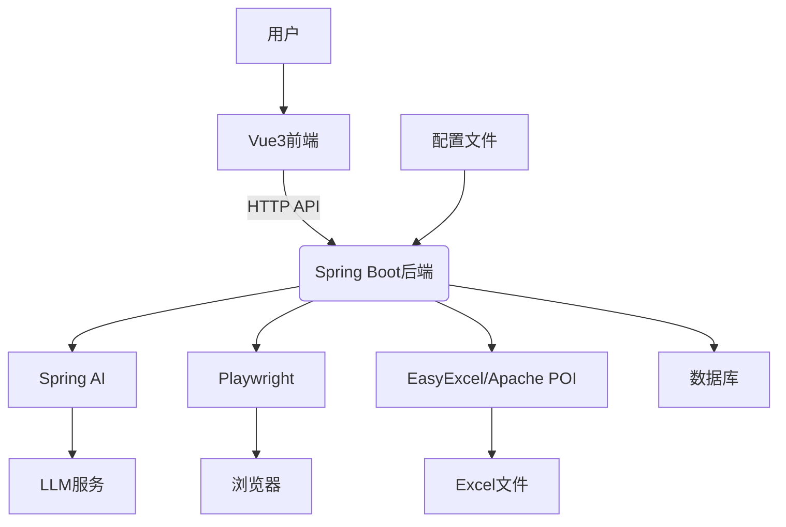

# 技术栈与依赖

<cite>
**本文档引用的文件**  
- [pom.xml](file://pom.xml)
- [package.json](file://ui-vue3/package.json)
- [OpenLynxeSpringBootApplication.java](file://src/main/java/com/alibaba/cloud/ai/lynxe/OpenLynxeSpringBootApplication.java)
- [application.yml](file://src/main/resources/application.yml)
- [vite.config.ts](file://ui-vue3/vite.config.ts)
- [PlaywrightConfig.java](file://src/main/java/com/alibaba/cloud/ai/lynxe/config/PlaywrightConfig.java)
- [SpringBootPlaywrightInitializer.java](file://src/main/java/com/alibaba/cloud/ai/lynxe/tool/browser/SpringBootPlaywrightInitializer.java)
- [OpenAICompatibleController.java](file://src/main/java/com/alibaba/cloud/ai/lynxe/adapter/controller/OpenAICompatibleController.java)
- [BaseAgent.java](file://src/main/java/com/alibaba/cloud/ai/lynxe/agent/BaseAgent.java)
- [ExcelProcessorTool.java](file://src/main/java/com/alibaba/cloud/ai/lynxe/tool/excelProcessor/ExcelProcessorTool.java)
- [DatabaseReadTool.java](file://src/main/java/com/alibaba/cloud/ai/lynxe/tool/database/DatabaseReadTool.java)
- [PlanTemplateService.java](file://src/main/java/com/alibaba/cloud/ai/lynxe/planning/service/PlanTemplateService.java)
</cite>

## 目录
1. [技术栈概览](#技术栈概览)
2. [编程语言与版本](#编程语言与版本)
3. [Spring Boot框架应用](#spring-boot框架应用)
4. [Spring AI框架应用](#spring-ai框架应用)
5. [前端框架与组件化](#前端框架与组件化)
6. [浏览器自动化集成](#浏览器自动化集成)
7. [文件处理模块](#文件处理模块)
8. [关键外部依赖](#关键外部依赖)
9. [技术栈依赖关系图](#技术栈依赖关系图)

## 技术栈概览

JManus项目采用现代化的技术栈，构建了一个功能强大的AI代理管理系统。后端基于Java 17和Spring Boot 3.5.6框架，集成了Spring AI 1.0.1用于AI功能实现。前端采用Vue3框架，通过Vite进行构建和开发。项目集成了Playwright 1.55.0用于浏览器自动化，EasyExcel 3.1.5和Apache POI 5.4.1用于文件处理。整个系统通过模块化设计，实现了AI代理、计划执行、数据库操作、文件处理等多种功能。

**Section sources**
- [pom.xml](file://pom.xml#L21)
- [package.json](file://ui-vue3/package.json#L49)
- [README.md](file://README.md#L6)

## 编程语言与版本

JManus项目主要使用两种编程语言：Java和TypeScript。

Java作为后端开发的主要语言，版本为17。项目在pom.xml中明确指定了Java版本：

```xml
<java.version>17</java.version>
```

TypeScript作为前端开发的主要语言，版本为5.3.3。项目在package.json中定义了TypeScript版本：

```json
"typescript": "~5.3.3"
```

选择Java 17是因为它提供了长期支持（LTS）和现代化的语言特性，如密封类、模式匹配等，有助于提高代码质量和开发效率。选择TypeScript是因为它提供了静态类型检查，有助于在开发阶段发现潜在的错误，提高代码的可维护性和可读性。

**Section sources**
- [pom.xml](file://pom.xml#L21)
- [package.json](file://ui-vue3/package.json#L84)

## Spring Boot框架应用

Spring Boot 3.5.6是JManus项目的核心框架，提供了依赖注入、自动配置和启动流程等核心特性。

### 依赖注入

Spring Boot通过@Component、@Service、@Repository等注解实现依赖注入。例如，在DatabaseReadTool类中，通过构造函数注入了多个依赖：

```java
public DatabaseReadTool(LynxeProperties lynxeProperties, DataSourceService dataSourceService,
        ObjectMapper objectMapper, UnifiedDirectoryManager directoryManager, ToolI18nService toolI18nService) {
    this.dataSourceService = dataSourceService;
    this.objectMapper = objectMapper;
    this.directoryManager = directoryManager;
    this.toolI18nService = toolI18nService;
}
```

### 自动配置

Spring Boot的自动配置特性通过@EnableAutoConfiguration注解实现。在OpenLynxeSpringBootApplication类中，@SpringBootApplication注解包含了自动配置功能：

```java
@SpringBootApplication
@EnableScheduling
@EnableJpaRepositories(basePackages = { "com.alibaba.cloud.ai.lynxe" })
@EntityScan(basePackages = { "com.alibaba.cloud.ai.lynxe" })
@EnableFeignClients(basePackages = {"cn.iocoder.cloud.devops.api"})
@ComponentScan(basePackages = { "com.alibaba.cloud.ai.lynxe","cn.iocoder.cloud.devops.api" })
public class OpenLynxeSpringBootApplication {
    // ...
}
```

### 启动流程

项目的启动流程由OpenLynxeSpringBootApplication类的main方法控制。该方法首先检查是否需要初始化Playwright，然后启动Spring Boot应用：

```java
public static void main(String[] args) throws IOException, InterruptedException {
    if (args != null && args.length >= 1 && args[0].equals("playwright-init")) {
        Playwright.create();
        System.out.println("Playwright init finished");
        System.exit(0);
    }
    else {
        SpringApplication.run(OpenLynxeSpringBootApplication.class, args);
    }
}
```

**Section sources**
- [OpenLynxeSpringBootApplication.java](file://src/main/java/com/alibaba/cloud/ai/lynxe/OpenLynxeSpringBootApplication.java#L33)
- [application.yml](file://src/main/resources/application.yml#L3)
- [pom.xml](file://pom.xml#L15)

## Spring AI框架应用

Spring AI 1.0.1在JManus项目中用于实现AI代理和计划执行功能。

### AI代理实现

AI代理的核心是BaseAgent类，它定义了代理的基本行为和状态管理。代理通过LLM（大语言模型）进行决策和执行：

```java
public abstract class BaseAgent {
    protected LlmService llmService;
    protected final LynxeProperties lynxeProperties;
    protected ObjectMapper objectMapper;
    protected final ExecutionStep step;
    // ...
}
```

### 计划执行

计划执行功能通过PlanTemplateService类实现，它负责管理计划模板的版本和执行：

```java
@Service
public class PlanTemplateService implements IPlanTemplateService {
    @Autowired
    private PlanTemplateVersionRepository versionRepository;
    
    @Autowired
    private ObjectMapper objectMapper;
    
    @Transactional
    public VersionSaveResult saveToVersionHistory(String planTemplateId, String planJson) {
        // ...
    }
    // ...
}
```

Spring AI框架的应用使得JManus能够处理复杂的AI任务，如自然语言理解、决策制定和任务执行。

**Section sources**
- [BaseAgent.java](file://src/main/java/com/alibaba/cloud/ai/lynxe/agent/BaseAgent.java#L74)
- [PlanTemplateService.java](file://src/main/java/com/alibaba/cloud/ai/lynxe/planning/service/PlanTemplateService.java#L36)
- [pom.xml](file://pom.xml#L27)

## 前端框架与组件化

JManus的前端采用Vue3框架，通过组件化开发模式构建用户界面。

### Vue3架构设计

前端项目基于Vue3和Vite构建，使用了Pinia进行状态管理，Vue Router进行路由管理。项目结构清晰，组件化程度高：

```typescript
// vite.config.ts
export default defineConfig(({ mode }) => {
  const env = loadEnv(mode, process.cwd(), '')
  return {
    base: env.VITE_BASE_PATH || '/ui',
    build: {
      outDir: env.VITE_OUT_DIR || './ui',
      sourcemap: true,
    },
    server: {
      proxy: {
        '/api': {
          target: 'http://localhost:18080',
          changeOrigin: true,
        },
      },
    },
    plugins: [
      vue(),
      vueJsx(),
      qiankun('sc-ai-manuas', { useDevMode: true }),
    ],
  }
})
```

### 组件化开发模式

前端采用组件化开发模式，将界面拆分为多个可复用的组件。例如，聊天界面由多个组件组成：

- ChatContainer.vue：聊天容器
- ExecutionDetails.vue：执行详情
- ResponseSection.vue：响应区域
- UserInputForm.vue：用户输入表单

这种组件化设计提高了代码的可维护性和可复用性。

**Section sources**
- [vite.config.ts](file://ui-vue3/vite.config.ts#L17)
- [package.json](file://ui-vue3/package.json#L49)
- [ui-vue3/src/components](file://ui-vue3/src/components)

## 浏览器自动化集成

JManus集成了Playwright 1.55.0用于浏览器自动化，实现了网页内容抓取和交互功能。

### Playwright配置

Playwright的配置在PlaywrightConfig类中定义，针对Docker环境进行了特殊处理：

```java
@Configuration
public class PlaywrightConfig {
    @PostConstruct
    public void configurePlaywright() {
        // 设置Playwright浏览器路径
        String browsersPath = System.getenv("PLAYWRIGHT_BROWSERS_PATH");
        if (browsersPath != null && !browsersPath.trim().isEmpty()) {
            System.setProperty("playwright.browsers.path", browsersPath);
        }
        
        // 设置跳过浏览器下载标志
        String skipDownload = System.getenv("PLAYWRIGHT_SKIP_BROWSER_DOWNLOAD");
        if (skipDownload != null && skipDownload.equals("1")) {
            System.setProperty("playwright.skip.browser.download", "true");
        }
        
        // Docker环境特定配置
        if (isDockerEnvironment()) {
            System.setProperty("playwright.browser.headless", "true");
            System.setProperty("playwright.browser.no-sandbox", "true");
            System.setProperty("playwright.browser.disable-dev-shm-usage", "true");
        }
    }
    // ...
}
```

### Spring Boot集成

在Spring Boot环境中，Playwright的初始化需要特殊处理，以解决类加载器问题：

```java
@Component
public class SpringBootPlaywrightInitializer {
    public Playwright createPlaywright() {
        try {
            setupSpringBootEnvironment();
            
            ClassLoader originalClassLoader = Thread.currentThread().getContextClassLoader();
            try {
                ClassLoader newCL = this.getClass().getClassLoader();
                Thread.currentThread().setContextClassLoader(newCL);
                
                Playwright playwright = Playwright.create();
                return playwright;
            } finally {
                Thread.currentThread().setContextClassLoader(originalClassLoader);
            }
        } catch (Exception e) {
            log.error("Failed to create Playwright in Spring Boot environment", e);
            throw new RuntimeException("Failed to initialize Playwright", e);
        }
    }
    // ...
}
```

**Section sources**
- [PlaywrightConfig.java](file://src/main/java/com/alibaba/cloud/ai/lynxe/config/PlaywrightConfig.java#L29)
- [SpringBootPlaywrightInitializer.java](file://src/main/java/com/alibaba/cloud/ai/lynxe/tool/browser/SpringBootPlaywrightInitializer.java#L32)
- [pom.xml](file://pom.xml#L41)

## 文件处理模块

JManus的文件处理模块集成了EasyExcel 3.1.5和Apache POI 5.4.1，提供了强大的Excel处理能力。

### EasyExcel应用

EasyExcel用于处理大规模Excel文件，具有内存占用低、处理速度快的优点。ExcelProcessorTool类使用EasyExcel进行文件创建和数据写入：

```java
public class ExcelProcessorTool extends AbstractBaseTool<ExcelInput> {
    private final IExcelProcessingService excelProcessingService;
    
    private ToolExecuteResult handleCreateFile(ExcelInput input) throws IOException {
        Map<String, List<String>> worksheets = input.getWorksheets();
        excelProcessingService.createExcelFile(currentPlanId, input.getFilePath(), worksheets);
        return success("Excel file created successfully", result);
    }
    // ...
}
```

### Apache POI应用

Apache POI用于处理复杂的Excel格式和功能，如单元格格式化、公式计算等。在pom.xml中定义了POI依赖：

```xml
<dependency>
    <groupId>org.apache.poi</groupId>
    <artifactId>poi-ooxml</artifactId>
    <version>5.4.1</version>
</dependency>
```

文件处理模块的设计使得JManus能够高效地处理各种Excel文件，满足不同场景的需求。

**Section sources**
- [ExcelProcessorTool.java](file://src/main/java/com/alibaba/cloud/ai/lynxe/tool/excelProcessor/ExcelProcessorTool.java#L34)
- [pom.xml](file://pom.xml#L277)
- [pom.xml](file://pom.xml#L359)

## 关键外部依赖

JManus项目依赖多个外部库，以下是关键依赖及其版本：

| 依赖库 | 版本 | 用途 |
| --- | --- | --- |
| Spring Boot | 3.5.6 | 核心框架 |
| Spring AI | 1.0.1 | AI功能实现 |
| Vue | 3.3.8 | 前端框架 |
| Playwright | 1.55.0 | 浏览器自动化 |
| EasyExcel | 3.1.5 | Excel处理 |
| Apache POI | 5.4.1 | Excel处理 |
| Jackson | 2.15.0 | JSON处理 |
| Lombok | 1.18.30 | 代码简化 |
| Hutool | 5.8.25 | 工具类库 |

选择这些技术的原因是它们在各自领域都有成熟的应用和良好的社区支持。Spring Boot和Spring AI提供了强大的后端开发能力，Vue3提供了现代化的前端开发体验，Playwright提供了可靠的浏览器自动化功能，EasyExcel和Apache POI则提供了全面的Excel处理能力。

这些技术之间的协同工作方式如下：Spring Boot作为核心框架，整合了其他所有组件；Spring AI与LLM交互，实现AI功能；Vue3前端通过REST API与后端通信；Playwright在后台执行浏览器自动化任务；EasyExcel和Apache POI处理文件相关的操作。

**Section sources**
- [pom.xml](file://pom.xml)
- [package.json](file://ui-vue3/package.json)

## 技术栈依赖关系图



**Diagram sources**
- [pom.xml](file://pom.xml)
- [package.json](file://ui-vue3/package.json)
- [OpenLynxeSpringBootApplication.java](file://src/main/java/com/alibaba/cloud/ai/lynxe/OpenLynxeSpringBootApplication.java)
- [vite.config.ts](file://ui-vue3/vite.config.ts)

该依赖关系图展示了JManus技术栈中各组件之间的集成模式和通信机制。前端通过HTTP API与后端通信，后端通过Spring AI与LLM服务交互，通过Playwright控制浏览器，通过EasyExcel和Apache POI处理Excel文件，通过JPA与数据库交互。整个系统通过配置文件进行配置，用户通过前端界面与系统交互。