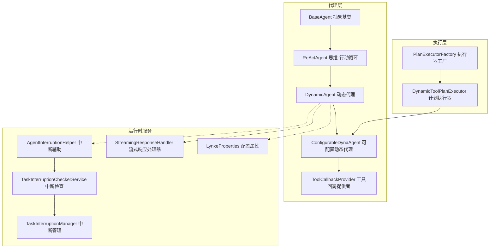
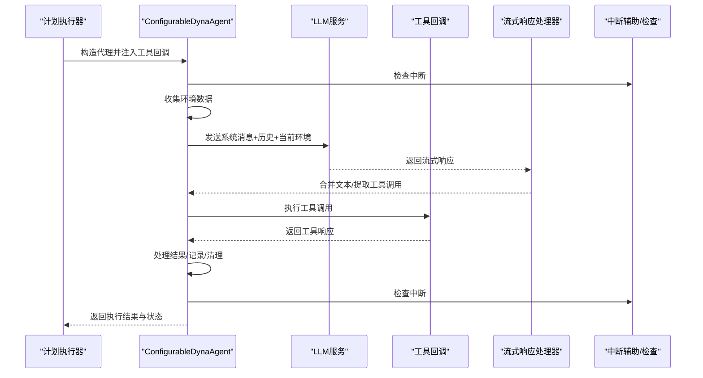
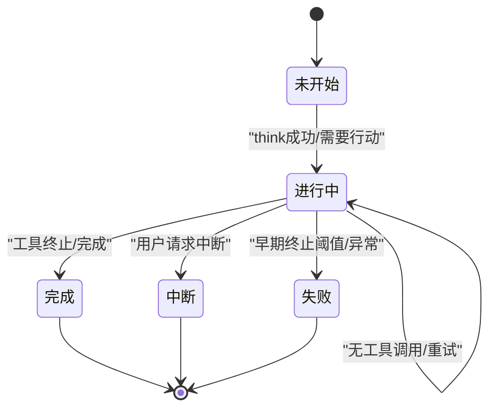
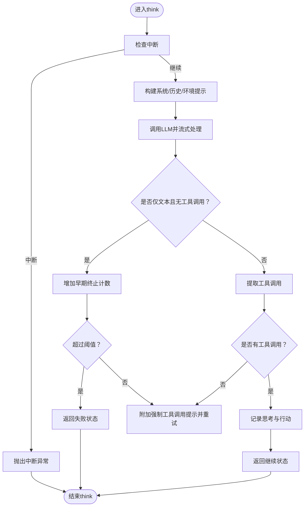
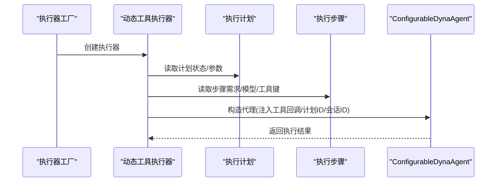
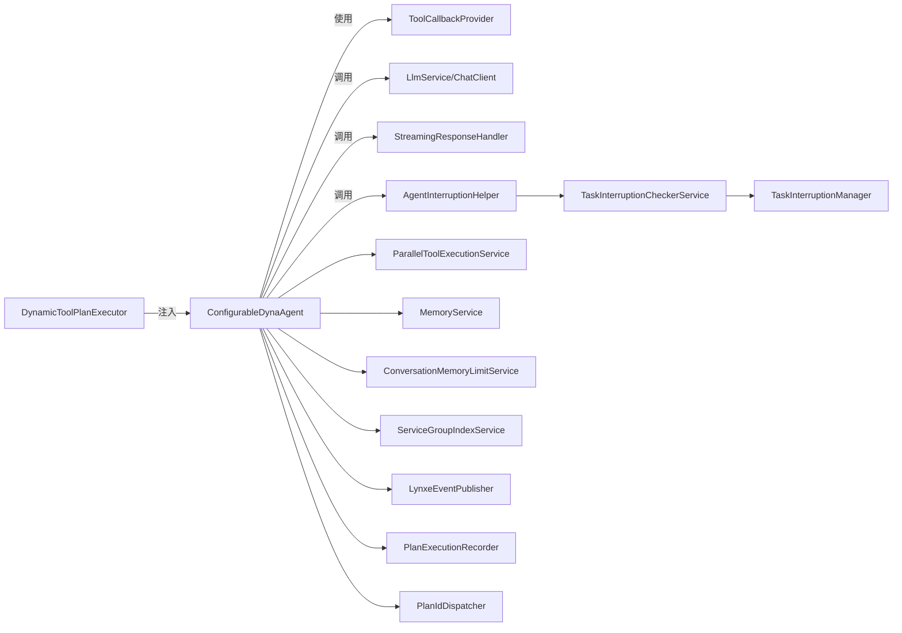

# AI代理

<cite>
**本文引用的文件**
- [DynamicAgent.java](file://src/main/java/com/alibaba/cloud/ai/lynxe/agent/DynamicAgent.java)
- [BaseAgent.java](file://src/main/java/com/alibaba/cloud/ai/lynxe/agent/BaseAgent.java)
- [AgentState.java](file://src/main/java/com/alibaba/cloud/ai/lynxe/agent/AgentState.java)
- [ReActAgent.java](file://src/main/java/com/alibaba/cloud/ai/lynxe/agent/ReActAgent.java)
- [ConfigurableDynaAgent.java](file://src/main/java/com/alibaba/cloud/ai/lynxe/agent/ConfigurableDynaAgent.java)
- [ToolCallbackProvider.java](file://src/main/java/com/alibaba/cloud/ai/lynxe/agent/ToolCallbackProvider.java)
- [DynamicAgentEntity.java](file://src/main/java/com/alibaba/cloud/ai/lynxe/agent/entity/DynamicAgentEntity.java)
- [DynamicToolPlanExecutor.java](file://src/main/java/com/alibaba/cloud/ai/lynxe/runtime/executor/DynamicToolPlanExecutor.java)
- [PlanExecutorFactory.java](file://src/main/java/com/alibaba/cloud/ai/lynxe/runtime/executor/factory/PlanExecutorFactory.java)
- [AgentInterruptionHelper.java](file://src/main/java/com/alibaba/cloud/ai/lynxe/runtime/service/AgentInterruptionHelper.java)
- [TaskInterruptionCheckerService.java](file://src/main/java/com/alibaba/cloud/ai/lynxe/runtime/service/TaskInterruptionCheckerService.java)
- [TaskInterruptionManager.java](file://src/main/java/com/alibaba/cloud/ai/lynxe/runtime/service/TaskInterruptionManager.java)
- [StreamingResponseHandler.java](file://src/main/java/com/alibaba/cloud/ai/lynxe/llm/StreamingResponseHandler.java)
- [LynxeProperties.java](file://src/main/java/com/alibaba/cloud/ai/lynxe/config/LynxeProperties.java)
- [DynamicAgentPlanningTool.java](file://src/main/java/com/alibaba/cloud/ai/lynxe/tool/DynamicAgentPlanningTool.java)
- [SubplanToolWrapper.java](file://src/main/java/com/alibaba/cloud/ai/lynxe/subplan/model/vo/SubplanToolWrapper.java)
</cite>

## 目录
1. [简介](#简介)
2. [项目结构](#项目结构)
3. [核心组件](#核心组件)
4. [架构总览](#架构总览)
5. [详细组件分析](#详细组件分析)
6. [依赖关系分析](#依赖关系分析)
7. [性能考量](#性能考量)
8. [故障排查指南](#故障排查指南)
9. [结论](#结论)
10. [附录](#附录)

## 简介
本文件面向JManus系统中的AI代理子系统，聚焦DynamicAgent作为系统核心执行单元的架构与生命周期管理。文档将深入解析代理状态机（AgentState）、ReAct思维-行动循环、工具回调与可配置代理、与计划执行系统的集成方式、代理间协作与上下文传递、错误处理与中断管理、超时与重试策略，并提供性能优化建议与常见问题排查指引。

## 项目结构
JManus在agent包下提供了完整的代理体系：抽象基类BaseAgent、ReActAgent、具体实现DynamicAgent与ConfigurableDynaAgent，配合工具回调接口ToolCallbackProvider、实体DynamicAgentEntity，以及运行时执行器DynamicToolPlanExecutor与工厂PlanExecutorFactory，共同构成“计划-代理-工具”的闭环。

图表来源
- [DynamicAgent.java](file://src/main/java/com/alibaba/cloud/ai/lynxe/agent/DynamicAgent.java#L1-L120)
- [BaseAgent.java](file://src/main/java/com/alibaba/cloud/ai/lynxe/agent/BaseAgent.java#L1-L120)
- [ReActAgent.java](file://src/main/java/com/alibaba/cloud/ai/lynxe/agent/ReActAgent.java#L1-L97)
- [ConfigurableDynaAgent.java](file://src/main/java/com/alibaba/cloud/ai/lynxe/agent/ConfigurableDynaAgent.java#L1-L120)
- [ToolCallbackProvider.java](file://src/main/java/com/alibaba/cloud/ai/lynxe/agent/ToolCallbackProvider.java#L1-L27)
- [DynamicToolPlanExecutor.java](file://src/main/java/com/alibaba/cloud/ai/lynxe/runtime/executor/DynamicToolPlanExecutor.java#L1-L120)
- [PlanExecutorFactory.java](file://src/main/java/com/alibaba/cloud/ai/lynxe/runtime/executor/factory/PlanExecutorFactory.java#L153-L180)
- [AgentInterruptionHelper.java](file://src/main/java/com/alibaba/cloud/ai/lynxe/runtime/service/AgentInterruptionHelper.java#L1-L84)
- [TaskInterruptionCheckerService.java](file://src/main/java/com/alibaba/cloud/ai/lynxe/runtime/service/TaskInterruptionCheckerService.java#L1-L68)
- [TaskInterruptionManager.java](file://src/main/java/com/alibaba/cloud/ai/lynxe/runtime/service/TaskInterruptionManager.java#L1-L39)
- [StreamingResponseHandler.java](file://src/main/java/com/alibaba/cloud/ai/lynxe/llm/StreamingResponseHandler.java#L1-L200)
- [LynxeProperties.java](file://src/main/java/com/alibaba/cloud/ai/lynxe/config/LynxeProperties.java#L1-L200)

章节来源
- [DynamicAgent.java](file://src/main/java/com/alibaba/cloud/ai/lynxe/agent/DynamicAgent.java#L1-L200)
- [DynamicToolPlanExecutor.java](file://src/main/java/com/alibaba/cloud/ai/lynxe/runtime/executor/DynamicToolPlanExecutor.java#L110-L183)

## 核心组件
- BaseAgent：抽象代理基类，定义统一的执行循环、状态管理、异常包装、最大步数限制、内存清理与最终总结生成等通用能力。
- ReActAgent：继承BaseAgent，定义think/act两个阶段的抽象，形成“思考-行动”交替的执行模型。
- DynamicAgent：ReActAgent的具体实现，负责与LLM交互、工具调用、流式响应处理、重试与早期终止检测、单/多工具执行、表单输入与终止工具处理、重复结果检测与压缩、清理与记录。
- ConfigurableDynaAgent：在DynamicAgent基础上，支持按步骤选择可用工具集，自动补齐终止工具，兼容服务组工具键名格式。
- ToolCallbackProvider：工具回调提供者接口，为代理提供可用工具集合。
- DynamicAgentEntity：持久化实体，存储代理名称、描述、下一步提示、可用工具键、类名、所属模型与命名空间等。
- DynamicToolPlanExecutor：针对动态代理计划的执行器，负责从计划上下文中构造ConfigurableDynaAgent实例并注入工具回调。
- PlanExecutorFactory：根据计划类型创建相应执行器，默认返回动态工具执行器。
- AgentInterruptionHelper/TaskInterruptionCheckerService/TaskInterruptionManager：分布式/多机环境下的任务中断检查与管理，贯穿代理执行的关键检查点。
- StreamingResponseHandler：对LLM流式响应进行合并、统计字符数、早期终止检测、调试输出等。
- LynxeProperties：全局配置项，如最大步数、并行工具调用、对话记忆开关、调试细节等。

章节来源
- [BaseAgent.java](file://src/main/java/com/alibaba/cloud/ai/lynxe/agent/BaseAgent.java#L1-L200)
- [ReActAgent.java](file://src/main/java/com/alibaba/cloud/ai/lynxe/agent/ReActAgent.java#L1-L97)
- [DynamicAgent.java](file://src/main/java/com/alibaba/cloud/ai/lynxe/agent/DynamicAgent.java#L1-L200)
- [ConfigurableDynaAgent.java](file://src/main/java/com/alibaba/cloud/ai/lynxe/agent/ConfigurableDynaAgent.java#L1-L120)
- [ToolCallbackProvider.java](file://src/main/java/com/alibaba/cloud/ai/lynxe/agent/ToolCallbackProvider.java#L1-L27)
- [DynamicAgentEntity.java](file://src/main/java/com/alibaba/cloud/ai/lynxe/agent/entity/DynamicAgentEntity.java#L1-L133)
- [DynamicToolPlanExecutor.java](file://src/main/java/com/alibaba/cloud/ai/lynxe/runtime/executor/DynamicToolPlanExecutor.java#L110-L183)
- [PlanExecutorFactory.java](file://src/main/java/com/alibaba/cloud/ai/lynxe/runtime/executor/factory/PlanExecutorFactory.java#L153-L180)
- [AgentInterruptionHelper.java](file://src/main/java/com/alibaba/cloud/ai/lynxe/runtime/service/AgentInterruptionHelper.java#L1-L84)
- [TaskInterruptionCheckerService.java](file://src/main/java/com/alibaba/cloud/ai/lynxe/runtime/service/TaskInterruptionCheckerService.java#L1-L68)
- [TaskInterruptionManager.java](file://src/main/java/com/alibaba/cloud/ai/lynxe/runtime/service/TaskInterruptionManager.java#L1-L39)
- [StreamingResponseHandler.java](file://src/main/java/com/alibaba/cloud/ai/lynxe/llm/StreamingResponseHandler.java#L1-L200)
- [LynxeProperties.java](file://src/main/java/com/alibaba/cloud/ai/lynxe/config/LynxeProperties.java#L1-L200)

## 架构总览
DynamicAgent作为系统核心执行单元，位于“计划-代理-工具”链路的中心位置：
- 计划层：DynamicToolPlanExecutor根据ExecutionStep构建ConfigurableDynaAgent，注入工具回调与上下文。
- 代理层：ReActAgent驱动think/act循环；DynamicAgent实现具体逻辑；ConfigurableDynaAgent增强工具选择与终止工具保障。
- 工具层：ToolCallbackProvider提供工具回调映射；工具执行后通过工具回调上下文回传结果。
- 运行时：AgentInterruptionHelper周期性检查中断信号；StreamingResponseHandler处理流式响应与早期终止；LynxeProperties控制行为参数。

图表来源
- [DynamicToolPlanExecutor.java](file://src/main/java/com/alibaba/cloud/ai/lynxe/runtime/executor/DynamicToolPlanExecutor.java#L119-L183)
- [ConfigurableDynaAgent.java](file://src/main/java/com/alibaba/cloud/ai/lynxe/agent/ConfigurableDynaAgent.java#L90-L200)
- [DynamicAgent.java](file://src/main/java/com/alibaba/cloud/ai/lynxe/agent/DynamicAgent.java#L200-L570)
- [StreamingResponseHandler.java](file://src/main/java/com/alibaba/cloud/ai/lynxe/llm/StreamingResponseHandler.java#L1-L200)
- [AgentInterruptionHelper.java](file://src/main/java/com/alibaba/cloud/ai/lynxe/runtime/service/AgentInterruptionHelper.java#L1-L84)

## 详细组件分析

### 代理状态机与生命周期
- 状态定义：AgentState包含未开始、进行中、已完成、阻塞、失败、中断六种状态，用于统一表达代理执行阶段与结果。
- 生命周期：BaseAgent.run()驱动执行循环，每轮调用step()，根据返回状态决定是否终止或继续；达到最大步数后生成摘要并终止；异常时通过SystemErrorReportTool包装并继续记录。
- 关键流程：
  - think阶段：收集环境数据、构建提示、调用LLM、流式响应处理、工具调用提取、早期终止检测、重试与指数退避。
  - act阶段：单工具执行（含表单输入、可终止工具、错误报告工具）与多工具并行执行（受限于不支持可终止/表单工具）。
  - 清理与记录：异常缓存清理、对话记忆保存、工具回调清理、表单输入清理。

图表来源
- [AgentState.java](file://src/main/java/com/alibaba/cloud/ai/lynxe/agent/AgentState.java#L1-L35)
- [BaseAgent.java](file://src/main/java/com/alibaba/cloud/ai/lynxe/agent/BaseAgent.java#L254-L332)
- [DynamicAgent.java](file://src/main/java/com/alibaba/cloud/ai/lynxe/agent/DynamicAgent.java#L510-L570)

章节来源
- [AgentState.java](file://src/main/java/com/alibaba/cloud/ai/lynxe/agent/AgentState.java#L1-L35)
- [BaseAgent.java](file://src/main/java/com/alibaba/cloud/ai/lynxe/agent/BaseAgent.java#L254-L332)
- [DynamicAgent.java](file://src/main/java/com/alibaba/cloud/ai/lynxe/agent/DynamicAgent.java#L200-L570)

### 基础功能与扩展机制（BaseAgent）
- 统一执行循环：run()内维护当前步数、最大步数、结果列表；根据step()返回状态分支处理完成/中断/失败；到达上限生成摘要并终止。
- 异常处理：handleExceptionWithSystemErrorReport()使用SystemErrorReportTool包装异常，确保错误信息可被后续步骤读取。
- 上下文与环境：提供初始设置、环境数据、计划深度、会话ID等字段与访问器。
- 最终处理：handleCompletedExecution()在成功完成后清理临时错误信息；run()结束时记录完整代理执行。

章节来源
- [BaseAgent.java](file://src/main/java/com/alibaba/cloud/ai/lynxe/agent/BaseAgent.java#L254-L603)

### ReActAgent：思维-行动循环
- think()：由子类实现，负责推理与决策是否需要行动。
- act()：由子类实现，负责具体动作（工具调用等）。
- step()：组合think/act，捕获中断异常并返回对应状态。

章节来源
- [ReActAgent.java](file://src/main/java/com/alibaba/cloud/ai/lynxe/agent/ReActAgent.java#L1-L97)

### DynamicAgent：动态代理核心实现
- 思考阶段（think）：
  - 中断检查：每次think前与重试前均检查中断。
  - 提示构建：系统消息+历史记忆+当前环境消息；支持对话记忆拼接。
  - LLM调用：使用ChatClient与ToolCallingManager，开启流式响应合并与字符计数。
  - 早期终止检测：若仅返回文本而无工具调用，累计计数并触发显式工具调用要求。
  - 重试与退避：网络类异常可重试，指数退避至最大延迟。
- 行动阶段（act）：
  - 单工具执行：执行工具调用、处理工具响应、区分表单输入、可终止工具、错误报告工具、系统错误报告工具。
  - 多工具执行：并行工具执行服务，但禁止可终止/表单工具混入。
  - 结果处理：记录思考与行动、处理重复结果、清理表单输入、回传状态。
- 清理与记录：clearUp()清理工具回调上下文与表单输入；记录执行过程与最终结果。

图表来源
- [DynamicAgent.java](file://src/main/java/com/alibaba/cloud/ai/lynxe/agent/DynamicAgent.java#L200-L485)

章节来源
- [DynamicAgent.java](file://src/main/java/com/alibaba/cloud/ai/lynxe/agent/DynamicAgent.java#L200-L796)

### ConfigurableDynaAgent：可配置动态代理
- 工具选择：当availableToolKeys为空时，自动填充所有可用工具；保证存在可终止工具（优先查找TerminableTool，否则补齐TerminateTool）。
- 键名兼容：支持serviceGroup.toolName到toolName*index*的键名转换与向后兼容查找。
- 注入工具回调：通过ToolCallbackProvider提供工具回调映射，供代理在think/act阶段使用。

章节来源
- [ConfigurableDynaAgent.java](file://src/main/java/com/alibaba/cloud/ai/lynxe/agent/ConfigurableDynaAgent.java#L90-L342)
- [ToolCallbackProvider.java](file://src/main/java/com/alibaba/cloud/ai/lynxe/agent/ToolCallbackProvider.java#L1-L27)

### 计划执行系统集成
- 计划执行器：DynamicToolPlanExecutor根据ExecutionStep构造ConfigurableDynaAgent，注入工具回调、计划ID、根计划ID、计划深度、会话ID等。
- 执行器工厂：PlanExecutorFactory根据计划类型创建执行器，默认返回动态工具执行器。
- 计划工具：DynamicAgentPlanningTool用于构建动态代理执行计划，支持直接响应模式。

图表来源
- [PlanExecutorFactory.java](file://src/main/java/com/alibaba/cloud/ai/lynxe/runtime/executor/factory/PlanExecutorFactory.java#L153-L180)
- [DynamicToolPlanExecutor.java](file://src/main/java/com/alibaba/cloud/ai/lynxe/runtime/executor/DynamicToolPlanExecutor.java#L119-L183)
- [DynamicAgentPlanningTool.java](file://src/main/java/com/alibaba/cloud/ai/lynxe/tool/DynamicAgentPlanningTool.java#L212-L374)

章节来源
- [DynamicToolPlanExecutor.java](file://src/main/java/com/alibaba/cloud/ai/lynxe/runtime/executor/DynamicToolPlanExecutor.java#L119-L183)
- [PlanExecutorFactory.java](file://src/main/java/com/alibaba/cloud/ai/lynxe/runtime/executor/factory/PlanExecutorFactory.java#L153-L180)
- [DynamicAgentPlanningTool.java](file://src/main/java/com/alibaba/cloud/ai/lynxe/tool/DynamicAgentPlanningTool.java#L212-L374)

### 代理间协作与上下文传递
- 工具上下文：DynamicAgent在ToolCallingChatOptions中设置toolcallId与planDepth，SubplanToolWrapper可从中提取planDepth以支持子计划层级。
- 会话记忆：DynamicAgent支持启用对话记忆，将历史消息与当前环境消息合并，提升上下文连贯性。
- 事件与清理：异常缓存清理事件、工具回调清理、表单输入清理，避免资源泄漏与状态污染。

章节来源
- [DynamicAgent.java](file://src/main/java/com/alibaba/cloud/ai/lynxe/agent/DynamicAgent.java#L280-L360)
- [SubplanToolWrapper.java](file://src/main/java/com/alibaba/cloud/ai/lynxe/subplan/model/vo/SubplanToolWrapper.java#L250-L278)

### 错误处理、中断管理与超时控制
- 中断管理：AgentInterruptionHelper封装TaskInterruptionCheckerService，定期检查数据库中的中断状态；在think/act/重试前均进行检查。
- 超时与重试：DynamicAgent对网络类异常进行重试，采用指数退避策略；对早期终止（仅文本无工具调用）设定阈值并失败处理。
- 异常包装：BaseAgent.handleExceptionWithSystemErrorReport()使用SystemErrorReportTool包装异常，确保错误信息可被后续步骤读取与记录。

章节来源
- [AgentInterruptionHelper.java](file://src/main/java/com/alibaba/cloud/ai/lynxe/runtime/service/AgentInterruptionHelper.java#L1-L84)
- [TaskInterruptionCheckerService.java](file://src/main/java/com/alibaba/cloud/ai/lynxe/runtime/service/TaskInterruptionCheckerService.java#L1-L68)
- [TaskInterruptionManager.java](file://src/main/java/com/alibaba/cloud/ai/lynxe/runtime/service/TaskInterruptionManager.java#L1-L39)
- [DynamicAgent.java](file://src/main/java/com/alibaba/cloud/ai/lynxe/agent/DynamicAgent.java#L486-L570)
- [BaseAgent.java](file://src/main/java/com/alibaba/cloud/ai/lynxe/agent/BaseAgent.java#L375-L424)

## 依赖关系分析
- 组件耦合：
  - DynamicAgent依赖LynxeProperties、StreamingResponseHandler、ToolCallingManager、UserInputService、AgentInterruptionHelper、ParallelToolExecutionService、MemoryService、ConversationMemoryLimitService、ServiceGroupIndexService、LynxeEventPublisher、PlanExecutionRecorder、PlanIdDispatcher。
  - ConfigurableDynaAgent依赖ServiceGroupIndexService以支持工具键名转换与查找。
  - DynamicToolPlanExecutor依赖PlanningFactory提供工具回调映射，并注入工具回调到代理。
- 外部依赖：
  - Spring AI ChatClient/ToolCallingManager/ChatResponse/ToolCallback等。
  - Micrometer/Reactor Flux用于流式处理与背压。
- 循环依赖：
  - 代理与执行器通过接口注入，未见直接循环依赖；工具回调通过Provider间接注入，避免强耦合。

图表来源
- [DynamicToolPlanExecutor.java](file://src/main/java/com/alibaba/cloud/ai/lynxe/runtime/executor/DynamicToolPlanExecutor.java#L119-L183)
- [ConfigurableDynaAgent.java](file://src/main/java/com/alibaba/cloud/ai/lynxe/agent/ConfigurableDynaAgent.java#L90-L200)
- [DynamicAgent.java](file://src/main/java/com/alibaba/cloud/ai/lynxe/agent/DynamicAgent.java#L167-L200)

章节来源
- [DynamicToolPlanExecutor.java](file://src/main/java/com/alibaba/cloud/ai/lynxe/runtime/executor/DynamicToolPlanExecutor.java#L119-L183)
- [ConfigurableDynaAgent.java](file://src/main/java/com/alibaba/cloud/ai/lynxe/agent/ConfigurableDynaAgent.java#L90-L200)
- [DynamicAgent.java](file://src/main/java/com/alibaba/cloud/ai/lynxe/agent/DynamicAgent.java#L167-L200)

## 性能考量
- 流式响应与字符统计：通过StreamingResponseHandler合并流式内容并统计输入/输出字符数，有助于成本控制与性能监控。
- 早期终止检测与重试：减少无效思考循环，提高吞吐；指数退避降低对上游服务的压力。
- 并行工具执行：在满足约束条件下使用ParallelToolExecutionService提升效率，避免在单工具场景下并发开销。
- 对话记忆限制：ConversationMemoryLimitService与LynxeProperties控制记忆长度，避免上下文过长导致延迟与成本上升。
- 中断检查频率：在关键节点（think/act/重试前）检查中断，避免长时间无效等待。

[本节为通用指导，无需列出具体文件来源]

## 故障排查指南
- 代理未选择工具或仅返回文本：
  - 现象：多次重试后仍无工具调用，返回“请至少调用一个工具”。
  - 排查：确认模型是否允许并行工具调用；检查DynamicAgent的早期终止阈值与提示增强逻辑。
  - 参考路径：[DynamicAgent.java](file://src/main/java/com/alibaba/cloud/ai/lynxe/agent/DynamicAgent.java#L232-L485)
- 代理反复返回“仅思考无工具调用”：
  - 现象：达到早期终止阈值，返回失败状态。
  - 排查：调整模型提示规则、启用强制工具调用提示、检查工具回调是否正确注册。
  - 参考路径：[DynamicAgent.java](file://src/main/java/com/alibaba/cloud/ai/lynxe/agent/DynamicAgent.java#L380-L420)
- 工具执行异常：
  - 现象：工具返回空响应或异常，代理清理表单输入并返回完成状态。
  - 排查：查看工具回调上下文是否存在、工具实现是否正确、错误报告工具是否正确提取错误信息。
  - 参考路径：[DynamicAgent.java](file://src/main/java/com/alibaba/cloud/ai/lynxe/agent/DynamicAgent.java#L606-L768)
- 中断未生效：
  - 现象：用户请求中断但代理仍在执行。
  - 排查：确认AgentInterruptionHelper.checkInterruptionAndContinue()在think/act/重试前被调用；检查TaskInterruptionCheckerService与TaskInterruptionManager状态。
  - 参考路径：[AgentInterruptionHelper.java](file://src/main/java/com/alibaba/cloud/ai/lynxe/runtime/service/AgentInterruptionHelper.java#L1-L84)、[TaskInterruptionCheckerService.java](file://src/main/java/com/alibaba/cloud/ai/lynxe/runtime/service/TaskInterruptionCheckerService.java#L1-L68)
- 工具键名不匹配：
  - 现象：ConfigurableDynaAgent无法找到工具回调。
  - 排查：确认工具键名格式（含服务组索引）与ToolCallbackProvider映射一致；使用ServiceGroupIndexService进行转换。
  - 参考路径：[ConfigurableDynaAgent.java](file://src/main/java/com/alibaba/cloud/ai/lynxe/agent/ConfigurableDynaAgent.java#L200-L342)

章节来源
- [DynamicAgent.java](file://src/main/java/com/alibaba/cloud/ai/lynxe/agent/DynamicAgent.java#L232-L768)
- [AgentInterruptionHelper.java](file://src/main/java/com/alibaba/cloud/ai/lynxe/runtime/service/AgentInterruptionHelper.java#L1-L84)
- [TaskInterruptionCheckerService.java](file://src/main/java/com/alibaba/cloud/ai/lynxe/runtime/service/TaskInterruptionCheckerService.java#L1-L68)
- [ConfigurableDynaAgent.java](file://src/main/java/com/alibaba/cloud/ai/lynxe/agent/ConfigurableDynaAgent.java#L200-L342)

## 结论
DynamicAgent作为JManus的核心执行单元，通过ReAct思维-行动循环、完善的工具回调与可配置代理、流式响应与重试机制、中断与异常处理，实现了高鲁棒性的自动化执行。结合计划执行器与工厂，系统能够灵活地为不同计划与工具集构建代理实例，支撑复杂业务场景的动态执行。建议在生产环境中合理配置并行工具、对话记忆与中断检查频率，以获得最佳性能与稳定性。

[本节为总结性内容，无需列出具体文件来源]

## 附录
- 实际代码示例路径（不展示具体代码内容）：
  - 创建与配置动态代理：[DynamicToolPlanExecutor.java](file://src/main/java/com/alibaba/cloud/ai/lynxe/runtime/executor/DynamicToolPlanExecutor.java#L149-L183)
  - 设置工具回调与上下文：[DynamicToolPlanExecutor.java](file://src/main/java/com/alibaba/cloud/ai/lynxe/runtime/executor/DynamicToolPlanExecutor.java#L171-L180)
  - 可配置工具选择与终止工具补齐：[ConfigurableDynaAgent.java](file://src/main/java/com/alibaba/cloud/ai/lynxe/agent/ConfigurableDynaAgent.java#L98-L165)
  - 思考阶段重试与早期终止检测：[DynamicAgent.java](file://src/main/java/com/alibaba/cloud/ai/lynxe/agent/DynamicAgent.java#L232-L485)
  - 单/多工具执行与结果处理：[DynamicAgent.java](file://src/main/java/com/alibaba/cloud/ai/lynxe/agent/DynamicAgent.java#L606-L796)
  - 中断检查与异常包装：[AgentInterruptionHelper.java](file://src/main/java/com/alibaba/cloud/ai/lynxe/runtime/service/AgentInterruptionHelper.java#L1-L84)、[BaseAgent.java](file://src/main/java/com/alibaba/cloud/ai/lynxe/agent/BaseAgent.java#L375-L424)