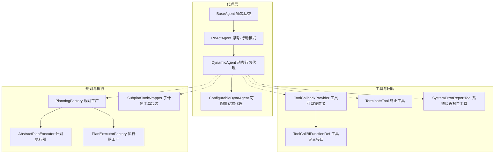
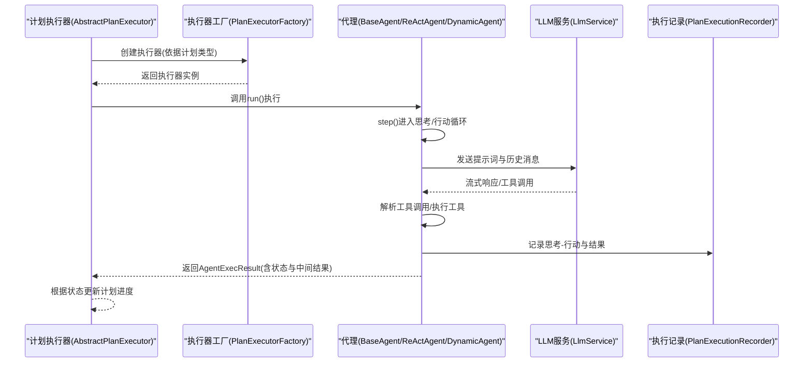
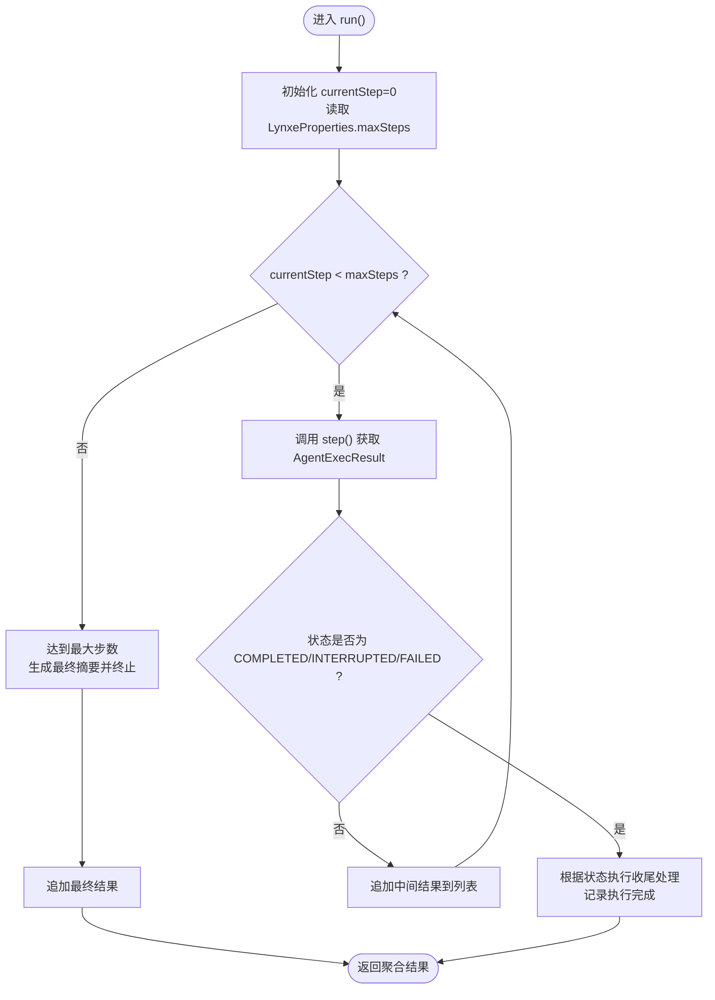
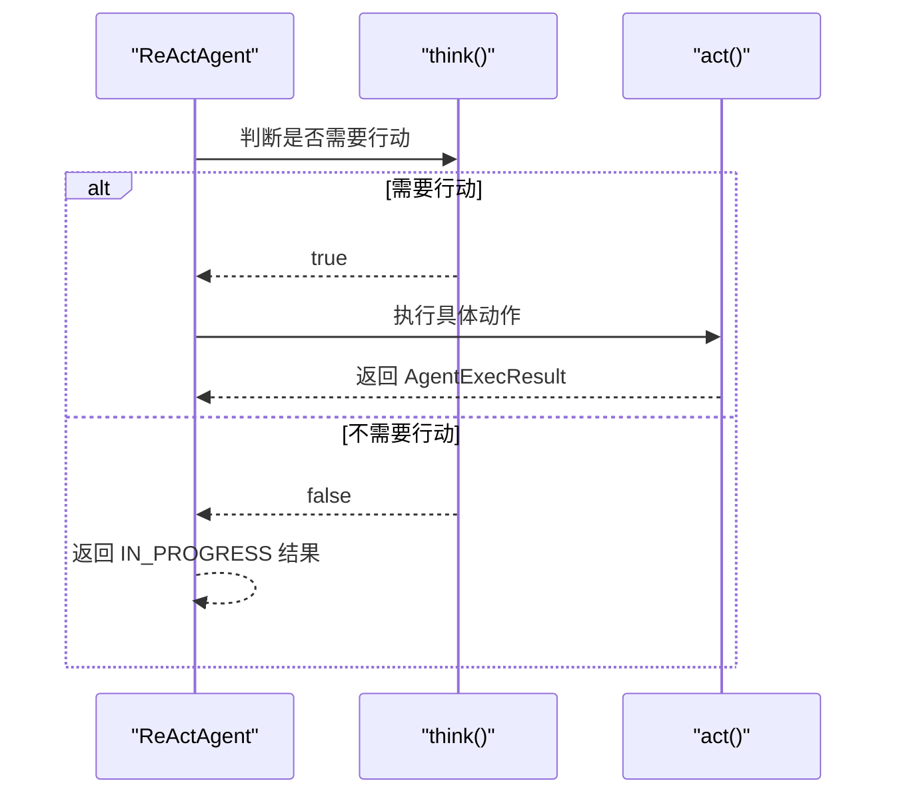
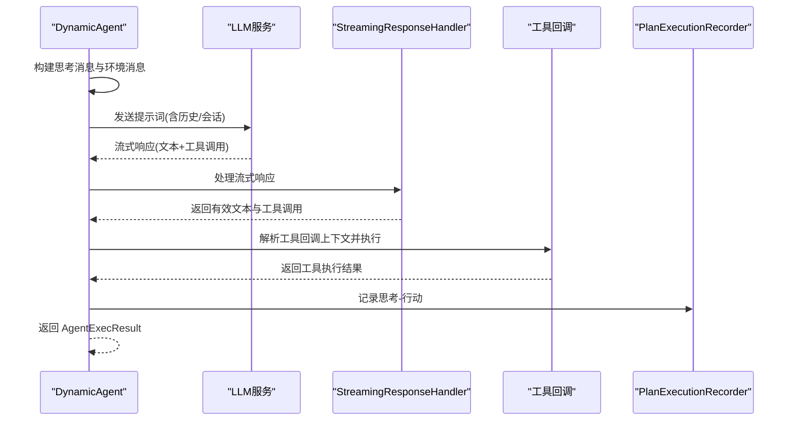
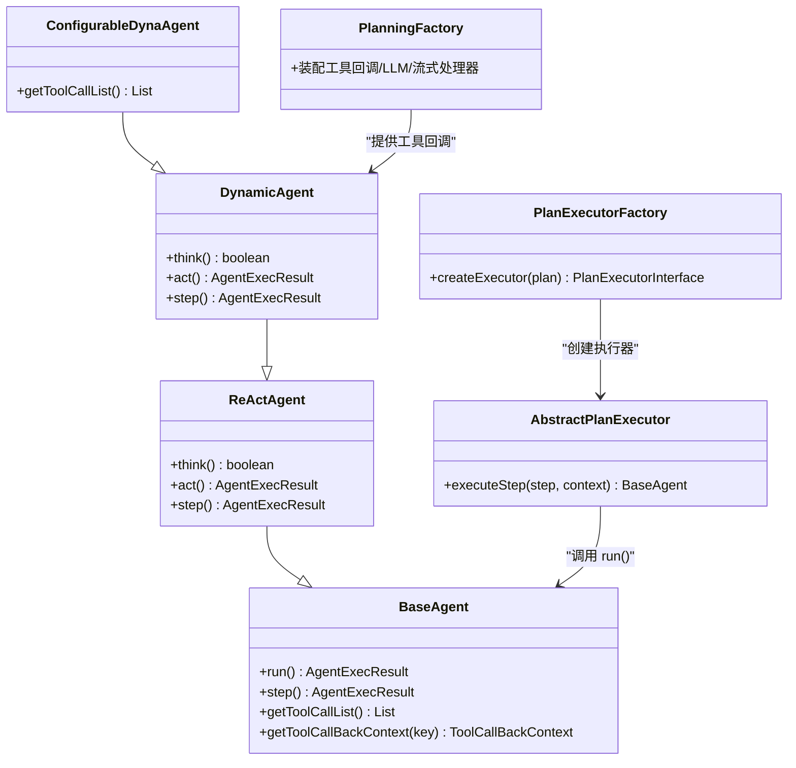
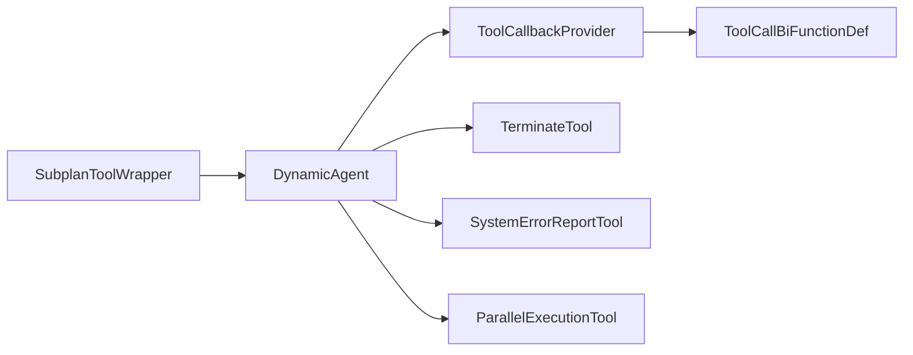

# 代理核心

<cite>
**本文引用的文件**
- [BaseAgent.java](file://src/main/java/com/alibaba/cloud/ai/lynxe/agent/BaseAgent.java)
- [ReActAgent.java](file://src/main/java/com/alibaba/cloud/ai/lynxe/agent/ReActAgent.java)
- [DynamicAgent.java](file://src/main/java/com/alibaba/cloud/ai/lynxe/agent/DynamicAgent.java)
- [ConfigurableDynaAgent.java](file://src/main/java/com/alibaba/cloud/ai/lynxe/agent/ConfigurableDynaAgent.java)
- [AgentState.java](file://src/main/java/com/alibaba/cloud/ai/lynxe/agent/AgentState.java)
- [ToolCallbackProvider.java](file://src/main/java/com/alibaba/cloud/ai/lynxe/agent/ToolCallbackProvider.java)
- [DynamicAgentEntity.java](file://src/main/java/com/alibaba/cloud/ai/lynxe/agent/entity/DynamicAgentEntity.java)
- [DynamicAgentDefinition.java](file://src/main/java/com/alibaba/cloud/ai/lynxe/agent/annotation/DynamicAgentDefinition.java)
- [PlanningFactory.java](file://src/main/java/com/alibaba/cloud/ai/lynxe/planning/PlanningFactory.java)
- [AbstractPlanExecutor.java](file://src/main/java/com/alibaba/cloud/ai/lynxe/runtime/executor/AbstractPlanExecutor.java)
- [PlanExecutorFactory.java](file://src/main/java/com/alibaba/cloud/ai/lynxe/runtime/executor/factory/PlanExecutorFactory.java)
- [SubplanToolWrapper.java](file://src/main/java/com/alibaba/cloud/ai/lynxe/subplan/model/vo/SubplanToolWrapper.java)
- [ToolCallBiFunctionDef.java](file://src/main/java/com/alibaba/cloud/ai/lynxe/tool/ToolCallBiFunctionDef.java)
- [TerminateTool.java](file://src/main/java/com/alibaba/cloud/ai/lynxe/tool/TerminateTool.java)
- [SystemErrorReportTool.java](file://src/main/java/com/alibaba/cloud/ai/lynxe/tool/SystemErrorReportTool.java)
- [ParallelExecutionTool.java](file://src/main/java/com/alibaba/cloud/ai/lynxe/tool/mapreduce/ParallelExecutionTool.java)
</cite>

## 目录
1. [简介](#简介)
2. [项目结构](#项目结构)
3. [核心组件](#核心组件)
4. [架构总览](#架构总览)
5. [详细组件分析](#详细组件分析)
6. [依赖关系分析](#依赖关系分析)
7. [性能考量](#性能考量)
8. [故障排查指南](#故障排查指南)
9. [结论](#结论)
10. [附录](#附录)

## 简介
本文件聚焦于JManus中AI代理核心，系统性梳理BaseAgent抽象基类、DynamicAgent动态行为代理与ReActAgent“思考-行动”模式代理的实现与协作机制。文档覆盖状态管理、对话跟踪、步骤限制、线程安全执行、错误处理、中断管理、超时控制、代理间协作与上下文传递，并给出性能优化建议与常见问题排查路径，帮助开发者快速理解并高效使用代理体系。

## 项目结构
代理核心位于agent包下，围绕抽象基类BaseAgent展开，ReActAgent作为其子类，DynamicAgent在ReActAgent基础上引入动态行为与工具调用能力，ConfigurableDynaAgent进一步提供可运行时参数化的工具集选择。规划与执行层通过PlanningFactory装配工具回调，AbstractPlanExecutor与PlanExecutorFactory负责将代理集成到计划执行系统。

图表来源
- [BaseAgent.java](file://src/main/java/com/alibaba/cloud/ai/lynxe/agent/BaseAgent.java#L1-L603)
- [ReActAgent.java](file://src/main/java/com/alibaba/cloud/ai/lynxe/agent/ReActAgent.java#L1-L97)
- [DynamicAgent.java](file://src/main/java/com/alibaba/cloud/ai/lynxe/agent/DynamicAgent.java#L1-L800)
- [ConfigurableDynaAgent.java](file://src/main/java/com/alibaba/cloud/ai/lynxe/agent/ConfigurableDynaAgent.java#L1-L342)
- [ToolCallbackProvider.java](file://src/main/java/com/alibaba/cloud/ai/lynxe/agent/ToolCallbackProvider.java#L1-L27)
- [PlanningFactory.java](file://src/main/java/com/alibaba/cloud/ai/lynxe/planning/PlanningFactory.java#L1-L200)
- [AbstractPlanExecutor.java](file://src/main/java/com/alibaba/cloud/ai/lynxe/runtime/executor/AbstractPlanExecutor.java#L91-L275)
- [PlanExecutorFactory.java](file://src/main/java/com/alibaba/cloud/ai/lynxe/runtime/executor/factory/PlanExecutorFactory.java#L153-L180)
- [SubplanToolWrapper.java](file://src/main/java/com/alibaba/cloud/ai/lynxe/subplan/model/vo/SubplanToolWrapper.java#L250-L278)
- [ToolCallBiFunctionDef.java](file://src/main/java/com/alibaba/cloud/ai/lynxe/tool/ToolCallBiFunctionDef.java#L1-L105)
- [TerminateTool.java](file://src/main/java/com/alibaba/cloud/ai/lynxe/tool/TerminateTool.java)
- [SystemErrorReportTool.java](file://src/main/java/com/alibaba/cloud/ai/lynxe/tool/SystemErrorReportTool.java)

章节来源
- [BaseAgent.java](file://src/main/java/com/alibaba/cloud/ai/lynxe/agent/BaseAgent.java#L1-L603)
- [ReActAgent.java](file://src/main/java/com/alibaba/cloud/ai/lynxe/agent/ReActAgent.java#L1-L97)
- [DynamicAgent.java](file://src/main/java/com/alibaba/cloud/ai/lynxe/agent/DynamicAgent.java#L1-L800)
- [ConfigurableDynaAgent.java](file://src/main/java/com/alibaba/cloud/ai/lynxe/agent/ConfigurableDynaAgent.java#L1-L342)
- [PlanningFactory.java](file://src/main/java/com/alibaba/cloud/ai/lynxe/planning/PlanningFactory.java#L1-L200)

## 核心组件
- BaseAgent：抽象基类，统一提供状态管理、对话跟踪、步骤限制、线程安全执行、异常与终止处理、最终总结与终止等通用能力。
- ReActAgent：在BaseAgent之上实现“思考-行动”交替模式，要求子类实现think与act两个阶段。
- DynamicAgent：ReActAgent的动态实现，内置LLM调用重试、流式响应处理、工具调用解析与执行、并发工具执行、表单输入等待、循环检测与终止逻辑。
- ConfigurableDynaAgent：在DynamicAgent基础上支持运行时参数化工具集选择，自动补齐终止工具，兼容服务组工具键名格式。
- AgentState：代理执行状态枚举，涵盖未开始、进行中、完成、阻塞、失败、中断。
- ToolCallbackProvider：工具回调提供者接口，为代理提供可用工具集合。
- PlanningFactory：装配工具回调、LLM客户端、流式处理器、执行池等，支撑代理创建与运行。
- AbstractPlanExecutor/PlanExecutorFactory：将代理集成进计划执行系统，按计划类型分发执行器，驱动代理run()执行。

章节来源
- [BaseAgent.java](file://src/main/java/com/alibaba/cloud/ai/lynxe/agent/BaseAgent.java#L1-L603)
- [ReActAgent.java](file://src/main/java/com/alibaba/cloud/ai/lynxe/agent/ReActAgent.java#L1-L97)
- [DynamicAgent.java](file://src/main/java/com/alibaba/cloud/ai/lynxe/agent/DynamicAgent.java#L1-L800)
- [ConfigurableDynaAgent.java](file://src/main/java/com/alibaba/cloud/ai/lynxe/agent/ConfigurableDynaAgent.java#L1-L342)
- [AgentState.java](file://src/main/java/com/alibaba/cloud/ai/lynxe/agent/AgentState.java#L1-L35)
- [ToolCallbackProvider.java](file://src/main/java/com/alibaba/cloud/ai/lynxe/agent/ToolCallbackProvider.java#L1-L27)
- [PlanningFactory.java](file://src/main/java/com/alibaba/cloud/ai/lynxe/planning/PlanningFactory.java#L1-L200)
- [AbstractPlanExecutor.java](file://src/main/java/com/alibaba/cloud/ai/lynxe/runtime/executor/AbstractPlanExecutor.java#L91-L275)
- [PlanExecutorFactory.java](file://src/main/java/com/alibaba/cloud/ai/lynxe/runtime/executor/factory/PlanExecutorFactory.java#L153-L180)

## 架构总览
代理核心以BaseAgent为核心，ReActAgent定义“思考-行动”的执行范式，DynamicAgent实现该范式的具体细节，ConfigurableDynaAgent提供运行时工具集配置能力。规划工厂负责装配工具回调与LLM服务，执行器工厂根据计划类型选择合适的执行器，将代理嵌入到计划执行流水线中。

图表来源
- [AbstractPlanExecutor.java](file://src/main/java/com/alibaba/cloud/ai/lynxe/runtime/executor/AbstractPlanExecutor.java#L91-L275)
- [PlanExecutorFactory.java](file://src/main/java/com/alibaba/cloud/ai/lynxe/runtime/executor/factory/PlanExecutorFactory.java#L153-L180)
- [BaseAgent.java](file://src/main/java/com/alibaba/cloud/ai/lynxe/agent/BaseAgent.java#L254-L351)
- [DynamicAgent.java](file://src/main/java/com/alibaba/cloud/ai/lynxe/agent/DynamicAgent.java#L232-L544)

## 详细组件分析

### BaseAgent：抽象基类与通用执行框架
- 状态管理与步骤限制
  - 维护最大步数与当前步数，循环执行step()，达到上限后生成最终摘要并终止。
  - 支持COMPLETED/INTERRUPTED/FAILED三种终端状态，分别触发不同的收尾处理。
- 对话跟踪
  - 通过LlmService维护代理记忆，支持会话历史与计划历史合并。
  - 在最终阶段生成摘要时，将思考链、下一步提示与用户请求一并纳入。
- 线程安全与中断
  - run()方法内循环受maxSteps约束；子类在think/act阶段应配合外部中断检查。
- 异常处理
  - 捕获异常后通过SystemErrorReportTool模拟工具调用流程，保留错误信息并返回IN_PROGRESS或FAILED状态。
- 清理与记录
  - finally块清理代理记忆，记录代理执行完成事件。

图表来源
- [BaseAgent.java](file://src/main/java/com/alibaba/cloud/ai/lynxe/agent/BaseAgent.java#L254-L351)
- [BaseAgent.java](file://src/main/java/com/alibaba/cloud/ai/lynxe/agent/BaseAgent.java#L538-L600)

章节来源
- [BaseAgent.java](file://src/main/java/com/alibaba/cloud/ai/lynxe/agent/BaseAgent.java#L1-L603)

### ReActAgent：思考-行动模式
- 定义了think()与act()两个抽象阶段，step()负责交替执行两者。
- 当think()返回false时，step()返回“无需行动”的结果；否则进入act()执行具体动作（如工具调用）。

图表来源
- [ReActAgent.java](file://src/main/java/com/alibaba/cloud/ai/lynxe/agent/ReActAgent.java#L58-L96)

章节来源
- [ReActAgent.java](file://src/main/java/com/alibaba/cloud/ai/lynxe/agent/ReActAgent.java#L1-L97)

### DynamicAgent：动态行为与工具调用
- 思考阶段（think）
  - 基于getThinkMessage()与当前环境消息构建提示词，结合历史记忆与会话历史。
  - 使用StreamingResponseHandler进行流式响应处理，解析有效工具调用与文本内容。
  - 内置重试机制与“早退”检测（仅思考无工具调用），超过阈值则失败。
  - 支持用户输入等待与超时控制，避免无限阻塞。
- 行动阶段（act）
  - 单工具执行：解析工具回调上下文，区分FormInputTool、TerminableTool、TerminateTool、SystemErrorReportTool等特殊工具，执行后统一走post-tool流程。
  - 多工具执行：通过ParallelToolExecutionService并行执行，但禁止包含TerminableTool与FormInputTool。
- 中断与异常
  - 在每个阶段前检查中断，必要时抛出TaskInterruptedException，由上层捕获并返回INTERRUPTED状态。
  - 异常通过SystemErrorReportTool模拟工具调用流程，保留错误信息并返回。
- 上下文与记录
  - 将思考与行动记录到PlanExecutionRecorder，便于前端可视化与审计。
  - 通过ToolContext传递planDepth与toolcallId，供子计划工具包装器提取。

图表来源
- [DynamicAgent.java](file://src/main/java/com/alibaba/cloud/ai/lynxe/agent/DynamicAgent.java#L232-L544)
- [DynamicAgent.java](file://src/main/java/com/alibaba/cloud/ai/lynxe/agent/DynamicAgent.java#L606-L796)
- [SubplanToolWrapper.java](file://src/main/java/com/alibaba/cloud/ai/lynxe/subplan/model/vo/SubplanToolWrapper.java#L250-L278)

章节来源
- [DynamicAgent.java](file://src/main/java/com/alibaba/cloud/ai/lynxe/agent/DynamicAgent.java#L1-L800)
- [SubplanToolWrapper.java](file://src/main/java/com/alibaba/cloud/ai/lynxe/subplan/model/vo/SubplanToolWrapper.java#L250-L278)

### ConfigurableDynaAgent：运行时参数化与工具集选择
- 当availableToolKeys为空时，自动从ToolCallbackProvider中收集全部可用工具，并确保存在TerminableTool或TerminateTool。
- 支持服务组工具键名转换，兼容“toolName[index]”与“serviceGroup.toolName”等格式。
- 保证工具集选择的完整性与一致性，避免缺少终止工具导致的无限循环。

章节来源
- [ConfigurableDynaAgent.java](file://src/main/java/com/alibaba/cloud/ai/lynxe/agent/ConfigurableDynaAgent.java#L1-L342)

### 代理与计划执行系统的集成
- AbstractPlanExecutor在执行单步时，根据步骤上下文获取对应代理实例，调用其run()，并将结果写回步骤状态。
- PlanExecutorFactory依据计划类型创建执行器，默认对“dynamic_agent”类型使用动态工具执行器。
- PlanningFactory负责装配工具回调、LLM客户端、流式处理器、执行池等，为代理提供运行时依赖。

图表来源
- [BaseAgent.java](file://src/main/java/com/alibaba/cloud/ai/lynxe/agent/BaseAgent.java#L1-L603)
- [ReActAgent.java](file://src/main/java/com/alibaba/cloud/ai/lynxe/agent/ReActAgent.java#L1-L97)
- [DynamicAgent.java](file://src/main/java/com/alibaba/cloud/ai/lynxe/agent/DynamicAgent.java#L1-L800)
- [ConfigurableDynaAgent.java](file://src/main/java/com/alibaba/cloud/ai/lynxe/agent/ConfigurableDynaAgent.java#L1-L342)
- [PlanningFactory.java](file://src/main/java/com/alibaba/cloud/ai/lynxe/planning/PlanningFactory.java#L1-L200)
- [AbstractPlanExecutor.java](file://src/main/java/com/alibaba/cloud/ai/lynxe/runtime/executor/AbstractPlanExecutor.java#L91-L275)
- [PlanExecutorFactory.java](file://src/main/java/com/alibaba/cloud/ai/lynxe/runtime/executor/factory/PlanExecutorFactory.java#L153-L180)

章节来源
- [AbstractPlanExecutor.java](file://src/main/java/com/alibaba/cloud/ai/lynxe/runtime/executor/AbstractPlanExecutor.java#L91-L275)
- [PlanExecutorFactory.java](file://src/main/java/com/alibaba/cloud/ai/lynxe/runtime/executor/factory/PlanExecutorFactory.java#L153-L180)
- [PlanningFactory.java](file://src/main/java/com/alibaba/cloud/ai/lynxe/planning/PlanningFactory.java#L1-L200)

## 依赖关系分析
- 工具回调与定义
  - ToolCallbackProvider提供工具回调上下文映射，DynamicAgent通过getToolCallList()获取工具回调列表。
  - ToolCallBiFunctionDef定义工具的名称、描述、参数Schema、输入类型、是否可直接返回、是否可选择、当前状态字符串、资源清理等能力。
- 终止与错误处理
  - TerminateTool用于显式结束代理执行；SystemErrorReportTool用于在异常场景下模拟工具调用流程，保留错误信息。
- 并行工具执行
  - ParallelExecutionTool提供异步批量注册与启动执行的能力，DynamicAgent在多工具场景下可委托其并行执行。
- 子计划工具包装
  - SubplanToolWrapper从ToolContext中提取planDepth与toolcallId，用于子计划工具的上下文传递。

图表来源
- [ToolCallbackProvider.java](file://src/main/java/com/alibaba/cloud/ai/lynxe/agent/ToolCallbackProvider.java#L1-L27)
- [ToolCallBiFunctionDef.java](file://src/main/java/com/alibaba/cloud/ai/lynxe/tool/ToolCallBiFunctionDef.java#L1-L105)
- [DynamicAgent.java](file://src/main/java/com/alibaba/cloud/ai/lynxe/agent/DynamicAgent.java#L1-L800)
- [TerminateTool.java](file://src/main/java/com/alibaba/cloud/ai/lynxe/tool/TerminateTool.java)
- [SystemErrorReportTool.java](file://src/main/java/com/alibaba/cloud/ai/lynxe/tool/SystemErrorReportTool.java)
- [ParallelExecutionTool.java](file://src/main/java/com/alibaba/cloud/ai/lynxe/tool/mapreduce/ParallelExecutionTool.java#L224-L251)
- [SubplanToolWrapper.java](file://src/main/java/com/alibaba/cloud/ai/lynxe/subplan/model/vo/SubplanToolWrapper.java#L250-L278)

章节来源
- [ToolCallbackProvider.java](file://src/main/java/com/alibaba/cloud/ai/lynxe/agent/ToolCallbackProvider.java#L1-L27)
- [ToolCallBiFunctionDef.java](file://src/main/java/com/alibaba/cloud/ai/lynxe/tool/ToolCallBiFunctionDef.java#L1-L105)
- [ParallelExecutionTool.java](file://src/main/java/com/alibaba/cloud/ai/lynxe/tool/mapreduce/ParallelExecutionTool.java#L224-L251)
- [SubplanToolWrapper.java](file://src/main/java/com/alibaba/cloud/ai/lynxe/subplan/model/vo/SubplanToolWrapper.java#L250-L278)

## 性能考量
- 流式响应与字符计数
  - DynamicAgent在调用LLM前计算输入字符数，流式处理后统计输出字符数，有助于监控与限流。
- 重试与指数退避
  - 对网络相关异常采用指数退避重试，降低瞬时故障影响；同时设置“早退”阈值，避免模型只输出思考不调用工具。
- 并行工具执行
  - 多工具场景下使用ParallelToolExecutionService并行执行，提升吞吐；但需避免与TerminableTool/FormInputTool混用。
- 记忆与会话历史
  - 合理设置最大记忆条数与会话历史长度，避免过长的历史导致提示词膨胀与延迟增加。
- 线程池与并发
  - AbstractPlanExecutor按层级使用ExecutorService，合理配置线程池大小与队列容量，避免阻塞与资源耗尽。

章节来源
- [DynamicAgent.java](file://src/main/java/com/alibaba/cloud/ai/lynxe/agent/DynamicAgent.java#L347-L409)
- [DynamicAgent.java](file://src/main/java/com/alibaba/cloud/ai/lynxe/agent/DynamicAgent.java#L486-L544)
- [AbstractPlanExecutor.java](file://src/main/java/com/alibaba/cloud/ai/lynxe/runtime/executor/AbstractPlanExecutor.java#L250-L275)

## 故障排查指南
- 代理未调用工具
  - 现象：多次重试后仍无工具调用，最终失败。
  - 排查：检查模型是否被正确配置为必须调用工具；查看DynamicAgent的“早退”阈值与重试日志；确认ToolCallingManager是否启用内部工具执行。
- 代理被中断
  - 现象：执行过程中返回INTERRUPTED状态。
  - 排查：确认TaskInterruptionCheckerService的中断检查逻辑；检查AgentInterruptionHelper是否正确传递rootPlanId。
- LLM调用异常
  - 现象：重试耗尽后通过SystemErrorReportTool模拟错误流程。
  - 排查：查看DynamicAgent记录的llmCallExceptions与latestLlmException；关注网络超时、DNS解析、连接异常等可重试错误。
- 工具执行错误
  - 现象：工具返回空响应或抛出异常。
  - 排查：确认工具回调上下文是否存在；检查工具实例类型（FormInputTool/TerminableTool/TerminateTool/SystemErrorReportTool）分支逻辑；查看工具清理与内存处理是否正常。
- 并行工具冲突
  - 现象：多工具执行时报错，提示不允许包含特定工具。
  - 排查：移除TerminableTool/FormInputTool后再尝试；或改为单工具执行。
- 子计划上下文丢失
  - 现象：子计划工具无法获取planDepth或toolcallId。
  - 排查：确认ToolContext中是否包含planDepth与toolcallId；检查SubplanToolWrapper的提取逻辑。

章节来源
- [DynamicAgent.java](file://src/main/java/com/alibaba/cloud/ai/lynxe/agent/DynamicAgent.java#L486-L544)
- [DynamicAgent.java](file://src/main/java/com/alibaba/cloud/ai/lynxe/agent/DynamicAgent.java#L606-L796)
- [SubplanToolWrapper.java](file://src/main/java/com/alibaba/cloud/ai/lynxe/subplan/model/vo/SubplanToolWrapper.java#L250-L278)

## 结论
JManus的代理核心以BaseAgent为抽象基石，ReActAgent定义了清晰的“思考-行动”范式，DynamicAgent在此基础上实现了强大的动态行为与工具调用能力，并通过ConfigurableDynaAgent提供运行时参数化。代理与计划执行系统通过PlanningFactory与执行器工厂紧密耦合，形成从提示词构造、工具调用解析、执行与记录到状态收敛的完整闭环。借助完善的中断、异常与超时控制，代理能够在复杂任务中稳定执行并提供可观测的执行轨迹。

## 附录
- 代理创建与初始化要点
  - 通过PlanningFactory装配工具回调与LLM服务，确保DynamicAgent具备可用工具集与流式响应处理能力。
  - 使用ConfigurableDynaAgent时，若未指定工具集，将自动收集全部工具并补齐终止工具。
  - 在AbstractPlanExecutor中，根据计划类型选择执行器并调用代理run()，将结果写回步骤状态。
- 代理间协作与上下文传递
  - 通过ToolContext传递planDepth与toolcallId，子计划工具包装器可据此提取上下文。
  - 代理在执行过程中持续记录思考-行动，便于前端可视化与审计。

章节来源
- [PlanningFactory.java](file://src/main/java/com/alibaba/cloud/ai/lynxe/planning/PlanningFactory.java#L1-L200)
- [ConfigurableDynaAgent.java](file://src/main/java/com/alibaba/cloud/ai/lynxe/agent/ConfigurableDynaAgent.java#L1-L342)
- [AbstractPlanExecutor.java](file://src/main/java/com/alibaba/cloud/ai/lynxe/runtime/executor/AbstractPlanExecutor.java#L91-L275)
- [SubplanToolWrapper.java](file://src/main/java/com/alibaba/cloud/ai/lynxe/subplan/model/vo/SubplanToolWrapper.java#L250-L278)