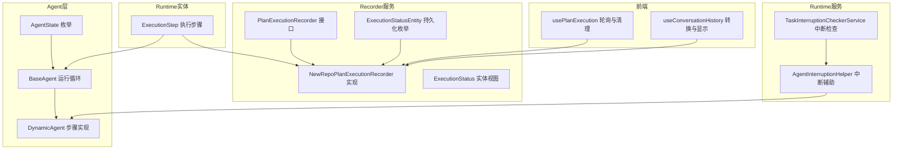
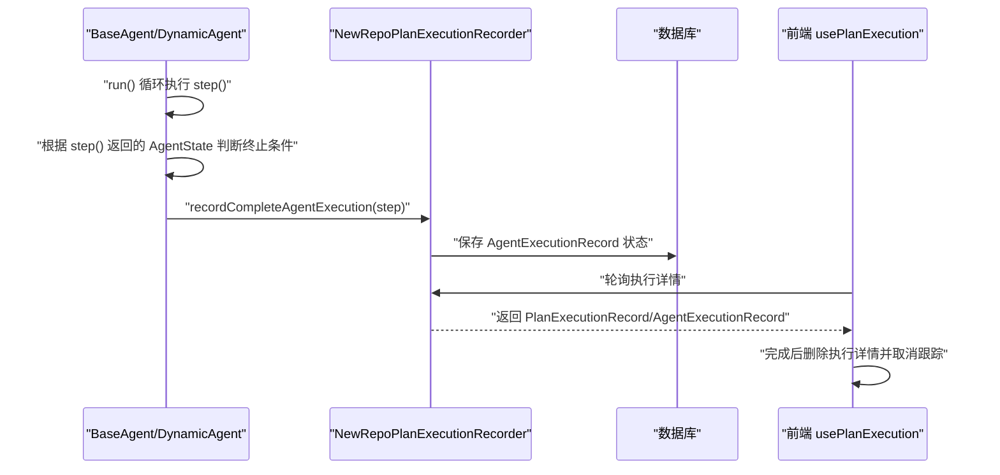
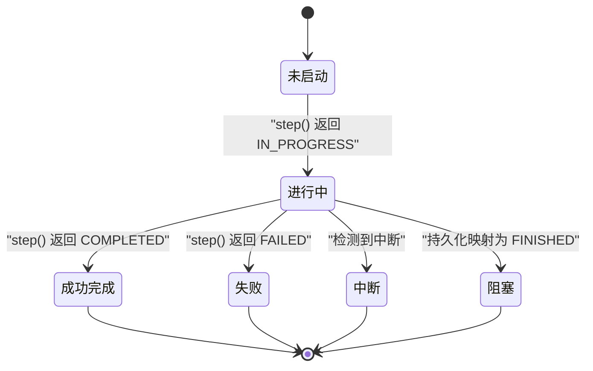
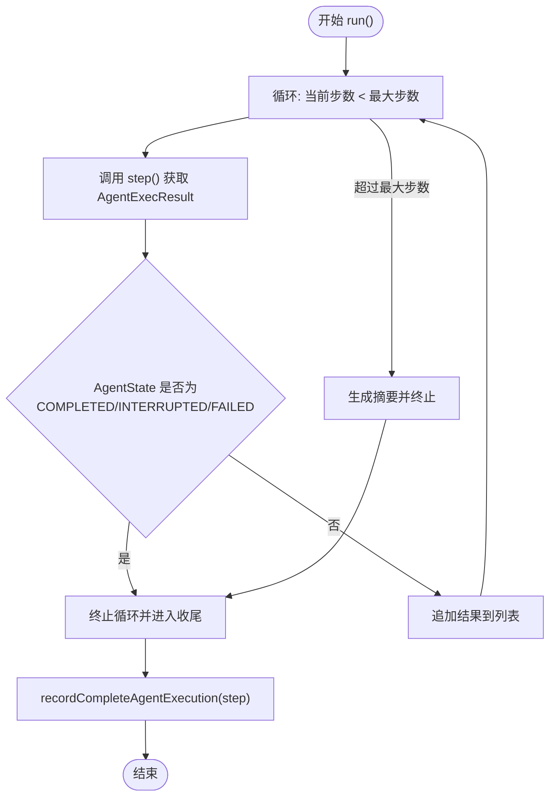
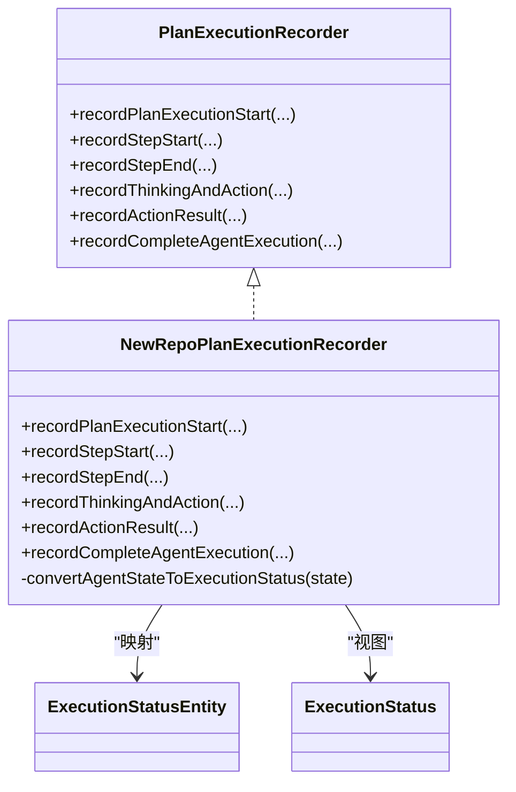
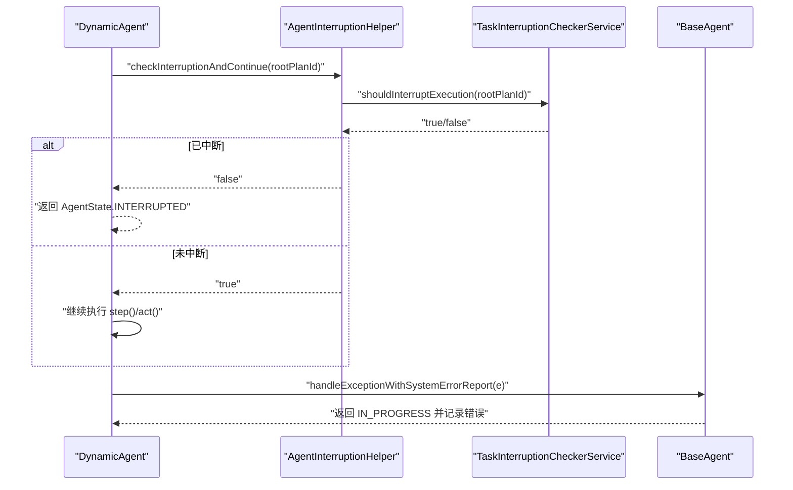
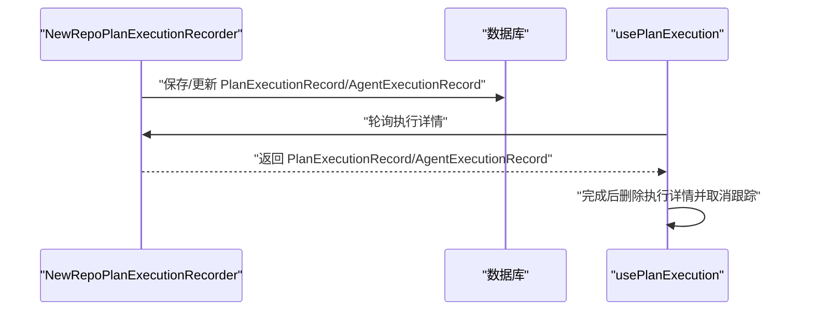
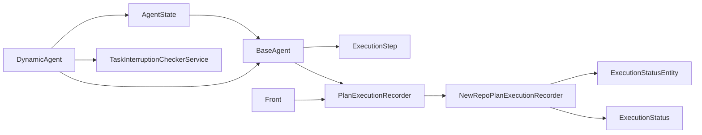

# 状态管理

<cite>
**本文引用的文件**
- [AgentState.java](file://src/main/java/com/alibaba/cloud/ai/lynxe/agent/AgentState.java)
- [BaseAgent.java](file://src/main/java/com/alibaba/cloud/ai/lynxe/agent/BaseAgent.java)
- [DynamicAgent.java](file://src/main/java/com/alibaba/cloud/ai/lynxe/agent/DynamicAgent.java)
- [ExecutionStep.java](file://src/main/java/com/alibaba/cloud/ai/lynxe/runtime/entity/vo/ExecutionStep.java)
- [PlanExecutionRecorder.java](file://src/main/java/com/alibaba/cloud/ai/lynxe/recorder/service/PlanExecutionRecorder.java)
- [NewRepoPlanExecutionRecorder.java](file://src/main/java/com/alibaba/cloud/ai/lynxe/recorder/service/NewRepoPlanExecutionRecorder.java)
- [ExecutionStatus.java](file://src/main/java/com/alibaba/cloud/ai/lynxe/recorder/entity/vo/ExecutionStatus.java)
- [ExecutionStatusEntity.java](file://src/main/java/com/alibaba/cloud/ai/lynxe/recorder/entity/po/ExecutionStatusEntity.java)
- [PlanExecutionRecord.java](file://src/main/java/com/alibaba/cloud/ai/lynxe/recorder/entity/vo/PlanExecutionRecord.java)
- [AgentExecutionRecord.java](file://src/main/java/com/alibaba/cloud/ai/lynxe/recorder/entity/vo/AgentExecutionRecord.java)
- [TaskInterruptionCheckerService.java](file://src/main/java/com/alibaba/cloud/ai/lynxe/runtime/service/TaskInterruptionCheckerService.java)
- [AgentInterruptionHelper.java](file://src/main/java/com/alibaba/cloud/ai/lynxe/runtime/service/AgentInterruptionHelper.java)
- [usePlanExecution.ts](file://ui-vue3/src/composables/usePlanExecution.ts)
- [useConversationHistory.ts](file://ui-vue3/src/composables/useConversationHistory.ts)
</cite>

## 目录
1. [引言](#引言)
2. [项目结构](#项目结构)
3. [核心组件](#核心组件)
4. [架构总览](#架构总览)
5. [详细组件分析](#详细组件分析)
6. [依赖关系分析](#依赖关系分析)
7. [性能考量](#性能考量)
8. [故障排查指南](#故障排查指南)
9. [结论](#结论)
10. [附录](#附录)

## 引言
本文件聚焦于JManus中AI代理的状态管理，系统性梳理AgentState枚举所定义的代理状态机（NOT_STARTED、IN_PROGRESS、COMPLETED、BLOCKED、FAILED、INTERRUPTED），阐明状态转换的触发机制、生命周期管理、记录与监控、失败/阻塞恢复策略、调用链路与异常处理、状态持久化与前端UI同步，并提供诊断方法与最佳实践。

## 项目结构
围绕状态管理的关键模块分布如下：
- agent层：定义状态枚举与运行时状态流转逻辑
- runtime实体：封装执行步骤与状态字段
- recorder服务：负责将状态写入数据库并提供查询接口
- runtime服务：提供中断检查与帮助器
- 前端composables：轮询与清理执行详情，驱动UI状态同步

图表来源
- [AgentState.java](file://src/main/java/com/alibaba/cloud/ai/lynxe/agent/AgentState.java#L1-L34)
- [BaseAgent.java](file://src/main/java/com/alibaba/cloud/ai/lynxe/agent/BaseAgent.java#L254-L332)
- [DynamicAgent.java](file://src/main/java/com/alibaba/cloud/ai/lynxe/agent/DynamicAgent.java#L510-L553)
- [ExecutionStep.java](file://src/main/java/com/alibaba/cloud/ai/lynxe/runtime/entity/vo/ExecutionStep.java#L66-L114)
- [PlanExecutionRecorder.java](file://src/main/java/com/alibaba/cloud/ai/lynxe/recorder/service/PlanExecutionRecorder.java#L26-L110)
- [NewRepoPlanExecutionRecorder.java](file://src/main/java/com/alibaba/cloud/ai/lynxe/recorder/service/NewRepoPlanExecutionRecorder.java#L250-L275)
- [ExecutionStatus.java](file://src/main/java/com/alibaba/cloud/ai/lynxe/recorder/entity/vo/ExecutionStatus.java#L1-L26)
- [ExecutionStatusEntity.java](file://src/main/java/com/alibaba/cloud/ai/lynxe/recorder/entity/po/ExecutionStatusEntity.java#L1-L26)
- [TaskInterruptionCheckerService.java](file://src/main/java/com/alibaba/cloud/ai/lynxe/runtime/service/TaskInterruptionCheckerService.java#L37-L68)
- [AgentInterruptionHelper.java](file://src/main/java/com/alibaba/cloud/ai/lynxe/runtime/service/AgentInterruptionHelper.java#L35-L64)
- [usePlanExecution.ts](file://ui-vue3/src/composables/usePlanExecution.ts#L138-L233)
- [useConversationHistory.ts](file://ui-vue3/src/composables/useConversationHistory.ts#L35-L61)

章节来源
- [AgentState.java](file://src/main/java/com/alibaba/cloud/ai/lynxe/agent/AgentState.java#L1-L34)
- [BaseAgent.java](file://src/main/java/com/alibaba/cloud/ai/lynxe/agent/BaseAgent.java#L254-L332)
- [ExecutionStep.java](file://src/main/java/com/alibaba/cloud/ai/lynxe/runtime/entity/vo/ExecutionStep.java#L66-L114)
- [PlanExecutionRecorder.java](file://src/main/java/com/alibaba/cloud/ai/lynxe/recorder/service/PlanExecutionRecorder.java#L26-L110)
- [NewRepoPlanExecutionRecorder.java](file://src/main/java/com/alibaba/cloud/ai/lynxe/recorder/service/NewRepoPlanExecutionRecorder.java#L250-L275)
- [TaskInterruptionCheckerService.java](file://src/main/java/com/alibaba/cloud/ai/lynxe/runtime/service/TaskInterruptionCheckerService.java#L37-L68)
- [AgentInterruptionHelper.java](file://src/main/java/com/alibaba/cloud/ai/lynxe/runtime/service/AgentInterruptionHelper.java#L35-L64)
- [usePlanExecution.ts](file://ui-vue3/src/composables/usePlanExecution.ts#L138-L233)
- [useConversationHistory.ts](file://ui-vue3/src/composables/useConversationHistory.ts#L35-L61)

## 核心组件
- AgentState：定义代理生命周期状态，作为运行时状态的语义载体。
- ExecutionStep：承载单步执行结果、错误信息、当前代理实例与状态。
- BaseAgent.run：统一的执行循环，依据每步返回的AgentState决定是否终止、汇总结果并最终记录。
- DynamicAgent.step：具体实现思考/行动分支，返回不同状态（含FAILED、INTERRUPTED等）。
- PlanExecutionRecorder/NewRepoPlanExecutionRecorder：将状态写入数据库，提供开始/结束/完成/思维-行动记录等接口。
- ExecutionStatus/ExecutionStatusEntity：用于持久化层与视图层的状态映射。
- TaskInterruptionCheckerService/AgentInterruptionHelper：提供外部中断信号检查与拦截。
- 前端usePlanExecution：轮询后端执行详情，完成后清理缓存数据，驱动UI状态更新。

章节来源
- [AgentState.java](file://src/main/java/com/alibaba/cloud/ai/lynxe/agent/AgentState.java#L1-L34)
- [ExecutionStep.java](file://src/main/java/com/alibaba/cloud/ai/lynxe/runtime/entity/vo/ExecutionStep.java#L66-L114)
- [BaseAgent.java](file://src/main/java/com/alibaba/cloud/ai/lynxe/agent/BaseAgent.java#L254-L332)
- [DynamicAgent.java](file://src/main/java/com/alibaba/cloud/ai/lynxe/agent/DynamicAgent.java#L510-L553)
- [PlanExecutionRecorder.java](file://src/main/java/com/alibaba/cloud/ai/lynxe/recorder/service/PlanExecutionRecorder.java#L26-L110)
- [NewRepoPlanExecutionRecorder.java](file://src/main/java/com/alibaba/cloud/ai/lynxe/recorder/service/NewRepoPlanExecutionRecorder.java#L250-L275)
- [ExecutionStatus.java](file://src/main/java/com/alibaba/cloud/ai/lynxe/recorder/entity/vo/ExecutionStatus.java#L1-L26)
- [ExecutionStatusEntity.java](file://src/main/java/com/alibaba/cloud/ai/lynxe/recorder/entity/po/ExecutionStatusEntity.java#L1-L26)
- [TaskInterruptionCheckerService.java](file://src/main/java/com/alibaba/cloud/ai/lynxe/runtime/service/TaskInterruptionCheckerService.java#L37-L68)
- [AgentInterruptionHelper.java](file://src/main/java/com/alibaba/cloud/ai/lynxe/runtime/service/AgentInterruptionHelper.java#L35-L64)
- [usePlanExecution.ts](file://ui-vue3/src/composables/usePlanExecution.ts#L138-L233)

## 架构总览
下图展示了从代理执行到状态记录与前端同步的整体流程。

图表来源
- [BaseAgent.java](file://src/main/java/com/alibaba/cloud/ai/lynxe/agent/BaseAgent.java#L254-L332)
- [DynamicAgent.java](file://src/main/java/com/alibaba/cloud/ai/lynxe/agent/DynamicAgent.java#L510-L553)
- [NewRepoPlanExecutionRecorder.java](file://src/main/java/com/alibaba/cloud/ai/lynxe/recorder/service/NewRepoPlanExecutionRecorder.java#L522-L604)
- [usePlanExecution.ts](file://ui-vue3/src/composables/usePlanExecution.ts#L138-L233)

## 详细组件分析

### AgentState状态机与转换条件
- 定义：NOT_STARTED、IN_PROGRESS、COMPLETED、BLOCKED、FAILED、INTERRUPTED。
- 生命周期要点：
  - NOT_STARTED：默认初始态，当ExecutionStep未绑定代理或未开始时使用。
  - IN_PROGRESS：正常执行态；当出现异常但可恢复时也可能回到此态。
  - COMPLETED：成功完成；通常由终止工具或达到最大步数后生成摘要并终止。
  - BLOCKED：在持久化映射中与FINISHED同义，表示已完成（阻塞视为终态之一）。
  - FAILED：显式失败态；如模型持续仅思考不调用工具、或执行异常无法恢复。
  - INTERRUPTED：用户主动中断态；由中断检查器触发。

状态转换触发机制与条件：
- BaseAgent.run在每步结束后读取AgentState，若为COMPLETED/INTERRUPTED/FAILED则立即终止循环并进入对应收尾逻辑。
- DynamicAgent.step在思考阶段无工具选择且达到“早期终止阈值”时返回FAILED；在检测到任务中断时返回INTERRUPTED；其他异常通过SystemErrorReportTool包装后返回IN_PROGRESS以继续尝试。
- 记录器将AgentState映射为ExecutionStatusEntity（NOT_STARTED→IDLE，IN_PROGRESS→RUNNING，COMPLETED/INTERRUPTED→FINISHED，BLOCKED/FAILED→FINISHED）。

图表来源
- [AgentState.java](file://src/main/java/com/alibaba/cloud/ai/lynxe/agent/AgentState.java#L1-L34)
- [BaseAgent.java](file://src/main/java/com/alibaba/cloud/ai/lynxe/agent/BaseAgent.java#L254-L332)
- [DynamicAgent.java](file://src/main/java/com/alibaba/cloud/ai/lynxe/agent/DynamicAgent.java#L510-L553)
- [NewRepoPlanExecutionRecorder.java](file://src/main/java/com/alibaba/cloud/ai/lynxe/recorder/service/NewRepoPlanExecutionRecorder.java#L250-L275)

章节来源
- [AgentState.java](file://src/main/java/com/alibaba/cloud/ai/lynxe/agent/AgentState.java#L1-L34)
- [BaseAgent.java](file://src/main/java/com/alibaba/cloud/ai/lynxe/agent/BaseAgent.java#L254-L332)
- [DynamicAgent.java](file://src/main/java/com/alibaba/cloud/ai/lynxe/agent/DynamicAgent.java#L510-L553)
- [NewRepoPlanExecutionRecorder.java](file://src/main/java/com/alibaba/cloud/ai/lynxe/recorder/service/NewRepoPlanExecutionRecorder.java#L250-L275)

### 执行循环与状态转换流程
- BaseAgent.run负责：
  - 维护当前步数与最大步数；
  - 调用step()获取AgentExecResult；
  - 若返回状态为COMPLETED/INTERRUPTED/FAILED则终止并进入对应处理；
  - 达到最大步数仍未终止时，生成摘要并通过终止工具结束，返回COMPLETED。
- DynamicAgent.step覆盖：
  - 思考阶段：若无工具选择且达到“早期终止阈值”，返回FAILED；
  - 中断：捕获中断异常，返回INTERRUPTED；
  - 其他异常：通过SystemErrorReportTool包装并返回IN_PROGRESS，允许重试。
- 记录：
  - recordCompleteAgentExecution(step)将最终状态写入数据库；
  - recordStepStart/recordStepEnd分别在开始与结束时更新状态。

图表来源
- [BaseAgent.java](file://src/main/java/com/alibaba/cloud/ai/lynxe/agent/BaseAgent.java#L254-L332)
- [DynamicAgent.java](file://src/main/java/com/alibaba/cloud/ai/lynxe/agent/DynamicAgent.java#L510-L553)
- [NewRepoPlanExecutionRecorder.java](file://src/main/java/com/alibaba/cloud/ai/lynxe/recorder/service/NewRepoPlanExecutionRecorder.java#L522-L604)

章节来源
- [BaseAgent.java](file://src/main/java/com/alibaba/cloud/ai/lynxe/agent/BaseAgent.java#L254-L332)
- [DynamicAgent.java](file://src/main/java/com/alibaba/cloud/ai/lynxe/agent/DynamicAgent.java#L510-L553)
- [NewRepoPlanExecutionRecorder.java](file://src/main/java/com/alibaba/cloud/ai/lynxe/recorder/service/NewRepoPlanExecutionRecorder.java#L522-L604)

### 状态记录与监控（PlanExecutionRecorder）
- 接口职责：
  - recordPlanExecutionStart：创建/更新计划执行记录，关联执行步骤与代理记录；
  - recordStepStart/recordStepEnd：更新代理记录状态为RUNNING/FINISHED；
  - recordThinkingAndAction：记录思维-行动过程及工具调用信息；
  - recordActionResult：回填工具执行结果；
  - recordCompleteAgentExecution：写入最终状态、时间、错误信息等。
- 实现映射：
  - convertAgentStateToExecutionStatus：将AgentState映射为ExecutionStatusEntity（NOT_STARTED→IDLE，IN_PROGRESS→RUNNING，COMPLETED/INTERRUPTED→FINISHED，BLOCKED/FAILED→FINISHED）。
- 查询与聚合：
  - PlanExecutionRecord.updateCurrentStepIndex：基于代理记录状态推导当前步骤索引；
  - getAgentExecutionDetail/fetchThinkActRecords：拉取代理执行详情与思维-行动明细。

图表来源
- [PlanExecutionRecorder.java](file://src/main/java/com/alibaba/cloud/ai/lynxe/recorder/service/PlanExecutionRecorder.java#L26-L110)
- [NewRepoPlanExecutionRecorder.java](file://src/main/java/com/alibaba/cloud/ai/lynxe/recorder/service/NewRepoPlanExecutionRecorder.java#L250-L275)
- [ExecutionStatus.java](file://src/main/java/com/alibaba/cloud/ai/lynxe/recorder/entity/vo/ExecutionStatus.java#L1-L26)
- [ExecutionStatusEntity.java](file://src/main/java/com/alibaba/cloud/ai/lynxe/recorder/entity/po/ExecutionStatusEntity.java#L1-L26)

章节来源
- [PlanExecutionRecorder.java](file://src/main/java/com/alibaba/cloud/ai/lynxe/recorder/service/PlanExecutionRecorder.java#L26-L110)
- [NewRepoPlanExecutionRecorder.java](file://src/main/java/com/alibaba/cloud/ai/lynxe/recorder/service/NewRepoPlanExecutionRecorder.java#L250-L275)
- [PlanExecutionRecord.java](file://src/main/java/com/alibaba/cloud/ai/lynxe/recorder/entity/vo/PlanExecutionRecord.java#L125-L186)

### 中断与异常处理
- 中断：
  - TaskInterruptionCheckerService.shouldInterruptExecution：周期性检查根计划ID对应的中断状态；
  - AgentInterruptionHelper.checkInterruptionAndContinue：在关键点检查并返回是否继续；
  - DynamicAgent.step/act在捕获中断异常时直接返回INTERRUPTED。
- 异常：
  - BaseAgent.handleExceptionWithSystemErrorReport：将异常包装为工具输出，返回IN_PROGRESS以便继续；
  - DynamicAgent.step在达到“早期终止阈值”时返回FAILED，避免无限重试。

图表来源
- [AgentInterruptionHelper.java](file://src/main/java/com/alibaba/cloud/ai/lynxe/runtime/service/AgentInterruptionHelper.java#L35-L64)
- [TaskInterruptionCheckerService.java](file://src/main/java/com/alibaba/cloud/ai/lynxe/runtime/service/TaskInterruptionCheckerService.java#L37-L68)
- [DynamicAgent.java](file://src/main/java/com/alibaba/cloud/ai/lynxe/agent/DynamicAgent.java#L510-L553)
- [BaseAgent.java](file://src/main/java/com/alibaba/cloud/ai/lynxe/agent/BaseAgent.java#L375-L424)

章节来源
- [AgentInterruptionHelper.java](file://src/main/java/com/alibaba/cloud/ai/lynxe/runtime/service/AgentInterruptionHelper.java#L35-L64)
- [TaskInterruptionCheckerService.java](file://src/main/java/com/alibaba/cloud/ai/lynxe/runtime/service/TaskInterruptionCheckerService.java#L37-L68)
- [DynamicAgent.java](file://src/main/java/com/alibaba/cloud/ai/lynxe/agent/DynamicAgent.java#L510-L553)
- [BaseAgent.java](file://src/main/java/com/alibaba/cloud/ai/lynxe/agent/BaseAgent.java#L375-L424)

### 状态持久化与前端UI同步
- 持久化：
  - NewRepoPlanExecutionRecorder在recordPlanExecutionStart中创建/更新PlanExecutionRecord与AgentExecutionRecord；
  - recordStepStart/recordStepEnd更新状态为RUNNING/FINISHED；
  - recordCompleteAgentExecution写入最终状态、时间、错误信息与结果。
- 前端同步：
  - usePlanExecution轮询执行详情，完成后删除执行详情并取消跟踪；
  - useConversationHistory将后端记录转换为前端可用格式，驱动UI显示。

图表来源
- [NewRepoPlanExecutionRecorder.java](file://src/main/java/com/alibaba/cloud/ai/lynxe/recorder/service/NewRepoPlanExecutionRecorder.java#L75-L150)
- [NewRepoPlanExecutionRecorder.java](file://src/main/java/com/alibaba/cloud/ai/lynxe/recorder/service/NewRepoPlanExecutionRecorder.java#L292-L386)
- [NewRepoPlanExecutionRecorder.java](file://src/main/java/com/alibaba/cloud/ai/lynxe/recorder/service/NewRepoPlanExecutionRecorder.java#L522-L604)
- [usePlanExecution.ts](file://ui-vue3/src/composables/usePlanExecution.ts#L138-L233)
- [useConversationHistory.ts](file://ui-vue3/src/composables/useConversationHistory.ts#L35-L61)

章节来源
- [NewRepoPlanExecutionRecorder.java](file://src/main/java/com/alibaba/cloud/ai/lynxe/recorder/service/NewRepoPlanExecutionRecorder.java#L75-L150)
- [NewRepoPlanExecutionRecorder.java](file://src/main/java/com/alibaba/cloud/ai/lynxe/recorder/service/NewRepoPlanExecutionRecorder.java#L292-L386)
- [NewRepoPlanExecutionRecorder.java](file://src/main/java/com/alibaba/cloud/ai/lynxe/recorder/service/NewRepoPlanExecutionRecorder.java#L522-L604)
- [usePlanExecution.ts](file://ui-vue3/src/composables/usePlanExecution.ts#L138-L233)
- [useConversationHistory.ts](file://ui-vue3/src/composables/useConversationHistory.ts#L35-L61)

## 依赖关系分析
- AgentState与BaseAgent/ExecutionStep耦合紧密，前者决定后者行为；
- DynamicAgent对中断检查器与异常处理有直接依赖；
- NewRepoPlanExecutionRecorder依赖持久化实体与仓库，承担状态落库职责；
- 前端composables依赖后端接口，形成闭环。

图表来源
- [AgentState.java](file://src/main/java/com/alibaba/cloud/ai/lynxe/agent/AgentState.java#L1-L34)
- [BaseAgent.java](file://src/main/java/com/alibaba/cloud/ai/lynxe/agent/BaseAgent.java#L254-L332)
- [DynamicAgent.java](file://src/main/java/com/alibaba/cloud/ai/lynxe/agent/DynamicAgent.java#L510-L553)
- [TaskInterruptionCheckerService.java](file://src/main/java/com/alibaba/cloud/ai/lynxe/runtime/service/TaskInterruptionCheckerService.java#L37-L68)
- [PlanExecutionRecorder.java](file://src/main/java/com/alibaba/cloud/ai/lynxe/recorder/service/PlanExecutionRecorder.java#L26-L110)
- [NewRepoPlanExecutionRecorder.java](file://src/main/java/com/alibaba/cloud/ai/lynxe/recorder/service/NewRepoPlanExecutionRecorder.java#L250-L275)
- [ExecutionStatus.java](file://src/main/java/com/alibaba/cloud/ai/lynxe/recorder/entity/vo/ExecutionStatus.java#L1-L26)
- [ExecutionStatusEntity.java](file://src/main/java/com/alibaba/cloud/ai/lynxe/recorder/entity/po/ExecutionStatusEntity.java#L1-L26)
- [usePlanExecution.ts](file://ui-vue3/src/composables/usePlanExecution.ts#L138-L233)

章节来源
- 同上

## 性能考量
- 状态映射为常量时间操作，开销极低；
- 记录器采用事务性保存，建议批量写入以减少IO；
- 前端轮询应设置合理间隔与最大重试次数，避免过度请求；
- 中断检查应尽量轻量，避免阻塞主执行路径。

## 故障排查指南
- 状态未更新：
  - 检查recordStepStart/recordStepEnd是否被调用；
  - 确认stepId与currentPlanId非空；
  - 查看持久化实体是否存在。
- 执行未终止：
  - 检查step()返回的AgentState是否正确；
  - 确认BaseAgent.run的终止条件分支是否命中；
  - 关注最大步数限制与摘要生成逻辑。
- 中断无效：
  - 检查TaskInterruptionCheckerService.shouldInterruptExecution是否返回true；
  - 确认AgentInterruptionHelper.checkInterruptionAndContinue在关键点被调用；
  - 根计划ID是否正确传递。
- 前端状态不同步：
  - 检查轮询间隔与最大重试次数；
  - 确认完成后删除执行详情的流程是否执行；
  - 校验useConversationHistory转换逻辑。

章节来源
- [NewRepoPlanExecutionRecorder.java](file://src/main/java/com/alibaba/cloud/ai/lynxe/recorder/service/NewRepoPlanExecutionRecorder.java#L292-L386)
- [BaseAgent.java](file://src/main/java/com/alibaba/cloud/ai/lynxe/agent/BaseAgent.java#L254-L332)
- [DynamicAgent.java](file://src/main/java/com/alibaba/cloud/ai/lynxe/agent/DynamicAgent.java#L510-L553)
- [TaskInterruptionCheckerService.java](file://src/main/java/com/alibaba/cloud/ai/lynxe/runtime/service/TaskInterruptionCheckerService.java#L37-L68)
- [AgentInterruptionHelper.java](file://src/main/java/com/alibaba/cloud/ai/lynxe/runtime/service/AgentInterruptionHelper.java#L35-L64)
- [usePlanExecution.ts](file://ui-vue3/src/composables/usePlanExecution.ts#L138-L233)

## 结论
JManus的状态管理以AgentState为核心，结合BaseAgent的执行循环与DynamicAgent的具体实现，形成清晰的状态机与转换规则。通过PlanExecutionRecorder实现状态持久化与监控，配合前端轮询与清理流程，确保状态在后端与前端保持一致。针对失败与阻塞场景，系统提供了明确的终止与恢复策略，同时通过中断检查器保障可控性。

## 附录
- 状态映射参考：
  - NOT_STARTED → IDLE
  - IN_PROGRESS → RUNNING
  - COMPLETED/INTERRUPTED → FINISHED
  - BLOCKED/FAILED → FINISHED
- 关键调用链参考：
  - BaseAgent.run → DynamicAgent.step → recordCompleteAgentExecution
  - recordStepStart/recordStepEnd → 更新状态
  - 前端轮询 → 删除执行详情