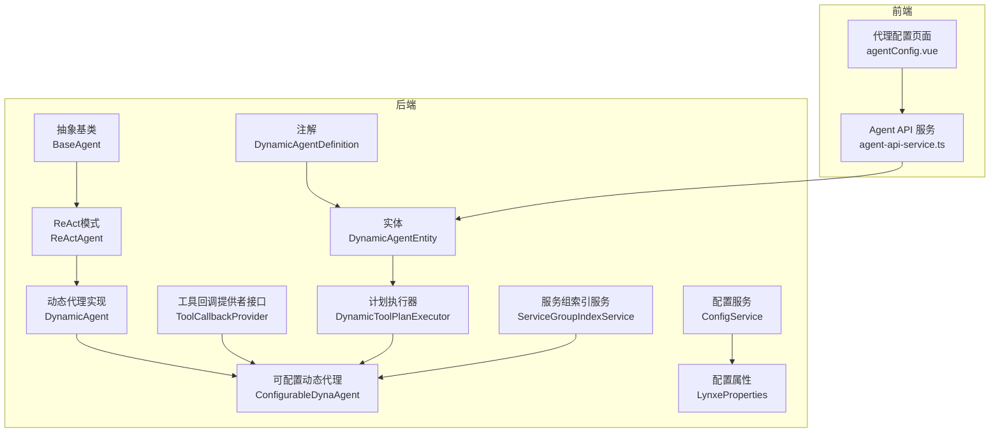
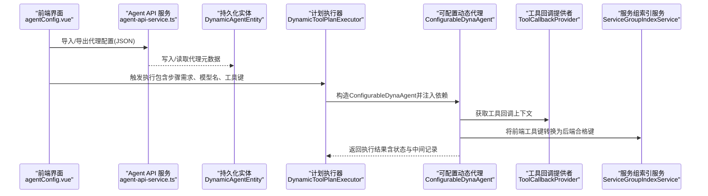
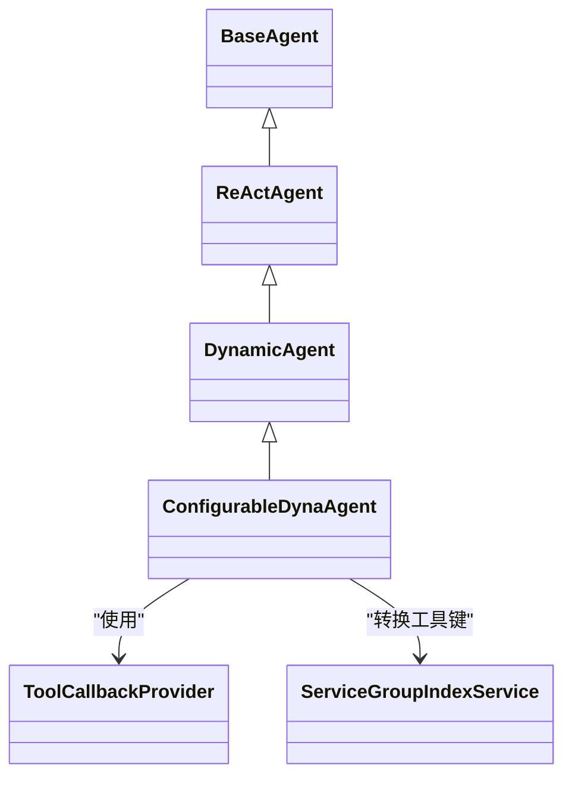
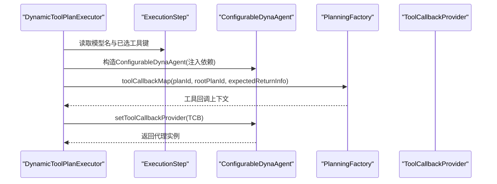
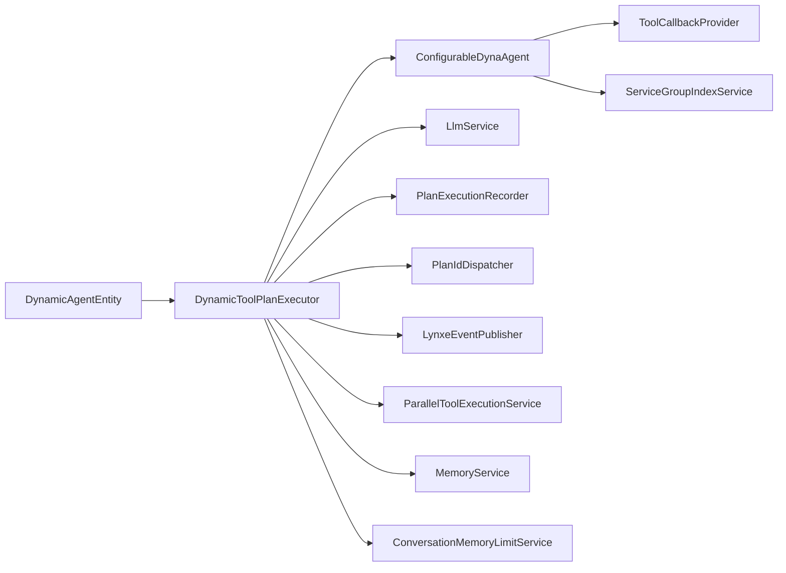

# 配置与初始化

<cite>
**本文引用的文件**
- [DynamicAgentDefinition.java](file://src/main/java/com/alibaba/cloud/ai/lynxe/agent/annotation/DynamicAgentDefinition.java)
- [DynamicAgentEntity.java](file://src/main/java/com/alibaba/cloud/ai/lynxe/agent/entity/DynamicAgentEntity.java)
- [ConfigurableDynaAgent.java](file://src/main/java/com/alibaba/cloud/ai/lynxe/agent/ConfigurableDynaAgent.java)
- [DynamicAgent.java](file://src/main/java/com/alibaba/cloud/ai/lynxe/agent/DynamicAgent.java)
- [BaseAgent.java](file://src/main/java/com/alibaba/cloud/ai/lynxe/agent/BaseAgent.java)
- [ReActAgent.java](file://src/main/java/com/alibaba/cloud/ai/lynxe/agent/ReActAgent.java)
- [ToolCallbackProvider.java](file://src/main/java/com/alibaba/cloud/ai/lynxe/agent/ToolCallbackProvider.java)
- [DynamicToolPlanExecutor.java](file://src/main/java/com/alibaba/cloud/ai/lynxe/runtime/executor/DynamicToolPlanExecutor.java)
- [ServiceGroupIndexService.java](file://src/main/java/com/alibaba/cloud/ai/lynxe/runtime/service/ServiceGroupIndexService.java)
- [ConfigService.java](file://src/main/java/com/alibaba/cloud/ai/lynxe/config/ConfigService.java)
- [LynxeProperties.java](file://src/main/java/com/alibaba/cloud/ai/lynxe/config/LynxeProperties.java)
- [agent-api-service.ts](file://ui-vue3/src/api/agent-api-service.ts)
- [agentConfig.vue](file://ui-vue3/src/views/configs/agentConfig.vue)
</cite>

## 目录
1. [引言](#引言)
2. [项目结构](#项目结构)
3. [核心组件](#核心组件)
4. [架构总览](#架构总览)
5. [详细组件分析](#详细组件分析)
6. [依赖关系分析](#依赖关系分析)
7. [性能考量](#性能考量)
8. [故障排查指南](#故障排查指南)
9. [结论](#结论)
10. [附录](#附录)

## 引言
本章节聚焦于JManus中“AI代理”的配置与初始化机制，围绕以下目标展开：
- 解释ConfigurableDynaAgent如何通过注解驱动的配置机制实现动态代理的实例化与参数注入；
- 详解DynamicAgentDefinition注解的使用方法与属性配置（代理名称、描述、可用工具等元数据）；
- 说明DynamicAgentEntity作为持久化实体如何存储代理配置信息并与数据库交互；
- 阐述代理初始化流程：配置加载、依赖注入与运行时环境准备；
- 通过实际代码路径示例展示如何定义与注册新的动态代理，以及配置的序列化与反序列化过程；
- 解释配置验证机制与错误处理策略；
- 提供配置管理的最佳实践与常见问题解决方案。

## 项目结构
JManus在“agent”模块下提供了完整的动态代理体系，配合“runtime.executor”中的计划执行器完成从配置到运行的全链路闭环；“config”模块负责配置的集中管理与持久化；“ui-vue3”前端提供代理配置的导入导出与可视化操作。

图表来源
- [DynamicAgentDefinition.java](file://src/main/java/com/alibaba/cloud/ai/lynxe/agent/annotation/DynamicAgentDefinition.java#L1-L36)
- [DynamicAgentEntity.java](file://src/main/java/com/alibaba/cloud/ai/lynxe/agent/entity/DynamicAgentEntity.java#L1-L133)
- [BaseAgent.java](file://src/main/java/com/alibaba/cloud/ai/lynxe/agent/BaseAgent.java#L1-L603)
- [ReActAgent.java](file://src/main/java/com/alibaba/cloud/ai/lynxe/agent/ReActAgent.java#L1-L71)
- [DynamicAgent.java](file://src/main/java/com/alibaba/cloud/ai/lynxe/agent/DynamicAgent.java#L1-L800)
- [ConfigurableDynaAgent.java](file://src/main/java/com/alibaba/cloud/ai/lynxe/agent/ConfigurableDynaAgent.java#L1-L342)
- [ToolCallbackProvider.java](file://src/main/java/com/alibaba/cloud/ai/lynxe/agent/ToolCallbackProvider.java#L1-L27)
- [DynamicToolPlanExecutor.java](file://src/main/java/com/alibaba/cloud/ai/lynxe/runtime/executor/DynamicToolPlanExecutor.java#L1-L183)
- [ServiceGroupIndexService.java](file://src/main/java/com/alibaba/cloud/ai/lynxe/runtime/service/ServiceGroupIndexService.java#L80-L132)
- [ConfigService.java](file://src/main/java/com/alibaba/cloud/ai/lynxe/config/ConfigService.java#L1-L320)
- [LynxeProperties.java](file://src/main/java/com/alibaba/cloud/ai/lynxe/config/LynxeProperties.java#L176-L215)
- [agent-api-service.ts](file://ui-vue3/src/api/agent-api-service.ts#L312-L338)
- [agentConfig.vue](file://ui-vue3/src/views/configs/agentConfig.vue#L427-L515)

章节来源
- [DynamicAgentDefinition.java](file://src/main/java/com/alibaba/cloud/ai/lynxe/agent/annotation/DynamicAgentDefinition.java#L1-L36)
- [DynamicAgentEntity.java](file://src/main/java/com/alibaba/cloud/ai/lynxe/agent/entity/DynamicAgentEntity.java#L1-L133)
- [DynamicToolPlanExecutor.java](file://src/main/java/com/alibaba/cloud/ai/lynxe/runtime/executor/DynamicToolPlanExecutor.java#L1-L183)
- [ConfigurableDynaAgent.java](file://src/main/java/com/alibaba/cloud/ai/lynxe/agent/ConfigurableDynaAgent.java#L1-L342)
- [agent-api-service.ts](file://ui-vue3/src/api/agent-api-service.ts#L312-L338)
- [agentConfig.vue](file://ui-vue3/src/views/configs/agentConfig.vue#L427-L515)

## 核心组件
- 注解驱动的元数据定义：DynamicAgentDefinition用于声明代理的名称、描述、下一步提示词与可用工具键集合，为后续动态代理的注册与检索提供依据。
- 持久化实体：DynamicAgentEntity承载代理的元数据与关联模型、命名空间、内置标记等，支持数据库持久化与查询。
- 可配置动态代理：ConfigurableDynaAgent在DynamicAgent基础上扩展了工具列表的动态选择能力，并确保终止工具的存在性与兼容性。
- 计划执行器：DynamicToolPlanExecutor根据步骤需求选择合适的执行器（如ConfigurableDynaAgent），并完成依赖注入与运行时环境设置。
- 工具回调提供者：ToolCallbackProvider提供工具回调上下文映射，供代理按需选择工具。
- 服务组索引服务：ServiceGroupIndexService负责将前端格式的工具键转换为后端执行所需的“带索引”的合格键，保证工具查找的稳定性与兼容性。
- 配置服务与属性：ConfigService负责配置的初始化、读取、更新与回填；LynxeProperties通过注解声明配置项，统一从配置中心或环境变量读取。

章节来源
- [DynamicAgentDefinition.java](file://src/main/java/com/alibaba/cloud/ai/lynxe/agent/annotation/DynamicAgentDefinition.java#L1-L36)
- [DynamicAgentEntity.java](file://src/main/java/com/alibaba/cloud/ai/lynxe/agent/entity/DynamicAgentEntity.java#L1-L133)
- [ConfigurableDynaAgent.java](file://src/main/java/com/alibaba/cloud/ai/lynxe/agent/ConfigurableDynaAgent.java#L1-L342)
- [DynamicToolPlanExecutor.java](file://src/main/java/com/alibaba/cloud/ai/lynxe/runtime/executor/DynamicToolPlanExecutor.java#L1-L183)
- [ToolCallbackProvider.java](file://src/main/java/com/alibaba/cloud/ai/lynxe/agent/ToolCallbackProvider.java#L1-L27)
- [ServiceGroupIndexService.java](file://src/main/java/com/alibaba/cloud/ai/lynxe/runtime/service/ServiceGroupIndexService.java#L80-L132)
- [ConfigService.java](file://src/main/java/com/alibaba/cloud/ai/lynxe/config/ConfigService.java#L1-L320)
- [LynxeProperties.java](file://src/main/java/com/alibaba/cloud/ai/lynxe/config/LynxeProperties.java#L176-L215)

## 架构总览
下面以“配置加载—依赖注入—运行时环境准备—工具选择—执行”为主线，展示从UI到后端的关键交互。

图表来源
- [agentConfig.vue](file://ui-vue3/src/views/configs/agentConfig.vue#L427-L515)
- [agent-api-service.ts](file://ui-vue3/src/api/agent-api-service.ts#L312-L338)
- [DynamicAgentEntity.java](file://src/main/java/com/alibaba/cloud/ai/lynxe/agent/entity/DynamicAgentEntity.java#L1-L133)
- [DynamicToolPlanExecutor.java](file://src/main/java/com/alibaba/cloud/ai/lynxe/runtime/executor/DynamicToolPlanExecutor.java#L120-L183)
- [ConfigurableDynaAgent.java](file://src/main/java/com/alibaba/cloud/ai/lynxe/agent/ConfigurableDynaAgent.java#L1-L342)
- [ServiceGroupIndexService.java](file://src/main/java/com/alibaba/cloud/ai/lynxe/runtime/service/ServiceGroupIndexService.java#L80-L132)

## 详细组件分析

### 注解驱动的代理元数据：DynamicAgentDefinition
- 作用：以注解形式声明代理的元数据，包括代理名称、描述、下一步提示词与可用工具键数组。
- 使用方式：在代理实现类上标注该注解，便于扫描与注册、或在UI侧进行可视化配置与导出。
- 关键点：
  - 代理名称与描述用于标识与展示；
  - 下一步提示词用于指导代理在每步决策时的行为；
  - 可用工具键数组用于限定代理可使用的工具集合。

章节来源
- [DynamicAgentDefinition.java](file://src/main/java/com/alibaba/cloud/ai/lynxe/agent/annotation/DynamicAgentDefinition.java#L1-L36)

### 持久化实体：DynamicAgentEntity
- 字段概览：
  - 基本信息：id、agentName、agentDescription、nextStepPrompt、className、namespace、builtIn；
  - 关联模型：model（多对一）；
  - 可用工具键：availableToolKeys（集合，EAGER抓取）。
- 数据库交互：
  - 支持唯一约束的代理名称；
  - 工具键集合通过独立表存储，便于查询与筛选；
  - 支持内置标记，便于区分默认与用户自定义代理。
- 用途：作为代理配置的持久化载体，配合前端导入导出与后端加载。

章节来源
- [DynamicAgentEntity.java](file://src/main/java/com/alibaba/cloud/ai/lynxe/agent/entity/DynamicAgentEntity.java#L1-L133)

### 可配置动态代理：ConfigurableDynaAgent
- 继承关系：ConfigurableDynaAgent继承DynamicAgent，后者继承ReActAgent，再由ReActAgent继承BaseAgent。
- 动态工具选择：
  - 若未指定可用工具键，则自动从工具回调上下文中选择全部工具；
  - 确保存在终止工具（TerminableTool/TerminateTool），否则自动补充；
  - 支持服务组工具键的向前兼容查找（serviceGroup.toolName → toolName*index*）。
- 服务组键转换：
  - 通过ServiceGroupIndexService将前端传入的工具键转换为后端执行所需的合格键；
  - 若转换失败或无需转换则回退到原键。
- 错误处理：
  - 当工具回调缺失时记录警告并继续；
  - 对工具执行异常进行包装与记录，避免中断整体流程。

图表来源
- [BaseAgent.java](file://src/main/java/com/alibaba/cloud/ai/lynxe/agent/BaseAgent.java#L1-L603)
- [ReActAgent.java](file://src/main/java/com/alibaba/cloud/ai/lynxe/agent/ReActAgent.java#L1-L71)
- [DynamicAgent.java](file://src/main/java/com/alibaba/cloud/ai/lynxe/agent/DynamicAgent.java#L1-L800)
- [ConfigurableDynaAgent.java](file://src/main/java/com/alibaba/cloud/ai/lynxe/agent/ConfigurableDynaAgent.java#L1-L342)
- [ToolCallbackProvider.java](file://src/main/java/com/alibaba/cloud/ai/lynxe/agent/ToolCallbackProvider.java#L1-L27)
- [ServiceGroupIndexService.java](file://src/main/java/com/alibaba/cloud/ai/lynxe/runtime/service/ServiceGroupIndexService.java#L80-L132)

章节来源
- [ConfigurableDynaAgent.java](file://src/main/java/com/alibaba/cloud/ai/lynxe/agent/ConfigurableDynaAgent.java#L1-L342)
- [DynamicAgent.java](file://src/main/java/com/alibaba/cloud/ai/lynxe/agent/DynamicAgent.java#L1-L800)
- [ServiceGroupIndexService.java](file://src/main/java/com/alibaba/cloud/ai/lynxe/runtime/service/ServiceGroupIndexService.java#L80-L132)

### 计划执行器：DynamicToolPlanExecutor
- 职责：
  - 根据步骤需求选择执行器类型（如ConfigurableDynaAgent）；
  - 完成依赖注入：LLM服务、工具调用管理器、计划ID分发器、事件发布器、并行工具执行服务、内存服务、对话记忆限制服务、服务组索引服务等；
  - 设置运行时环境：当前计划ID、根计划ID、计划深度、会话ID等；
  - 通过PlanningFactory构建工具回调上下文并注入代理。
- 关键流程：
  - 从ExecutionStep中读取模型名与已选工具键；
  - 构造ConfigurableDynaAgent并设置ToolCallbackProvider；
  - 返回代理实例供后续执行。

图表来源
- [DynamicToolPlanExecutor.java](file://src/main/java/com/alibaba/cloud/ai/lynxe/runtime/executor/DynamicToolPlanExecutor.java#L120-L183)

章节来源
- [DynamicToolPlanExecutor.java](file://src/main/java/com/alibaba/cloud/ai/lynxe/runtime/executor/DynamicToolPlanExecutor.java#L1-L183)

### 工具键转换与兼容性：ServiceGroupIndexService
- 功能：
  - 将serviceGroup.toolName格式转换为toolName*index*格式；
  - 通过缓存与索引分配，提升工具查找效率；
  - 在转换失败或无需转换时回退到原键。
- 兼容性：
  - ConfigurableDynaAgent在工具查找时优先尝试合格键，若失败则回退到未加索引的工具名匹配；
  - 支持同时处理无服务组与有服务组的工具实例。

章节来源
- [ServiceGroupIndexService.java](file://src/main/java/com/alibaba/cloud/ai/lynxe/runtime/service/ServiceGroupIndexService.java#L80-L132)
- [ConfigurableDynaAgent.java](file://src/main/java/com/alibaba/cloud/ai/lynxe/agent/ConfigurableDynaAgent.java#L201-L341)

### 配置加载与持久化：ConfigService 与 LynxeProperties
- ConfigService：
  - 扫描带有@ConfigurationProperties的Bean，收集@ConfigProperty声明的配置项；
  - 初始化数据库中的配置记录（默认值、描述、输入类型、选项JSON等）；
  - 提供读取、更新、批量更新、重置等能力，并维护缓存；
  - 在Bean字段变化时自动清理过期配置。
- LynxeProperties：
  - 通过@ConfigProperty声明具体配置项（如最大内存、用户输入超时等），并提供默认值；
  - 运行时从ConfigService读取最新值，确保配置生效。

章节来源
- [ConfigService.java](file://src/main/java/com/alibaba/cloud/ai/lynxe/config/ConfigService.java#L1-L320)
- [LynxeProperties.java](file://src/main/java/com/alibaba/cloud/ai/lynxe/config/LynxeProperties.java#L176-L215)

### 前端配置导入导出与校验
- 导出：将代理对象序列化为JSON字符串；
- 导入：解析JSON字符串并进行基础校验（如必须字段）；
- 页面：提供代理列表加载、详情选择、新增代理等操作。

章节来源
- [agent-api-service.ts](file://ui-vue3/src/api/agent-api-service.ts#L312-L338)
- [agentConfig.vue](file://ui-vue3/src/views/configs/agentConfig.vue#L427-L515)

## 依赖关系分析
- 组件耦合：
  - ConfigurableDynaAgent依赖ToolCallbackProvider与ServiceGroupIndexService，用于工具选择与键转换；
  - DynamicToolPlanExecutor聚合多个服务（LLM、工具调用管理器、并行执行服务、内存服务等），并向代理注入；
  - DynamicAgentEntity作为配置载体，被前端导入导出与后端加载。
- 外部依赖：
  - Spring AI工具调用框架（ToolCallingManager、ToolCallback等）；
  - Jackson（ObjectMapper）用于序列化与反序列化；
  - 前端Vue3组件与API服务。

图表来源
- [DynamicAgentEntity.java](file://src/main/java/com/alibaba/cloud/ai/lynxe/agent/entity/DynamicAgentEntity.java#L1-L133)
- [DynamicToolPlanExecutor.java](file://src/main/java/com/alibaba/cloud/ai/lynxe/runtime/executor/DynamicToolPlanExecutor.java#L1-L183)
- [ConfigurableDynaAgent.java](file://src/main/java/com/alibaba/cloud/ai/lynxe/agent/ConfigurableDynaAgent.java#L1-L342)

章节来源
- [DynamicAgentEntity.java](file://src/main/java/com/alibaba/cloud/ai/lynxe/agent/entity/DynamicAgentEntity.java#L1-L133)
- [DynamicToolPlanExecutor.java](file://src/main/java/com/alibaba/cloud/ai/lynxe/runtime/executor/DynamicToolPlanExecutor.java#L1-L183)
- [ConfigurableDynaAgent.java](file://src/main/java/com/alibaba/cloud/ai/lynxe/agent/ConfigurableDynaAgent.java#L1-L342)

## 性能考量
- 工具键查找优化：
  - 使用ServiceGroupIndexService进行合格键转换与索引缓存，减少遍历成本；
  - 在ConfigurableDynaAgent中优先精确匹配合格键，失败后再回退到未加索引的工具名匹配。
- 流式响应与重试：
  - DynamicAgent在思考阶段采用流式响应与指数退避重试，降低网络抖动影响；
  - 对早期仅思考不调用工具的情况进行阈值检测与提示，避免无效循环。
- 并行工具执行：
  - 通过ParallelToolExecutionService支持多工具并发执行，提高吞吐；
  - 对受限工具（如TerminableTool、FormInputTool）进行保护性检查，避免不支持场景。

章节来源
- [ServiceGroupIndexService.java](file://src/main/java/com/alibaba/cloud/ai/lynxe/runtime/service/ServiceGroupIndexService.java#L80-L132)
- [ConfigurableDynaAgent.java](file://src/main/java/com/alibaba/cloud/ai/lynxe/agent/ConfigurableDynaAgent.java#L201-L341)
- [DynamicAgent.java](file://src/main/java/com/alibaba/cloud/ai/lynxe/agent/DynamicAgent.java#L232-L485)

## 故障排查指南
- 工具缺失或键不匹配：
  - 现象：工具回调缺失或工具执行报错；
  - 排查：确认工具键是否正确（含服务组前缀）、是否已转换为合格键；检查ToolCallbackProvider提供的上下文是否完整。
- 代理未选择工具：
  - 现象：多次重试后仍无工具调用；
  - 排查：检查模型输出是否符合工具调用规范；适当增加显式工具调用要求；查看EarlyTermination阈值日志。
- 配置未生效：
  - 现象：修改配置后未立即生效；
  - 排查：确认ConfigService是否正确回填Bean字段；检查缓存是否过期；必要时触发重置或重启应用。
- 前端导入失败：
  - 现象：导入JSON时报格式错误；
  - 排查：确认JSON包含必要字段（如name、description）；检查字段类型与格式。

章节来源
- [ConfigurableDynaAgent.java](file://src/main/java/com/alibaba/cloud/ai/lynxe/agent/ConfigurableDynaAgent.java#L1-L342)
- [DynamicAgent.java](file://src/main/java/com/alibaba/cloud/ai/lynxe/agent/DynamicAgent.java#L232-L485)
- [ConfigService.java](file://src/main/java/com/alibaba/cloud/ai/lynxe/config/ConfigService.java#L1-L320)
- [agent-api-service.ts](file://ui-vue3/src/api/agent-api-service.ts#L312-L338)

## 结论
JManus通过注解驱动的元数据、实体持久化、可配置动态代理与计划执行器的协同，实现了灵活且可扩展的代理配置与初始化机制。前端提供导入导出与可视化管理，后端通过配置服务与工具键转换保障运行时的稳定性与兼容性。该体系既满足快速迭代的开发需求，也具备良好的性能与可观测性。

## 附录

### 如何定义与注册新的动态代理（代码路径指引）
- 定义注解元数据：在代理实现类上添加DynamicAgentDefinition，填写代理名称、描述、下一步提示词与可用工具键数组。
  - 参考路径：[DynamicAgentDefinition.java](file://src/main/java/com/alibaba/cloud/ai/lynxe/agent/annotation/DynamicAgentDefinition.java#L1-L36)
- 实现代理逻辑：继承ReActAgent/DynamicAgent/ConfigurableDynaAgent之一，按需覆盖思考与行动逻辑。
  - 参考路径：[ReActAgent.java](file://src/main/java/com/alibaba/cloud/ai/lynxe/agent/ReActAgent.java#L1-L71)、[DynamicAgent.java](file://src/main/java/com/alibaba/cloud/ai/lynxe/agent/DynamicAgent.java#L1-L800)、[ConfigurableDynaAgent.java](file://src/main/java/com/alibaba/cloud/ai/lynxe/agent/ConfigurableDynaAgent.java#L1-L342)
- 注册与注入：由DynamicToolPlanExecutor根据步骤需求构造ConfigurableDynaAgent并注入依赖。
  - 参考路径：[DynamicToolPlanExecutor.java](file://src/main/java/com/alibaba/cloud/ai/lynxe/runtime/executor/DynamicToolPlanExecutor.java#L120-L183)
- 持久化与导入导出：通过DynamicAgentEntity保存代理配置；前端提供JSON导入导出。
  - 参考路径：[DynamicAgentEntity.java](file://src/main/java/com/alibaba/cloud/ai/lynxe/agent/entity/DynamicAgentEntity.java#L1-L133)、[agent-api-service.ts](file://ui-vue3/src/api/agent-api-service.ts#L312-L338)

### 配置验证与错误处理策略
- 配置验证：
  - ConfigService在启动时扫描并初始化配置项，清理过期配置；
  - LynxeProperties通过注解声明默认值与输入类型，确保配置一致性。
  - 参考路径：[ConfigService.java](file://src/main/java/com/alibaba/cloud/ai/lynxe/config/ConfigService.java#L1-L320)、[LynxeProperties.java](file://src/main/java/com/alibaba/cloud/ai/lynxe/config/LynxeProperties.java#L176-L215)
- 错误处理：
  - 代理层：对工具缺失、异常执行进行包装与记录，避免中断；
  - 执行层：对早期仅思考不调用工具进行阈值控制与提示；
  - 参考路径：[ConfigurableDynaAgent.java](file://src/main/java/com/alibaba/cloud/ai/lynxe/agent/ConfigurableDynaAgent.java#L1-L342)、[DynamicAgent.java](file://src/main/java/com/alibaba/cloud/ai/lynxe/agent/DynamicAgent.java#L232-L485)