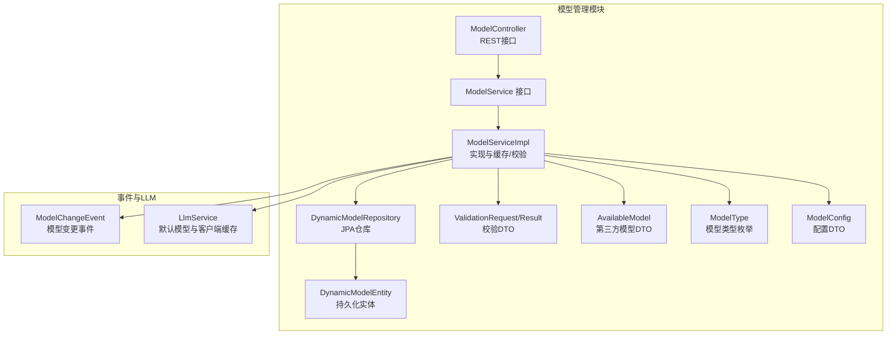
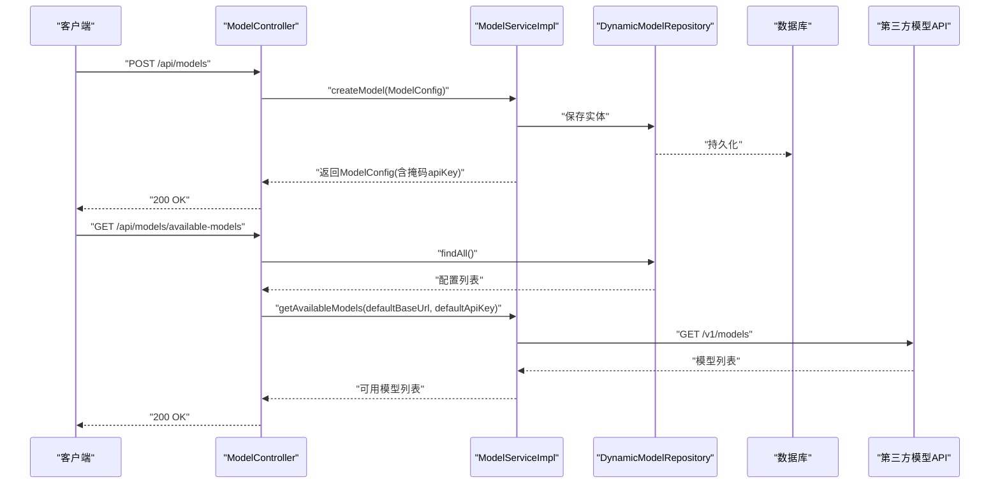
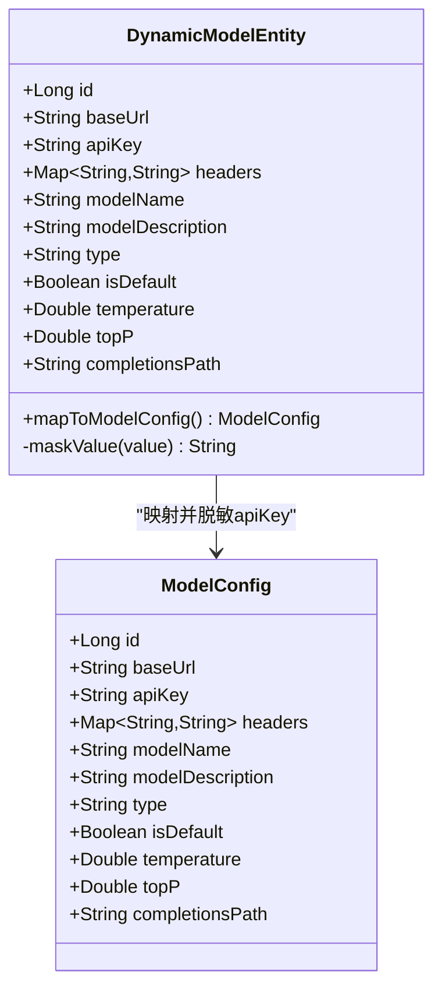
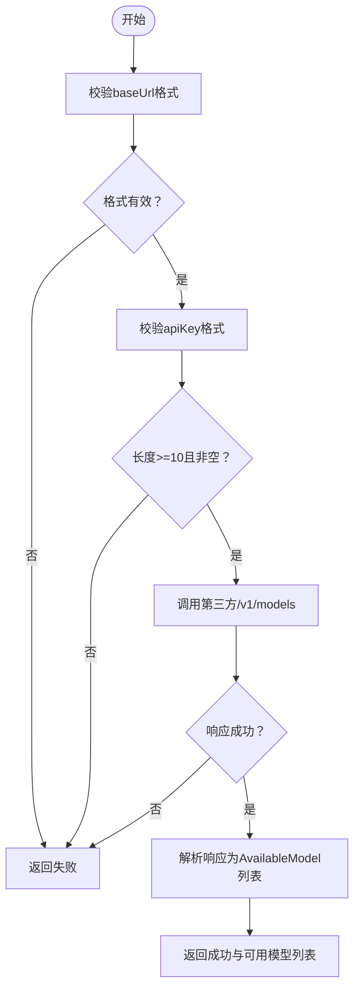
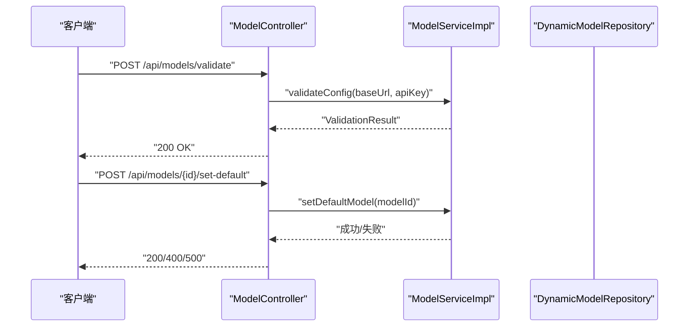
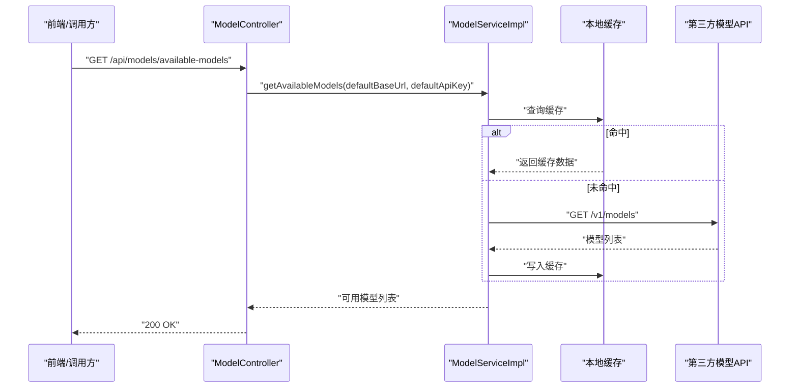
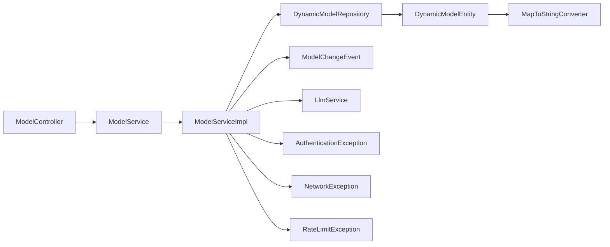

# 动态模型管理

<cite>
**本文引用的文件列表**
- [ModelController.java](file://src/main/java/com/alibaba/cloud/ai/lynxe/model/controller/ModelController.java)
- [ModelService.java](file://src/main/java/com/alibaba/cloud/ai/lynxe/model/service/ModelService.java)
- [ModelServiceImpl.java](file://src/main/java/com/alibaba/cloud/ai/lynxe/model/service/ModelServiceImpl.java)
- [DynamicModelEntity.java](file://src/main/java/com/alibaba/cloud/ai/lynxe/model/entity/DynamicModelEntity.java)
- [DynamicModelRepository.java](file://src/main/java/com/alibaba/cloud/ai/lynxe/model/repository/DynamicModelRepository.java)
- [ModelConfig.java](file://src/main/java/com/alibaba/cloud/ai/lynxe/model/model/vo/ModelConfig.java)
- [ModelType.java](file://src/main/java/com/alibaba/cloud/ai/lynxe/model/model/enums/ModelType.java)
- [AvailableModel.java](file://src/main/java/com/alibaba/cloud/ai/lynxe/model/model/vo/AvailableModel.java)
- [ValidationRequest.java](file://src/main/java/com/alibaba/cloud/ai/lynxe/model/model/vo/ValidationRequest.java)
- [ValidationResult.java](file://src/main/java/com/alibaba/cloud/ai/lynxe/model/model/vo/ValidationResult.java)
- [MapToStringConverter.java](file://src/main/java/com/alibaba/cloud/ai/lynxe/model/entity/MapToStringConverter.java)
- [AuthenticationException.java](file://src/main/java/com/alibaba/cloud/ai/lynxe/model/exception/AuthenticationException.java)
- [NetworkException.java](file://src/main/java/com/alibaba/cloud/ai/lynxe/model/exception/NetworkException.java)
- [RateLimitException.java](file://src/main/java/com/alibaba/cloud/ai/lynxe/model/exception/RateLimitException.java)
- [ModelChangeEvent.java](file://src/main/java/com/alibaba/cloud/ai/lynxe/event/ModelChangeEvent.java)
- [LlmService.java](file://src/main/java/com/alibaba/cloud/ai/lynxe/llm/LlmService.java)
</cite>

## 目录
1. [简介](#简介)
2. [项目结构](#项目结构)
3. [核心组件](#核心组件)
4. [架构总览](#架构总览)
5. [详细组件分析](#详细组件分析)
6. [依赖关系分析](#依赖关系分析)
7. [性能与安全考量](#性能与安全考量)
8. [故障排查指南](#故障排查指南)
9. [结论](#结论)
10. [附录](#附录)

## 简介
本文件面向JManus的“动态模型管理”能力，围绕DynamicModelEntity实体、ModelService服务层、ModelController控制器展开，系统性说明：
- DynamicModelEntity字段语义与映射关系（baseUrl、apiKey、headers、modelName、type、isDefault等）
- 模型配置的加密与脱敏机制（尤其是apiKey的掩码处理）
- ModelService提供的模型注册、校验与调用支持
- ModelController暴露的REST接口与典型使用流程
- 模型发现与可用模型缓存策略
- 安全最佳实践与性能优化建议

## 项目结构
动态模型管理相关代码主要位于以下包路径：
- 控制器：com.alibaba.cloud.ai.lynxe.model.controller
- 服务层：com.alibaba.cloud.ai.lynxe.model.service
- 实体与仓库：com.alibaba.cloud.ai.lynxe.model.entity、com.alibaba.cloud.ai.lynxe.model.repository
- VO与枚举：com.alibaba.cloud.ai.lynxe.model.model.vo、com.alibaba.cloud.ai.lynxe.model.model.enums
- 异常：com.alibaba.cloud.ai.lynxe.model.exception
- 事件与LLM集成：com.alibaba.cloud.ai.lynxe.event、com.alibaba.cloud.ai.lynxe.llm

图表来源
- [ModelController.java](file://src/main/java/com/alibaba/cloud/ai/lynxe/model/controller/ModelController.java#L1-L176)
- [ModelService.java](file://src/main/java/com/alibaba/cloud/ai/lynxe/model/service/ModelService.java#L1-L40)
- [ModelServiceImpl.java](file://src/main/java/com/alibaba/cloud/ai/lynxe/model/service/ModelServiceImpl.java#L1-L485)
- [DynamicModelEntity.java](file://src/main/java/com/alibaba/cloud/ai/lynxe/model/entity/DynamicModelEntity.java#L1-L190)
- [DynamicModelRepository.java](file://src/main/java/com/alibaba/cloud/ai/lynxe/model/repository/DynamicModelRepository.java#L1-L31)
- [ValidationRequest.java](file://src/main/java/com/alibaba/cloud/ai/lynxe/model/model/vo/ValidationRequest.java#L1-L52)
- [ValidationResult.java](file://src/main/java/com/alibaba/cloud/ai/lynxe/model/model/vo/ValidationResult.java#L1-L70)
- [AvailableModel.java](file://src/main/java/com/alibaba/cloud/ai/lynxe/model/model/vo/AvailableModel.java#L1-L63)
- [ModelType.java](file://src/main/java/com/alibaba/cloud/ai/lynxe/model/model/enums/ModelType.java#L1-L88)
- [ModelConfig.java](file://src/main/java/com/alibaba/cloud/ai/lynxe/model/model/vo/ModelConfig.java#L1-L137)
- [ModelChangeEvent.java](file://src/main/java/com/alibaba/cloud/ai/lynxe/event/ModelChangeEvent.java#L1-L45)
- [LlmService.java](file://src/main/java/com/alibaba/cloud/ai/lynxe/llm/LlmService.java#L1-L200)

章节来源
- [ModelController.java](file://src/main/java/com/alibaba/cloud/ai/lynxe/model/controller/ModelController.java#L1-L176)
- [ModelService.java](file://src/main/java/com/alibaba/cloud/ai/lynxe/model/service/ModelService.java#L1-L40)
- [ModelServiceImpl.java](file://src/main/java/com/alibaba/cloud/ai/lynxe/model/service/ModelServiceImpl.java#L1-L485)
- [DynamicModelEntity.java](file://src/main/java/com/alibaba/cloud/ai/lynxe/model/entity/DynamicModelEntity.java#L1-L190)
- [DynamicModelRepository.java](file://src/main/java/com/alibaba/cloud/ai/lynxe/model/repository/DynamicModelRepository.java#L1-L31)
- [ModelConfig.java](file://src/main/java/com/alibaba/cloud/ai/lynxe/model/model/vo/ModelConfig.java#L1-L137)
- [ModelType.java](file://src/main/java/com/alibaba/cloud/ai/lynxe/model/model/enums/ModelType.java#L1-L88)
- [AvailableModel.java](file://src/main/java/com/alibaba/cloud/ai/lynxe/model/model/vo/AvailableModel.java#L1-L63)
- [ValidationRequest.java](file://src/main/java/com/alibaba/cloud/ai/lynxe/model/model/vo/ValidationRequest.java#L1-L52)
- [ValidationResult.java](file://src/main/java/com/alibaba/cloud/ai/lynxe/model/model/vo/ValidationResult.java#L1-L70)
- [MapToStringConverter.java](file://src/main/java/com/alibaba/cloud/ai/lynxe/model/entity/MapToStringConverter.java#L1-L66)
- [ModelChangeEvent.java](file://src/main/java/com/alibaba/cloud/ai/lynxe/event/ModelChangeEvent.java#L1-L45)
- [LlmService.java](file://src/main/java/com/alibaba/cloud/ai/lynxe/llm/LlmService.java#L1-L200)

## 核心组件
- DynamicModelEntity：持久化实体，承载模型配置与运行参数（如温度、topP、补全路径等），并提供从数据库到DTO的映射方法与敏感信息掩码。
- ModelService/ModelServiceImpl：模型生命周期管理（增删改查、默认模型切换、可用模型发现与缓存、配置校验）。
- ModelController：对外暴露REST接口，统一入口进行模型管理与校验。
- VO与枚举：ModelConfig（传输对象）、ModelType（模型类型）、AvailableModel（第三方模型）、ValidationRequest/Result（校验请求/结果）。
- 转换器：MapToStringConverter，将请求头Map序列化为字符串存储，读取时反序列化。
- 事件与LLM：ModelChangeEvent用于发布模型变更；LlmService负责默认模型懒加载与ChatClient缓存。

章节来源
- [DynamicModelEntity.java](file://src/main/java/com/alibaba/cloud/ai/lynxe/model/entity/DynamicModelEntity.java#L1-L190)
- [ModelService.java](file://src/main/java/com/alibaba/cloud/ai/lynxe/model/service/ModelService.java#L1-L40)
- [ModelServiceImpl.java](file://src/main/java/com/alibaba/cloud/ai/lynxe/model/service/ModelServiceImpl.java#L1-L485)
- [ModelController.java](file://src/main/java/com/alibaba/cloud/ai/lynxe/model/controller/ModelController.java#L1-L176)
- [ModelConfig.java](file://src/main/java/com/alibaba/cloud/ai/lynxe/model/model/vo/ModelConfig.java#L1-L137)
- [ModelType.java](file://src/main/java/com/alibaba/cloud/ai/lynxe/model/model/enums/ModelType.java#L1-L88)
- [AvailableModel.java](file://src/main/java/com/alibaba/cloud/ai/lynxe/model/model/vo/AvailableModel.java#L1-L63)
- [ValidationRequest.java](file://src/main/java/com/alibaba/cloud/ai/lynxe/model/model/vo/ValidationRequest.java#L1-L52)
- [ValidationResult.java](file://src/main/java/com/alibaba/cloud/ai/lynxe/model/model/vo/ValidationResult.java#L1-L70)
- [MapToStringConverter.java](file://src/main/java/com/alibaba/cloud/ai/lynxe/model/entity/MapToStringConverter.java#L1-L66)
- [ModelChangeEvent.java](file://src/main/java/com/alibaba/cloud/ai/lynxe/event/ModelChangeEvent.java#L1-L45)
- [LlmService.java](file://src/main/java/com/alibaba/cloud/ai/lynxe/llm/LlmService.java#L1-L200)

## 架构总览
动态模型管理采用经典的分层架构：
- 表现层：ModelController提供REST接口，负责请求解析与响应封装。
- 领域层：ModelService定义模型管理契约，ModelServiceImpl实现具体业务逻辑。
- 数据访问层：DynamicModelRepository基于JPA访问数据库。
- 持久化实体：DynamicModelEntity映射表结构，包含敏感字段（apiKey）的脱敏映射。
- 外部集成：ModelServiceImpl通过RestTemplate调用第三方模型列表接口，并对响应进行解析与缓存；变更事件触发LlmService刷新默认模型缓存。

图表来源
- [ModelController.java](file://src/main/java/com/alibaba/cloud/ai/lynxe/model/controller/ModelController.java#L1-L176)
- [ModelServiceImpl.java](file://src/main/java/com/alibaba/cloud/ai/lynxe/model/service/ModelServiceImpl.java#L1-L485)
- [DynamicModelRepository.java](file://src/main/java/com/alibaba/cloud/ai/lynxe/model/repository/DynamicModelRepository.java#L1-L31)

## 详细组件分析

### DynamicModelEntity 实体结构与字段语义
- 基础URL（baseUrl）：模型服务的基础地址，用于构建第三方模型列表请求。
- API密钥（apiKey）：访问第三方模型服务的凭据，映射到DTO时会进行掩码处理。
- 请求头（headers）：以Map形式存储，通过MapToStringConverter序列化后持久化，读取时反序列化。
- 模型名称（modelName）：模型标识名，用于去重与显示。
- 模型类型（type）：枚举类型，限定模型用途类别。
- 默认标记（isDefault）：是否作为默认模型使用。
- 运行参数：temperature、topP、completionsPath（默认补全路径）。
- 映射与脱敏：mapToModelConfig将实体转为ModelConfig时，对apiKey执行掩码处理；内部maskValue用于脱敏展示。

图表来源
- [DynamicModelEntity.java](file://src/main/java/com/alibaba/cloud/ai/lynxe/model/entity/DynamicModelEntity.java#L1-L190)
- [ModelConfig.java](file://src/main/java/com/alibaba/cloud/ai/lynxe/model/model/vo/ModelConfig.java#L1-L137)

章节来源
- [DynamicModelEntity.java](file://src/main/java/com/alibaba/cloud/ai/lynxe/model/entity/DynamicModelEntity.java#L1-L190)
- [MapToStringConverter.java](file://src/main/java/com/alibaba/cloud/ai/lynxe/model/entity/MapToStringConverter.java#L1-L66)

### ModelService/ModelServiceImpl：注册、校验与调用
- 注册与更新：createModel/updateModel负责设置默认值、去重、持久化、事件发布与默认模型缓存刷新。
- 删除：deleteModel删除后刷新默认模型缓存，保证一致性。
- 默认模型：setDefaultModel在数据库中仅保留一个isDefault=true，变更后发布事件并刷新缓存。
- 配置校验：validateConfig执行URL格式、API Key格式校验，并调用第三方API获取可用模型列表，返回ValidationResult。
- 可用模型发现：getAvailableModels带2秒过期的内存缓存，避免频繁请求第三方API。
- 第三方调用：callThirdPartyApiInternal标准化baseUrl，自动拼接/v1/models路径，设置Authorization与Content-Type，记录耗时并解析响应。

图表来源
- [ModelServiceImpl.java](file://src/main/java/com/alibaba/cloud/ai/lynxe/model/service/ModelServiceImpl.java#L1-L485)
- [ValidationResult.java](file://src/main/java/com/alibaba/cloud/ai/lynxe/model/model/vo/ValidationResult.java#L1-L70)
- [AvailableModel.java](file://src/main/java/com/alibaba/cloud/ai/lynxe/model/model/vo/AvailableModel.java#L1-L63)

章节来源
- [ModelService.java](file://src/main/java/com/alibaba/cloud/ai/lynxe/model/service/ModelService.java#L1-L40)
- [ModelServiceImpl.java](file://src/main/java/com/alibaba/cloud/ai/lynxe/model/service/ModelServiceImpl.java#L1-L485)
- [ValidationRequest.java](file://src/main/java/com/alibaba/cloud/ai/lynxe/model/model/vo/ValidationRequest.java#L1-L52)
- [ValidationResult.java](file://src/main/java/com/alibaba/cloud/ai/lynxe/model/model/vo/ValidationResult.java#L1-L70)

### ModelController：管理接口与典型用法
- 获取所有模型：GET /api/models
- 获取指定模型：GET /api/models/{id}
- 新增模型：POST /api/models
- 更新模型：PUT /api/models/{id}
- 删除模型：DELETE /api/models/{id}
- 获取模型类型：GET /api/models/types
- 校验配置：POST /api/models/validate（baseUrl、apiKey）
- 设置默认模型：POST /api/models/{id}/set-default
- 获取可用模型：GET /api/models/available-models（从数据库直接读取默认模型的原始apiKey，绕过DTO脱敏）

图表来源
- [ModelController.java](file://src/main/java/com/alibaba/cloud/ai/lynxe/model/controller/ModelController.java#L1-L176)
- [ModelServiceImpl.java](file://src/main/java/com/alibaba/cloud/ai/lynxe/model/service/ModelServiceImpl.java#L1-L485)

章节来源
- [ModelController.java](file://src/main/java/com/alibaba/cloud/ai/lynxe/model/controller/ModelController.java#L1-L176)

### 模型发现与负载均衡策略
- 模型发现：ModelController在获取可用模型时，直接从数据库读取默认模型的原始apiKey，避免DTO层的掩码影响第三方API调用。
- 缓存策略：ModelServiceImpl对第三方/v1/models请求使用2秒过期的内存缓存，降低网络开销。
- 默认模型选择：LlmService在首次使用时懒加载默认模型，若未设置则回退到第一个模型；ChatClient按模型名缓存，支持多模型并发使用。

图表来源
- [ModelController.java](file://src/main/java/com/alibaba/cloud/ai/lynxe/model/controller/ModelController.java#L1-L176)
- [ModelServiceImpl.java](file://src/main/java/com/alibaba/cloud/ai/lynxe/model/service/ModelServiceImpl.java#L1-L485)
- [LlmService.java](file://src/main/java/com/alibaba/cloud/ai/lynxe/llm/LlmService.java#L1-L200)

章节来源
- [ModelController.java](file://src/main/java/com/alibaba/cloud/ai/lynxe/model/controller/ModelController.java#L1-L176)
- [ModelServiceImpl.java](file://src/main/java/com/alibaba/cloud/ai/lynxe/model/service/ModelServiceImpl.java#L1-L485)
- [LlmService.java](file://src/main/java/com/alibaba/cloud/ai/lynxe/llm/LlmService.java#L1-L200)

## 依赖关系分析
- 控制器依赖服务接口，服务实现依赖仓库与事件发布器。
- 实体依赖转换器处理headers字段的序列化/反序列化。
- 服务实现依赖RestTemplate进行第三方API调用，并抛出自定义异常类型。
- 事件触发LLM服务刷新默认模型缓存，确保运行时一致性。

图表来源
- [ModelController.java](file://src/main/java/com/alibaba/cloud/ai/lynxe/model/controller/ModelController.java#L1-L176)
- [ModelService.java](file://src/main/java/com/alibaba/cloud/ai/lynxe/model/service/ModelService.java#L1-L40)
- [ModelServiceImpl.java](file://src/main/java/com/alibaba/cloud/ai/lynxe/model/service/ModelServiceImpl.java#L1-L485)
- [DynamicModelRepository.java](file://src/main/java/com/alibaba/cloud/ai/lynxe/model/repository/DynamicModelRepository.java#L1-L31)
- [DynamicModelEntity.java](file://src/main/java/com/alibaba/cloud/ai/lynxe/model/entity/DynamicModelEntity.java#L1-L190)
- [MapToStringConverter.java](file://src/main/java/com/alibaba/cloud/ai/lynxe/model/entity/MapToStringConverter.java#L1-L66)
- [ModelChangeEvent.java](file://src/main/java/com/alibaba/cloud/ai/lynxe/event/ModelChangeEvent.java#L1-L45)
- [LlmService.java](file://src/main/java/com/alibaba/cloud/ai/lynxe/llm/LlmService.java#L1-L200)
- [AuthenticationException.java](file://src/main/java/com/alibaba/cloud/ai/lynxe/model/exception/AuthenticationException.java#L1-L32)
- [NetworkException.java](file://src/main/java/com/alibaba/cloud/ai/lynxe/model/exception/NetworkException.java#L1-L32)
- [RateLimitException.java](file://src/main/java/com/alibaba/cloud/ai/lynxe/model/exception/RateLimitException.java#L1-L32)

章节来源
- [ModelServiceImpl.java](file://src/main/java/com/alibaba/cloud/ai/lynxe/model/service/ModelServiceImpl.java#L1-L485)
- [DynamicModelEntity.java](file://src/main/java/com/alibaba/cloud/ai/lynxe/model/entity/DynamicModelEntity.java#L1-L190)
- [MapToStringConverter.java](file://src/main/java/com/alibaba/cloud/ai/lynxe/model/entity/MapToStringConverter.java#L1-L66)
- [ModelChangeEvent.java](file://src/main/java/com/alibaba/cloud/ai/lynxe/event/ModelChangeEvent.java#L1-L45)
- [LlmService.java](file://src/main/java/com/alibaba/cloud/ai/lynxe/llm/LlmService.java#L1-L200)

## 性能与安全考量

### 性能特性
- 可用模型缓存：ModelServiceImpl对/v1/models请求使用2秒过期的内存缓存，减少网络往返与第三方API压力。
- ChatClient缓存：LlmService按模型名缓存ChatClient实例，避免重复初始化带来的开销。
- 默认模型懒加载：LlmService在首次使用时才加载默认模型，减少启动时的资源占用。

### 安全最佳实践
- 敏感信息脱敏：DynamicModelEntity.mapToModelConfig对apiKey进行掩码处理，防止在返回给前端或日志中泄露完整密钥。
- 校验与掩码：ModelServiceImpl.validateConfig与callThirdPartyApiInternal在日志中使用maskApiKey进行脱敏输出。
- 访问控制：ModelController对部分操作返回499状态码（自定义），提示不支持的操作，避免误用。
- 错误分类：针对认证失败、网络异常、限流等场景抛出特定异常类型，便于上层区分处理。

章节来源
- [DynamicModelEntity.java](file://src/main/java/com/alibaba/cloud/ai/lynxe/model/entity/DynamicModelEntity.java#L1-L190)
- [ModelServiceImpl.java](file://src/main/java/com/alibaba/cloud/ai/lynxe/model/service/ModelServiceImpl.java#L1-L485)
- [ModelController.java](file://src/main/java/com/alibaba/cloud/ai/lynxe/model/controller/ModelController.java#L1-L176)
- [AuthenticationException.java](file://src/main/java/com/alibaba/cloud/ai/lynxe/model/exception/AuthenticationException.java#L1-L32)
- [NetworkException.java](file://src/main/java/com/alibaba/cloud/ai/lynxe/model/exception/NetworkException.java#L1-L32)
- [RateLimitException.java](file://src/main/java/com/alibaba/cloud/ai/lynxe/model/exception/RateLimitException.java#L1-L32)

## 故障排查指南
- 校验失败
  - 现象：POST /api/models/validate 返回valid=false。
  - 排查：检查baseUrl协议（http/https）与格式；确认apiKey长度≥10且非空；查看日志中的错误消息。
- 网络异常
  - 现象：validateConfig抛出NetworkException或callThirdPartyApiInternal捕获异常。
  - 排查：确认网络连通性、代理设置、DNS解析；检查第三方API可达性与返回格式。
- 认证失败
  - 现象：validateConfig抛出AuthenticationException。
  - 排查：确认apiKey正确性与有效期；检查Authorization头是否正确设置。
- 限流
  - 现象：validateConfig抛出RateLimitException。
  - 排查：降低请求频率，稍后再试；检查第三方平台配额。
- 默认模型未生效
  - 现象：setDefaultModel后LlmService仍使用旧模型。
  - 排查：确认setDefaultModel已成功发布ModelChangeEvent并触发LlmService刷新缓存。

章节来源
- [ModelServiceImpl.java](file://src/main/java/com/alibaba/cloud/ai/lynxe/model/service/ModelServiceImpl.java#L1-L485)
- [ModelController.java](file://src/main/java/com/alibaba/cloud/ai/lynxe/model/controller/ModelController.java#L1-L176)
- [ModelChangeEvent.java](file://src/main/java/com/alibaba/cloud/ai/lynxe/event/ModelChangeEvent.java#L1-L45)
- [LlmService.java](file://src/main/java/com/alibaba/cloud/ai/lynxe/llm/LlmService.java#L1-L200)

## 结论
JManus的动态模型管理通过清晰的分层设计与完善的缓存策略，实现了对第三方模型的灵活接入与高效调用。DynamicModelEntity提供了完整的配置载体，ModelServiceImpl承担了注册、校验、默认模型切换与可用模型发现的核心职责，ModelController则提供了简洁易用的REST接口。配合严格的脱敏与异常分类，系统在安全性与可维护性方面具备良好表现。

## 附录

### 字段与类型对照
- DynamicModelEntity字段
  - baseUrl：基础URL
  - apiKey：API密钥（映射至DTO时脱敏）
  - headers：请求头Map（序列化存储）
  - modelName：模型名称
  - modelDescription：模型描述
  - type：模型类型（ModelType）
  - isDefault：是否默认
  - temperature：采样温度
  - topP：核采样概率
  - completionsPath：补全路径（默认/v1/chat/completions）
- ModelConfig字段：与上述一一对应，用于传输与持久化映射

章节来源
- [DynamicModelEntity.java](file://src/main/java/com/alibaba/cloud/ai/lynxe/model/entity/DynamicModelEntity.java#L1-L190)
- [ModelConfig.java](file://src/main/java/com/alibaba/cloud/ai/lynxe/model/model/vo/ModelConfig.java#L1-L137)
- [ModelType.java](file://src/main/java/com/alibaba/cloud/ai/lynxe/model/model/enums/ModelType.java#L1-L88)