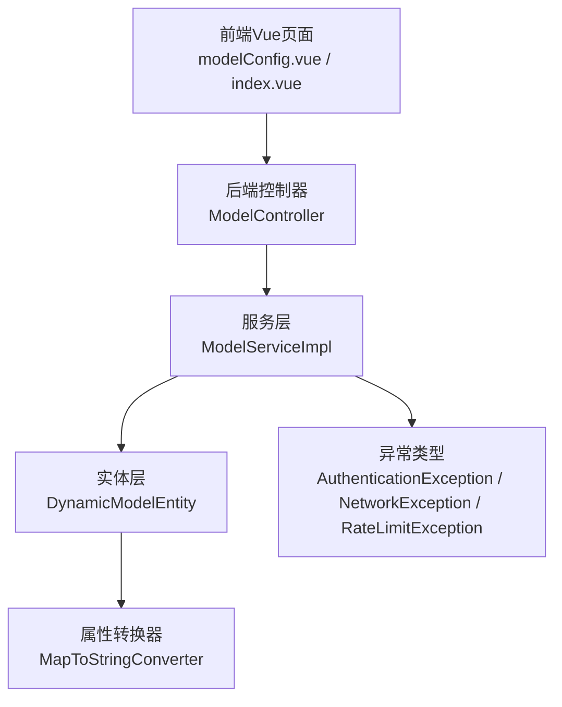
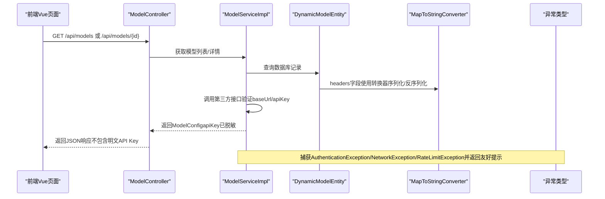
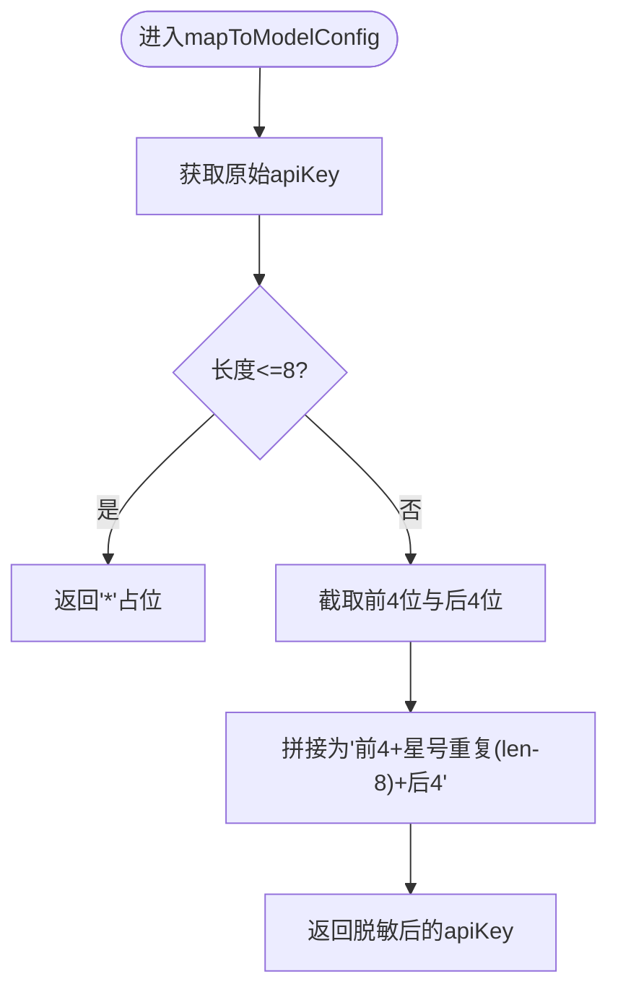
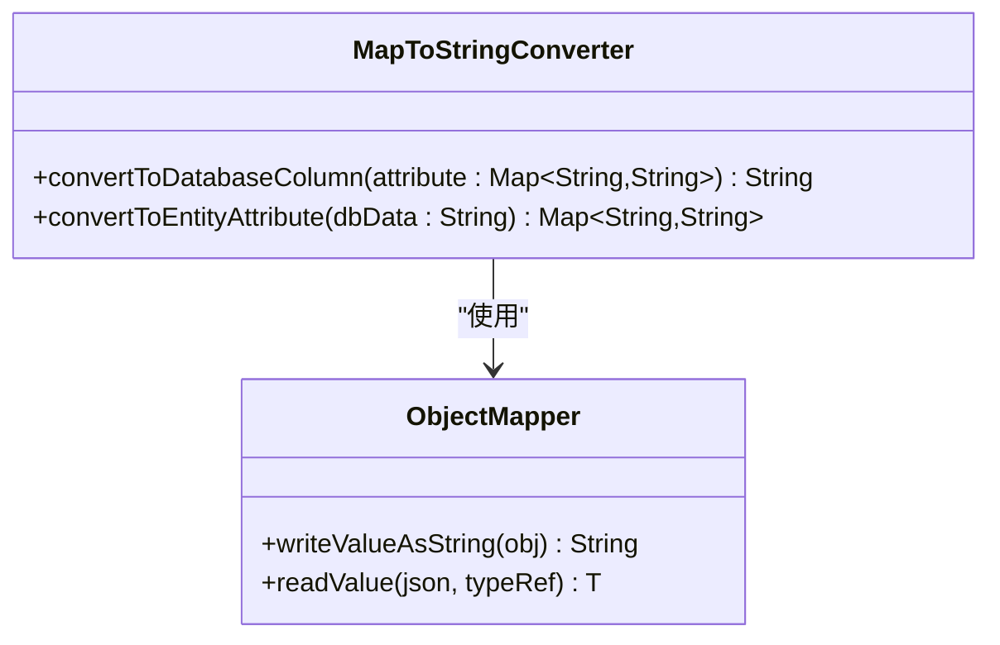
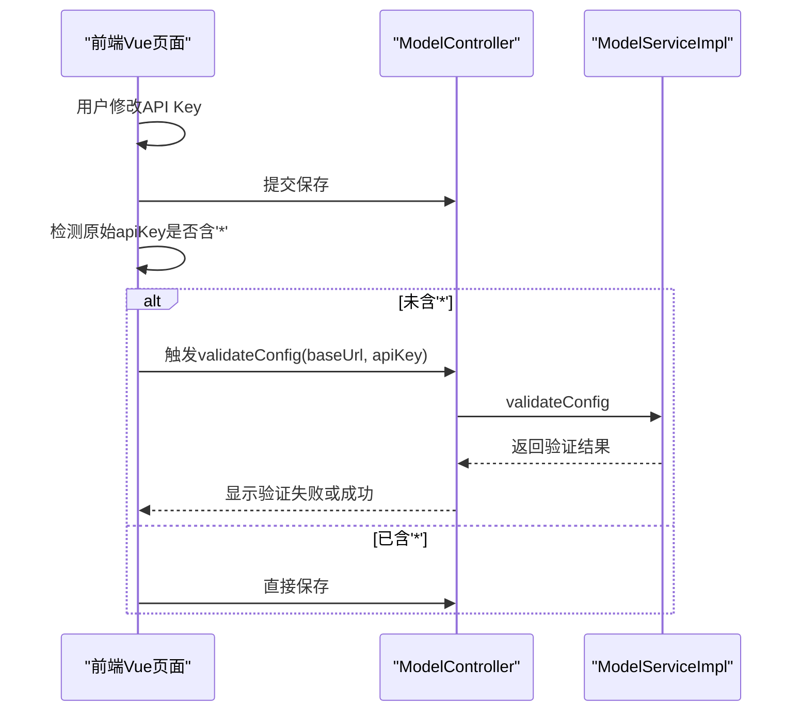
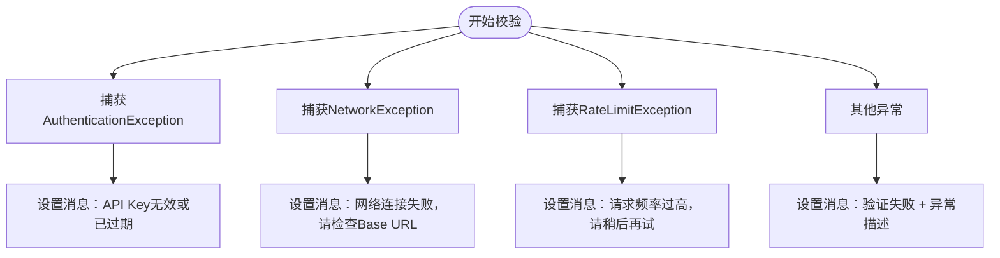
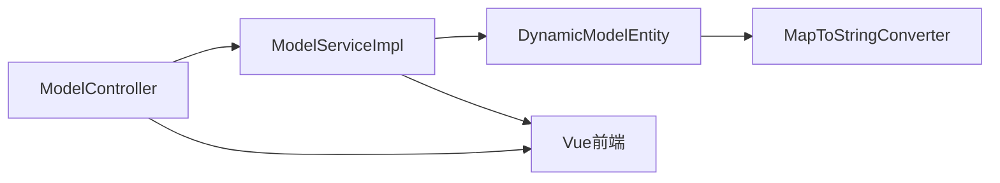

# 安全机制

<cite>
**本文引用的文件列表**
- [DynamicModelEntity.java](file://src/main/java/com/alibaba/cloud/ai/lynxe/model/entity/DynamicModelEntity.java)
- [MapToStringConverter.java](file://src/main/java/com/alibaba/cloud/ai/lynxe/model/entity/MapToStringConverter.java)
- [ModelConfig.java](file://src/main/java/com/alibaba/cloud/ai/lynxe/model/model/vo/ModelConfig.java)
- [ModelController.java](file://src/main/java/com/alibaba/cloud/ai/lynxe/model/controller/ModelController.java)
- [ModelServiceImpl.java](file://src/main/java/com/alibaba/cloud/ai/lynxe/model/service/ModelServiceImpl.java)
- [AuthenticationException.java](file://src/main/java/com/alibaba/cloud/ai/lynxe/model/exception/AuthenticationException.java)
- [NetworkException.java](file://src/main/java/com/alibaba/cloud/ai/lynxe/model/exception/NetworkException.java)
- [RateLimitException.java](file://src/main/java/com/alibaba/cloud/ai/lynxe/model/exception/RateLimitException.java)
- [JacksonConfig.java](file://src/main/java/com/alibaba/cloud/ai/lynxe/config/JacksonConfig.java)
- [modelConfig.vue](file://ui-vue3/src/views/configs/modelConfig.vue)
- [index.vue](file://ui-vue3/src/views/init/index.vue)
</cite>

## 目录
1. [简介](#简介)
2. [项目结构与安全相关模块定位](#项目结构与安全相关模块定位)
3. [核心组件与安全机制](#核心组件与安全机制)
4. [架构总览](#架构总览)
5. [关键组件深度解析](#关键组件深度解析)
6. [依赖关系与数据流分析](#依赖关系与数据流分析)
7. [性能与安全特性](#性能与安全特性)
8. [故障排查指南](#故障排查指南)
9. [结论与最佳实践](#结论与最佳实践)

## 简介
本文件聚焦于JManus模型安全管理，围绕以下目标展开：
- 解析DynamicModelEntity中apiKey的掩码处理逻辑，说明maskValue方法如何实现敏感信息脱敏（保留前后各4位字符，中间以星号替代）。
- 阐述系统在返回模型配置时自动应用脱敏机制的流程，确保API密钥不会在前端界面或API响应中明文暴露。
- 说明headers字段的MapToStringConverter转换器如何安全地序列化请求头信息。
- 介绍系统对AuthenticationException、NetworkException、RateLimitException等安全相关异常的处理策略。
- 提供安全最佳实践建议，包括API密钥轮换、最小权限原则和网络访问控制。

## 项目结构与安全相关模块定位
- 后端模型实体与转换：DynamicModelEntity负责存储模型配置；MapToStringConverter用于将Map类型的headers安全序列化为数据库字符串。
- 前端展示与交互：Vue页面对API Key进行显示/隐藏切换，并在保存前触发校验，避免未脱敏的明文密钥被提交。
- 控制器与服务：ModelController提供模型配置的增删改查与可用模型查询；ModelServiceImpl执行配置校验、调用第三方接口验证有效性，并对异常进行分类处理。
- 异常体系：AuthenticationException、NetworkException、RateLimitException分别用于标识认证失败、网络异常和限流异常，便于统一处理与提示。

图表来源
- [ModelController.java](file://src/main/java/com/alibaba/cloud/ai/lynxe/model/controller/ModelController.java#L1-L176)
- [ModelServiceImpl.java](file://src/main/java/com/alibaba/cloud/ai/lynxe/model/service/ModelServiceImpl.java#L200-L253)
- [DynamicModelEntity.java](file://src/main/java/com/alibaba/cloud/ai/lynxe/model/entity/DynamicModelEntity.java#L159-L189)
- [MapToStringConverter.java](file://src/main/java/com/alibaba/cloud/ai/lynxe/model/entity/MapToStringConverter.java#L30-L66)
- [AuthenticationException.java](file://src/main/java/com/alibaba/cloud/ai/lynxe/model/exception/AuthenticationException.java#L1-L32)
- [NetworkException.java](file://src/main/java/com/alibaba/cloud/ai/lynxe/model/exception/NetworkException.java#L1-L32)
- [RateLimitException.java](file://src/main/java/com/alibaba/cloud/ai/lynxe/model/exception/RateLimitException.java#L1-L31)

章节来源
- [ModelController.java](file://src/main/java/com/alibaba/cloud/ai/lynxe/model/controller/ModelController.java#L1-L176)
- [ModelServiceImpl.java](file://src/main/java/com/alibaba/cloud/ai/lynxe/model/service/ModelServiceImpl.java#L200-L253)
- [DynamicModelEntity.java](file://src/main/java/com/alibaba/cloud/ai/lynxe/model/entity/DynamicModelEntity.java#L159-L189)
- [MapToStringConverter.java](file://src/main/java/com/alibaba/cloud/ai/lynxe/model/entity/MapToStringConverter.java#L30-L66)

## 核心组件与安全机制
- 动态模型实体（DynamicModelEntity）
  - 存储baseUrl、apiKey、headers、modelName、modelDescription、type、isDefault、temperature、topP、completionsPath等字段。
  - 在映射到ModelConfig时，通过maskValue对apiKey进行脱敏，确保返回给前端或API响应时不暴露完整密钥。
- 属性转换器（MapToStringConverter）
  - 将Map<String,String>的headers安全序列化为数据库字符串，并在读取时反序列化回Map，避免直接暴露原始Map结构。
- 前端交互
  - Vue页面支持API Key输入框的显示/隐藏切换，保存前触发校验，若检测到原始密钥（未包含星号），则先进行第三方验证再保存。
- 服务层校验与异常处理
  - 对baseUrl与apiKey进行格式校验；调用第三方接口验证有效性；捕获AuthenticationException、NetworkException、RateLimitException并给出明确提示。
- Jackson配置
  - 统一注册ObjectMapper，保证序列化/反序列化的稳定性与兼容性，间接提升敏感数据处理的一致性。

章节来源
- [DynamicModelEntity.java](file://src/main/java/com/alibaba/cloud/ai/lynxe/model/entity/DynamicModelEntity.java#L159-L189)
- [MapToStringConverter.java](file://src/main/java/com/alibaba/cloud/ai/lynxe/model/entity/MapToStringConverter.java#L30-L66)
- [ModelConfig.java](file://src/main/java/com/alibaba/cloud/ai/lynxe/model/model/vo/ModelConfig.java#L1-L137)
- [ModelController.java](file://src/main/java/com/alibaba/cloud/ai/lynxe/model/controller/ModelController.java#L1-L176)
- [ModelServiceImpl.java](file://src/main/java/com/alibaba/cloud/ai/lynxe/model/service/ModelServiceImpl.java#L200-L253)
- [AuthenticationException.java](file://src/main/java/com/alibaba/cloud/ai/lynxe/model/exception/AuthenticationException.java#L1-L32)
- [NetworkException.java](file://src/main/java/com/alibaba/cloud/ai/lynxe/model/exception/NetworkException.java#L1-L32)
- [RateLimitException.java](file://src/main/java/com/alibaba/cloud/ai/lynxe/model/exception/RateLimitException.java#L1-L31)
- [JacksonConfig.java](file://src/main/java/com/alibaba/cloud/ai/lynxe/config/JacksonConfig.java#L1-L81)
- [modelConfig.vue](file://ui-vue3/src/views/configs/modelConfig.vue#L793-L825)
- [index.vue](file://ui-vue3/src/views/init/index.vue#L178-L203)

## 架构总览
下图展示了从控制器到服务、实体与转换器之间的交互，以及异常处理路径。

图表来源
- [ModelController.java](file://src/main/java/com/alibaba/cloud/ai/lynxe/model/controller/ModelController.java#L45-L102)
- [ModelServiceImpl.java](file://src/main/java/com/alibaba/cloud/ai/lynxe/model/service/ModelServiceImpl.java#L200-L253)
- [DynamicModelEntity.java](file://src/main/java/com/alibaba/cloud/ai/lynxe/model/entity/DynamicModelEntity.java#L159-L189)
- [MapToStringConverter.java](file://src/main/java/com/alibaba/cloud/ai/lynxe/model/entity/MapToStringConverter.java#L30-L66)
- [AuthenticationException.java](file://src/main/java/com/alibaba/cloud/ai/lynxe/model/exception/AuthenticationException.java#L1-L32)
- [NetworkException.java](file://src/main/java/com/alibaba/cloud/ai/lynxe/model/exception/NetworkException.java#L1-L32)
- [RateLimitException.java](file://src/main/java/com/alibaba/cloud/ai/lynxe/model/exception/RateLimitException.java#L1-L31)

## 关键组件深度解析

### DynamicModelEntity中的API Key掩码处理
- 映射到ModelConfig时，调用maskValue对apiKey进行脱敏，保留前4位与后4位，中间以星号替代。
- 当apiKey长度小于等于8时，返回单个星号占位符，确保极短值也被遮蔽。
- 这一策略在返回响应与前端展示时均生效，避免明文泄露。

图表来源
- [DynamicModelEntity.java](file://src/main/java/com/alibaba/cloud/ai/lynxe/model/entity/DynamicModelEntity.java#L159-L189)

章节来源
- [DynamicModelEntity.java](file://src/main/java/com/alibaba/cloud/ai/lynxe/model/entity/DynamicModelEntity.java#L159-L189)

### headers字段的MapToStringConverter转换器
- 转换器负责将Map<String,String>的headers序列化为数据库字符串，以及从字符串反序列化回Map。
- 在反序列化时对空字符串进行特殊处理，返回空Map，避免null导致的业务异常。
- 使用Jackson ObjectMapper统一处理，确保序列化/反序列化稳定一致。

图表来源
- [MapToStringConverter.java](file://src/main/java/com/alibaba/cloud/ai/lynxe/model/entity/MapToStringConverter.java#L30-L66)
- [JacksonConfig.java](file://src/main/java/com/alibaba/cloud/ai/lynxe/config/JacksonConfig.java#L1-L81)

章节来源
- [MapToStringConverter.java](file://src/main/java/com/alibaba/cloud/ai/lynxe/model/entity/MapToStringConverter.java#L30-L66)
- [JacksonConfig.java](file://src/main/java/com/alibaba/cloud/ai/lynxe/config/JacksonConfig.java#L1-L81)

### 前端对API Key的保护与校验
- 输入框支持“显示/隐藏”切换，减少明文暴露风险。
- 保存前检测原始API Key是否包含星号（即是否已被脱敏），若未脱敏则触发第三方验证，验证通过后再更新数据库。
- 这种设计避免了前端直接提交明文密钥，同时保证用户修改密钥时能及时验证有效性。

图表来源
- [modelConfig.vue](file://ui-vue3/src/views/configs/modelConfig.vue#L793-L825)
- [index.vue](file://ui-vue3/src/views/init/index.vue#L178-L203)
- [ModelController.java](file://src/main/java/com/alibaba/cloud/ai/lynxe/model/controller/ModelController.java#L90-L102)
- [ModelServiceImpl.java](file://src/main/java/com/alibaba/cloud/ai/lynxe/model/service/ModelServiceImpl.java#L200-L253)

章节来源
- [modelConfig.vue](file://ui-vue3/src/views/configs/modelConfig.vue#L793-L825)
- [index.vue](file://ui-vue3/src/views/init/index.vue#L178-L203)
- [ModelController.java](file://src/main/java/com/alibaba/cloud/ai/lynxe/model/controller/ModelController.java#L90-L102)
- [ModelServiceImpl.java](file://src/main/java/com/alibaba/cloud/ai/lynxe/model/service/ModelServiceImpl.java#L200-L253)

### 服务层异常处理策略
- 认证异常（AuthenticationException）：当第三方接口返回认证失败时，统一提示“API Key无效或已过期”，避免泄漏具体错误细节。
- 网络异常（NetworkException）：当网络连接失败时，提示“网络连接失败，请检查Base URL”，引导用户检查网络与地址。
- 限流异常（RateLimitException）：当请求过于频繁时，提示“请求频率过高，请稍后再试”，帮助用户理解限流原因。
- 其他未知异常：捕获并返回通用错误消息，避免向客户端暴露内部异常堆栈。

图表来源
- [ModelServiceImpl.java](file://src/main/java/com/alibaba/cloud/ai/lynxe/model/service/ModelServiceImpl.java#L226-L246)
- [AuthenticationException.java](file://src/main/java/com/alibaba/cloud/ai/lynxe/model/exception/AuthenticationException.java#L1-L32)
- [NetworkException.java](file://src/main/java/com/alibaba/cloud/ai/lynxe/model/exception/NetworkException.java#L1-L32)
- [RateLimitException.java](file://src/main/java/com/alibaba/cloud/ai/lynxe/model/exception/RateLimitException.java#L1-L31)

章节来源
- [ModelServiceImpl.java](file://src/main/java/com/alibaba/cloud/ai/lynxe/model/service/ModelServiceImpl.java#L226-L246)
- [AuthenticationException.java](file://src/main/java/com/alibaba/cloud/ai/lynxe/model/exception/AuthenticationException.java#L1-L32)
- [NetworkException.java](file://src/main/java/com/alibaba/cloud/ai/lynxe/model/exception/NetworkException.java#L1-L32)
- [RateLimitException.java](file://src/main/java/com/alibaba/cloud/ai/lynxe/model/exception/RateLimitException.java#L1-L31)

## 依赖关系与数据流分析
- 控制器层：ModelController提供REST接口，调用ModelService完成业务操作；在获取可用模型时，直接从数据库读取默认模型的原始apiKey，绕过脱敏，确保第三方接口调用有效。
- 服务层：ModelServiceImpl负责格式校验、第三方接口调用、异常捕获与结果组装；在更新实体时，仅当前端传入的apiKey不包含星号时才覆盖原始密钥，防止误覆盖。
- 实体层：DynamicModelEntity在映射到ModelConfig时应用maskValue脱敏；headers通过MapToStringConverter安全序列化。
- 前端：Vue页面负责UI交互与保存前校验，避免明文密钥上送。

图表来源
- [ModelController.java](file://src/main/java/com/alibaba/cloud/ai/lynxe/model/controller/ModelController.java#L1-L176)
- [ModelServiceImpl.java](file://src/main/java/com/alibaba/cloud/ai/lynxe/model/service/ModelServiceImpl.java#L330-L345)
- [DynamicModelEntity.java](file://src/main/java/com/alibaba/cloud/ai/lynxe/model/entity/DynamicModelEntity.java#L159-L189)
- [MapToStringConverter.java](file://src/main/java/com/alibaba/cloud/ai/lynxe/model/entity/MapToStringConverter.java#L30-L66)

章节来源
- [ModelController.java](file://src/main/java/com/alibaba/cloud/ai/lynxe/model/controller/ModelController.java#L1-L176)
- [ModelServiceImpl.java](file://src/main/java/com/alibaba/cloud/ai/lynxe/model/service/ModelServiceImpl.java#L330-L345)
- [DynamicModelEntity.java](file://src/main/java/com/alibaba/cloud/ai/lynxe/model/entity/DynamicModelEntity.java#L159-L189)
- [MapToStringConverter.java](file://src/main/java/com/alibaba/cloud/ai/lynxe/model/entity/MapToStringConverter.java#L30-L66)

## 性能与安全特性
- 脱敏开销极低：maskValue仅进行字符串截取与拼接，时间复杂度为O(n)，对性能影响可忽略。
- 序列化一致性：Jackson配置统一注册，避免多实例差异导致的序列化问题，间接降低因反序列化失败引发的安全隐患。
- 前端交互优化：显示/隐藏切换减少明文暴露窗口；保存前校验避免无效请求与重试风暴。

章节来源
- [DynamicModelEntity.java](file://src/main/java/com/alibaba/cloud/ai/lynxe/model/entity/DynamicModelEntity.java#L175-L189)
- [MapToStringConverter.java](file://src/main/java/com/alibaba/cloud/ai/lynxe/model/entity/MapToStringConverter.java#L30-L66)
- [JacksonConfig.java](file://src/main/java/com/alibaba/cloud/ai/lynxe/config/JacksonConfig.java#L1-L81)
- [index.vue](file://ui-vue3/src/views/init/index.vue#L178-L203)

## 故障排查指南
- API Key无效或过期
  - 现象：验证返回“API Key无效或已过期”。
  - 排查：确认第三方平台密钥状态、有效期与权限范围；检查是否正确复制粘贴，避免多余空白字符。
- 网络连接失败
  - 现象：验证返回“网络连接失败，请检查Base URL”。
  - 排查：确认网络连通性、代理设置、域名解析；检查Base URL协议（http/https）与端口。
- 请求频率过高
  - 现象：验证返回“请求频率过高，请稍后再试”。
  - 排查：降低请求频率，遵守第三方平台速率限制；必要时增加重试间隔。
- 前端保存失败
  - 现象：保存时报错或无法更新。
  - 排查：确认前端是否已触发验证且通过；检查是否存在未脱敏的明文密钥导致服务层拒绝覆盖。

章节来源
- [ModelServiceImpl.java](file://src/main/java/com/alibaba/cloud/ai/lynxe/model/service/ModelServiceImpl.java#L226-L246)
- [modelConfig.vue](file://ui-vue3/src/views/configs/modelConfig.vue#L793-L825)

## 结论与最佳实践
- API密钥轮换
  - 建议定期更换API Key，缩短密钥生命周期；在新旧密钥过渡期间，优先使用新密钥进行验证与调用。
- 最小权限原则
  - 为不同环境与用途分配独立的API Key，仅授予必要的权限范围，降低泄露影响面。
- 网络访问控制
  - 严格限制第三方接口访问来源，启用HTTPS与防火墙策略；对高频请求实施限流与熔断。
- 日志与监控
  - 对认证失败、网络异常、限流事件进行集中告警与审计日志记录，便于快速定位与溯源。
- 前端安全
  - 始终使用“显示/隐藏”切换，避免明文持久化；保存前强制校验，减少无效请求与重试风暴。