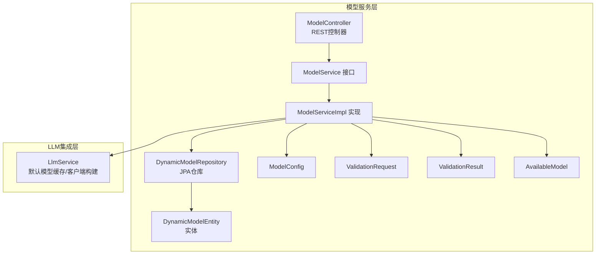
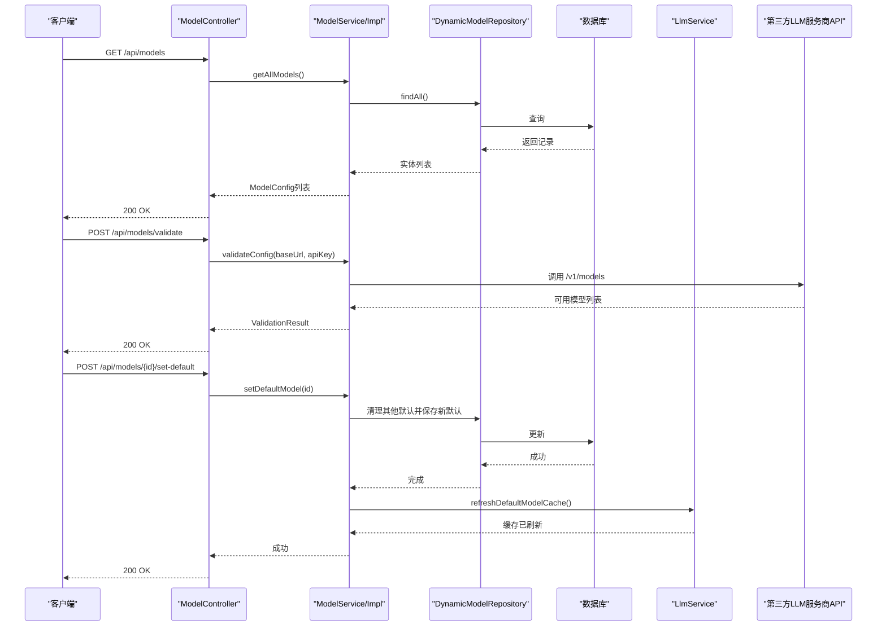
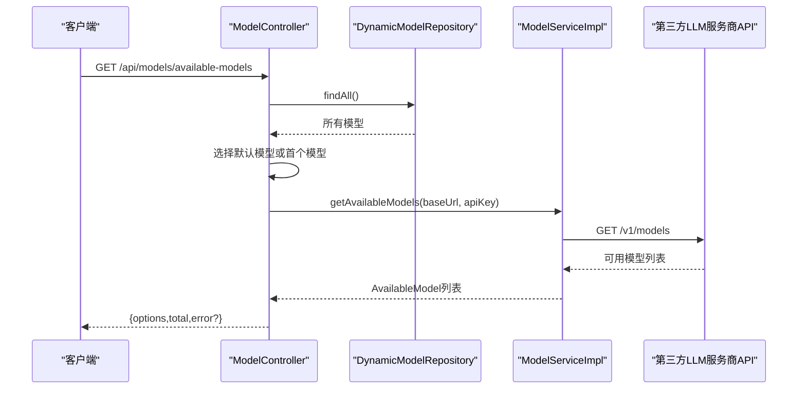
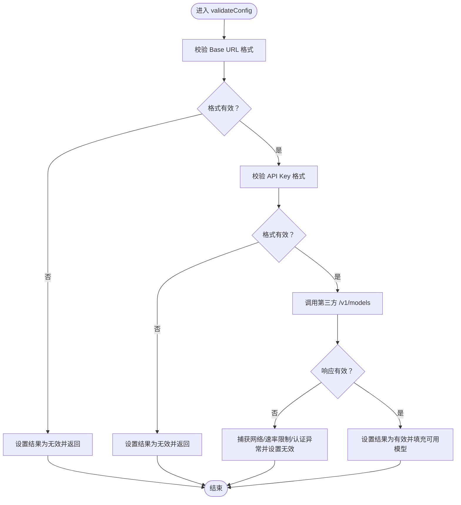
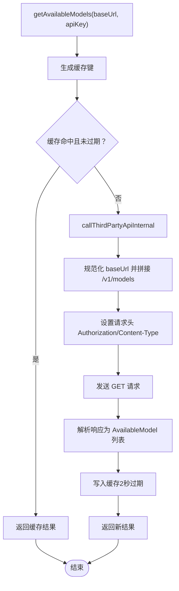
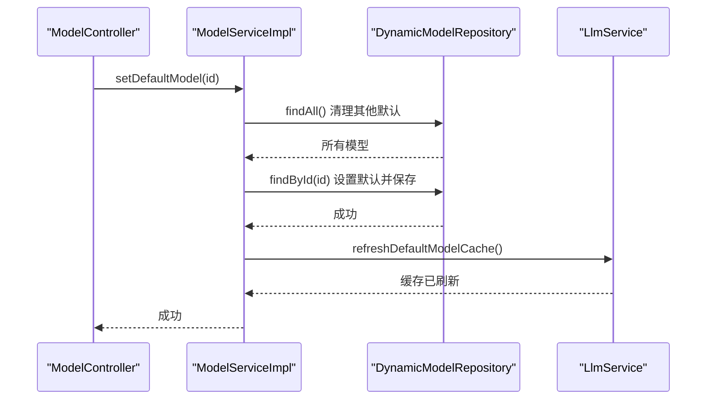
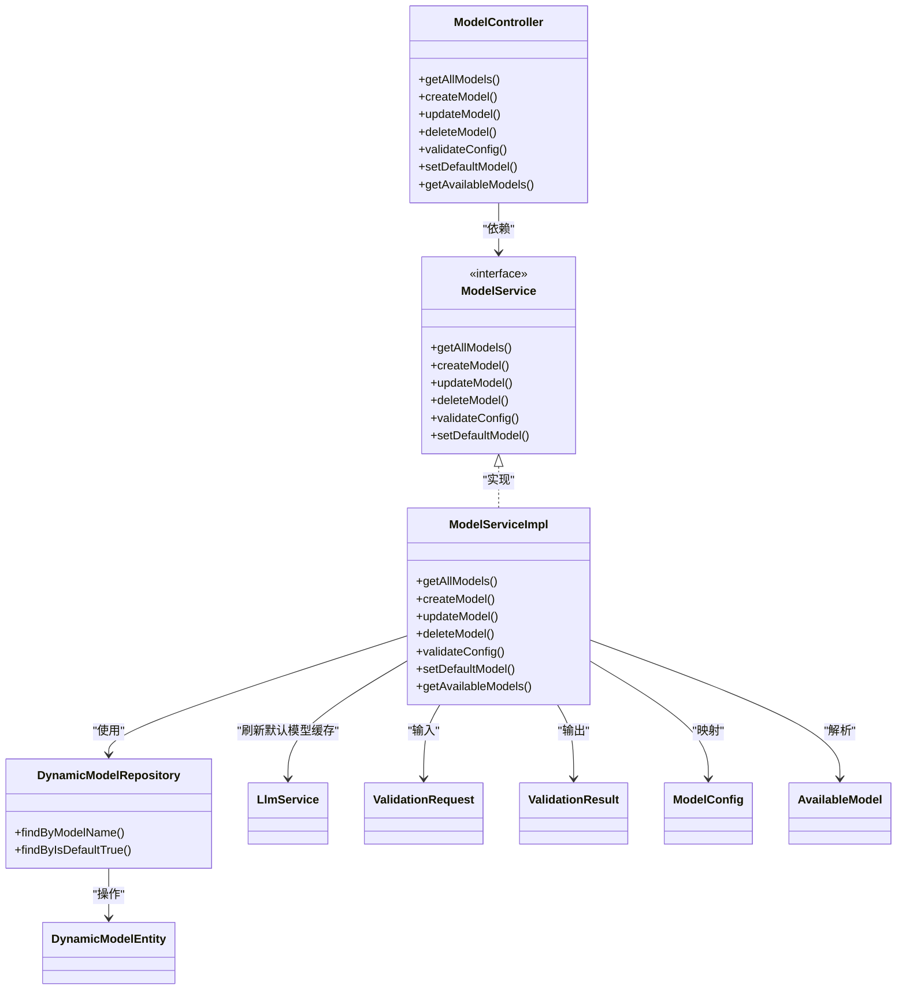

# 服务集成

<cite>
**本文引用的文件**
- [ModelController.java](file://src/main/java/com/alibaba/cloud/ai/lynxe/model/controller/ModelController.java)
- [ModelService.java](file://src/main/java/com/alibaba/cloud/ai/lynxe/model/service/ModelService.java)
- [ModelServiceImpl.java](file://src/main/java/com/alibaba/cloud/ai/lynxe/model/service/ModelServiceImpl.java)
- [DynamicModelRepository.java](file://src/main/java/com/alibaba/cloud/ai/lynxe/model/repository/DynamicModelRepository.java)
- [DynamicModelEntity.java](file://src/main/java/com/alibaba/cloud/ai/lynxe/model/entity/DynamicModelEntity.java)
- [ValidationRequest.java](file://src/main/java/com/alibaba/cloud/ai/lynxe/model/model/vo/ValidationRequest.java)
- [ValidationResult.java](file://src/main/java/com/alibaba/cloud/ai/lynxe/model/model/vo/ValidationResult.java)
- [ModelConfig.java](file://src/main/java/com/alibaba/cloud/ai/lynxe/model/model/vo/ModelConfig.java)
- [AvailableModel.java](file://src/main/java/com/alibaba/cloud/ai/lynxe/model/model/vo/AvailableModel.java)
- [LlmService.java](file://src/main/java/com/alibaba/cloud/ai/lynxe/llm/LlmService.java)
- [AuthenticationException.java](file://src/main/java/com/alibaba/cloud/ai/lynxe/model/exception/AuthenticationException.java)
- [NetworkException.java](file://src/main/java/com/alibaba/cloud/ai/lynxe/model/exception/NetworkException.java)
- [RateLimitException.java](file://src/main/java/com/alibaba/cloud/ai/lynxe/model/exception/RateLimitException.java)
- [application.yml](file://src/main/resources/application.yml)
</cite>

## 目录
1. [简介](#简介)
2. [项目结构](#项目结构)
3. [核心组件](#核心组件)
4. [架构总览](#架构总览)
5. [组件详解](#组件详解)
6. [依赖关系分析](#依赖关系分析)
7. [性能与缓存特性](#性能与缓存特性)
8. [故障排查指南](#故障排查指南)
9. [结论](#结论)

## 简介
本文件面向JManus模型服务集成，围绕ModelService接口与ModelController控制器展开，系统性阐述以下主题：
- ModelService接口定义的getAllModels、createModel、validateConfig等核心方法及其业务契约
- ModelController中/set-default与/available-models等高级集成接口的实现逻辑，特别是如何通过默认模型的API凭证动态获取第三方服务商提供的可用模型列表
- ValidationResult与ValidationRequest在配置验证流程中的作用，以及系统如何通过POST /api/models/validate接口实时测试模型连接性
- 系统内部如何利用DynamicModelRepository进行数据持久化，并与LLM服务进行集成调用
- 服务间调用时的错误传播机制与重试策略

## 项目结构
模型服务位于“model”模块，采用分层设计：
- 控制器层：ModelController对外暴露REST接口
- 服务层：ModelService接口与ModelServiceImpl实现
- 数据访问层：DynamicModelRepository基于JPA
- 实体层：DynamicModelEntity映射数据库表
- VO层：ModelConfig、ValidationRequest、ValidationResult、AvailableModel等传输对象
- 集成层：LlmService负责默认模型缓存与与第三方LLM交互

图表来源
- [ModelController.java](file://src/main/java/com/alibaba/cloud/ai/lynxe/model/controller/ModelController.java#L1-L176)
- [ModelService.java](file://src/main/java/com/alibaba/cloud/ai/lynxe/model/service/ModelService.java#L1-L40)
- [ModelServiceImpl.java](file://src/main/java/com/alibaba/cloud/ai/lynxe/model/service/ModelServiceImpl.java#L1-L485)
- [DynamicModelRepository.java](file://src/main/java/com/alibaba/cloud/ai/lynxe/model/repository/DynamicModelRepository.java#L1-L31)
- [DynamicModelEntity.java](file://src/main/java/com/alibaba/cloud/ai/lynxe/model/entity/DynamicModelEntity.java#L1-L190)
- [ModelConfig.java](file://src/main/java/com/alibaba/cloud/ai/lynxe/model/model/vo/ModelConfig.java#L1-L137)
- [ValidationRequest.java](file://src/main/java/com/alibaba/cloud/ai/lynxe/model/model/vo/ValidationRequest.java#L1-L52)
- [ValidationResult.java](file://src/main/java/com/alibaba/cloud/ai/lynxe/model/model/vo/ValidationResult.java#L1-L70)
- [AvailableModel.java](file://src/main/java/com/alibaba/cloud/ai/lynxe/model/model/vo/AvailableModel.java#L1-L63)
- [LlmService.java](file://src/main/java/com/alibaba/cloud/ai/lynxe/llm/LlmService.java#L1-L450)

章节来源
- [ModelController.java](file://src/main/java/com/alibaba/cloud/ai/lynxe/model/controller/ModelController.java#L1-L176)
- [ModelService.java](file://src/main/java/com/alibaba/cloud/ai/lynxe/model/service/ModelService.java#L1-L40)
- [ModelServiceImpl.java](file://src/main/java/com/alibaba/cloud/ai/lynxe/model/service/ModelServiceImpl.java#L1-L485)
- [DynamicModelRepository.java](file://src/main/java/com/alibaba/cloud/ai/lynxe/model/repository/DynamicModelRepository.java#L1-L31)
- [DynamicModelEntity.java](file://src/main/java/com/alibaba/cloud/ai/lynxe/model/entity/DynamicModelEntity.java#L1-L190)
- [ModelConfig.java](file://src/main/java/com/alibaba/cloud/ai/lynxe/model/model/vo/ModelConfig.java#L1-L137)
- [ValidationRequest.java](file://src/main/java/com/alibaba/cloud/ai/lynxe/model/model/vo/ValidationRequest.java#L1-L52)
- [ValidationResult.java](file://src/main/java/com/alibaba/cloud/ai/lynxe/model/model/vo/ValidationResult.java#L1-L70)
- [AvailableModel.java](file://src/main/java/com/alibaba/cloud/ai/lynxe/model/model/vo/AvailableModel.java#L1-L63)
- [LlmService.java](file://src/main/java/com/alibaba/cloud/ai/lynxe/llm/LlmService.java#L1-L450)

## 核心组件
- ModelController：提供模型管理与验证的REST接口，包括查询、创建、更新、删除、设置默认模型、校验配置、获取可用模型列表等。
- ModelService：定义模型生命周期与验证的核心契约，包括查询、创建、更新、删除、配置校验、设置默认模型。
- ModelServiceImpl：实现ModelService，包含配置校验、第三方模型列表拉取、缓存与事件发布、与LLM服务的集成。
- DynamicModelRepository：JPA仓库，提供按名称与默认标记查询能力。
- DynamicModelEntity：模型配置实体，包含基础URL、API密钥、请求头、模型名称、是否默认、温度、TopP、补全路径等字段。
- LlmService：负责默认模型缓存、懒加载初始化、ChatClient构建、与OpenAI兼容API交互、缓存清理与监控。

章节来源
- [ModelController.java](file://src/main/java/com/alibaba/cloud/ai/lynxe/model/controller/ModelController.java#L1-L176)
- [ModelService.java](file://src/main/java/com/alibaba/cloud/ai/lynxe/model/service/ModelService.java#L1-L40)
- [ModelServiceImpl.java](file://src/main/java/com/alibaba/cloud/ai/lynxe/model/service/ModelServiceImpl.java#L1-L485)
- [DynamicModelRepository.java](file://src/main/java/com/alibaba/cloud/ai/lynxe/model/repository/DynamicModelRepository.java#L1-L31)
- [DynamicModelEntity.java](file://src/main/java/com/alibaba/cloud/ai/lynxe/model/entity/DynamicModelEntity.java#L1-L190)
- [LlmService.java](file://src/main/java/com/alibaba/cloud/ai/lynxe/llm/LlmService.java#L1-L450)

## 架构总览
下图展示从控制器到服务、仓库、实体与LLM服务的整体交互关系。

图表来源
- [ModelController.java](file://src/main/java/com/alibaba/cloud/ai/lynxe/model/controller/ModelController.java#L1-L176)
- [ModelServiceImpl.java](file://src/main/java/com/alibaba/cloud/ai/lynxe/model/service/ModelServiceImpl.java#L1-L485)
- [DynamicModelRepository.java](file://src/main/java/com/alibaba/cloud/ai/lynxe/model/repository/DynamicModelRepository.java#L1-L31)
- [LlmService.java](file://src/main/java/com/alibaba/cloud/ai/lynxe/llm/LlmService.java#L1-L450)

## 组件详解

### ModelService接口与契约
- getAllModels：返回所有模型配置列表，用于前端展示与管理。
- getModelById：按ID查询单个模型配置。
- createModel：创建或更新同名模型；若传入默认标记，则清除其他默认模型并保存。
- updateModel：更新指定模型配置，支持默认标记变更。
- deleteModel：删除指定ID的模型，并刷新默认模型缓存。
- validateConfig：对给定的baseUrl与apiKey进行格式校验与第三方API连通性校验，返回ValidationResult。
- setDefaultModel：将指定ID的模型设为默认模型，同时清理其他默认标记并刷新缓存。

章节来源
- [ModelService.java](file://src/main/java/com/alibaba/cloud/ai/lynxe/model/service/ModelService.java#L1-L40)

### ModelController高级接口实现
- /api/models/{id}/set-default
  - 语义：将指定ID的模型设为默认模型。
  - 行为：调用ModelService.setDefaultModel；成功返回成功信息，运行时异常返回400，其他异常返回500。
- /api/models/available-models
  - 语义：根据默认模型的API凭证动态获取第三方服务商提供的可用模型列表。
  - 行为：直接从数据库读取所有模型，优先选择默认模型，若无默认则取第一个；调用ModelServiceImpl.getAvailableModels(baseUrl, apiKey)，解析响应并转换为前端选项格式。

图表来源
- [ModelController.java](file://src/main/java/com/alibaba/cloud/ai/lynxe/model/controller/ModelController.java#L128-L173)
- [ModelServiceImpl.java](file://src/main/java/com/alibaba/cloud/ai/lynxe/model/service/ModelServiceImpl.java#L398-L420)

章节来源
- [ModelController.java](file://src/main/java/com/alibaba/cloud/ai/lynxe/model/controller/ModelController.java#L104-L173)

### 配置验证流程与ValidationRequest/ValidationResult
- ValidationRequest：承载baseUrl与apiKey，作为校验输入。
- validateConfig流程：
  1) 基础URL格式校验（协议必须为http/https）
  2) API Key格式校验（非空且长度满足阈值）
  3) 调用第三方API获取可用模型列表
  4) 将结果封装为ValidationResult，包含valid、message与availableModels
- 错误传播：
  - 认证失败：抛出AuthenticationException，最终被捕获并返回无效结果
  - 网络异常：抛出NetworkException，最终被捕获并返回无效结果
  - 速率限制：抛出RateLimitException，最终被捕获并返回无效结果
  - 其他未知异常：统一包装为无效结果

图表来源
- [ModelServiceImpl.java](file://src/main/java/com/alibaba/cloud/ai/lynxe/model/service/ModelServiceImpl.java#L190-L253)
- [ValidationRequest.java](file://src/main/java/com/alibaba/cloud/ai/lynxe/model/model/vo/ValidationRequest.java#L1-L52)
- [ValidationResult.java](file://src/main/java/com/alibaba/cloud/ai/lynxe/model/model/vo/ValidationResult.java#L1-L70)
- [AuthenticationException.java](file://src/main/java/com/alibaba/cloud/ai/lynxe/model/exception/AuthenticationException.java#L1-L32)
- [NetworkException.java](file://src/main/java/com/alibaba/cloud/ai/lynxe/model/exception/NetworkException.java#L1-L32)
- [RateLimitException.java](file://src/main/java/com/alibaba/cloud/ai/lynxe/model/exception/RateLimitException.java#L1-L32)

章节来源
- [ModelServiceImpl.java](file://src/main/java/com/alibaba/cloud/ai/lynxe/model/service/ModelServiceImpl.java#L190-L253)
- [ValidationRequest.java](file://src/main/java/com/alibaba/cloud/ai/lynxe/model/model/vo/ValidationRequest.java#L1-L52)
- [ValidationResult.java](file://src/main/java/com/alibaba/cloud/ai/lynxe/model/model/vo/ValidationResult.java#L1-L70)

### 动态模型列表拉取与缓存
- getAvailableModels(baseUrl, apiKey)：
  - 使用baseUrl与apiKey拼接缓存键，2秒过期
  - 命中缓存直接返回；未命中则调用callThirdPartyApiInternal发起HTTP GET请求至“/v1/models”
  - 解析响应为AvailableModel列表并写入缓存
- callThirdPartyApiInternal：
  - 设置Authorization与Content-Type头部
  - 规范化baseUrl，避免重复/v1
  - 发起GET请求并记录耗时
  - 解析响应并返回模型列表
  - 异常统一包装为NetworkException上抛

图表来源
- [ModelServiceImpl.java](file://src/main/java/com/alibaba/cloud/ai/lynxe/model/service/ModelServiceImpl.java#L398-L482)

章节来源
- [ModelServiceImpl.java](file://src/main/java/com/alibaba/cloud/ai/lynxe/model/service/ModelServiceImpl.java#L398-L482)

### 数据持久化与默认模型切换
- DynamicModelRepository：
  - findByModelName：按模型名称查询唯一模型
  - findByIsDefaultTrue：查询默认模型
- setDefaultModel：
  - 清理所有历史默认标记
  - 将目标模型标记为默认并保存
  - 发布ModelChangeEvent事件
  - 调用LlmService.refreshDefaultModelCache刷新默认模型缓存

图表来源
- [ModelController.java](file://src/main/java/com/alibaba/cloud/ai/lynxe/model/controller/ModelController.java#L104-L126)
- [ModelServiceImpl.java](file://src/main/java/com/alibaba/cloud/ai/lynxe/model/service/ModelServiceImpl.java#L356-L385)
- [DynamicModelRepository.java](file://src/main/java/com/alibaba/cloud/ai/lynxe/model/repository/DynamicModelRepository.java#L1-L31)
- [LlmService.java](file://src/main/java/com/alibaba/cloud/ai/lynxe/llm/LlmService.java#L287-L315)

章节来源
- [ModelServiceImpl.java](file://src/main/java/com/alibaba/cloud/ai/lynxe/model/service/ModelServiceImpl.java#L356-L385)
- [DynamicModelRepository.java](file://src/main/java/com/alibaba/cloud/ai/lynxe/model/repository/DynamicModelRepository.java#L1-L31)
- [LlmService.java](file://src/main/java/com/alibaba/cloud/ai/lynxe/llm/LlmService.java#L287-L315)

### 与LLM服务的集成
- 默认模型缓存：
  - LlmService在首次使用时懒加载默认模型，构建ChatClient并缓存
  - 当ModelChangeEvent发生或显式调用refreshDefaultModelCache时，清空缓存并重新初始化
- 与OpenAI兼容API交互：
  - LlmService通过OpenAiApi构造器注入baseUrl、apiKey、自定义HTTP头与补全路径
  - 支持增强WebClient（DNS缓存或超时配置），并在请求前后记录追踪信息
- 与模型服务协作：
  - 模型创建/更新/删除后，ModelServiceImpl发布事件，LlmService刷新缓存，确保后续调用使用最新默认模型

章节来源
- [LlmService.java](file://src/main/java/com/alibaba/cloud/ai/lynxe/llm/LlmService.java#L138-L315)
- [ModelServiceImpl.java](file://src/main/java/com/alibaba/cloud/ai/lynxe/model/service/ModelServiceImpl.java#L110-L179)

## 依赖关系分析
- 控制器依赖服务接口，服务实现依赖仓库与LLM服务
- 仓库依赖JPA基础设施，实体映射数据库表
- VO对象用于跨层传输，避免直接暴露实体
- 异常类型用于区分不同错误场景，便于上层统一处理

图表来源
- [ModelController.java](file://src/main/java/com/alibaba/cloud/ai/lynxe/model/controller/ModelController.java#L1-L176)
- [ModelService.java](file://src/main/java/com/alibaba/cloud/ai/lynxe/model/service/ModelService.java#L1-L40)
- [ModelServiceImpl.java](file://src/main/java/com/alibaba/cloud/ai/lynxe/model/service/ModelServiceImpl.java#L1-L485)
- [DynamicModelRepository.java](file://src/main/java/com/alibaba/cloud/ai/lynxe/model/repository/DynamicModelRepository.java#L1-L31)
- [DynamicModelEntity.java](file://src/main/java/com/alibaba/cloud/ai/lynxe/model/entity/DynamicModelEntity.java#L1-L190)
- [LlmService.java](file://src/main/java/com/alibaba/cloud/ai/lynxe/llm/LlmService.java#L1-L450)
- [ValidationRequest.java](file://src/main/java/com/alibaba/cloud/ai/lynxe/model/model/vo/ValidationRequest.java#L1-L52)
- [ValidationResult.java](file://src/main/java/com/alibaba/cloud/ai/lynxe/model/model/vo/ValidationResult.java#L1-L70)
- [ModelConfig.java](file://src/main/java/com/alibaba/cloud/ai/lynxe/model/model/vo/ModelConfig.java#L1-L137)
- [AvailableModel.java](file://src/main/java/com/alibaba/cloud/ai/lynxe/model/model/vo/AvailableModel.java#L1-L63)

章节来源
- [ModelController.java](file://src/main/java/com/alibaba/cloud/ai/lynxe/model/controller/ModelController.java#L1-L176)
- [ModelService.java](file://src/main/java/com/alibaba/cloud/ai/lynxe/model/service/ModelService.java#L1-L40)
- [ModelServiceImpl.java](file://src/main/java/com/alibaba/cloud/ai/lynxe/model/service/ModelServiceImpl.java#L1-L485)
- [DynamicModelRepository.java](file://src/main/java/com/alibaba/cloud/ai/lynxe/model/repository/DynamicModelRepository.java#L1-L31)
- [DynamicModelEntity.java](file://src/main/java/com/alibaba/cloud/ai/lynxe/model/entity/DynamicModelEntity.java#L1-L190)
- [LlmService.java](file://src/main/java/com/alibaba/cloud/ai/lynxe/llm/LlmService.java#L1-L450)

## 性能与缓存特性
- 第三方API缓存：
  - ModelServiceImpl对第三方模型列表调用使用ConcurrentHashMap缓存，键为“baseUrl:apiKey”，2秒过期
  - 降低频繁调用第三方API带来的网络开销与等待时间
- 默认模型缓存：
  - LlmService对ChatClient实例按模型名进行并发缓存，首次使用懒加载默认模型
  - 当默认模型变更或显式刷新时，清空缓存并重建，保证一致性
- 超时与DNS优化：
  - LlmService在构建WebClient时可使用DNS缓存实例或设置超时，提升稳定性
- 配置与日志：
  - application.yml中关闭Open Session In View、配置Hikari连接池、禁用Spring AI自动配置以避免冲突

章节来源
- [ModelServiceImpl.java](file://src/main/java/com/alibaba/cloud/ai/lynxe/model/service/ModelServiceImpl.java#L66-L95)
- [LlmService.java](file://src/main/java/com/alibaba/cloud/ai/lynxe/llm/LlmService.java#L387-L449)
- [application.yml](file://src/main/resources/application.yml#L1-L98)

## 故障排查指南
- 验证接口返回无效：
  - 检查baseUrl协议是否为http/https，API Key是否非空且长度满足要求
  - 查看第三方API连通性与限流情况
  - 关注NetworkException/RateLimitException/AuthenticationException的错误提示
- 设置默认模型失败：
  - 确认模型ID存在；检查是否存在并发修改导致的事务问题
  - 关注ModelServiceImplsetDefaultModel的日志与异常堆栈
- 获取可用模型列表为空：
  - 确认数据库中至少存在一个模型；若无默认模型，将回退到首个模型
  - 检查第三方API返回格式是否符合预期（标准OpenAI格式：包含"data"数组）
- LLM客户端未初始化：
  - 确保存在默认模型；LlmService会在首次使用时懒加载
  - 若默认模型变更，调用refreshDefaultModelCache或等待事件触发

章节来源
- [ModelServiceImpl.java](file://src/main/java/com/alibaba/cloud/ai/lynxe/model/service/ModelServiceImpl.java#L190-L253)
- [ModelController.java](file://src/main/java/com/alibaba/cloud/ai/lynxe/model/controller/ModelController.java#L104-L173)
- [LlmService.java](file://src/main/java/com/alibaba/cloud/ai/lynxe/llm/LlmService.java#L138-L315)

## 结论
JManus的模型服务集成通过清晰的分层设计与契约约束，实现了模型配置的全生命周期管理与第三方模型列表的动态获取。ModelService与ModelController共同承担了对外接口与内部实现的职责分离，ModelServiceImpl在数据持久化、缓存与错误传播方面提供了稳健的实现。与LlmService的集成确保默认模型的一致性与高效复用，整体架构具备良好的扩展性与可维护性。