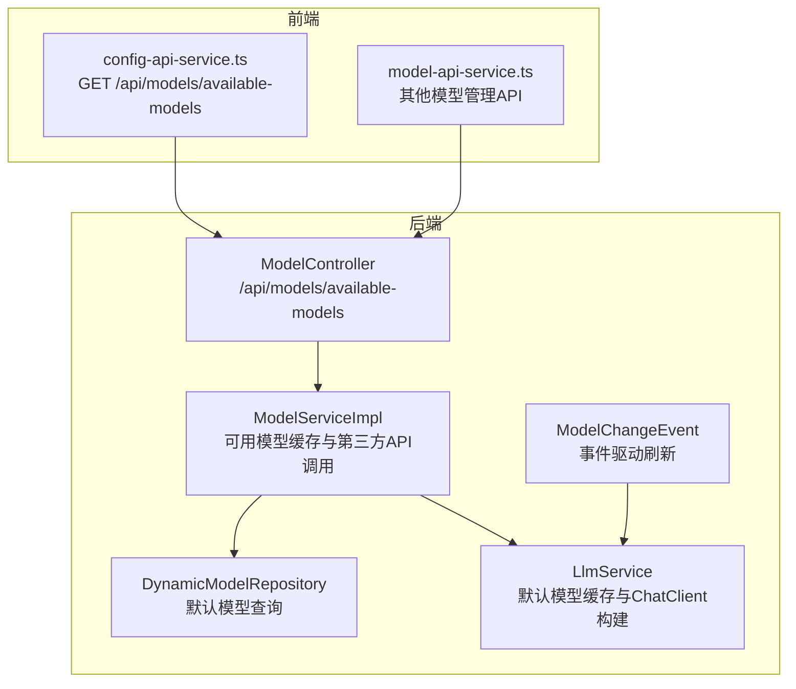
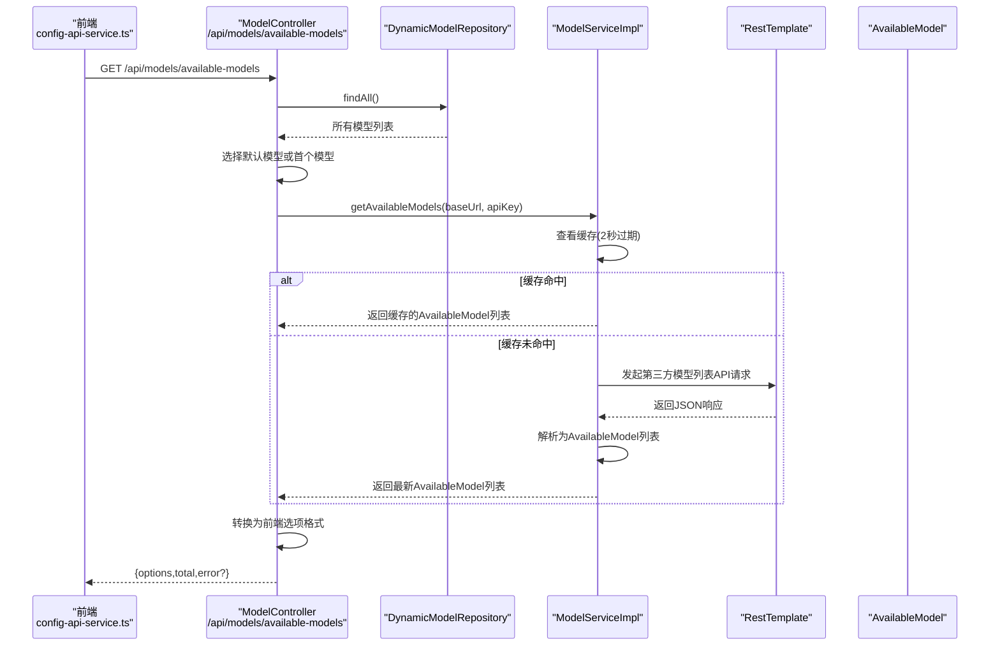
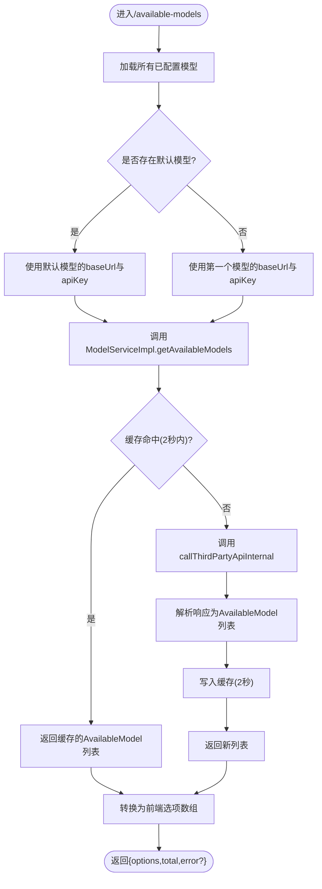
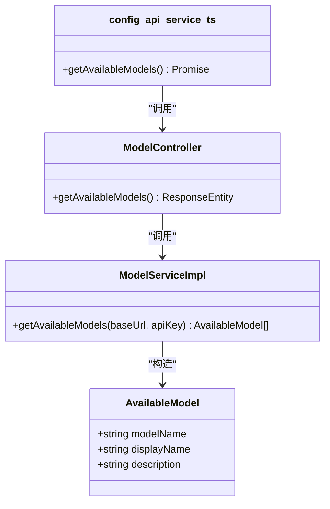
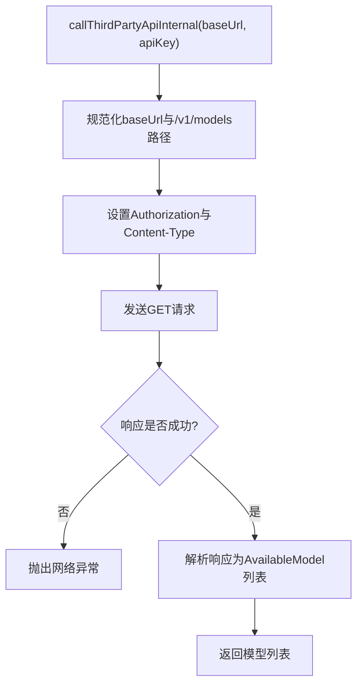
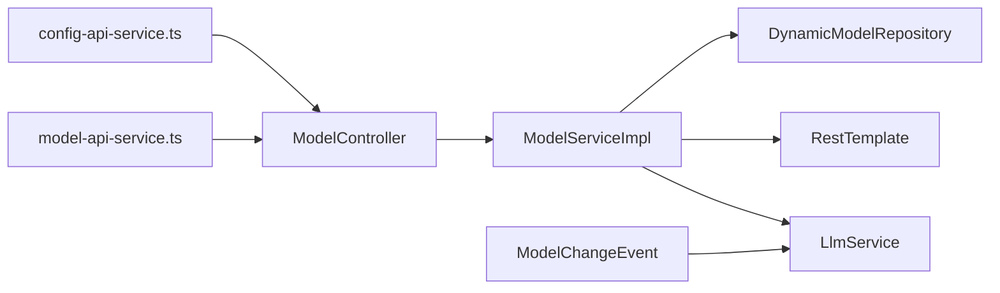

# 模型发现与负载均衡

<cite>
**本文引用的文件**
- [ModelController.java](file://src/main/java/com/alibaba/cloud/ai/lynxe/model/controller/ModelController.java)
- [ModelServiceImpl.java](file://src/main/java/com/alibaba/cloud/ai/lynxe/model/service/ModelServiceImpl.java)
- [AvailableModel.java](file://src/main/java/com/alibaba/cloud/ai/lynxe/model/model/vo/AvailableModel.java)
- [DynamicModelEntity.java](file://src/main/java/com/alibaba/cloud/ai/lynxe/model/entity/DynamicModelEntity.java)
- [DynamicModelRepository.java](file://src/main/java/com/alibaba/cloud/ai/lynxe/model/repository/DynamicModelRepository.java)
- [LlmService.java](file://src/main/java/com/alibaba/cloud/ai/lynxe/llm/LlmService.java)
- [ModelChangeEvent.java](file://src/main/java/com/alibaba/cloud/ai/lynxe/event/ModelChangeEvent.java)
- [application.yml](file://src/main/resources/application.yml)
- [config-api-service.ts](file://ui-vue3/src/api/config-api-service.ts)
- [model-api-service.ts](file://ui-vue3/src/api/model-api-service.ts)
</cite>

## 目录
1. [简介](#简介)
2. [项目结构](#项目结构)
3. [核心组件](#核心组件)
4. [架构总览](#架构总览)
5. [详细组件分析](#详细组件分析)
6. [依赖关系分析](#依赖关系分析)
7. [性能考量](#性能考量)
8. [故障排查指南](#故障排查指南)
9. [结论](#结论)
10. [附录](#附录)

## 简介
本文件聚焦于JManus的“模型发现与负载均衡”能力，围绕后端/available-models接口的实现进行深入解析，阐明系统如何通过默认模型的API凭证动态调用第三方AI服务商（如OpenAI兼容接口）的模型列表API；解释AvailableModel数据结构的设计与前端模型选择器的使用方式；梳理跨服务商模型枚举与元数据聚合的标准化映射；说明默认模型机制在无密钥环境下的发现策略与多租户隔离策略；并给出模型元数据缓存策略、刷新机制及服务不可用时的降级方案。

## 项目结构
- 后端采用Spring Boot，模型发现相关代码集中在model模块：
  - 控制层：/api/models路径下的ModelController
  - 服务层：ModelServiceImpl负责可用模型查询、缓存、第三方API调用
  - 数据访问：DynamicModelRepository用于默认模型查找与持久化
  - 实体与VO：DynamicModelEntity、AvailableModel
  - 事件与缓存：LlmService负责默认模型缓存与ChatClient构建；ModelChangeEvent用于事件驱动刷新
- 前端UI通过config-api-service.ts与model-api-service.ts调用后端模型接口，其中/available-models返回前端可直接使用的选项数组。

图表来源
- [ModelController.java](file://src/main/java/com/alibaba/cloud/ai/lynxe/model/controller/ModelController.java#L128-L173)
- [ModelServiceImpl.java](file://src/main/java/com/alibaba/cloud/ai/lynxe/model/service/ModelServiceImpl.java#L398-L482)
- [DynamicModelRepository.java](file://src/main/java/com/alibaba/cloud/ai/lynxe/model/repository/DynamicModelRepository.java#L21-L31)
- [LlmService.java](file://src/main/java/com/alibaba/cloud/ai/lynxe/llm/LlmService.java#L138-L201)
- [ModelChangeEvent.java](file://src/main/java/com/alibaba/cloud/ai/lynxe/event/ModelChangeEvent.java#L18-L45)
- [config-api-service.ts](file://ui-vue3/src/api/config-api-service.ts#L18-L31)

章节来源
- [ModelController.java](file://src/main/java/com/alibaba/cloud/ai/lynxe/model/controller/ModelController.java#L128-L173)
- [ModelServiceImpl.java](file://src/main/java/com/alibaba/cloud/ai/lynxe/model/service/ModelServiceImpl.java#L398-L482)
- [DynamicModelRepository.java](file://src/main/java/com/alibaba/cloud/ai/lynxe/model/repository/DynamicModelRepository.java#L21-L31)
- [LlmService.java](file://src/main/java/com/alibaba/cloud/ai/lynxe/llm/LlmService.java#L138-L201)
- [config-api-service.ts](file://ui-vue3/src/api/config-api-service.ts#L18-L31)

## 核心组件
- ModelController.availableModels：从数据库读取已配置模型，优先选择默认模型，调用服务层获取可用模型列表，再转换为前端选项格式返回。
- ModelServiceImpl.getAvailableModels：基于baseUrl+apiKey的键值缓存，调用callThirdPartyApiInternal发起第三方API请求，解析响应为AvailableModel列表。
- AvailableModel：后端可用模型的数据传输对象，包含模型标识、显示名与描述。
- DynamicModelEntity：动态模型实体，保存baseUrl、apiKey、headers、默认标记等字段。
- LlmService：负责默认模型缓存与ChatClient构建，当默认模型变更时触发清理与重建。
- ModelChangeEvent：模型变更事件，驱动LlmService刷新默认模型缓存。

章节来源
- [ModelController.java](file://src/main/java/com/alibaba/cloud/ai/lynxe/model/controller/ModelController.java#L128-L173)
- [ModelServiceImpl.java](file://src/main/java/com/alibaba/cloud/ai/lynxe/model/service/ModelServiceImpl.java#L398-L482)
- [AvailableModel.java](file://src/main/java/com/alibaba/cloud/ai/lynxe/model/model/vo/AvailableModel.java#L18-L62)
- [DynamicModelEntity.java](file://src/main/java/com/alibaba/cloud/ai/lynxe/model/entity/DynamicModelEntity.java#L28-L189)
- [LlmService.java](file://src/main/java/com/alibaba/cloud/ai/lynxe/llm/LlmService.java#L287-L315)
- [ModelChangeEvent.java](file://src/main/java/com/alibaba/cloud/ai/lynxe/event/ModelChangeEvent.java#L18-L45)

## 架构总览
下图展示/available-models接口的端到端调用链路与关键决策点。

图表来源
- [ModelController.java](file://src/main/java/com/alibaba/cloud/ai/lynxe/model/controller/ModelController.java#L128-L173)
- [ModelServiceImpl.java](file://src/main/java/com/alibaba/cloud/ai/lynxe/model/service/ModelServiceImpl.java#L398-L482)
- [DynamicModelRepository.java](file://src/main/java/com/alibaba/cloud/ai/lynxe/model/repository/DynamicModelRepository.java#L21-L31)
- [config-api-service.ts](file://ui-vue3/src/api/config-api-service.ts#L18-L31)

## 详细组件分析

### /available-models接口实现与默认模型机制
- 接口入口：ModelController.getAvailableModels
- 默认模型选择策略：
  - 若存在标记为默认的模型，则优先使用该模型的baseUrl与apiKey；
  - 若不存在默认模型，则回退到第一个模型；
  - 若没有任何已配置模型，直接返回空结果并提示“未找到已配置模型”。
- 服务层调用：ModelServiceImpl.getAvailableModels(baseUrl, apiKey)
  - 使用baseUrl+apiKey作为缓存键，缓存有效期2秒；
  - 缓存命中则直接返回，未命中则调用callThirdPartyApiInternal发起HTTP请求；
  - 请求URL规范化：若baseUrl不以/v1结尾则追加/v1，再拼接/models；
  - 请求头设置Authorization: Bearer <apiKey>与Content-Type: application/json；
  - 响应解析：期望标准OpenAI风格的{"data":[...]}结构，提取id/name/description作为AvailableModel字段。
- 前端适配：Controller将AvailableModel列表转换为前端选项数组，每个选项包含value与label，便于模型选择器渲染。

图表来源
- [ModelController.java](file://src/main/java/com/alibaba/cloud/ai/lynxe/model/controller/ModelController.java#L128-L173)
- [ModelServiceImpl.java](file://src/main/java/com/alibaba/cloud/ai/lynxe/model/service/ModelServiceImpl.java#L398-L482)

章节来源
- [ModelController.java](file://src/main/java/com/alibaba/cloud/ai/lynxe/model/controller/ModelController.java#L128-L173)
- [ModelServiceImpl.java](file://src/main/java/com/alibaba/cloud/ai/lynxe/model/service/ModelServiceImpl.java#L398-L482)

### AvailableModel数据结构设计与前端使用
- 字段设计：AvailableModel包含modelName、displayName、description，满足前端模型选择器的最小必要元数据。
- 前端消费：
  - config-api-service.ts调用GET /api/models/available-models，接收options与total；
  - options为数组，每项包含value与label，供前端Select/Option组件使用；
  - 当后端返回error字段时，前端可据此提示用户配置默认模型或检查网络。

图表来源
- [AvailableModel.java](file://src/main/java/com/alibaba/cloud/ai/lynxe/model/model/vo/AvailableModel.java#L18-L62)
- [ModelController.java](file://src/main/java/com/alibaba/cloud/ai/lynxe/model/controller/ModelController.java#L128-L173)
- [ModelServiceImpl.java](file://src/main/java/com/alibaba/cloud/ai/lynxe/model/service/ModelServiceImpl.java#L398-L482)
- [config-api-service.ts](file://ui-vue3/src/api/config-api-service.ts#L18-L31)

章节来源
- [AvailableModel.java](file://src/main/java/com/alibaba/cloud/ai/lynxe/model/model/vo/AvailableModel.java#L18-L62)
- [config-api-service.ts](file://ui-vue3/src/api/config-api-service.ts#L18-L31)

### 第三方模型列表API调用与标准化映射
- 调用流程：ModelServiceImpl.callThirdPartyApiInternal
  - 规范化baseUrl，确保/v1与/models路径正确拼接；
  - 设置Authorization与Content-Type请求头；
  - 使用RestTemplate发起GET请求；
  - 解析响应：期望data字段为数组，逐条提取id/name/description，若缺少name则回退为id，缺失description则生成默认描述。
- 标准化映射：
  - 模型名称：优先使用name字段，否则回退id；
  - 描述：优先使用description，否则使用“Model ID: <id>”；
  - 显示名：在前端转换阶段使用modelName作为显示文本，结合description生成label。
- 兼容性：当前实现针对OpenAI兼容风格的响应进行解析，若第三方服务商返回格式不同，需扩展parseModelsResponse以支持更多格式。

图表来源
- [ModelServiceImpl.java](file://src/main/java/com/alibaba/cloud/ai/lynxe/model/service/ModelServiceImpl.java#L422-L482)

章节来源
- [ModelServiceImpl.java](file://src/main/java/com/alibaba/cloud/ai/lynxe/model/service/ModelServiceImpl.java#L422-L482)

### 默认模型机制与多租户隔离策略
- 默认模型机制：
  - 通过DynamicModelRepository.findByIsDefaultTrue()定位默认模型；
  - 若不存在默认模型，则回退到findAll()的第一个模型；
  - 当设置某模型为默认时，会发布ModelChangeEvent，LlmService监听事件并清空默认模型缓存与ChatClient缓存，随后重新懒初始化。
- 多租户隔离：
  - 应用配置文件中存在namespace.value: default，表明系统具备命名空间概念；
  - 当前模型发现与默认模型缓存均作用于全局（非按命名空间隔离），因此在多租户场景下，建议：
    - 为不同租户维护独立的默认模型配置；
    - 在前端或网关层按租户维度路由至对应后端实例或配置上下文；
    - 在业务层对模型选择与调用进行租户边界控制。

章节来源
- [DynamicModelRepository.java](file://src/main/java/com/alibaba/cloud/ai/lynxe/model/repository/DynamicModelRepository.java#L28-L31)
- [LlmService.java](file://src/main/java/com/alibaba/cloud/ai/lynxe/llm/LlmService.java#L287-L315)
- [application.yml](file://src/main/resources/application.yml#L90-L98)

### 模型元数据缓存策略与刷新机制
- 缓存策略：
  - 键：baseUrl + ":" + apiKey；
  - 容器：ConcurrentHashMap；
  - 过期时间：2000毫秒；
  - 命中即返回，未命中则发起第三方API请求并写入缓存。
- 刷新机制：
  - 设置默认模型时，ModelServiceImpl.setDefaultModel会调用LlmService.refreshDefaultModelCache；
  - LlmService.onEvent收到ModelChangeEvent后，同样会清理默认模型与ChatClient缓存并重新初始化；
  - 通过事件驱动与显式刷新，保证默认模型变更后的缓存一致性。
- 服务不可用降级：
  - 当第三方API调用失败时，ModelServiceImpl抛出NetworkException，Controller捕获并返回空options与错误信息，前端可提示用户检查网络或配置。

章节来源
- [ModelServiceImpl.java](file://src/main/java/com/alibaba/cloud/ai/lynxe/model/service/ModelServiceImpl.java#L66-L96)
- [ModelServiceImpl.java](file://src/main/java/com/alibaba/cloud/ai/lynxe/model/service/ModelServiceImpl.java#L398-L482)
- [LlmService.java](file://src/main/java/com/alibaba/cloud/ai/lynxe/llm/LlmService.java#L287-L315)
- [ModelController.java](file://src/main/java/com/alibaba/cloud/ai/lynxe/model/controller/ModelController.java#L167-L173)

## 依赖关系分析
- 控制层依赖服务层与仓库层；
- 服务层依赖RestTemplate与第三方API；
- 事件驱动依赖LlmService的缓存与客户端重建；
- 前端依赖config-api-service.ts与model-api-service.ts。

图表来源
- [ModelController.java](file://src/main/java/com/alibaba/cloud/ai/lynxe/model/controller/ModelController.java#L128-L173)
- [ModelServiceImpl.java](file://src/main/java/com/alibaba/cloud/ai/lynxe/model/service/ModelServiceImpl.java#L398-L482)
- [DynamicModelRepository.java](file://src/main/java/com/alibaba/cloud/ai/lynxe/model/repository/DynamicModelRepository.java#L21-L31)
- [LlmService.java](file://src/main/java/com/alibaba/cloud/ai/lynxe/llm/LlmService.java#L287-L315)
- [config-api-service.ts](file://ui-vue3/src/api/config-api-service.ts#L18-L31)
- [model-api-service.ts](file://ui-vue3/src/api/model-api-service.ts#L63-L118)

章节来源
- [ModelController.java](file://src/main/java/com/alibaba/cloud/ai/lynxe/model/controller/ModelController.java#L128-L173)
- [ModelServiceImpl.java](file://src/main/java/com/alibaba/cloud/ai/lynxe/model/service/ModelServiceImpl.java#L398-L482)
- [DynamicModelRepository.java](file://src/main/java/com/alibaba/cloud/ai/lynxe/model/repository/DynamicModelRepository.java#L21-L31)
- [LlmService.java](file://src/main/java/com/alibaba/cloud/ai/lynxe/llm/LlmService.java#L287-L315)
- [config-api-service.ts](file://ui-vue3/src/api/config-api-service.ts#L18-L31)
- [model-api-service.ts](file://ui-vue3/src/api/model-api-service.ts#L63-L118)

## 性能考量
- 缓存命中率：2秒缓存窗口在高并发场景下可显著降低第三方API压力，但需注意默认模型切换导致的缓存失效与重建成本。
- 请求开销：每次未命中都会发起一次HTTP请求，建议在前端侧限制频繁刷新，或合并多次请求。
- 并发安全：缓存容器为ConcurrentHashMap，解析与写入过程未加锁，可能在极端情况下出现短暂的重复请求，可通过更细粒度的锁或原子操作优化。
- 超时与重试：当前实现未显式配置超时与重试，建议在RestTemplate或WebClient层面增加超时与指数退避策略，提升稳定性。

## 故障排查指南
- 未找到已配置模型：
  - 现象：返回options为空且包含error提示；
  - 处理：先在后端创建至少一个模型并设置为默认，再调用/available-models。
- 第三方API调用失败：
  - 现象：Controller捕获异常并返回空options与错误信息；
  - 处理：检查baseUrl格式、apiKey有效性、网络连通性与服务商状态。
- 默认模型变更未生效：
  - 现象：前端仍显示旧模型列表；
  - 处理：确认setDefaultModel接口调用成功，等待2秒缓存过期或触发事件刷新。
- 前端模型选择器空白：
  - 现象：options为空；
  - 处理：确认后端返回的options数组非空，检查前端config-api-service.ts的错误处理逻辑。

章节来源
- [ModelController.java](file://src/main/java/com/alibaba/cloud/ai/lynxe/model/controller/ModelController.java#L133-L173)
- [ModelServiceImpl.java](file://src/main/java/com/alibaba/cloud/ai/lynxe/model/service/ModelServiceImpl.java#L422-L482)
- [config-api-service.ts](file://ui-vue3/src/api/config-api-service.ts#L18-L31)

## 结论
JManus通过“默认模型+2秒缓存”的机制实现了对第三方模型列表的高效发现与前端选择器的稳定支持。服务层对OpenAI兼容格式的响应进行标准化解析，前端以简洁的选项数组形式呈现。默认模型变更通过事件驱动与显式刷新保障一致性。在多租户场景下，建议结合命名空间与租户隔离策略进一步完善，默认模型与缓存行为需在租户维度进行控制以避免跨租户污染。

## 附录
- 前端模型选择器消费后端/available-models返回的options与total，options为数组，每项包含value与label，便于Select组件渲染。
- 应用配置文件中包含namespace.value: default，为后续多租户隔离提供基础。

章节来源
- [config-api-service.ts](file://ui-vue3/src/api/config-api-service.ts#L18-L31)
- [application.yml](file://src/main/resources/application.yml#L90-L98)