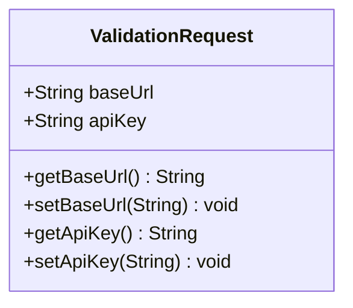
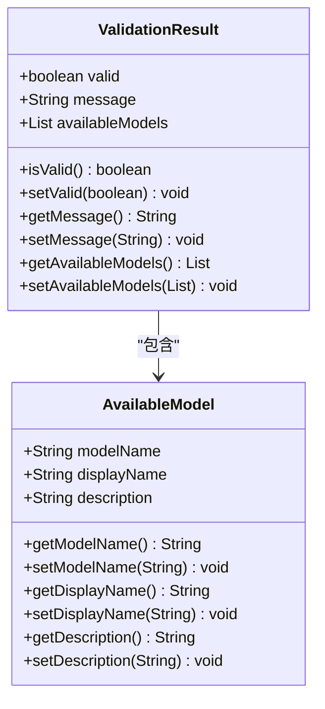
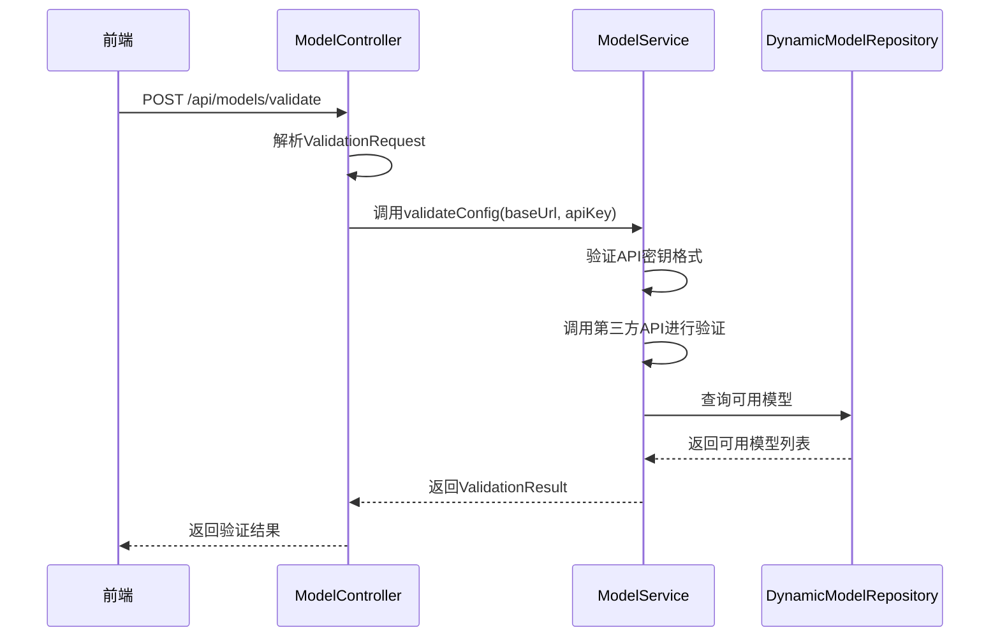
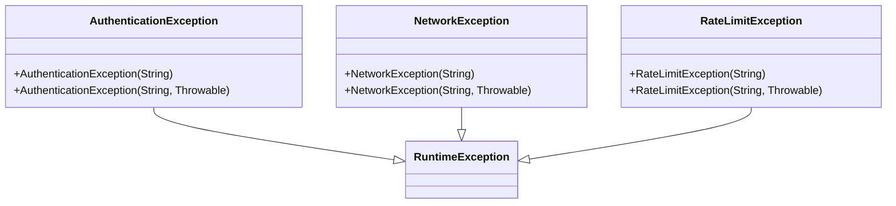
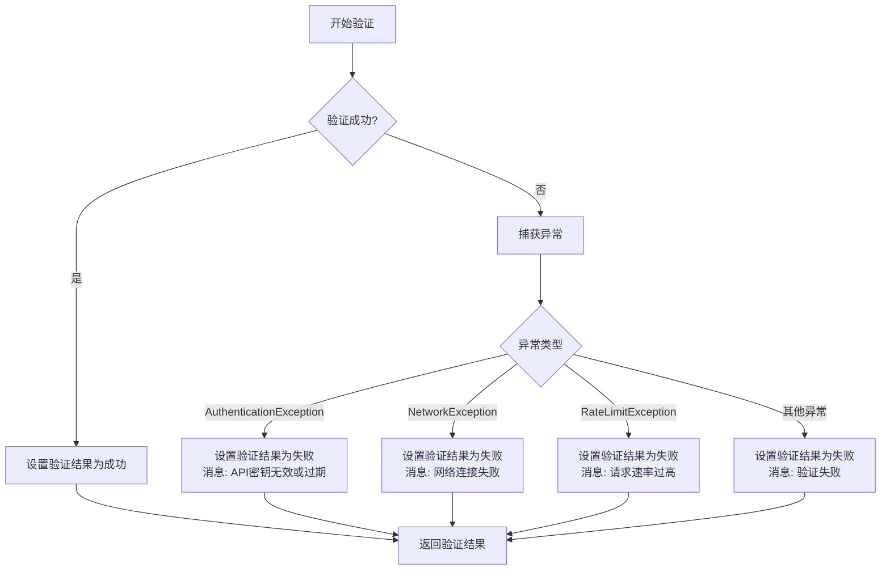
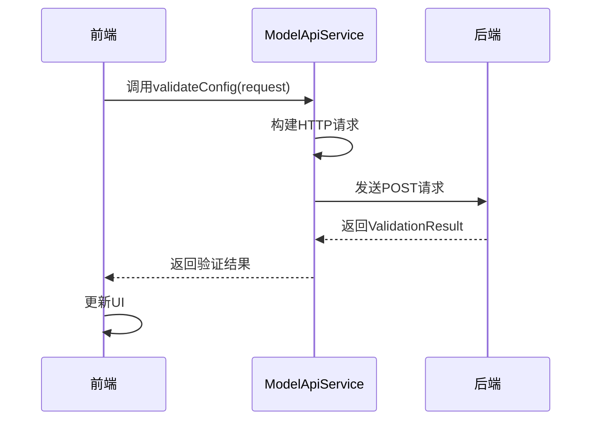

# 配置验证机制

<cite>
**本文档引用的文件**
- [ValidationRequest.java](file://src/main/java/com/alibaba/cloud/ai/lynxe/model/model/vo/ValidationRequest.java)
- [ValidationResult.java](file://src/main/java/com/alibaba/cloud/ai/lynxe/model/model/vo/ValidationResult.java)
- [ModelController.java](file://src/main/java/com/alibaba/cloud/ai/lynxe/model/controller/ModelController.java)
- [ModelServiceImpl.java](file://src/main/java/com/alibaba/cloud/ai/lynxe/model/service/ModelServiceImpl.java)
- [AuthenticationException.java](file://src/main/java/com/alibaba/cloud/ai/lynxe/model/exception/AuthenticationException.java)
- [NetworkException.java](file://src/main/java/com/alibaba/cloud/ai/lynxe/model/exception/NetworkException.java)
- [RateLimitException.java](file://src/main/java/com/alibaba/cloud/ai/lynxe/model/exception/RateLimitException.java)
- [model-api-service.ts](file://ui-vue3/src/api/model-api-service.ts)
- [modelConfig.vue](file://ui-vue3/src/views/configs/modelConfig.vue)
</cite>

## 目录
1. [引言](#引言)
2. [数据模型设计](#数据模型设计)
3. [验证流程分析](#验证流程分析)
4. [异常处理机制](#异常处理机制)
5. [缓存策略与过期机制](#缓存策略与过期机制)
6. [前端轮询机制](#前端轮询机制)
7. [常见验证失败场景诊断](#常见验证失败场景诊断)
8. [结论](#结论)

## 引言
JManus模型配置验证机制为用户提供了一种可靠的方式来验证模型配置的有效性，确保API密钥、基础URL等配置项的正确性。该机制通过后端服务与前端界面的协同工作，实现了从请求解析到异步验证任务调度的完整链路。本文档将详细说明验证机制的设计与实现，包括数据模型、处理流程、异常处理、缓存策略等方面。

## 数据模型设计

### ValidationRequest数据模型
`ValidationRequest`类用于封装模型配置验证的请求数据，包含以下属性：

- **baseUrl**: 基础URL，用于指定第三方API的地址
- **apiKey**: API密钥，用于身份验证

该数据模型的设计遵循了简洁性和实用性的原则，仅包含验证所需的必要信息。



**图示来源**
- [ValidationRequest.java](file://src/main/java/com/alibaba/cloud/ai/lynxe/model/model/vo/ValidationRequest.java)

### ValidationResult数据模型
`ValidationResult`类用于封装模型配置验证的结果，包含以下属性：

- **valid**: 布尔值，表示验证是否成功
- **message**: 字符串，提供验证结果的详细信息
- **availableModels**: 可用模型列表，包含模型名称、显示名称和描述

该数据模型的设计考虑了验证结果的多样性和可扩展性，能够适应不同类型的验证需求。



**图示来源**
- [ValidationResult.java](file://src/main/java/com/alibaba/cloud/ai/lynxe/model/model/vo/ValidationResult.java)
- [AvailableModel.java](file://src/main/java/com/alibaba/cloud/ai/lynxe/model/model/vo/AvailableModel.java)

**本节来源**
- [ValidationRequest.java](file://src/main/java/com/alibaba/cloud/ai/lynxe/model/model/vo/ValidationRequest.java)
- [ValidationResult.java](file://src/main/java/com/alibaba/cloud/ai/lynxe/model/model/vo/ValidationResult.java)
- [AvailableModel.java](file://src/main/java/com/alibaba/cloud/ai/lynxe/model/model/vo/AvailableModel.java)

## 验证流程分析

### POST /api/models/validate接口处理流程
`ModelController`中的`POST /api/models/validate`接口负责处理模型配置验证请求。其处理流程如下：

1. **请求解析**: 接收`ValidationRequest`对象，提取`baseUrl`和`apiKey`
2. **调用服务层**: 将提取的参数传递给`ModelService`的`validateConfig`方法
3. **返回结果**: 将服务层返回的`ValidationResult`对象封装为HTTP响应



**图示来源**
- [ModelController.java](file://src/main/java/com/alibaba/cloud/ai/lynxe/model/controller/ModelController.java)
- [ModelServiceImpl.java](file://src/main/java/com/alibaba/cloud/ai/lynxe/model/service/ModelServiceImpl.java)
- [DynamicModelRepository.java](file://src/main/java/com/alibaba/cloud/ai/lynxe/model/repository/DynamicModelRepository.java)

### 临时模型实例化
系统通过临时模型实例化来测试API密钥的有效性。具体步骤如下：

1. **创建临时模型**: 使用提供的`baseUrl`和`apiKey`创建一个临时的模型实例
2. **调用第三方API**: 通过临时模型实例调用第三方API，验证API密钥的有效性
3. **获取可用模型**: 如果验证成功，获取第三方API提供的可用模型列表
4. **返回结果**: 将验证结果和可用模型列表封装为`ValidationResult`对象返回

**本节来源**
- [ModelController.java](file://src/main/java/com/alibaba/cloud/ai/lynxe/model/controller/ModelController.java)
- [ModelServiceImpl.java](file://src/main/java/com/alibaba/cloud/ai/lynxe/model/service/ModelServiceImpl.java)

## 异常处理机制

### 特定异常类型
系统定义了多种特定异常类型，用于捕获和处理不同的验证失败情况：

- **AuthenticationException**: 认证异常，当API密钥无效或过期时抛出
- **NetworkException**: 网络异常，当网络连接失败时抛出
- **RateLimitException**: 速率限制异常，当请求速率过高时抛出

这些异常类型的设计使得系统能够生成精确的验证结果，为用户提供清晰的错误信息。



**图示来源**
- [AuthenticationException.java](file://src/main/java/com/alibaba/cloud/ai/lynxe/model/exception/AuthenticationException.java)
- [NetworkException.java](file://src/main/java/com/alibaba/cloud/ai/lynxe/model/exception/NetworkException.java)
- [RateLimitException.java](file://src/main/java/com/alibaba/cloud/ai/lynxe/model/exception/RateLimitException.java)

### 异常捕获与处理
在`ModelServiceImpl`的`validateConfig`方法中，系统通过try-catch块捕获并处理各种异常：



**图示来源**
- [ModelServiceImpl.java](file://src/main/java/com/alibaba/cloud/ai/lynxe/model/service/ModelServiceImpl.java)

**本节来源**
- [AuthenticationException.java](file://src/main/java/com/alibaba/cloud/ai/lynxe/model/exception/AuthenticationException.java)
- [NetworkException.java](file://src/main/java/com/alibaba/cloud/ai/lynxe/model/exception/NetworkException.java)
- [RateLimitException.java](file://src/main/java/com/alibaba/cloud/ai/lynxe/model/exception/RateLimitException.java)
- [ModelServiceImpl.java](file://src/main/java/com/alibaba/cloud/ai/lynxe/model/service/ModelServiceImpl.java)

## 缓存策略与过期机制

### 缓存策略
系统采用基于内存的缓存策略，使用`ConcurrentHashMap`存储验证结果。缓存的键为`baseUrl`和`apiKey`的组合，值为`CacheEntry<List<AvailableModel>>`对象。

### 过期机制
缓存项的过期时间为2秒（2000毫秒）。每次访问缓存项时，系统会检查其时间戳，如果超过过期时间，则认为缓存项已过期，需要重新验证。

```mermaid
classDiagram
class CacheEntry<T> {
+T data
+long timestamp
+getData() T
+isExpired() boolean
}
class ModelServiceImpl {
+Map<String, CacheEntry<List<AvailableModel>>> apiCache
+static final long CACHE_EXPIRY_MS = 2000
}
ModelServiceImpl --> CacheEntry : "使用"
```

**图示来源**
- [ModelServiceImpl.java](file://src/main/java/com/alibaba/cloud/ai/lynxe/model/service/ModelServiceImpl.java)

**本节来源**
- [ModelServiceImpl.java](file://src/main/java/com/alibaba/cloud/ai/lynxe/model/service/ModelServiceImpl.java)

## 前端轮询机制

### 前端验证流程
前端通过调用`ModelApiService`的`validateConfig`方法来触发模型配置验证。具体流程如下：

1. **构建请求**: 创建`ValidationRequest`对象，填充`baseUrl`和`apiKey`
2. **发送请求**: 调用`apiFetch`方法发送POST请求到`/api/models/validate`
3. **处理响应**: 解析返回的`ValidationResult`对象，根据验证结果更新UI



**图示来源**
- [model-api-service.ts](file://ui-vue3/src/api/model-api-service.ts)

### 轮询实现
前端在保存模型配置前会自动触发验证。如果API密钥被修改或模型尚未验证过，系统会强制进行验证。验证过程中，前端会显示"正在验证"的提示信息，直到收到验证结果。

**本节来源**
- [model-api-service.ts](file://ui-vue3/src/api/model-api-service.ts)
- [modelConfig.vue](file://ui-vue3/src/views/configs/modelConfig.vue)

## 常见验证失败场景诊断

### 凭证错误
**错误码**: 401 Unauthorized  
**用户提示**: "API密钥无效或过期，请检查您的API密钥"  
**诊断步骤**:
1. 检查API密钥是否正确
2. 确认API密钥未过期
3. 重新生成API密钥并重试

### 网络超时
**错误码**: 504 Gateway Timeout  
**用户提示**: "网络连接失败，请检查基础URL"  
**诊断步骤**:
1. 检查网络连接是否正常
2. 确认基础URL是否正确
3. 检查防火墙或代理设置

### 速率限制
**错误码**: 429 Too Many Requests  
**用户提示**: "请求速率过高，请稍后再试"  
**诊断步骤**:
1. 降低请求频率
2. 检查是否有其他进程在频繁调用API
3. 联系API提供商了解速率限制策略

**本节来源**
- [ModelServiceImpl.java](file://src/main/java/com/alibaba/cloud/ai/lynxe/model/service/ModelServiceImpl.java)
- [modelConfig.vue](file://ui-vue3/src/views/configs/modelConfig.vue)

## 结论
JManus模型配置验证机制通过精心设计的数据模型、清晰的处理流程、完善的异常处理和高效的缓存策略，为用户提供了一个可靠、高效的模型配置验证解决方案。前端与后端的紧密协作，使得用户能够轻松地验证和管理模型配置，确保系统的稳定性和安全性。