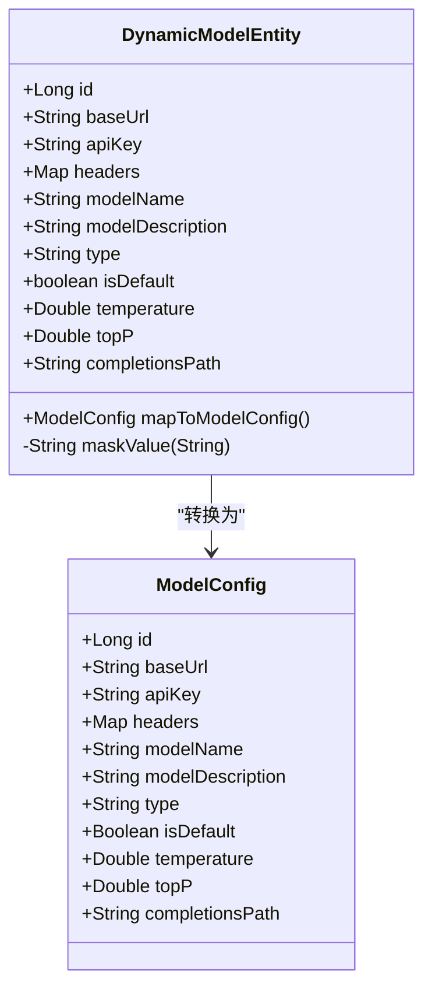
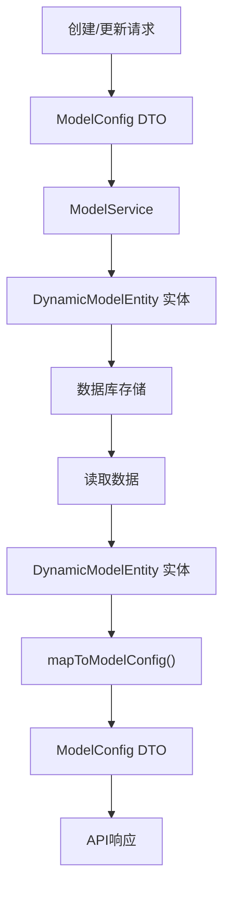
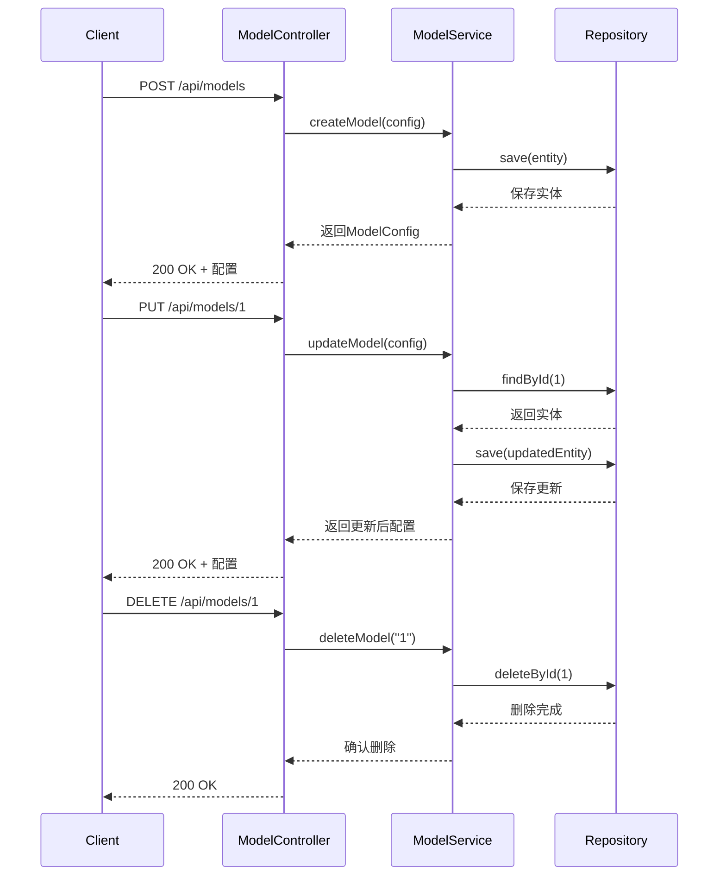
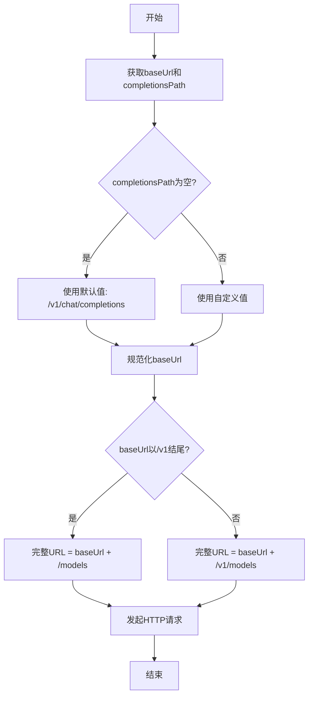
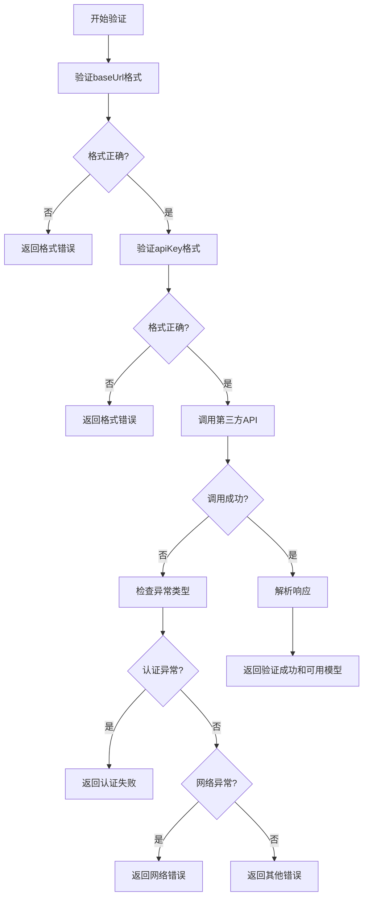

# 模型配置

<cite>
**本文档中引用的文件**  
- [DynamicModelEntity.java](file://src/main/java/com/alibaba/cloud/ai/lynxe/model/entity/DynamicModelEntity.java)
- [ModelController.java](file://src/main/java/com/alibaba/cloud/ai/lynxe/model/controller/ModelController.java)
- [ModelConfig.java](file://src/main/java/com/alibaba/cloud/ai/lynxe/model/model/vo/ModelConfig.java)
- [ModelServiceImpl.java](file://src/main/java/com/alibaba/cloud/ai/lynxe/model/service/ModelServiceImpl.java)
- [ModelType.java](file://src/main/java/com/alibaba/cloud/ai/lynxe/model/model/enums/ModelType.java)
- [ValidationRequest.java](file://src/main/java/com/alibaba/cloud/ai/lynxe/model/model/vo/ValidationRequest.java)
- [ValidationResult.java](file://src/main/java/com/alibaba/cloud/ai/lynxe/model/model/vo/ValidationResult.java)
- [AvailableModel.java](file://src/main/java/com/alibaba/cloud/ai/lynxe/model/model/vo/AvailableModel.java)
- [DynamicModelRepository.java](file://src/main/java/com/alibaba/cloud/ai/lynxe/model/repository/DynamicModelRepository.java)
- [MapToStringConverter.java](file://src/main/java/com/alibaba/cloud/ai/lynxe/model/entity/MapToStringConverter.java)
</cite>

## 目录
1. [简介](#简介)
2. [核心实体分析](#核心实体分析)
3. [数据传输对象设计](#数据传输对象设计)
4. [REST API 接口说明](#rest-api-接口说明)
5. [JSON 配置示例](#json-配置示例)
6. [自定义端点路由机制](#自定义端点路由机制)
7. [模型类型枚举](#模型类型枚举)
8. [验证机制](#验证机制)
9. [依赖关系图](#依赖关系图)

## 简介
本文档详细说明了JManus系统中模型配置的核心组件与功能。重点分析了DynamicModelEntity实体类的字段结构、ModelConfig数据传输对象的设计，以及通过ModelController提供的REST API进行模型管理的操作方法。文档还提供了完整的JSON配置示例和自定义端点路由机制的说明。

## 核心实体分析

`DynamicModelEntity`是JManus系统中用于持久化存储AI模型配置的核心实体类，映射到数据库表`dynamic_models`。该实体类定义了模型连接和行为的所有关键属性。

### 字段结构说明

| 字段名 | 类型 | 是否必填 | 默认值 | 说明 |
|--------|------|----------|--------|------|
| id | Long | 是 | - | 主键，自增 |
| baseUrl | String | 是 | - | 模型服务的基础URL |
| apiKey | String | 是 | - | API认证密钥 |
| headers | Map<String, String> | 否 | - | 自定义请求头 |
| modelName | String | 是 | - | 模型名称 |
| modelDescription | String | 是 | - | 模型描述 |
| type | String | 是 | - | 模型类型 |
| isDefault | boolean | 是 | false | 是否为默认模型 |
| temperature | Double | 否 | 0.7 | 生成温度参数 |
| topP | Double | 否 | - | 核采样参数 |
| completionsPath | String | 否 | /v1/chat/completions | 补全接口路径 |

**字段详细说明：**

- **baseUrl**: 指定模型服务的根URL，必须以http或https协议开头
- **apiKey**: 用于API认证的密钥，系统会自动进行脱敏处理
- **headers**: 存储自定义HTTP请求头，使用`MapToStringConverter`转换器将Map转换为字符串存储
- **modelName**: 模型的唯一标识名称
- **type**: 模型的功能类型，如GENERAL、VISION、CODE等
- **isDefault**: 标记是否为系统默认模型，系统中只能有一个默认模型
- **temperature**: 控制生成文本的随机性，值越大越随机
- **topP**: 控制生成时考虑的概率质量，与temperature互斥
- **completionsPath**: 自定义补全接口的路径，允许与标准OpenAI路径不同



**图示来源**
- [DynamicModelEntity.java](file://src/main/java/com/alibaba/cloud/ai/lynxe/model/entity/DynamicModelEntity.java#L24-L189)
- [ModelConfig.java](file://src/main/java/com/alibaba/cloud/ai/lynxe/model/model/vo/ModelConfig.java#L24-L136)

**本节来源**
- [DynamicModelEntity.java](file://src/main/java/com/alibaba/cloud/ai/lynxe/model/entity/DynamicModelEntity.java#L24-L189)

## 数据传输对象设计

`ModelConfig`是模型配置的数据传输对象（DTO），用于在服务层和控制器层之间传递模型配置信息。与实体类相比，DTO更注重数据的传输和展示。

### 设计目的与用途

1. **分层解耦**: 将持久层实体与业务逻辑层分离，避免直接暴露数据库实体
2. **安全脱敏**: 在传输过程中对敏感信息（如apiKey）进行处理
3. **灵活扩展**: 可以根据前端需求添加或移除字段，不影响底层存储结构
4. **序列化优化**: 专门用于JSON序列化和反序列化，提高API响应效率

### 与实体类的转换

`DynamicModelEntity`通过`mapToModelConfig()`方法转换为`ModelConfig`对象。在转换过程中：
- API密钥会经过`maskValue()`方法处理，只显示首尾4位，中间用*代替
- 所有字段值从实体类复制到DTO
- 布尔类型的`isDefault`字段在DTO中为包装类型`Boolean`，便于JSON序列化



**图示来源**
- [DynamicModelEntity.java](file://src/main/java/com/alibaba/cloud/ai/lynxe/model/entity/DynamicModelEntity.java#L159-L173)
- [ModelConfig.java](file://src/main/java/com/alibaba/cloud/ai/lynxe/model/model/vo/ModelConfig.java#L24-L136)

**本节来源**
- [DynamicModelEntity.java](file://src/main/java/com/alibaba/cloud/ai/lynxe/model/entity/DynamicModelEntity.java#L159-L173)
- [ModelConfig.java](file://src/main/java/com/alibaba/cloud/ai/lynxe/model/model/vo/ModelConfig.java#L24-L136)

## REST API 接口说明

`ModelController`提供了完整的RESTful API用于模型的增删改查操作，所有接口均位于`/api/models`路径下。

### 接口概览

| HTTP方法 | 路径 | 功能 | 请求体 | 响应状态码 |
|---------|------|------|--------|-----------|
| GET | /api/models | 获取所有模型 | 无 | 200 |
| GET | /api/models/{id} | 根据ID获取模型 | 无 | 200, 400 |
| POST | /api/models | 创建新模型 | ModelConfig | 200, 499 |
| PUT | /api/models/{id} | 更新模型 | ModelConfig | 200, 499 |
| DELETE | /api/models/{id} | 删除模型 | 无 | 200, 400, 499 |
| POST | /api/models/validate | 验证配置 | ValidationRequest | 200 |
| POST | /api/models/{id}/set-default | 设置默认模型 | 无 | 200, 400, 500 |
| GET | /api/models/types | 获取所有模型类型 | 无 | 200 |
| GET | /api/models/available-models | 获取可用模型列表 | 无 | 200 |

### 详细接口说明

#### 创建模型 (POST /api/models)

创建新的模型配置。

**请求示例:**
```json
{
  "baseUrl": "https://api.example.com",
  "apiKey": "sk-xxxxxxxxxxxxxxxxxxxxxxxxxxxxxxxx",
  "modelName": "gpt-4-turbo",
  "modelDescription": "GPT-4 Turbo模型",
  "type": "GENERAL",
  "isDefault": true,
  "temperature": 0.7,
  "topP": 0.9,
  "completionsPath": "/v1/chat/completions"
}
```

**响应示例:**
```json
{
  "id": 1,
  "baseUrl": "https://api.example.com",
  "apiKey": "sk-xxxx**********xxxx",
  "modelName": "gpt-4-turbo",
  "modelDescription": "GPT-4 Turbo模型",
  "type": "GENERAL",
  "isDefault": true,
  "temperature": 0.7,
  "topP": 0.9,
  "completionsPath": "/v1/chat/completions"
}
```

#### 更新模型 (PUT /api/models/{id})

更新指定ID的模型配置。

**注意事项:**
- 路径参数{id}为模型ID
- 请求体中的ID字段会被忽略，以路径参数为准
- 如果更新失败，返回状态码499

#### 删除模型 (DELETE /api/models/{id})

删除指定ID的模型。

**响应状态码:**
- 200: 删除成功
- 400: 模型不存在
- 499: 不支持的操作



**图示来源**
- [ModelController.java](file://src/main/java/com/alibaba/cloud/ai/lynxe/model/controller/ModelController.java#L37-L175)
- [ModelServiceImpl.java](file://src/main/java/com/alibaba/cloud/ai/lynxe/model/service/ModelServiceImpl.java#L54-L484)

**本节来源**
- [ModelController.java](file://src/main/java/com/alibaba/cloud/ai/lynxe/model/controller/ModelController.java#L37-L175)

## JSON 配置示例

以下提供完整的JSON示例，展示如何配置不同类型的AI服务。

### OpenAI 兼容模型配置

```json
{
  "baseUrl": "https://api.openai.com",
  "apiKey": "sk-your-openai-api-key",
  "headers": {
    "Custom-Header": "custom-value"
  },
  "modelName": "gpt-4-turbo",
  "modelDescription": "OpenAI GPT-4 Turbo模型",
  "type": "GENERAL",
  "isDefault": true,
  "temperature": 0.7,
  "topP": 0.9,
  "completionsPath": "/v1/chat/completions"
}
```

### 第三方AI服务配置

```json
{
  "baseUrl": "https://api.anthropic.com",
  "apiKey": "your-anthropic-api-key",
  "headers": {
    "x-api-key": "your-anthropic-api-key",
    "anthropic-version": "2023-06-01"
  },
  "modelName": "claude-3-opus-20240229",
  "modelDescription": "Anthropic Claude 3 Opus模型",
  "type": "GENERAL",
  "isDefault": false,
  "temperature": 0.5,
  "topP": 0.95,
  "completionsPath": "/v1/messages"
}
```

### 本地部署模型配置

```json
{
  "baseUrl": "http://localhost:11434",
  "apiKey": "empty",
  "headers": {},
  "modelName": "llama3",
  "modelDescription": "本地Ollama部署的Llama3模型",
  "type": "GENERAL",
  "isDefault": false,
  "temperature": 0.8,
  "topP": 0.9,
  "completionsPath": "/api/generate"
}
```

**本节来源**
- [ModelConfig.java](file://src/main/java/com/alibaba/cloud/ai/lynxe/model/model/vo/ModelConfig.java#L24-L136)
- [DynamicModelEntity.java](file://src/main/java/com/alibaba/cloud/ai/lynxe/model/entity/DynamicModelEntity.java#L24-L189)

## 自定义端点路由机制

`completionsPath`字段在自定义端点路由中起着关键作用，允许系统连接到非标准OpenAI兼容的API服务。

### 作用机制

1. **路径灵活性**: 当调用模型服务时，系统会将`baseUrl`与`completionsPath`拼接形成完整的API端点URL
2. **默认值**: 如果未指定`completionsPath`，系统默认使用`/v1/chat/completions`
3. **路径规范化**: 系统会自动处理基础URL的结尾斜杠，避免生成重复的`//`路径

### 实现逻辑

在`ModelServiceImpl`的`callThirdPartyApiInternal`方法中，路径拼接逻辑如下：

1. 规范化`baseUrl`，移除末尾斜杠
2. 检查`baseUrl`是否已包含`/v1`
3. 根据情况拼接`/models`或`/v1/models`路径
4. 使用拼接后的完整URL发起HTTP请求

这种机制使得系统能够兼容各种OpenAI兼容服务，即使它们的API路径结构略有不同。



**图示来源**
- [ModelServiceImpl.java](file://src/main/java/com/alibaba/cloud/ai/lynxe/model/service/ModelServiceImpl.java#L439-L454)
- [DynamicModelEntity.java](file://src/main/java/com/alibaba/cloud/ai/lynxe/model/entity/DynamicModelEntity.java#L60-L61)

**本节来源**
- [ModelServiceImpl.java](file://src/main/java/com/alibaba/cloud/ai/lynxe/model/service/ModelServiceImpl.java#L439-L454)

## 模型类型枚举

`ModelType`枚举定义了系统支持的各种模型类型，用于分类和标识模型的功能特性。

### 类型列表

| 类型 | 说明 |
|------|------|
| GENERAL | 通用模型：具有多种能力，可处理各种任务 |
| REASONING | 推理模型：用于逻辑推理和决策场景 |
| PLANNER | 规划模型：用于任务分解和计划制定 |
| VISION | 视觉模型：用于图像识别、OCR和物体检测 |
| CODE | 代码模型：用于代码生成、理解和修复 |
| TEXT_GENERATION | 文本生成模型：用于自然语言文本生成 |
| EMBEDDING | 嵌入模型：用于文本向量化和语义编码 |
| CLASSIFICATION | 分类模型：用于文本分类和情感分析 |
| SUMMARIZATION | 摘要模型：用于生成长文本摘要 |
| MULTIMODAL | 多模态模型：处理文本和图像等多种模态 |
| SPEECH | 语音模型：用于语音识别和合成 |
| TRANSLATION | 翻译模型：用于跨语言翻译 |

### 使用场景

模型类型可用于：
- 前端界面的模型分类展示
- 根据任务需求自动选择合适的模型
- 权限控制和访问限制
- 性能监控和统计分析

**本节来源**
- [ModelType.java](file://src/main/java/com/alibaba/cloud/ai/lynxe/model/model/enums/ModelType.java#L22-L85)

## 验证机制

系统提供了完善的模型配置验证机制，确保配置的正确性和可用性。

### 验证流程

1. **基础格式验证**: 检查`baseUrl`是否为有效的HTTP/HTTPS URL
2. **API密钥验证**: 检查API密钥是否非空且长度足够
3. **第三方API调用**: 向模型服务发起实际请求，验证认证和网络连接
4. **异常处理**: 捕获并分类各种可能的异常，提供明确的错误信息

### 验证接口

`POST /api/models/validate`接口接收`ValidationRequest`对象，返回`ValidationResult`对象。

**请求结构:**
```json
{
  "baseUrl": "https://api.example.com",
  "apiKey": "your-api-key"
}
```

**响应结构:**
```json
{
  "valid": true,
  "message": "验证成功",
  "availableModels": [
    {
      "modelName": "gpt-4-turbo",
      "displayName": "GPT-4 Turbo",
      "description": "GPT-4 Turbo模型"
    }
  ]
}
```

验证成功时，还会返回该服务可用的模型列表，便于前端展示选择。



**图示来源**
- [ModelServiceImpl.java](file://src/main/java/com/alibaba/cloud/ai/lynxe/model/service/ModelServiceImpl.java#L190-L253)
- [ValidationRequest.java](file://src/main/java/com/alibaba/cloud/ai/lynxe/model/model/vo/ValidationRequest.java#L21-L51)
- [ValidationResult.java](file://src/main/java/com/alibaba/cloud/ai/lynxe/model/model/vo/ValidationResult.java#L23-L69)

**本节来源**
- [ModelServiceImpl.java](file://src/main/java/com/alibaba/cloud/ai/lynxe/model/service/ModelServiceImpl.java#L190-L253)

## 依赖关系图

以下图表展示了模型配置相关组件之间的依赖关系。

```mermaid
graph TD
A["ModelController"] --> B["ModelService"]
B --> C["ModelServiceImpl"]
C --> D["DynamicModelRepository"]
D --> E["DynamicModelEntity"]
C --> F["LlmService"]
C --> G["LynxeEventPublisher"]
E --> H["MapToStringConverter"]
A --> I["DynamicModelRepository"]
C --> J["RestTemplate"]
subgraph "数据传输对象"
K["ModelConfig"]
L["ValidationRequest"]
M["ValidationResult"]
N["AvailableModel"]
end
E --> K : "mapToModelConfig"
K --> A : "API响应"
L --> A : "验证请求"
M --> A : "验证结果"
N --> M : "包含"
```

**图示来源**
- [ModelController.java](file://src/main/java/com/alibaba/cloud/ai/lynxe/model/controller/ModelController.java#L37-L175)
- [ModelServiceImpl.java](file://src/main/java/com/alibaba/cloud/ai/lynxe/model/service/ModelServiceImpl.java#L54-L484)
- [DynamicModelRepository.java](file://src/main/java/com/alibaba/cloud/ai/lynxe/model/repository/DynamicModelRepository.java#L23-L30)
- [DynamicModelEntity.java](file://src/main/java/com/alibaba/cloud/ai/lynxe/model/entity/DynamicModelEntity.java#L24-L189)

**本节来源**
- [ModelController.java](file://src/main/java/com/alibaba/cloud/ai/lynxe/model/controller/ModelController.java#L37-L175)
- [ModelServiceImpl.java](file://src/main/java/com/alibaba/cloud/ai/lynxe/model/service/ModelServiceImpl.java#L54-L484)