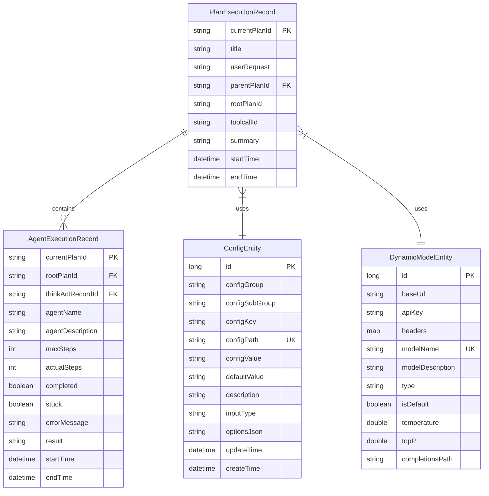

# 核心概念

<cite>
**本文档中引用的文件**  
- [BaseAgent.java](file://src/main/java/com/alibaba/cloud/ai/lynxe/agent/BaseAgent.java)
- [DynamicAgent.java](file://src/main/java/com/alibaba/cloud/ai/lynxe/agent/DynamicAgent.java)
- [AgentState.java](file://src/main/java/com/alibaba/cloud/ai/lynxe/agent/AgentState.java)
- [ReActAgent.java](file://src/main/java/com/alibaba/cloud/ai/lynxe/agent/ReActAgent.java)
- [PlanTemplateService.java](file://src/main/java/com/alibaba/cloud/ai/lynxe/planning/service/PlanTemplateService.java)
- [ConfigEntity.java](file://src/main/java/com/alibaba/cloud/ai/lynxe/config/entity/ConfigEntity.java)
- [DynamicModelEntity.java](file://src/main/java/com/alibaba/cloud/ai/lynxe/model/entity/DynamicModelEntity.java)
- [PlanExecutionRecorder.java](file://src/main/java/com/alibaba/cloud/ai/lynxe/recorder/service/PlanExecutionRecorder.java)
- [ExecutionStep.java](file://src/main/java/com/alibaba/cloud/ai/lynxe/runtime/entity/vo/ExecutionStep.java)
- [LynxeEventPublisher.java](file://src/main/java/com/alibaba/cloud/ai/lynxe/event/LynxeEventPublisher.java)
</cite>

## 目录
1. [AI代理（Agent）](#ai代理agent)
2. [计划（Plan）执行模型](#计划plan执行模型)
3. [配置管理系统](#配置管理系统)
4. [动态模型管理](#动态模型管理)
5. [事件驱动架构](#事件驱动架构)
6. [核心数据模型关系](#核心数据模型关系)

## AI代理（Agent）

JManus系统中的AI代理（Agent）是执行多步骤任务的核心组件，基于`BaseAgent`抽象类实现。代理通过继承`ReActAgent`模式，实现了“思考-行动”（Reasoning + Acting）的交替执行机制。每个代理实例都维护自身的状态、对话历史和执行上下文，确保任务的连续性和一致性。

代理的核心功能包括状态管理、对话跟踪、步骤限制监控和线程安全执行。代理的生命周期由`AgentState`枚举定义，包含`NOT_STARTED`（未开始）、`IN_PROGRESS`（进行中）、`COMPLETED`（已完成）、`BLOCKED`（阻塞）、`FAILED`（失败）和`INTERRUPTED`（中断）六种状态。代理通过`run()`方法启动执行流程，该方法在循环中调用`step()`方法，直到达到最大步骤数或进入终止状态。

`DynamicAgent`是系统中主要的代理实现，它继承自`ReActAgent`，并实现了复杂的重试机制和异常处理。当LLM调用失败时，代理会自动重试最多三次，并采用指数退避策略（2^attempt * 2000ms）进行延迟。代理还实现了防“过早终止”机制，当LLM返回纯文本响应而未调用工具时，会在后续重试中添加明确的工具调用要求，防止代理陷入无限循环。

**代理的执行流程如下：**
1. **思考阶段（think）**：代理根据当前上下文生成系统提示，调用LLM进行推理，决定是否需要执行动作。
2. **行动阶段（act）**：如果需要执行动作，代理会调用相应的工具（Tool），并将结果记录到执行历史中。
3. **状态检查**：每次执行后，代理检查是否应终止、中断或失败，并相应地更新状态。
4. **循环执行**：重复上述过程，直到完成所有步骤或达到最大步骤数。

代理的配置通过`LynxeProperties`类进行管理，支持并行工具调用、调试模式和最大步骤数等参数。代理的执行结果通过`AgentExecResult`类封装，包含最终结果、状态和所有步骤的执行历史。

**Section sources**
- [BaseAgent.java](file://src/main/java/com/alibaba/cloud/ai/lynxe/agent/BaseAgent.java#L74-L603)
- [DynamicAgent.java](file://src/main/java/com/alibaba/cloud/ai/lynxe/agent/DynamicAgent.java#L79-L800)
- [ReActAgent.java](file://src/main/java/com/alibaba/cloud/ai/lynxe/agent/ReActAgent.java#L30-L97)
- [AgentState.java](file://src/main/java/com/alibaba/cloud/ai/lynxe/agent/AgentState.java#L18-L35)

## 计划（Plan）执行模型

JManus系统的计划执行模型基于模板化和版本化的设计，确保计划的可追溯性和可复现性。计划模板（Plan Template）是执行的基础，通过`PlanTemplateService`进行管理，支持版本保存、历史记录和智能内容比较。

计划模板服务（`PlanTemplateService`）提供了完整的生命周期管理功能：
- **版本保存**：每次保存计划时，系统会检查新内容是否与最新版本相同。如果相同，则跳过保存，避免创建冗余版本。
- **智能比较**：使用`isJsonContentEquivalent`方法对JSON内容进行语义等价比较，忽略格式差异（如空格、换行），仅比较实际内容。
- **版本历史**：所有版本按索引顺序存储，可通过`getPlanVersions`方法获取所有版本，或通过`getPlanVersion`获取指定版本。

计划的执行由`PlanExecutionRecorder`接口协调，该接口定义了记录执行过程的方法。执行过程分为多个阶段：
1. **开始记录**：调用`recordPlanExecutionStart`记录计划执行的开始，包括用户请求、执行步骤和父子计划关系。
2. **步骤记录**：在每个执行步骤开始和结束时，分别调用`recordStepStart`和`recordStepEnd`。
3. **思考-行动记录**：在代理的思考阶段，调用`recordThinkingAndAction`记录LLM的输入和输出。
4. **行动结果记录**：在工具执行后，调用`recordActionResult`记录工具调用的参数、结果和状态。
5. **完成记录**：当计划完成时，调用`recordPlanCompletion`记录最终摘要。

`ExecutionStep`类表示单个执行步骤，包含步骤要求、代理名称、选择的工具、模型名称和执行状态。每个步骤都有唯一的`stepId`，并可通过`getStepInStr`方法生成可读的步骤描述。

**Section sources**
- [PlanTemplateService.java](file://src/main/java/com/alibaba/cloud/ai/lynxe/planning/service/PlanTemplateService.java#L36-L206)
- [PlanExecutionRecorder.java](file://src/main/java/com/alibaba/cloud/ai/lynxe/recorder/service/PlanExecutionRecorder.java#L26-L242)
- [ExecutionStep.java](file://src/main/java/com/alibaba/cloud/ai/lynxe/runtime/entity/vo/ExecutionStep.java#L28-L179)

## 配置管理系统

JManus的配置管理系统通过`ConfigEntity`实体类实现，提供了一个结构化的配置存储和管理机制。配置项以分组（`configGroup`）、子组（`configSubGroup`）和键（`configKey`）的层次结构组织，确保配置的清晰分类和易于管理。

每个配置项包含以下核心属性：
- **配置路径（configPath）**：由组、子组和键组成的唯一标识符，用于快速查找和引用。
- **配置值（configValue）**：当前配置的实际值，可动态更新。
- **默认值（defaultValue）**：配置的默认值，用于初始化或重置。
- **描述（description）**：配置项的详细说明，帮助用户理解其用途。
- **输入类型（inputType）**：定义配置项的输入方式，如文本、数字、选择框等。
- **选项JSON（optionsJson）**：用于存储选择类型配置的选项数据。

配置管理系统支持运行时更新，允许在不重启服务的情况下修改配置。配置的更新时间（`updateTime`）和创建时间（`createTime`）自动记录，便于审计和追踪变更历史。`ConfigService`类提供了获取、设置和重置配置值的业务逻辑，确保配置操作的一致性和安全性。

**Section sources**
- [ConfigEntity.java](file://src/main/java/com/alibaba/cloud/ai/lynxe/config/entity/ConfigEntity.java#L36-L218)

## 动态模型管理

动态模型管理是JManus系统的核心功能之一，允许用户在运行时注册、配置和调用不同的AI模型。模型信息通过`DynamicModelEntity`实体类持久化存储，支持多种模型类型和自定义配置。

`DynamicModelEntity`包含以下关键字段：
- **基础URL（baseUrl）**：模型API的端点地址。
- **API密钥（apiKey）**：用于身份验证的密钥，系统在输出时会自动遮蔽（前4位和后4位可见，中间用*代替）。
- **模型名称（modelName）**：模型的唯一标识名称。
- **模型描述（modelDescription）**：模型的详细描述。
- **类型（type）**：模型的类型，如`openai`、`ollama`等。
- **默认标志（isDefault）**：指示该模型是否为默认模型。
- **温度（temperature）和TopP**：LLM生成参数，控制输出的随机性和多样性。
- **补全路径（completionsPath）**：API中补全请求的路径。

模型服务（`ModelService`）负责管理模型的注册、验证和调用。当模型配置发生变化时，系统会发布`ModelChangeEvent`事件，通知所有监听器更新内部状态。模型的调用通过`LlmService`封装，支持动态创建和缓存聊天客户端，确保高效和低延迟的模型交互。

**Section sources**
- [DynamicModelEntity.java](file://src/main/java/com/alibaba/cloud/ai/lynxe/model/entity/DynamicModelEntity.java#L26-L190)

## 事件驱动架构

JManus系统采用事件驱动架构，通过`LynxeEventPublisher`和`LynxeListener`实现组件间的松耦合通信。事件发布者负责发布事件，而监听器则订阅并处理特定类型的事件，确保系统的可扩展性和灵活性。

`LynxeEventPublisher`是事件发布的核心组件，维护一个事件类型到监听器列表的映射。当`publish`方法被调用时，发布者会遍历所有匹配的监听器（包括父类事件的监听器），并安全地调用其`onEvent`方法。如果监听器处理事件时抛出异常，发布者会捕获并记录错误，防止影响其他监听器的执行。

系统定义了多种事件类型，如`ModelChangeEvent`（模型变更事件）和`PlanExceptionClearedEvent`（计划异常清除事件）。例如，当动态模型配置更新时，`ModelServiceImpl`会发布`ModelChangeEvent`，通知所有相关组件刷新模型状态。同样，当计划执行中的异常被清除时，`DynamicAgent`会在重试成功后发布`PlanExceptionClearedEvent`。

事件驱动架构的优势在于：
- **解耦**：组件之间通过事件通信，无需直接依赖。
- **可扩展性**：可以轻松添加新的监听器来响应现有事件。
- **灵活性**：事件可以被多个监听器处理，实现多播模式。

**Section sources**
- [LynxeEventPublisher.java](file://src/main/java/com/alibaba/cloud/ai/lynxe/event/LynxeEventPublisher.java#L28-L66)

## 核心数据模型关系

JManus系统的核心数据模型围绕计划执行、代理执行、配置和动态模型展开。以下Mermaid图展示了`PlanExecutionRecord`、`AgentExecutionRecord`、`ConfigEntity`和`DynamicModelEntity`等关键实体之间的关系。

**Diagram sources**
- [PlanExecutionRecorder.java](file://src/main/java/com/alibaba/cloud/ai/lynxe/recorder/service/PlanExecutionRecorder.java#L26-L242)
- [ConfigEntity.java](file://src/main/java/com/alibaba/cloud/ai/lynxe/config/entity/ConfigEntity.java#L36-L218)
- [DynamicModelEntity.java](file://src/main/java/com/alibaba/cloud/ai/lynxe/model/entity/DynamicModelEntity.java#L26-L190)