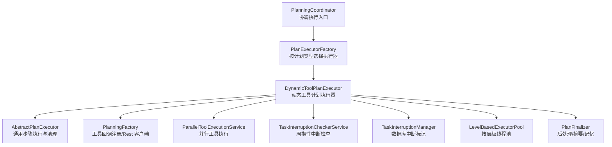
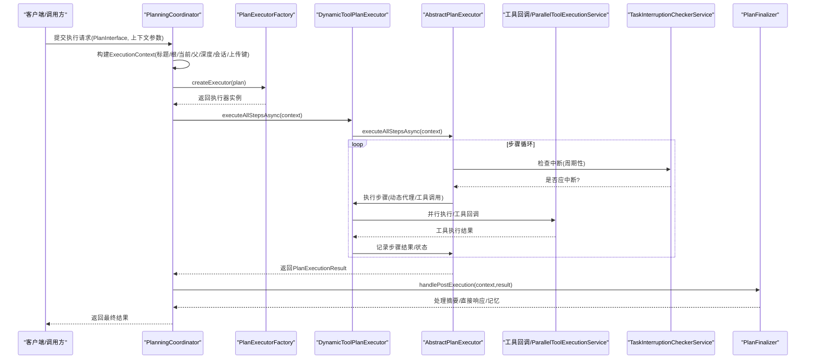
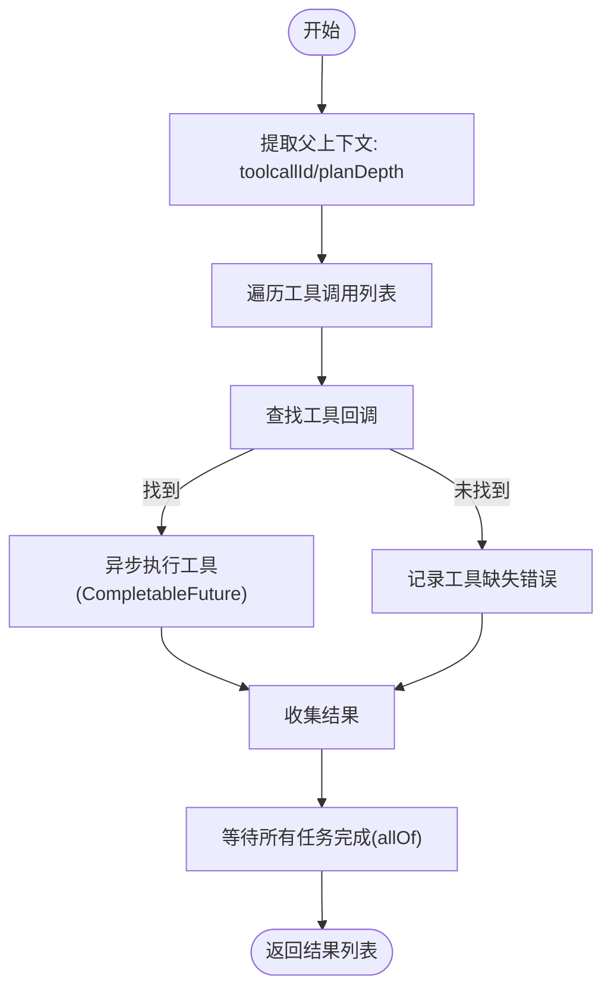
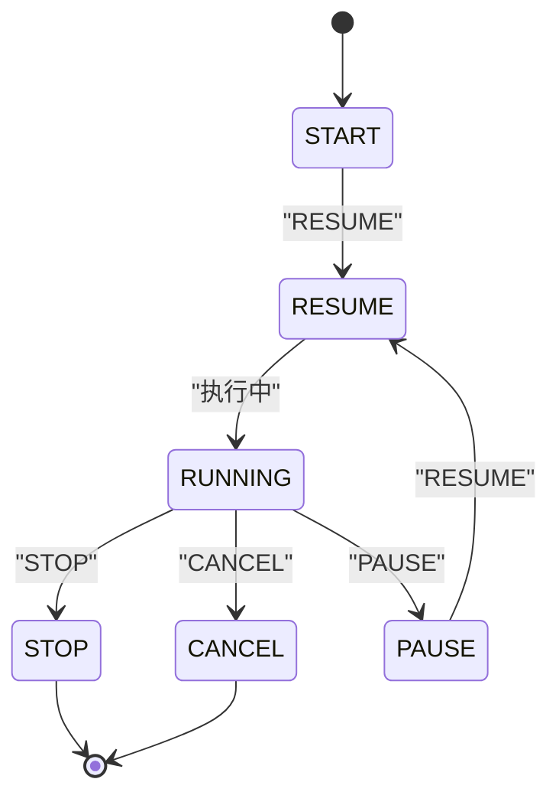
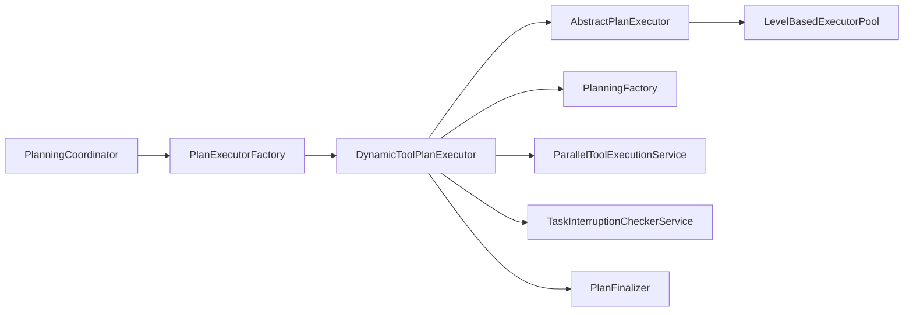

# 执行流程

<cite>
**本文引用的文件列表**
- [PlanningCoordinator.java](file://src/main/java/com/alibaba/cloud/ai/lynxe/runtime/service/PlanningCoordinator.java)
- [PlanExecutorFactory.java](file://src/main/java/com/alibaba/cloud/ai/lynxe/runtime/executor/factory/PlanExecutorFactory.java)
- [PlanningFactory.java](file://src/main/java/com/alibaba/cloud/ai/lynxe/planning/PlanningFactory.java)
- [AbstractPlanExecutor.java](file://src/main/java/com/alibaba/cloud/ai/lynxe/runtime/executor/AbstractPlanExecutor.java)
- [DynamicToolPlanExecutor.java](file://src/main/java/com/alibaba/cloud/ai/lynxe/runtime/executor/DynamicToolPlanExecutor.java)
- [ExecutionContext.java](file://src/main/java/com/alibaba/cloud/ai/lynxe/runtime/entity/vo/ExecutionContext.java)
- [PlanExecutionResult.java](file://src/main/java/com/alibaba/cloud/ai/lynxe/runtime/entity/vo/PlanExecutionResult.java)
- [PlanFinalizer.java](file://src/main/java/com/alibaba/cloud/ai/lynxe/planning/service/PlanFinalizer.java)
- [TaskInterruptionManager.java](file://src/main/java/com/alibaba/cloud/ai/lynxe/runtime/service/TaskInterruptionManager.java)
- [TaskInterruptionCheckerService.java](file://src/main/java/com/alibaba/cloud/ai/lynxe/runtime/service/TaskInterruptionCheckerService.java)
- [ParallelToolExecutionService.java](file://src/main/java/com/alibaba/cloud/ai/lynxe/runtime/service/ParallelToolExecutionService.java)
- [ParallelExecutionTool.java](file://src/main/java/com/alibaba/cloud/ai/lynxe/tool/mapreduce/ParallelExecutionTool.java)
- [LevelBasedExecutorPool.java](file://src/main/java/com/alibaba/cloud/ai/lynxe/runtime/executor/LevelBasedExecutorPool.java)
- [PlanException.java](file://src/main/java/com/alibaba/cloud/ai/lynxe/exception/PlanException.java)
- [ToolCallbackProvider.java](file://src/main/java/com/alibaba/cloud/ai/lynxe/agent/ToolCallbackProvider.java)
</cite>

## 目录
1. [引言](#引言)
2. [项目结构](#项目结构)
3. [核心组件](#核心组件)
4. [架构总览](#架构总览)
5. [详细组件分析](#详细组件分析)
6. [依赖关系分析](#依赖关系分析)
7. [性能考量](#性能考量)
8. [故障排查指南](#故障排查指南)
9. [结论](#结论)

## 引言
本文件系统性梳理 JManus 的“计划执行”全流程：从 PlanningCoordinator 接收执行请求，到 PlanningFactory 创建计划实例与工具回调注册，再到执行引擎按步骤推进、处理动态分支与条件判断，最后由 TaskInterruptionManager 在执行中断与恢复中发挥关键作用，并通过时序图展示从启动、步骤执行、状态更新到完成的全过程。同时给出异常处理策略与并行工具执行服务（ParallelToolExecutionService）的优化要点。

## 项目结构
围绕“执行流程”的关键模块分布如下：
- 协调层：PlanningCoordinator 负责接收请求、构建执行上下文、选择执行器并触发执行。
- 工厂层：PlanningFactory 负责工具回调注册、Rest 客户端配置等；PlanExecutorFactory 根据计划类型选择具体执行器。
- 执行层：AbstractPlanExecutor 提供通用步骤执行逻辑；DynamicToolPlanExecutor 面向动态工具计划的具体实现。
- 中断与恢复：TaskInterruptionManager 与 TaskInterruptionCheckerService 提供数据库驱动的中断检查与标记。
- 并行执行：ParallelToolExecutionService 与 ParallelExecutionTool 提供并行工具执行能力。
- 结果后处理：PlanFinalizer 负责摘要生成、直接响应、结果记录与对话记忆写入。

图表来源
- [PlanningCoordinator.java](file://src/main/java/com/alibaba/cloud/ai/lynxe/runtime/service/PlanningCoordinator.java#L60-L181)
- [PlanExecutorFactory.java](file://src/main/java/com/alibaba/cloud/ai/lynxe/runtime/executor/factory/PlanExecutorFactory.java#L119-L181)
- [DynamicToolPlanExecutor.java](file://src/main/java/com/alibaba/cloud/ai/lynxe/runtime/executor/DynamicToolPlanExecutor.java#L111-L181)
- [AbstractPlanExecutor.java](file://src/main/java/com/alibaba/cloud/ai/lynxe/runtime/executor/AbstractPlanExecutor.java#L246-L396)
- [PlanningFactory.java](file://src/main/java/com/alibaba/cloud/ai/lynxe/planning/PlanningFactory.java#L210-L374)
- [ParallelToolExecutionService.java](file://src/main/java/com/alibaba/cloud/ai/lynxe/runtime/service/ParallelToolExecutionService.java#L75-L165)
- [TaskInterruptionCheckerService.java](file://src/main/java/com/alibaba/cloud/ai/lynxe/runtime/service/TaskInterruptionCheckerService.java#L41-L88)
- [TaskInterruptionManager.java](file://src/main/java/com/alibaba/cloud/ai/lynxe/runtime/service/TaskInterruptionManager.java#L45-L173)
- [LevelBasedExecutorPool.java](file://src/main/java/com/alibaba/cloud/ai/lynxe/runtime/executor/LevelBasedExecutorPool.java#L73-L104)
- [PlanFinalizer.java](file://src/main/java/com/alibaba/cloud/ai/lynxe/planning/service/PlanFinalizer.java#L176-L232)

章节来源
- [PlanningCoordinator.java](file://src/main/java/com/alibaba/cloud/ai/lynxe/runtime/service/PlanningCoordinator.java#L60-L181)
- [PlanExecutorFactory.java](file://src/main/java/com/alibaba/cloud/ai/lynxe/runtime/executor/factory/PlanExecutorFactory.java#L119-L181)

## 核心组件
- PlanningCoordinator：接收执行请求，构造 ExecutionContext，选择执行器并异步执行，随后交由 PlanFinalizer 进行后处理。
- PlanExecutorFactory：根据 PlanInterface 的计划类型返回对应执行器，默认为 DynamicToolPlanExecutor。
- DynamicToolPlanExecutor：面向动态工具计划，基于 PlanningFactory 注册的工具回调，创建可配置动态代理执行器。
- AbstractPlanExecutor：提供统一的步骤执行框架、中断检测、失败处理、清理与异步执行。
- PlanningFactory：注册各类工具回调（浏览器、数据库、文件、并行执行等），构建 FunctionToolCallback，支持 MCP 与子计划工具。
- ParallelToolExecutionService：并行执行多个工具调用，复用线程池与上下文传播。
- TaskInterruptionManager/TaskInterruptionCheckerService：数据库驱动的中断标记与周期性检查，支持 STOP/CANCEL/PAUSE/RESUME 状态。
- PlanFinalizer：根据上下文决定是否生成摘要或直接响应，保存结果至对话记忆。
- LevelBasedExecutorPool：按计划层级分配独立线程池，支持动态调整大小与监控。

章节来源
- [PlanningCoordinator.java](file://src/main/java/com/alibaba/cloud/ai/lynxe/runtime/service/PlanningCoordinator.java#L60-L181)
- [PlanExecutorFactory.java](file://src/main/java/com/alibaba/cloud/ai/lynxe/runtime/executor/factory/PlanExecutorFactory.java#L119-L181)
- [DynamicToolPlanExecutor.java](file://src/main/java/com/alibaba/cloud/ai/lynxe/runtime/executor/DynamicToolPlanExecutor.java#L111-L181)
- [AbstractPlanExecutor.java](file://src/main/java/com/alibaba/cloud/ai/lynxe/runtime/executor/AbstractPlanExecutor.java#L91-L166)
- [PlanningFactory.java](file://src/main/java/com/alibaba/cloud/ai/lynxe/planning/PlanningFactory.java#L210-L374)
- [ParallelToolExecutionService.java](file://src/main/java/com/alibaba/cloud/ai/lynxe/runtime/service/ParallelToolExecutionService.java#L75-L165)
- [TaskInterruptionManager.java](file://src/main/java/com/alibaba/cloud/ai/lynxe/runtime/service/TaskInterruptionManager.java#L45-L173)
- [TaskInterruptionCheckerService.java](file://src/main/java/com/alibaba/cloud/ai/lynxe/runtime/service/TaskInterruptionCheckerService.java#L41-L88)
- [PlanFinalizer.java](file://src/main/java/com/alibaba/cloud/ai/lynxe/planning/service/PlanFinalizer.java#L176-L232)
- [LevelBasedExecutorPool.java](file://src/main/java/com/alibaba/cloud/ai/lynxe/runtime/executor/LevelBasedExecutorPool.java#L73-L104)

## 架构总览
下图展示了从请求进入、执行器选择、步骤推进、中断检查到后处理的整体流程。

图表来源
- [PlanningCoordinator.java](file://src/main/java/com/alibaba/cloud/ai/lynxe/runtime/service/PlanningCoordinator.java#L60-L181)
- [PlanExecutorFactory.java](file://src/main/java/com/alibaba/cloud/ai/lynxe/runtime/executor/factory/PlanExecutorFactory.java#L159-L178)
- [DynamicToolPlanExecutor.java](file://src/main/java/com/alibaba/cloud/ai/lynxe/runtime/executor/DynamicToolPlanExecutor.java#L111-L181)
- [AbstractPlanExecutor.java](file://src/main/java/com/alibaba/cloud/ai/lynxe/runtime/executor/AbstractPlanExecutor.java#L246-L396)
- [ParallelToolExecutionService.java](file://src/main/java/com/alibaba/cloud/ai/lynxe/runtime/service/ParallelToolExecutionService.java#L75-L165)
- [TaskInterruptionCheckerService.java](file://src/main/java/com/alibaba/cloud/ai/lynxe/runtime/service/TaskInterruptionCheckerService.java#L41-L88)
- [PlanFinalizer.java](file://src/main/java/com/alibaba/cloud/ai/lynxe/planning/service/PlanFinalizer.java#L176-L232)

## 详细组件分析

### PlanningCoordinator：执行入口与上下文构建
- 职责：接收执行请求，构建 ExecutionContext，设置标题、根/当前/父计划 ID、计划深度、是否需要摘要、会话 ID、工具调用 ID、上传键等；通过 PlanExecutorFactory 获取执行器并异步执行；执行完成后交由 PlanFinalizer 后处理。
- 关键点：
  - 会话管理：根据 LynxeProperties 与请求来源决定是否启用会话与生成会话 ID。
  - 摘要控制：在 Vue 请求且无 toolcallId 时开启摘要生成。
  - 异常兜底：捕获执行异常并返回错误结果。

章节来源
- [PlanningCoordinator.java](file://src/main/java/com/alibaba/cloud/ai/lynxe/runtime/service/PlanningCoordinator.java#L60-L181)
- [ExecutionContext.java](file://src/main/java/com/alibaba/cloud/ai/lynxe/runtime/entity/vo/ExecutionContext.java#L34-L251)

### PlanExecutorFactory：执行器选择
- 职责：根据 PlanInterface 的计划类型返回对应执行器。当前默认返回 DynamicToolPlanExecutor。
- 关键点：支持简单、直接、动态代理三种类型；未知类型回退为动态代理。

章节来源
- [PlanExecutorFactory.java](file://src/main/java/com/alibaba/cloud/ai/lynxe/runtime/executor/factory/PlanExecutorFactory.java#L119-L181)

### DynamicToolPlanExecutor：动态工具计划执行器
- 职责：面向动态工具计划，基于 PlanningFactory 的工具回调映射创建可配置动态代理执行器；注入 LLM、工具调用管理器、用户输入、事件发布、并行执行服务、内存服务等。
- 初始化过程：
  - 解析步骤需求字符串，提取步骤类型（默认转为 ConfigurableDynaAgent）。
  - 组装初始设置（计划状态、当前步骤索引、步骤文本、额外参数）。
  - 通过 PlanningFactory 的 toolCallbackMap 注册工具回调，提供给代理执行器使用。
  - 设置计划深度与会话 ID（如存在）。

章节来源
- [DynamicToolPlanExecutor.java](file://src/main/java/com/alibaba/cloud/ai/lynxe/runtime/executor/DynamicToolPlanExecutor.java#L111-L181)
- [PlanningFactory.java](file://src/main/java/com/alibaba/cloud/ai/lynxe/planning/PlanningFactory.java#L210-L374)
- [ToolCallbackProvider.java](file://src/main/java/com/alibaba/cloud/ai/lynxe/agent/ToolCallbackProvider.java#L18-L27)

### AbstractPlanExecutor：步骤推进与异常处理
- 职责：提供统一的步骤执行框架，包含：
  - 步骤执行：根据步骤类型获取执行器，记录开始/结束，收集步骤结果，处理成功/失败/中断状态。
  - 中断检测：在每步前检查中断状态，若被中断则停止后续步骤。
  - 文件同步：根据上传键将上传文件同步到计划目录。
  - 清理工作：执行完成后清理 LLM 内存与代理资源。
  - 异步执行：使用 LevelBasedExecutorPool 按层级分配线程池，支持异常回调与 finally 清理。
- 动态分支与条件判断：
  - 通过步骤需求字符串的前缀匹配识别步骤类型（如 DEFAULT_AGENT -> ConfigurableDynaAgent）。
  - 代理执行器内部结合模型名称与所选工具键进行下一步决策与工具调用。

章节来源
- [AbstractPlanExecutor.java](file://src/main/java/com/alibaba/cloud/ai/lynxe/runtime/executor/AbstractPlanExecutor.java#L91-L166)
- [AbstractPlanExecutor.java](file://src/main/java/com/alibaba/cloud/ai/lynxe/runtime/executor/AbstractPlanExecutor.java#L246-L396)

### PlanningFactory：工具回调注册与 Rest 客户端
- 职责：
  - 注册浏览器、数据库、文件、并行执行、Markdown 转换、定时任务、短链、服务操作、HR 等工具回调。
  - 为每个工具定义 FunctionToolCallback，设置输入模式、描述、返回直出标志等。
  - 支持 MCP 服务组回调与子计划工具注册。
  - 提供 RestClient.Builder，统一超时配置（连接/响应/请求超时均为 10 分钟）。
- 参数绑定与代理配置：
  - 通过工具回调上下文（ToolCallBackContext）传递工具定义与 FunctionToolCallback。
  - 代理执行器通过 ToolCallbackProvider 获取工具回调映射。

章节来源
- [PlanningFactory.java](file://src/main/java/com/alibaba/cloud/ai/lynxe/planning/PlanningFactory.java#L210-L374)
- [PlanningFactory.java](file://src/main/java/com/alibaba/cloud/ai/lynxe/planning/PlanningFactory.java#L376-L407)
- [ToolCallbackProvider.java](file://src/main/java/com/alibaba/cloud/ai/lynxe/agent/ToolCallbackProvider.java#L18-L27)

### 并行工具执行服务（ParallelToolExecutionService）
- 职责：接收一组工具调用，按工具名查找回调，异步并行执行，聚合结果。
- 关键流程：
  - 从父 ToolContext 提取 toolcallId 与 planDepth，用于上下文传播。
  - 使用 CompletableFuture 并行执行每个工具，捕获异常并返回错误信息。
  - 支持参数解析（JSON 字符串 -> Map）。
- 与 ParallelExecutionTool 的关系：ParallelExecutionTool 将批量注册的函数委托给 ParallelExecutionService 执行，实现嵌套并行场景下的非阻塞执行。

图表来源
- [ParallelToolExecutionService.java](file://src/main/java/com/alibaba/cloud/ai/lynxe/runtime/service/ParallelToolExecutionService.java#L75-L165)

章节来源
- [ParallelToolExecutionService.java](file://src/main/java/com/alibaba/cloud/ai/lynxe/runtime/service/ParallelToolExecutionService.java#L75-L165)
- [ParallelExecutionTool.java](file://src/main/java/com/alibaba/cloud/ai/lynxe/tool/mapreduce/ParallelExecutionTool.java#L216-L245)

### TaskInterruptionManager 与 TaskInterruptionCheckerService：中断与恢复
- TaskInterruptionManager（数据库驱动）：
  - 提供 shouldInterruptTask/isTaskRunning/markTaskForInterruption/stopTask/cancelTask/pauseTask/resumeTask 等接口。
  - 通过 RootTaskManagerRepository 持久化 DesiredTaskState（STOP/CANCEL/PAUSE/START/RESUME）。
- TaskInterruptionCheckerService（运行时检查）：
  - 周期性检查中断状态，必要时抛出 TaskInterruptedException。
  - 与 AbstractPlanExecutor 的中断检查配合，确保在步骤间及时响应用户中断。

图表来源
- [TaskInterruptionManager.java](file://src/main/java/com/alibaba/cloud/ai/lynxe/runtime/service/TaskInterruptionManager.java#L45-L173)
- [TaskInterruptionCheckerService.java](file://src/main/java/com/alibaba/cloud/ai/lynxe/runtime/service/TaskInterruptionCheckerService.java#L41-L88)

章节来源
- [TaskInterruptionManager.java](file://src/main/java/com/alibaba/cloud/ai/lynxe/runtime/service/TaskInterruptionManager.java#L45-L173)
- [TaskInterruptionCheckerService.java](file://src/main/java/com/alibaba/cloud/ai/lynxe/runtime/service/TaskInterruptionCheckerService.java#L41-L88)
- [AbstractPlanExecutor.java](file://src/main/java/com/alibaba/cloud/ai/lynxe/runtime/executor/AbstractPlanExecutor.java#L274-L323)

### 执行引擎推进与异常处理
- 步骤推进：
  - 依据计划深度选择线程池，保证不同层级的并发隔离与资源控制。
  - 每步前检查中断，失败即终止后续步骤。
- 异常处理：
  - 步骤执行异常捕获并记录错误消息，设置 PlanExecutionResult 的失败状态。
  - 全局异常捕获与 finally 清理，避免资源泄漏。
  - PlanFinalizer 对中断与错误进行统一处理，必要时生成中断消息并写入对话记忆。

章节来源
- [AbstractPlanExecutor.java](file://src/main/java/com/alibaba/cloud/ai/lynxe/runtime/executor/AbstractPlanExecutor.java#L246-L396)
- [PlanFinalizer.java](file://src/main/java/com/alibaba/cloud/ai/lynxe/planning/service/PlanFinalizer.java#L280-L325)

## 依赖关系分析
- 协调与执行器：
  - PlanningCoordinator 依赖 PlanExecutorFactory 选择执行器；执行器继承自 AbstractPlanExecutor。
- 工具与回调：
  - DynamicToolPlanExecutor 依赖 PlanningFactory 的工具回调映射；工具回调由 PlanningFactory 构建 FunctionToolCallback。
- 中断与线程池：
  - AbstractPlanExecutor 依赖 TaskInterruptionCheckerService 与 LevelBasedExecutorPool 实现中断与并发控制。
- 并行执行：
  - ParallelExecutionTool 委托 ParallelToolExecutionService 执行并行工具；ParallelToolExecutionService 再次委派工具回调执行。

图表来源
- [PlanningCoordinator.java](file://src/main/java/com/alibaba/cloud/ai/lynxe/runtime/service/PlanningCoordinator.java#L60-L181)
- [PlanExecutorFactory.java](file://src/main/java/com/alibaba/cloud/ai/lynxe/runtime/executor/factory/PlanExecutorFactory.java#L159-L178)
- [DynamicToolPlanExecutor.java](file://src/main/java/com/alibaba/cloud/ai/lynxe/runtime/executor/DynamicToolPlanExecutor.java#L111-L181)
- [AbstractPlanExecutor.java](file://src/main/java/com/alibaba/cloud/ai/lynxe/runtime/executor/AbstractPlanExecutor.java#L246-L396)
- [PlanningFactory.java](file://src/main/java/com/alibaba/cloud/ai/lynxe/planning/PlanningFactory.java#L210-L374)
- [ParallelToolExecutionService.java](file://src/main/java/com/alibaba/cloud/ai/lynxe/runtime/service/ParallelToolExecutionService.java#L75-L165)
- [TaskInterruptionCheckerService.java](file://src/main/java/com/alibaba/cloud/ai/lynxe/runtime/service/TaskInterruptionCheckerService.java#L41-L88)
- [LevelBasedExecutorPool.java](file://src/main/java/com/alibaba/cloud/ai/lynxe/runtime/executor/LevelBasedExecutorPool.java#L73-L104)
- [PlanFinalizer.java](file://src/main/java/com/alibaba/cloud/ai/lynxe/planning/service/PlanFinalizer.java#L176-L232)

## 性能考量
- 线程池分层：LevelBasedExecutorPool 按计划层级分配独立线程池，避免深层子计划阻塞根计划，支持动态调整池大小与监控。
- 并行执行：ParallelToolExecutionService 采用 CompletableFuture 并行执行工具，减少等待时间；ParallelExecutionTool 支持批量注册与异步启动，避免线程池饥饿。
- 资源清理：AbstractPlanExecutor 在 finally 中清理 LLM 内存与代理资源，降低内存占用。
- I/O 超时：PlanningFactory 提供统一的 RestClient 超时配置（连接/响应/请求均为 10 分钟），提升网络稳定性。

章节来源
- [LevelBasedExecutorPool.java](file://src/main/java/com/alibaba/cloud/ai/lynxe/runtime/executor/LevelBasedExecutorPool.java#L73-L104)
- [ParallelToolExecutionService.java](file://src/main/java/com/alibaba/cloud/ai/lynxe/runtime/service/ParallelToolExecutionService.java#L75-L165)
- [PlanningFactory.java](file://src/main/java/com/alibaba/cloud/ai/lynxe/planning/PlanningFactory.java#L376-L407)
- [AbstractPlanExecutor.java](file://src/main/java/com/alibaba/cloud/ai/lynxe/runtime/executor/AbstractPlanExecutor.java#L385-L396)

## 故障排查指南
- 用户中断：
  - 检查 TaskInterruptionManager 是否正确标记 DesiredTaskState（STOP/CANCEL/PAUSE/RESUME）。
  - 确认 TaskInterruptionCheckerService 的周期性检查是否生效。
  - 查看 PlanFinalizer 的 isTaskInterrupted 判定逻辑与中断消息生成。
- 超时与网络：
  - 检查 PlanningFactory 的 RestClient 超时配置是否合理。
  - 观察 LevelBasedExecutorPool 的池大小与队列长度，避免阻塞。
- 错误恢复：
  - AbstractPlanExecutor 的异常捕获与 finally 清理是否正常执行。
  - PlanFinalizer 对错误消息的判定与记录是否符合预期。
- 并行执行：
  - ParallelToolExecutionService 的工具回调映射是否存在；参数解析是否成功。
  - ParallelExecutionTool 的批量注册与启动是否正确。

章节来源
- [TaskInterruptionManager.java](file://src/main/java/com/alibaba/cloud/ai/lynxe/runtime/service/TaskInterruptionManager.java#L45-L173)
- [TaskInterruptionCheckerService.java](file://src/main/java/com/alibaba/cloud/ai/lynxe/runtime/service/TaskInterruptionCheckerService.java#L41-L88)
- [PlanFinalizer.java](file://src/main/java/com/alibaba/cloud/ai/lynxe/planning/service/PlanFinalizer.java#L280-L325)
- [PlanningFactory.java](file://src/main/java/com/alibaba/cloud/ai/lynxe/planning/PlanningFactory.java#L376-L407)
- [AbstractPlanExecutor.java](file://src/main/java/com/alibaba/cloud/ai/lynxe/runtime/executor/AbstractPlanExecutor.java#L246-L396)
- [ParallelToolExecutionService.java](file://src/main/java/com/alibaba/cloud/ai/lynxe/runtime/service/ParallelToolExecutionService.java#L75-L165)
- [ParallelExecutionTool.java](file://src/main/java/com/alibaba/cloud/ai/lynxe/tool/mapreduce/ParallelExecutionTool.java#L216-L245)

## 结论
JManus 的执行流程以 PlanningCoordinator 为入口，通过 PlanExecutorFactory 选择执行器，DynamicToolPlanExecutor 将计划步骤转化为可配置动态代理执行，借助 PlanningFactory 的工具回调体系与并行执行服务实现高效、可控的步骤推进。TaskInterruptionManager 与 TaskInterruptionCheckerService 提供数据库驱动与周期性检查的双重保障，确保用户中断与恢复的可靠性。PlanFinalizer 则负责摘要生成、直接响应与对话记忆写入，形成完整的执行闭环。整体设计在并发隔离、异常处理与资源管理方面具备良好工程实践。