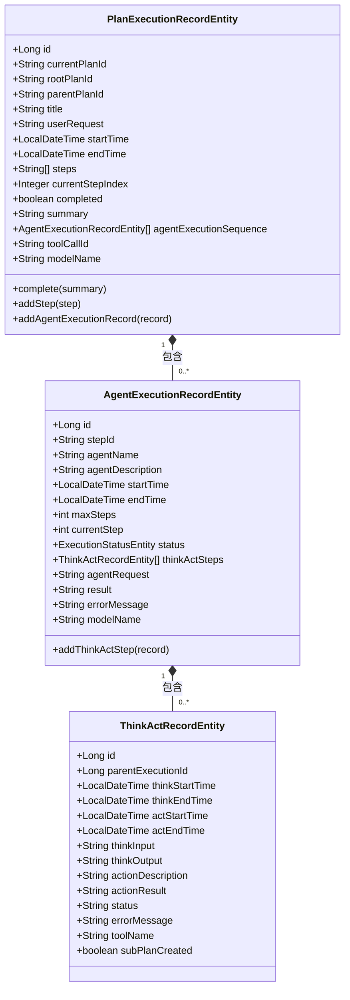
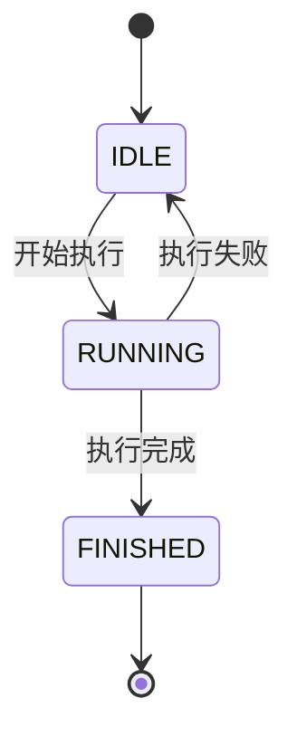
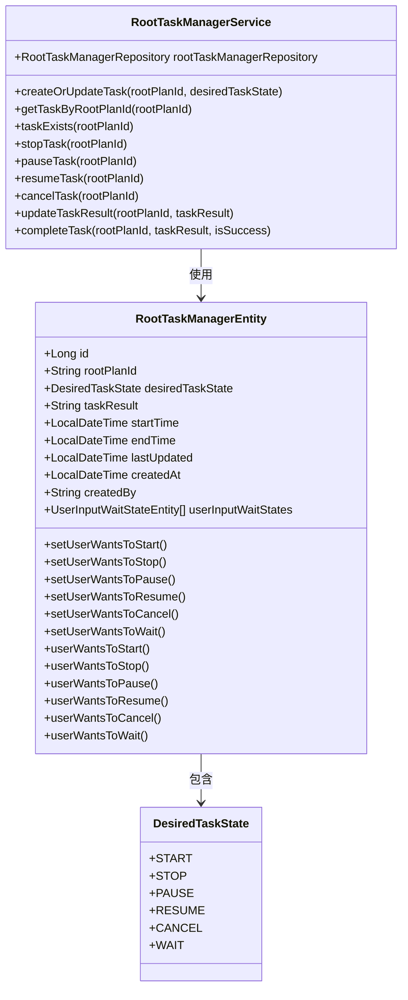
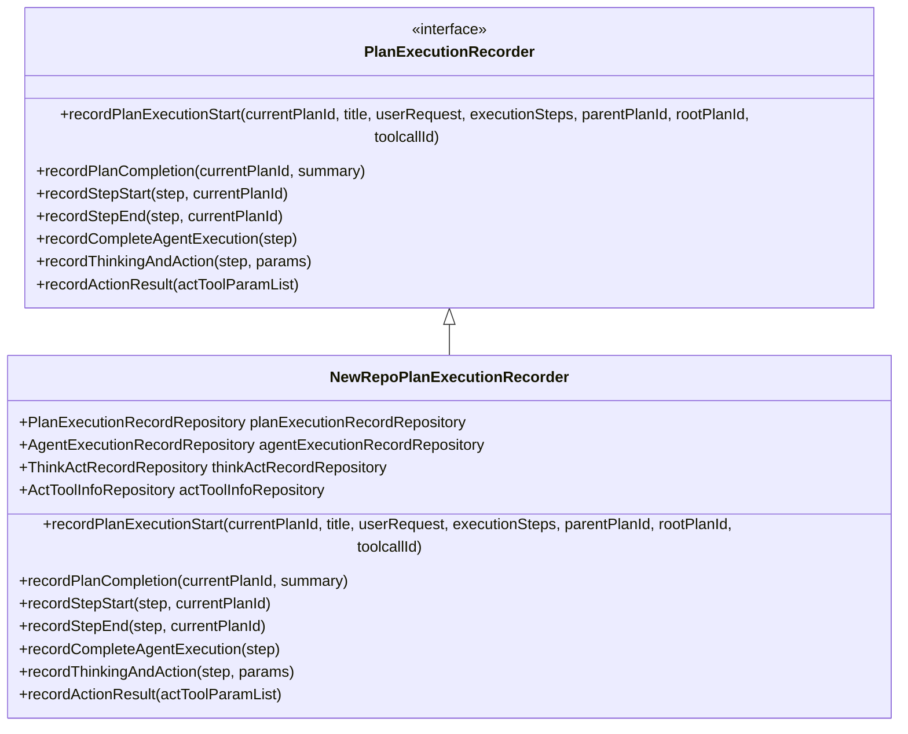
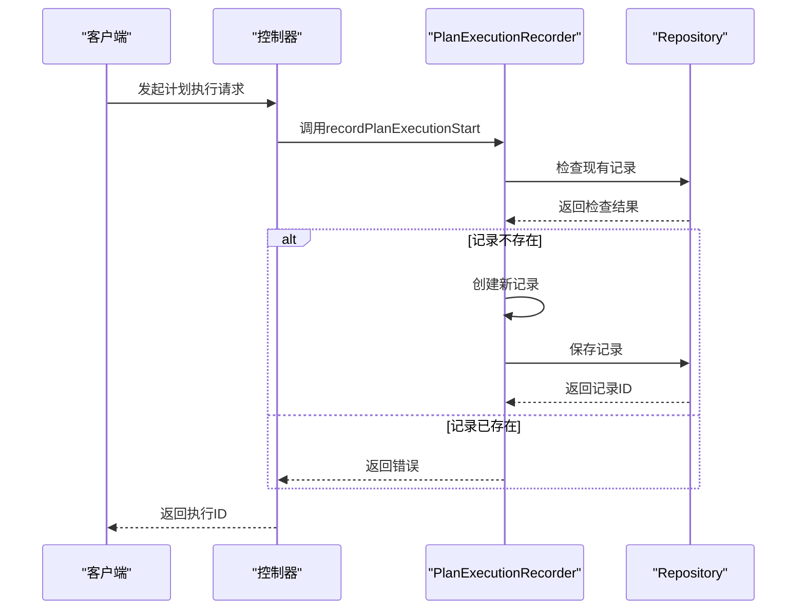
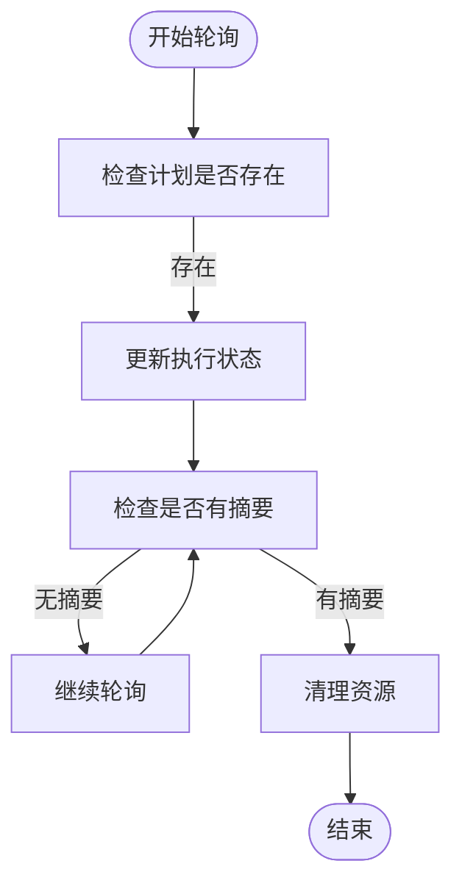
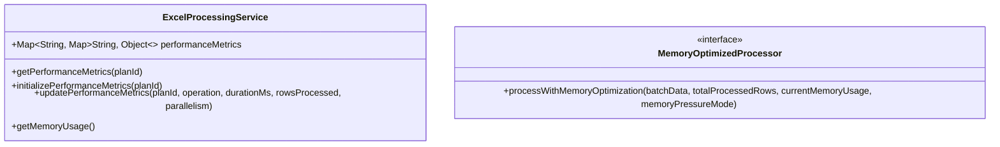
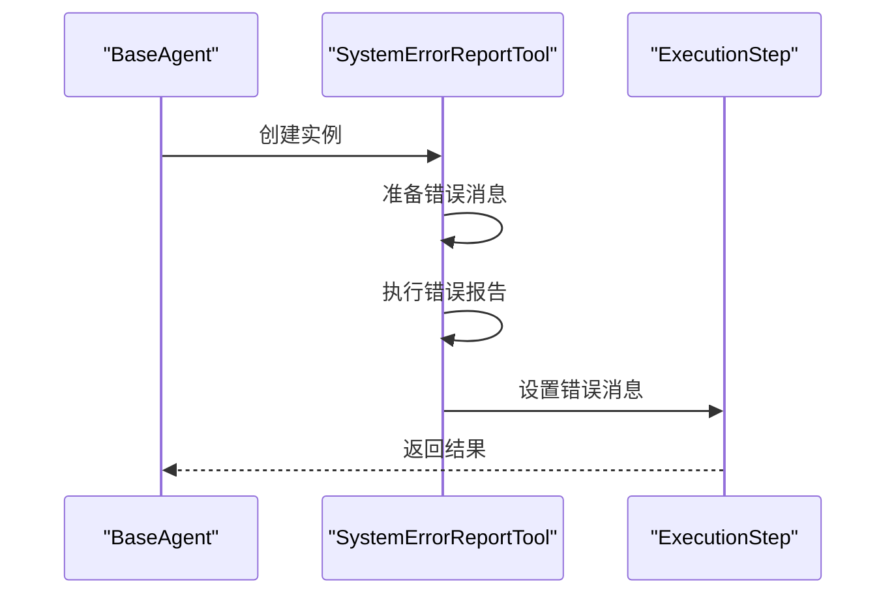

# 监控机制

<cite>
**本文档引用的文件**  
- [PlanExecutionRecordEntity.java](file://src/main/java/com/alibaba/cloud/ai/lynxe/recorder/entity/po/PlanExecutionRecordEntity.java)
- [PlanExecutionRecord.java](file://src/main/java/com/alibaba/cloud/ai/lynxe/recorder/entity/vo/PlanExecutionRecord.java)
- [NewRepoPlanExecutionRecorder.java](file://src/main/java/com/alibaba/cloud/ai/lynxe/recorder/service/NewRepoPlanExecutionRecorder.java)
- [RootTaskManagerService.java](file://src/main/java/com/alibaba/cloud/ai/lynxe/runtime/service/RootTaskManagerService.java)
- [RootTaskManagerEntity.java](file://src/main/java/com/alibaba/cloud/ai/lynxe/runtime/entity/po/RootTaskManagerEntity.java)
- [PlanHierarchyReaderService.java](file://src/main/java/com/alibaba/cloud/ai/lynxe/recorder/service/PlanHierarchyReaderService.java)
- [PlanExecutionRecorder.java](file://src/main/java/com/alibaba/cloud/ai/lynxe/recorder/service/PlanExecutionRecorder.java)
- [usePlanExecution.ts](file://ui-vue3/src/composables/usePlanExecution.ts)
- [useMessageDialog.ts](file://ui-vue3/src/composables/useMessageDialog.ts)
- [useConversationHistory.ts](file://ui-vue3/src/composables/useConversationHistory.ts)
</cite>

## 目录
1. [引言](#引言)
2. [执行记录监控机制](#执行记录监控机制)
3. [执行上下文与任务树管理](#执行上下文与任务树管理)
4. [执行记录持久化与查询](#执行记录持久化与查询)
5. [监控数据采集与更新流程](#监控数据采集与更新流程)
6. [性能监控最佳实践](#性能监控最佳实践)
7. [故障排查与执行优化](#故障排查与执行优化)
8. [总结](#总结)

## 引言

JManus计划执行监控机制为复杂AI代理系统的运行提供了全面的可观测性支持。该机制通过`PlanExecutionRecord`实时记录执行状态，利用`RootTaskManagerService`维护执行上下文和任务树结构，并通过`PlanExecutionRecorder`服务实现执行记录的持久化存储与查询。本文档详细阐述这些核心组件的工作原理，展示监控数据的采集、更新和检索过程，并提供性能监控、故障排查和执行优化的最佳实践。

## 执行记录监控机制

### PlanExecutionRecord状态管理

`PlanExecutionRecord`是JManus系统中用于跟踪和记录计划执行过程的核心数据结构。它通过`startTime`和`endTime`时间戳精确管理执行时长，并通过`executionStatus`状态机控制执行流程的转换。

在实体层，`PlanExecutionRecordEntity`使用`LocalDateTime`类型存储`startTime`和`endTime`，确保时间戳的高精度记录。当计划开始执行时，系统会自动设置`startTime`；当计划完成时，`complete`方法会设置`endTime`并标记`completed`状态为`true`。



**图来源**  
- [PlanExecutionRecordEntity.java](file://src/main/java/com/alibaba/cloud/ai/lynxe/recorder/entity/po/PlanExecutionRecordEntity.java)
- [AgentExecutionRecordEntity.java](file://src/main/java/com/alibaba/cloud/ai/lynxe/recorder/entity/po/AgentExecutionRecordEntity.java)
- [ThinkActRecordEntity.java](file://src/main/java/com/alibaba/cloud/ai/lynxe/recorder/entity/po/ThinkActRecordEntity.java)

### 执行状态转换逻辑

执行状态转换由`ExecutionStatusEntity`枚举控制，包含`IDLE`、`RUNNING`和`FINISHED`三种状态。状态转换遵循严格的流程：从`IDLE`开始，进入`RUNNING`状态表示执行中，最终到达`FINISHED`状态表示执行完成。

`PlanExecutionRecord`的`updateCurrentStepIndex`方法动态维护当前执行步骤索引。该方法根据代理执行序列中各代理的状态来确定当前步骤：优先查找处于`RUNNING`状态的代理；若无运行中代理，则查找第一个未完成的代理；若所有代理均已完成，则将索引设置为最后一步。



**图来源**  
- [ExecutionStatusEntity.java](file://src/main/java/com/alibaba/cloud/ai/lynxe/recorder/entity/po/ExecutionStatusEntity.java)
- [PlanExecutionRecord.java](file://src/main/java/com/alibaba/cloud/ai/lynxe/recorder/entity/vo/PlanExecutionRecord.java)

### 结果聚合机制

`PlanExecutionRecord`通过`summary`和`structureResult`字段实现结果聚合。`summary`字段存储执行的最终摘要信息，通常在计划完成时由`complete`方法设置。`structureResult`字段则用于存储结构化结果数据，便于后续分析和展示。

在代理执行过程中，每个`AgentExecutionRecord`会记录其执行结果`result`和可能的错误信息`errorMessage`。这些信息最终会被聚合到`PlanExecutionRecord`的`summary`中，形成完整的执行报告。

## 执行上下文与任务树管理

### RootTaskManagerService功能

`RootTaskManagerService`是JManus系统中负责管理根任务的核心服务。它维护执行上下文，支持对复杂计划的全局监控。该服务通过`RootTaskManagerEntity`实体跟踪每个根计划的执行状态、开始时间、结束时间和用户输入等待状态。



**图来源**  
- [RootTaskManagerService.java](file://src/main/java/com/alibaba/cloud/ai/lynxe/runtime/service/RootTaskManagerService.java)
- [RootTaskManagerEntity.java](file://src/main/java/com/alibaba/cloud/ai/lynxe/runtime/entity/po/RootTaskManagerEntity.java)

### 任务树结构维护

`RootTaskManagerService`通过`createOrUpdateTask`方法维护任务树结构。当创建或更新任务时，服务会根据`desiredTaskState`设置相应的开始时间和结束时间：

- 当状态为`START`且`startTime`为空时，设置`startTime`为当前时间
- 当状态为`STOP`、`CANCEL`或`PAUSE`且`endTime`为空时，设置`endTime`为当前时间

这种设计确保了任务执行时间的准确记录，为后续的性能分析提供了基础数据。

### 全局监控支持

`RootTaskManagerService`提供了一系列查询方法支持全局监控：

- `getRunningTaskCount()`：获取当前正在运行的任务数量
- `getRunningTaskIds()`：获取所有正在运行的任务ID列表
- `getTaskByRootPlanId()`：根据根计划ID获取任务详情

这些方法使得系统能够实时监控所有计划的执行状态，为资源调度和性能优化提供决策支持。

## 执行记录持久化与查询

### PlanExecutionRecorder服务

`PlanExecutionRecorder`是执行记录的抽象接口，定义了记录和检索计划执行详情的方法。`NewRepoPlanExecutionRecorder`是其实现类，负责具体的持久化操作。



**图来源**  
- [PlanExecutionRecorder.java](file://src/main/java/com/alibaba/cloud/ai/lynxe/recorder/service/PlanExecutionRecorder.java)
- [NewRepoPlanExecutionRecorder.java](file://src/main/java/com/alibaba/cloud/ai/lynxe/recorder/service/NewRepoPlanExecutionRecorder.java)

### 持久化实现

`NewRepoPlanExecutionRecorder`通过`PlanExecutionRecordRepository`将执行记录持久化到数据库。该仓库提供了基于`currentPlanId`、`parentPlanId`和`rootPlanId`的查询方法，支持高效的记录检索。

当记录计划执行开始时，服务首先检查是否已存在相同`currentPlanId`的记录，避免重复创建。如果不存在，则创建新的`PlanExecutionRecordEntity`并设置`startTime`。

### 查询接口

系统提供了丰富的查询接口支持监控数据的检索：

- `findByCurrentPlanId()`：根据当前计划ID查找记录
- `findByParentPlanId()`：查找所有子计划记录
- `findByRootPlanId()`：查找根计划下的所有执行记录

这些接口使得前端能够构建完整的执行历史视图，展示计划的层次结构和执行详情。

## 监控数据采集与更新流程

### 数据采集流程

监控数据的采集始于`recordPlanExecutionStart`方法的调用。该方法接收计划的元数据（如标题、用户请求、执行步骤等）和层次信息（父计划ID、根计划ID），创建新的执行记录。



**图来源**  
- [NewRepoPlanExecutionRecorder.java](file://src/main/java/com/alibaba/cloud/ai/lynxe/recorder/service/NewRepoPlanExecutionRecorder.java)
- [PlanExecutionRecordRepository.java](file://src/main/java/com/alibaba/cloud/ai/lynxe/recorder/repository/PlanExecutionRecordRepository.java)

### 数据更新流程

执行过程中的状态更新通过一系列方法实现：

- `recordStepStart()`和`recordStepEnd()`：记录步骤的开始和结束
- `recordCompleteAgentExecution()`：记录代理执行完成
- `recordPlanCompletion()`：记录计划完成

`recordPlanCompletion`方法首先通过`currentPlanId`查找现有记录，然后调用实体的`complete`方法设置`endTime`、`completed`状态和`summary`。

### 数据检索流程

前端通过`usePlanExecution`组合式函数实现执行状态的实时监控。该函数维护一个`planExecutionRecords`响应式映射，定期轮询计划状态。



**图来源**  
- [usePlanExecution.ts](file://ui-vue3/src/composables/usePlanExecution.ts)
- [useMessageDialog.ts](file://ui-vue3/src/composables/useMessageDialog.ts)

## 性能监控最佳实践

### 执行时长分析

通过`startTime`和`endTime`的差值可以计算计划的总执行时长。系统可以进一步分析各步骤的执行时间，识别耗时最长的步骤。

```java
// 计算执行时长（伪代码）
Duration duration = Duration.between(record.getStartTime(), record.getEndTime());
long seconds = duration.getSeconds();
```

### 资源消耗跟踪

系统可以通过`ExcelProcessingService`中的性能指标收集机制跟踪资源消耗。虽然该服务特定于Excel处理，但其设计模式可推广到其他组件。



**图来源**  
- [ExcelProcessingService.java](file://src/main/java/com/alibaba/cloud/ai/lynxe/tool/excelProcessor/ExcelProcessingService.java)

### 瓶颈识别方法

通过分析`AgentExecutionRecord`的`thinkActSteps`，可以识别代理思考-行动循环中的瓶颈。每个`ThinkActRecord`包含`thinkStartTime`、`thinkEndTime`、`actStartTime`和`actEndTime`，可用于分析思考和行动阶段的时间分布。

## 故障排查与执行优化

### 错误处理机制

系统通过`SystemErrorReportTool`和`ErrorReportTool`实现错误报告。当发生异常时，`BaseAgent`的`handleExceptionWithSystemErrorReport`方法会创建错误报告工具并执行。



**图来源**  
- [BaseAgent.java](file://src/main/java/com/alibaba/cloud/ai/lynxe/agent/BaseAgent.java)
- [SystemErrorReportTool.java](file://src/main/java/com/alibaba/cloud/ai/lynxe/tool/SystemErrorReportTool.java)

### 执行优化策略

基于监控数据，可以实施以下优化策略：

1. **并行化**：识别可并行执行的步骤，提高执行效率
2. **缓存**：对重复执行的计划或步骤结果进行缓存
3. **资源分配**：根据历史执行数据优化资源分配
4. **超时控制**：为长时间运行的步骤设置合理的超时

### 监控数据应用

监控数据不仅用于故障排查，还可用于：

- **性能基准测试**：建立执行性能的基准线
- **容量规划**：根据历史负载预测未来资源需求
- **用户体验优化**：通过分析用户请求模式优化交互设计
- **自动化决策**：基于执行结果自动调整后续计划

## 总结

JManus计划执行监控机制通过`PlanExecutionRecord`、`RootTaskManagerService`和`PlanExecutionRecorder`等核心组件，实现了对复杂AI代理系统执行过程的全面监控。该机制不仅提供了实时的状态跟踪和结果聚合，还支持深入的性能分析和故障排查。通过合理利用监控数据，可以持续优化系统性能，提升用户体验。

**本文档引用的文件**  
- [PlanExecutionRecordEntity.java](file://src/main/java/com/alibaba/cloud/ai/lynxe/recorder/entity/po/PlanExecutionRecordEntity.java)
- [PlanExecutionRecord.java](file://src/main/java/com/alibaba/cloud/ai/lynxe/recorder/entity/vo/PlanExecutionRecord.java)
- [NewRepoPlanExecutionRecorder.java](file://src/main/java/com/alibaba/cloud/ai/lynxe/recorder/service/NewRepoPlanExecutionRecorder.java)
- [RootTaskManagerService.java](file://src/main/java/com/alibaba/cloud/ai/lynxe/runtime/service/RootTaskManagerService.java)
- [RootTaskManagerEntity.java](file://src/main/java/com/alibaba/cloud/ai/lynxe/runtime/entity/po/RootTaskManagerEntity.java)
- [PlanHierarchyReaderService.java](file://src/main/java/com/alibaba/cloud/ai/lynxe/recorder/service/PlanHierarchyReaderService.java)
- [PlanExecutionRecorder.java](file://src/main/java/com/alibaba/cloud/ai/lynxe/recorder/service/PlanExecutionRecorder.java)
- [usePlanExecution.ts](file://ui-vue3/src/composables/usePlanExecution.ts)
- [useMessageDialog.ts](file://ui-vue3/src/composables/useMessageDialog.ts)
- [useConversationHistory.ts](file://ui-vue3/src/composables/useConversationHistory.ts)