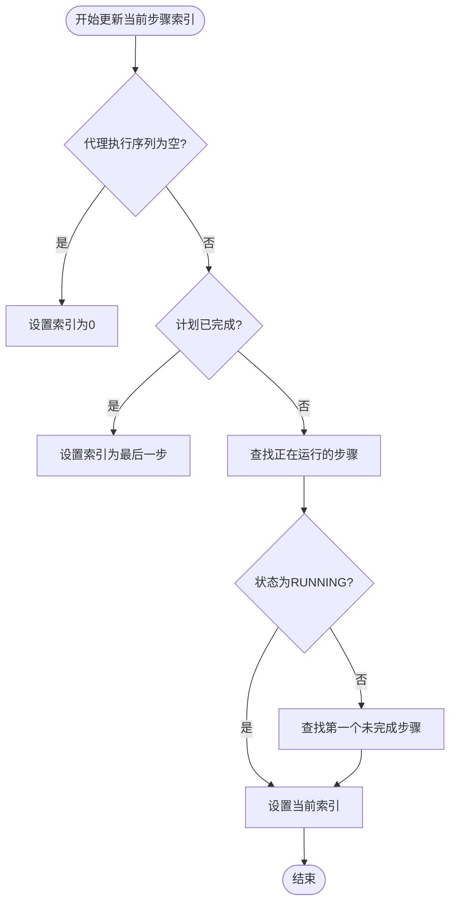
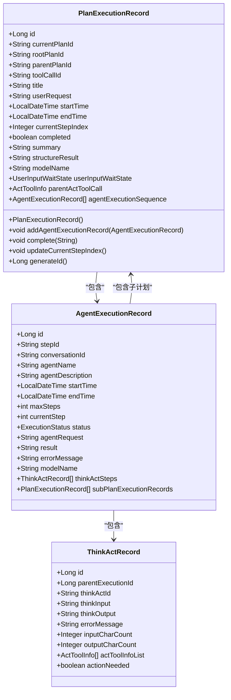
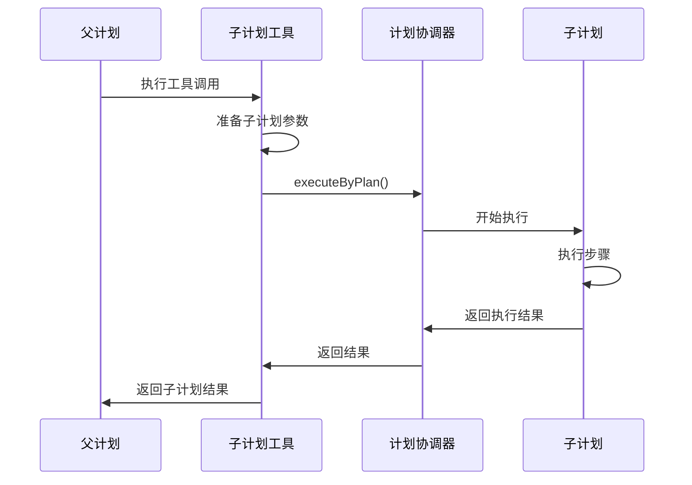
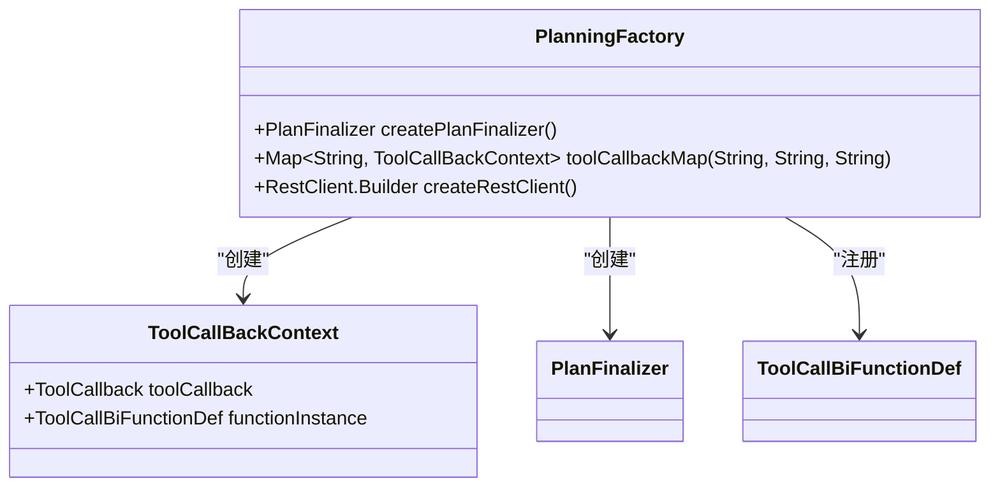
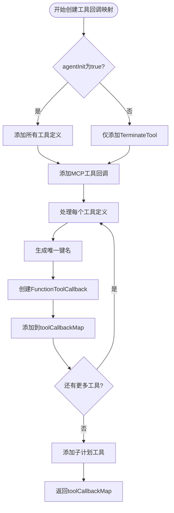
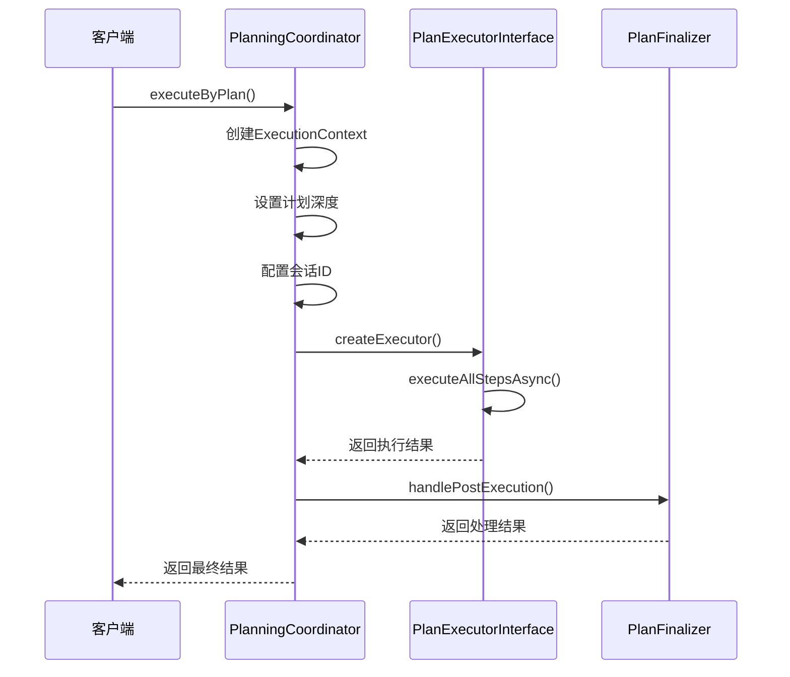
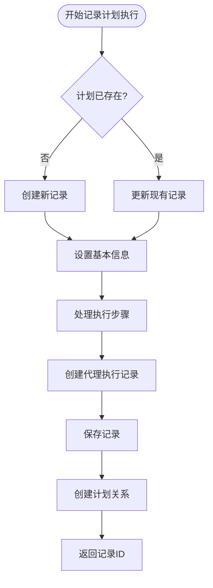

# 计划执行

<cite>
**本文档引用的文件**   
- [PlanExecutionRecord.java](file://src/main/java/com/alibaba/cloud/ai/lynxe/recorder/entity/vo/PlanExecutionRecord.java)
- [PlanExecutionRecordEntity.java](file://src/main/java/com/alibaba/cloud/ai/lynxe/recorder/entity/po/PlanExecutionRecordEntity.java)
- [PlanningFactory.java](file://src/main/java/com/alibaba/cloud/ai/lynxe/planning/PlanningFactory.java)
- [PlanningCoordinator.java](file://src/main/java/com/alibaba/cloud/ai/lynxe/runtime/service/PlanningCoordinator.java)
- [NewRepoPlanExecutionRecorder.java](file://src/main/java/com/alibaba/cloud/ai/lynxe/recorder/service/NewRepoPlanExecutionRecorder.java)
- [SubplanToolWrapper.java](file://src/main/java/com/alibaba/cloud/ai/lynxe/subplan/model/vo/SubplanToolWrapper.java)
- [AgentExecutionRecord.java](file://src/main/java/com/alibaba/cloud/ai/lynxe/recorder/entity/vo/AgentExecutionRecord.java)
</cite>

## 目录
1. [引言](#引言)
2. [核心数据结构分析](#核心数据结构分析)
3. [计划层次结构与父子关系](#计划层次结构与父子关系)
4. [计划创建与初始化](#计划创建与初始化)
5. [计划执行协调机制](#计划执行协调机制)
6. [执行记录的生命周期管理](#执行记录的生命周期管理)
7. [监控与性能优化](#监控与性能优化)
8. [结论](#结论)

## 引言

JManus计划执行模型是一个复杂的系统，用于跟踪和记录智能代理（Agent）执行流程的详细信息。该模型的核心是`PlanExecutionRecord`数据结构，它不仅记录了计划的基本执行信息，还维护了完整的执行过程、状态和结果。本文档将深入分析该模型的各个组成部分，包括核心数据结构、计划层次结构、创建与初始化机制、执行协调流程以及执行记录的生命周期管理。

**本文档引用的文件**
- [PlanExecutionRecord.java](file://src/main/java/com/alibaba/cloud/ai/lynxe/recorder/entity/vo/PlanExecutionRecord.java#L1-L337)
- [PlanExecutionRecordEntity.java](file://src/main/java/com/alibaba/cloud/ai/lynxe/recorder/entity/po/PlanExecutionRecordEntity.java#L1-L283)

## 核心数据结构分析

`PlanExecutionRecord`是JManus计划执行模型的核心数据结构，用于全面跟踪和记录计划执行的详细信息。该数据结构被设计为包含四个主要部分：基本信息、计划结构、执行数据和执行结果。

### 标识信息

标识信息字段用于唯一确定和关联计划执行记录：

- **currentPlanId**: 当前计划的唯一标识符，是计划执行记录的核心标识。
- **rootPlanId**: 子计划的根计划ID（主计划为空），用于建立计划的层次结构。
- **parentPlanId**: 子计划的父计划ID（根计划为空），用于直接关联父子计划关系。
- **toolCallId**: 触发此计划的工具调用ID（针对子计划），用于追踪计划的触发源。

这些字段共同构成了计划的标识体系，使得系统能够准确地追踪和管理复杂的计划执行流程。

### 执行状态

执行状态字段用于跟踪计划的执行进度和完成情况：

- **completed**: 布尔值，表示计划是否已完成。
- **currentStepIndex**: 当前正在执行的步骤索引，动态反映执行进度。
- **executionStatus**: 通过`currentStepIndex`和`agentExecutionSequence`的交互动态更新，反映当前执行状态。

`PlanExecutionRecord`类中的`updateCurrentStepIndex()`方法实现了智能的状态更新逻辑。该方法会分析代理执行序列的状态，确定当前正在运行的步骤。如果所有步骤都已完成，则将索引设置为最后一步。这种设计确保了执行状态的实时性和准确性。

**图表来源**
- [PlanExecutionRecord.java](file://src/main/java/com/alibaba/cloud/ai/lynxe/recorder/entity/vo/PlanExecutionRecord.java#L154-L186)

**本节来源**
- [PlanExecutionRecord.java](file://src/main/java/com/alibaba/cloud/ai/lynxe/recorder/entity/vo/PlanExecutionRecord.java#L1-L337)
- [PlanExecutionRecordEntity.java](file://src/main/java/com/alibaba/cloud/ai/lynxe/recorder/entity/po/PlanExecutionRecordEntity.java#L1-L283)

### 执行内容

执行内容字段记录了计划执行过程中的详细信息：

- **agentExecutionSequence**: 维护代理执行序列的列表，按执行顺序记录每个智能代理的执行记录。
- **steps**: 计划步骤列表，记录了计划的执行步骤。
- **userRequest**: 用户的原始请求，保留了计划执行的上下文信息。

`agentExecutionSequence`字段是执行内容的核心，它通过`addAgentExecutionRecord()`方法动态添加代理执行记录，并在添加时自动调用`updateCurrentStepIndex()`方法更新当前步骤索引，确保执行进度的实时同步。

### 用户交互

用户交互字段支持计划执行过程中的用户输入和等待状态：

- **userInputWaitState**: 存储用户输入等待状态，用于处理需要用户交互的场景。
- **parentActToolCall**: 触发此子计划的父工具调用信息，用于子计划详情显示。

这些字段使得系统能够处理复杂的用户交互场景，在需要时暂停执行并等待用户输入，从而实现更灵活的计划执行流程。

### 结果数据

结果数据字段存储了计划执行的最终结果和输出：

- **summary**: 执行摘要，提供计划执行的概要信息。
- **structureResult**: 结构化结果，存储计划执行的结构化输出。
- **modelName**: 实际调用的模型名称，记录执行过程中使用的AI模型。
- **endTime**: 执行结束时间戳，与`startTime`共同计算执行时长。

`complete()`方法负责设置执行完成状态，它会设置结束时间、完成标志和摘要信息，并调用`updateCurrentStepIndex()`方法确保步骤索引的正确性。

**图表来源**
- [PlanExecutionRecord.java](file://src/main/java/com/alibaba/cloud/ai/lynxe/recorder/entity/vo/PlanExecutionRecord.java#L46-L337)
- [AgentExecutionRecord.java](file://src/main/java/com/alibaba/cloud/ai/lynxe/recorder/entity/vo/AgentExecutionRecord.java#L55-L318)

**本节来源**
- [PlanExecutionRecord.java](file://src/main/java/com/alibaba/cloud/ai/lynxe/recorder/entity/vo/PlanExecutionRecord.java#L1-L337)
- [AgentExecutionRecord.java](file://src/main/java/com/alibaba/cloud/ai/lynxe/recorder/entity/vo/AgentExecutionRecord.java#L1-L318)

## 计划层次结构与父子关系

JManus计划执行模型支持复杂的计划层次结构，通过父子计划关系实现任务的分解和组合执行。这种层次结构使得系统能够处理复杂的业务场景，将大任务分解为多个子任务并行或串行执行。

### 层次结构设计

计划的层次结构通过`currentPlanId`、`rootPlanId`和`parentPlanId`三个字段建立：

- **Root Plan (根计划)**: 最顶层的计划，`rootPlanId`和`currentPlanId`相同，`parentPlanId`为空。
- **Sub Plan (子计划)**: 由父计划触发的计划，`rootPlanId`指向根计划，`parentPlanId`指向直接父计划。

这种设计允许系统构建任意深度的计划树结构，每个计划都可以作为父计划触发多个子计划，形成复杂的执行网络。

### 子计划触发机制

子计划的触发机制通过`SubplanToolWrapper`类实现。当一个计划中的工具调用需要执行子计划时，系统会创建一个`SubplanToolWrapper`实例，该实例包装了子计划的配置信息。

**图表来源**
- [SubplanToolWrapper.java](file://src/main/java/com/alibaba/cloud/ai/lynxe/subplan/model/vo/SubplanToolWrapper.java#L288-L380)
- [PlanningCoordinator.java](file://src/main/java/com/alibaba/cloud/ai/lynxe/runtime/service/PlanningCoordinator.java#L76-L179)

### 执行流程

子计划的执行流程如下：
1. 父计划在执行过程中触发工具调用
2. `SubplanToolWrapper`接收到调用请求，提取`toolCallId`
3. 使用`PlanIdDispatcher`生成新的子计划ID
4. 通过`PlanningCoordinator`执行子计划
5. 子计划执行完成后，结果返回给父计划

`SubplanToolWrapper`的`executeSubplanWithToolCallIdAsync()`方法实现了异步执行逻辑，返回`CompletableFuture`以避免阻塞主线程，这对于处理复杂的并行执行场景至关重要。

**本节来源**
- [SubplanToolWrapper.java](file://src/main/java/com/alibaba/cloud/ai/lynxe/subplan/model/vo/SubplanToolWrapper.java#L1-L393)
- [PlanningCoordinator.java](file://src/main/java/com/alibaba/cloud/ai/lynxe/runtime/service/PlanningCoordinator.java#L1-L182)

## 计划创建与初始化

计划的创建和初始化由`PlanningFactory`类负责，该类作为计划执行的工厂，负责创建和配置计划执行所需的各种组件。

### PlanningFactory角色

`PlanningFactory`是计划创建的核心组件，其主要职责包括：

- 创建`PlanFinalizer`实例，用于处理计划执行后的收尾工作
- 构建工具回调映射（`toolCallbackMap`），为计划提供可用的工具集
- 协调各种服务组件的注入和配置

**图表来源**
- [PlanningFactory.java](file://src/main/java/com/alibaba/cloud/ai/lynxe/planning/PlanningFactory.java#L106-L408)

### 工具回调映射

`toolCallbackMap()`方法是`PlanningFactory`的核心功能，它创建了一个包含所有可用工具的映射。该方法的执行流程如下：

1. 根据配置初始化工具定义列表
2. 为每个工具创建`FunctionToolCallback`
3. 使用服务组（serviceGroup）和索引生成唯一键名
4. 将工具回调上下文存入映射

**图表来源**
- [PlanningFactory.java](file://src/main/java/com/alibaba/cloud/ai/lynxe/planning/PlanningFactory.java#L240-L374)

### 子计划工具注册

`PlanningFactory`还负责注册子计划工具。通过`SubplanToolService`的`createSubplanToolCallbacks()`方法，系统能够动态地为当前计划创建子计划工具回调。这种设计使得子计划的创建和管理更加灵活，能够根据运行时上下文动态调整。

**本节来源**
- [PlanningFactory.java](file://src/main/java/com/alibaba/cloud/ai/lynxe/planning/PlanningFactory.java#L106-L408)
- [SubplanToolService.java](file://src/main/java/com/alibaba/cloud/ai/lynxe/subplan/service/SubplanToolService.java#L63-L155)

## 计划执行协调机制

计划执行的协调由`PlanningCoordinator`类负责，该类作为计划执行的中枢，协调计划的执行流程和状态管理。

### 核心职责

`PlanningCoordinator`的主要职责包括：

- 接收计划执行请求
- 创建执行上下文
- 选择合适的执行器
- 协调计划的完整执行流程
- 处理执行后的收尾工作

### 执行流程

`PlanningCoordinator`的`executeByPlan()`方法实现了完整的计划执行流程：

**图表来源**
- [PlanningCoordinator.java](file://src/main/java/com/alibaba/cloud/ai/lynxe/runtime/service/PlanningCoordinator.java#L76-L179)

### 执行上下文

`ExecutionContext`是计划执行的核心数据容器，它包含了执行计划所需的所有上下文信息：

- **currentPlanId**: 当前计划ID
- **rootPlanId**: 根计划ID
- **planDepth**: 计划在执行层次中的深度
- **conversationId**: 会话ID，用于会话记忆
- **needSummary**: 是否需要生成摘要

执行上下文的设计使得计划执行具有良好的隔离性和可追溯性，每个计划都在独立的上下文中执行，避免了状态污染。

**本节来源**
- [PlanningCoordinator.java](file://src/main/java/com/alibaba/cloud/ai/lynxe/runtime/service/PlanningCoordinator.java#L1-L182)
- [ExecutionContext.java](file://src/main/java/com/alibaba/cloud/ai/lynxe/runtime/entity/vo/ExecutionContext.java)

## 执行记录的生命周期管理

计划执行记录的生命周期管理由`NewRepoPlanExecutionRecorder`类负责，该类实现了`PlanExecutionRecorder`接口，提供了完整的记录管理功能。

### 生命周期阶段

计划执行记录的生命周期包括以下几个阶段：

1. **创建阶段**: 通过`recordPlanExecutionStart()`方法创建新的执行记录
2. **执行阶段**: 通过`recordStepStart()`和`recordStepEnd()`记录步骤执行
3. **完成阶段**: 通过`recordPlanCompletion()`标记计划完成

### 记录创建

`recordPlanExecutionStart()`方法负责创建新的计划执行记录：

**图表来源**
- [NewRepoPlanExecutionRecorder.java](file://src/main/java/com/alibaba/cloud/ai/lynxe/recorder/service/NewRepoPlanExecutionRecorder.java#L75-L156)

### 时间戳管理

时间戳管理是执行记录的重要组成部分：

- **startTime**: 在`recordPlanExecutionStart()`方法中设置为`LocalDateTime.now()`
- **endTime**: 在`recordPlanCompletion()`方法中设置为`LocalDateTime.now()`

这种设计确保了执行时间的准确性，为性能分析和监控提供了可靠的数据基础。

### 动态更新

执行状态的动态更新通过`updateCurrentStepIndex()`方法实现。该方法在添加代理执行记录或完成计划时被调用，确保当前步骤索引始终反映最新的执行状态。

**本节来源**
- [NewRepoPlanExecutionRecorder.java](file://src/main/java/com/alibaba/cloud/ai/lynxe/recorder/service/NewRepoPlanExecutionRecorder.java#L1-L857)
- [PlanExecutionRecorder.java](file://src/main/java/com/alibaba/cloud/ai/lynxe/recorder/service/PlanExecutionRecorder.java#L1-L242)

## 监控与性能优化

有效的监控和性能优化是确保计划执行系统稳定高效运行的关键。

### 监控最佳实践

1. **实时状态监控**: 通过`currentStepIndex`和`completed`字段实时监控计划执行进度
2. **执行时间分析**: 利用`startTime`和`endTime`计算执行时长，识别性能瓶颈
3. **错误追踪**: 通过`errorMessage`字段追踪执行过程中的错误信息
4. **资源使用监控**: 监控模型调用和工具使用情况，优化资源分配

### 性能优化建议

1. **异步执行**: 对于可能耗时的操作，使用异步执行模式，避免阻塞主线程
2. **批量处理**: 对于相似的执行步骤，考虑批量处理以减少开销
3. **缓存机制**: 对于重复的计划执行，考虑引入缓存机制
4. **资源限制**: 设置合理的执行步骤限制，防止无限循环
5. **并发控制**: 对于并行执行的子计划，合理控制并发数量，避免资源耗尽

### 执行效率优化

通过分析`agentExecutionSequence`的执行模式，可以识别并优化执行效率。例如，对于频繁执行的相似步骤，可以考虑将其抽象为可复用的子计划模板。

**本节来源**
- [PlanExecutionRecord.java](file://src/main/java/com/alibaba/cloud/ai/lynxe/recorder/entity/vo/PlanExecutionRecord.java#L1-L337)
- [NewRepoPlanExecutionRecorder.java](file://src/main/java/com/alibaba/cloud/ai/lynxe/recorder/service/NewRepoPlanExecutionRecorder.java#L1-L857)

## 结论

JManus计划执行模型通过精心设计的`PlanExecutionRecord`核心数据结构，实现了对复杂计划执行流程的全面跟踪和管理。该模型通过标识信息、执行状态、执行内容、用户交互和结果数据五个维度，完整地记录了计划执行的各个方面。

计划的层次结构设计使得系统能够处理复杂的任务分解和组合执行，通过父子计划关系实现灵活的执行流程。`PlanningFactory`作为计划创建的工厂，负责初始化计划执行所需的各种组件，而`PlanningCoordinator`则作为执行协调中枢，确保计划的顺利执行。

执行记录的生命周期管理通过`NewRepoPlanExecutionRecorder`实现，提供了从创建到完成的完整管理功能。通过合理的监控和性能优化策略，可以确保计划执行系统的高效稳定运行。

该模型的设计体现了良好的模块化和可扩展性，为处理复杂的AI代理执行场景提供了坚实的基础。