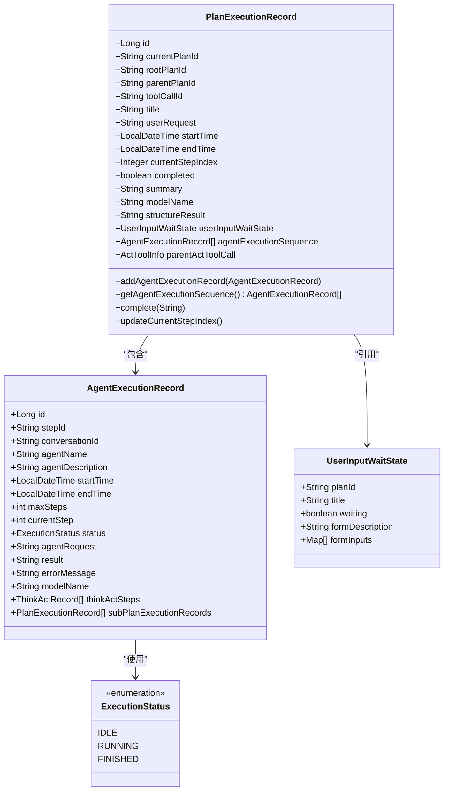
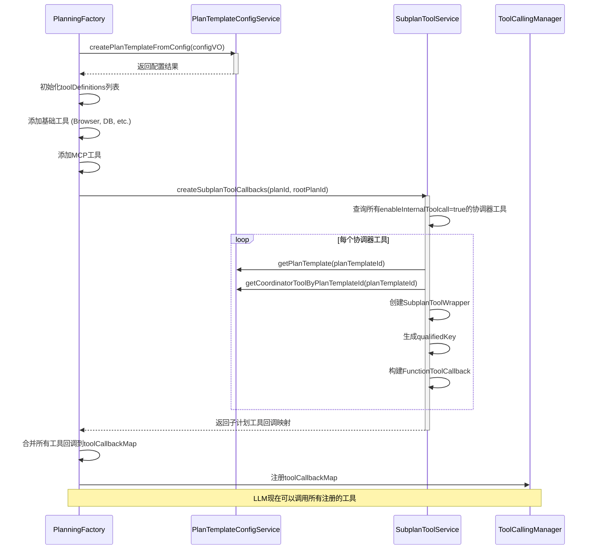

# 计划模型

<cite>
**本文档引用的文件**   
- [PlanExecutionRecord.java](file://src/main/java/com/alibaba/cloud/ai/lynxe/recorder/entity/vo/PlanExecutionRecord.java)
- [PlanExecutionRecordEntity.java](file://src/main/java/com/alibaba/cloud/ai/lynxe/recorder/entity/po/PlanExecutionRecordEntity.java)
- [PlanningFactory.java](file://src/main/java/com/alibaba/cloud/ai/lynxe/planning/PlanningFactory.java)
- [PlanTemplateConfigVO.java](file://src/main/java/com/alibaba/cloud/ai/lynxe/planning/model/vo/PlanTemplateConfigVO.java)
- [PlanTemplateConfigService.java](file://src/main/java/com/alibaba/cloud/ai/lynxe/planning/service/PlanTemplateConfigService.java)
- [SubplanToolService.java](file://src/main/java/com/alibaba/cloud/ai/lynxe/subplan/service/SubplanToolService.java)
- [UserInputWaitState.java](file://src/main/java/com/alibaba/cloud/ai/lynxe/runtime/entity/vo/UserInputWaitState.java)
- [AgentExecutionRecord.java](file://src/main/java/com/alibaba/cloud/ai/lynxe/recorder/entity/vo/AgentExecutionRecord.java)
</cite>

## 目录
1. [引言](#引言)
2. [计划执行记录实体设计](#计划执行记录实体设计)
3. [计划工厂与模板配置](#计划工厂与模板配置)
4. [计划模型构建与父子关系](#计划模型构建与父子关系)
5. [数据交互模式分析](#数据交互模式分析)
6. [结论](#结论)

## 引言
JManus计划模型是系统核心的执行框架，负责管理复杂任务的分解、执行和状态跟踪。该模型通过PlanExecutionRecord实体记录执行过程，利用PlanningFactory工厂基于模板配置创建执行计划实例，并支持代理执行与工具调用的深度集成。本文档将深入解析其核心组件的设计与交互机制。

## 计划执行记录实体设计

PlanExecutionRecord实体类是整个计划执行过程的核心数据载体，其设计精巧地将计划的层次结构、执行状态、上下文数据和人机交互信息整合在一起。该类在`src/main/java/com/alibaba/cloud/ai/lynxe/recorder/entity/vo/PlanExecutionRecord.java`中定义，其数据结构主要分为四个部分。

**标识字段**用于维护计划的层次结构关系。`currentPlanId`是当前计划的唯一标识符；`rootPlanId`用于标识子计划的根计划ID（主计划为null）；`parentPlanId`则标识了子计划的直接父计划ID（根计划为null）。这三个字段共同构建了一个树状的计划执行层级，使得系统能够清晰地追踪任意计划在其执行树中的位置。

**状态字段**实时反映执行进度。`completed`布尔值标记计划是否已完成；`currentStepIndex`整数表示当前正在执行的步骤索引；`executionStatus`枚举（在`ExecutionStatus.java`中定义）则提供了更细粒度的状态，如IDLE（空闲）、RUNNING（运行中）、FINISHED（已完成）。`updateCurrentStepIndex()`方法会根据`agentExecutionSequence`中各代理的执行状态动态更新`currentStepIndex`，确保状态的准确性。

**内容字段**存储了执行的上下文和结果数据。`agentExecutionSequence`是一个`AgentExecutionRecord`对象列表，按顺序记录了每个智能代理的执行过程，是重构整个执行流程的关键。`structureResult`字符串字段则用于存储计划执行的最终结构化结果。

**交互字段**`userInputWaitState`（定义于`UserInputWaitState.java`）支持人机协同。当计划执行需要用户输入时，此字段会被填充，包含表单描述、输入项等信息，使系统能够暂停执行并等待用户响应，从而实现灵活的人机协作模式。



**图源**
- [PlanExecutionRecord.java](file://src/main/java/com/alibaba/cloud/ai/lynxe/recorder/entity/vo/PlanExecutionRecord.java)
- [AgentExecutionRecord.java](file://src/main/java/com/alibaba/cloud/ai/lynxe/recorder/entity/vo/AgentExecutionRecord.java)
- [UserInputWaitState.java](file://src/main/java/com/alibaba/cloud/ai/lynxe/runtime/entity/vo/UserInputWaitState.java)

**本节源码**
- [PlanExecutionRecord.java](file://src/main/java/com/alibaba/cloud/ai/lynxe/recorder/entity/vo/PlanExecutionRecord.java)
- [UserInputWaitState.java](file://src/main/java/com/alibaba/cloud/ai/lynxe/runtime/entity/vo/UserInputWaitState.java)

## 计划工厂与模板配置

`PlanningFactory`是创建和初始化执行计划实例的核心工厂类，位于`src/main/java/com/alibaba/cloud/ai/lynxe/planning/PlanningFactory.java`。它通过`toolCallbackMap`方法，基于`PlanTemplateConfigVO`的配置，动态地为当前计划实例注册所有可用的工具回调。

`PlanTemplateConfigVO`（位于`src/main/java/com/alibaba/cloud/ai/lynxe/planning/model/vo/PlanTemplateConfigVO.java`）是计划模板配置的值对象，它定义了计划的结构和行为。其核心参数包括：
- `planTemplateId`：计划模板的唯一ID。
- `title`：计划的标题。
- `steps`：一个`StepConfig`对象列表，每个`StepConfig`定义了计划的单个步骤，包含`stepRequirement`（步骤要求）、`agentName`（代理名称）和`selectedToolKeys`（选中的工具键）。
- `toolConfig`：`ToolConfigVO`对象，包含工具的描述、是否启用内部工具调用等配置。
- `accessLevel`：`PlanTemplateAccessLevel`枚举，定义了模板的访问级别（可编辑或只读）。

`PlanningFactory`的`toolCallbackMap`方法接收`planId`、`rootPlanId`和`expectedReturnInfo`等参数，其初始化逻辑如下：
1.  **创建工具定义列表**：根据`agentInit`标志，创建一个包含所有基础工具（如`BrowserUseTool`、`DatabaseReadTool`、`TerminateTool`等）的`toolDefinitions`列表。
2.  **集成MCP工具**：从`mcpService`获取所有MCP（Model Context Protocol）工具回调，并将其包装为`McpTool`加入列表。
3.  **注册子计划工具**：调用`SubplanToolService`的`createSubplanToolCallbacks`方法，为所有可用的子计划模板创建工具包装器并注册。
4.  **构建工具回调映射**：遍历`toolDefinitions`列表，为每个工具创建一个`FunctionToolCallback`。这里使用了“qualified key”机制（如`toolName*index*`），通过`ServiceGroupIndexService`为同名工具分配唯一索引，确保LLM调用时的准确性。
5.  **返回映射**：最终返回一个`Map<String, ToolCallBackContext>`，该映射被`ToolCallingManager`使用，使LLM能够调用这些工具。



**图源**
- [PlanningFactory.java](file://src/main/java/com/alibaba/cloud/ai/lynxe/planning/PlanningFactory.java)
- [PlanTemplateConfigService.java](file://src/main/java/com/alibaba/cloud/ai/lynxe/planning/service/PlanTemplateConfigService.java)
- [SubplanToolService.java](file://src/main/java/com/alibaba/cloud/ai/lynxe/subplan/service/SubplanToolService.java)

**本节源码**
- [PlanningFactory.java](file://src/main/java/com/alibaba/cloud/ai/lynxe/planning/PlanningFactory.java)
- [PlanTemplateConfigVO.java](file://src/main/java/com/alibaba/cloud/ai/lynxe/planning/model/vo/PlanTemplateConfigVO.java)
- [PlanTemplateConfigService.java](file://src/main/java/com/alibaba/cloud/ai/lynxe/planning/service/PlanTemplateConfigService.java)

## 计划模型构建与父子关系

计划模型的构建始于一个主计划（Main Plan），它通过调用子计划工具（Sub-plan Tool）来触发子计划（Sub-plan）的创建，从而形成一个父子关联的执行树。

**父子计划的关联机制**通过`PlanExecutionRecord`的字段实现：
- 当一个子计划被创建时，它的`parentPlanId`会被设置为触发它的父计划的`currentPlanId`。
- 它的`rootPlanId`则继承自父计划的`rootPlanId`，如果父计划本身就是根计划，则`rootPlanId`等于其自身的`currentPlanId`。
- 子计划的`toolCallId`字段会记录触发它的工具调用ID，这为追溯执行源头提供了依据。

**子计划的触发条件**如下：
1.  **配置启用**：在`PlanTemplateConfigVO`中，`toolConfig.enableInternalToolcall`必须为`true`，这表示该计划模板可以作为内部工具被调用。
2.  **工具注册**：`SubplanToolService`会定期扫描数据库中所有`enableInternalToolcall=true`的`FuncAgentToolEntity`，并将它们包装成`SubplanToolWrapper`，通过`PlanningFactory`注册到当前执行环境的工具列表中。
3.  **LLM调用**：在父计划的执行过程中，LLM根据任务需求，选择并调用已注册的子计划工具（如`"数据分析*1*"`）。
4.  **执行触发**：`SubplanToolWrapper`的`apply`方法被调用，它会使用`PlanningCoordinator`来启动一个新的计划执行流程，从而创建一个全新的`PlanExecutionRecord`实例。

这种机制允许系统将复杂的任务分解为多个可复用的子任务模块，实现了高度的灵活性和可扩展性。

```mermaid
flowchart TD
A[主计划 (Main Plan)] --> |调用子计划工具| B[子计划 1 (Sub-plan 1)]
A --> |调用子计划工具| C[子计划 2 (Sub-plan 2)]
B --> |调用子计划工具| D[子计划 1.1 (Sub-plan 1.1)]
B --> |调用子计划工具| E[子计划 1.2 (Sub-plan 1.2)]
style A fill:#4CAF50,stroke:#388E3C
style B fill:#2196F3,stroke:#1976D2
style C fill:#2196F3,stroke:#1976D2
style D fill:#FF9800,stroke:#F57C00
style E fill:#FF9800,stroke:#F57C00
subgraph "计划执行树"
A
B
C
D
E
end
classDef mainPlan fill:#4CAF50,stroke:#388E3C;
classDef subPlan fill:#2196F3,stroke:#1976D2;
classDef subSubPlan fill:#FF9800,stroke:#F57C00;
class A mainPlan
class B,C subPlan
class D,E subSubPlan
```

**图源**
- [PlanExecutionRecord.java](file://src/main/java/com/alibaba/cloud/ai/lynxe/recorder/entity/vo/PlanExecutionRecord.java)
- [SubplanToolService.java](file://src/main/java/com/alibaba/cloud/ai/lynxe/subplan/service/SubplanToolService.java)

**本节源码**
- [PlanExecutionRecord.java](file://src/main/java/com/alibaba/cloud/ai/lynxe/recorder/entity/vo/PlanExecutionRecord.java)
- [SubplanToolService.java](file://src/main/java/com/alibaba/cloud/ai/lynxe/subplan/service/SubplanToolService.java)

## 数据交互模式分析

计划模型与代理执行、工具调用之间的数据交互是一个紧密耦合的闭环。

1.  **计划到代理**：`PlanExecutionRecord`中的`steps`列表定义了执行流程。`AbstractPlanExecutor`会根据`currentStepIndex`，将`steps`中对应的`stepRequirement`和上下文信息传递给指定的`BaseAgent`进行执行。
2.  **代理到计划**：`BaseAgent`执行完毕后，会生成一个`AgentExecutionRecord`，其中包含执行结果、状态和详细的`thinkActSteps`。该记录通过`PlanExecutionRecorder`的`addAgentExecutionRecord`方法被添加到`PlanExecutionRecord`的`agentExecutionSequence`中，并触发`currentStepIndex`的更新。
3.  **计划到工具**：当LLM决定调用一个工具时，`ToolCallingManager`会根据`toolCallbackMap`找到对应的`FunctionToolCallback`，并将参数传递给工具的`apply`方法。对于子计划工具，参数会包含用户输入和上下文。
4.  **工具到计划**：工具执行完成后，返回一个`ToolExecuteResult`。对于普通工具，结果会作为LLM的上下文继续推理。对于子计划工具，其`apply`方法会启动一个新的计划执行流程，新计划的`PlanExecutionRecord`会通过`parentActToolCall`字段与父计划的工具调用关联起来。

这种模式确保了所有执行数据都被集中记录和管理，为监控、调试和结果追溯提供了坚实的基础。

**本节源码**
- [PlanExecutionRecord.java](file://src/main/java/com/alibaba/cloud/ai/lynxe/recorder/entity/vo/PlanExecutionRecord.java)
- [AgentExecutionRecord.java](file://src/main/java/com/alibaba/cloud/ai/lynxe/recorder/entity/vo/AgentExecutionRecord.java)
- [PlanningFactory.java](file://src/main/java/com/alibaba/cloud/ai/lynxe/planning/PlanningFactory.java)

## 结论
JManus的计划模型通过`PlanExecutionRecord`实体实现了对执行过程的全面追踪，其层次化ID设计和状态管理机制确保了复杂任务的有序执行。`PlanningFactory`工厂结合`PlanTemplateConfigVO`模板，实现了计划实例的动态创建和工具的灵活注册。通过子计划工具的触发机制，系统能够构建出树状的执行结构，支持任务的分解与复用。整个模型与代理、工具的交互形成了一个高效的数据闭环，是JManus系统智能化执行能力的核心支撑。