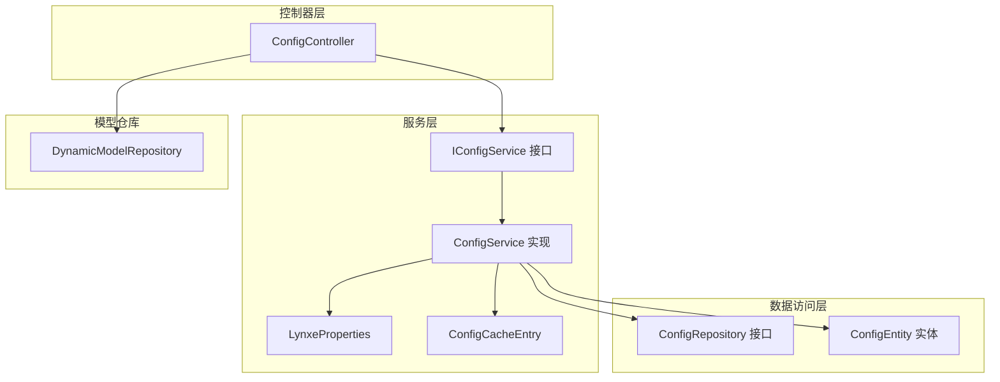
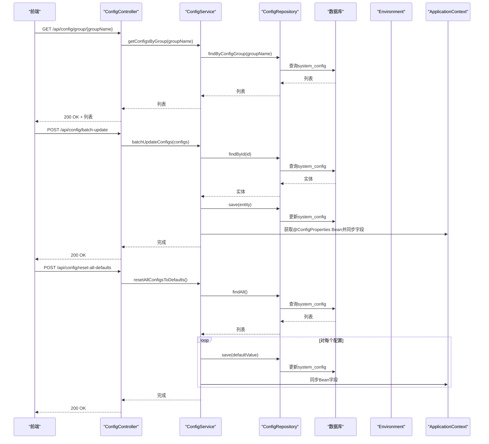
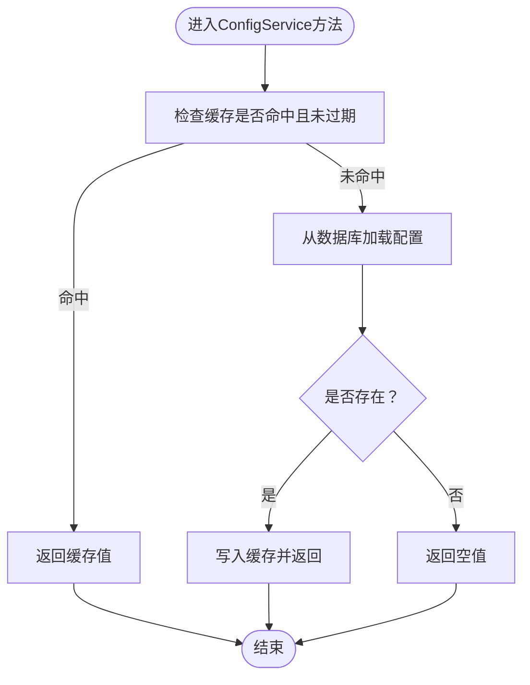
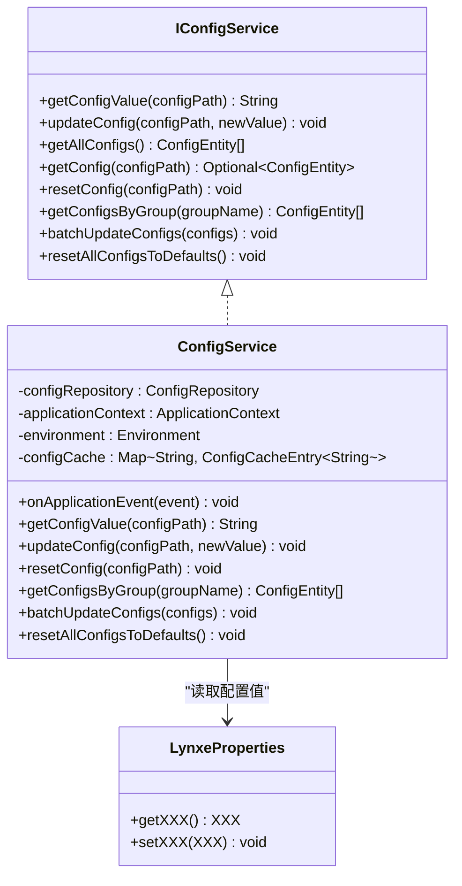
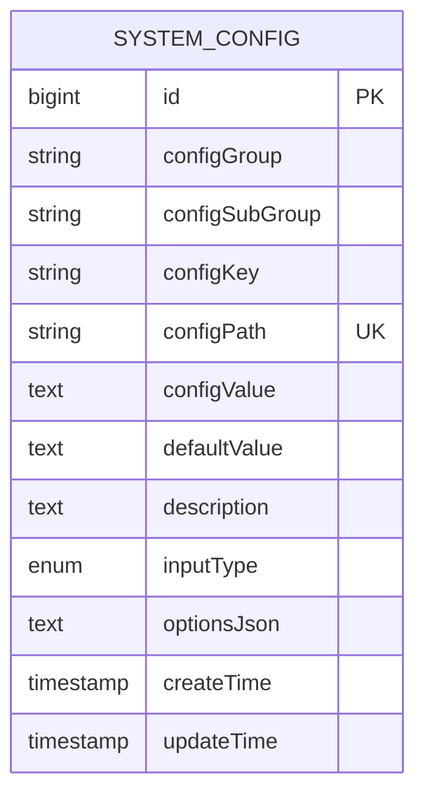
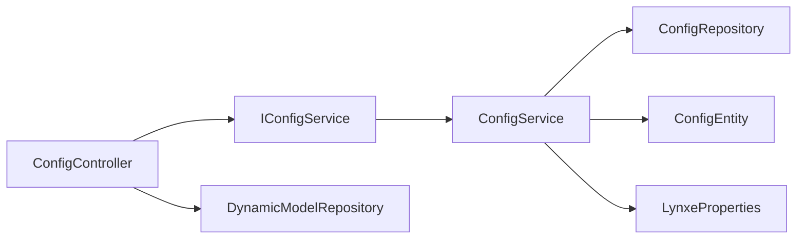

# 服务接口

<cite>
**本文引用的文件**
- [ConfigController.java](file://src/main/java/com/alibaba/cloud/ai/lynxe/config/ConfigController.java)
- [IConfigService.java](file://src/main/java/com/alibaba/cloud/ai/lynxe/config/IConfigService.java)
- [ConfigService.java](file://src/main/java/com/alibaba/cloud/ai/lynxe/config/ConfigService.java)
- [ConfigRepository.java](file://src/main/java/com/alibaba/cloud/ai/lynxe/config/repository/ConfigRepository.java)
- [ConfigEntity.java](file://src/main/java/com/alibaba/cloud/ai/lynxe/config/entity/ConfigEntity.java)
- [ConfigProperty.java](file://src/main/java/com/alibaba/cloud/ai/lynxe/config/ConfigProperty.java)
- [ConfigOption.java](file://src/main/java/com/alibaba/cloud/ai/lynxe/config/ConfigOption.java)
- [ConfigInputType.java](file://src/main/java/com/alibaba/cloud/ai/lynxe/config/entity/ConfigInputType.java)
- [LynxeProperties.java](file://src/main/java/com/alibaba/cloud/ai/lynxe/config/LynxeProperties.java)
- [ConfigCacheEntry.java](file://src/main/java/com/alibaba/cloud/ai/lynxe/config/ConfigCacheEntry.java)
- [DynamicModelRepository.java](file://src/main/java/com/alibaba/cloud/ai/lynxe/model/repository/DynamicModelRepository.java)
- [admin-api-service.ts](file://ui-vue3/src/api/admin-api-service.ts)
- [config-api-service.ts](file://ui-vue3/src/api/config-api-service.ts)
</cite>

## 目录
1. [简介](#简介)
2. [项目结构](#项目结构)
3. [核心组件](#核心组件)
4. [架构总览](#架构总览)
5. [详细组件分析](#详细组件分析)
6. [依赖分析](#依赖分析)
7. [性能考虑](#性能考虑)
8. [故障排查指南](#故障排查指南)
9. [结论](#结论)
10. [附录](#附录)

## 简介
本文件面向JManus配置服务接口，提供ConfigController暴露的RESTful API端点的完整说明，涵盖获取配置列表、按组查询、批量更新、重置默认值以及可用模型查询等操作的HTTP方法、URL路径、请求/响应格式。同时深入解析ConfigService的业务逻辑（配置读取、更新验证、事务处理、异常管理），阐述IConfigService接口定义的服务契约及依赖注入方式，并说明ConfigRepository数据访问层与数据库交互的持久化策略。通过具体调用关系示例展示服务层与控制器层的协作，最后给出API使用示例、错误码说明与安全认证机制建议。

## 项目结构
配置服务位于后端模块的config包中，采用典型的分层架构：
- 控制器层：ConfigController
- 服务层：IConfigService接口与ConfigService实现
- 数据访问层：ConfigRepository接口与ConfigEntity实体
- 配置注解与枚举：ConfigProperty、ConfigOption、ConfigInputType
- 配置属性聚合：LynxeProperties
- 缓存条目：ConfigCacheEntry
- 模型仓库：DynamicModelRepository（用于“可用模型”查询）

图表来源
- [ConfigController.java](file://src/main/java/com/alibaba/cloud/ai/lynxe/config/ConfigController.java#L36-L82)
- [IConfigService.java](file://src/main/java/com/alibaba/cloud/ai/lynxe/config/IConfigService.java#L18-L81)
- [ConfigService.java](file://src/main/java/com/alibaba/cloud/ai/lynxe/config/ConfigService.java#L41-L320)
- [ConfigRepository.java](file://src/main/java/com/alibaba/cloud/ai/lynxe/config/repository/ConfigRepository.java#L16-L101)
- [ConfigEntity.java](file://src/main/java/com/alibaba/cloud/ai/lynxe/config/entity/ConfigEntity.java#L16-L218)
- [LynxeProperties.java](file://src/main/java/com/alibaba/cloud/ai/lynxe/config/LynxeProperties.java#L16-L552)
- [ConfigCacheEntry.java](file://src/main/java/com/alibaba/cloud/ai/lynxe/config/ConfigCacheEntry.java#L16-L45)
- [DynamicModelRepository.java](file://src/main/java/com/alibaba/cloud/ai/lynxe/model/repository/DynamicModelRepository.java#L16-L31)

章节来源
- [ConfigController.java](file://src/main/java/com/alibaba/cloud/ai/lynxe/config/ConfigController.java#L36-L82)
- [ConfigService.java](file://src/main/java/com/alibaba/cloud/ai/lynxe/config/ConfigService.java#L41-L320)
- [ConfigRepository.java](file://src/main/java/com/alibaba/cloud/ai/lynxe/config/repository/ConfigRepository.java#L16-L101)
- [ConfigEntity.java](file://src/main/java/com/alibaba/cloud/ai/lynxe/config/entity/ConfigEntity.java#L16-L218)
- [LynxeProperties.java](file://src/main/java/com/alibaba/cloud/ai/lynxe/config/LynxeProperties.java#L16-L552)
- [ConfigCacheEntry.java](file://src/main/java/com/alibaba/cloud/ai/lynxe/config/ConfigCacheEntry.java#L16-L45)
- [DynamicModelRepository.java](file://src/main/java/com/alibaba/cloud/ai/lynxe/model/repository/DynamicModelRepository.java#L16-L31)

## 核心组件
- ConfigController：对外暴露REST API，负责路由与参数绑定，调用IConfigService执行业务逻辑。
- IConfigService：配置服务契约，定义配置读取、更新、重置、按组查询、批量更新、重置全部默认值等方法。
- ConfigService：实现IConfigService，包含初始化、缓存、类型转换、事务控制、环境变量回填、Bean字段同步等。
- ConfigRepository：基于JPA的数据访问接口，提供按路径、组、子组、存在性检查、分页查询等能力。
- ConfigEntity：系统配置实体，映射system_config表，包含分组、键、路径、值、默认值、输入类型、选项JSON、时间戳等字段。
- ConfigProperty/ConfigOption/ConfigInputType：配置元数据注解与枚举，用于声明配置项的分组、键、路径、默认值、描述、输入类型与下拉选项。
- LynxeProperties：集中声明所有可配置项，通过@ConfigProperty标注，运行时由ConfigService初始化并回填到数据库与Bean字段。
- ConfigCacheEntry：轻量级缓存条目，带过期时间，提升读取性能。
- DynamicModelRepository：查询动态模型列表，供前端“可用模型”下拉使用。

章节来源
- [IConfigService.java](file://src/main/java/com/alibaba/cloud/ai/lynxe/config/IConfigService.java#L18-L81)
- [ConfigService.java](file://src/main/java/com/alibaba/cloud/ai/lynxe/config/ConfigService.java#L41-L320)
- [ConfigRepository.java](file://src/main/java/com/alibaba/cloud/ai/lynxe/config/repository/ConfigRepository.java#L16-L101)
- [ConfigEntity.java](file://src/main/java/com/alibaba/cloud/ai/lynxe/config/entity/ConfigEntity.java#L16-L218)
- [ConfigProperty.java](file://src/main/java/com/alibaba/cloud/ai/lynxe/config/ConfigProperty.java#L16-L89)
- [ConfigOption.java](file://src/main/java/com/alibaba/cloud/ai/lynxe/config/ConfigOption.java#L16-L64)
- [ConfigInputType.java](file://src/main/java/com/alibaba/cloud/ai/lynxe/config/entity/ConfigInputType.java#L16-L46)
- [LynxeProperties.java](file://src/main/java/com/alibaba/cloud/ai/lynxe/config/LynxeProperties.java#L16-L552)
- [ConfigCacheEntry.java](file://src/main/java/com/alibaba/cloud/ai/lynxe/config/ConfigCacheEntry.java#L16-L45)
- [DynamicModelRepository.java](file://src/main/java/com/alibaba/cloud/ai/lynxe/model/repository/DynamicModelRepository.java#L16-L31)

## 架构总览
配置服务采用“控制器-服务-仓储-实体”的分层设计，结合Spring Boot的自动装配与JPA持久化，形成从API到数据库的闭环。

图表来源
- [ConfigController.java](file://src/main/java/com/alibaba/cloud/ai/lynxe/config/ConfigController.java#L46-L61)
- [ConfigService.java](file://src/main/java/com/alibaba/cloud/ai/lynxe/config/ConfigService.java#L272-L317)
- [ConfigRepository.java](file://src/main/java/com/alibaba/cloud/ai/lynxe/config/repository/ConfigRepository.java#L47-L54)
- [LynxeProperties.java](file://src/main/java/com/alibaba/cloud/ai/lynxe/config/LynxeProperties.java#L26-L552)

## 详细组件分析

### API端点定义与调用流程
- 基础路径：/api/config
- 端点列表与行为
  - GET /group/{groupName}
    - 功能：按配置组名获取配置列表
    - 请求参数：路径变量groupName
    - 响应：200 OK + 配置实体数组
    - 调用链：ConfigController.getConfigsByGroup → IConfigService.getConfigsByGroup → ConfigRepository.findByConfigGroup
  - POST /batch-update
    - 功能：批量更新配置值
    - 请求体：配置实体数组（仅需id与configValue）
    - 响应：200 OK
    - 调用链：ConfigController.batchUpdateConfigs → IConfigService.batchUpdateConfigs → ConfigRepository.findById/save；随后同步所有@ConfigProperties Bean字段
  - POST /reset-all-defaults
    - 功能：将所有配置重置为默认值
    - 请求体：无
    - 响应：200 OK
    - 调用链：ConfigController.resetAllConfigsToDefaults → IConfigService.resetAllConfigsToDefaults → 遍历并重置，同步Bean字段
  - GET /available-models
    - 功能：获取可用模型下拉选项
    - 响应：包含options与total的对象
    - 调用链：ConfigController.getAvailableModels → DynamicModelRepository.findAll → 组装选项

- 前端调用参考
  - AdminApiService（后端API）：提供getConfigsByGroup、batchUpdateConfigs、resetAllConfigsToDefaults等方法
  - ConfigApiService（前端模型API）：提供getAvailableModels，注意其基础路径为/api/models/available-models

章节来源
- [ConfigController.java](file://src/main/java/com/alibaba/cloud/ai/lynxe/config/ConfigController.java#L46-L79)
- [admin-api-service.ts](file://ui-vue3/src/api/admin-api-service.ts#L46-L164)
- [config-api-service.ts](file://ui-vue3/src/api/config-api-service.ts#L14-L32)

### 业务逻辑：ConfigService
- 初始化与清理
  - 应用上下文刷新事件触发初始化，扫描带有@ConfigurationProperties注解的Bean，收集@ConfigProperty标注的字段路径集合。
  - 清理过时配置：对比当前有效路径与数据库中已存在配置，删除不再定义的配置项，并同步清除缓存。
  - 新建缺失配置：若某@ConfigProperty未在数据库中存在，则创建对应ConfigEntity，优先从Environment读取同名属性作为当前值，否则使用注解默认值；若输入类型为SELECT且提供options，则序列化为JSON写入optionsJson。
- 读取配置
  - 先查内存缓存（ConfigCacheEntry），未命中或过期则查询数据库，命中后写入缓存。
- 更新配置
  - 事务内更新指定路径的configValue，写入数据库后更新缓存，并遍历所有@ConfigProperties Bean，按configPath匹配字段并进行类型转换后设置新值。
  - 类型转换支持：String、Boolean（含"on"映射）、Integer、Long、Double、Float。
- 重置配置
  - 将configValue设为defaultValue并保存，随后同步Bean字段。
- 批量更新与重置全部默认值
  - 批量更新：遍历传入配置，校验存在性后仅更新configValue，再同步Bean字段。
  - 重置全部默认值：遍历所有配置，若当前值与默认值不同则重置并同步Bean字段。
- 事务与异常
  - 更新、批量更新、重置默认值均使用@Transactional，确保一致性。
  - 未找到配置时抛出IllegalArgumentException，由全局异常处理器捕获返回标准错误响应。

图表来源
- [ConfigService.java](file://src/main/java/com/alibaba/cloud/ai/lynxe/config/ConfigService.java#L165-L196)
- [ConfigCacheEntry.java](file://src/main/java/com/alibaba/cloud/ai/lynxe/config/ConfigCacheEntry.java#L16-L45)

章节来源
- [ConfigService.java](file://src/main/java/com/alibaba/cloud/ai/lynxe/config/ConfigService.java#L67-L163)
- [ConfigService.java](file://src/main/java/com/alibaba/cloud/ai/lynxe/config/ConfigService.java#L165-L246)
- [ConfigService.java](file://src/main/java/com/alibaba/cloud/ai/lynxe/config/ConfigService.java#L255-L317)

### 依赖注入与服务契约
- IConfigService接口定义了配置读取、更新、重置、按组查询、批量更新、重置全部默认值等方法，便于在Spring代理模式下运行于原生镜像。
- ConfigService实现类通过@Autowired注入ConfigRepository、ApplicationContext、Environment，并在ContextRefreshedEvent事件中完成初始化。
- LynxeProperties通过@ConfigurationProperties(prefix = "lynxe")与@ConfigProperty组合，统一声明所有可配置项，运行时由ConfigService回填数据库与Bean字段。

图表来源
- [IConfigService.java](file://src/main/java/com/alibaba/cloud/ai/lynxe/config/IConfigService.java#L18-L81)
- [ConfigService.java](file://src/main/java/com/alibaba/cloud/ai/lynxe/config/ConfigService.java#L41-L320)
- [LynxeProperties.java](file://src/main/java/com/alibaba/cloud/ai/lynxe/config/LynxeProperties.java#L26-L552)

章节来源
- [IConfigService.java](file://src/main/java/com/alibaba/cloud/ai/lynxe/config/IConfigService.java#L18-L81)
- [ConfigService.java](file://src/main/java/com/alibaba/cloud/ai/lynxe/config/ConfigService.java#L41-L104)
- [LynxeProperties.java](file://src/main/java/com/alibaba/cloud/ai/lynxe/config/LynxeProperties.java#L26-L552)

### 数据访问层：ConfigRepository与ConfigEntity
- ConfigRepository接口
  - findByConfigPath：按配置路径查询
  - findByConfigGroupAndConfigSubGroup：按组与子组查询
  - findByConfigGroup：按组查询
  - existsByConfigPath：存在性检查
  - deleteByConfigPath：按路径删除
  - findAllGroups/findSubGroupsByGroup：查询所有组与子组
  - updateConfigValue：按路径批量更新值
  - findByConfigPathIn：按路径集合批量查询
- ConfigEntity实体
  - 字段：id、configGroup、configSubGroup、configKey、configPath（唯一）、configValue、defaultValue、description、inputType、optionsJson、createTime、updateTime
  - 注解：@Entity、@Table(name = "system_config")、@JsonIgnoreProperties(ignoreUnknown = true)，并有PrePersist/PreUpdate自动填充时间戳

图表来源
- [ConfigEntity.java](file://src/main/java/com/alibaba/cloud/ai/lynxe/config/entity/ConfigEntity.java#L16-L218)
- [ConfigRepository.java](file://src/main/java/com/alibaba/cloud/ai/lynxe/config/repository/ConfigRepository.java#L16-L101)

章节来源
- [ConfigRepository.java](file://src/main/java/com/alibaba/cloud/ai/lynxe/config/repository/ConfigRepository.java#L16-L101)
- [ConfigEntity.java](file://src/main/java/com/alibaba/cloud/ai/lynxe/config/entity/ConfigEntity.java#L16-L218)

### 配置元数据与输入类型
- ConfigProperty：声明配置的group、subGroup、key、path、description、defaultValue、inputType、options等元信息。
- ConfigOption：声明下拉/单选/多选等选项的value、label、description、icon、disabled等。
- ConfigInputType：定义输入类型枚举（TEXT、SELECT、CHECKBOX、BOOLEAN、NUMBER）。

章节来源
- [ConfigProperty.java](file://src/main/java/com/alibaba/cloud/ai/lynxe/config/ConfigProperty.java#L16-L89)
- [ConfigOption.java](file://src/main/java/com/alibaba/cloud/ai/lynxe/config/ConfigOption.java#L16-L64)
- [ConfigInputType.java](file://src/main/java/com/alibaba/cloud/ai/lynxe/config/entity/ConfigInputType.java#L16-L46)

### 服务层与控制器层调用关系示例
- 控制器到服务：ConfigController通过@Autowired注入IConfigService，直接调用相应方法。
- 服务到仓储：ConfigService通过@Autowired注入ConfigRepository，执行查询/保存。
- 服务到Bean同步：ConfigService在更新配置后，遍历所有@ConfigProperties Bean，按configPath匹配字段并进行类型转换后设置新值。

章节来源
- [ConfigController.java](file://src/main/java/com/alibaba/cloud/ai/lynxe/config/ConfigController.java#L36-L82)
- [ConfigService.java](file://src/main/java/com/alibaba/cloud/ai/lynxe/config/ConfigService.java#L182-L246)

## 依赖分析
- 组件耦合与内聚
  - ConfigController对IConfigService的依赖清晰，职责单一，内聚度高。
  - ConfigService对ConfigRepository、ApplicationContext、Environment的依赖集中在初始化与更新同步阶段，耦合可控。
  - ConfigRepository对JPA抽象依赖，提供稳定的CRUD与查询能力。
- 外部依赖与集成点
  - Spring Boot自动装配与事件驱动初始化。
  - JPA/Hibernate持久化system_config表。
  - 前端通过AdminApiService与ConfigApiService分别调用后端配置与模型API。
- 循环依赖
  - 未发现循环依赖迹象；ConfigService通过ApplicationContext间接使用，避免直接循环引用。

图表来源
- [ConfigController.java](file://src/main/java/com/alibaba/cloud/ai/lynxe/config/ConfigController.java#L36-L82)
- [IConfigService.java](file://src/main/java/com/alibaba/cloud/ai/lynxe/config/IConfigService.java#L18-L81)
- [ConfigService.java](file://src/main/java/com/alibaba/cloud/ai/lynxe/config/ConfigService.java#L41-L320)
- [ConfigRepository.java](file://src/main/java/com/alibaba/cloud/ai/lynxe/config/repository/ConfigRepository.java#L16-L101)
- [ConfigEntity.java](file://src/main/java/com/alibaba/cloud/ai/lynxe/config/entity/ConfigEntity.java#L16-L218)
- [LynxeProperties.java](file://src/main/java/com/alibaba/cloud/ai/lynxe/config/LynxeProperties.java#L26-L552)
- [DynamicModelRepository.java](file://src/main/java/com/alibaba/cloud/ai/lynxe/model/repository/DynamicModelRepository.java#L16-L31)

章节来源
- [ConfigController.java](file://src/main/java/com/alibaba/cloud/ai/lynxe/config/ConfigController.java#L36-L82)
- [ConfigService.java](file://src/main/java/com/alibaba/cloud/ai/lynxe/config/ConfigService.java#L41-L320)
- [ConfigRepository.java](file://src/main/java/com/alibaba/cloud/ai/lynxe/config/repository/ConfigRepository.java#L16-L101)
- [DynamicModelRepository.java](file://src/main/java/com/alibaba/cloud/ai/lynxe/model/repository/DynamicModelRepository.java#L16-L31)

## 性能考虑
- 缓存策略：ConfigCacheEntry提供30秒过期时间，减少数据库查询压力，适合高频读取场景。
- 批量操作：批量更新与重置默认值采用逐条处理，若配置数量较大，建议前端分批提交或后端优化为批量SQL更新。
- Bean同步：每次更新后同步所有@ConfigProperties Bean字段，可能带来额外开销，建议在大量配置变更时合并提交。

[本节为通用指导，不涉及具体文件分析]

## 故障排查指南
- 常见问题
  - 配置不存在：更新/重置时若找不到配置会抛出IllegalArgumentException，需确认configPath或ID是否正确。
  - 类型转换失败：当目标字段类型与传入字符串不兼容时，会抛出IllegalArgumentException，需检查输入类型与值。
  - 事务冲突：批量更新/重置默认值涉及多条写入，若并发较高建议前端串行或后端增加重试与幂等控制。
- 建议
  - 在前端对必填字段与类型进行校验，减少无效请求。
  - 对批量操作添加进度反馈与错误汇总，便于定位失败项。
  - 关注日志输出，特别是初始化阶段的“Obsolete configuration cleanup”与“Creating new config”。

章节来源
- [ConfigService.java](file://src/main/java/com/alibaba/cloud/ai/lynxe/config/ConfigService.java#L182-L246)
- [ConfigService.java](file://src/main/java/com/alibaba/cloud/ai/lynxe/config/ConfigService.java#L255-L317)

## 结论
JManus配置服务通过清晰的分层设计与完善的生命周期管理，实现了配置的持久化、缓存、类型转换与Bean同步。ConfigController提供了简洁易用的REST API，ConfigService承担了复杂的业务逻辑与事务控制，ConfigRepository保证了数据访问的一致性与可扩展性。整体架构易于维护与扩展，适合在生产环境中稳定运行。

[本节为总结性内容，不涉及具体文件分析]

## 附录

### API使用示例
- 获取配置组
  - 方法：GET
  - 路径：/api/config/group/{groupName}
  - 示例：GET /api/config/group/lynxe.browser
- 批量更新配置
  - 方法：POST
  - 路径：/api/config/batch-update
  - 请求体：包含多个配置对象，每个对象至少包含id与configValue
  - 示例：POST /api/config/batch-update
- 重置全部配置为默认值
  - 方法：POST
  - 路径：/api/config/reset-all-defaults
  - 示例：POST /api/config/reset-all-defaults
- 获取可用模型
  - 方法：GET
  - 路径：/api/config/available-models
  - 示例：GET /api/config/available-models

章节来源
- [ConfigController.java](file://src/main/java/com/alibaba/cloud/ai/lynxe/config/ConfigController.java#L46-L79)
- [admin-api-service.ts](file://ui-vue3/src/api/admin-api-service.ts#L46-L164)
- [config-api-service.ts](file://ui-vue3/src/api/config-api-service.ts#L14-L32)

### 错误码说明
- 400 Bad Request：请求参数非法或类型转换失败（如更新时传入值与目标类型不匹配）
- 404 Not Found：配置不存在（如按ID更新时找不到记录）
- 500 Internal Server Error：服务器内部异常（如数据库连接失败、Bean同步异常）

章节来源
- [ConfigService.java](file://src/main/java/com/alibaba/cloud/ai/lynxe/config/ConfigService.java#L182-L246)
- [ConfigService.java](file://src/main/java/com/alibaba/cloud/ai/lynxe/config/ConfigService.java#L255-L317)

### 安全认证机制
- 当前代码未显式展示认证与授权逻辑。建议在网关或应用层引入Spring Security，对敏感配置操作（如批量更新、重置默认值）进行鉴权与审计。
- 对外暴露的API建议配合HTTPS、CORS策略与限流措施，防止未授权访问与滥用。

[本节为通用建议，不涉及具体文件分析]