# 运行时管理

<cite>
**本文档引用的文件**   
- [ConfigCacheEntry.java](file://src/main/java/com/alibaba/cloud/ai/lynxe/config/ConfigCacheEntry.java)
- [ConfigProperty.java](file://src/main/java/com/alibaba/cloud/ai/lynxe/config/ConfigProperty.java)
- [LynxeProperties.java](file://src/main/java/com/alibaba/cloud/ai/lynxe/config/LynxeProperties.java)
- [ConfigService.java](file://src/main/java/com/alibaba/cloud/ai/lynxe/config/ConfigService.java)
- [ConfigAppStartupListener.java](file://src/main/java/com/alibaba/cloud/ai/lynxe/config/startUp/ConfigAppStartupListener.java)
- [IConfigService.java](file://src/main/java/com/alibaba/cloud/ai/lynxe/config/IConfigService.java)
- [ConfigEntity.java](file://src/main/java/com/alibaba/cloud/ai/lynxe/config/entity/ConfigEntity.java)
- [ConfigRepository.java](file://src/main/java/com/alibaba/cloud/ai/lynxe/config/repository/ConfigRepository.java)
- [ModelChangeEvent.java](file://src/main/java/com/alibaba/cloud/ai/lynxe/event/ModelChangeEvent.java)
- [LynxeEventPublisher.java](file://src/main/java/com/alibaba/cloud/ai/lynxe/event/LynxeEventPublisher.java)
- [application.yml](file://src/main/resources/application.yml)
</cite>

## 目录
1. [引言](#引言)
2. [配置缓存机制](#配置缓存机制)
3. [应用启动配置初始化](#应用启动配置初始化)
4. [配置属性依赖注入](#配置属性依赖注入)
5. [顶层配置属性管理](#顶层配置属性管理)
6. [配置热更新实现](#配置热更新实现)
7. [配置变更事件机制](#配置变更事件机制)
8. [性能优化建议](#性能优化建议)
9. [故障排查指南](#故障排查指南)
10. [结论](#结论)

## 引言

JManus系统的运行时配置管理机制提供了一套完整的配置生命周期管理解决方案，包括配置的内存缓存、启动初始化、依赖注入、热更新和事件通知等功能。该机制通过`ConfigCacheEntry`实现高性能的内存缓存，利用`ConfigAppStartupListener`在应用启动时初始化配置，通过`ConfigProperty`注解实现配置的依赖注入，并使用`LynxeProperties`类集中管理顶层配置属性。本技术文档将深入分析这些核心组件的工作原理和实现细节。

**配置管理核心组件关系**
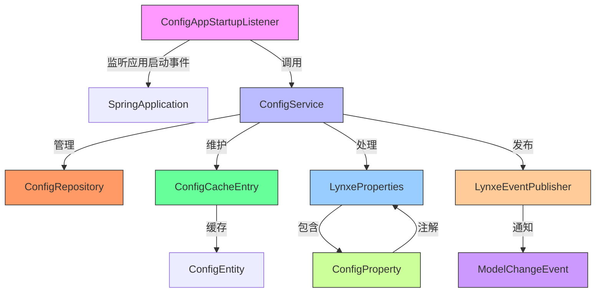

**图示来源**
- [ConfigAppStartupListener.java](file://src/main/java/com/alibaba/cloud/ai/lynxe/config/startUp/ConfigAppStartupListener.java)
- [ConfigService.java](file://src/main/java/com/alibaba/cloud/ai/lynxe/config/ConfigService.java)
- [ConfigRepository.java](file://src/main/java/com/alibaba/cloud/ai/lynxe/config/repository/ConfigRepository.java)
- [ConfigCacheEntry.java](file://src/main/java/com/alibaba/cloud/ai/lynxe/config/ConfigCacheEntry.java)
- [LynxeProperties.java](file://src/main/java/com/alibaba/cloud/ai/lynxe/config/LynxeProperties.java)
- [ConfigProperty.java](file://src/main/java/com/alibaba/cloud/ai/lynxe/config/ConfigProperty.java)
- [LynxeEventPublisher.java](file://src/main/java/com/alibaba/cloud/ai/lynxe/event/LynxeEventPublisher.java)
- [ModelChangeEvent.java](file://src/main/java/com/alibaba/cloud/ai/lynxe/event/ModelChangeEvent.java)

## 配置缓存机制

`ConfigCacheEntry`类实现了配置数据的内存缓存机制，通过缓存配置值来提升访问性能，避免频繁的数据库查询操作。该类使用泛型设计，可以缓存任意类型的配置值。

### 缓存数据结构

`ConfigCacheEntry`类包含三个核心字段：
- `value`: 缓存的配置值，使用泛型T表示
- `lastUpdateTime`: 记录最后一次更新时间戳
- `EXPIRATION_TIME`: 静态常量，定义缓存过期时间（30秒）

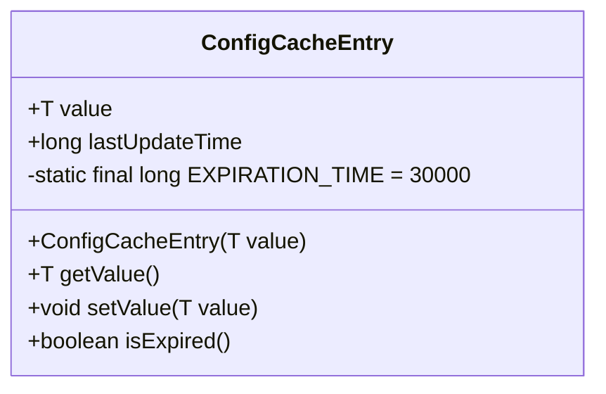

**图示来源**
- [ConfigCacheEntry.java](file://src/main/java/com/alibaba/cloud/ai/lynxe/config/ConfigCacheEntry.java#L18-L45)

### 缓存失效策略

缓存失效策略基于时间过期机制，通过`isExpired()`方法判断缓存是否已过期：

```java
public boolean isExpired() {
    return System.currentTimeMillis() - lastUpdateTime > EXPIRATION_TIME;
}
```

该策略具有以下特点：
- **固定过期时间**: 所有缓存项的过期时间固定为30秒
- **基于时间戳**: 使用系统当前时间与最后更新时间的差值进行判断
- **简单高效**: 无需复杂的过期管理算法，性能开销小

### 线程安全机制

`ConfigCacheEntry`类本身不直接处理线程安全问题，而是依赖外部的并发控制机制。在`ConfigService`中，使用`ConcurrentHashMap`来存储`ConfigCacheEntry`实例，确保多线程环境下的线程安全：

```java
private final Map<String, ConfigCacheEntry<String>> configCache = new ConcurrentHashMap<>();
```

这种设计的优势包括：
- **无锁并发**: `ConcurrentHashMap`使用分段锁或CAS操作，提供高性能的并发访问
- **内存可见性**: 保证缓存更新对所有线程可见
- **避免竞态条件**: 防止多个线程同时修改同一缓存项

**配置缓存访问流程**
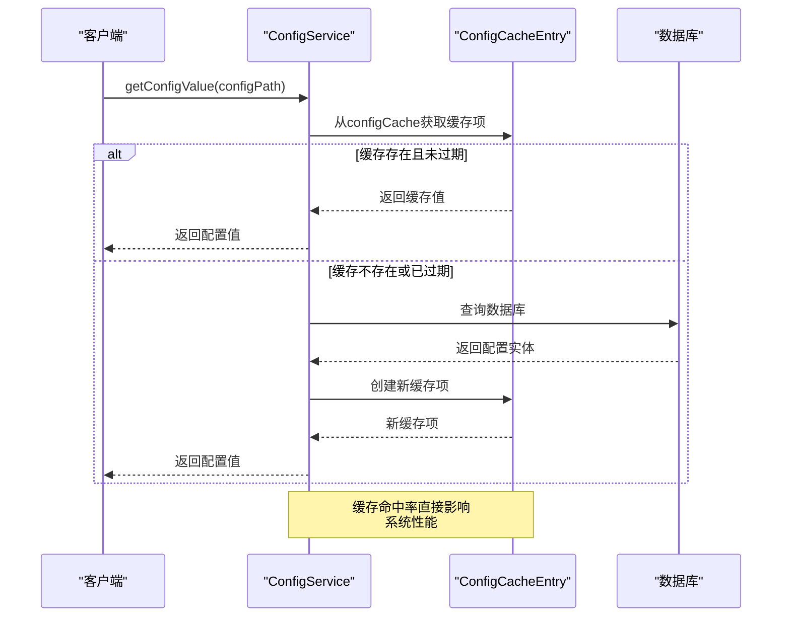

**图示来源**
- [ConfigService.java](file://src/main/java/com/alibaba/cloud/ai/lynxe/config/ConfigService.java#L165-L180)
- [ConfigCacheEntry.java](file://src/main/java/com/alibaba/cloud/ai/lynxe/config/ConfigCacheEntry.java)

**本节来源**
- [ConfigCacheEntry.java](file://src/main/java/com/alibaba/cloud/ai/lynxe/config/ConfigCacheEntry.java)
- [ConfigService.java](file://src/main/java/com/alibaba/cloud/ai/lynxe/config/ConfigService.java)

## 应用启动配置初始化

`ConfigAppStartupListener`类负责在应用启动时初始化配置项并加载默认值，确保系统在启动后立即拥有完整的配置状态。

### 启动监听器实现

`ConfigAppStartupListener`实现了Spring的`ApplicationListener<ApplicationStartedEvent>`接口，在应用启动事件触发时执行初始化逻辑：

```java
@Component
public class ConfigAppStartupListener implements ApplicationListener<ApplicationStartedEvent> {
    
    @Autowired
    private IConfigService configService;
    
    @Override
    public void onApplicationEvent(ApplicationStartedEvent event) {
        initializeConfigs();
    }
    
    private void initializeConfigs() {
        try {
            List<ConfigEntity> allConfigs = configService.getAllConfigs();
            // 统计和日志记录
            log.info("Configuration system initialized with {} total configs", allConfigs.size());
        }
        catch (Exception e) {
            log.error("Failed to verify configuration system state", e);
        }
    }
}
```

### 初始化流程分析

应用启动时的配置初始化流程如下：

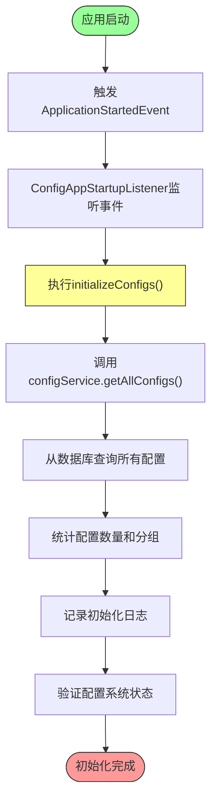

**图示来源**
- [ConfigAppStartupListener.java](file://src/main/java/com/alibaba/cloud/ai/lynxe/config/startUp/ConfigAppStartupListener.java)

### 配置状态验证

初始化过程中，系统会对配置状态进行全面验证，包括：

1. **配置数量统计**: 统计总配置数量和各分组的配置数量
2. **自定义值检查**: 检查有多少配置项使用了自定义值而非默认值
3. **异常处理**: 捕获并记录初始化过程中的任何异常

```java
// Count configurations by configuration group
Map<String, Long> groupCounts = allConfigs.stream()
    .collect(Collectors.groupingBy(ConfigEntity::getConfigGroup, Collectors.counting()));

// Log the startup status of the configuration system
log.info("Configuration system initialized with {} total configs", allConfigs.size());
groupCounts.forEach((group, count) -> log.info("Group '{}': {} configs", group, count));

// Check if there are any custom value configurations
long customizedCount = allConfigs.stream()
    .filter(config -> !config.getConfigValue().equals(config.getDefaultValue()))
    .count();
```

这种验证机制确保了配置系统的完整性和一致性，为后续的运行时操作提供了可靠的基础。

**本节来源**
- [ConfigAppStartupListener.java](file://src/main/java/com/alibaba/cloud/ai/lynxe/config/startUp/ConfigAppStartupListener.java)
- [ConfigService.java](file://src/main/java/com/alibaba/cloud/ai/lynxe/config/ConfigService.java)
- [ConfigEntity.java](file://src/main/java/com/alibaba/cloud/ai/lynxe/config/entity/ConfigEntity.java)

## 配置属性依赖注入

`ConfigProperty`注解实现了配置项到Spring Bean的依赖注入，使配置管理更加灵活和类型安全。

### 注解定义与结构

`ConfigProperty`是一个运行时注解，定义了配置项的元数据信息：

```java
@Target(ElementType.FIELD)
@Retention(RetentionPolicy.RUNTIME)
public @interface ConfigProperty {
    String group();
    String subGroup();
    String key();
    String path();
    String description() default "";
    String defaultValue() default "";
    ConfigInputType inputType() default ConfigInputType.TEXT;
    ConfigOption[] options() default {};
}
```

**配置属性注解字段说明**
| 字段 | 类型 | 描述 | 示例 |
|------|------|------|------|
| group | String | 顶级分组 | "lynxe" |
| subGroup | String | 二级分组 | "browser" |
| key | String | 配置项键 | "headless" |
| path | String | YAML全路径 | "lynxe.browser.headless" |
| description | String | 描述信息 | "浏览器无头模式" |
| defaultValue | String | 默认值 | "false" |
| inputType | ConfigInputType | 输入类型 | CHECKBOX |
| options | ConfigOption[] | 选项数组 | 下拉框选项 |

### 依赖注入实现机制

依赖注入的实现主要在`LynxeProperties`类中，通过反射机制将配置值注入到字段中：

```java
@Component
@ConfigurationProperties(prefix = "lynxe")
public class LynxeProperties {
    
    @ConfigProperty(group = "lynxe", subGroup = "browser", key = "headless", 
                   path = "lynxe.browser.headless", defaultValue = "false",
                   inputType = ConfigInputType.CHECKBOX)
    private volatile Boolean browserHeadless;
    
    public Boolean getBrowserHeadless() {
        String configPath = "lynxe.browser.headless";
        String value = configService.getConfigValue(configPath);
        if (value != null) {
            browserHeadless = Boolean.valueOf(value);
        }
        return browserHeadless;
    }
}
```

注入机制的关键特点：
- **延迟加载**: 配置值在首次访问时才从缓存或数据库加载
- **类型转换**: 自动将字符串值转换为目标字段类型
- **线程安全**: 使用`volatile`关键字确保多线程环境下的可见性

### 配置层级结构

配置系统采用三级结构设计：
- **group**: 顶级分组，如"lynxe"、"browser"等
- **subGroup**: 二级分组，如"browser.settings"、"browser.proxy"等  
- **key**: 具体的配置项

这种结构提供了良好的组织性和可扩展性，便于管理和维护大量配置项。

**配置注入流程**
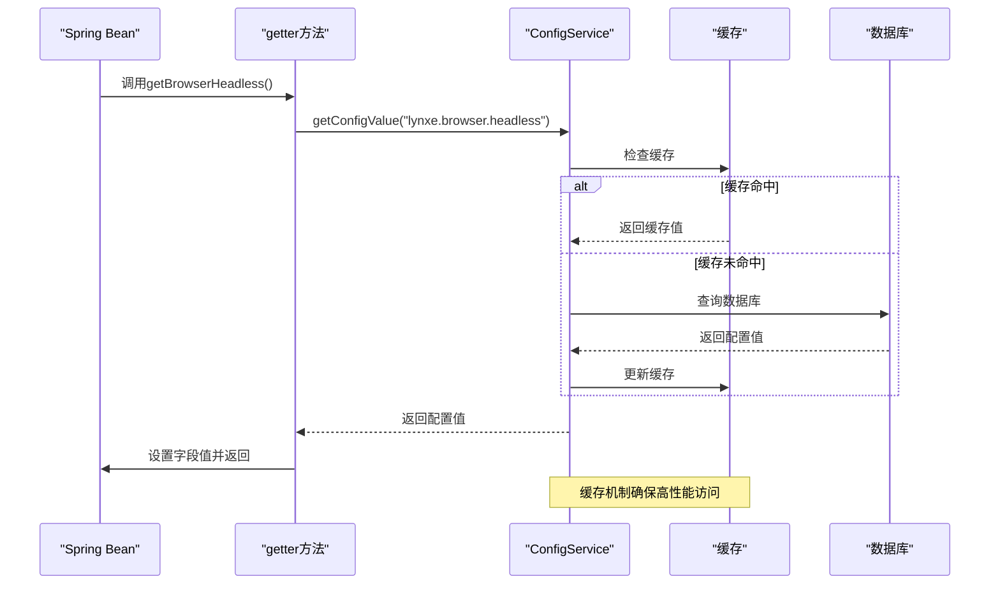

**图示来源**
- [ConfigProperty.java](file://src/main/java/com/alibaba/cloud/ai/lynxe/config/ConfigProperty.java)
- [LynxeProperties.java](file://src/main/java/com/alibaba/cloud/ai/lynxe/config/LynxeProperties.java)
- [ConfigService.java](file://src/main/java/com/alibaba/cloud/ai/lynxe/config/ConfigService.java)

**本节来源**
- [ConfigProperty.java](file://src/main/java/com/alibaba/cloud/ai/lynxe/config/ConfigProperty.java)
- [LynxeProperties.java](file://src/main/java/com/alibaba/cloud/ai/lynxe/config/LynxeProperties.java)
- [ConfigService.java](file://src/main/java/com/alibaba/cloud/ai/lynxe/config/ConfigService.java)

## 顶层配置属性管理

`LynxeProperties`类作为顶层配置属性的集中管理器，通过Spring的`@ConfigurationProperties`机制实现了类型安全的配置管理。

### 类结构与注解

`LynxeProperties`类使用了多个Spring注解来实现其功能：

```java
@Component
@ConfigurationProperties(prefix = "lynxe")
public class LynxeProperties {
    
    @Lazy
    @Autowired
    private IConfigService configService;
    
    // 各种配置字段...
}
```

关键注解说明：
- `@Component`: 将类注册为Spring Bean
- `@ConfigurationProperties(prefix = "lynxe")`: 绑定以"lynxe"为前缀的配置
- `@Lazy`: 延迟初始化，避免循环依赖
- `@Autowired`: 自动注入`IConfigService`

### 配置分组管理

`LynxeProperties`类将配置分为多个逻辑分组，每个分组对应特定的功能领域：

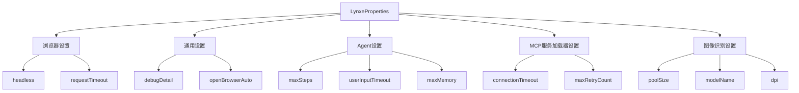

**图示来源**
- [LynxeProperties.java](file://src/main/java/com/alibaba/cloud/ai/lynxe/config/LynxeProperties.java)

### 配置字段特性

配置字段具有以下重要特性：

1. **volatile关键字**: 确保多线程环境下的内存可见性
2. **延迟初始化**: 在首次访问时才从配置源加载值
3. **默认值处理**: 当配置未设置时，使用注解中定义的默认值
4. **类型安全**: 编译时检查类型匹配

```java
private volatile Boolean browserHeadless;

public Boolean getBrowserHeadless() {
    String configPath = "lynxe.browser.headless";
    String value = configService.getConfigValue(configPath);
    if (value != null) {
        browserHeadless = Boolean.valueOf(value);
    }
    return browserHeadless;
}
```

### 配置管理优势

使用`LynxeProperties`进行配置管理的优势包括：

- **类型安全**: 编译时检查，避免运行时类型错误
- **IDE支持**: 提供代码补全和导航功能
- **文档化**: 配置项的结构和类型在代码中明确体现
- **易于测试**: 可以轻松地为配置类编写单元测试
- **集中管理**: 所有配置项在一个类中定义，便于维护

**本节来源**
- [LynxeProperties.java](file://src/main/java/com/alibaba/cloud/ai/lynxe/config/LynxeProperties.java)

## 配置热更新实现

配置热更新机制允许在不重启应用的情况下动态修改配置，立即生效并通知相关组件。

### 热更新流程

配置热更新的完整流程如下：

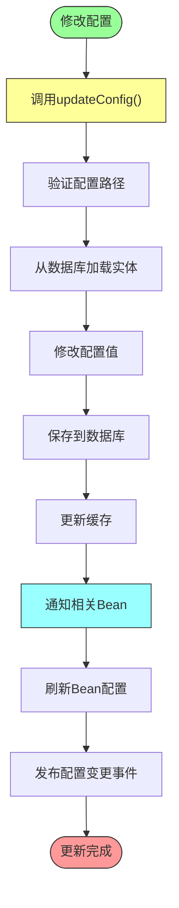

**图示来源**
- [ConfigService.java](file://src/main/java/com/alibaba/cloud/ai/lynxe/config/ConfigService.java#L183-L196)

### 核心更新方法

`ConfigService.updateConfig()`方法是热更新的核心实现：

```java
@Transactional
public void updateConfig(String configPath, String newValue) {
    ConfigEntity entity = configRepository.findByConfigPath(configPath)
        .orElseThrow(() -> new IllegalArgumentException("Config not found: " + configPath));
    
    entity.setConfigValue(newValue);
    configRepository.save(entity);
    
    // Update cache
    configCache.put(configPath, new ConfigCacheEntry<>(newValue));
    
    // Update all beans using this configuration
    Map<String, Object> configBeans = applicationContext.getBeansWithAnnotation(ConfigurationProperties.class);
    configBeans.values().forEach(bean -> updateBeanConfig(bean, configPath, newValue));
}
```

### 对系统组件的影响

配置热更新会对系统中的多个组件产生影响：

1. **缓存组件**: 缓存项被更新，后续访问将返回新值
2. **业务组件**: 使用该配置的Bean会被刷新，反映最新配置
3. **事件监听器**: 可以监听配置变更事件并做出相应处理
4. **性能指标**: 配置变更可能影响系统性能特征

例如，当`lynxe.browser.headless`配置被修改时：
- 浏览器组件会根据新值决定是否以无头模式启动
- 相关的UI显示逻辑可能会改变
- 性能监控指标可能会调整采集策略

### 批量更新支持

系统还支持批量配置更新，提高大规模配置变更的效率：

```java
@Transactional
public void batchUpdateConfigs(List<ConfigEntity> configs) {
    for (ConfigEntity config : configs) {
        // 更新每个配置项
        // ...
    }
}
```

这种机制适用于需要同时修改多个相关配置的场景。

**本节来源**
- [ConfigService.java](file://src/main/java/com/alibaba/cloud/ai/lynxe/config/ConfigService.java)
- [ConfigRepository.java](file://src/main/java/com/alibaba/cloud/ai/lynxe/config/repository/ConfigRepository.java)
- [ConfigCacheEntry.java](file://src/main/java/com/alibaba/cloud/ai/lynxe/config/ConfigCacheEntry.java)

## 配置变更事件机制

配置变更事件机制通过发布-订阅模式实现，确保配置变更能够及时通知到所有相关组件。

### 事件发布者

`LynxeEventPublisher`类负责发布配置变更相关的事件：

```java
@Component
public class LynxeEventPublisher {
    
    private Map<Class<? extends LynxeEvent>, List<LynxeListener<? super LynxeEvent>>> listeners = new HashMap<>();
    
    public void publish(LynxeEvent event) {
        Class<? extends LynxeEvent> eventClass = event.getClass();
        for (Map.Entry<Class<? extends LynxeEvent>, List<LynxeListener<? super LynxeEvent>>> entry : listeners.entrySet()) {
            if (entry.getKey().isAssignableFrom(eventClass)) {
                for (LynxeListener<? super LynxeEvent> listener : entry.getValue()) {
                    try {
                        listener.onEvent(event);
                    }
                    catch (Exception e) {
                        logger.error("Error occurred while processing event: {}", e.getMessage(), e);
                    }
                }
            }
        }
    }
}
```

### 事件类型

系统定义了多种配置相关的事件类型，其中`ModelChangeEvent`是一个典型示例：

```java
public class ModelChangeEvent implements LynxeEvent {
    
    private DynamicModelEntity dynamicModelEntity;
    private long createTime;
    
    public ModelChangeEvent(DynamicModelEntity dynamicModelEntity) {
        this.dynamicModelEntity = dynamicModelEntity;
        this.createTime = System.currentTimeMillis();
    }
    
    // getters...
}
```

### 事件监听流程

配置变更事件的处理流程如下：

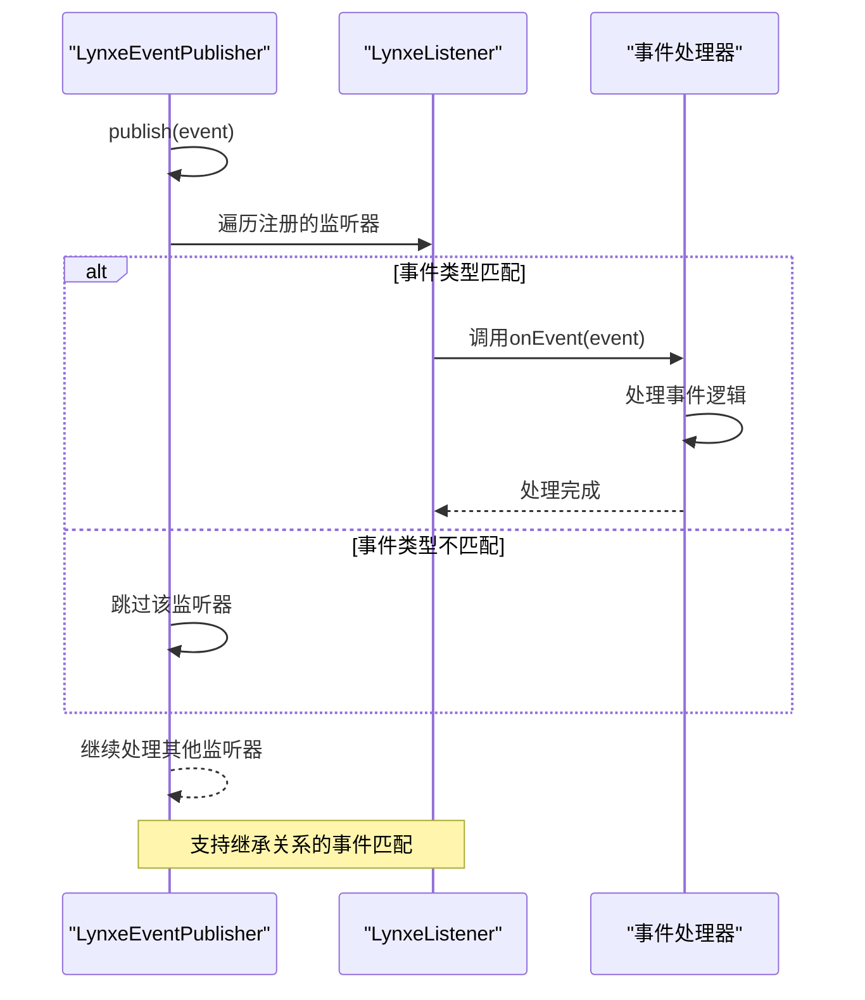

**图示来源**
- [LynxeEventPublisher.java](file://src/main/java/com/alibaba/cloud/ai/lynxe/event/LynxeEventPublisher.java)
- [ModelChangeEvent.java](file://src/main/java/com/alibaba/cloud/ai/lynxe/event/ModelChangeEvent.java)

### 事件机制优势

配置变更事件机制的优势包括：

- **解耦**: 发布者和订阅者之间完全解耦
- **灵活性**: 可以有多个监听器处理同一事件
- **可扩展性**: 易于添加新的事件类型和监听器
- **错误隔离**: 单个监听器的异常不会影响其他监听器
- **异步处理**: 为实现异步事件处理提供了基础

**本节来源**
- [LynxeEventPublisher.java](file://src/main/java/com/alibaba/cloud/ai/lynxe/event/LynxeEventPublisher.java)
- [ModelChangeEvent.java](file://src/main/java/com/alibaba/cloud/ai/lynxe/event/ModelChangeEvent.java)

## 性能优化建议

基于对JManus配置管理机制的分析，提出以下性能优化建议：

### 缓存优化

1. **调整缓存过期时间**: 根据实际使用场景调整`EXPIRATION_TIME`的值
   - 高频访问配置：适当延长过期时间
   - 低频访问配置：缩短过期时间以节省内存

2. **缓存预热**: 在应用启动后预加载常用配置到缓存中
   ```java
   // 在ConfigAppStartupListener中添加缓存预热逻辑
   private void warmUpCache() {
       List<ConfigEntity> frequentlyUsedConfigs = getFrequentlyUsedConfigs();
       for (ConfigEntity config : frequentlyUsedConfigs) {
           configCache.put(config.getConfigPath(), new ConfigCacheEntry<>(config.getConfigValue()));
       }
   }
   ```

3. **缓存大小限制**: 为`configCache`添加大小限制，防止内存溢出
   ```java
   // 使用Guava Cache或Caffeine替代ConcurrentHashMap
   private final Cache<String, ConfigCacheEntry<String>> configCache = 
       Caffeine.newBuilder()
           .maximumSize(1000)
           .expireAfterWrite(Duration.ofSeconds(30))
           .build();
   ```

### 数据库访问优化

1. **批量查询**: 对于需要同时获取多个配置的场景，实现批量查询方法
   ```java
   // 在ConfigRepository中添加批量查询方法
   List<ConfigEntity> findByConfigPathIn(List<String> configPaths);
   ```

2. **索引优化**: 确保`configPath`字段有数据库索引，提高查询性能

3. **连接池配置**: 优化HikariCP连接池参数，适应配置访问模式
   ```yaml
   spring:
     datasource:
       hikari:
         maximum-pool-size: 20
         minimum-idle: 5
   ```

### 并发访问优化

1. **读写分离**: 对于读多写少的配置访问模式，考虑读写分离
2. **无锁设计**: 在可能的情况下使用无锁数据结构
3. **线程局部缓存**: 对于线程特定的配置访问，考虑使用`ThreadLocal`

### 监控与诊断

1. **缓存命中率监控**: 记录并监控缓存命中率
2. **配置访问统计**: 统计各配置项的访问频率
3. **性能指标收集**: 收集配置访问的延迟、吞吐量等指标

**配置管理性能优化策略**
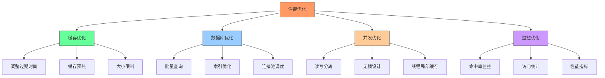

**图示来源**
- [ConfigCacheEntry.java](file://src/main/java/com/alibaba/cloud/ai/lynxe/config/ConfigCacheEntry.java)
- [ConfigService.java](file://src/main/java/com/alibaba/cloud/ai/lynxe/config/ConfigService.java)
- [ConfigRepository.java](file://src/main/java/com/alibaba/cloud/ai/lynxe/config/repository/ConfigRepository.java)

**本节来源**
- [ConfigCacheEntry.java](file://src/main/java/com/alibaba/cloud/ai/lynxe/config/ConfigCacheEntry.java)
- [ConfigService.java](file://src/main/java/com/alibaba/cloud/ai/lynxe/config/ConfigService.java)
- [ConfigRepository.java](file://src/main/java/com/alibaba/cloud/ai/lynxe/config/repository/ConfigRepository.java)
- [application.yml](file://src/main/resources/application.yml)

## 故障排查指南

当配置管理出现问题时，可以按照以下步骤进行排查：

### 常见问题与解决方案

**1. 配置未生效**

**症状**: 修改配置后，系统行为未按预期改变

**排查步骤**:
- 检查配置路径是否正确
- 验证配置是否已成功保存到数据库
- 确认缓存是否已更新
- 检查相关Bean是否已刷新

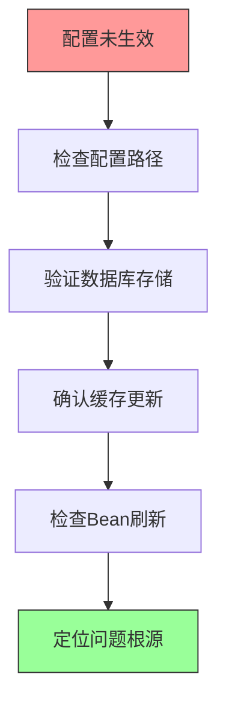

**2. 缓存不一致**

**症状**: 不同请求获取到的配置值不一致

**排查步骤**:
- 检查`ConcurrentHashMap`的线程安全性
- 验证缓存更新逻辑是否正确执行
- 检查是否有多个`ConfigService`实例

**3. 配置丢失**

**症状**: 重启后配置恢复到默认值

**排查步骤**:
- 检查数据库连接是否正常
- 验证`ConfigAppStartupListener`是否正确执行
- 确认`@Transactional`注解是否正确使用

### 日志分析

充分利用系统日志进行故障排查：

```java
// 在ConfigService中添加详细日志
log.info("Updating config: {} = {}", configPath, newValue);
log.debug("Creating new config: {}", configPath);
log.warn("Config not found: {}", configPath);
log.error("Failed to set field value", e);
```

关键日志点：
- 配置更新操作
- 缓存操作
- 数据库操作
- 异常处理

### 监控指标

建立以下监控指标：

| 指标 | 目的 | 阈值 |
|------|------|------|
| cache.hit.rate | 缓存命中率 | >90% |
| config.access.latency | 配置访问延迟 | <10ms |
| database.query.count | 数据库查询次数 | 异常增长 |
| event.processing.time | 事件处理时间 | <100ms |

### 调试工具

1. **配置管理API**: 提供REST API用于查询和修改配置
2. **管理界面**: 提供Web界面查看和编辑配置
3. **健康检查**: 添加配置系统健康检查端点

**故障排查流程**
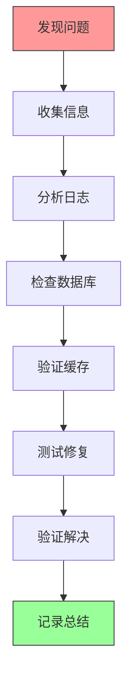

**图示来源**
- [ConfigService.java](file://src/main/java/com/alibaba/cloud/ai/lynxe/config/ConfigService.java)
- [ConfigAppStartupListener.java](file://src/main/java/com/alibaba/cloud/ai/lynxe/config/startUp/ConfigAppStartupListener.java)

**本节来源**
- [ConfigService.java](file://src/main/java/com/alibaba/cloud/ai/lynxe/config/ConfigService.java)
- [ConfigAppStartupListener.java](file://src/main/java/com/alibaba/cloud/ai/lynxe/config/startUp/ConfigAppStartupListener.java)
- [ConfigRepository.java](file://src/main/java/com/alibaba/cloud/ai/lynxe/config/repository/ConfigRepository.java)

## 结论

JManus的运行时配置管理机制通过`ConfigCacheEntry`、`ConfigAppStartupListener`、`ConfigProperty`和`LynxeProperties`等核心组件，构建了一个高效、可靠、可扩展的配置管理系统。该系统实现了配置的内存缓存、启动初始化、依赖注入、热更新和事件通知等关键功能，为应用的稳定运行提供了坚实的基础。

主要特点总结：
- **高性能**: 通过内存缓存减少数据库访问
- **高可用**: 支持配置热更新，无需重启应用
- **易用性**: 通过注解实现配置的依赖注入
- **可维护性**: 集中管理顶层配置属性
- **可扩展性**: 基于事件机制的通知系统

该配置管理机制不仅满足了当前系统的需求，也为未来的功能扩展提供了良好的架构基础。通过遵循本文档中的性能优化建议和故障排查指南，可以进一步提升系统的稳定性和性能表现。