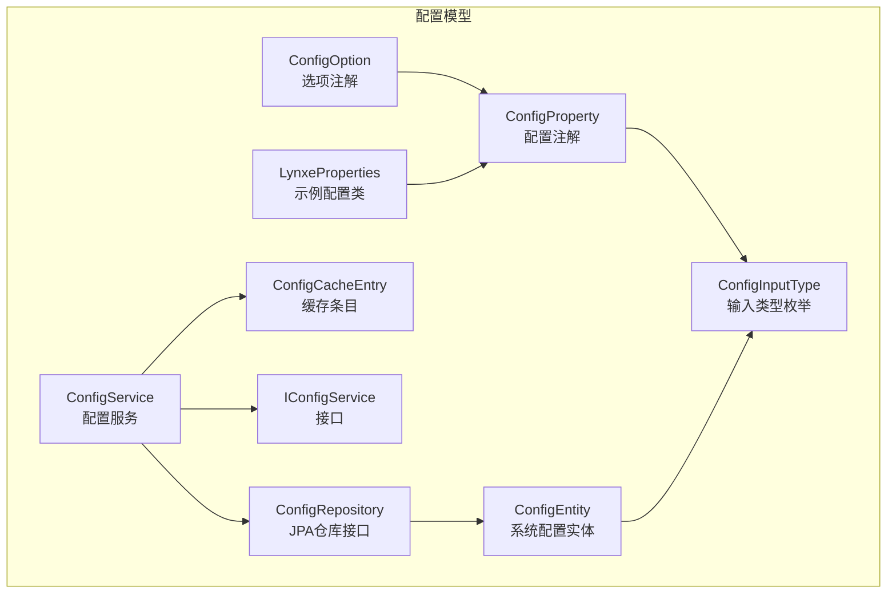
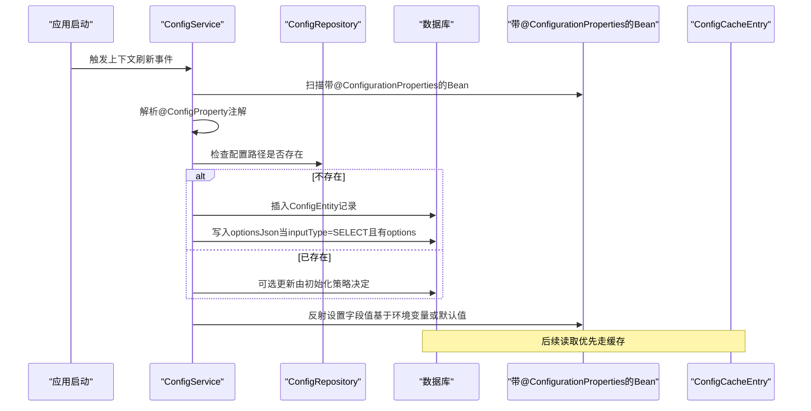
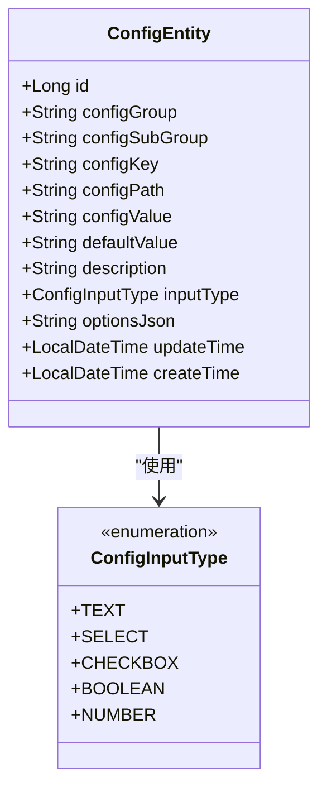
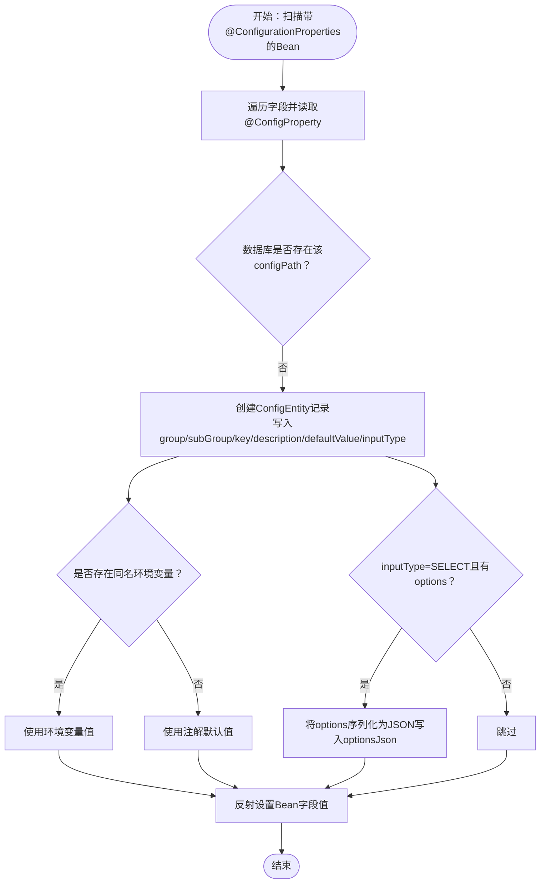
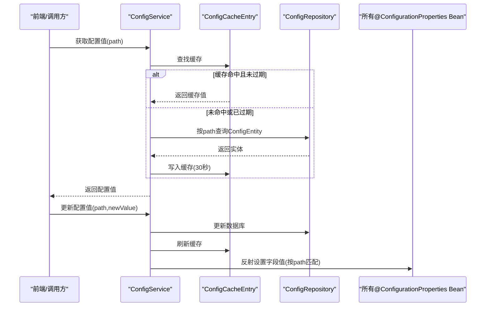
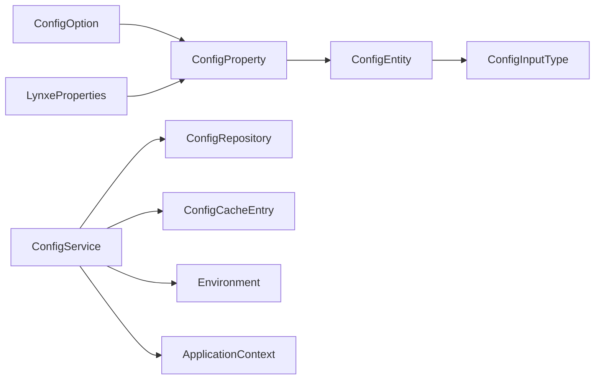

# 配置模型

<cite>
**本文引用的文件**
- [ConfigEntity.java](file://src/main/java/com/alibaba/cloud/ai/lynxe/config/entity/ConfigEntity.java)
- [ConfigInputType.java](file://src/main/java/com/alibaba/cloud/ai/lynxe/config/entity/ConfigInputType.java)
- [ConfigProperty.java](file://src/main/java/com/alibaba/cloud/ai/lynxe/config/ConfigProperty.java)
- [ConfigOption.java](file://src/main/java/com/alibaba/cloud/ai/lynxe/config/ConfigOption.java)
- [ConfigService.java](file://src/main/java/com/alibaba/cloud/ai/lynxe/config/ConfigService.java)
- [ConfigRepository.java](file://src/main/java/com/alibaba/cloud/ai/lynxe/config/repository/ConfigRepository.java)
- [IConfigService.java](file://src/main/java/com/alibaba/cloud/ai/lynxe/config/IConfigService.java)
- [ConfigCacheEntry.java](file://src/main/java/com/alibaba/cloud/ai/lynxe/config/ConfigCacheEntry.java)
- [LynxeProperties.java](file://src/main/java/com/alibaba/cloud/ai/lynxe/config/LynxeProperties.java)
</cite>

## 目录
1. [简介](#简介)
2. [项目结构](#项目结构)
3. [核心组件](#核心组件)
4. [架构总览](#架构总览)
5. [详细组件分析](#详细组件分析)
6. [依赖关系分析](#依赖关系分析)
7. [性能与一致性](#性能与一致性)
8. [故障排查指南](#故障排查指南)
9. [结论](#结论)
10. [附录](#附录)

## 简介
本文件面向JManus配置数据模型，系统性梳理ConfigEntity实体类的结构设计与运行机制，重点解释以下方面：
- 配置唯一路径的设计原理与作用
- 配置分组与子分组的组织方式
- 核心字段语义：配置路径、配置分组、配置键值、配置值、默认值、输入类型、选项定义
- ConfigInputType枚举支持的输入控件类型及前端渲染逻辑
- 如何通过注解定义新配置项及其约束条件
- 配置选项（ConfigOption）对动态下拉列表与范围限制的支持
- 最佳实践与数据一致性保障机制

## 项目结构
配置模型位于后端模块的config包中，采用“注解驱动 + 实体持久化 + 服务层缓存 + 控制器访问”的分层设计。核心文件如下：
- 实体层：ConfigEntity、ConfigInputType
- 注解层：ConfigProperty、ConfigOption
- 仓储层：ConfigRepository
- 服务层：ConfigService、IConfigService、ConfigCacheEntry
- 使用示例：LynxeProperties（通过@ConfigurationProperties装配）

图表来源
- [ConfigEntity.java](file://src/main/java/com/alibaba/cloud/ai/lynxe/config/entity/ConfigEntity.java#L1-L218)
- [ConfigInputType.java](file://src/main/java/com/alibaba/cloud/ai/lynxe/config/entity/ConfigInputType.java#L1-L46)
- [ConfigProperty.java](file://src/main/java/com/alibaba/cloud/ai/lynxe/config/ConfigProperty.java#L1-L89)
- [ConfigOption.java](file://src/main/java/com/alibaba/cloud/ai/lynxe/config/ConfigOption.java#L1-L64)
- [ConfigRepository.java](file://src/main/java/com/alibaba/cloud/ai/lynxe/config/repository/ConfigRepository.java#L1-L101)
- [ConfigService.java](file://src/main/java/com/alibaba/cloud/ai/lynxe/config/ConfigService.java#L1-L320)
- [IConfigService.java](file://src/main/java/com/alibaba/cloud/ai/lynxe/config/IConfigService.java#L1-L81)
- [ConfigCacheEntry.java](file://src/main/java/com/alibaba/cloud/ai/lynxe/config/ConfigCacheEntry.java#L1-L45)
- [LynxeProperties.java](file://src/main/java/com/alibaba/cloud/ai/lynxe/config/LynxeProperties.java#L1-L552)

章节来源
- [ConfigEntity.java](file://src/main/java/com/alibaba/cloud/ai/lynxe/config/entity/ConfigEntity.java#L1-L218)
- [ConfigProperty.java](file://src/main/java/com/alibaba/cloud/ai/lynxe/config/ConfigProperty.java#L1-L89)
- [ConfigOption.java](file://src/main/java/com/alibaba/cloud/ai/lynxe/config/ConfigOption.java#L1-L64)
- [ConfigRepository.java](file://src/main/java/com/alibaba/cloud/ai/lynxe/config/repository/ConfigRepository.java#L1-L101)
- [ConfigService.java](file://src/main/java/com/alibaba/cloud/ai/lynxe/config/ConfigService.java#L1-L320)
- [IConfigService.java](file://src/main/java/com/alibaba/cloud/ai/lynxe/config/IConfigService.java#L1-L81)
- [ConfigCacheEntry.java](file://src/main/java/com/alibaba/cloud/ai/lynxe/config/ConfigCacheEntry.java#L1-L45)
- [LynxeProperties.java](file://src/main/java/com/alibaba/cloud/ai/lynxe/config/LynxeProperties.java#L1-L552)

## 核心组件
- ConfigEntity：系统配置实体，承载配置的分组、键值、路径、值、默认值、输入类型、选项JSON、时间戳等信息，并通过JPA映射到system_config表。
- ConfigInputType：输入类型枚举，定义TEXT、SELECT、CHECKBOX、BOOLEAN、NUMBER五种输入控件类型。
- ConfigProperty：配置注解，用于在字段上声明配置的三段式分组、键名、完整路径、默认值、描述、输入类型、选项集合等元数据。
- ConfigOption：选项注解，用于为SELECT等控件定义可选项（值、标签、描述、图标、禁用状态），支持国际化键格式。
- ConfigRepository：基于JPA的配置数据访问接口，提供按路径、分组、子分组查询、存在性检查、批量更新等能力。
- ConfigService：配置服务实现，负责初始化配置、读取/更新配置值、批量更新、重置默认值、清理过时配置、类型转换与缓存管理。
- IConfigService：配置服务接口，保证Spring原生镜像模式下的代理兼容性。
- ConfigCacheEntry：轻量级缓存条目，带过期时间，提升高频读取性能。
- LynxeProperties：示例配置类，通过@ConfigurationProperties装配，内部大量使用@ConfigProperty标注具体配置项，展示从注解到数据库再到运行时属性的全链路。

章节来源
- [ConfigEntity.java](file://src/main/java/com/alibaba/cloud/ai/lynxe/config/entity/ConfigEntity.java#L1-L218)
- [ConfigInputType.java](file://src/main/java/com/alibaba/cloud/ai/lynxe/config/entity/ConfigInputType.java#L1-L46)
- [ConfigProperty.java](file://src/main/java/com/alibaba/cloud/ai/lynxe/config/ConfigProperty.java#L1-L89)
- [ConfigOption.java](file://src/main/java/com/alibaba/cloud/ai/lynxe/config/ConfigOption.java#L1-L64)
- [ConfigRepository.java](file://src/main/java/com/alibaba/cloud/ai/lynxe/config/repository/ConfigRepository.java#L1-L101)
- [ConfigService.java](file://src/main/java/com/alibaba/cloud/ai/lynxe/config/ConfigService.java#L1-L320)
- [IConfigService.java](file://src/main/java/com/alibaba/cloud/ai/lynxe/config/IConfigService.java#L1-L81)
- [ConfigCacheEntry.java](file://src/main/java/com/alibaba/cloud/ai/lynxe/config/ConfigCacheEntry.java#L1-L45)
- [LynxeProperties.java](file://src/main/java/com/alibaba/cloud/ai/lynxe/config/LynxeProperties.java#L1-L552)

## 架构总览
配置模型的运行流程如下：
- 应用启动时，ConfigService扫描带有@ConfigurationProperties的Bean，解析其中的@ConfigProperty注解，生成或更新数据库中的ConfigEntity记录；同时将注解的options转换为JSON存储于optionsJson字段。
- 运行时，业务类通过IConfigService读取配置值；ConfigService优先从内存缓存命中，未命中则查询数据库并写入缓存。
- 更新配置时，ConfigService更新数据库并同步刷新所有使用该配置的Bean字段值；支持批量更新与全部重置为默认值。
- ConfigRepository提供丰富的查询方法，包括按路径、分组、子分组、路径集合查询，以及分组聚合查询。

图表来源
- [ConfigService.java](file://src/main/java/com/alibaba/cloud/ai/lynxe/config/ConfigService.java#L67-L163)
- [ConfigRepository.java](file://src/main/java/com/alibaba/cloud/ai/lynxe/config/repository/ConfigRepository.java#L31-L101)
- [LynxeProperties.java](file://src/main/java/com/alibaba/cloud/ai/lynxe/config/LynxeProperties.java#L1-L552)

## 详细组件分析

### ConfigEntity实体类结构设计
- 表映射：实体映射到system_config表，主键自增。
- 唯一路径：configPath字段非空且唯一，作为配置的全局唯一标识，确保同一配置项在系统内只有一份定义。
- 分组与键：configGroup、configSubGroup、configKey构成三层分组体系，便于前端分类展示与管理。
- 值域：configValue与defaultValue均为字符串存储，配合ConfigService进行类型转换；description用于UI提示与国际化。
- 输入类型：inputType为枚举字段，对应ConfigInputType，决定前端渲染控件类型。
- 选项定义：optionsJson以JSON字符串存储SELECT等类型的选项集合，供前端动态渲染。
- 时间戳：createTime与updateTime分别在持久化前与更新前自动填充，便于审计与缓存失效策略。

图表来源
- [ConfigEntity.java](file://src/main/java/com/alibaba/cloud/ai/lynxe/config/entity/ConfigEntity.java#L1-L218)
- [ConfigInputType.java](file://src/main/java/com/alibaba/cloud/ai/lynxe/config/entity/ConfigInputType.java#L1-L46)

章节来源
- [ConfigEntity.java](file://src/main/java/com/alibaba/cloud/ai/lynxe/config/entity/ConfigEntity.java#L33-L118)
- [ConfigInputType.java](file://src/main/java/com/alibaba/cloud/ai/lynxe/config/entity/ConfigInputType.java#L18-L46)

### 配置唯一路径的设计原理与作用
- 设计原理：以configPath作为全局唯一键，避免同名配置在不同分组下产生歧义；同时允许通过环境变量或默认值初始化，保证部署灵活性。
- 作用：
  - 数据一致性：唯一索引防止重复配置。
  - 查询效率：按路径查询是高频操作，唯一索引+缓存可显著降低延迟。
  - 管理清晰：统一的命名空间便于前端分组展示与用户理解。
  - 变更追踪：时间戳字段便于审计与缓存失效控制。

章节来源
- [ConfigEntity.java](file://src/main/java/com/alibaba/cloud/ai/lynxe/config/entity/ConfigEntity.java#L60-L65)
- [ConfigRepository.java](file://src/main/java/com/alibaba/cloud/ai/lynxe/config/repository/ConfigRepository.java#L34-L40)

### ConfigInputType枚举与前端渲染逻辑
- 支持类型：
  - TEXT：文本输入框
  - SELECT：下拉选择框，需配合optionsJson使用
  - CHECKBOX：多选框（通常用于布尔场景）
  - BOOLEAN：单选布尔（是/否）
  - NUMBER：数值输入框
- 前端渲染逻辑（概念说明）：
  - 根据inputType选择控件类型；
  - 若为SELECT，则解析optionsJson为选项数组，支持label、icon、disabled等字段；
  - 数字类型支持min/max范围限制（范围限制由前端校验或后端在业务层约束）；
  - 布尔类型通常映射为开关或单选按钮。

章节来源
- [ConfigInputType.java](file://src/main/java/com/alibaba/cloud/ai/lynxe/config/entity/ConfigInputType.java#L18-L46)
- [ConfigProperty.java](file://src/main/java/com/alibaba/cloud/ai/lynxe/config/ConfigProperty.java#L74-L88)
- [ConfigOption.java](file://src/main/java/com/alibaba/cloud/ai/lynxe/config/ConfigOption.java#L30-L64)

### 通过注解定义新的配置项及其约束条件
- 定义步骤：
  1) 在带@ConfigurationProperties的类中添加字段，并使用@ConfigProperty标注：
     - group/subGroup/key：三层分组与键名
     - path：完整配置路径（与configPath一致）
     - description：描述（支持国际化键）
     - defaultValue：默认值
     - inputType：输入类型
     - options：仅当inputType=SELECT时有效
  2) 启动时，ConfigService扫描该Bean，若数据库不存在对应路径的配置，则创建ConfigEntity记录，并将options转换为JSON写入optionsJson。
  3) 若存在环境变量与path同名的键，优先使用环境变量值；否则回退到默认值。
- 约束条件：
  - configPath必须唯一
  - configGroup/configSubGroup/configKey均不可为空
  - inputType与字段类型需匹配（服务层会进行类型转换）

图表来源
- [ConfigService.java](file://src/main/java/com/alibaba/cloud/ai/lynxe/config/ConfigService.java#L67-L163)
- [ConfigProperty.java](file://src/main/java/com/alibaba/cloud/ai/lynxe/config/ConfigProperty.java#L37-L89)
- [ConfigOption.java](file://src/main/java/com/alibaba/cloud/ai/lynxe/config/ConfigOption.java#L30-L64)

章节来源
- [ConfigService.java](file://src/main/java/com/alibaba/cloud/ai/lynxe/config/ConfigService.java#L67-L163)
- [ConfigProperty.java](file://src/main/java/com/alibaba/cloud/ai/lynxe/config/ConfigProperty.java#L37-L89)
- [ConfigOption.java](file://src/main/java/com/alibaba/cloud/ai/lynxe/config/ConfigOption.java#L30-L64)

### 配置选项（ConfigOption）与动态下拉列表
- ConfigOption定义了单个选项的值、标签、描述、图标与禁用状态；支持国际化键格式，便于前端本地化展示。
- 当inputType=SELECT时，ConfigService会将注解中的ConfigOption[]转换为JSON字符串写入ConfigEntity.optionsJson，前端据此渲染动态下拉列表。
- 范围限制（如最小/最大值）通常由前端校验或业务层在保存时验证，不直接存储在optionsJson中。

章节来源
- [ConfigOption.java](file://src/main/java/com/alibaba/cloud/ai/lynxe/config/ConfigOption.java#L30-L64)
- [ConfigService.java](file://src/main/java/com/alibaba/cloud/ai/lynxe/config/ConfigService.java#L134-L153)

### 读取、更新与缓存机制
- 读取：ConfigService.getConfigValue优先从ConfigCacheEntry缓存命中；未命中则查询数据库并写入缓存（30秒过期）。
- 更新：ConfigService.updateConfig原子性更新数据库并刷新缓存，随后遍历所有带@ConfigurationProperties的Bean，通过反射将新值转换为目标类型并注入对应字段。
- 类型转换：支持String、Boolean（含"on"特殊值）、Integer、Long、Double、Float等常见类型。
- 批量更新与重置：支持按实体列表批量更新值，并同步刷新所有使用该配置的Bean；支持重置单个配置或全部配置为默认值。

图表来源
- [ConfigService.java](file://src/main/java/com/alibaba/cloud/ai/lynxe/config/ConfigService.java#L165-L218)
- [ConfigCacheEntry.java](file://src/main/java/com/alibaba/cloud/ai/lynxe/config/ConfigCacheEntry.java#L18-L45)
- [ConfigRepository.java](file://src/main/java/com/alibaba/cloud/ai/lynxe/config/repository/ConfigRepository.java#L84-L101)

章节来源
- [ConfigService.java](file://src/main/java/com/alibaba/cloud/ai/lynxe/config/ConfigService.java#L165-L218)
- [ConfigCacheEntry.java](file://src/main/java/com/alibaba/cloud/ai/lynxe/config/ConfigCacheEntry.java#L18-L45)
- [ConfigRepository.java](file://src/main/java/com/alibaba/cloud/ai/lynxe/config/repository/ConfigRepository.java#L84-L101)

### 示例：如何在LynxeProperties中新增配置项
- 在LynxeProperties中添加一个带@ConfigProperty的字段，指定group、subGroup、key、path、description、defaultValue、inputType与options（如适用）。
- 启动时，ConfigService会检测该配置是否已在数据库中存在；不存在则创建并写入optionsJson；存在则按策略处理。
- 业务类通过IConfigService读取配置值，ConfigService会根据环境变量或默认值进行初始化。

章节来源
- [LynxeProperties.java](file://src/main/java/com/alibaba/cloud/ai/lynxe/config/LynxeProperties.java#L37-L42)
- [LynxeProperties.java](file://src/main/java/com/alibaba/cloud/ai/lynxe/config/LynxeProperties.java#L57-L60)
- [ConfigService.java](file://src/main/java/com/alibaba/cloud/ai/lynxe/config/ConfigService.java#L106-L163)

## 依赖关系分析
- 组件耦合：
  - ConfigService依赖ConfigRepository、ApplicationContext、Environment与ConfigCacheEntry，承担初始化、读取、更新、缓存与类型转换职责。
  - ConfigEntity依赖ConfigInputType，形成稳定的实体-枚举关系。
  - ConfigProperty与ConfigOption为注解层，贯穿初始化阶段，决定数据库记录与前端渲染。
  - LynxeProperties作为示例Bean，体现注解到运行时属性的映射过程。
- 外部依赖：
  - JPA/Hibernate用于实体持久化
  - Spring Environment用于读取环境变量
  - 反射用于Bean字段赋值

图表来源
- [ConfigService.java](file://src/main/java/com/alibaba/cloud/ai/lynxe/config/ConfigService.java#L1-L320)
- [ConfigRepository.java](file://src/main/java/com/alibaba/cloud/ai/lynxe/config/repository/ConfigRepository.java#L1-L101)
- [ConfigEntity.java](file://src/main/java/com/alibaba/cloud/ai/lynxe/config/entity/ConfigEntity.java#L1-L218)
- [ConfigInputType.java](file://src/main/java/com/alibaba/cloud/ai/lynxe/config/entity/ConfigInputType.java#L1-L46)
- [ConfigProperty.java](file://src/main/java/com/alibaba/cloud/ai/lynxe/config/ConfigProperty.java#L1-L89)
- [ConfigOption.java](file://src/main/java/com/alibaba/cloud/ai/lynxe/config/ConfigOption.java#L1-L64)
- [LynxeProperties.java](file://src/main/java/com/alibaba/cloud/ai/lynxe/config/LynxeProperties.java#L1-L552)

章节来源
- [ConfigService.java](file://src/main/java/com/alibaba/cloud/ai/lynxe/config/ConfigService.java#L1-L320)
- [ConfigRepository.java](file://src/main/java/com/alibaba/cloud/ai/lynxe/config/repository/ConfigRepository.java#L1-L101)
- [ConfigEntity.java](file://src/main/java/com/alibaba/cloud/ai/lynxe/config/entity/ConfigEntity.java#L1-L218)
- [ConfigInputType.java](file://src/main/java/com/alibaba/cloud/ai/lynxe/config/entity/ConfigInputType.java#L1-L46)
- [ConfigProperty.java](file://src/main/java/com/alibaba/cloud/ai/lynxe/config/ConfigProperty.java#L1-L89)
- [ConfigOption.java](file://src/main/java/com/alibaba/cloud/ai/lynxe/config/ConfigOption.java#L1-L64)
- [LynxeProperties.java](file://src/main/java/com/alibaba/cloud/ai/lynxe/config/LynxeProperties.java#L1-L552)

## 性能与一致性
- 性能特性：
  - 缓存：ConfigCacheEntry提供30秒过期的轻量缓存，显著降低高频读取的数据库压力。
  - 批量查询：ConfigRepository提供findByConfigPathIn，支持一次性批量获取多个配置项。
  - 类型转换：在ConfigService中集中处理，避免分散逻辑带来的重复开销。
- 一致性保障：
  - 唯一路径：configPath唯一索引确保全局唯一性。
  - 初始化策略：启动时清理过时配置，避免历史冗余。
  - 原子更新：更新配置时先写数据库再刷新缓存，最后反射更新Bean，保证最终一致性。
  - 默认值回退：未找到配置值时回退到默认值，避免空值传播。

章节来源
- [ConfigCacheEntry.java](file://src/main/java/com/alibaba/cloud/ai/lynxe/config/ConfigCacheEntry.java#L18-L45)
- [ConfigRepository.java](file://src/main/java/com/alibaba/cloud/ai/lynxe/config/repository/ConfigRepository.java#L94-L101)
- [ConfigService.java](file://src/main/java/com/alibaba/cloud/ai/lynxe/config/ConfigService.java#L83-L111)
- [ConfigEntity.java](file://src/main/java/com/alibaba/cloud/ai/lynxe/config/entity/ConfigEntity.java#L60-L65)

## 故障排查指南
- 配置未生效：
  - 检查configPath是否唯一且正确；确认数据库中是否存在对应记录。
  - 检查环境变量中是否存在与path同名的键，若存在将覆盖默认值。
- 下拉列表不显示：
  - 确认inputType=SELECT且options数组非空；检查optionsJson是否正确写入。
- 更新后Bean未刷新：
  - 确认该字段所在Bean带有@ConfigurationProperties注解；检查字段是否可被反射访问（建议使用public getter/setter或设置可访问）。
- 类型转换异常：
  - 检查目标字段类型与传入字符串是否兼容；服务层对Boolean、数值类型有特定转换规则。

章节来源
- [ConfigService.java](file://src/main/java/com/alibaba/cloud/ai/lynxe/config/ConfigService.java#L182-L218)
- [ConfigRepository.java](file://src/main/java/com/alibaba/cloud/ai/lynxe/config/repository/ConfigRepository.java#L34-L40)
- [ConfigProperty.java](file://src/main/java/com/alibaba/cloud/ai/lynxe/config/ConfigProperty.java#L74-L88)

## 结论
JManus配置模型通过“注解 + 实体 + 仓储 + 服务 + 缓存”的分层设计，实现了配置的声明式定义、持久化存储、运行时注入与高效缓存。ConfigEntity的唯一路径设计确保了全局一致性；ConfigInputType与ConfigOption为前端渲染提供了完备的元数据支持；ConfigService在启动初始化、运行时读取与更新、类型转换与缓存管理等方面提供了稳健的实现。结合最佳实践与一致性保障机制，可在复杂业务场景中安全、稳定地管理配置。

## 附录
- 最佳实践：
  - 使用明确的三层分组（group/subGroup/key）命名规范，保持路径可读性与可维护性。
  - 对于SELECT类型，尽量提供完整的options数组并启用国际化键，提升用户体验。
  - 为每个配置提供合理的默认值与描述，便于首次部署与运维理解。
  - 避免在运行时频繁修改同一配置，减少缓存失效与Bean刷新带来的抖动。
  - 对于数值范围限制，建议在业务层或前端校验，而非依赖optionsJson。
- 数据一致性保障：
  - 唯一路径约束
  - 启动时清理过时配置
  - 原子更新与缓存同步
  - 默认值回退与类型转换