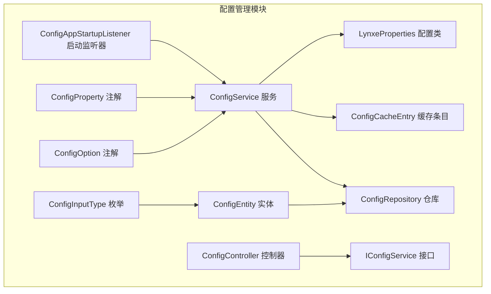
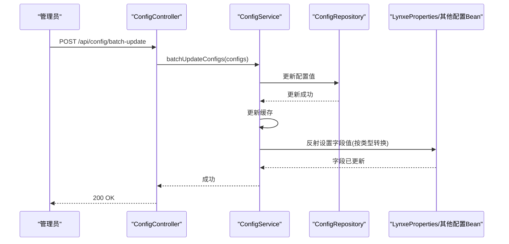
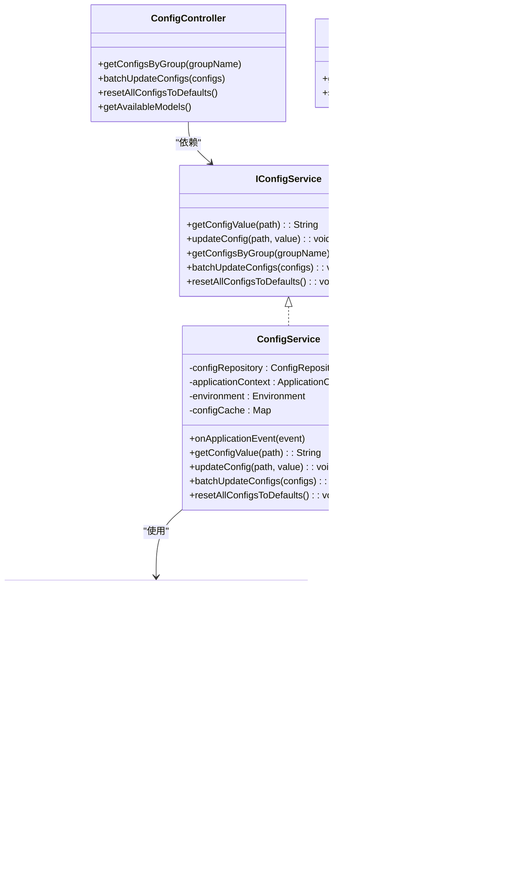
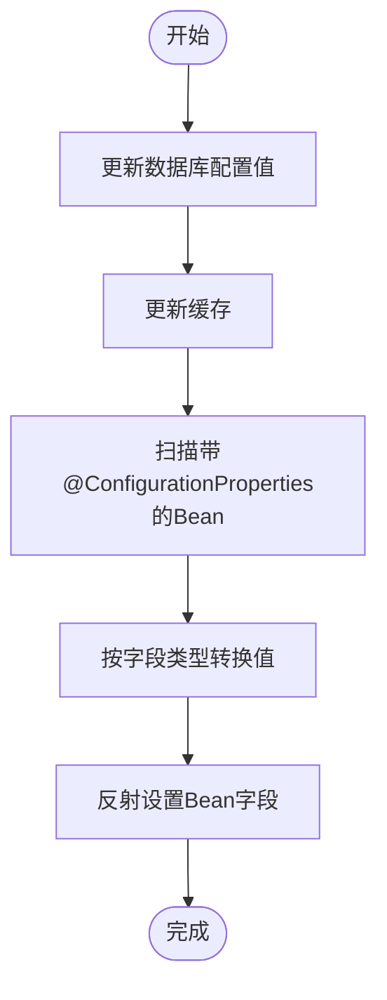

# 配置管理

<cite>
**本文引用的文件列表**
- [ConfigEntity.java](file://src/main/java/com/alibaba/cloud/ai/lynxe/config/entity/ConfigEntity.java)
- [ConfigInputType.java](file://src/main/java/com/alibaba/cloud/ai/lynxe/config/entity/ConfigInputType.java)
- [ConfigRepository.java](file://src/main/java/com/alibaba/cloud/ai/lynxe/config/repository/ConfigRepository.java)
- [ConfigService.java](file://src/main/java/com/alibaba/cloud/ai/lynxe/config/ConfigService.java)
- [IConfigService.java](file://src/main/java/com/alibaba/cloud/ai/lynxe/config/IConfigService.java)
- [ConfigController.java](file://src/main/java/com/alibaba/cloud/ai/lynxe/config/ConfigController.java)
- [ConfigProperty.java](file://src/main/java/com/alibaba/cloud/ai/lynxe/config/ConfigProperty.java)
- [ConfigOption.java](file://src/main/java/com/alibaba/cloud/ai/lynxe/config/ConfigOption.java)
- [ConfigCacheEntry.java](file://src/main/java/com/alibaba/cloud/ai/lynxe/config/ConfigCacheEntry.java)
- [ConfigAppStartupListener.java](file://src/main/java/com/alibaba/cloud/ai/lynxe/config/startUp/ConfigAppStartupListener.java)
- [LynxeProperties.java](file://src/main/java/com/alibaba/cloud/ai/lynxe/config/LynxeProperties.java)
- [application.yml](file://src/main/resources/application.yml)
- [ModelChangeEvent.java](file://src/main/java/com/alibaba/cloud/ai/lynxe/event/ModelChangeEvent.java)
- [LynxeEventPublisher.java](file://src/main/java/com/alibaba/cloud/ai/lynxe/event/LynxeEventPublisher.java)
- [LynxeListener.java](file://src/main/java/com/alibaba/cloud/ai/lynxe/event/LynxeListener.java)
</cite>

## 目录
1. [简介](#简介)
2. [项目结构](#项目结构)
3. [核心组件](#核心组件)
4. [架构总览](#架构总览)
5. [详细组件分析](#详细组件分析)
6. [依赖关系分析](#依赖关系分析)
7. [性能与缓存特性](#性能与缓存特性)
8. [故障排查指南](#故障排查指南)
9. [结论](#结论)
10. [附录](#附录)

## 简介
本文件面向JManus配置管理系统，围绕ConfigEntity实体类的数据库结构、ConfigService的服务能力、ConfigController的REST接口，以及配置的层次化组织与唯一路径设计进行深入解析。同时，结合ConfigProperty注解与LynxeProperties配置类，说明如何声明新配置项、设置默认值、管理下拉选项；并通过ConfigService的运行时热更新机制，解释配置变更后的应用内即时生效流程。最后给出最佳实践与安全注意事项，帮助读者在生产环境中稳定、安全地使用配置管理能力。

## 项目结构
配置管理相关代码主要位于后端模块的config包中，包含实体、仓库、服务、控制器、启动监听器及配置属性类等。前端UI侧也提供了配置页面，用于可视化管理配置项。

图表来源
- [ConfigEntity.java](file://src/main/java/com/alibaba/cloud/ai/lynxe/config/entity/ConfigEntity.java#L1-L218)
- [ConfigInputType.java](file://src/main/java/com/alibaba/cloud/ai/lynxe/config/entity/ConfigInputType.java#L1-L46)
- [ConfigRepository.java](file://src/main/java/com/alibaba/cloud/ai/lynxe/config/repository/ConfigRepository.java#L1-L101)
- [ConfigService.java](file://src/main/java/com/alibaba/cloud/ai/lynxe/config/ConfigService.java#L1-L320)
- [IConfigService.java](file://src/main/java/com/alibaba/cloud/ai/lynxe/config/IConfigService.java#L1-L81)
- [ConfigController.java](file://src/main/java/com/alibaba/cloud/ai/lynxe/config/ConfigController.java#L1-L82)
- [ConfigProperty.java](file://src/main/java/com/alibaba/cloud/ai/lynxe/config/ConfigProperty.java#L1-L89)
- [ConfigOption.java](file://src/main/java/com/alibaba/cloud/ai/lynxe/config/ConfigOption.java#L1-L64)
- [ConfigCacheEntry.java](file://src/main/java/com/alibaba/cloud/ai/lynxe/config/ConfigCacheEntry.java#L1-L45)
- [ConfigAppStartupListener.java](file://src/main/java/com/alibaba/cloud/ai/lynxe/config/startUp/ConfigAppStartupListener.java#L1-L84)
- [LynxeProperties.java](file://src/main/java/com/alibaba/cloud/ai/lynxe/config/LynxeProperties.java#L1-L552)

章节来源
- [ConfigEntity.java](file://src/main/java/com/alibaba/cloud/ai/lynxe/config/entity/ConfigEntity.java#L1-L218)
- [ConfigRepository.java](file://src/main/java/com/alibaba/cloud/ai/lynxe/config/repository/ConfigRepository.java#L1-L101)
- [ConfigService.java](file://src/main/java/com/alibaba/cloud/ai/lynxe/config/ConfigService.java#L1-L320)
- [ConfigController.java](file://src/main/java/com/alibaba/cloud/ai/lynxe/config/ConfigController.java#L1-L82)
- [ConfigProperty.java](file://src/main/java/com/alibaba/cloud/ai/lynxe/config/ConfigProperty.java#L1-L89)
- [ConfigOption.java](file://src/main/java/com/alibaba/cloud/ai/lynxe/config/ConfigOption.java#L1-L64)
- [ConfigCacheEntry.java](file://src/main/java/com/alibaba/cloud/ai/lynxe/config/ConfigCacheEntry.java#L1-L45)
- [ConfigAppStartupListener.java](file://src/main/java/com/alibaba/cloud/ai/lynxe/config/startUp/ConfigAppStartupListener.java#L1-L84)
- [LynxeProperties.java](file://src/main/java/com/alibaba/cloud/ai/lynxe/config/LynxeProperties.java#L1-L552)
- [application.yml](file://src/main/resources/application.yml#L1-L98)

## 核心组件
- ConfigEntity：系统配置的持久化实体，定义了配置分组、子分组、键、完整路径、值、默认值、描述、输入类型、选项JSON、创建/更新时间等字段。
- ConfigInputType：配置输入类型的枚举，支持文本、下拉、多选、布尔、数字等。
- ConfigRepository：基于JPA的数据访问层，提供按路径查询、按分组查询、批量更新、存在性检查等方法。
- ConfigService：配置服务的核心实现，负责初始化配置、读取配置、更新配置、重置配置、批量更新、清理过时配置、运行时热更新到Spring配置类。
- IConfigService：配置服务接口，定义对外暴露的能力。
- ConfigController：REST控制器，提供按分组查询、批量更新、重置全部为默认值等接口。
- ConfigProperty：声明式配置注解，用于在配置类中声明配置项的分组、子分组、键、路径、描述、默认值、输入类型、选项等。
- ConfigOption：配置选项注解，用于为下拉/单选/多选等输入类型提供选项集合。
- ConfigCacheEntry：轻量级缓存条目，带过期时间，提升读取性能。
- ConfigAppStartupListener：应用启动监听器，用于统计配置数量、检测自定义值配置等。
- LynxeProperties：Spring配置类，通过@ConfigProperty注解声明大量配置项，并通过IConfigService读取数据库中的值，实现运行时热更新。

章节来源
- [ConfigEntity.java](file://src/main/java/com/alibaba/cloud/ai/lynxe/config/entity/ConfigEntity.java#L1-L218)
- [ConfigInputType.java](file://src/main/java/com/alibaba/cloud/ai/lynxe/config/entity/ConfigInputType.java#L1-L46)
- [ConfigRepository.java](file://src/main/java/com/alibaba/cloud/ai/lynxe/config/repository/ConfigRepository.java#L1-L101)
- [ConfigService.java](file://src/main/java/com/alibaba/cloud/ai/lynxe/config/ConfigService.java#L1-L320)
- [IConfigService.java](file://src/main/java/com/alibaba/cloud/ai/lynxe/config/IConfigService.java#L1-L81)
- [ConfigController.java](file://src/main/java/com/alibaba/cloud/ai/lynxe/config/ConfigController.java#L1-L82)
- [ConfigProperty.java](file://src/main/java/com/alibaba/cloud/ai/lynxe/config/ConfigProperty.java#L1-L89)
- [ConfigOption.java](file://src/main/java/com/alibaba/cloud/ai/lynxe/config/ConfigOption.java#L1-L64)
- [ConfigCacheEntry.java](file://src/main/java/com/alibaba/cloud/ai/lynxe/config/ConfigCacheEntry.java#L1-L45)
- [ConfigAppStartupListener.java](file://src/main/java/com/alibaba/cloud/ai/lynxe/config/startUp/ConfigAppStartupListener.java#L1-L84)
- [LynxeProperties.java](file://src/main/java/com/alibaba/cloud/ai/lynxe/config/LynxeProperties.java#L1-L552)

## 架构总览
配置管理采用“注解声明 + 数据库持久化 + 运行时热更新”的架构模式：
- 在配置类中通过@ConfigProperty声明配置项，包括分组、子分组、键、完整路径、默认值、输入类型、选项等。
- 应用启动时，ConfigService扫描带有@ConfigurationProperties的Bean，初始化缺失的配置项到数据库，并从环境变量或默认值填充初始值。
- 运行时通过ConfigController提供REST接口，允许用户批量更新配置；ConfigService在更新数据库后，将新值转换类型并回填到对应Bean字段，实现热更新。
- ConfigCacheEntry提供短时缓存，降低频繁读取数据库的压力。

图表来源
- [ConfigController.java](file://src/main/java/com/alibaba/cloud/ai/lynxe/config/ConfigController.java#L1-L82)
- [ConfigService.java](file://src/main/java/com/alibaba/cloud/ai/lynxe/config/ConfigService.java#L1-L320)
- [ConfigRepository.java](file://src/main/java/com/alibaba/cloud/ai/lynxe/config/repository/ConfigRepository.java#L1-L101)
- [LynxeProperties.java](file://src/main/java/com/alibaba/cloud/ai/lynxe/config/LynxeProperties.java#L1-L552)

## 详细组件分析

### ConfigEntity 实体与数据库结构
- 表名：system_config
- 关键字段
  - 配置分组与子分组：configGroup、configSubGroup
  - 配置键与完整路径：configKey、configPath（唯一索引）
  - 值与默认值：configValue、defaultValue（TEXT类型）
  - 描述：description（TEXT类型）
  - 输入类型：inputType（枚举，STRING存储）
  - 选项JSON：optionsJson（TEXT类型，用于SELECT等输入类型）
  - 时间戳：createTime、updateTime（自动维护）
- 设计要点
  - configPath作为唯一路径，确保同一业务语义的配置项全局唯一，便于通过路径直接定位与更新。
  - 分组与子分组字段支持三层组织结构，便于前端分类展示与管理。
  - TEXT类型字段支持复杂JSON或长文本，满足多样化配置需求。
  - JPA注解保证创建/更新时间自动维护。

章节来源
- [ConfigEntity.java](file://src/main/java/com/alibaba/cloud/ai/lynxe/config/entity/ConfigEntity.java#L1-L218)
- [ConfigInputType.java](file://src/main/java/com/alibaba/cloud/ai/lynxe/config/entity/ConfigInputType.java#L1-L46)

### ConfigProperty 注解与配置声明
- 作用域：用于在配置类字段上声明配置项，形成“group.subGroup.key”层级。
- 关键属性
  - group/subGroup/key：分组、子分组、键
  - path：完整路径，用于在数据库中定位该配置项
  - description：描述（支持国际化键格式）
  - defaultValue：默认值
  - inputType：输入类型（默认TEXT）
  - options：当inputType为SELECT时提供选项数组
- 使用方式
  - 在LynxeProperties等配置类中，通过@ConfigProperty声明大量配置项，统一由ConfigService初始化与管理。

章节来源
- [ConfigProperty.java](file://src/main/java/com/alibaba/cloud/ai/lynxe/config/ConfigProperty.java#L1-L89)
- [LynxeProperties.java](file://src/main/java/com/alibaba/cloud/ai/lynxe/config/LynxeProperties.java#L1-L552)

### ConfigOption 注解与选项管理
- 作用：为下拉框、单选框、多选框等输入类型提供选项集合。
- 关键属性
  - value/label/description/icon/disabled：选项值、标签、描述、图标、是否禁用
- 存储：当inputType为SELECT时，ConfigService会将options数组序列化为JSON字符串保存到optionsJson字段。

章节来源
- [ConfigOption.java](file://src/main/java/com/alibaba/cloud/ai/lynxe/config/ConfigOption.java#L1-L64)
- [ConfigService.java](file://src/main/java/com/alibaba/cloud/ai/lynxe/config/ConfigService.java#L1-L320)

### ConfigRepository 数据访问层
- 提供的方法
  - findByConfigPath：按唯一路径查询
  - findByConfigGroupAndConfigSubGroup：按分组与子分组查询
  - findByConfigGroup：按分组查询
  - existsByConfigPath：存在性检查
  - deleteByConfigPath：按路径删除
  - findAllGroups/findSubGroupsByGroup：查询所有分组与子分组
  - updateConfigValue：按路径批量更新值
  - findByConfigPathIn：按路径集合批量查询
- 复杂度
  - 单条查询基于唯一索引，时间复杂度O(1)。
  - 批量查询基于IN，复杂度O(n)。

章节来源
- [ConfigRepository.java](file://src/main/java/com/alibaba/cloud/ai/lynxe/config/repository/ConfigRepository.java#L1-L101)

### ConfigService 服务层
- 初始化流程
  - 扫描所有带@ConfigurationProperties的Bean，收集@ConfigProperty声明的路径集合。
  - 对于不存在的配置项，创建ConfigEntity并写入数据库；若存在环境变量则优先使用环境变量值，否则使用注解默认值。
  - 若inputType为SELECT且提供options，则序列化为JSON写入optionsJson。
  - 清理LynxeProperties中不再存在的配置项（过时配置），并同步移除缓存。
- 读取流程
  - 先查缓存（ConfigCacheEntry），未命中或过期则查数据库，命中后写入缓存。
- 更新流程
  - 支持单个更新、批量更新、重置为默认值、重置全部为默认值。
  - 更新数据库后，遍历所有带@ConfigurationProperties的Bean，按字段类型转换后反射设置值，实现热更新。
- 性能与事务
  - 使用ConcurrentHashMap提供线程安全的缓存。
  - 批量更新与重置操作使用事务，保证一致性。

章节来源
- [ConfigService.java](file://src/main/java/com/alibaba/cloud/ai/lynxe/config/ConfigService.java#L1-L320)
- [ConfigCacheEntry.java](file://src/main/java/com/alibaba/cloud/ai/lynxe/config/ConfigCacheEntry.java#L1-L45)

### ConfigController REST接口
- GET /api/config/group/{groupName}：按分组返回配置列表
- POST /api/config/batch-update：批量更新配置
- POST /api/config/reset-all-defaults：将所有配置重置为默认值
- GET /api/config/available-models：返回可用模型选项（用于动态选择）

章节来源
- [ConfigController.java](file://src/main/java/com/alibaba/cloud/ai/lynxe/config/ConfigController.java#L1-L82)

### ConfigAppStartupListener 启动监听器
- 在应用启动完成后，打印配置系统状态（总配置数、各分组数量、自定义值配置数量），便于运维监控。

章节来源
- [ConfigAppStartupListener.java](file://src/main/java/com/alibaba/cloud/ai/lynxe/config/startUp/ConfigAppStartupListener.java#L1-L84)

### 运行时热更新与事件通知
- 热更新：ConfigService在更新数据库后，通过反射将新值按目标字段类型转换并注入到对应Bean，实现运行时热更新。
- 事件通知：系统提供通用事件发布/订阅框架（LynxeEventPublisher、LynxeListener），可用于扩展配置变更后的通知机制。当前配置管理未直接发布配置变更事件，但可基于此框架扩展。

章节来源
- [ConfigService.java](file://src/main/java/com/alibaba/cloud/ai/lynxe/config/ConfigService.java#L1-L320)
- [LynxeEventPublisher.java](file://src/main/java/com/alibaba/cloud/ai/lynxe/event/LynxeEventPublisher.java#L1-L66)
- [LynxeListener.java](file://src/main/java/com/alibaba/cloud/ai/lynxe/event/LynxeListener.java#L1-L28)
- [ModelChangeEvent.java](file://src/main/java/com/alibaba/cloud/ai/lynxe/event/ModelChangeEvent.java#L1-L45)

## 依赖关系分析
- 组件耦合
  - ConfigService依赖ConfigRepository、ApplicationContext、Environment、IConfigService接口。
  - ConfigController依赖IConfigService与动态模型仓库（用于模型选项）。
  - ConfigEntity依赖ConfigInputType枚举。
  - LynxeProperties通过IConfigService读取配置值，实现运行时热更新。
- 外部依赖
  - Spring Boot自动装配、Spring Data JPA、日志框架等。

图表来源
- [IConfigService.java](file://src/main/java/com/alibaba/cloud/ai/lynxe/config/IConfigService.java#L1-L81)
- [ConfigService.java](file://src/main/java/com/alibaba/cloud/ai/lynxe/config/ConfigService.java#L1-L320)
- [ConfigRepository.java](file://src/main/java/com/alibaba/cloud/ai/lynxe/config/repository/ConfigRepository.java#L1-L101)
- [ConfigEntity.java](file://src/main/java/com/alibaba/cloud/ai/lynxe/config/entity/ConfigEntity.java#L1-L218)
- [ConfigInputType.java](file://src/main/java/com/alibaba/cloud/ai/lynxe/config/entity/ConfigInputType.java#L1-L46)
- [ConfigController.java](file://src/main/java/com/alibaba/cloud/ai/lynxe/config/ConfigController.java#L1-L82)
- [LynxeProperties.java](file://src/main/java/com/alibaba/cloud/ai/lynxe/config/LynxeProperties.java#L1-L552)

## 性能与缓存特性
- 缓存策略
  - ConfigCacheEntry提供30秒过期的轻量缓存，减少数据库压力。
  - 读取流程：先查缓存，未命中或过期再查数据库并回填缓存。
- 批量操作
  - ConfigRepository提供批量更新与批量查询，适合大规模配置调整场景。
- 事务保障
  - 更新、重置、批量更新均在事务中执行，保证一致性。
- 类型转换
  - ConfigService在热更新时根据目标字段类型进行转换，支持String、Boolean、整数、浮点数等常见类型。

章节来源
- [ConfigCacheEntry.java](file://src/main/java/com/alibaba/cloud/ai/lynxe/config/ConfigCacheEntry.java#L1-L45)
- [ConfigService.java](file://src/main/java/com/alibaba/cloud/ai/lynxe/config/ConfigService.java#L1-L320)
- [ConfigRepository.java](file://src/main/java/com/alibaba/cloud/ai/lynxe/config/repository/ConfigRepository.java#L1-L101)

## 故障排查指南
- 配置未生效
  - 检查configPath是否正确，是否存在唯一性冲突。
  - 确认@ConfigProperty的path与配置类字段一致。
  - 查看ConfigService初始化日志，确认是否创建了配置项。
- 热更新失败
  - 检查目标字段类型与传入值是否兼容，ConfigService会抛出不支持类型的异常。
  - 确认Bean被Spring管理且标注了@ConfigurationProperties。
- 缓存命中问题
  - 若更新后仍读取旧值，确认缓存是否过期（默认30秒）。
- 启动阶段问题
  - ConfigAppStartupListener会统计配置数量与自定义值数量，若异常可查看启动日志。

章节来源
- [ConfigService.java](file://src/main/java/com/alibaba/cloud/ai/lynxe/config/ConfigService.java#L1-L320)
- [ConfigAppStartupListener.java](file://src/main/java/com/alibaba/cloud/ai/lynxe/config/startUp/ConfigAppStartupListener.java#L1-L84)

## 结论
JManus配置管理系统以ConfigEntity为核心，结合ConfigProperty声明式注解、ConfigService运行时热更新与ConfigController REST接口，形成了清晰、可扩展、可运维的配置管理方案。通过唯一路径设计与三层分组组织，既满足前端分类展示，又便于程序化管理。配合缓存与事务机制，系统在性能与一致性之间取得良好平衡。建议在生产中遵循最佳实践与安全注意事项，确保配置变更的安全与稳定。

## 附录

### 示例：添加新的配置项
- 在配置类中使用@ConfigProperty声明新配置项，指定group、subGroup、key、path、description、defaultValue、inputType、options（如适用）。
- 启动应用后，ConfigService会自动创建该配置项并写入数据库；若存在环境变量则优先使用环境变量值。
- 通过ConfigController的批量更新接口或前端界面修改配置值，即可触发热更新。

章节来源
- [ConfigProperty.java](file://src/main/java/com/alibaba/cloud/ai/lynxe/config/ConfigProperty.java#L1-L89)
- [ConfigService.java](file://src/main/java/com/alibaba/cloud/ai/lynxe/config/ConfigService.java#L1-L320)
- [ConfigController.java](file://src/main/java/com/alibaba/cloud/ai/lynxe/config/ConfigController.java#L1-L82)

### 示例：设置默认值与管理选项
- 在@ConfigProperty中设置defaultValue与inputType。
- 当inputType为SELECT时，通过options提供选项数组，ConfigService会将其序列化为JSON写入optionsJson。
- 通过ConfigController的批量更新接口或前端界面进行选择与保存。

章节来源
- [ConfigProperty.java](file://src/main/java/com/alibaba/cloud/ai/lynxe/config/ConfigProperty.java#L1-L89)
- [ConfigOption.java](file://src/main/java/com/alibaba/cloud/ai/lynxe/config/ConfigOption.java#L1-L64)
- [ConfigService.java](file://src/main/java/com/alibaba/cloud/ai/lynxe/config/ConfigService.java#L1-L320)

### 示例：重置配置与重置全部为默认值
- 单个重置：调用resetConfig接口，将配置值恢复为默认值，并同步热更新到Bean。
- 全部重置：调用resetAllConfigsToDefaults接口，遍历所有配置项，将非默认值重置为默认值并热更新。

章节来源
- [ConfigService.java](file://src/main/java/com/alibaba/cloud/ai/lynxe/config/ConfigService.java#L1-L320)
- [ConfigController.java](file://src/main/java/com/alibaba/cloud/ai/lynxe/config/ConfigController.java#L1-L82)

### 配置变更事件通知与热更新流程
- 更新数据库后，ConfigService遍历所有带@ConfigurationProperties的Bean，按字段类型转换后反射设置值，实现热更新。
- 事件通知：系统具备通用事件发布/订阅框架，可在需要时扩展配置变更事件通知。

图表来源
- [ConfigService.java](file://src/main/java/com/alibaba/cloud/ai/lynxe/config/ConfigService.java#L1-L320)

### 最佳实践
- 使用唯一且语义明确的configPath，避免重复与歧义。
- 为每个配置项提供合理的defaultValue与inputType，并在需要时提供options。
- 对敏感配置使用环境变量覆盖，避免硬编码在代码中。
- 批量更新时使用POST /api/config/batch-update，减少多次往返。
- 定期清理过时配置，保持配置表整洁。

### 安全注意事项
- 严格控制配置接口权限，防止未授权修改。
- 对输入值进行校验与白名单过滤，避免注入风险。
- 对涉及凭证的配置项，建议使用加密存储或外部密钥管理服务。
- 审计配置变更历史，保留操作记录以便追溯。