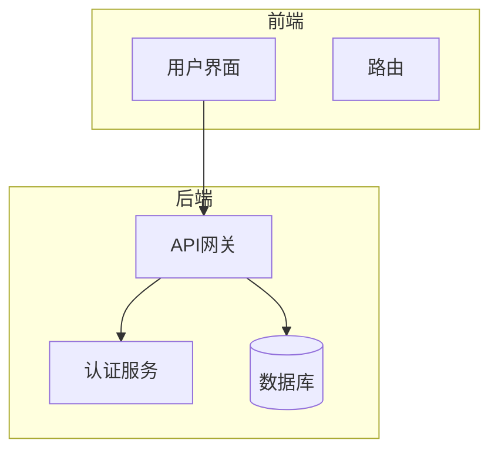
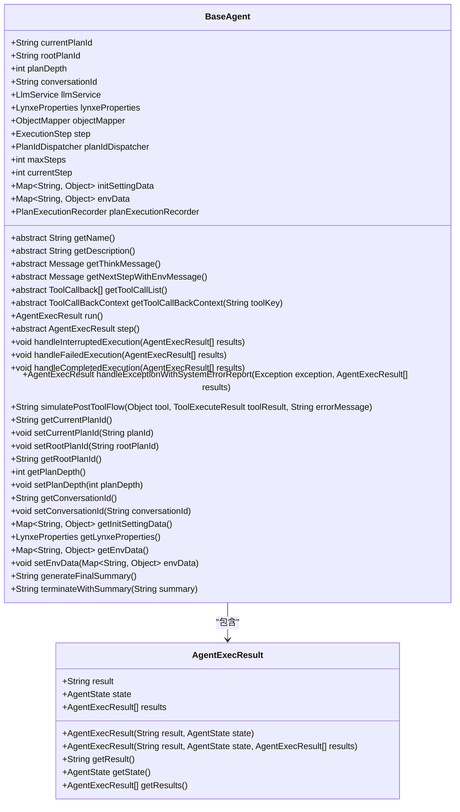
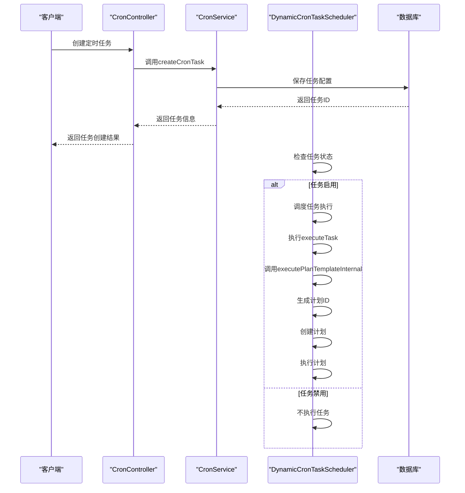
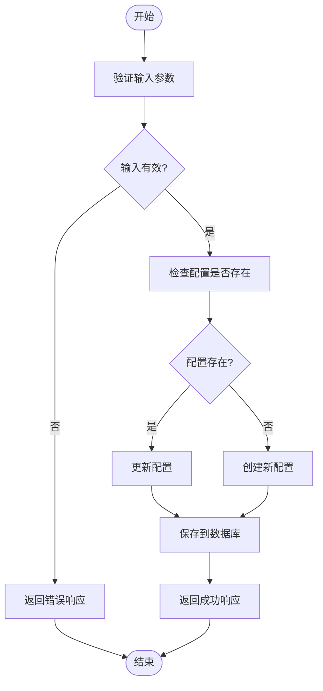
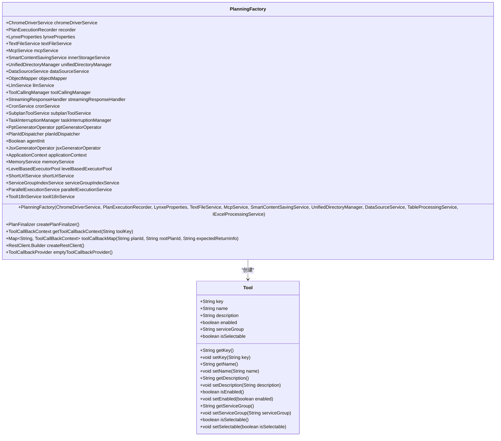
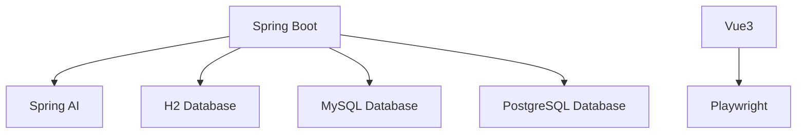

# 系统概述

<cite>
**本文档引用的文件**   
- [OpenLynxeSpringBootApplication.java](file://src/main/java/com/alibaba/cloud/ai/lynxe/OpenLynxeSpringBootApplication.java)
- [pom.xml](file://pom.xml)
- [README.md](file://README.md)
- [application.yml](file://src/main/resources/application.yml)
- [package.json](file://ui-vue3/package.json)
- [BaseAgent.java](file://src/main/java/com/alibaba/cloud/ai/lynxe/agent/BaseAgent.java)
- [PlanningFactory.java](file://src/main/java/com/alibaba/cloud/ai/lynxe/planning/PlanningFactory.java)
- [PlanningCoordinator.java](file://src/main/java/com/alibaba/cloud/ai/lynxe/runtime/service/PlanningCoordinator.java)
- [Tool.java](file://src/main/java/com/alibaba/cloud/ai/lynxe/agent/model/Tool.java)
- [OpenAICompatibleController.java](file://src/main/java/com/alibaba/cloud/ai/lynxe/adapter/controller/OpenAICompatibleController.java)
- [McpController.java](file://src/main/java/com/alibaba/cloud/ai/lynxe/mcp/controller/McpController.java)
</cite>

## 目录
1. [简介](#简介)
2. [项目结构](#项目结构)
3. [核心组件](#核心组件)
4. [架构概述](#架构概述)
5. [详细组件分析](#详细组件分析)
6. [依赖分析](#依赖分析)
7. [性能考虑](#性能考虑)
8. [故障排除指南](#故障排除指南)
9. [结论](#结论)

## 简介
JManus（现称Lynxe）是一个基于Spring Boot和Vue3技术栈的AI代理管理系统，旨在提供一个纯Java实现的多代理协作平台。该系统主要用于处理需要一定程度确定性的探索性任务，例如从海量数据集中快速查找数据并将其转换为数据库中的单行记录，或分析日志并发出警报。Lynxe提供了HTTP服务调用能力，适合集成到现有项目中。系统支持Func-Agent模式，允许精确控制每个执行细节，提供极高的执行确定性，完成复杂的重复过程和功能。此外，Lynxe原生支持模型上下文协议（MCP），可无缝集成外部服务和工具。

## 项目结构
JManus项目采用典型的Spring Boot后端和Vue3前端分离架构。后端代码位于`src/main/java`目录下，主要包含适配器、代理、配置、定时任务、事件、异常、LLM、MCP、模型、命名空间、规划、记录器、运行时、子计划和工具等模块。前端代码位于`ui-vue3`目录下，使用Vue3框架构建用户界面。项目还包含部署脚本、工具脚本和测试代码。

**图表来源**
- [App.vue](file://ui-vue3/src/App.vue#L1-L26)

**章节来源**
- [App.vue](file://ui-vue3/src/App.vue#L1-L26)

## 核心组件
JManus系统的核心组件包括代理管理、任务调度、配置管理和工具扩展。代理管理模块负责创建和管理AI代理，支持多代理协作。任务调度模块通过Cron表达式实现定时任务的执行。配置管理模块允许用户通过Web界面管理系统的各种配置。工具扩展模块支持通过MCP协议集成外部工具和服务。

**章节来源**
- [BaseAgent.java](file://src/main/java/com/alibaba/cloud/ai/lynxe/agent/BaseAgent.java#L1-L603)
- [PlanningFactory.java](file://src/main/java/com/alibaba/cloud/ai/lynxe/planning/PlanningFactory.java#L1-L408)
- [PlanningCoordinator.java](file://src/main/java/com/alibaba/cloud/ai/lynxe/runtime/service/PlanningCoordinator.java#L1-L182)

## 架构概述
JManus系统采用微服务架构，基于Spring Boot和Vue3技术栈。后端使用Spring Boot构建RESTful API，前端使用Vue3构建用户界面。系统通过Spring AI与AI模型进行交互，支持OpenAI兼容的API调用。MCP（Model Context Protocol）集成允许系统与外部服务和工具无缝对接。系统支持H2、MySQL和PostgreSQL等多种数据库。

**图表来源**
- [OpenLynxeSpringBootApplication.java](file://src/main/java/com/alibaba/cloud/ai/lynxe/OpenLynxeSpringBootApplication.java#L1-L71)
- [application.yml](file://src/main/resources/application.yml#L1-L98)

**章节来源**
- [OpenLynxeSpringBootApplication.java](file://src/main/java/com/alibaba/cloud/ai/lynxe/OpenLynxeSpringBootApplication.java#L1-L71)
- [application.yml](file://src/main/resources/application.yml#L1-L98)

## 详细组件分析
### 代理管理分析
JManus的代理管理模块基于`BaseAgent`类实现，该类提供了代理状态管理、对话流、步骤限制和监控等核心功能。`BaseAgent`类通过`LlmService`与AI模型进行交互，支持多步骤任务的执行。代理的执行过程由`PlanningCoordinator`协调，通过`PlanExecutorFactory`动态选择合适的执行器。

#### 类图

**图表来源**
- [BaseAgent.java](file://src/main/java/com/alibaba/cloud/ai/lynxe/agent/BaseAgent.java#L1-L603)

**章节来源**
- [BaseAgent.java](file://src/main/java/com/alibaba/cloud/ai/lynxe/agent/BaseAgent.java#L1-L603)

### 任务调度分析
JManus的任务调度模块通过`CronService`和`DynamicCronTaskScheduler`实现。`CronService`负责管理定时任务的增删改查，`DynamicCronTaskScheduler`负责根据Cron表达式调度任务的执行。任务可以基于计划模板执行，支持手动立即执行和定期执行。

#### 序列图

**图表来源**
- [CronServiceImpl.java](file://src/main/java/com/alibaba/cloud/ai/lynxe/cron/service/impl/CronServiceImpl.java#L38-L81)
- [DynamicCronTaskScheduler.java](file://src/main/java/com/alibaba/cloud/ai/lynxe/cron/scheduler/DynamicCronTaskScheduler.java#L167-L218)

**章节来源**
- [CronServiceImpl.java](file://src/main/java/com/alibaba/cloud/ai/lynxe/cron/service/impl/CronServiceImpl.java#L38-L81)
- [DynamicCronTaskScheduler.java](file://src/main/java/com/alibaba/cloud/ai/lynxe/cron/scheduler/DynamicCronTaskScheduler.java#L167-L218)

### 配置管理分析
JManus的配置管理模块通过`ConfigService`和`IConfigService`接口实现。系统支持通过Web界面管理各种配置，包括基本配置、代理配置、模型配置、MCP配置、数据库配置和命名空间配置。配置信息存储在数据库中，支持批量更新和重置为默认值。

#### 流程图

**图表来源**
- [IConfigService.java](file://src/main/java/com/alibaba/cloud/ai/lynxe/config/IConfigService.java#L43-L80)
- [AdminApiService.ts](file://ui-vue3/src/api/admin-api-service.ts#L1-L164)

**章节来源**
- [IConfigService.java](file://src/main/java/com/alibaba/cloud/ai/lynxe/config/IConfigService.java#L43-L80)
- [AdminApiService.ts](file://ui-vue3/src/api/admin-api-service.ts#L1-L164)

### 工具扩展分析
JManus的工具扩展模块通过`PlanningFactory`和`Tool`类实现。系统支持多种内置工具，如浏览器操作、数据库读写、文件系统操作等。通过MCP协议，可以集成外部工具和服务。工具的调用由`ToolCallingManager`管理，支持异步调用和结果处理。

#### 类图

**图表来源**
- [Tool.java](file://src/main/java/com/alibaba/cloud/ai/lynxe/agent/model/Tool.java#L1-L82)
- [PlanningFactory.java](file://src/main/java/com/alibaba/cloud/ai/lynxe/planning/PlanningFactory.java#L1-L408)

**章节来源**
- [Tool.java](file://src/main/java/com/alibaba/cloud/ai/lynxe/agent/model/Tool.java#L1-L82)
- [PlanningFactory.java](file://src/main/java/com/alibaba/cloud/ai/lynxe/planning/PlanningFactory.java#L1-L408)

## 依赖分析
JManus系统依赖于多个开源库和框架，包括Spring Boot、Spring AI、Vue3、Playwright等。后端使用Spring Boot构建RESTful API，通过Spring AI与AI模型进行交互。前端使用Vue3构建用户界面，支持国际化和主题切换。Playwright用于浏览器自动化，支持网页抓取和交互操作。

**图表来源**
- [pom.xml](file://pom.xml#L1-L539)
- [package.json](file://ui-vue3/package.json#L1-L109)

**章节来源**
- [pom.xml](file://pom.xml#L1-L539)
- [package.json](file://ui-vue3/package.json#L1-L109)

## 性能考虑
JManus系统在设计时考虑了性能优化，包括使用Hikari连接池管理数据库连接，配置合理的连接池大小和超时时间。系统支持并行工具调用，提高问题解决效率和准确性。通过配置`parallelToolCalls`属性，可以控制是否允许多个工具同时调用。系统还支持会话内存管理，避免性能问题。

## 故障排除指南
当JManus系统出现问题时，首先检查日志文件`./logs/info.log`，查看是否有错误信息。检查数据库连接配置是否正确，确保数据库服务正常运行。如果AI模型调用失败，检查API密钥是否正确，网络连接是否正常。对于前端问题，检查浏览器控制台是否有JavaScript错误。

**章节来源**
- [application.yml](file://src/main/resources/application.yml#L48-L59)

## 结论
JManus（Lynxe）是一个功能强大的AI代理管理系统，基于Spring Boot和Vue3技术栈构建。系统支持多代理协作、任务调度、配置管理和工具扩展，适用于处理需要确定性的探索性任务。通过MCP协议，系统可以无缝集成外部服务和工具，提供灵活的扩展能力。JManus为开发者提供了一个完整的多代理协作平台，可用于构建复杂的AI应用。