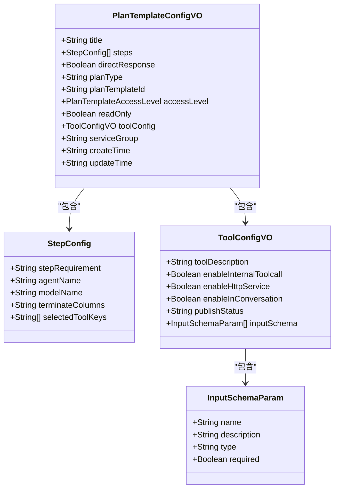
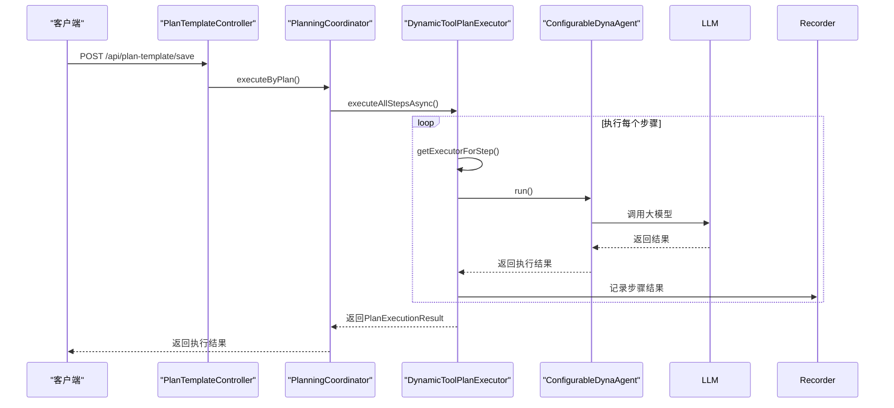
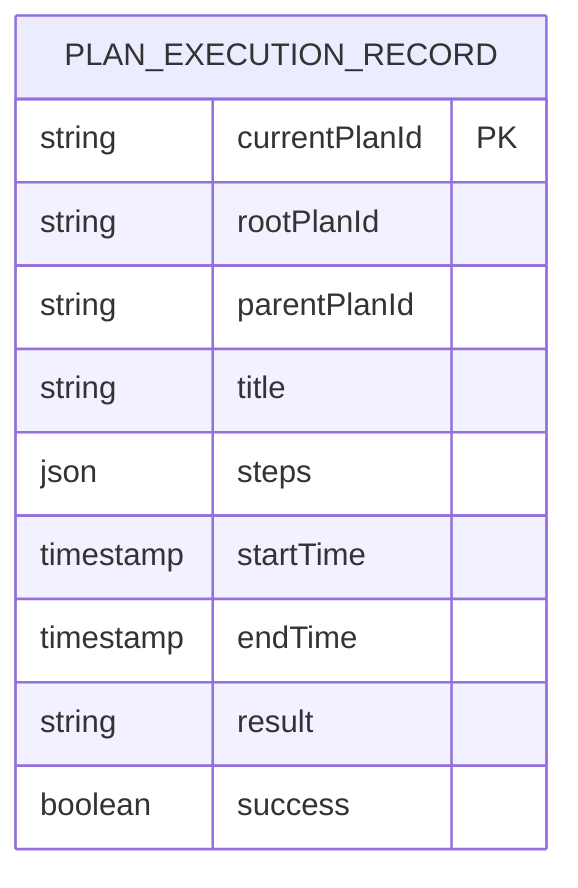
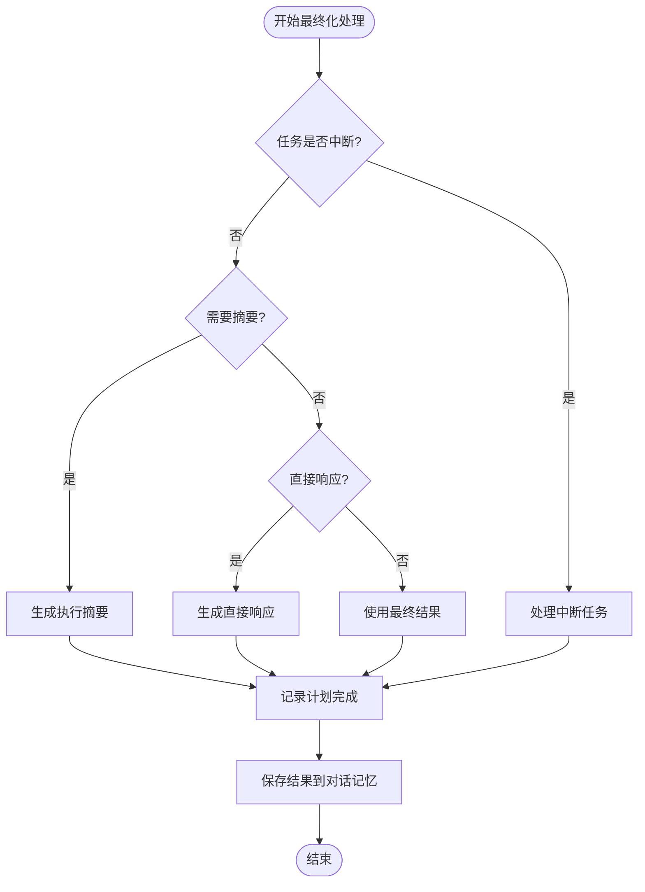
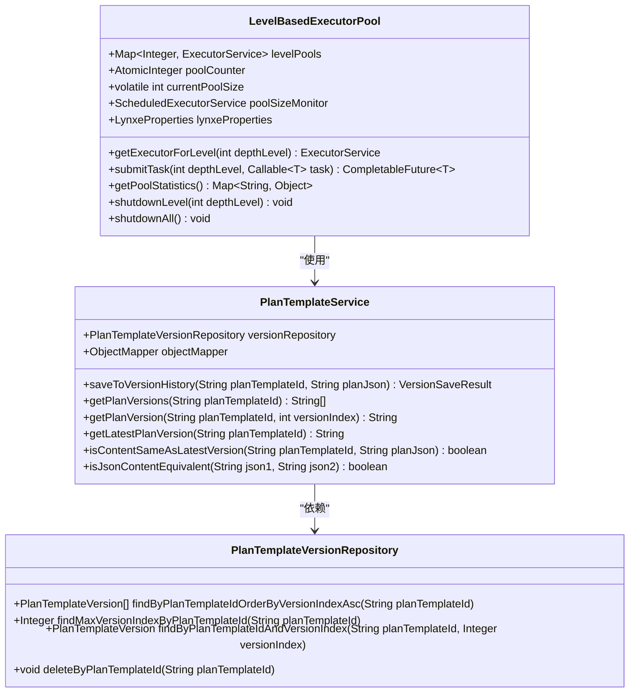

# 计划执行

<cite>
**本文档中引用的文件**   
- [PlanTemplateController.java](file://src/main/java/com/alibaba/cloud/ai/lynxe/planning/controller/PlanTemplateController.java)
- [IPlanTemplateService.java](file://src/main/java/com/alibaba/cloud/ai/lynxe/planning/service/IPlanTemplateService.java)
- [PlanTemplateService.java](file://src/main/java/com/alibaba/cloud/ai/lynxe/planning/service/PlanTemplateService.java)
- [PlanTemplateConfigVO.java](file://src/main/java/com/alibaba/cloud/ai/lynxe/planning/model/vo/PlanTemplateConfigVO.java)
- [PlanParameterMappingService.java](file://src/main/java/com/alibaba/cloud/ai/lynxe/planning/service/PlanParameterMappingService.java)
- [PlanFinalizer.java](file://src/main/java/com/alibaba/cloud/ai/lynxe/planning/service/PlanFinalizer.java)
- [PlanExecutorInterface.java](file://src/main/java/com/alibaba/cloud/ai/lynxe/runtime/executor/PlanExecutorInterface.java)
- [AbstractPlanExecutor.java](file://src/main/java/com/alibaba/cloud/ai/lynxe/runtime/executor/AbstractPlanExecutor.java)
- [DynamicToolPlanExecutor.java](file://src/main/java/com/alibaba/cloud/ai/lynxe/runtime/executor/DynamicToolPlanExecutor.java)
- [LevelBasedExecutorPool.java](file://src/main/java/com/alibaba/cloud/ai/lynxe/runtime/executor/LevelBasedExecutorPool.java)
- [PlanExecutionRecordRepository.java](file://src/main/java/com/alibaba/cloud/ai/lynxe/recorder/repository/PlanExecutionRecordRepository.java)
- [PlanTemplateAccessLevel.java](file://src/main/java/com/alibaba/cloud/ai/lynxe/planning/model/enums/PlanTemplateAccessLevel.java)
- [PlanTemplateVersionRepository.java](file://src/main/java/com/alibaba/cloud/ai/lynxe/planning/repository/PlanTemplateVersionRepository.java)
</cite>

## 目录
1. [引言](#引言)
2. [计划模板设计与配置](#计划模板设计与配置)
3. [计划执行引擎机制](#计划执行引擎机制)
4. [计划执行记录与存储](#计划执行记录与存储)
5. [计划参数映射与最终化处理](#计划参数映射与最终化处理)
6. [异常处理与调度策略](#异常处理与调度策略)
7. [监控与状态跟踪](#监控与状态跟踪)
8. [自定义计划模板指南](#自定义计划模板指南)
9. [性能优化与常见问题](#性能优化与常见问题)

## 引言
本文档详细阐述了JManus项目中计划执行功能的完整架构和实现机制。系统通过计划模板（PlanTemplate）实现可复用的自动化流程，支持版本管理和访问控制。计划执行引擎基于抽象执行器模式，通过`PlanExecutorInterface`和`AbstractPlanExecutor`实现灵活的执行逻辑。系统提供了完整的执行记录（PlanExecutionRecord）数据结构和存储策略，支持对执行过程的全面监控和追溯。文档还介绍了计划参数映射、最终化处理和异常处理机制，以及计划执行的调度策略和资源分配方式，为开发者提供了创建和管理自定义计划模板的完整指南。

## 计划模板设计与配置

计划模板（PlanTemplate）是系统中可复用的自动化流程定义，其设计和配置机制支持版本管理和访问控制。`PlanTemplateController`提供了完整的REST API来管理计划模板，包括保存、获取版本历史、删除和参数需求查询等功能。`PlanTemplateService`实现了版本历史管理，通过`saveToVersionHistory`方法将计划模板的不同版本存储在数据库中，并使用`isJsonContentEquivalent`方法智能比较JSON内容的语义一致性，避免创建重复版本。

计划模板的访问控制通过`PlanTemplateAccessLevel`枚举实现，支持`READ_ONLY`（只读）和`EDITABLE`（可编辑）两种级别。`PlanTemplateConfigVO`类作为计划模板的配置值对象，包含了标题、步骤、直接响应标志、计划类型、服务组和工具配置等属性。该类还提供了向后兼容的`readOnly`字段，确保与旧版本的兼容性。



**图源**
- [PlanTemplateConfigVO.java](file://src/main/java/com/alibaba/cloud/ai/lynxe/planning/model/vo/PlanTemplateConfigVO.java#L30-L426)

**本节源**
- [PlanTemplateController.java](file://src/main/java/com/alibaba/cloud/ai/lynxe/planning/controller/PlanTemplateController.java#L53-L661)
- [PlanTemplateService.java](file://src/main/java/com/alibaba/cloud/ai/lynxe/planning/service/PlanTemplateService.java#L36-L206)
- [PlanTemplateAccessLevel.java](file://src/main/java/com/alibaba/cloud/ai/lynxe/planning/model/enums/PlanTemplateAccessLevel.java#L24-L80)

## 计划执行引擎机制

计划执行引擎是系统的核心，负责执行计划模板定义的自动化流程。引擎基于接口`PlanExecutorInterface`和抽象类`AbstractPlanExecutor`构建，实现了灵活的执行逻辑。`PlanExecutorInterface`定义了`executeAllStepsAsync`方法，该方法接受`ExecutionContext`上下文并返回`CompletableFuture<PlanExecutionResult>`，支持异步执行。

`AbstractPlanExecutor`作为所有执行器的基类，提供了通用的执行逻辑，包括步骤执行、异常处理和资源清理。`executeAllStepsAsync`方法使用`LevelBasedExecutorPool`根据计划深度选择合适的线程池，确保不同层次的计划在独立的资源池中执行。`executeStep`方法负责执行单个步骤，通过`getExecutorForStep`抽象方法获取具体的执行器，并记录步骤的开始和结束。

`DynamicToolPlanExecutor`是`AbstractPlanExecutor`的具体实现，专门用于执行包含用户选择工具的动态代理计划。它通过`getStepFromStepReq`方法从步骤要求中提取步骤类型，并创建`ConfigurableDynaAgent`作为执行器。该执行器支持工具调用、用户输入和流式响应处理。



**图源**
- [PlanExecutorInterface.java](file://src/main/java/com/alibaba/cloud/ai/lynxe/runtime/executor/PlanExecutorInterface.java#L26-L36)
- [AbstractPlanExecutor.java](file://src/main/java/com/alibaba/cloud/ai/lynxe/runtime/executor/AbstractPlanExecutor.java#L45-L397)
- [DynamicToolPlanExecutor.java](file://src/main/java/com/alibaba/cloud/ai/lynxe/runtime/executor/DynamicToolPlanExecutor.java#L52-L183)

**本节源**
- [PlanExecutorInterface.java](file://src/main/java/com/alibaba/cloud/ai/lynxe/runtime/executor/PlanExecutorInterface.java#L26-L36)
- [AbstractPlanExecutor.java](file://src/main/java/com/alibaba/cloud/ai/lynxe/runtime/executor/AbstractPlanExecutor.java#L45-L397)
- [DynamicToolPlanExecutor.java](file://src/main/java/com/alibaba/cloud/ai/lynxe/runtime/executor/DynamicToolPlanExecutor.java#L52-L183)

## 计划执行记录与存储

计划执行记录（PlanExecutionRecord）用于存储计划执行的详细信息，支持对执行过程的全面监控和追溯。`PlanExecutionRecordEntity`实体类定义了记录的数据结构，包括当前计划ID、根计划ID、父计划ID、标题、步骤列表、开始时间、结束时间和执行结果等字段。`PlanExecutionRecordRepository`接口提供了对记录的CRUD操作，支持通过当前计划ID、父计划ID和根计划ID查询记录。

`NewRepoPlanExecutionRecorder`服务类负责记录计划执行的各个阶段，包括计划开始、步骤开始、步骤结束和计划完成。`recordPlanExecutionStart`方法在计划开始时创建记录，`recordStepStart`和`recordStepEnd`方法分别在步骤开始和结束时更新记录，`recordPlanCompletion`方法在计划完成后更新最终结果。这些记录为系统的监控和调试提供了重要数据。



**图源**
- [PlanExecutionRecordRepository.java](file://src/main/java/com/alibaba/cloud/ai/lynxe/recorder/repository/PlanExecutionRecordRepository.java#L27-L55)

**本节源**
- [PlanExecutionRecordRepository.java](file://src/main/java/com/alibaba/cloud/ai/lynxe/recorder/repository/PlanExecutionRecordRepository.java#L27-L55)

## 计划参数映射与最终化处理

计划参数映射机制允许计划模板使用占位符（如<<parameter_name>>），并在执行时替换为实际值。`PlanParameterMappingService`服务类实现了参数映射功能，提供了`extractParameterPlaceholders`、`replaceParametersInJson`和`validateParameters`等方法。`extractParameterPlaceholders`方法使用正则表达式`<<([^<>]+)>>`提取所有参数占位符，`replaceParametersInJson`方法将占位符替换为实际值，并对JSON字符串进行转义以防止解析错误。

`PlanFinalizer`类负责计划执行的最终化处理，包括生成执行摘要、直接响应和处理中断任务。`handlePostExecution`方法根据上下文中的`needSummary`标志或计划的`directResponse`标志决定是否生成摘要或直接响应。`generateSummary`方法使用大模型根据执行细节生成摘要，`generateDirectResponse`方法为简单请求生成直接响应。`isTaskInterrupted`方法检查任务是否被中断，并调用`handleInterruptedTask`方法处理中断情况。



**图源**
- [PlanParameterMappingService.java](file://src/main/java/com/alibaba/cloud/ai/lynxe/planning/service/PlanParameterMappingService.java#L37-L335)
- [PlanFinalizer.java](file://src/main/java/com/alibaba/cloud/ai/lynxe/planning/service/PlanFinalizer.java#L48-L394)

**本节源**
- [PlanParameterMappingService.java](file://src/main/java/com/alibaba/cloud/ai/lynxe/planning/service/PlanParameterMappingService.java#L37-L335)
- [PlanFinalizer.java](file://src/main/java/com/alibaba/cloud/ai/lynxe/planning/service/PlanFinalizer.java#L48-L394)

## 异常处理与调度策略

系统实现了全面的异常处理机制，确保计划执行的稳定性和可靠性。`AbstractPlanExecutor`在`executeStep`方法中使用try-catch块捕获执行步骤时的异常，并将错误信息记录在步骤结果中。`executeAllStepsAsync`方法在`CompletableFuture`的`exceptionally`回调中处理未捕获的异常，确保即使发生严重错误也不会导致整个系统崩溃。

计划执行的调度策略由`LevelBasedExecutorPool`实现，该类为不同深度的计划提供独立的线程池。`getExecutorForLevel`方法根据计划深度返回对应的执行器，确保不同层次的计划在独立的资源池中执行。`LevelBasedExecutorPool`还支持动态调整线程池大小，通过`checkAndAdjustPoolSizes`方法定期检查配置并调整所有级别线程池的大小。



**图源**
- [LevelBasedExecutorPool.java](file://src/main/java/com/alibaba/cloud/ai/lynxe/runtime/executor/LevelBasedExecutorPool.java#L49-L422)
- [PlanTemplateService.java](file://src/main/java/com/alibaba/cloud/ai/lynxe/planning/service/PlanTemplateService.java#L36-L206)
- [PlanTemplateVersionRepository.java](file://src/main/java/com/alibaba/cloud/ai/lynxe/planning/repository/PlanTemplateVersionRepository.java#L31-L65)

**本节源**
- [LevelBasedExecutorPool.java](file://src/main/java/com/alibaba/cloud/ai/lynxe/runtime/executor/LevelBasedExecutorPool.java#L49-L422)
- [PlanTemplateService.java](file://src/main/java/com/alibaba/cloud/ai/lynxe/planning/service/PlanTemplateService.java#L36-L206)
- [PlanTemplateVersionRepository.java](file://src/main/java/com/alibaba/cloud/ai/lynxe/planning/repository/PlanTemplateVersionRepository.java#L31-L65)

## 监控与状态跟踪

系统提供了全面的监控和状态跟踪功能，支持对计划执行过程的实时监控和追溯。`PlanExecutionRecorder`服务类负责记录计划执行的各个阶段，包括计划开始、步骤开始、步骤结束和计划完成。这些记录存储在数据库中，可以通过`PlanExecutionRecordRepository`查询。

`PlanTemplateController`提供了`/api/plan-template/versions`和`/api/plan-template/get-version`等API，支持查询计划模板的版本历史和特定版本。`PlanParameterMappingService`提供了`getParameterRequirements`方法，帮助用户了解计划模板所需的参数。`PlanFinalizer`的`getPoolStatistics`方法提供了线程池的统计信息，包括核心池大小、最大池大小、当前池大小、活动线程数、队列大小、已完成任务数和总任务数。

## 自定义计划模板指南

开发者可以通过以下步骤创建和管理自定义计划模板：

1. **定义计划模板**：创建一个JSON文件，定义计划的标题、步骤、直接响应标志、计划类型、服务组和工具配置。
2. **配置参数占位符**：在计划模板中使用`<<parameter_name>>`格式的占位符，表示需要在执行时替换的参数。
3. **设置访问控制**：通过`accessLevel`字段设置计划模板的访问级别，`READ_ONLY`表示只读，`EDITABLE`表示可编辑。
4. **注册为工具调用**：通过`createOrUpdatePlanTemplateWithTool` API将计划模板注册为协调器工具，使其可以在对话中被调用。
5. **导入和导出**：使用`exportAllPlanTemplates`和`importPlanTemplates` API批量导出和导入计划模板。

API调用示例：
```json
POST /api/plan-template/create-or-update-with-tool
{
  "planTemplateId": "my_custom_plan",
  "title": "My Custom Plan",
  "steps": [
    {
      "stepRequirement": "[ConfigurableDynaAgent] Execute a task",
      "agentName": "ConfigurableDynaAgent",
      "modelName": "gpt-4",
      "selectedToolKeys": ["tool1", "tool2"]
    }
  ],
  "directResponse": false,
  "planType": "dynamic_agent",
  "serviceGroup": "default",
  "accessLevel": "EDITABLE",
  "toolConfig": {
    "toolDescription": "A custom plan",
    "enableInternalToolcall": true,
    "enableHttpService": false,
    "enableInConversation": true,
    "publishStatus": "PUBLISHED",
    "inputSchema": [
      {
        "name": "param1",
        "description": "First parameter",
        "type": "string",
        "required": true
      }
    ]
  }
}
```

最佳实践：
- 使用有意义的`planTemplateId`和`title`，便于识别和管理。
- 在`inputSchema`中明确定义所有必需参数，包括名称、描述、类型和是否必需。
- 合理设置`accessLevel`，保护重要计划模板不被意外修改。
- 定期导出计划模板备份，防止数据丢失。

## 性能优化与常见问题

### 性能优化建议
1. **合理配置线程池**：通过`lynxeProperties.getExecutorPoolSize()`配置线程池大小，根据系统负载调整。
2. **优化计划深度**：避免过深的计划嵌套，减少资源消耗。
3. **使用缓存**：对频繁访问的计划模板和执行记录使用缓存，减少数据库查询。
4. **批量处理**：对大量计划模板的导入和导出使用批量处理，提高效率。

### 常见问题解决方案
1. **参数验证失败**：检查参数名称拼写是否正确，确保所有必需参数都已提供，参数名称区分大小写，只能包含字母、数字和下划线，且不能以数字开头。
2. **计划执行中断**：检查`TaskInterruptionManager`是否标记了中断，确保没有用户手动中断任务。
3. **线程池资源耗尽**：增加线程池大小或优化计划执行逻辑，减少并发任务数。
4. **JSON解析错误**：确保计划模板JSON格式正确，避免特殊字符未转义。