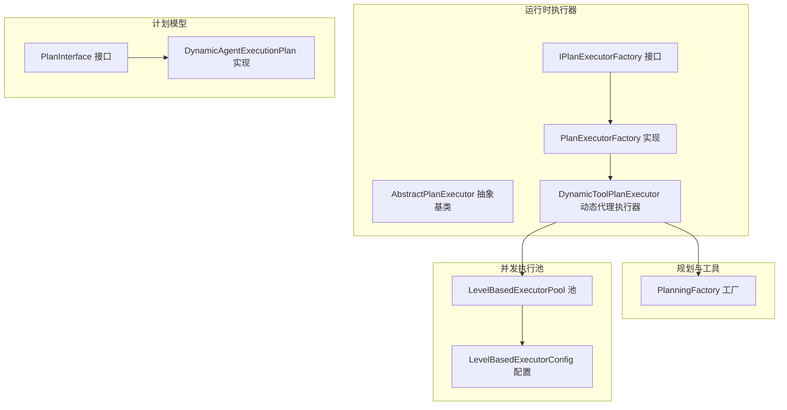
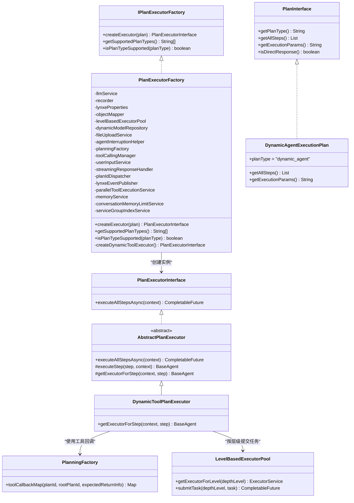
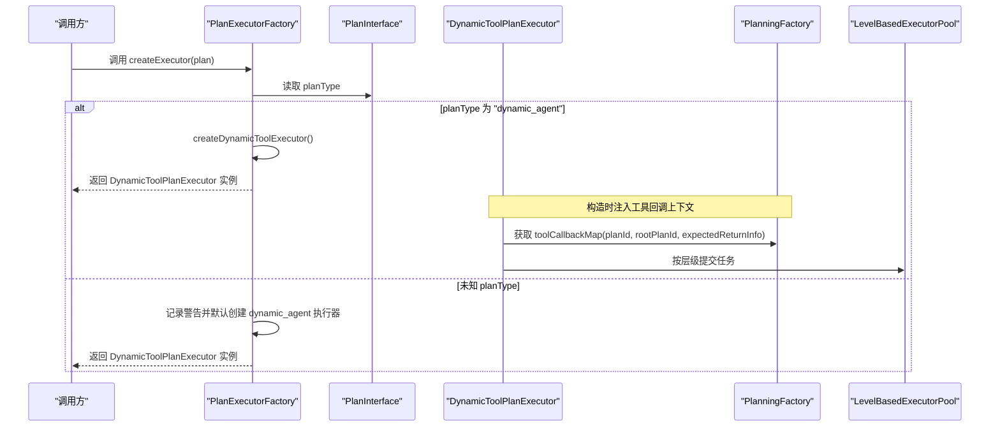
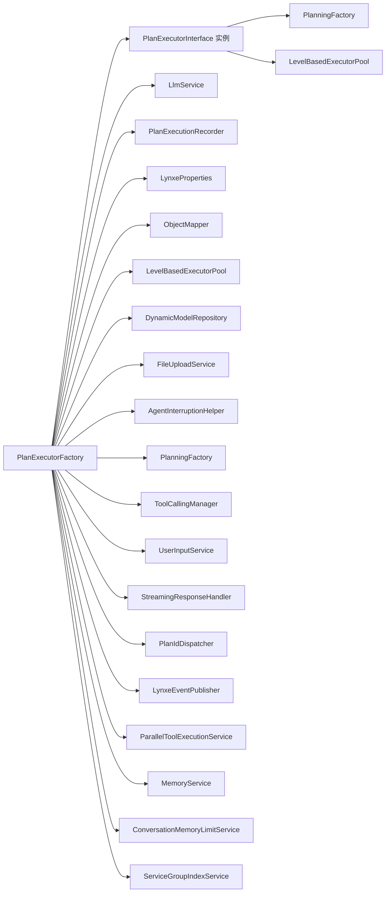

# 执行器工厂

<cite>
**本文引用的文件列表**
- [PlanExecutorFactory.java](file://src/main/java/com/alibaba/cloud/ai/lynxe/runtime/executor/factory/PlanExecutorFactory.java)
- [IPlanExecutorFactory.java](file://src/main/java/com/alibaba/cloud/ai/lynxe/runtime/executor/factory/IPlanExecutorFactory.java)
- [PlanExecutorInterface.java](file://src/main/java/com/alibaba/cloud/ai/lynxe/runtime/executor/PlanExecutorInterface.java)
- [AbstractPlanExecutor.java](file://src/main/java/com/alibaba/cloud/ai/lynxe/runtime/executor/AbstractPlanExecutor.java)
- [DynamicToolPlanExecutor.java](file://src/main/java/com/alibaba/cloud/ai/lynxe/runtime/executor/DynamicToolPlanExecutor.java)
- [PlanInterface.java](file://src/main/java/com/alibaba/cloud/ai/lynxe/runtime/entity/vo/PlanInterface.java)
- [DynamicAgentExecutionPlan.java](file://src/main/java/com/alibaba/cloud/ai/lynxe/runtime/entity/vo/DynamicAgentExecutionPlan.java)
- [PlanningFactory.java](file://src/main/java/com/alibaba/cloud/ai/lynxe/planning/PlanningFactory.java)
- [LevelBasedExecutorPool.java](file://src/main/java/com/alibaba/cloud/ai/lynxe/runtime/executor/LevelBasedExecutorPool.java)
- [LevelBasedExecutorConfig.java](file://src/main/java/com/alibaba/cloud/ai/lynxe/runtime/executor/LevelBasedExecutorConfig.java)
</cite>

## 目录
1. [简介](#简介)
2. [项目结构](#项目结构)
3. [核心组件](#核心组件)
4. [架构总览](#架构总览)
5. [详细组件分析](#详细组件分析)
6. [依赖关系分析](#依赖关系分析)
7. [性能考量](#性能考量)
8. [故障排查指南](#故障排查指南)
9. [结论](#结论)
10. [附录：扩展指南](#附录扩展指南)

## 简介
本文件系统化梳理“计划执行器工厂”（PlanExecutorFactory）的设计与实现，重点说明其作为 IPlanExecutorFactory 接口实现的职责，以及 createExecutor 方法如何依据 PlanInterface 的 planType 属性（如 dynamic_agent）动态创建相应执行器实例。文档还阐述工厂模式如何实现执行器的解耦与可扩展性，列出工厂所依赖的服务组件及其在执行器创建过程中的作用，并说明 isPlanTypeSupported 支持的计划类型及处理逻辑。最后提供工厂扩展指南，帮助开发者注册新的执行器类型并创建对应的执行器实现。

## 项目结构
围绕执行器工厂的关键文件组织如下：
- 工厂接口与实现：IPlanExecutorFactory、PlanExecutorFactory
- 执行器接口与抽象基类：PlanExecutorInterface、AbstractPlanExecutor
- 具体执行器实现：DynamicToolPlanExecutor
- 计划模型：PlanInterface、DynamicAgentExecutionPlan
- 规划与工具回调：PlanningFactory
- 并行执行池：LevelBasedExecutorPool 及其配置 LevelBasedExecutorConfig

图表来源
- [PlanExecutorFactory.java](file://src/main/java/com/alibaba/cloud/ai/lynxe/runtime/executor/factory/PlanExecutorFactory.java#L49-L181)
- [IPlanExecutorFactory.java](file://src/main/java/com/alibaba/cloud/ai/lynxe/runtime/executor/factory/IPlanExecutorFactory.java#L24-L41)
- [AbstractPlanExecutor.java](file://src/main/java/com/alibaba/cloud/ai/lynxe/runtime/executor/AbstractPlanExecutor.java#L42-L200)
- [DynamicToolPlanExecutor.java](file://src/main/java/com/alibaba/cloud/ai/lynxe/runtime/executor/DynamicToolPlanExecutor.java#L48-L183)
- [PlanInterface.java](file://src/main/java/com/alibaba/cloud/ai/lynxe/runtime/entity/vo/PlanInterface.java#L26-L181)
- [DynamicAgentExecutionPlan.java](file://src/main/java/com/alibaba/cloud/ai/lynxe/runtime/entity/vo/DynamicAgentExecutionPlan.java#L27-L110)
- [PlanningFactory.java](file://src/main/java/com/alibaba/cloud/ai/lynxe/planning/PlanningFactory.java#L106-L200)
- [LevelBasedExecutorPool.java](file://src/main/java/com/alibaba/cloud/ai/lynxe/runtime/executor/LevelBasedExecutorPool.java#L48-L120)
- [LevelBasedExecutorConfig.java](file://src/main/java/com/alibaba/cloud/ai/lynxe/runtime/executor/LevelBasedExecutorConfig.java#L28-L168)

章节来源
- [PlanExecutorFactory.java](file://src/main/java/com/alibaba/cloud/ai/lynxe/runtime/executor/factory/PlanExecutorFactory.java#L49-L181)
- [PlanInterface.java](file://src/main/java/com/alibaba/cloud/ai/lynxe/runtime/entity/vo/PlanInterface.java#L26-L181)
- [DynamicAgentExecutionPlan.java](file://src/main/java/com/alibaba/cloud/ai/lynxe/runtime/entity/vo/DynamicAgentExecutionPlan.java#L27-L110)

## 核心组件
- IPlanExecutorFactory：定义执行器工厂的统一接口，包含 createExecutor、getSupportedPlanTypes、isPlanTypeSupported 三个方法。
- PlanExecutorFactory：具体实现，负责根据 PlanInterface 的 planType 创建对应执行器实例；当前支持 dynamic_agent 类型。
- PlanExecutorInterface：执行器接口，定义异步执行入口 executeAllStepsAsync。
- AbstractPlanExecutor：执行器抽象基类，封装通用步骤执行逻辑、异常处理、记录与中断处理等。
- DynamicToolPlanExecutor：面向 dynamic_agent 类型的专用执行器，基于可配置动态代理与工具回调上下文进行步骤调度。
- PlanInterface/DynamicAgentExecutionPlan：计划数据模型，提供 planType、步骤集合、执行参数等信息。
- PlanningFactory：规划与工具回调工厂，为执行器提供工具回调上下文。
- LevelBasedExecutorPool/LevelBasedExecutorConfig：按层级划分的线程池，用于控制不同深度级别的并发执行。

章节来源
- [IPlanExecutorFactory.java](file://src/main/java/com/alibaba/cloud/ai/lynxe/runtime/executor/factory/IPlanExecutorFactory.java#L24-L41)
- [PlanExecutorFactory.java](file://src/main/java/com/alibaba/cloud/ai/lynxe/runtime/executor/factory/PlanExecutorFactory.java#L119-L181)
- [PlanExecutorInterface.java](file://src/main/java/com/alibaba/cloud/ai/lynxe/runtime/executor/PlanExecutorInterface.java#L23-L36)
- [AbstractPlanExecutor.java](file://src/main/java/com/alibaba/cloud/ai/lynxe/runtime/executor/AbstractPlanExecutor.java#L42-L200)
- [DynamicToolPlanExecutor.java](file://src/main/java/com/alibaba/cloud/ai/lynxe/runtime/executor/DynamicToolPlanExecutor.java#L48-L183)
- [PlanInterface.java](file://src/main/java/com/alibaba/cloud/ai/lynxe/runtime/entity/vo/PlanInterface.java#L26-L181)
- [DynamicAgentExecutionPlan.java](file://src/main/java/com/alibaba/cloud/ai/lynxe/runtime/entity/vo/DynamicAgentExecutionPlan.java#L27-L110)
- [PlanningFactory.java](file://src/main/java/com/alibaba/cloud/ai/lynxe/planning/PlanningFactory.java#L106-L200)
- [LevelBasedExecutorPool.java](file://src/main/java/com/alibaba/cloud/ai/lynxe/runtime/executor/LevelBasedExecutorPool.java#L48-L120)
- [LevelBasedExecutorConfig.java](file://src/main/java/com/alibaba/cloud/ai/lynxe/runtime/executor/LevelBasedExecutorConfig.java#L28-L168)

## 架构总览
下图展示工厂模式在执行器创建中的角色，以及各组件之间的依赖关系。

图表来源
- [IPlanExecutorFactory.java](file://src/main/java/com/alibaba/cloud/ai/lynxe/runtime/executor/factory/IPlanExecutorFactory.java#L24-L41)
- [PlanExecutorFactory.java](file://src/main/java/com/alibaba/cloud/ai/lynxe/runtime/executor/factory/PlanExecutorFactory.java#L90-L181)
- [PlanExecutorInterface.java](file://src/main/java/com/alibaba/cloud/ai/lynxe/runtime/executor/PlanExecutorInterface.java#L23-L36)
- [AbstractPlanExecutor.java](file://src/main/java/com/alibaba/cloud/ai/lynxe/runtime/executor/AbstractPlanExecutor.java#L42-L200)
- [DynamicToolPlanExecutor.java](file://src/main/java/com/alibaba/cloud/ai/lynxe/runtime/executor/DynamicToolPlanExecutor.java#L48-L183)
- [PlanInterface.java](file://src/main/java/com/alibaba/cloud/ai/lynxe/runtime/entity/vo/PlanInterface.java#L26-L181)
- [DynamicAgentExecutionPlan.java](file://src/main/java/com/alibaba/cloud/ai/lynxe/runtime/entity/vo/DynamicAgentExecutionPlan.java#L27-L110)
- [PlanningFactory.java](file://src/main/java/com/alibaba/cloud/ai/lynxe/planning/PlanningFactory.java#L106-L200)
- [LevelBasedExecutorPool.java](file://src/main/java/com/alibaba/cloud/ai/lynxe/runtime/executor/LevelBasedExecutorPool.java#L48-L120)

## 详细组件分析

### 工厂接口与实现：IPlanExecutorFactory 与 PlanExecutorFactory
- 职责边界
  - IPlanExecutorFactory 定义了工厂的最小契约：创建执行器、查询支持的计划类型、判断某计划类型是否受支持。
  - PlanExecutorFactory 实现该接口，承担“根据 planType 选择并构造具体执行器”的职责。
- 关键方法
  - createExecutor：从 PlanInterface 中读取 planType，规范化后通过分支或默认策略返回具体执行器实例。
  - getSupportedPlanTypes：返回当前已知支持的计划类型数组。
  - isPlanTypeSupported：对输入的 planType 进行大小写无关的判定，返回布尔值。
- 当前支持的类型
  - dynamic_agent：当前工厂明确支持的类型。
  - simple、direct：在 isPlanTypeSupported 中显式支持，但 createExecutor 分支中未显式处理，存在默认回退到 dynamic_agent 的行为。
- 默认回退策略
  - 若传入未知 planType，工厂会记录警告日志并默认创建 dynamic_agent 执行器，确保调用方不会收到空结果。

章节来源
- [IPlanExecutorFactory.java](file://src/main/java/com/alibaba/cloud/ai/lynxe/runtime/executor/factory/IPlanExecutorFactory.java#L24-L41)
- [PlanExecutorFactory.java](file://src/main/java/com/alibaba/cloud/ai/lynxe/runtime/executor/factory/PlanExecutorFactory.java#L131-L181)

### 执行器接口与抽象基类：PlanExecutorInterface 与 AbstractPlanExecutor
- PlanExecutorInterface
  - 定义 executeAllStepsAsync 异步执行入口，返回执行结果的 CompletableFuture。
- AbstractPlanExecutor
  - 提供通用步骤执行流程：解析步骤需求、获取对应执行器、记录开始/结束、处理中断与失败状态、同步上传文件等。
  - 提供 getExecutorForStep 抽象方法，由子类实现具体步骤执行器的选择逻辑。
  - 统一封装异常捕获与错误记录，保证执行链路的健壮性。

章节来源
- [PlanExecutorInterface.java](file://src/main/java/com/alibaba/cloud/ai/lynxe/runtime/executor/PlanExecutorInterface.java#L23-L36)
- [AbstractPlanExecutor.java](file://src/main/java/com/alibaba/cloud/ai/lynxe/runtime/executor/AbstractPlanExecutor.java#L42-L200)

### 动态代理执行器：DynamicToolPlanExecutor
- 设计要点
  - 基于 AbstractPlanExecutor，针对 dynamic_agent 类型定制步骤执行器选择逻辑。
  - 通过 PlanningFactory 的 toolCallbackMap 为代理注入工具回调上下文，使代理具备按需调用工具的能力。
  - 使用 LevelBasedExecutorPool 按计划深度级别提交任务，实现层级化的并发控制。
- 关键交互
  - getExecutorForStep：根据步骤需求字符串解析出步骤类型，若为 ConfigurableDynaAgent，则构建可配置动态代理并设置工具回调提供者。
  - 构造 ConfigurableDynaAgent 时注入 llmService、recorder、properties、toolCallingManager、userInputService、streamingResponseHandler、planIdDispatcher、eventPublisher、agentInterruptionHelper、objectMapper、parallelToolExecutionService、memoryService、conversationMemoryLimitService、serviceGroupIndexService 等服务。

章节来源
- [DynamicToolPlanExecutor.java](file://src/main/java/com/alibaba/cloud/ai/lynxe/runtime/executor/DynamicToolPlanExecutor.java#L48-L183)
- [PlanningFactory.java](file://src/main/java/com/alibaba/cloud/ai/lynxe/planning/PlanningFactory.java#L106-L200)
- [LevelBasedExecutorPool.java](file://src/main/java/com/alibaba/cloud/ai/lynxe/runtime/executor/LevelBasedExecutorPool.java#L48-L120)

### 计划模型：PlanInterface 与 DynamicAgentExecutionPlan
- PlanInterface
  - 定义计划的核心字段：rootPlanId、currentPlanId、planType、title、executionParams、steps 等。
  - 通过注解声明多态反序列化，默认实现为 DynamicAgentExecutionPlan。
- DynamicAgentExecutionPlan
  - 显式 planType 为 "dynamic_agent"，提供步骤集合的增删查改与执行状态格式化输出。
  - 支持直接反馈模式（isDirectResponse），用于跳过复杂计划执行直接响应。

章节来源
- [PlanInterface.java](file://src/main/java/com/alibaba/cloud/ai/lynxe/runtime/entity/vo/PlanInterface.java#L26-L181)
- [DynamicAgentExecutionPlan.java](file://src/main/java/com/alibaba/cloud/ai/lynxe/runtime/entity/vo/DynamicAgentExecutionPlan.java#L27-L110)

### 工厂创建流程时序
以下序列图展示了 PlanExecutorFactory 如何根据 PlanInterface 的 planType 创建执行器实例。

图表来源
- [PlanExecutorFactory.java](file://src/main/java/com/alibaba/cloud/ai/lynxe/runtime/executor/factory/PlanExecutorFactory.java#L153-L181)
- [DynamicToolPlanExecutor.java](file://src/main/java/com/alibaba/cloud/ai/lynxe/runtime/executor/DynamicToolPlanExecutor.java#L119-L183)
- [PlanningFactory.java](file://src/main/java/com/alibaba/cloud/ai/lynxe/planning/PlanningFactory.java#L106-L200)
- [LevelBasedExecutorPool.java](file://src/main/java/com/alibaba/cloud/ai/lynxe/runtime/executor/LevelBasedExecutorPool.java#L48-L120)

## 依赖关系分析
- 工厂对执行器的依赖
  - PlanExecutorFactory 通过构造函数注入大量服务，包括 LlmService、PlanExecutionRecorder、LynxeProperties、ObjectMapper、LevelBasedExecutorPool、DynamicModelRepository、FileUploadService、AgentInterruptionHelper、PlanningFactory、ToolCallingManager、UserInputService、StreamingResponseHandler、PlanIdDispatcher、LynxeEventPublisher、ParallelToolExecutionService、MemoryService、ConversationMemoryLimitService、ServiceGroupIndexService。
  - 这些依赖在 createDynamicToolExecutor 中传递给 DynamicToolPlanExecutor，确保执行器具备完整的运行环境。
- 执行器对服务的依赖
  - DynamicToolPlanExecutor 在构造时将上述服务注入，同时通过 PlanningFactory 获取工具回调上下文，通过 LevelBasedExecutorPool 提交任务。
- 类型支持与默认回退
  - isPlanTypeSupported 支持 "simple"、"direct"、"dynamic_agent"，但 createExecutor 仅显式处理 "dynamic_agent"，其余类型默认回退到 dynamic_agent 执行器。

图表来源
- [PlanExecutorFactory.java](file://src/main/java/com/alibaba/cloud/ai/lynxe/runtime/executor/factory/PlanExecutorFactory.java#L90-L117)
- [DynamicToolPlanExecutor.java](file://src/main/java/com/alibaba/cloud/ai/lynxe/runtime/executor/DynamicToolPlanExecutor.java#L86-L109)

章节来源
- [PlanExecutorFactory.java](file://src/main/java/com/alibaba/cloud/ai/lynxe/runtime/executor/factory/PlanExecutorFactory.java#L90-L117)
- [DynamicToolPlanExecutor.java](file://src/main/java/com/alibaba/cloud/ai/lynxe/runtime/executor/DynamicToolPlanExecutor.java#L86-L109)

## 性能考量
- 线程池按层级管理
  - LevelBasedExecutorPool 为每个深度级别维护独立线程池，避免深层级任务阻塞浅层任务，提升整体吞吐。
  - 支持动态调整池大小与队列容量，结合配置文件进行自适应优化。
- 并发与资源隔离
  - 通过深度级别隔离任务，降低竞争与死锁风险；同时避免单个级别占用过多 CPU/GC 资源。
- 日志与可观测性
  - 工厂与执行器均记录关键事件（创建、开始/结束步骤、异常、中断），便于问题定位与性能分析。

章节来源
- [LevelBasedExecutorPool.java](file://src/main/java/com/alibaba/cloud/ai/lynxe/runtime/executor/LevelBasedExecutorPool.java#L48-L120)
- [LevelBasedExecutorConfig.java](file://src/main/java/com/alibaba/cloud/ai/lynxe/runtime/executor/LevelBasedExecutorConfig.java#L28-L168)
- [AbstractPlanExecutor.java](file://src/main/java/com/alibaba/cloud/ai/lynxe/runtime/executor/AbstractPlanExecutor.java#L91-L166)

## 故障排查指南
- 常见问题与定位
  - plan 为空或 planType 为空：createExecutor 会在空校验阶段抛出非法参数异常，检查上游是否正确生成 PlanInterface。
  - 未知 planType：工厂会记录警告并默认创建 dynamic_agent 执行器，确认是否需要新增分支处理。
  - 步骤执行失败：AbstractPlanExecutor 在 executeStep 中捕获异常并记录错误消息与状态，检查 step.result 与错误信息。
  - 线程池异常：LevelBasedExecutorPool 在任务执行失败时记录错误并抛出完成异常，检查池大小与队列容量配置。
- 建议排查步骤
  - 核对 PlanInterface 的 planType 是否符合预期。
  - 查看工厂日志与执行器日志，定位异常发生点。
  - 检查 LevelBasedExecutorPool 的池大小与监控指标，必要时调整配置。

章节来源
- [PlanExecutorFactory.java](file://src/main/java/com/alibaba/cloud/ai/lynxe/runtime/executor/factory/PlanExecutorFactory.java#L153-L181)
- [AbstractPlanExecutor.java](file://src/main/java/com/alibaba/cloud/ai/lynxe/runtime/executor/AbstractPlanExecutor.java#L91-L166)
- [LevelBasedExecutorPool.java](file://src/main/java/com/alibaba/cloud/ai/lynxe/runtime/executor/LevelBasedExecutorPool.java#L112-L142)

## 结论
PlanExecutorFactory 通过工厂模式实现了执行器的解耦与可扩展性：以 PlanInterface 的 planType 为入口，将“创建执行器”的职责从调用方剥离出来，使得新增执行器类型无需修改调用方代码。当前工厂支持 dynamic_agent 类型，并在类型未知时提供安全的默认回退。配合 PlanningFactory 的工具回调与 LevelBasedExecutorPool 的层级化并发控制，执行器能够在复杂计划场景下稳定高效地运行。

## 附录：扩展指南
- 注册新的执行器类型
  - 在 IPlanExecutorFactory 中增加新类型的标识字符串。
  - 在 PlanExecutorFactory 的 isPlanTypeSupported 中添加对该类型的判定。
  - 在 PlanExecutorFactory 的 createExecutor 中为新类型添加分支，返回对应的新执行器实例。
- 新建执行器实现
  - 新建一个类实现 PlanExecutorInterface 或继承 AbstractPlanExecutor，按需重写步骤执行逻辑。
  - 在构造函数中注入所需服务（如 LlmService、Recorder、PlanningFactory、LevelBasedExecutorPool 等）。
  - 在 getExecutorForStep 中实现步骤类型到具体执行器的映射。
- 配置与测试
  - 确保 Spring 容器能够装配所有依赖服务。
  - 编写单元测试验证 createExecutor 对新类型的分支逻辑与异常处理。
  - 在集成测试中验证新执行器在真实计划场景下的行为与性能表现。

章节来源
- [IPlanExecutorFactory.java](file://src/main/java/com/alibaba/cloud/ai/lynxe/runtime/executor/factory/IPlanExecutorFactory.java#L24-L41)
- [PlanExecutorFactory.java](file://src/main/java/com/alibaba/cloud/ai/lynxe/runtime/executor/factory/PlanExecutorFactory.java#L131-L181)
- [PlanExecutorInterface.java](file://src/main/java/com/alibaba/cloud/ai/lynxe/runtime/executor/PlanExecutorInterface.java#L23-L36)
- [AbstractPlanExecutor.java](file://src/main/java/com/alibaba/cloud/ai/lynxe/runtime/executor/AbstractPlanExecutor.java#L42-L200)
- [DynamicToolPlanExecutor.java](file://src/main/java/com/alibaba/cloud/ai/lynxe/runtime/executor/DynamicToolPlanExecutor.java#L119-L183)
- [PlanningFactory.java](file://src/main/java/com/alibaba/cloud/ai/lynxe/planning/PlanningFactory.java#L106-L200)
- [LevelBasedExecutorPool.java](file://src/main/java/com/alibaba/cloud/ai/lynxe/runtime/executor/LevelBasedExecutorPool.java#L48-L120)