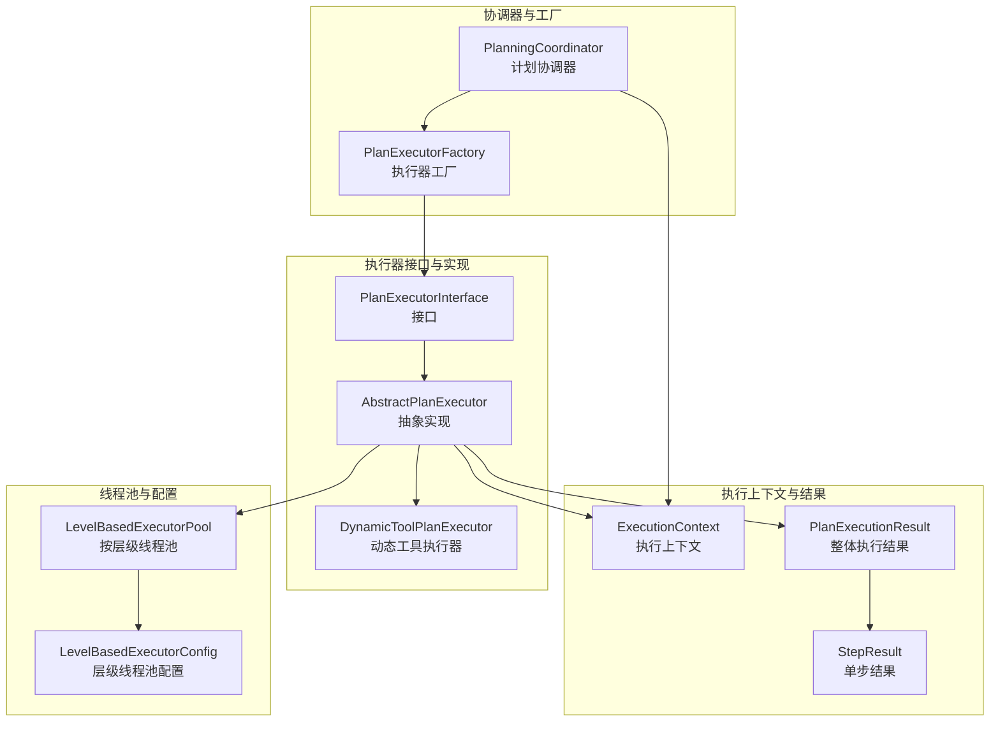
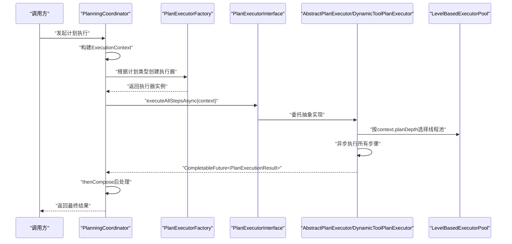
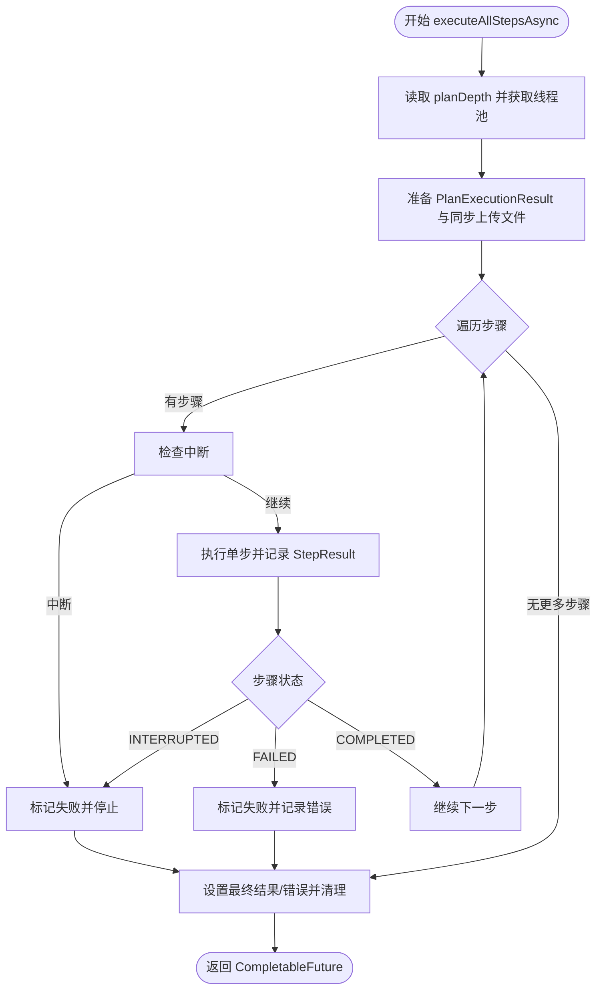
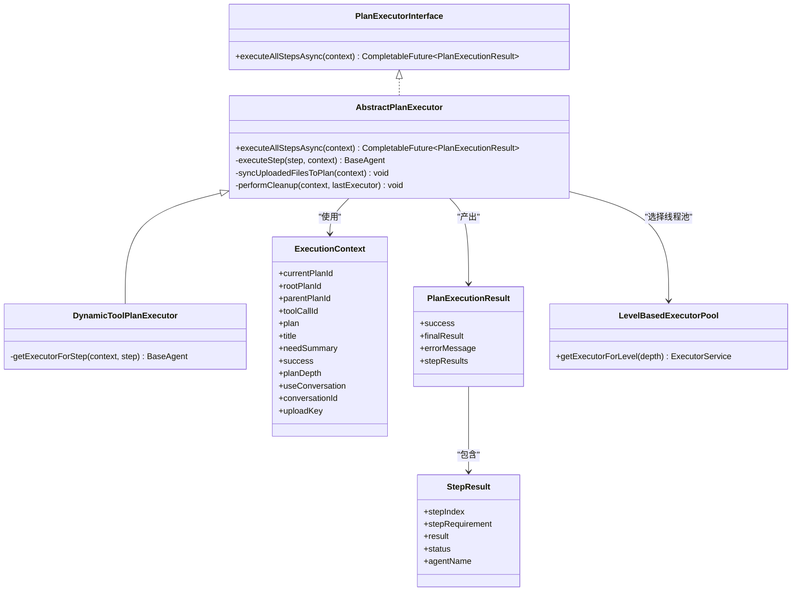

# 执行器接口定义

<cite>
**本文引用的文件列表**
- [PlanExecutorInterface.java](file://src/main/java/com/alibaba/cloud/ai/lynxe/runtime/executor/PlanExecutorInterface.java)
- [AbstractPlanExecutor.java](file://src/main/java/com/alibaba/cloud/ai/lynxe/runtime/executor/AbstractPlanExecutor.java)
- [DynamicToolPlanExecutor.java](file://src/main/java/com/alibaba/cloud/ai/lynxe/runtime/executor/DynamicToolPlanExecutor.java)
- [ExecutionContext.java](file://src/main/java/com/alibaba/cloud/ai/lynxe/runtime/entity/vo/ExecutionContext.java)
- [PlanExecutionResult.java](file://src/main/java/com/alibaba/cloud/ai/lynxe/runtime/entity/vo/PlanExecutionResult.java)
- [StepResult.java](file://src/main/java/com/alibaba/cloud/ai/lynxe/runtime/entity/vo/StepResult.java)
- [LevelBasedExecutorPool.java](file://src/main/java/com/alibaba/cloud/ai/lynxe/runtime/executor/LevelBasedExecutorPool.java)
- [LevelBasedExecutorConfig.java](file://src/main/java/com/alibaba/cloud/ai/lynxe/runtime/executor/LevelBasedExecutorConfig.java)
- [PlanningCoordinator.java](file://src/main/java/com/alibaba/cloud/ai/lynxe/runtime/service/PlanningCoordinator.java)
- [PlanExecutorFactory.java](file://src/main/java/com/alibaba/cloud/ai/lynxe/runtime/executor/factory/PlanExecutorFactory.java)
</cite>

## 目录
1. [简介](#简介)
2. [项目结构](#项目结构)
3. [核心组件](#核心组件)
4. [架构总览](#架构总览)
5. [详细组件分析](#详细组件分析)
6. [依赖关系分析](#依赖关系分析)
7. [性能考虑](#性能考虑)
8. [故障排查指南](#故障排查指南)
9. [结论](#结论)

## 简介
本文件围绕计划执行器接口（PlanExecutorInterface）进行系统化文档化，重点阐释其异步执行契约，包括：
- executeAllStepsAsync 方法的输入参数 ExecutionContext 的结构与职责
- 返回值 CompletableFuture<PlanExecutionResult> 的语义与状态含义
- 接口作为统一执行模式的基础契约，如何定义一致的执行流程
- 使用示例：如何调用执行器并处理异步结果
- 设计考量：非阻塞执行、错误处理与状态报告机制
- 与具体执行器实现的关系，以及如何支持不同类型的计划执行策略

## 项目结构
与执行器接口直接相关的模块位于运行时执行层与实体模型层：
- 运行时执行器接口与抽象实现：runtime/executor
- 计划协调器：runtime/service/PlanningCoordinator.java
- 执行上下文与结果模型：runtime/entity/vo

图表来源
- [PlanExecutorInterface.java](file://src/main/java/com/alibaba/cloud/ai/lynxe/runtime/executor/PlanExecutorInterface.java#L25-L34)
- [AbstractPlanExecutor.java](file://src/main/java/com/alibaba/cloud/ai/lynxe/runtime/executor/AbstractPlanExecutor.java#L44-L120)
- [DynamicToolPlanExecutor.java](file://src/main/java/com/alibaba/cloud/ai/lynxe/runtime/executor/DynamicToolPlanExecutor.java#L110-L148)
- [ExecutionContext.java](file://src/main/java/com/alibaba/cloud/ai/lynxe/runtime/entity/vo/ExecutionContext.java#L34-L251)
- [PlanExecutionResult.java](file://src/main/java/com/alibaba/cloud/ai/lynxe/runtime/entity/vo/PlanExecutionResult.java#L24-L71)
- [StepResult.java](file://src/main/java/com/alibaba/cloud/ai/lynxe/runtime/entity/vo/StepResult.java#L23-L77)
- [LevelBasedExecutorPool.java](file://src/main/java/com/alibaba/cloud/ai/lynxe/runtime/executor/LevelBasedExecutorPool.java#L72-L103)
- [LevelBasedExecutorConfig.java](file://src/main/java/com/alibaba/cloud/ai/lynxe/runtime/executor/LevelBasedExecutorConfig.java#L28-L50)
- [PlanningCoordinator.java](file://src/main/java/com/alibaba/cloud/ai/lynxe/runtime/service/PlanningCoordinator.java#L75-L178)
- [PlanExecutorFactory.java](file://src/main/java/com/alibaba/cloud/ai/lynxe/runtime/executor/factory/PlanExecutorFactory.java#L122-L177)

章节来源
- [PlanExecutorInterface.java](file://src/main/java/com/alibaba/cloud/ai/lynxe/runtime/executor/PlanExecutorInterface.java#L25-L34)
- [PlanningCoordinator.java](file://src/main/java/com/alibaba/cloud/ai/lynxe/runtime/service/PlanningCoordinator.java#L75-L178)

## 核心组件
- 接口定义：PlanExecutorInterface
  - 定义统一的异步执行入口 executeAllStepsAsync(ExecutionContext)
- 抽象实现：AbstractPlanExecutor
  - 提供 executeAllStepsAsync 的通用异步执行框架
  - 基于 ExecutionContext 的 planDepth 选择线程池层级
  - 维护步骤执行记录、中断检测、清理工作
- 具体实现：DynamicToolPlanExecutor
  - 针对动态代理计划的步骤解析与执行器选择
- 执行上下文：ExecutionContext
  - 包含当前/根计划 ID、父计划 ID、工具调用 ID、标题、是否需要摘要、成功标志、计划深度、会话 ID、上传键等
- 结果模型：PlanExecutionResult 与 StepResult
  - 整体执行结果包含 success、finalResult、errorMessage、stepResults 列表
  - 单步结果包含 stepIndex、stepRequirement、result、status、agentName

章节来源
- [PlanExecutorInterface.java](file://src/main/java/com/alibaba/cloud/ai/lynxe/runtime/executor/PlanExecutorInterface.java#L25-L34)
- [AbstractPlanExecutor.java](file://src/main/java/com/alibaba/cloud/ai/lynxe/runtime/executor/AbstractPlanExecutor.java#L213-L382)
- [DynamicToolPlanExecutor.java](file://src/main/java/com/alibaba/cloud/ai/lynxe/runtime/executor/DynamicToolPlanExecutor.java#L110-L148)
- [ExecutionContext.java](file://src/main/java/com/alibaba/cloud/ai/lynxe/runtime/entity/vo/ExecutionContext.java#L34-L251)
- [PlanExecutionResult.java](file://src/main/java/com/alibaba/cloud/ai/lynxe/runtime/entity/vo/PlanExecutionResult.java#L24-L71)
- [StepResult.java](file://src/main/java/com/alibaba/cloud/ai/lynxe/runtime/entity/vo/StepResult.java#L23-L77)

## 架构总览
下图展示了从协调器到执行器再到线程池的整体调用链路与数据流。

图表来源
- [PlanningCoordinator.java](file://src/main/java/com/alibaba/cloud/ai/lynxe/runtime/service/PlanningCoordinator.java#L75-L178)
- [PlanExecutorFactory.java](file://src/main/java/com/alibaba/cloud/ai/lynxe/runtime/executor/factory/PlanExecutorFactory.java#L122-L177)
- [PlanExecutorInterface.java](file://src/main/java/com/alibaba/cloud/ai/lynxe/runtime/executor/PlanExecutorInterface.java#L25-L34)
- [AbstractPlanExecutor.java](file://src/main/java/com/alibaba/cloud/ai/lynxe/runtime/executor/AbstractPlanExecutor.java#L246-L382)
- [LevelBasedExecutorPool.java](file://src/main/java/com/alibaba/cloud/ai/lynxe/runtime/executor/LevelBasedExecutorPool.java#L72-L103)

## 详细组件分析

### 接口契约与异步执行语义
- 方法签名
  - executeAllStepsAsync(ExecutionContext): CompletableFuture<PlanExecutionResult>
- 输入参数 ExecutionContext 的职责
  - 计划标识：currentPlanId、rootPlanId、parentPlanId
  - 执行计划实体：plan（包含步骤与结果）
  - 控制信息：title、needSummary、success、planDepth、useConversation、conversationId、uploadKey、toolCallId
- 返回值语义
  - 成功：success=true；finalResult 为最终有效结果；stepResults 包含每一步的执行结果
  - 失败：success=false；errorMessage 描述失败原因；stepResults 可能包含部分已执行步骤
- 异步执行特性
  - 使用线程池异步执行，返回 CompletableFuture，便于链式处理与回调
  - 在异常情况下通过 exceptionally 捕获未捕获异常并返回错误结果

章节来源
- [PlanExecutorInterface.java](file://src/main/java/com/alibaba/cloud/ai/lynxe/runtime/executor/PlanExecutorInterface.java#L25-L34)
- [ExecutionContext.java](file://src/main/java/com/alibaba/cloud/ai/lynxe/runtime/entity/vo/ExecutionContext.java#L34-L251)
- [PlanExecutionResult.java](file://src/main/java/com/alibaba/cloud/ai/lynxe/runtime/entity/vo/PlanExecutionResult.java#L24-L71)
- [AbstractPlanExecutor.java](file://src/main/java/com/alibaba/cloud/ai/lynxe/runtime/executor/AbstractPlanExecutor.java#L246-L382)

### 抽象实现：执行流程与状态管理
- 步骤执行循环
  - 逐个执行 plan.getAllSteps()
  - 每步前检查中断；若被中断则停止后续步骤
  - 捕获异常与 Throwable，设置失败状态与错误信息
- 中断与失败处理
  - 中断：设置 success=false，并在结果中体现“被用户中断”
  - 失败：设置 success=false，并记录 step 的错误消息
- 清理与收尾
  - 执行完成后清理 LLM 内存与最后执行器资源
- 线程池选择
  - 依据 context.getPlanDepth() 选择对应层级的线程池执行

图表来源
- [AbstractPlanExecutor.java](file://src/main/java/com/alibaba/cloud/ai/lynxe/runtime/executor/AbstractPlanExecutor.java#L246-L382)

章节来源
- [AbstractPlanExecutor.java](file://src/main/java/com/alibaba/cloud/ai/lynxe/runtime/executor/AbstractPlanExecutor.java#L96-L165)
- [AbstractPlanExecutor.java](file://src/main/java/com/alibaba/cloud/ai/lynxe/runtime/executor/AbstractPlanExecutor.java#L246-L382)

### 具体实现：动态工具执行器
- 步骤类型解析
  - 从 stepRequirement 解析步骤类型；默认映射为 ConfigurableDynaAgent
- 执行器创建
  - 基于计划状态、步骤文本、期望返回信息、模型名与选中工具集创建可配置动态代理
  - 设置计划 ID、根计划 ID、计划深度、会话 ID 等上下文
- 工具回调
  - 通过 PlanningFactory 注入工具回调上下文，支持工具链式调用与结果回传

章节来源
- [DynamicToolPlanExecutor.java](file://src/main/java/com/alibaba/cloud/ai/lynxe/runtime/executor/DynamicToolPlanExecutor.java#L110-L148)
- [DynamicToolPlanExecutor.java](file://src/main/java/com/alibaba/cloud/ai/lynxe/runtime/executor/DynamicToolPlanExecutor.java#L150-L180)

### 线程池与层级调度
- 层级线程池
  - LevelBasedExecutorPool 为每个深度级别维护独立线程池
  - 支持按需创建、统计、调整大小、优雅关闭
- 配置
  - LevelBasedExecutorConfig 提供最大深度、默认核心/最大线程数、队列容量等配置项
- 选择策略
  - AbstractPlanExecutor 依据 ExecutionContext.planDepth 选择对应线程池执行

章节来源
- [LevelBasedExecutorPool.java](file://src/main/java/com/alibaba/cloud/ai/lynxe/runtime/executor/LevelBasedExecutorPool.java#L72-L103)
- [LevelBasedExecutorPool.java](file://src/main/java/com/alibaba/cloud/ai/lynxe/runtime/executor/LevelBasedExecutorPool.java#L144-L171)
- [LevelBasedExecutorPool.java](file://src/main/java/com/alibaba/cloud/ai/lynxe/runtime/executor/LevelBasedExecutorPool.java#L334-L373)
- [LevelBasedExecutorConfig.java](file://src/main/java/com/alibaba/cloud/ai/lynxe/runtime/executor/LevelBasedExecutorConfig.java#L28-L50)
- [AbstractPlanExecutor.java](file://src/main/java/com/alibaba/cloud/ai/lynxe/runtime/executor/AbstractPlanExecutor.java#L246-L251)

### 协调器与工厂：调用链路
- PlanningCoordinator
  - 构建 ExecutionContext（设置标题、计划 ID、父计划 ID、工具调用 ID、上传键、会话 ID、计划深度等）
  - 通过 PlanExecutorFactory 创建执行器并调用 executeAllStepsAsync
  - thenCompose 后处理（如生成摘要、格式化结果）
- PlanExecutorFactory
  - 根据计划类型创建具体执行器；当前默认返回 DynamicToolPlanExecutor

章节来源
- [PlanningCoordinator.java](file://src/main/java/com/alibaba/cloud/ai/lynxe/runtime/service/PlanningCoordinator.java#L75-L178)
- [PlanExecutorFactory.java](file://src/main/java/com/alibaba/cloud/ai/lynxe/runtime/executor/factory/PlanExecutorFactory.java#L122-L177)

## 依赖关系分析
- 接口与实现
  - PlanExecutorInterface 是契约；AbstractPlanExecutor 实现通用逻辑；DynamicToolPlanExecutor 覆盖步骤解析与执行器创建
- 上下文与结果
  - ExecutionContext 作为跨阶段载体贯穿创建、执行、汇总过程
  - PlanExecutionResult/StepResult 作为结果载体承载执行状态与明细
- 线程池
  - AbstractPlanExecutor 依赖 LevelBasedExecutorPool 按层级调度任务
- 协调器与工厂
  - PlanningCoordinator 负责组装上下文与调用执行器；PlanExecutorFactory 负责执行器实例化

图表来源
- [PlanExecutorInterface.java](file://src/main/java/com/alibaba/cloud/ai/lynxe/runtime/executor/PlanExecutorInterface.java#L25-L34)
- [AbstractPlanExecutor.java](file://src/main/java/com/alibaba/cloud/ai/lynxe/runtime/executor/AbstractPlanExecutor.java#L44-L120)
- [DynamicToolPlanExecutor.java](file://src/main/java/com/alibaba/cloud/ai/lynxe/runtime/executor/DynamicToolPlanExecutor.java#L110-L148)
- [ExecutionContext.java](file://src/main/java/com/alibaba/cloud/ai/lynxe/runtime/entity/vo/ExecutionContext.java#L34-L251)
- [PlanExecutionResult.java](file://src/main/java/com/alibaba/cloud/ai/lynxe/runtime/entity/vo/PlanExecutionResult.java#L24-L71)
- [StepResult.java](file://src/main/java/com/alibaba/cloud/ai/lynxe/runtime/entity/vo/StepResult.java#L23-L77)
- [LevelBasedExecutorPool.java](file://src/main/java/com/alibaba/cloud/ai/lynxe/runtime/executor/LevelBasedExecutorPool.java#L72-L103)

## 性能考虑
- 异步非阻塞
  - executeAllStepsAsync 返回 CompletableFuture，避免阻塞调用方线程
- 分层线程池
  - 不同计划深度使用独立线程池，降低相互影响，提升吞吐
- 资源清理
  - 执行完成后清理 LLM 内存与最后执行器资源，防止内存泄漏
- 队列与容量
  - 线程池队列容量与核心/最大线程数可配置，平衡延迟与并发度

章节来源
- [AbstractPlanExecutor.java](file://src/main/java/com/alibaba/cloud/ai/lynxe/runtime/executor/AbstractPlanExecutor.java#L384-L395)
- [LevelBasedExecutorPool.java](file://src/main/java/com/alibaba/cloud/ai/lynxe/runtime/executor/LevelBasedExecutorPool.java#L334-L373)
- [LevelBasedExecutorConfig.java](file://src/main/java/com/alibaba/cloud/ai/lynxe/runtime/executor/LevelBasedExecutorConfig.java#L28-L50)

## 故障排查指南
- 常见问题
  - 执行中断：当检测到中断或某步被中断时，success=false，并在结果中体现“被用户中断”
  - 执行失败：某步状态为 FAILED 或抛出异常时，success=false，并记录错误消息
  - 线程池异常：未捕获异常通过 exceptionally 返回错误结果
- 排查建议
  - 检查 ExecutionContext.planDepth 是否合理，确保线程池存在
  - 查看 PlanExecutionResult.errorMessage 与 StepResult.status 获取失败原因
  - 关注 AbstractPlanExecutor 的日志输出，定位中断或异常发生点
  - 若出现内存占用过高，确认 performCleanup 是否正常执行

章节来源
- [AbstractPlanExecutor.java](file://src/main/java/com/alibaba/cloud/ai/lynxe/runtime/executor/AbstractPlanExecutor.java#L310-L358)
- [AbstractPlanExecutor.java](file://src/main/java/com/alibaba/cloud/ai/lynxe/runtime/executor/AbstractPlanExecutor.java#L366-L382)

## 结论
PlanExecutorInterface 以 executeAllStepsAsync 为核心契约，定义了统一的异步执行模式：
- 输入：ExecutionContext 提供执行所需的全部上下文信息
- 输出：CompletableFuture<PlanExecutionResult> 提供非阻塞的结果访问与状态报告
- 实现：AbstractPlanExecutor 提供通用流程与线程池调度，DynamicToolPlanExecutor 覆盖具体步骤解析与执行器创建
- 协作：PlanningCoordinator 负责上下文组装与后处理，PlanExecutorFactory 负责执行器实例化
该设计既保证了扩展性（新增执行器只需实现接口），又兼顾了性能与稳定性（分层线程池、中断与异常处理、资源清理）。