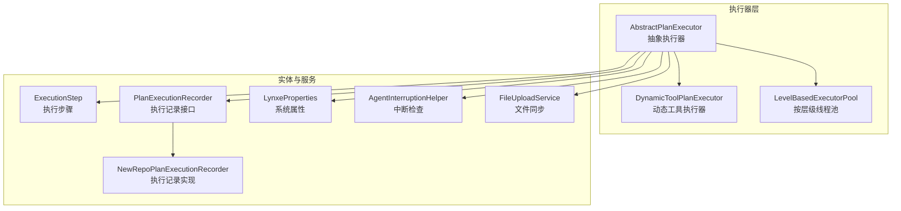
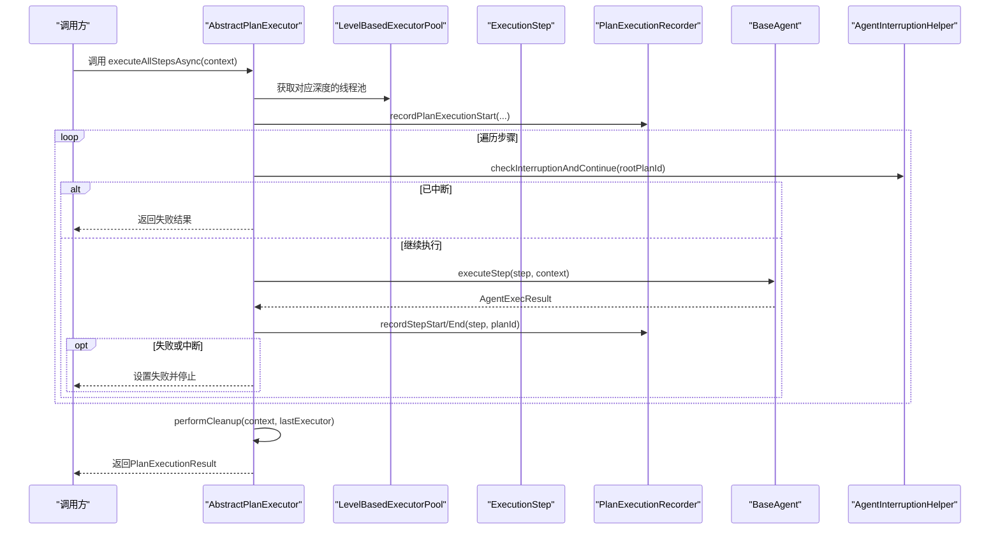
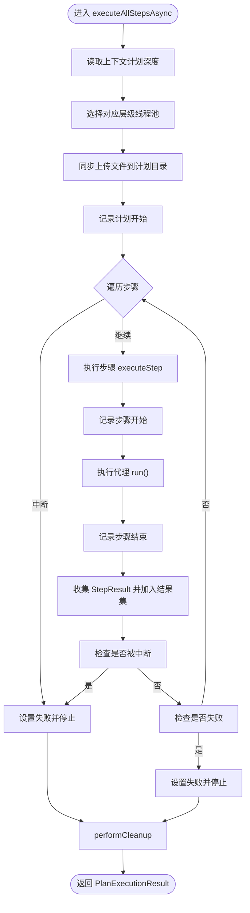
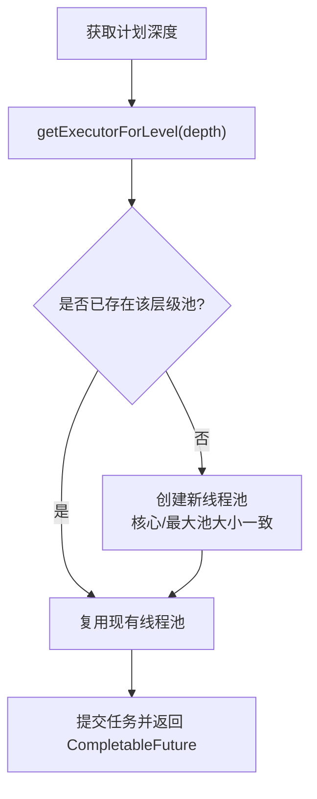
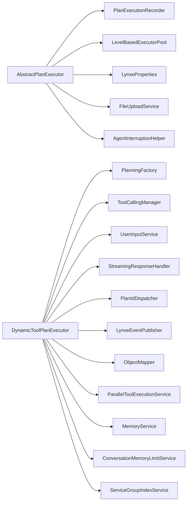

# 抽象执行器基类

<cite>
**本文引用的文件列表**
- [AbstractPlanExecutor.java](file://src/main/java/com/alibaba/cloud/ai/lynxe/runtime/executor/AbstractPlanExecutor.java)
- [DynamicToolPlanExecutor.java](file://src/main/java/com/alibaba/cloud/ai/lynxe/runtime/executor/DynamicToolPlanExecutor.java)
- [PlanExecutorInterface.java](file://src/main/java/com/alibaba/cloud/ai/lynxe/runtime/executor/PlanExecutorInterface.java)
- [LevelBasedExecutorPool.java](file://src/main/java/com/alibaba/cloud/ai/lynxe/runtime/executor/LevelBasedExecutorPool.java)
- [LevelBasedExecutorConfig.java](file://src/main/java/com/alibaba/cloud/ai/lynxe/runtime/executor/LevelBasedExecutorConfig.java)
- [ExecutionStep.java](file://src/main/java/com/alibaba/cloud/ai/lynxe/runtime/entity/vo/ExecutionStep.java)
- [PlanExecutionRecorder.java](file://src/main/java/com/alibaba/cloud/ai/lynxe/recorder/service/PlanExecutionRecorder.java)
- [NewRepoPlanExecutionRecorder.java](file://src/main/java/com/alibaba/cloud/ai/lynxe/recorder/service/NewRepoPlanExecutionRecorder.java)
- [LynxeProperties.java](file://src/main/java/com/alibaba/cloud/ai/lynxe/config/LynxeProperties.java)
- [AgentInterruptionHelper.java](file://src/main/java/com/alibaba/cloud/ai/lynxe/runtime/service/AgentInterruptionHelper.java)
- [FileUploadService.java](file://src/main/java/com/alibaba/cloud/ai/lynxe/runtime/service/FileUploadService.java)
- [PlanExecutorFactory.java](file://src/main/java/com/alibaba/cloud/ai/lynxe/runtime/executor/factory/PlanExecutorFactory.java)
</cite>

## 目录
1. [简介](#简介)
2. [项目结构与定位](#项目结构与定位)
3. [核心组件](#核心组件)
4. [架构总览](#架构总览)
5. [详细组件分析](#详细组件分析)
6. [依赖关系分析](#依赖关系分析)
7. [性能与并发特性](#性能与并发特性)
8. [故障排查指南](#故障排查指南)
9. [结论](#结论)
10. [附录：最佳实践与继承指南](#附录最佳实践与继承指南)

## 简介
本文件围绕抽象计划执行器（AbstractPlanExecutor）进行系统化技术文档梳理，目标是帮助读者理解其作为所有具体执行器基类的设计意图、关键依赖注入项的作用、模板方法模式下的执行生命周期管理、基于计划深度的线程池选择策略，以及代理执行的通用逻辑与异常处理流程。同时给出自定义执行器继承该基类的最佳实践建议。

## 项目结构与定位
- 执行器位于运行时模块的执行器包下，负责统一调度与执行各类计划（Plan）中的步骤（ExecutionStep），并提供可扩展的子类实现。
- 抽象执行器通过接口约束（PlanExecutorInterface）对外暴露异步执行能力，并在内部封装通用的执行生命周期、状态记录、异常处理与资源清理。
- 基于计划层级的线程池（LevelBasedExecutorPool）为不同深度的计划提供隔离的并发执行环境，避免深层计划对根层造成资源竞争。

图表来源
- [AbstractPlanExecutor.java](file://src/main/java/com/alibaba/cloud/ai/lynxe/runtime/executor/AbstractPlanExecutor.java#L1-L120)
- [DynamicToolPlanExecutor.java](file://src/main/java/com/alibaba/cloud/ai/lynxe/runtime/executor/DynamicToolPlanExecutor.java#L1-L120)
- [LevelBasedExecutorPool.java](file://src/main/java/com/alibaba/cloud/ai/lynxe/runtime/executor/LevelBasedExecutorPool.java#L1-L120)
- [ExecutionStep.java](file://src/main/java/com/alibaba/cloud/ai/lynxe/runtime/entity/vo/ExecutionStep.java#L1-L120)
- [PlanExecutionRecorder.java](file://src/main/java/com/alibaba/cloud/ai/lynxe/recorder/service/PlanExecutionRecorder.java#L1-L120)
- [NewRepoPlanExecutionRecorder.java](file://src/main/java/com/alibaba/cloud/ai/lynxe/recorder/service/NewRepoPlanExecutionRecorder.java#L1-L120)
- [LynxeProperties.java](file://src/main/java/com/alibaba/cloud/ai/lynxe/config/LynxeProperties.java#L280-L310)
- [AgentInterruptionHelper.java](file://src/main/java/com/alibaba/cloud/ai/lynxe/runtime/service/AgentInterruptionHelper.java#L35-L64)
- [FileUploadService.java](file://src/main/java/com/alibaba/cloud/ai/lynxe/runtime/service/FileUploadService.java)

章节来源
- [AbstractPlanExecutor.java](file://src/main/java/com/alibaba/cloud/ai/lynxe/runtime/executor/AbstractPlanExecutor.java#L1-L120)
- [PlanExecutorInterface.java](file://src/main/java/com/alibaba/cloud/ai/lynxe/runtime/executor/PlanExecutorInterface.java#L1-L36)

## 核心组件
- 抽象执行器（AbstractPlanExecutor）
  - 统一的执行入口：executeAllStepsAsync，采用模板方法模式组织执行生命周期。
  - 代理执行：executeStep，封装执行器获取、状态记录、异常捕获与结果收集。
  - 步骤解析：getStepFromStepReq，从步骤需求字符串中提取执行类型。
  - 生命周期：recordPlanExecutionStart、recordStepStart/End、performCleanup。
  - 并发控制：基于计划深度选择线程池（LevelBasedExecutorPool）。
  - 中断与清理：AgentInterruptionHelper、LlmService内存清理、最后执行器清理。
- 动态工具执行器（DynamicToolPlanExecutor）
  - 继承抽象执行器，重写步骤类型解析与执行器获取逻辑，生成可配置动态代理（ConfigurableDynaAgent）。
- 线程池（LevelBasedExecutorPool）
  - 按层级（0~N-1）维护独立线程池，支持动态调整大小与监控统计。
- 计划记录器（PlanExecutionRecorder / NewRepoPlanExecutionRecorder）
  - 记录计划与步骤的开始、结束与完成状态，支撑后续查询与可视化。
- 配置与服务
  - LynxeProperties：提供executorPoolSize等全局配置。
  - AgentInterruptionHelper：统一的中断检查入口。
  - FileUploadService：上传文件同步至计划目录。

章节来源
- [AbstractPlanExecutor.java](file://src/main/java/com/alibaba/cloud/ai/lynxe/runtime/executor/AbstractPlanExecutor.java#L80-L120)
- [DynamicToolPlanExecutor.java](file://src/main/java/com/alibaba/cloud/ai/lynxe/runtime/executor/DynamicToolPlanExecutor.java#L111-L181)
- [LevelBasedExecutorPool.java](file://src/main/java/com/alibaba/cloud/ai/lynxe/runtime/executor/LevelBasedExecutorPool.java#L70-L120)
- [PlanExecutionRecorder.java](file://src/main/java/com/alibaba/cloud/ai/lynxe/recorder/service/PlanExecutionRecorder.java#L26-L120)
- [NewRepoPlanExecutionRecorder.java](file://src/main/java/com/alibaba/cloud/ai/lynxe/recorder/service/NewRepoPlanExecutionRecorder.java#L56-L120)
- [LynxeProperties.java](file://src/main/java/com/alibaba/cloud/ai/lynxe/config/LynxeProperties.java#L286-L310)
- [AgentInterruptionHelper.java](file://src/main/java/com/alibaba/cloud/ai/lynxe/runtime/service/AgentInterruptionHelper.java#L35-L64)
- [FileUploadService.java](file://src/main/java/com/alibaba/cloud/ai/lynxe/runtime/service/FileUploadService.java)

## 架构总览
抽象执行器通过“模板方法”组织整个执行流程：先根据上下文中的计划深度选择合适的线程池，再依次执行每个步骤；在每一步前后分别进行记录与中断检查；最终进行清理工作。动态工具执行器在此基础上定制了步骤类型解析与代理实例创建。

图表来源
- [AbstractPlanExecutor.java](file://src/main/java/com/alibaba/cloud/ai/lynxe/runtime/executor/AbstractPlanExecutor.java#L246-L383)
- [LevelBasedExecutorPool.java](file://src/main/java/com/alibaba/cloud/ai/lynxe/runtime/executor/LevelBasedExecutorPool.java#L77-L120)
- [PlanExecutionRecorder.java](file://src/main/java/com/alibaba/cloud/ai/lynxe/recorder/service/PlanExecutionRecorder.java#L28-L81)
- [AgentInterruptionHelper.java](file://src/main/java/com/alibaba/cloud/ai/lynxe/runtime/service/AgentInterruptionHelper.java#L35-L64)

## 详细组件分析

### 抽象执行器（AbstractPlanExecutor）
- 关键职责
  - 提供统一的异步执行入口 executeAllStepsAsync，使用模板方法组织执行生命周期。
  - 在执行前同步上传文件、更新步骤索引、记录计划开始。
  - 逐个执行步骤，记录开始与结束，收集结果，处理中断与失败。
  - 清理阶段：清理LLM记忆与最后执行器资源。
- 依赖注入项与作用
  - recorder：记录计划与步骤的生命周期事件，便于追踪与回放。
  - levelBasedExecutorPool：按计划深度选择线程池，确保不同层级的并发隔离。
  - agents：动态代理实体集合，用于构建具体执行器。
  - llmService：提供清理代理记忆的能力，避免跨计划污染。
  - lynxeProperties：读取executorPoolSize等配置，影响线程池规模。
  - fileUploadService：将上传文件同步到计划目录，保证执行前的输入就绪。
  - agentInterruptionHelper：在关键节点检查用户中断请求，及时停止执行。
- 执行生命周期
  - 开始：设置当前/根计划ID、更新步骤索引、同步上传文件、记录计划开始。
  - 步骤循环：每步前检查中断；执行代理；记录开始/结束；收集结果；判断中断/失败则停止。
  - 结束：设置成功标志与最终结果；异常与致命错误兜底；finally中执行清理。
- 异常与中断处理
  - 步骤级：捕获异常与Throwable，记录错误消息并标记失败；中断时返回中断状态。
  - 计划级：try-catch捕获未预期异常，设置失败与错误信息；CompletableFuture.exceptionally兜底。
  - 中断：在步骤与计划级别均进行检查，一旦中断立即停止后续步骤。
- 清理策略
  - 清理LLM记忆与最后执行器资源，防止资源泄漏与状态残留。

图表来源
- [AbstractPlanExecutor.java](file://src/main/java/com/alibaba/cloud/ai/lynxe/runtime/executor/AbstractPlanExecutor.java#L246-L383)

章节来源
- [AbstractPlanExecutor.java](file://src/main/java/com/alibaba/cloud/ai/lynxe/runtime/executor/AbstractPlanExecutor.java#L80-L120)
- [AbstractPlanExecutor.java](file://src/main/java/com/alibaba/cloud/ai/lynxe/runtime/executor/AbstractPlanExecutor.java#L134-L177)
- [AbstractPlanExecutor.java](file://src/main/java/com/alibaba/cloud/ai/lynxe/runtime/executor/AbstractPlanExecutor.java#L246-L383)
- [AbstractPlanExecutor.java](file://src/main/java/com/alibaba/cloud/ai/lynxe/runtime/executor/AbstractPlanExecutor.java#L385-L397)

### 动态工具执行器（DynamicToolPlanExecutor）
- 继承关系与职责
  - 继承 AbstractPlanExecutor，重写 getStepFromStepReq 与 getExecutorForStep。
  - 当步骤需求解析为默认类型时，映射为“ConfigurableDynaAgent”，并基于规划工厂与工具回调上下文创建代理实例。
- 步骤类型解析
  - 若原始解析为默认类型，则替换为“ConfigurableDynaAgent”，确保动态代理可用。
- 执行器创建
  - 依据步骤索引、期望返回列、模型名、选中工具键等参数，构建可配置动态代理，并注入必要的服务与回调。

```mermaid
classDiagram
class AbstractPlanExecutor {
+executeAllStepsAsync(context)
#executeStep(step, context)
#getStepFromStepReq(stepRequirement)
#performCleanup(context, lastExecutor)
}
class DynamicToolPlanExecutor {
+getStepFromStepReq(stepRequirement)
#getExecutorForStep(context, step)
}
class BaseAgent
class ConfigurableDynaAgent
class PlanningFactory
class ToolCallingManager
class UserInputService
class StreamingResponseHandler
class PlanIdDispatcher
class LynxeEventPublisher
class ObjectMapper
class ParallelToolExecutionService
class MemoryService
class ConversationMemoryLimitService
class ServiceGroupIndexService
DynamicToolPlanExecutor --|> AbstractPlanExecutor
DynamicToolPlanExecutor --> BaseAgent : "创建/返回"
DynamicToolPlanExecutor --> ConfigurableDynaAgent : "实例化"
DynamicToolPlanExecutor --> PlanningFactory : "使用"
DynamicToolPlanExecutor --> ToolCallingManager : "使用"
DynamicToolPlanExecutor --> UserInputService : "使用"
DynamicToolPlanExecutor --> StreamingResponseHandler : "使用"
DynamicToolPlanExecutor --> PlanIdDispatcher : "使用"
DynamicToolPlanExecutor --> LynxeEventPublisher : "使用"
DynamicToolPlanExecutor --> ObjectMapper : "使用"
DynamicToolPlanExecutor --> ParallelToolExecutionService : "使用"
DynamicToolPlanExecutor --> MemoryService : "使用"
DynamicToolPlanExecutor --> ConversationMemoryLimitService : "使用"
DynamicToolPlanExecutor --> ServiceGroupIndexService : "使用"
```

图表来源
- [DynamicToolPlanExecutor.java](file://src/main/java/com/alibaba/cloud/ai/lynxe/runtime/executor/DynamicToolPlanExecutor.java#L111-L181)
- [AbstractPlanExecutor.java](file://src/main/java/com/alibaba/cloud/ai/lynxe/runtime/executor/AbstractPlanExecutor.java#L168-L177)

章节来源
- [DynamicToolPlanExecutor.java](file://src/main/java/com/alibaba/cloud/ai/lynxe/runtime/executor/DynamicToolPlanExecutor.java#L111-L181)

### 线程池选择与层级隔离（LevelBasedExecutorPool）
- 设计要点
  - 按计划深度（0..N-1）维护独立线程池，避免深层计划对根层造成资源竞争。
  - 支持动态调整线程池大小（基于 LynxeProperties.executorPoolSize），并提供监控统计。
  - 提供提交任务的便捷方法，包装为 CompletableFuture，统一异常处理。
- 使用方式
  - 抽象执行器在 executeAllStepsAsync 中根据上下文的计划深度获取对应线程池，从而将计划执行放入正确的并发通道。

图表来源
- [LevelBasedExecutorPool.java](file://src/main/java/com/alibaba/cloud/ai/lynxe/runtime/executor/LevelBasedExecutorPool.java#L77-L120)
- [LevelBasedExecutorPool.java](file://src/main/java/com/alibaba/cloud/ai/lynxe/runtime/executor/LevelBasedExecutorPool.java#L314-L373)
- [LynxeProperties.java](file://src/main/java/com/alibaba/cloud/ai/lynxe/config/LynxeProperties.java#L286-L310)

章节来源
- [LevelBasedExecutorPool.java](file://src/main/java/com/alibaba/cloud/ai/lynxe/runtime/executor/LevelBasedExecutorPool.java#L70-L120)
- [LevelBasedExecutorPool.java](file://src/main/java/com/alibaba/cloud/ai/lynxe/runtime/executor/LevelBasedExecutorPool.java#L314-L373)
- [AbstractPlanExecutor.java](file://src/main/java/com/alibaba/cloud/ai/lynxe/runtime/executor/AbstractPlanExecutor.java#L246-L256)

### 步骤需求解析（getStepFromStepReq）
- 解析规则
  - 从步骤需求字符串开头匹配形如“[类型] 请求内容”的格式，提取类型并转为大写。
  - 若未匹配，默认类型为“DEFAULT_AGENT”，由子类（如 DynamicToolPlanExecutor）将其映射为“ConfigurableDynaAgent”。
- 作用
  - 为执行器选择提供依据，确保不同类型的步骤能路由到对应的代理实现。

章节来源
- [AbstractPlanExecutor.java](file://src/main/java/com/alibaba/cloud/ai/lynxe/runtime/executor/AbstractPlanExecutor.java#L168-L177)
- [DynamicToolPlanExecutor.java](file://src/main/java/com/alibaba/cloud/ai/lynxe/runtime/executor/DynamicToolPlanExecutor.java#L111-L117)

### 记录与回放（PlanExecutionRecorder）
- 记录范围
  - 计划开始：记录当前计划ID、标题、用户请求、步骤列表、父子计划ID、工具调用ID等。
  - 步骤开始/结束：记录单步执行状态与结果。
  - 完成：标记计划完成并写入摘要。
- 实现
  - 接口定义方法签名；具体实现（NewRepoPlanExecutionRecorder）负责持久化与状态更新。

章节来源
- [PlanExecutionRecorder.java](file://src/main/java/com/alibaba/cloud/ai/lynxe/recorder/service/PlanExecutionRecorder.java#L26-L120)
- [NewRepoPlanExecutionRecorder.java](file://src/main/java/com/alibaba/cloud/ai/lynxe/recorder/service/NewRepoPlanExecutionRecorder.java#L56-L120)
- [NewRepoPlanExecutionRecorder.java](file://src/main/java/com/alibaba/cloud/ai/lynxe/recorder/service/NewRepoPlanExecutionRecorder.java#L147-L227)

### 中断与清理
- 中断检查
  - 在计划与步骤执行前调用 AgentInterruptionHelper.checkInterruptionAndContinue，若检测到中断则停止后续步骤。
- 清理
  - 执行完成后清理 LLM 内存与最后执行器资源，避免状态泄露。

章节来源
- [AgentInterruptionHelper.java](file://src/main/java/com/alibaba/cloud/ai/lynxe/runtime/service/AgentInterruptionHelper.java#L35-L64)
- [AbstractPlanExecutor.java](file://src/main/java/com/alibaba/cloud/ai/lynxe/runtime/executor/AbstractPlanExecutor.java#L385-L397)

## 依赖关系分析
- 组件耦合
  - AbstractPlanExecutor 对多个服务强依赖：记录器、线程池、配置、文件服务、中断助手等。
  - DynamicToolPlanExecutor 在抽象之上增加对规划工厂、工具调用管理器、用户输入服务等的依赖。
- 外部集成点
  - 线程池大小来源于 LynxeProperties.executorPoolSize。
  - 文件同步依赖 FileUploadService。
  - 计划记录依赖数据库/仓储实现（NewRepoPlanExecutionRecorder）。

图表来源
- [AbstractPlanExecutor.java](file://src/main/java/com/alibaba/cloud/ai/lynxe/runtime/executor/AbstractPlanExecutor.java#L80-L120)
- [DynamicToolPlanExecutor.java](file://src/main/java/com/alibaba/cloud/ai/lynxe/runtime/executor/DynamicToolPlanExecutor.java#L86-L110)
- [LevelBasedExecutorPool.java](file://src/main/java/com/alibaba/cloud/ai/lynxe/runtime/executor/LevelBasedExecutorPool.java#L314-L373)
- [LynxeProperties.java](file://src/main/java/com/alibaba/cloud/ai/lynxe/config/LynxeProperties.java#L286-L310)

章节来源
- [AbstractPlanExecutor.java](file://src/main/java/com/alibaba/cloud/ai/lynxe/runtime/executor/AbstractPlanExecutor.java#L80-L120)
- [DynamicToolPlanExecutor.java](file://src/main/java/com/alibaba/cloud/ai/lynxe/runtime/executor/DynamicToolPlanExecutor.java#L86-L110)

## 性能与并发特性
- 线程池隔离
  - 不同层级的计划使用独立线程池，降低相互干扰，提升整体吞吐。
- 动态调整
  - 基于 LynxeProperties.executorPoolSize 的配置变化，线程池大小会周期性检查并调整，无需重启即可生效。
- 统一异常包装
  - 提交任务时将异常包装为 CompletionException，便于上层统一处理。
- 监控统计
  - 提供各层级线程池的统计信息（核心/最大/活动线程数、队列长度、任务计数等），便于运维观察。

章节来源
- [LevelBasedExecutorPool.java](file://src/main/java/com/alibaba/cloud/ai/lynxe/runtime/executor/LevelBasedExecutorPool.java#L144-L171)
- [LevelBasedExecutorPool.java](file://src/main/java/com/alibaba/cloud/ai/lynxe/runtime/executor/LevelBasedExecutorPool.java#L206-L241)
- [LevelBasedExecutorPool.java](file://src/main/java/com/alibaba/cloud/ai/lynxe/runtime/executor/LevelBasedExecutorPool.java#L314-L373)

## 故障排查指南
- 常见问题
  - 步骤未找到执行器：检查步骤需求字符串格式是否符合“[类型] 请求内容”，或确认子类是否正确映射默认类型。
  - 执行中断：确认 AgentInterruptionHelper 是否检测到中断；检查计划/步骤级别的中断检查点。
  - 线程池过大/过小：通过 LynxeProperties.executorPoolSize 调整；观察 LevelBasedExecutorPool 的统计信息。
  - 记录缺失：确认 PlanExecutionRecorder 的实现是否正确持久化；检查 recordPlanExecutionStart/recordStepStart/End 的调用链。
- 定位手段
  - 查看 AbstractPlanExecutor 的日志输出位置（开始/结束/异常/致命错误）。
  - 使用 LevelBasedExecutorPool 的统计接口观察各层级负载。
  - 检查 DynamicToolPlanExecutor 的代理创建过程与工具回调上下文。

章节来源
- [AbstractPlanExecutor.java](file://src/main/java/com/alibaba/cloud/ai/lynxe/runtime/executor/AbstractPlanExecutor.java#L134-L177)
- [AbstractPlanExecutor.java](file://src/main/java/com/alibaba/cloud/ai/lynxe/runtime/executor/AbstractPlanExecutor.java#L336-L383)
- [LevelBasedExecutorPool.java](file://src/main/java/com/alibaba/cloud/ai/lynxe/runtime/executor/LevelBasedExecutorPool.java#L144-L171)
- [PlanExecutionRecorder.java](file://src/main/java/com/alibaba/cloud/ai/lynxe/recorder/service/PlanExecutionRecorder.java#L26-L120)

## 结论
AbstractPlanExecutor 通过模板方法模式将计划执行的通用流程标准化，结合按层级的线程池隔离、完善的记录与中断机制，提供了高可靠、可扩展的执行框架。DynamicToolPlanExecutor 则在此基础上实现了动态代理的创建与调度，满足复杂工具链场景的需求。对于自定义执行器，遵循基类约定、合理解析步骤类型、正确处理中断与异常、并在 finally 中完成清理，即可快速接入整体执行体系。

## 附录：最佳实践与继承指南
- 继承 AbstractPlanExecutor 的步骤
  - 重写 getStepFromStepReq：确保能从步骤需求字符串中准确解析出执行类型；若需要默认类型映射，可在子类中覆盖。
  - 重写 getExecutorForStep：根据上下文与步骤信息创建具体的代理实例；注入必要的服务与回调。
  - 复用 executeStep：若不需要特殊代理逻辑，可直接复用基类的代理执行与记录流程。
- 并发与隔离
  - 依赖上下文中的计划深度自动选择线程池；如需自定义线程池参数，可通过 LevelBasedExecutorPool 的重载方法或配置项调整。
- 记录与可观测性
  - 在关键节点调用 recorder 的开始/结束/完成方法，确保执行轨迹完整；必要时扩展记录器实现以满足业务需求。
- 中断与清理
  - 在计划与步骤执行前调用中断检查；在 finally 中调用 performCleanup，确保资源释放与状态清理。
- 配置与弹性
  - 通过 LynxeProperties.executorPoolSize 调整线程池规模；关注 LevelBasedExecutorPool 的监控统计，及时发现热点与瓶颈。

章节来源
- [AbstractPlanExecutor.java](file://src/main/java/com/alibaba/cloud/ai/lynxe/runtime/executor/AbstractPlanExecutor.java#L168-L177)
- [AbstractPlanExecutor.java](file://src/main/java/com/alibaba/cloud/ai/lynxe/runtime/executor/AbstractPlanExecutor.java#L246-L383)
- [DynamicToolPlanExecutor.java](file://src/main/java/com/alibaba/cloud/ai/lynxe/runtime/executor/DynamicToolPlanExecutor.java#L111-L181)
- [LevelBasedExecutorPool.java](file://src/main/java/com/alibaba/cloud/ai/lynxe/runtime/executor/LevelBasedExecutorPool.java#L314-L373)
- [LynxeProperties.java](file://src/main/java/com/alibaba/cloud/ai/lynxe/config/LynxeProperties.java#L286-L310)