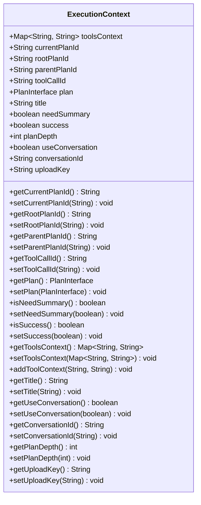
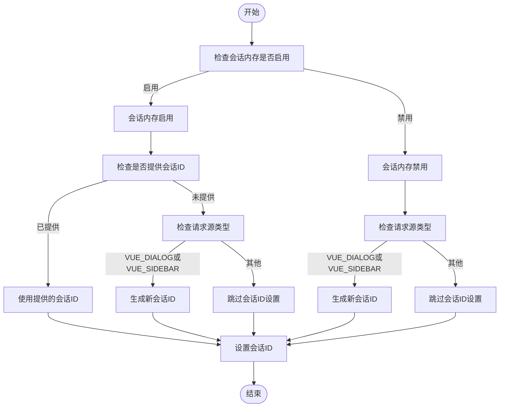
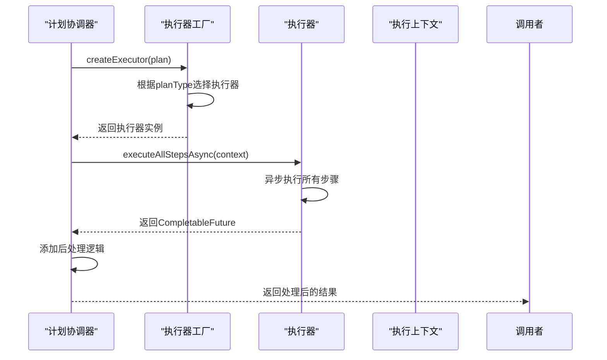

# 计划协调器

<cite>
**本文档中引用的文件**  
- [PlanningCoordinator.java](file://src/main/java/com/alibaba/cloud/ai/lynxe/runtime/service/PlanningCoordinator.java)
- [ExecutionContext.java](file://src/main/java/com/alibaba/cloud/ai/lynxe/runtime/entity/vo/ExecutionContext.java)
- [RequestSource.java](file://src/main/java/com/alibaba/cloud/ai/lynxe/runtime/entity/vo/RequestSource.java)
- [PlanExecutorFactory.java](file://src/main/java/com/alibaba/cloud/ai/lynxe/runtime/executor/factory/PlanExecutorFactory.java)
- [PlanFinalizer.java](file://src/main/java/com/alibaba/cloud/ai/lynxe/planning/service/PlanFinalizer.java)
- [MemoryService.java](file://src/main/java/com/alibaba/cloud/ai/lynxe/workspace/conversation/service/MemoryService.java)
- [LynxeProperties.java](file://src/main/java/com/alibaba/cloud/ai/lynxe/config/LynxeProperties.java)
- [PlanExecutorInterface.java](file://src/main/java/com/alibaba/cloud/ai/lynxe/runtime/executor/PlanExecutorInterface.java)
</cite>

## 目录
1. [简介](#简介)
2. [核心执行流程](#核心执行流程)
3. [执行上下文构建](#执行上下文构建)
4. [会话内存处理策略](#会话内存处理策略)
5. [执行器创建与异步执行](#执行器创建与异步执行)
6. [执行结果后处理](#执行结果后处理)
7. [父子计划关系管理](#父子计划关系管理)

## 简介
计划协调器（PlanningCoordinator）是系统中负责协调和执行计划的核心组件。它通过`executeByPlan`方法接收计划执行请求，构建执行上下文，创建相应的执行器，并协调整个计划的异步执行过程。该组件还负责与会话内存服务交互，根据配置决定是否启用会话记忆功能，并在执行完成后通过PlanFinalizer对结果进行后处理。计划协调器在复杂计划层级中扮演着关键角色，确保父子计划之间的正确关联和状态传递。

## 核心执行流程
计划协调器的核心功能体现在`executeByPlan`方法中，该方法接收计划接口、计划ID信息、请求源和上传键等参数，启动完整的计划执行流程。方法首先创建执行上下文（ExecutionContext），然后根据计划类型通过PlanExecutorFactory创建相应的执行器，最后将上下文传递给执行器的`executeAllStepsAsync`方法进行异步执行。执行完成后，结果会通过PlanFinalizer进行后处理，包括生成摘要、记录执行完成状态等。整个流程被包裹在异常处理块中，确保任何执行错误都能被捕获并返回适当的错误结果。

**Section sources**
- [PlanningCoordinator.java](file://src/main/java/com/alibaba/cloud/ai/lynxe/runtime/service/PlanningCoordinator.java#L76-L179)

## 执行上下文构建
执行上下文（ExecutionContext）是计划执行过程中的核心数据载体，负责在各个执行阶段之间传递状态信息。在`executeByPlan`方法中，协调器会构建一个ExecutionContext实例，并设置以下关键属性：rootPlanId（根计划ID）、parentPlanId（父计划ID）、currentPlanId（当前计划ID）、toolcallId（工具调用ID）、requestSource（请求源）、uploadKey（上传键）和planDepth（计划深度）。其中，planDepth用于表示计划在执行层次结构中的深度，根计划为0级，子计划逐级递增。needSummary标志根据请求源和工具调用ID决定是否需要生成执行结果摘要。

**Diagram sources**
- [ExecutionContext.java](file://src/main/java/com/alibaba/cloud/ai/lynxe/runtime/entity/vo/ExecutionContext.java#L34-L252)

**Section sources**
- [ExecutionContext.java](file://src/main/java/com/alibaba/cloud/ai/lynxe/runtime/entity/vo/ExecutionContext.java#L34-L252)
- [PlanningCoordinator.java](file://src/main/java/com/alibaba/cloud/ai/lynxe/runtime/service/PlanningCoordinator.java#L83-L144)

## 会话内存处理策略
计划协调器根据`lynxeProperties.getEnableConversationMemory()`配置和`requestSource`类型来决定会话ID的生成和使用策略。当会话内存功能启用时，对于来自Vue对话框（VUE_DIALOG）或Vue侧边栏（VUE_SIDEBAR）的请求，协调器会生成一个新的会话ID；如果提供了会话ID，则直接使用。当会话内存功能禁用时，同样为Vue请求生成新的会话ID，但不会为非Vue请求设置会话ID。这种策略确保了在不同场景下会话记忆功能的一致性，同时避免了为非交互式请求创建不必要的会话记录。

**Diagram sources**
- [PlanningCoordinator.java](file://src/main/java/com/alibaba/cloud/ai/lynxe/runtime/service/PlanningCoordinator.java#L106-L138)
- [LynxeProperties.java](file://src/main/java/com/alibaba/cloud/ai/lynxe/config/LynxeProperties.java#L217-L236)
- [RequestSource.java](file://src/main/java/com/alibaba/cloud/ai/lynxe/runtime/entity/vo/RequestSource.java#L21-L36)

**Section sources**
- [PlanningCoordinator.java](file://src/main/java/com/alibaba/cloud/ai/lynxe/runtime/service/PlanningCoordinator.java#L106-L138)
- [LynxeProperties.java](file://src/main/java/com/alibaba/cloud/ai/lynxe/config/LynxeProperties.java#L217-L236)
- [RequestSource.java](file://src/main/java/com/alibaba/cloud/ai/lynxe/runtime/entity/vo/RequestSource.java#L21-L36)

## 执行器创建与异步执行
计划协调器通过PlanExecutorFactory创建执行器实例，该工厂根据计划类型动态选择合适的执行器实现。目前支持的计划类型包括"dynamic_agent"，工厂会为这些类型创建DynamicToolPlanExecutor实例。创建执行器后，协调器调用其`executeAllStepsAsync`方法，传入已构建的ExecutionContext，启动异步执行流程。该方法返回一个CompletableFuture，表示异步执行的结果，协调器会在此基础上添加后处理逻辑，确保执行完成后能进行必要的清理和状态更新。

**Diagram sources**
- [PlanningCoordinator.java](file://src/main/java/com/alibaba/cloud/ai/lynxe/runtime/service/PlanningCoordinator.java#L156-L157)
- [PlanExecutorFactory.java](file://src/main/java/com/alibaba/cloud/ai/lynxe/runtime/executor/factory/PlanExecutorFactory.java#L159-L177)
- [PlanExecutorInterface.java](file://src/main/java/com/alibaba/cloud/ai/lynxe/runtime/executor/PlanExecutorInterface.java#L26-L35)

**Section sources**
- [PlanningCoordinator.java](file://src/main/java/com/alibaba/cloud/ai/lynxe/runtime/service/PlanningCoordinator.java#L156-L157)
- [PlanExecutorFactory.java](file://src/main/java/com/alibaba/cloud/ai/lynxe/runtime/executor/factory/PlanExecutorFactory.java#L159-L177)

## 执行结果后处理
执行结果的后处理由PlanFinalizer组件负责。当计划执行完成后，协调器会将ExecutionContext和PlanExecutionResult传递给PlanFinalizer的`handlePostExecution`方法。该方法首先检查任务是否被中断，如果是，则生成相应的中断消息。然后根据上下文中的needSummary标志决定是否调用大模型生成执行摘要，或为直接响应计划生成直接回复。处理完成后，最终结果会被保存到会话内存中，并记录计划完成状态。这种后处理机制确保了执行结果的一致性和完整性，同时提供了灵活的响应生成策略。

**Section sources**
- [PlanFinalizer.java](file://src/main/java/com/alibaba/cloud/ai/lynxe/planning/service/PlanFinalizer.java#L181-L232)
- [PlanningCoordinator.java](file://src/main/java/com/alibaba/cloud/ai/lynxe/runtime/service/PlanningCoordinator.java#L160-L168)

## 父子计划关系管理
在复杂计划层级中，计划协调器通过rootPlanId、parentPlanId和currentPlanId等字段管理父子计划关系。根计划的rootPlanId和currentPlanId相同，而子计划的parentPlanId指向其父计划的ID。planDepth字段用于表示计划的嵌套深度，根计划为0，每深入一层递增1。当子计划执行完成时，其结果会通过上下文传递回父计划，形成完整的执行链条。这种层级管理机制使得系统能够处理复杂的嵌套计划结构，确保每个计划在其正确的上下文中执行，并保持父子计划之间的状态一致性。

**Section sources**
- [ExecutionContext.java](file://src/main/java/com/alibaba/cloud/ai/lynxe/runtime/entity/vo/ExecutionContext.java#L41-L48)
- [PlanningCoordinator.java](file://src/main/java/com/alibaba/cloud/ai/lynxe/runtime/service/PlanningCoordinator.java#L77-L78)