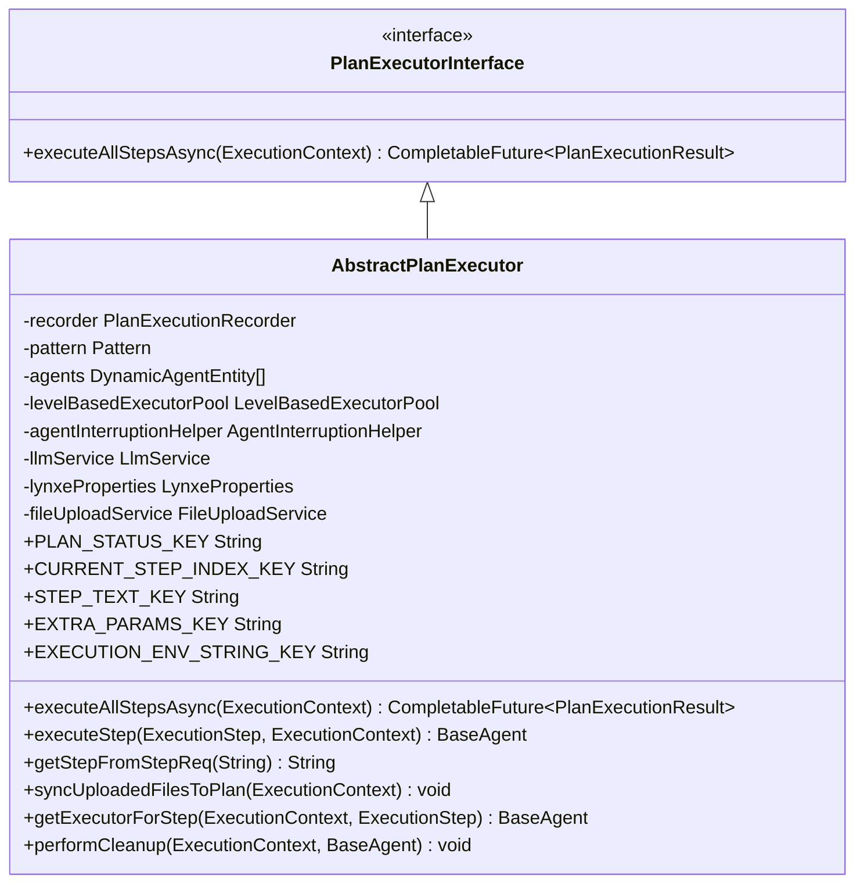
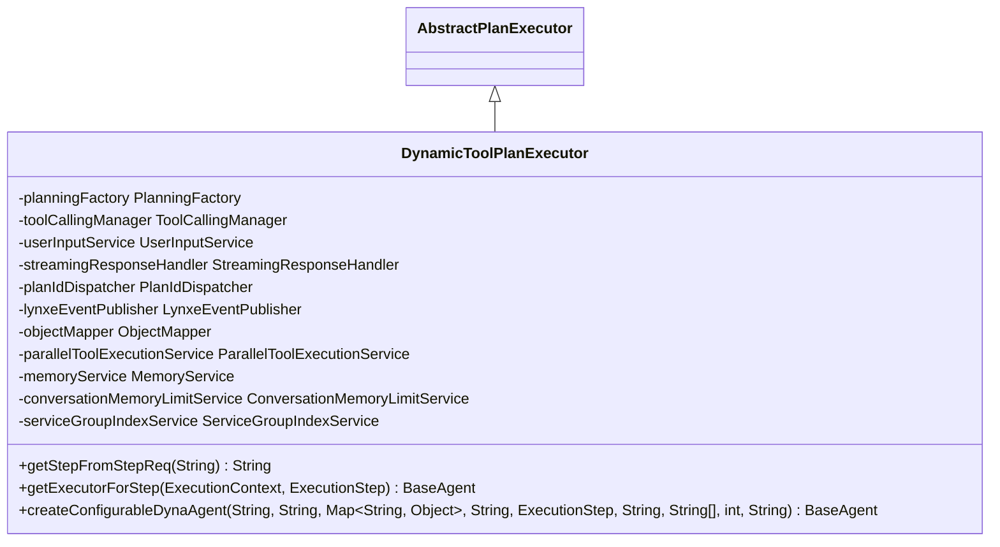
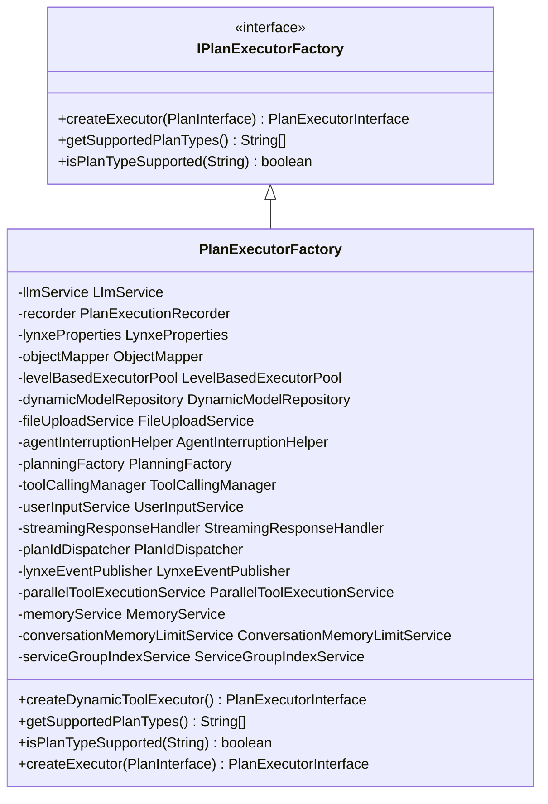
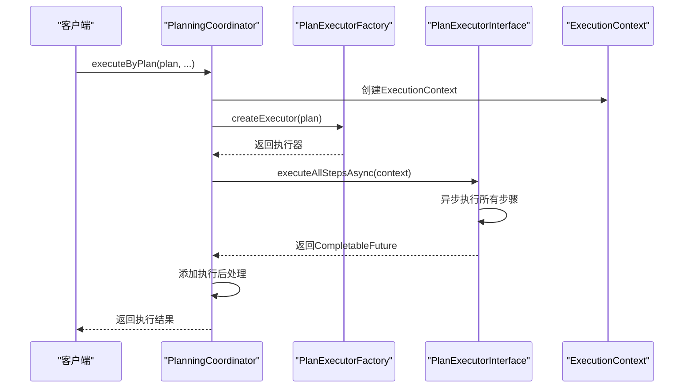
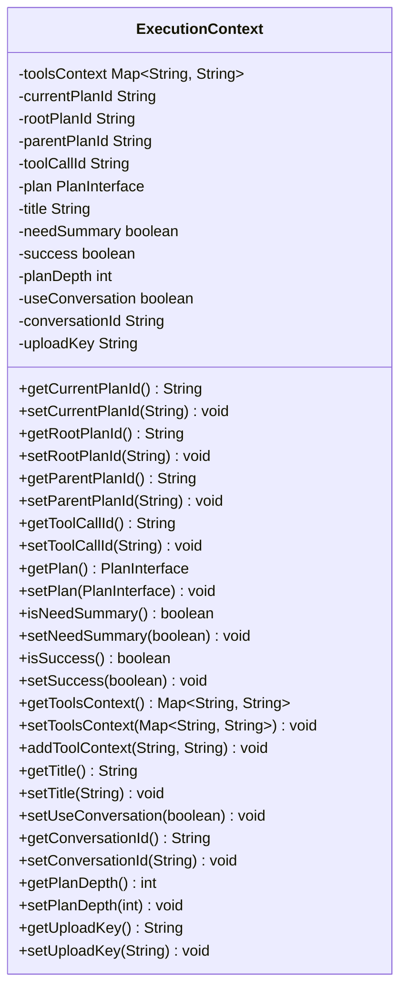
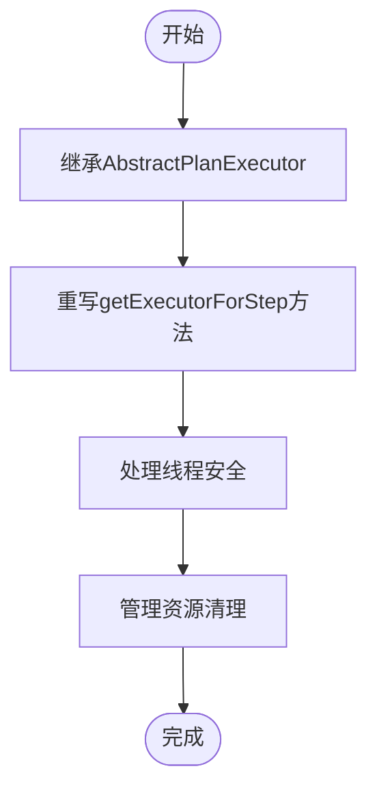
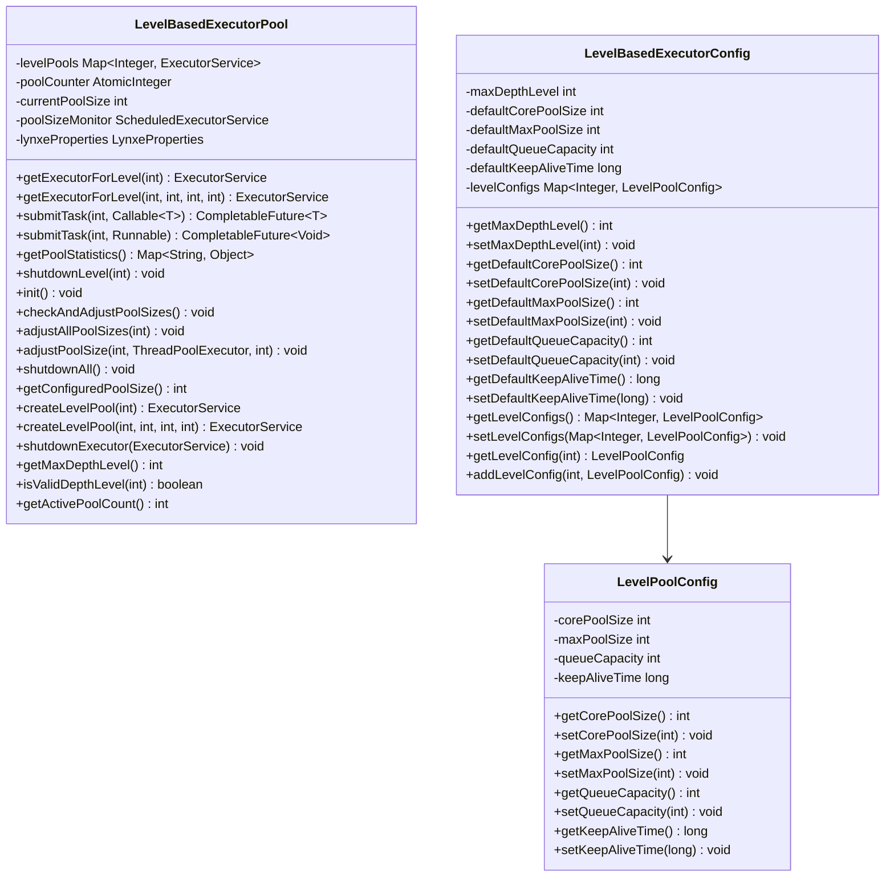

# 计划执行引擎

<cite>
**本文档引用的文件**
- [PlanExecutorInterface.java](file://src/main/java/com/alibaba/cloud/ai/lynxe/runtime/executor/PlanExecutorInterface.java)
- [AbstractPlanExecutor.java](file://src/main/java/com/alibaba/cloud/ai/lynxe/runtime/executor/AbstractPlanExecutor.java)
- [DynamicToolPlanExecutor.java](file://src/main/java/com/alibaba/cloud/ai/lynxe/runtime/executor/DynamicToolPlanExecutor.java)
- [PlanExecutorFactory.java](file://src/main/java/com/alibaba/cloud/ai/lynxe/runtime/executor/factory/PlanExecutorFactory.java)
- [IPlanExecutorFactory.java](file://src/main/java/com/alibaba/cloud/ai/lynxe/runtime/executor/factory/IPlanExecutorFactory.java)
- [PlanningCoordinator.java](file://src/main/java/com/alibaba/cloud/ai/lynxe/runtime/service/PlanningCoordinator.java)
- [ExecutionContext.java](file://src/main/java/com/alibaba/cloud/ai/lynxe/runtime/entity/vo/ExecutionContext.java)
- [PlanExecutionResult.java](file://src/main/java/com/alibaba/cloud/ai/lynxe/runtime/entity/vo/PlanExecutionResult.java)
- [LevelBasedExecutorPool.java](file://src/main/java/com/alibaba/cloud/ai/lynxe/runtime/executor/LevelBasedExecutorPool.java)
- [LevelBasedExecutorConfig.java](file://src/main/java/com/alibaba/cloud/ai/lynxe/runtime/executor/LevelBasedExecutorConfig.java)
- [PlanInterface.java](file://src/main/java/com/alibaba/cloud/ai/lynxe/runtime/entity/vo/PlanInterface.java)
- [ExecutionStep.java](file://src/main/java/com/alibaba/cloud/ai/lynxe/runtime/entity/vo/ExecutionStep.java)
- [StepResult.java](file://src/main/java/com/alibaba/cloud/ai/lynxe/runtime/entity/vo/StepResult.java)
- [RequestSource.java](file://src/main/java/com/alibaba/cloud/ai/lynxe/runtime/entity/vo/RequestSource.java)
</cite>

## 目录
1. [引言](#引言)
2. [执行契约与基础实现](#执行契约与基础实现)
3. [执行器类型特化](#执行器类型特化)
4. [工厂模式创建机制](#工厂模式创建机制)
5. [协调器工作机制](#协调器工作机制)
6. [执行上下文管理](#执行上下文管理)
7. [自定义执行器开发指南](#自定义执行器开发指南)
8. [性能监控与异常处理](#性能监控与异常处理)
9. [总结](#总结)

## 引言

计划执行引擎是JManus系统中的核心组件，负责协调和执行各种类型的计划任务。该引擎通过定义清晰的执行契约、提供基础功能实现、支持多种执行器类型以及工厂模式的动态创建机制，实现了灵活、可扩展的计划执行能力。本文档将深入解析计划执行引擎的各个组成部分，包括执行契约、基础实现、执行器类型、工厂模式、协调器、执行上下文管理等方面，为开发者提供全面的技术指导。

## 执行契约与基础实现

计划执行引擎的核心是`PlanExecutorInterface`接口，它定义了所有计划执行器必须遵循的执行契约。该接口通过`executeAllStepsAsync`方法提供异步执行所有步骤的能力，接收`ExecutionContext`作为执行上下文，返回包含执行结果的`CompletableFuture<PlanExecutionResult>`。

**图表来源**
- [PlanExecutorInterface.java](file://src/main/java/com/alibaba/cloud/ai/lynxe/runtime/executor/PlanExecutorInterface.java#L26-L35)
- [AbstractPlanExecutor.java](file://src/main/java/com/alibaba/cloud/ai/lynxe/runtime/executor/AbstractPlanExecutor.java#L45-L396)

**章节来源**
- [PlanExecutorInterface.java](file://src/main/java/com/alibaba/cloud/ai/lynxe/runtime/executor/PlanExecutorInterface.java#L1-L36)
- [AbstractPlanExecutor.java](file://src/main/java/com/alibaba/cloud/ai/lynxe/runtime/executor/AbstractPlanExecutor.java#L1-L397)

`AbstractPlanExecutor`作为抽象基类，实现了`PlanExecutorInterface`接口，提供了通用的执行逻辑和基础功能。它通过依赖注入获取各种服务组件，如计划执行记录器、LLM服务、文件上传服务等，并定义了多个静态常量作为执行参数的键名。该类的核心方法`executeAllStepsAsync`使用级别基础的执行器池（LevelBasedExecutorPool）来异步执行计划的所有步骤，确保不同深度的计划能够获得适当的线程资源。

## 执行器类型特化

计划执行引擎支持多种执行器类型，其中`DynamicToolPlanExecutor`是最具代表性的特化执行器。它专门用于处理带有用户选择工具支持的动态代理执行计划，能够根据执行上下文和步骤要求创建相应的执行器实例。

**图表来源**
- [DynamicToolPlanExecutor.java](file://src/main/java/com/alibaba/cloud/ai/lynxe/runtime/executor/DynamicToolPlanExecutor.java#L52-L182)

**章节来源**
- [DynamicToolPlanExecutor.java](file://src/main/java/com/alibaba/cloud/ai/lynxe/runtime/executor/DynamicToolPlanExecutor.java#L1-L183)

`DynamicToolPlanExecutor`通过重写`getExecutorForStep`方法，根据步骤要求中的类型信息创建相应的执行器。对于"ConfigurableDynaAgent"类型的步骤，它会调用`createConfigurableDynaAgent`方法创建可配置的动态代理实例，并设置必要的初始化参数和回调上下文。这种特化行为使得执行器能够灵活地处理不同类型的计划步骤，满足复杂的业务需求。

## 工厂模式创建机制

`PlanExecutorFactory`是计划执行器的工厂类，负责根据计划类型动态创建合适的执行器实例。它实现了`IPlanExecutorFactory`接口，提供了`createExecutor`方法来根据计划的类型创建相应的执行器。

**图表来源**
- [IPlanExecutorFactory.java](file://src/main/java/com/alibaba/cloud/ai/lynxe/runtime/executor/factory/IPlanExecutorFactory.java#L24-L41)
- [PlanExecutorFactory.java](file://src/main/java/com/alibaba/cloud/ai/lynxe/runtime/executor/factory/PlanExecutorFactory.java#L50-L180)

**章节来源**
- [IPlanExecutorFactory.java](file://src/main/java/com/alibaba/cloud/ai/lynxe/runtime/executor/factory/IPlanExecutorFactory.java#L1-L42)
- [PlanExecutorFactory.java](file://src/main/java/com/alibaba/cloud/ai/lynxe/runtime/executor/factory/PlanExecutorFactory.java#L1-L181)

`PlanExecutorFactory`通过`switch`语句根据计划类型创建相应的执行器实例。目前主要支持"dynamic_agent"类型的计划，对于未知的计划类型，默认使用动态工具执行器。这种工厂模式的设计使得系统能够轻松扩展新的执行器类型，只需在工厂类中添加相应的创建逻辑即可。

## 协调器工作机制

`PlanningCoordinator`是计划执行的协调器，负责协调多个计划的执行。它通过`executeByPlan`方法直接执行给定的计划，并使用`PlanExecutorFactory`来动态选择合适的执行器。

**图表来源**
- [PlanningCoordinator.java](file://src/main/java/com/alibaba/cloud/ai/lynxe/runtime/service/PlanningCoordinator.java#L76-L178)

**章节来源**
- [PlanningCoordinator.java](file://src/main/java/com/alibaba/cloud/ai/lynxe/runtime/service/PlanningCoordinator.java#L1-L182)

`PlanningCoordinator`的工作机制包括：创建执行上下文、通过工厂创建执行器、异步执行计划以及执行后的结果处理。它还负责处理会话内存的生成和管理，确保在不同请求源（如VUE_DIALOG、VUE_SIDEBAR）下能够正确地使用会话内存。通过`PlanFinalizer`对执行结果进行后处理，确保结果的完整性和一致性。

## 执行上下文管理

执行上下文（ExecutionContext）是计划执行过程中状态信息的载体，负责在各个执行阶段之间传递和维护状态信息。它包含了计划ID、计划实体、用户原始请求、执行状态、执行结果摘要等关键信息。

**图表来源**
- [ExecutionContext.java](file://src/main/java/com/alibaba/cloud/ai/lynxe/runtime/entity/vo/ExecutionContext.java#L34-L251)

**章节来源**
- [ExecutionContext.java](file://src/main/java/com/alibaba/cloud/ai/lynxe/runtime/entity/vo/ExecutionContext.java#L1-L252)

执行上下文的管理机制确保了计划执行过程中的状态一致性。通过`PlanExecutionResult`类收集所有步骤的执行结果，包括每个步骤的索引、要求、结果、状态和代理名称。这种结构化的结果管理方式便于后续的结果分析和展示。

## 自定义执行器开发指南

开发自定义执行器需要遵循以下要点：

1. **继承AbstractPlanExecutor**：自定义执行器应继承`AbstractPlanExecutor`类，以复用基础功能和通用逻辑。
2. **实现getExecutorForStep方法**：重写`getExecutorForStep`方法，根据步骤要求创建相应的执行器实例。
3. **处理线程安全**：由于计划执行是异步进行的，需要确保执行器的线程安全性，避免共享状态的竞态条件。
4. **正确管理资源**：在`performCleanup`方法中正确清理执行过程中使用的资源，如内存、文件句柄等。

**图表来源**
- [AbstractPlanExecutor.java](file://src/main/java/com/alibaba/cloud/ai/lynxe/runtime/executor/AbstractPlanExecutor.java#L45-L396)
- [DynamicToolPlanExecutor.java](file://src/main/java/com/alibaba/cloud/ai/lynxe/runtime/executor/DynamicToolPlanExecutor.java#L52-L182)

**章节来源**
- [AbstractPlanExecutor.java](file://src/main/java/com/alibaba/cloud/ai/lynxe/runtime/executor/AbstractPlanExecutor.java#L1-L397)
- [DynamicToolPlanExecutor.java](file://src/main/java/com/alibaba/cloud/ai/lynxe/runtime/executor/DynamicToolPlanExecutor.java#L1-L183)

## 性能监控与异常处理

计划执行引擎提供了完善的性能监控和异常处理机制。通过`LevelBasedExecutorPool`管理不同深度级别的线程池，确保高深度计划不会耗尽系统资源。同时，执行过程中捕获各种异常并进行适当的处理，保证系统的稳定性和可靠性。

**图表来源**
- [LevelBasedExecutorPool.java](file://src/main/java/com/alibaba/cloud/ai/lynxe/runtime/executor/LevelBasedExecutorPool.java#L49-L421)
- [LevelBasedExecutorConfig.java](file://src/main/java/com/alibaba/cloud/ai/lynxe/runtime/executor/LevelBasedExecutorConfig.java#L29-L188)

**章节来源**
- [LevelBasedExecutorPool.java](file://src/main/java/com/alibaba/cloud/ai/lynxe/runtime/executor/LevelBasedExecutorPool.java#L1-L422)
- [LevelBasedExecutorConfig.java](file://src/main/java/com/alibaba/cloud/ai/lynxe/runtime/executor/LevelBasedExecutorConfig.java#L1-L189)

异常处理方面，执行引擎在多个层次上捕获和处理异常。在步骤执行层面，捕获`Exception`和`Throwable`，记录错误日志并设置步骤的错误信息。在计划执行层面，捕获未处理的异常，确保`CompletableFuture`能够正确地完成或失败。通过这种多层次的异常处理机制，保证了系统的健壮性和用户体验。

## 总结

计划执行引擎通过清晰的执行契约、灵活的执行器类型、动态的工厂模式、协调的执行机制、完善的上下文管理和强大的性能监控，构建了一个高效、可靠、可扩展的计划执行系统。开发者可以根据具体需求开发自定义执行器，充分利用引擎提供的基础功能和扩展机制，实现复杂的业务逻辑。同时，引擎的异常处理和性能监控机制确保了系统的稳定性和可维护性，为用户提供高质量的服务体验。