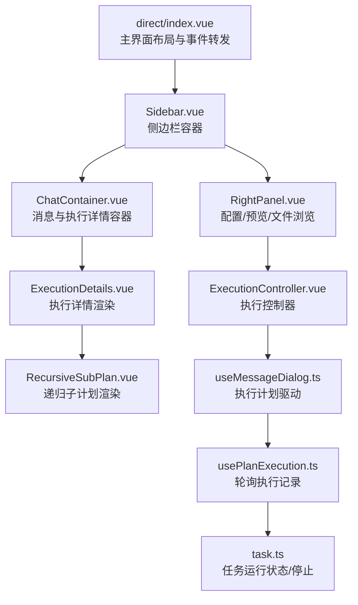
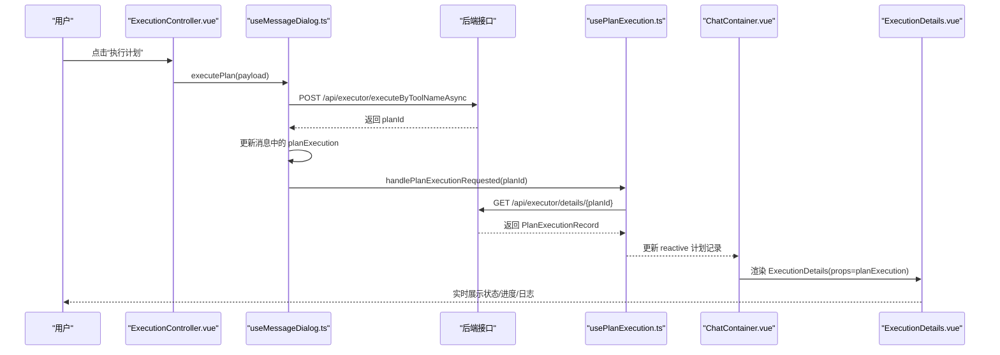
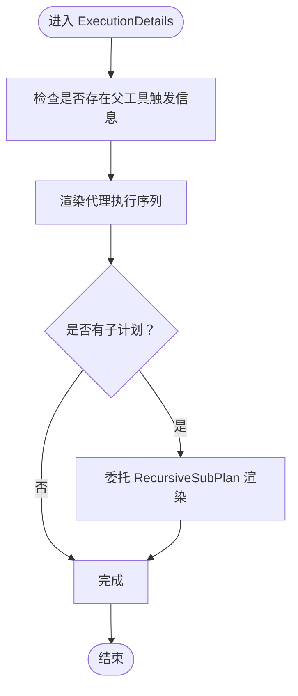
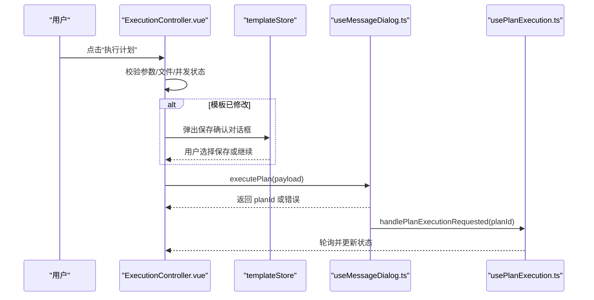
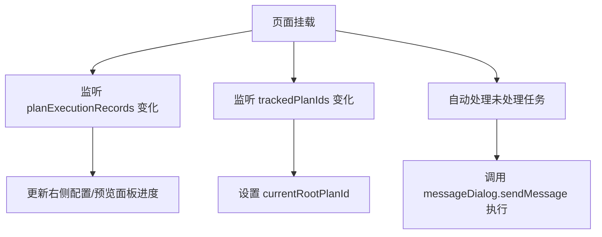
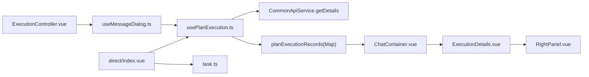

# 执行监控UI集成

<cite>
**本文引用的文件列表**
- [ExecutionDetails.vue](file://ui-vue3/src/components/chat/ExecutionDetails.vue)
- [ExecutionController.vue](file://ui-vue3/src/components/sidebar/ExecutionController.vue)
- [index.vue（direct 主界面）](file://ui-vue3/src/views/direct/index.vue)
- [ChatContainer.vue](file://ui-vue3/src/components/chat/ChatContainer.vue)
- [RightPanel.vue](file://ui-vue3/src/components/right-panel/RightPanel.vue)
- [usePlanExecution.ts](file://ui-vue3/src/composables/usePlanExecution.ts)
- [useMessageDialog.ts](file://ui-vue3/src/composables/useMessageDialog.ts)
- [plan-execution-record.ts](file://ui-vue3/src/types/plan-execution-record.ts)
- [task.ts](file://ui-vue3/src/stores/task.ts)
- [RecursiveSubPlan.vue](file://ui-vue3/src/components/chat/RecursiveSubPlan.vue)
</cite>

## 目录
1. [简介](#简介)
2. [项目结构](#项目结构)
3. [核心组件](#核心组件)
4. [架构总览](#架构总览)
5. [详细组件分析](#详细组件分析)
6. [依赖关系分析](#依赖关系分析)
7. [性能考量](#性能考量)
8. [故障排查指南](#故障排查指南)
9. [结论](#结论)
10. [附录](#附录)

## 简介
本文件面向执行监控UI的集成与使用，围绕以下目标展开：
- ExecutionDetails.vue 如何订阅执行状态变化并实时更新执行详情视图（包括进度条、状态标签、日志输出等）
- ExecutionController.vue 如何提供执行控制按钮（如执行、发布服务等），并与状态管理模块交互
- direct/index.vue 主界面如何集成上述组件，形成完整的监控工作流
- 提供UI组件交互图，展示用户操作与状态更新的响应链条，并包含响应式设计与用户体验优化要点

## 项目结构
执行监控UI位于前端工程 ui-vue3 中，主要涉及以下模块：
- 视图层：direct/index.vue 作为主入口，组织侧边栏、右侧配置/预览面板与聊天区域
- 控制器：ExecutionController.vue 负责参数校验、执行计划、保存模板、发布服务等
- 渲染层：ExecutionDetails.vue 展示执行序列、子计划、步骤状态；ChatContainer.vue 将消息与执行详情组合显示；RightPanel.vue 展示步骤级详情与动态效果
- 状态管理：usePlanExecution.ts 提供计划执行记录的轮询与缓存；useMessageDialog.ts 驱动对话与执行流程；task.ts 提供任务运行状态与停止能力
- 类型定义：plan-execution-record.ts 定义执行记录的数据结构

图表来源
- [index.vue（direct 主界面）](file://ui-vue3/src/views/direct/index.vue#L1-L120)
- [ExecutionController.vue](file://ui-vue3/src/components/sidebar/ExecutionController.vue#L1-L120)
- [ChatContainer.vue](file://ui-vue3/src/components/chat/ChatContainer.vue#L1-L120)
- [ExecutionDetails.vue](file://ui-vue3/src/components/chat/ExecutionDetails.vue#L1-L120)
- [RightPanel.vue](file://ui-vue3/src/components/right-panel/RightPanel.vue#L1-L120)
- [usePlanExecution.ts](file://ui-vue3/src/composables/usePlanExecution.ts#L1-L120)
- [useMessageDialog.ts](file://ui-vue3/src/composables/useMessageDialog.ts#L591-L648)
- [task.ts](file://ui-vue3/src/stores/task.ts#L115-L193)

章节来源
- [index.vue（direct 主界面）](file://ui-vue3/src/views/direct/index.vue#L1-L120)
- [ExecutionController.vue](file://ui-vue3/src/components/sidebar/ExecutionController.vue#L1-L120)
- [ChatContainer.vue](file://ui-vue3/src/components/chat/ChatContainer.vue#L1-L120)
- [ExecutionDetails.vue](file://ui-vue3/src/components/chat/ExecutionDetails.vue#L1-L120)
- [RightPanel.vue](file://ui-vue3/src/components/right-panel/RightPanel.vue#L1-L120)
- [usePlanExecution.ts](file://ui-vue3/src/composables/usePlanExecution.ts#L1-L120)
- [useMessageDialog.ts](file://ui-vue3/src/composables/useMessageDialog.ts#L591-L648)
- [task.ts](file://ui-vue3/src/stores/task.ts#L115-L193)

## 核心组件
- ExecutionDetails.vue：接收后端返回的执行记录，渲染代理执行序列、子计划、步骤状态与结果/错误信息；支持点击步骤跳转到右侧面板
- ExecutionController.vue：负责参数要求加载与校验、文件上传、执行计划、保存模板、发布服务；通过 useMessageDialog 触发执行并由 usePlanExecution 轮询状态
- ChatContainer.vue：在助手消息中嵌入 ExecutionDetails，根据消息中的 planExecution 字段决定是否渲染执行详情
- RightPanel.vue：展示当前选中步骤的详细信息，含动态执行指示与滚动到底部按钮
- usePlanExecution.ts：集中管理计划执行记录的轮询、缓存、清理与完成后的后处理
- useMessageDialog.ts：封装对话与执行流程，设置消息中的 planExecution 字段并触发跟踪
- plan-execution-record.ts：定义执行记录的数据结构（状态、进度、代理执行序列、子计划等）
- task.ts：维护任务运行状态，提供停止任务的能力

章节来源
- [ExecutionDetails.vue](file://ui-vue3/src/components/chat/ExecutionDetails.vue#L1-L266)
- [ExecutionController.vue](file://ui-vue3/src/components/sidebar/ExecutionController.vue#L476-L648)
- [ChatContainer.vue](file://ui-vue3/src/components/chat/ChatContainer.vue#L60-L100)
- [RightPanel.vue](file://ui-vue3/src/components/right-panel/RightPanel.vue#L343-L380)
- [usePlanExecution.ts](file://ui-vue3/src/composables/usePlanExecution.ts#L360-L413)
- [useMessageDialog.ts](file://ui-vue3/src/composables/useMessageDialog.ts#L591-L648)
- [plan-execution-record.ts](file://ui-vue3/src/types/plan-execution-record.ts#L200-L288)
- [task.ts](file://ui-vue3/src/stores/task.ts#L148-L193)

## 架构总览
执行监控UI采用“消息驱动 + 轮询更新”的模式：
- 用户在 ExecutionController.vue 点击执行按钮，调用 useMessageDialog.executePlan 发起执行
- 后端返回 planId，useMessageDialog 更新消息中的 planExecution 字段并通知 usePlanExecution 开始跟踪
- usePlanExecution 以固定间隔轮询 /api/executor/details/{planId}，将最新执行记录写入 reactive Map
- ChatContainer.vue 监听消息集合，当存在 planExecution 时渲染 ExecutionDetails
- ExecutionDetails.vue 基于 planExecution 的数据结构渲染代理执行序列、子计划与步骤状态
- RightPanel.vue 在用户选择步骤或子计划时展示更详细的 Think-Act 步骤与执行状态

图表来源
- [ExecutionController.vue](file://ui-vue3/src/components/sidebar/ExecutionController.vue#L476-L648)
- [useMessageDialog.ts](file://ui-vue3/src/composables/useMessageDialog.ts#L591-L648)
- [usePlanExecution.ts](file://ui-vue3/src/composables/usePlanExecution.ts#L120-L246)
- [ChatContainer.vue](file://ui-vue3/src/components/chat/ChatContainer.vue#L60-L100)
- [ExecutionDetails.vue](file://ui-vue3/src/components/chat/ExecutionDetails.vue#L1-L120)

## 详细组件分析

### ExecutionDetails.vue 组件
- 输入与事件
  - 接收 props.planExecution（来自 useMessageDialog 的消息 planExecution）
  - 派发事件：step-selected（点击代理执行项或步骤时传递 stepId）
- 渲染逻辑
  - 顶层显示父工具触发信息（名称与参数）
  - 代理执行序列：逐项渲染代理名称、请求内容、结果/错误、子计划列表
  - 子计划渲染：委托给 RecursiveSubPlan.vue，支持递归层级与步骤预览
  - 状态与图标：根据 ExecutionStatus 显示“待定/执行中/已完成”状态文本与图标
- 进度条与日志
  - 进度条：在子计划与代理步骤中分别展示进度条与进度文本
  - 日志输出：结果与错误以代码块形式展示，支持滚动查看
- 交互
  - 点击代理执行项可跳转到对应 stepId
  - 子计划点击与步骤点击均向上冒泡，由上层组件处理

图表来源
- [ExecutionDetails.vue](file://ui-vue3/src/components/chat/ExecutionDetails.vue#L1-L266)
- [RecursiveSubPlan.vue](file://ui-vue3/src/components/chat/RecursiveSubPlan.vue#L1-L200)
- [plan-execution-record.ts](file://ui-vue3/src/types/plan-execution-record.ts#L200-L288)

章节来源
- [ExecutionDetails.vue](file://ui-vue3/src/components/chat/ExecutionDetails.vue#L1-L266)
- [RecursiveSubPlan.vue](file://ui-vue3/src/components/chat/RecursiveSubPlan.vue#L1-L200)
- [plan-execution-record.ts](file://ui-vue3/src/types/plan-execution-record.ts#L200-L288)

### ExecutionController.vue 组件
- 参数与文件
  - 动态加载模板参数要求，支持必填校验与参数历史导航
  - 文件上传组件集成，支持上传开始/完成/错误回调
- 执行控制
  - 执行按钮：在无并发执行与模板参数满足时启用；执行前若模板被修改，弹出保存确认对话框
  - 发布服务按钮：根据模板配置动态显示，打开 MCP 服务发布模态框
- 执行流程
  - proceedWithExecution：构建 PlanExecutionRequestPayload，调用 messageDialog.executePlan
  - handleSaveAndExecute：保存模板后刷新参数要求并继续执行
  - handleContinueExecution：直接继续执行（不保存）
- 并发与状态
  - 使用 isExecutingPlan 标记防止重复提交
  - watchEffect 监听 trackedPlanIds 与 records，检测所有计划完成后重置标记

图表来源
- [ExecutionController.vue](file://ui-vue3/src/components/sidebar/ExecutionController.vue#L476-L728)
- [useMessageDialog.ts](file://ui-vue3/src/composables/useMessageDialog.ts#L591-L648)
- [usePlanExecution.ts](file://ui-vue3/src/composables/usePlanExecution.ts#L360-L413)

章节来源
- [ExecutionController.vue](file://ui-vue3/src/components/sidebar/ExecutionController.vue#L476-L728)
- [useMessageDialog.ts](file://ui-vue3/src/composables/useMessageDialog.ts#L591-L648)
- [usePlanExecution.ts](file://ui-vue3/src/composables/usePlanExecution.ts#L360-L413)

### direct/index.vue 主界面
- 布局与交互
  - 左侧 Sidebar、中间聊天区 ChatContainer、右侧 RightPanel
  - 支持拖拽调整面板宽度，状态持久化到 localStorage
  - 监听 usePlanExecution 的 planExecutionRecords，更新右侧配置/预览面板的进度
  - 监听 trackedPlanIds，设置 currentRootPlanId 用于过滤非当前根计划事件
- 任务与会话
  - 从任务存储 taskStore 获取未处理任务，自动触发消息发送
  - 支持记忆对话恢复与新会话创建
- 事件转发
  - 将 ChatContainer 的 step-selected 事件转发至右侧面板，便于高亮与查看详情

图表来源
- [index.vue（direct 主界面）](file://ui-vue3/src/views/direct/index.vue#L160-L220)
- [index.vue（direct 主界面）](file://ui-vue3/src/views/direct/index.vue#L208-L220)
- [index.vue（direct 主界面）](file://ui-vue3/src/views/direct/index.vue#L296-L323)

章节来源
- [index.vue（direct 主界面）](file://ui-vue3/src/views/direct/index.vue#L160-L220)
- [index.vue（direct 主界面）](file://ui-vue3/src/views/direct/index.vue#L208-L220)
- [index.vue（direct 主界面）](file://ui-vue3/src/views/direct/index.vue#L296-L323)

### ChatContainer.vue 与 RightPanel.vue 协同
- ChatContainer.vue
  - 当消息包含 planExecution 时，渲染 ExecutionDetails
  - 将 step-selected 事件向上抛出，供上层路由或面板处理
- RightPanel.vue
  - 展示当前选中步骤的基本信息与 Think-Act 步骤
  - 提供“执行中”动态波纹效果与滚动到底部按钮
  - 支持步骤选择事件回传，便于联动高亮

章节来源
- [ChatContainer.vue](file://ui-vue3/src/components/chat/ChatContainer.vue#L60-L100)
- [RightPanel.vue](file://ui-vue3/src/components/right-panel/RightPanel.vue#L343-L380)

## 依赖关系分析
- 组件耦合
  - ExecutionDetails 依赖 plan-execution-record.ts 的数据结构
  - ChatContainer 依赖 useMessageDialog.ts 的消息集合与 planExecution 字段
  - ExecutionController 依赖 useMessageDialog.ts 与 usePlanExecution.ts
  - direct/index.vue 依赖 usePlanExecution.ts 与 useTaskStore.ts
- 外部依赖
  - usePlanExecution.ts 依赖 CommonApiService.getDetails 与 deleteExecutionDetails
  - task.ts 依赖 DirectApiService.stopTask
- 数据流
  - 执行发起：ExecutionController -> useMessageDialog -> usePlanExecution
  - 状态更新：usePlanExecution -> reactive Map -> ChatContainer -> ExecutionDetails
  - 用户交互：ExecutionDetails/RightPanel -> 上层路由/面板

图表来源
- [ExecutionController.vue](file://ui-vue3/src/components/sidebar/ExecutionController.vue#L476-L648)
- [useMessageDialog.ts](file://ui-vue3/src/composables/useMessageDialog.ts#L591-L648)
- [usePlanExecution.ts](file://ui-vue3/src/composables/usePlanExecution.ts#L120-L246)
- [ChatContainer.vue](file://ui-vue3/src/components/chat/ChatContainer.vue#L60-L100)
- [ExecutionDetails.vue](file://ui-vue3/src/components/chat/ExecutionDetails.vue#L1-L120)
- [RightPanel.vue](file://ui-vue3/src/components/right-panel/RightPanel.vue#L343-L380)
- [index.vue（direct 主界面）](file://ui-vue3/src/views/direct/index.vue#L160-L220)
- [task.ts](file://ui-vue3/src/stores/task.ts#L148-L193)

章节来源
- [usePlanExecution.ts](file://ui-vue3/src/composables/usePlanExecution.ts#L120-L246)
- [useMessageDialog.ts](file://ui-vue3/src/composables/useMessageDialog.ts#L591-L648)
- [task.ts](file://ui-vue3/src/stores/task.ts#L148-L193)

## 性能考量
- 轮询策略
  - usePlanExecution.ts 使用固定 1 秒轮询间隔，对新计划采用“尽快首次轮询”，并在完成后继续轮询若干次以确保摘要完整
  - 对网络异常与“计划不存在”场景进行重试与指数退避
- 内存与清理
  - 完成后删除执行详情并延迟从 reactive Map 中移除，避免 UI 闪烁
  - 提供 cleanup 方法在卸载时停止轮询并清空状态
- UI 渲染
  - ExecutionDetails 与 RecursiveSubPlan 采用条件渲染与分页/预览（最大可见步骤数）降低长链路渲染压力
  - RightPanel 的滚动容器仅在有内容时显示滚动按钮，减少不必要的 DOM

章节来源
- [usePlanExecution.ts](file://ui-vue3/src/composables/usePlanExecution.ts#L120-L246)
- [usePlanExecution.ts](file://ui-vue3/src/composables/usePlanExecution.ts#L248-L351)
- [ExecutionDetails.vue](file://ui-vue3/src/components/chat/ExecutionDetails.vue#L1-L120)
- [RecursiveSubPlan.vue](file://ui-vue3/src/components/chat/RecursiveSubPlan.vue#L1-L200)
- [RightPanel.vue](file://ui-vue3/src/components/right-panel/RightPanel.vue#L343-L380)

## 故障排查指南
- 执行按钮不可用
  - 检查 ExecutionController.vue 的 canExecute 条件：是否处于执行中、是否已有跟踪计划、参数是否满足
  - 查看 usePlanExecution.ts 是否仍在轮询或是否已清理
- 执行后无状态更新
  - 确认 useMessageDialog.ts 是否成功返回 planId 并调用 handlePlanExecutionRequested
  - 检查 usePlanExecution.ts 的轮询是否启动，API 返回是否为空或报错
- 右侧面板不显示步骤详情
  - 确认 ChatContainer.vue 是否渲染了 ExecutionDetails
  - 检查 ExecutionDetails 是否正确派发 step-selected 事件
- 任务无法停止
  - 确认 task.ts 的 stopCurrentTask 是否获取到当前运行任务的 planId
  - 检查后端 DirectApiService.stopTask 的调用是否成功

章节来源
- [ExecutionController.vue](file://ui-vue3/src/components/sidebar/ExecutionController.vue#L411-L445)
- [useMessageDialog.ts](file://ui-vue3/src/composables/useMessageDialog.ts#L591-L648)
- [usePlanExecution.ts](file://ui-vue3/src/composables/usePlanExecution.ts#L360-L413)
- [ChatContainer.vue](file://ui-vue3/src/components/chat/ChatContainer.vue#L60-L100)
- [task.ts](file://ui-vue3/src/stores/task.ts#L148-L193)

## 结论
该执行监控UI通过“消息驱动 + 轮询更新”的架构，实现了从模板参数配置、执行控制到执行详情渲染的完整闭环。ExecutionDetails.vue 与 ExecutionController.vue 分别承担“展示”与“控制”的职责，direct/index.vue 作为主界面协调各模块，形成清晰的职责边界与稳定的响应链路。配合 RightPanel 的步骤级详情与动态效果，用户可以高效地观察与定位执行过程中的关键节点。

## 附录
- 关键数据结构参考
  - PlanExecutionRecord：包含执行状态、进度、代理执行序列、子计划等字段
  - AgentExecutionRecord：代理执行的请求、结果、错误、Think-Act 步骤等
  - ExecutionStatus：IDLE/RUNNING/FINISHED

章节来源
- [plan-execution-record.ts](file://ui-vue3/src/types/plan-execution-record.ts#L200-L288)