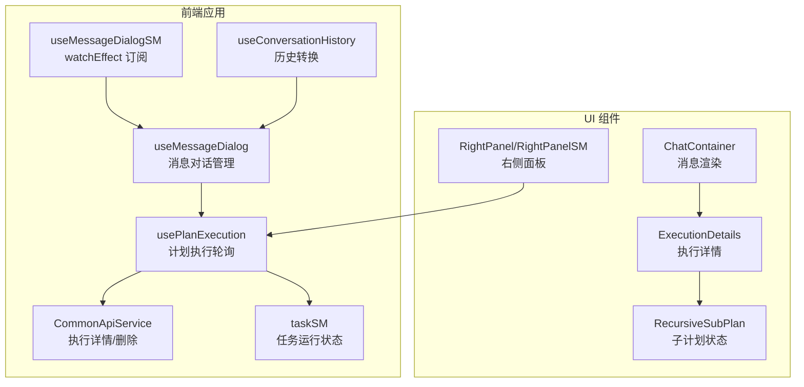
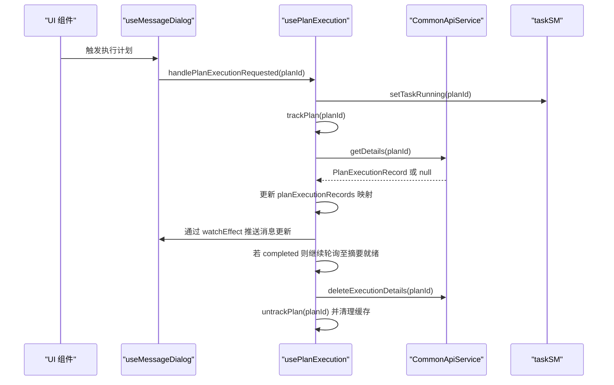
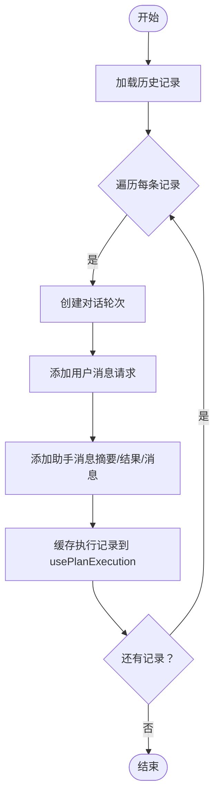
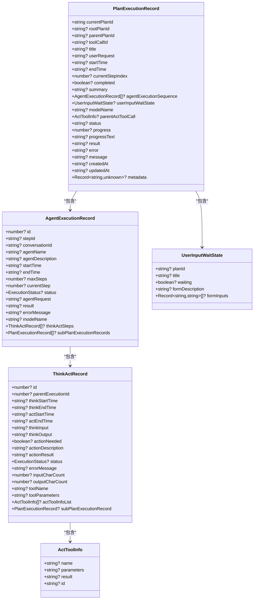
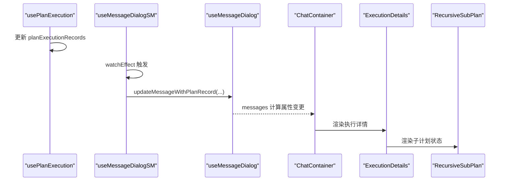
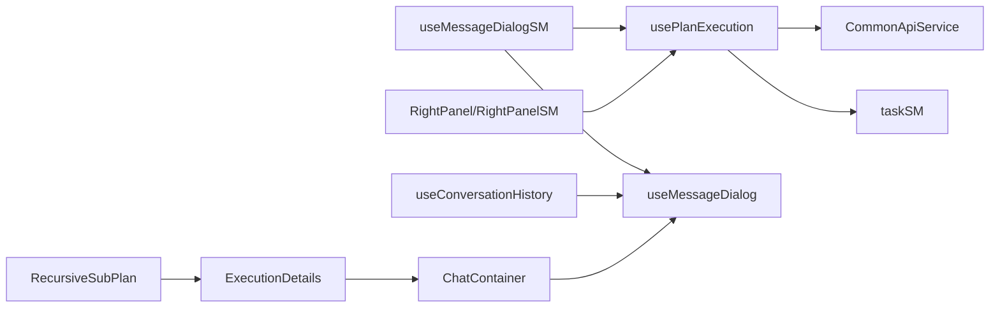

# 执行监控前端实现

<cite>
**本文引用的文件列表**
- [usePlanExecution.ts](file://ui-vue3/src/composables/usePlanExecution.ts)
- [plan-execution-record.ts](file://ui-vue3/src/types/plan-execution-record.ts)
- [useConversationHistory.ts](file://ui-vue3/src/composables/useConversationHistory.ts)
- [common-api-service.ts](file://ui-vue3/src/api/common-api-service.ts)
- [useMessageDialog.ts](file://ui-vue3/src/composables/useMessageDialog.ts)
- [useMessageDialogSM.ts](file://ui-vue3/src/composables/useMessageDialogSM.ts)
- [taskSM.ts](file://ui-vue3/src/stores/taskSM.ts)
- [ExecutionDetails.vue](file://ui-vue3/src/components/chat/ExecutionDetails.vue)
- [RecursiveSubPlan.vue](file://ui-vue3/src/components/chat/RecursiveSubPlan.vue)
- [RightPanel.vue](file://ui-vue3/src/components/right-panel/RightPanel.vue)
- [RightPanelSM.vue](file://ui-vue3/src/components/right-panel/RightPanelSM.vue)
- [ChatContainer.vue](file://ui-vue3/src/components/chat/ChatContainer.vue)
</cite>

## 目录
1. [简介](#简介)
2. [项目结构与职责划分](#项目结构与职责划分)
3. [核心组件与数据模型](#核心组件与数据模型)
4. [架构总览](#架构总览)
5. [详细组件分析](#详细组件分析)
6. [依赖关系分析](#依赖关系分析)
7. [性能与可用性特性](#性能与可用性特性)
8. [故障排查指南](#故障排查指南)
9. [结论](#结论)

## 简介
本文件面向执行监控前端功能，系统化梳理了计划执行状态的实时轮询、状态跟踪、错误处理与完成清理逻辑；详述了执行记录到会话历史的转换流程；说明了前端如何通过类型安全的 plan-execution-record.ts 处理执行数据；并展示 UI 组件如何订阅执行状态变化并更新可视化界面。文末提供状态管理流程图与关键交互场景的代码示例路径，帮助开发者快速定位实现位置与扩展点。

## 项目结构与职责划分
- 组合式函数层
  - usePlanExecution：负责计划执行的轮询、状态缓存、完成清理与全局单例实例导出。
  - useConversationHistory：负责从后端加载历史并转换为会话消息，支持日期解析与缓存。
  - useMessageDialog/useMessageDialogSM：负责消息对话与计划执行状态的联动更新（含 watchEffect 订阅）。
  - taskSM：负责任务运行状态的 Pinia 存储与停止任务能力。
- 类型定义层
  - plan-execution-record.ts：定义后端返回的执行记录结构及前端兼容字段。
- API 层
  - common-api-service.ts：封装 /api/executor/details/{planId} 的获取与删除等调用。
- UI 层
  - ExecutionDetails/RecursiveSubPlan：展示执行详情与子计划状态。
  - RightPanel/RightPanelSM：右侧面板展示执行摘要与子计划信息。
  - ChatContainer：聊天容器，渲染消息与执行细节。

**Section sources**
- file://ui-vue3/src/composables/usePlanExecution.ts#L1-L426
- file://ui-vue3/src/composables/useConversationHistory.ts#L1-L349
- file://ui-vue3/src/composables/useMessageDialog.ts#L1-L1119
- file://ui-vue3/src/composables/useMessageDialogSM.ts#L880-L1045
- file://ui-vue3/src/stores/taskSM.ts#L1-L199
- file://ui-vue3/src/types/plan-execution-record.ts#L1-L288
- file://ui-vue3/src/api/common-api-service.ts#L1-L125

## 核心组件与数据模型
- usePlanExecution
  - 轮询配置：固定轮询间隔、最大重试次数、完成后继续轮询以获取摘要。
  - 状态缓存：使用 Map 存储 PlanExecutionRecord，键为 rootPlanId 或 currentPlanId。
  - 跟踪集合：Set 记录当前被轮询的 planId；Map 记录每个 plan 的轮询尝试与重试计数。
  - 完成清理：检测到 completed 后继续轮询若干次以确保摘要完整，随后删除后端执行详情并延迟清理内存缓存。
- plan-execution-record.ts
  - PlanExecutionRecord：包含执行标识、时间戳、步骤序列、用户输入等待状态、模型名、摘要等字段，并提供前端兼容字段（如 status、progress、result、error、message）。
  - 辅助类型：ExecutionStatus、AgentExecutionRecord、ThinkActRecord、ActToolInfo、UserInputWaitState。
- useConversationHistory
  - 将后端记录转换为会话消息，设置对话与计划关联，解析多种日期格式，缓存执行记录以便后续复用。
- API 服务
  - CommonApiService.getDetails：获取执行详情，404 返回 null，网络异常返回 null 并不中断轮询。
  - CommonApiService.deleteExecutionDetails：删除后端执行详情。
- UI 组件
  - ExecutionDetails/RecursiveSubPlan：展示执行概览、工具参数、子计划状态与步骤选择。
  - RightPanel/RightPanelSM：展示子计划 ID、标题与完成状态图标。
  - ChatContainer：渲染消息与执行细节，响应 watchEffect 更新。

**Section sources**
- file://ui-vue3/src/composables/usePlanExecution.ts#L1-L426
- file://ui-vue3/src/types/plan-execution-record.ts#L1-L288
- file://ui-vue3/src/composables/useConversationHistory.ts#L1-L349
- file://ui-vue3/src/api/common-api-service.ts#L1-L125

## 架构总览
下图展示了“消息对话”、“计划执行”、“API 服务”与“UI 组件”的交互关系，以及轮询与状态更新的主路径。

**Diagram sources**
- file://ui-vue3/src/composables/useMessageDialog.ts#L1-L1119
- file://ui-vue3/src/composables/useMessageDialogSM.ts#L880-L1045
- file://ui-vue3/src/composables/usePlanExecution.ts#L1-L426
- file://ui-vue3/src/api/common-api-service.ts#L1-L125
- file://ui-vue3/src/composables/useConversationHistory.ts#L1-L349
- file://ui-vue3/src/stores/taskSM.ts#L1-L199
- file://ui-vue3/src/components/chat/ChatContainer.vue#L1-L200
- file://ui-vue3/src/components/chat/ExecutionDetails.vue#L1-L266
- file://ui-vue3/src/components/chat/RecursiveSubPlan.vue#L191-L292
- file://ui-vue3/src/components/right-panel/RightPanel.vue#L271-L294
- file://ui-vue3/src/components/right-panel/RightPanelSM.vue#L271-L294

## 详细组件分析

### usePlanExecution：实时轮询与状态跟踪
- 轮询策略
  - 固定轮询间隔：每秒一次，保证响应性。
  - 最大重试次数：当 API 返回 404 或网络异常时，最多重试若干次。
  - 完成后继续轮询：在检测到 completed 后继续轮询若干次，确保能拿到最终摘要或结果。
- 重试机制
  - 计划不存在（404）：按最大重试次数递增重试，超过阈值则取消跟踪。
  - 网络错误：指数退避重试（基于重试次数），避免频繁请求。
- 完成清理逻辑
  - 删除后端执行详情：成功获取摘要后调用删除接口。
  - 取消跟踪：移除已完成计划的跟踪集合。
  - 清理内存缓存：延迟一段时间后从 Map 中删除对应记录。
- 关键方法
  - trackPlan/untrackPlan：添加/移除计划跟踪。
  - pollPlanStatus/pollAllTrackedPlans：逐个或批量轮询。
  - handlePlanExecutionRequested：入口方法，标记任务运行并开始跟踪。
  - setCachedPlanRecord/getPlanExecutionRecord：缓存与读取执行记录。
  - startPolling/stopPolling/cleanup：启动/停止轮询与资源清理。
- 单例导出
  - usePlanExecutionSingleton：全局唯一实例，供其他模块直接使用。

**Diagram sources**
- file://ui-vue3/src/composables/useMessageDialog.ts#L1-L1119
- file://ui-vue3/src/composables/usePlanExecution.ts#L1-L426
- file://ui-vue3/src/api/common-api-service.ts#L1-L125
- file://ui-vue3/src/stores/taskSM.ts#L1-L199

**Section sources**
- file://ui-vue3/src/composables/usePlanExecution.ts#L1-L426
- file://ui-vue3/src/api/common-api-service.ts#L1-L125
- file://ui-vue3/src/stores/taskSM.ts#L1-L199

### useConversationHistory：执行记录到会话历史的转换
- 转换流程
  - convertApiRecordToPlanExecutionRecord：将后端记录映射为前端可显示的 PlanExecutionRecord 片段（包含 currentPlanId、status、summary、completed、agentExecutionSequence 等）。
  - parseBackendDate：兼容多种日期格式（字符串、数组、数字），统一解析为 Date 对象。
  - processHistoryRecord：
    - 创建对话轮次（每个历史记录对应一个新对话）。
    - 添加用户消息（原始请求）与助手消息（摘要/结果/消息）。
    - 设置对话与计划的关联（conversationId、planId）。
    - 将记录缓存到 usePlanExecution 的缓存中，便于后续复用。
  - loadConversationHistory/restoreConversationHistory：加载或静默恢复历史。
- 日期解析策略
  - 支持 ISO 字符串、数组格式（年月日时分秒纳秒）、毫秒/秒时间戳。
  - 自动补全时区信息，失败时回退到当前时间。

**Diagram sources**
- file://ui-vue3/src/composables/useConversationHistory.ts#L1-L349
- file://ui-vue3/src/composables/usePlanExecution.ts#L1-L426

**Section sources**
- file://ui-vue3/src/composables/useConversationHistory.ts#L1-L349

### 类型安全的数据模型：plan-execution-record.ts
- PlanExecutionRecord
  - 唯一标识：currentPlanId（前端作为 planId 使用）、rootPlanId、parentPlanId、toolCallId。
  - 时间线：startTime、endTime、currentStepIndex、completed。
  - 执行序列：agentExecutionSequence（AgentExecutionRecord 数组）。
  - 用户输入等待：userInputWaitState。
  - 模型与元数据：modelName、metadata。
  - 前端兼容字段：status、progress、progressText、result、error、message、createdAt、updatedAt。
- 辅助类型
  - ExecutionStatus：IDLE、RUNNING、FINISHED。
  - AgentExecutionRecord/ThinkActRecord/ActToolInfo/UserInputWaitState：用于构建执行过程的树形结构。

**Diagram sources**
- file://ui-vue3/src/types/plan-execution-record.ts#L1-L288

**Section sources**
- file://ui-vue3/src/types/plan-execution-record.ts#L1-L288

### UI 组件订阅执行状态变化
- useMessageDialogSM.watchEffect
  - 订阅 usePlanExecution.planExecutionRecords 的 Map 变更，强制访问 Map.size 以触发依赖追踪。
  - 遍历所有对话，若存在 planId，则根据最新 PlanExecutionRecord 更新消息中的 planExecution 字段。
  - 在所有计划完成后重置 isLoading，避免并发执行。
- ChatContainer
  - 渲染消息列表，当消息包含 planExecution 时，嵌入 ExecutionDetails。
  - 通过 props 将 planId、userInputWaitState 等传递给 ResponseSection。
- ExecutionDetails/RecursiveSubPlan
  - 展示父工具调用、子计划状态与步骤选择事件。
- RightPanel/RightPanelSM
  - 展示子计划 ID、标题与完成状态图标，便于快速定位执行节点。

**Diagram sources**
- file://ui-vue3/src/composables/useMessageDialogSM.ts#L880-L1045
- file://ui-vue3/src/composables/useMessageDialog.ts#L1-L1119
- file://ui-vue3/src/components/chat/ChatContainer.vue#L1-L200
- file://ui-vue3/src/components/chat/ExecutionDetails.vue#L1-L266
- file://ui-vue3/src/components/chat/RecursiveSubPlan.vue#L191-L292

**Section sources**
- file://ui-vue3/src/composables/useMessageDialogSM.ts#L880-L1045
- file://ui-vue3/src/composables/useMessageDialog.ts#L1-L1119
- file://ui-vue3/src/components/chat/ChatContainer.vue#L1-L200

## 依赖关系分析
- usePlanExecution 依赖
  - CommonApiService：获取/删除执行详情。
  - taskSM：标记任务运行状态并在完成时清除。
- useMessageDialogSM 依赖
  - usePlanExecution：订阅执行记录 Map。
  - useMessageDialog：更新消息内容与 planExecution 字段。
- useConversationHistory 依赖
  - MemoryApiService（间接通过 useMessageDialog）：加载历史。
  - usePlanExecution：缓存执行记录。
- UI 组件依赖
  - ChatContainer 依赖 useMessageDialog 的 messages 计算属性。
  - ExecutionDetails/RecursiveSubPlan 依赖 PlanExecutionRecord 结构。
  - RightPanel/RightPanelSM 依赖 PlanExecutionRecord 的子计划字段。

**Diagram sources**
- file://ui-vue3/src/composables/usePlanExecution.ts#L1-L426
- file://ui-vue3/src/api/common-api-service.ts#L1-L125
- file://ui-vue3/src/stores/taskSM.ts#L1-L199
- file://ui-vue3/src/composables/useMessageDialogSM.ts#L880-L1045
- file://ui-vue3/src/composables/useMessageDialog.ts#L1-L1119
- file://ui-vue3/src/composables/useConversationHistory.ts#L1-L349
- file://ui-vue3/src/components/chat/ChatContainer.vue#L1-L200
- file://ui-vue3/src/components/chat/ExecutionDetails.vue#L1-L266
- file://ui-vue3/src/components/chat/RecursiveSubPlan.vue#L191-L292
- file://ui-vue3/src/components/right-panel/RightPanel.vue#L271-L294
- file://ui-vue3/src/components/right-panel/RightPanelSM.vue#L271-L294

**Section sources**
- file://ui-vue3/src/composables/usePlanExecution.ts#L1-L426
- file://ui-vue3/src/composables/useMessageDialogSM.ts#L880-L1045
- file://ui-vue3/src/composables/useMessageDialog.ts#L1-L1119
- file://ui-vue3/src/composables/useConversationHistory.ts#L1-L349

## 性能与可用性特性
- 轮询优化
  - 并行轮询多个计划，减少整体等待时间。
  - 完成后短周期轮询以确保摘要就绪，避免长时间占用资源。
- 错误与重试
  - 404 与网络异常采用指数退避重试，避免雪崩效应。
  - 超过最大重试次数自动取消跟踪，释放资源。
- 内存管理
  - 完成后延迟清理 Map 中的记录，防止 UI 仍需渲染但数据已不可用。
- 类型安全
  - 通过 plan-execution-record.ts 提供强类型约束，降低运行期错误风险。
- 兼容性
  - useConversationHistory 的日期解析支持多种格式，提升历史加载稳定性。

[本节为通用指导，无需列出具体文件来源]

## 故障排查指南
- 计划未出现或状态不更新
  - 检查是否正确调用 handlePlanExecutionRequested 并开始跟踪。
  - 查看轮询是否启动与停止条件（无跟踪且无待汇总计划时停止）。
  - 确认 API 返回是否为 null（404 或网络异常）导致重试。
- 完成后仍无摘要
  - 确认完成后的继续轮询次数是否足够（默认若干次）。
  - 检查后端删除接口是否成功，避免残留数据影响后续轮询。
- 历史加载失败
  - 查看 parseBackendDate 是否能正确解析日期格式。
  - 确认 loadConversationHistory 的 conversationId 是否有效。
- UI 不刷新
  - 确认 useMessageDialogSM 的 watchEffect 是否被触发（Map.size 访问确保依赖追踪）。
  - 检查消息中是否包含 planExecution 字段，否则不会触发更新。

**Section sources**
- file://ui-vue3/src/composables/usePlanExecution.ts#L1-L426
- file://ui-vue3/src/composables/useMessageDialogSM.ts#L880-L1045
- file://ui-vue3/src/composables/useConversationHistory.ts#L1-L349

## 结论
本实现通过 usePlanExecution 提供了稳定可靠的计划执行轮询与状态跟踪，结合 useMessageDialogSM 的 watchEffect 订阅机制，实现了 UI 对执行状态的实时响应。类型安全的 plan-execution-record.ts 保障了前后端数据结构的一致性，而 useConversationHistory 则将历史记录无缝转换为会话消息，提升了用户体验。完成清理逻辑与重试策略共同确保了系统的健壮性与性能。