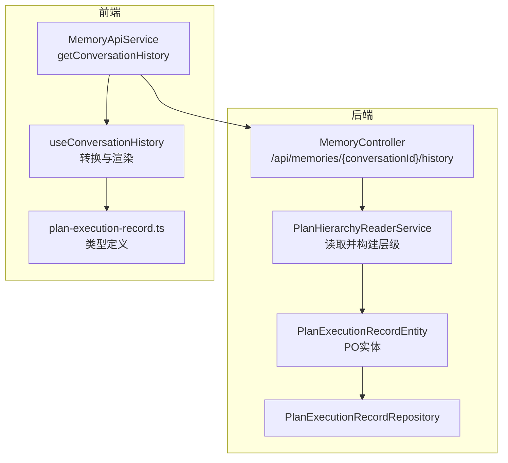
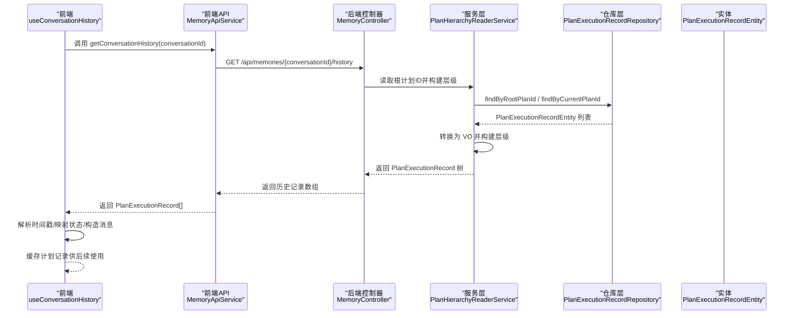
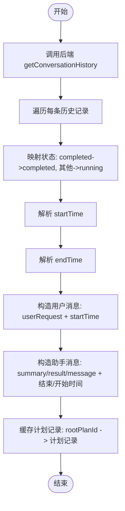
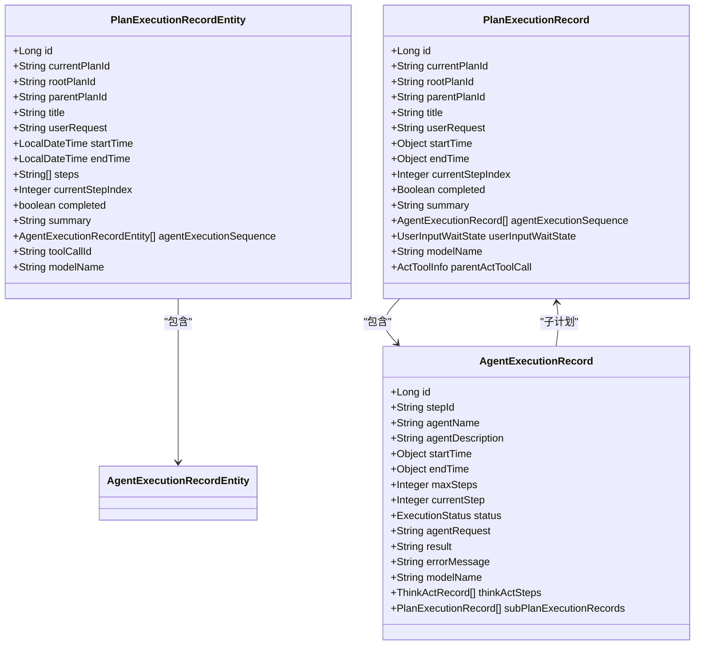
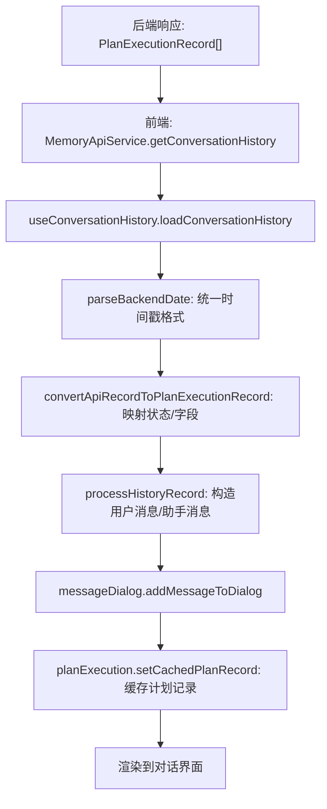
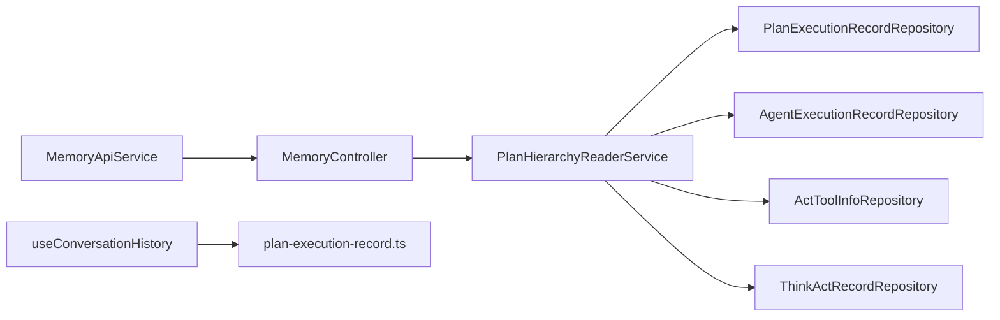

# 执行监控数据转换

<cite>
**本文引用的文件列表**
- [useConversationHistory.ts](file://ui-vue3/src/composables/useConversationHistory.ts)
- [plan-execution-record.ts](file://ui-vue3/src/types/plan-execution-record.ts)
- [MemoryController.java](file://src/main/java/com/alibaba/cloud/ai/lynxe/workspace/conversation/controller/MemoryController.java)
- [PlanHierarchyReaderService.java](file://src/main/java/com/alibaba/cloud/ai/lynxe/recorder/service/PlanHierarchyReaderService.java)
- [PlanExecutionRecordEntity.java](file://src/main/java/com/alibaba/cloud/ai/lynxe/recorder/entity/po/PlanExecutionRecordEntity.java)
- [PlanExecutionRecorder.java](file://src/main/java/com/alibaba/cloud/ai/lynxe/recorder/service/PlanExecutionRecorder.java)
- [NewRepoPlanExecutionRecorder.java](file://src/main/java/com/alibaba/cloud/ai/lynxe/recorder/service/NewRepoPlanExecutionRecorder.java)
- [ExecutionStep.java](file://src/main/java/com/alibaba/cloud/ai/lynxe/runtime/entity/vo/ExecutionStep.java)
- [PlanExecutionRecordRepository.java](file://src/main/java/com/alibaba/cloud/ai/lynxe/recorder/repository/PlanExecutionRecordRepository.java)
- [memory-api-service.ts](file://ui-vue3/src/api/memory-api-service.ts)
</cite>

## 目录
1. [简介](#简介)
2. [项目结构](#项目结构)
3. [核心组件](#核心组件)
4. [架构总览](#架构总览)
5. [详细组件分析](#详细组件分析)
6. [依赖关系分析](#依赖关系分析)
7. [性能考量](#性能考量)
8. [故障排查指南](#故障排查指南)
9. [结论](#结论)
10. [附录](#附录)

## 简介
本文件聚焦于“执行监控数据转换”的实现与使用，围绕前端组合式函数 useConversationHistory 如何将后端返回的计划执行记录（PlanExecutionRecord）转换为前端对话历史格式展开，重点说明：
- 执行步骤的扁平化处理：通过 agentExecutionSequence 的顺序组织，形成可直接用于展示的步骤序列。
- 时间戳格式化：统一解析后端返回的多种时间格式（字符串、数组、毫秒/秒时间戳），输出标准 Date 对象。
- 状态映射逻辑：将后端状态映射为前端友好的状态枚举，并在必要时进行兼容性处理。
- 类型系统保障：前端类型 plan-execution-record.ts 中的接口与枚举确保数据结构的类型安全，涵盖嵌套的代理执行细节（如 ThinkActRecord、ActToolInfo、子计划等）。

同时，文档提供从后端 API 响应到前端展示数据的完整转换流程图与示例，帮助开发者快速理解并定位问题。

## 项目结构
该功能横跨后端 Java 与前端 Vue3 两部分：
- 后端负责生成与存储执行记录，提供按会话查询历史的接口，并通过服务层构建层级关系与简化数据结构。
- 前端负责加载历史、解析时间戳、映射状态、构造消息并缓存计划记录，最终渲染到对话界面。

图表来源
- [MemoryController.java](file://src/main/java/com/alibaba/cloud/ai/lynxe/workspace/conversation/controller/MemoryController.java#L142-L199)
- [PlanHierarchyReaderService.java](file://src/main/java/com/alibaba/cloud/ai/lynxe/recorder/service/PlanHierarchyReaderService.java#L83-L146)
- [PlanExecutionRecordEntity.java](file://src/main/java/com/alibaba/cloud/ai/lynxe/recorder/entity/po/PlanExecutionRecordEntity.java#L42-L110)
- [PlanExecutionRecordRepository.java](file://src/main/java/com/alibaba/cloud/ai/lynxe/recorder/repository/PlanExecutionRecordRepository.java#L26-L55)
- [memory-api-service.ts](file://ui-vue3/src/api/memory-api-service.ts#L157-L173)
- [useConversationHistory.ts](file://ui-vue3/src/composables/useConversationHistory.ts#L257-L339)
- [plan-execution-record.ts](file://ui-vue3/src/types/plan-execution-record.ts#L192-L288)

章节来源
- [MemoryController.java](file://src/main/java/com/alibaba/cloud/ai/lynxe/workspace/conversation/controller/MemoryController.java#L142-L199)
- [PlanHierarchyReaderService.java](file://src/main/java/com/alibaba/cloud/ai/lynxe/recorder/service/PlanHierarchyReaderService.java#L83-L146)
- [PlanExecutionRecordEntity.java](file://src/main/java/com/alibaba/cloud/ai/lynxe/recorder/entity/po/PlanExecutionRecordEntity.java#L42-L110)
- [PlanExecutionRecordRepository.java](file://src/main/java/com/alibaba/cloud/ai/lynxe/recorder/repository/PlanExecutionRecordRepository.java#L26-L55)
- [memory-api-service.ts](file://ui-vue3/src/api/memory-api-service.ts#L157-L173)
- [useConversationHistory.ts](file://ui-vue3/src/composables/useConversationHistory.ts#L257-L339)
- [plan-execution-record.ts](file://ui-vue3/src/types/plan-execution-record.ts#L192-L288)

## 核心组件
- useConversationHistory：负责加载后端历史、解析时间戳、映射状态、构造消息并缓存计划记录。
- MemoryController：提供按会话获取历史的 REST 接口，内部委托 PlanHierarchyReaderService 构建层级。
- PlanHierarchyReaderService：将 PO 实体转换为 VO 并构建层级关系，简化 agentExecutionSequence。
- plan-execution-record.ts：定义前端类型与枚举，确保数据结构类型安全。
- PlanExecutionRecordEntity：后端持久化模型，包含计划基本信息、步骤、执行序列等。
- MemoryApiService：前端调用后端历史接口的封装。

章节来源
- [useConversationHistory.ts](file://ui-vue3/src/composables/useConversationHistory.ts#L1-L349)
- [MemoryController.java](file://src/main/java/com/alibaba/cloud/ai/lynxe/workspace/conversation/controller/MemoryController.java#L142-L199)
- [PlanHierarchyReaderService.java](file://src/main/java/com/alibaba/cloud/ai/lynxe/recorder/service/PlanHierarchyReaderService.java#L148-L241)
- [plan-execution-record.ts](file://ui-vue3/src/types/plan-execution-record.ts#L192-L288)
- [PlanExecutionRecordEntity.java](file://src/main/java/com/alibaba/cloud/ai/lynxe/recorder/entity/po/PlanExecutionRecordEntity.java#L110-L283)
- [memory-api-service.ts](file://ui-vue3/src/api/memory-api-service.ts#L157-L173)

## 架构总览
下图展示了从后端到前端的历史加载与转换路径，以及关键的数据结构映射关系。

图表来源
- [memory-api-service.ts](file://ui-vue3/src/api/memory-api-service.ts#L157-L173)
- [MemoryController.java](file://src/main/java/com/alibaba/cloud/ai/lynxe/workspace/conversation/controller/MemoryController.java#L142-L199)
- [PlanHierarchyReaderService.java](file://src/main/java/com/alibaba/cloud/ai/lynxe/recorder/service/PlanHierarchyReaderService.java#L83-L146)
- [PlanExecutionRecordRepository.java](file://src/main/java/com/alibaba/cloud/ai/lynxe/recorder/repository/PlanExecutionRecordRepository.java#L26-L55)
- [PlanExecutionRecordEntity.java](file://src/main/java/com/alibaba/cloud/ai/lynxe/recorder/entity/po/PlanExecutionRecordEntity.java#L110-L283)
- [useConversationHistory.ts](file://ui-vue3/src/composables/useConversationHistory.ts#L257-L339)

## 详细组件分析

### useConversationHistory 组合式函数
该函数承担了“从后端 API 响应到前端展示数据”的全部转换职责，具体包括：
- 将后端 PlanExecutionRecord 映射为前端 PlanExecutionRecord（含状态、进度、错误等字段）。
- 统一解析时间戳：支持字符串、数组、毫秒/秒时间戳等多种格式，保证前端 Date 对象有效。
- 构造用户消息与助手消息：根据 userRequest、startTime、endTime、summary 等字段生成消息内容与时间戳。
- 缓存计划记录：将 rootPlanId 对应的计划记录缓存至计划执行管理器，便于后续交互。

图表来源
- [useConversationHistory.ts](file://ui-vue3/src/composables/useConversationHistory.ts#L38-L61)
- [useConversationHistory.ts](file://ui-vue3/src/composables/useConversationHistory.ts#L63-L159)
- [useConversationHistory.ts](file://ui-vue3/src/composables/useConversationHistory.ts#L165-L255)
- [useConversationHistory.ts](file://ui-vue3/src/composables/useConversationHistory.ts#L257-L339)

章节来源
- [useConversationHistory.ts](file://ui-vue3/src/composables/useConversationHistory.ts#L38-L61)
- [useConversationHistory.ts](file://ui-vue3/src/composables/useConversationHistory.ts#L63-L159)
- [useConversationHistory.ts](file://ui-vue3/src/composables/useConversationHistory.ts#L165-L255)
- [useConversationHistory.ts](file://ui-vue3/src/composables/useConversationHistory.ts#L257-L339)

### 类型系统与嵌套代理执行细节
前端类型 plan-execution-record.ts 定义了完整的数据模型，确保类型安全：
- ExecutionStatus：前端状态枚举，与后端 ExecutionStatus 对应。
- ThinkActRecord：记录单步代理的“思考-行动”过程，包含输入/输出、字符计数、工具调用信息、子计划等。
- AgentExecutionRecord：代理执行记录，包含开始/结束时间、状态、请求、结果、错误、模型名、ThinkAct 步骤、子计划等。
- PlanExecutionRecord：顶层计划执行记录，包含当前/根/父计划 ID、标题、用户请求、开始/结束时间、步骤索引、完成状态、摘要、代理执行序列、用户输入等待状态、模型名、父工具调用信息等。

这些类型共同支撑了“扁平化步骤 + 嵌套子计划”的可视化与交互。

章节来源
- [plan-execution-record.ts](file://ui-vue3/src/types/plan-execution-record.ts#L27-L31)
- [plan-execution-record.ts](file://ui-vue3/src/types/plan-execution-record.ts#L54-L111)
- [plan-execution-record.ts](file://ui-vue3/src/types/plan-execution-record.ts#L120-L168)
- [plan-execution-record.ts](file://ui-vue3/src/types/plan-execution-record.ts#L192-L288)

### 后端数据模型与层级构建
后端通过 PlanExecutionRecordEntity 保存计划执行的基本信息与代理执行序列；PlanHierarchyReaderService 在读取时：
- 将 PO 实体转换为 VO（PlanExecutionRecord、AgentExecutionRecord、ActToolInfo）。
- 构建层级关系：依据 parentPlanId/currentPlanId/toolCallId 关系，将子计划挂载到对应代理执行记录的 subPlanExecutionRecords 字段。
- 简化 agentExecutionSequence：仅保留必要的代理执行记录，便于前端直接消费。

图表来源
- [PlanExecutionRecordEntity.java](file://src/main/java/com/alibaba/cloud/ai/lynxe/recorder/entity/po/PlanExecutionRecordEntity.java#L110-L283)
- [PlanHierarchyReaderService.java](file://src/main/java/com/alibaba/cloud/ai/lynxe/recorder/service/PlanHierarchyReaderService.java#L189-L241)
- [PlanHierarchyReaderService.java](file://src/main/java/com/alibaba/cloud/ai/lynxe/recorder/service/PlanHierarchyReaderService.java#L247-L299)
- [PlanHierarchyReaderService.java](file://src/main/java/com/alibaba/cloud/ai/lynxe/recorder/service/PlanHierarchyReaderService.java#L333-L364)

章节来源
- [PlanExecutionRecordEntity.java](file://src/main/java/com/alibaba/cloud/ai/lynxe/recorder/entity/po/PlanExecutionRecordEntity.java#L110-L283)
- [PlanHierarchyReaderService.java](file://src/main/java/com/alibaba/cloud/ai/lynxe/recorder/service/PlanHierarchyReaderService.java#L189-L241)
- [PlanHierarchyReaderService.java](file://src/main/java/com/alibaba/cloud/ai/lynxe/recorder/service/PlanHierarchyReaderService.java#L247-L299)
- [PlanHierarchyReaderService.java](file://src/main/java/com/alibaba/cloud/ai/lynxe/recorder/service/PlanHierarchyReaderService.java#L333-L364)

### 执行步骤的扁平化处理
- 后端已将 agentExecutionSequence 按执行顺序整理，前端无需再次排序。
- 前端通过遍历 agentExecutionSequence，结合每个代理执行记录的 thinkActSteps 与子计划，形成“步骤级”的可读序列。
- 若存在子计划，前端可将其作为下一步骤或子步骤显示，保持层级清晰。

章节来源
- [PlanHierarchyReaderService.java](file://src/main/java/com/alibaba/cloud/ai/lynxe/recorder/service/PlanHierarchyReaderService.java#L333-L364)
- [plan-execution-record.ts](file://ui-vue3/src/types/plan-execution-record.ts#L120-L168)

### 时间戳格式化
- 支持格式：
  - ISO-8601 字符串（含毫秒）。
  - 数组格式：[年, 月, 日, 时, 分, 秒, 纳秒]（JavaScript 月份需减 1）。
  - 数字格式：毫秒或秒时间戳（自动判断位数）。
- 解析失败时回退为当前时间并记录警告，避免阻断整体流程。

章节来源
- [useConversationHistory.ts](file://ui-vue3/src/composables/useConversationHistory.ts#L63-L159)

### 状态映射逻辑
- completed 字段映射为前端状态：true -> completed，false -> running。
- ThinkActRecord 的 actionNeeded 与 actToolInfoList 可用于判断是否需要进一步展示“行动”详情。
- 子计划的挂载由后端服务完成，前端直接消费即可。

章节来源
- [useConversationHistory.ts](file://ui-vue3/src/composables/useConversationHistory.ts#L38-L61)
- [PlanHierarchyReaderService.java](file://src/main/java/com/alibaba/cloud/ai/lynxe/recorder/service/PlanHierarchyReaderService.java#L333-L364)
- [plan-execution-record.ts](file://ui-vue3/src/types/plan-execution-record.ts#L54-L111)

### 数据转换流程图与示例
以下流程图展示了从后端 API 响应到前端展示数据的完整映射过程，并给出一个典型示例。

图表来源
- [memory-api-service.ts](file://ui-vue3/src/api/memory-api-service.ts#L157-L173)
- [useConversationHistory.ts](file://ui-vue3/src/composables/useConversationHistory.ts#L257-L339)
- [useConversationHistory.ts](file://ui-vue3/src/composables/useConversationHistory.ts#L38-L61)
- [useConversationHistory.ts](file://ui-vue3/src/composables/useConversationHistory.ts#L63-L159)
- [useConversationHistory.ts](file://ui-vue3/src/composables/useConversationHistory.ts#L165-L255)

示例（概念性说明，不展示具体代码）：
- 输入：后端返回一条 PlanExecutionRecord，包含 currentPlanId、userRequest、startTime、endTime、summary、agentExecutionSequence。
- 处理：
  - 使用 parseBackendDate 统一 startTime 和 endTime。
  - 使用 convertApiRecordToPlanExecutionRecord 将 completed 映射为前端状态。
  - 使用 processHistoryRecord 构造两条消息：用户消息（userRequest + startTime）、助手消息（summary + 结束/开始时间）。
  - 将该计划记录缓存到计划执行管理器，以便后续交互。
- 输出：对话界面显示该轮历史的用户与助手消息，并可点击查看计划详情。

章节来源
- [useConversationHistory.ts](file://ui-vue3/src/composables/useConversationHistory.ts#L257-L339)
- [useConversationHistory.ts](file://ui-vue3/src/composables/useConversationHistory.ts#L38-L61)
- [useConversationHistory.ts](file://ui-vue3/src/composables/useConversationHistory.ts#L63-L159)
- [useConversationHistory.ts](file://ui-vue3/src/composables/useConversationHistory.ts#L165-L255)

## 依赖关系分析
- 前端依赖：
  - MemoryApiService 依赖后端 /api/memories/{conversationId}/history。
  - useConversationHistory 依赖 plan-execution-record.ts 类型定义。
- 后端依赖：
  - MemoryController 依赖 MemoryService 与 PlanHierarchyReaderService。
  - PlanHierarchyReaderService 依赖 PlanExecutionRecordRepository、AgentExecutionRecordRepository、ActToolInfoRepository、ThinkActRecordRepository。
  - PlanExecutionRecorder/ NewRepoPlanExecutionRecorder 提供执行记录的写入与查询能力，支撑历史数据的生成与更新。

图表来源
- [memory-api-service.ts](file://ui-vue3/src/api/memory-api-service.ts#L157-L173)
- [MemoryController.java](file://src/main/java/com/alibaba/cloud/ai/lynxe/workspace/conversation/controller/MemoryController.java#L142-L199)
- [PlanHierarchyReaderService.java](file://src/main/java/com/alibaba/cloud/ai/lynxe/recorder/service/PlanHierarchyReaderService.java#L83-L146)
- [PlanExecutionRecordRepository.java](file://src/main/java/com/alibaba/cloud/ai/lynxe/recorder/repository/PlanExecutionRecordRepository.java#L26-L55)
- [useConversationHistory.ts](file://ui-vue3/src/composables/useConversationHistory.ts#L257-L339)
- [plan-execution-record.ts](file://ui-vue3/src/types/plan-execution-record.ts#L192-L288)

章节来源
- [memory-api-service.ts](file://ui-vue3/src/api/memory-api-service.ts#L157-L173)
- [MemoryController.java](file://src/main/java/com/alibaba/cloud/ai/lynxe/workspace/conversation/controller/MemoryController.java#L142-L199)
- [PlanHierarchyReaderService.java](file://src/main/java/com/alibaba/cloud/ai/lynxe/recorder/service/PlanHierarchyReaderService.java#L83-L146)
- [PlanExecutionRecordRepository.java](file://src/main/java/com/alibaba/cloud/ai/lynxe/recorder/repository/PlanExecutionRecordRepository.java#L26-L55)
- [useConversationHistory.ts](file://ui-vue3/src/composables/useConversationHistory.ts#L257-L339)
- [plan-execution-record.ts](file://ui-vue3/src/types/plan-execution-record.ts#L192-L288)

## 性能考量
- 前端解析时间戳采用多格式兼容策略，解析失败回退为当前时间，避免阻断渲染。
- 后端层级构建在一次性读取同一根计划的所有子计划后进行，减少多次数据库往返。
- 前端仅对必要字段进行映射与缓存，避免重复计算与渲染。

[本节为通用建议，不直接分析具体文件]

## 故障排查指南
- 前端时间戳解析失败：
  - 检查后端返回的时间格式是否符合预期（字符串、数组、毫秒/秒）。
  - 查看控制台警告日志，确认 parseBackendDate 的回退行为。
- 历史为空：
  - 确认 conversationId 是否正确传递。
  - 检查后端 MemoryController 的 /{conversationId}/history 是否返回空列表。
- 状态显示异常：
  - 确认 completed 字段是否正确传入。
  - 检查 convertApiRecordToPlanExecutionRecord 的映射逻辑。
- 子计划未显示：
  - 确认后端 PlanHierarchyReaderService 已正确构建层级关系。
  - 检查 agentExecutionSequence 与 toolCallId 的关联是否正确。

章节来源
- [useConversationHistory.ts](file://ui-vue3/src/composables/useConversationHistory.ts#L63-L159)
- [useConversationHistory.ts](file://ui-vue3/src/composables/useConversationHistory.ts#L257-L339)
- [MemoryController.java](file://src/main/java/com/alibaba/cloud/ai/lynxe/workspace/conversation/controller/MemoryController.java#L142-L199)
- [PlanHierarchyReaderService.java](file://src/main/java/com/alibaba/cloud/ai/lynxe/recorder/service/PlanHierarchyReaderService.java#L333-L364)

## 结论
useConversationHistory 将后端复杂的历史数据结构转换为前端友好的对话历史，实现了：
- 扁平化的步骤展示与嵌套子计划的层级呈现。
- 多格式时间戳的统一解析与容错处理。
- 状态映射与消息构造，提升用户体验。
- 类型系统的强约束，降低前后端数据不一致风险。

通过后端 PlanHierarchyReaderService 的层级构建与前端 useConversationHistory 的转换渲染，形成了从“原始执行记录”到“可读会话历史”的完整闭环。

[本节为总结性内容，不直接分析具体文件]

## 附录
- 关键实现位置参考：
  - 前端转换与渲染：[useConversationHistory.ts](file://ui-vue3/src/composables/useConversationHistory.ts#L38-L61)、[useConversationHistory.ts](file://ui-vue3/src/composables/useConversationHistory.ts#L63-L159)、[useConversationHistory.ts](file://ui-vue3/src/composables/useConversationHistory.ts#L165-L255)、[useConversationHistory.ts](file://ui-vue3/src/composables/useConversationHistory.ts#L257-L339)
  - 类型定义：[plan-execution-record.ts](file://ui-vue3/src/types/plan-execution-record.ts#L27-L31)、[plan-execution-record.ts](file://ui-vue3/src/types/plan-execution-record.ts#L54-L111)、[plan-execution-record.ts](file://ui-vue3/src/types/plan-execution-record.ts#L120-L168)、[plan-execution-record.ts](file://ui-vue3/src/types/plan-execution-record.ts#L192-L288)
  - 后端接口与服务：[MemoryController.java](file://src/main/java/com/alibaba/cloud/ai/lynxe/workspace/conversation/controller/MemoryController.java#L142-L199)、[PlanHierarchyReaderService.java](file://src/main/java/com/alibaba/cloud/ai/lynxe/recorder/service/PlanHierarchyReaderService.java#L83-L146)、[PlanExecutionRecordRepository.java](file://src/main/java/com/alibaba/cloud/ai/lynxe/recorder/repository/PlanExecutionRecordRepository.java#L26-L55)
  - 执行记录写入与查询（支撑历史生成）：[PlanExecutionRecorder.java](file://src/main/java/com/alibaba/cloud/ai/lynxe/recorder/service/PlanExecutionRecorder.java#L26-L110)、[NewRepoPlanExecutionRecorder.java](file://src/main/java/com/alibaba/cloud/ai/lynxe/recorder/service/NewRepoPlanExecutionRecorder.java#L75-L156)、[ExecutionStep.java](file://src/main/java/com/alibaba/cloud/ai/lynxe/runtime/entity/vo/ExecutionStep.java#L28-L179)