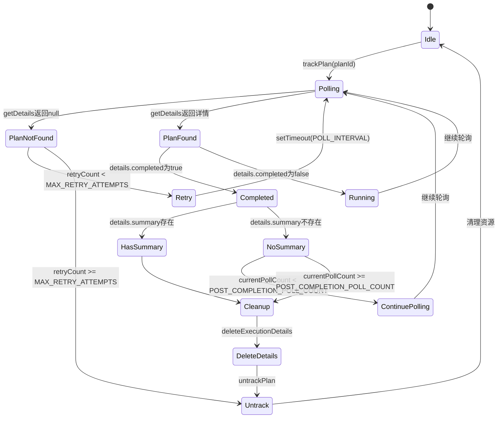

# 执行监控状态管理

<cite>
**本文档引用的文件**  
- [usePlanExecution.ts](file://ui-vue3/src/composables/usePlanExecution.ts)
- [task.ts](file://ui-vue3/src/stores/task.ts)
- [taskSM.ts](file://ui-vue3/src/stores/taskSM.ts)
- [common-api-service.ts](file://ui-vue3/src/api/common-api-service.ts)
- [plan-execution-record.ts](file://ui-vue3/src/types/plan-execution-record.ts)
- [useMessageDialog.ts](file://ui-vue3/src/composables/useMessageDialog.ts)
</cite>

## 目录
1. [简介](#简介)
2. [核心组件分析](#核心组件分析)
3. [轮询机制与状态监控](#轮询机制与状态监控)
4. [状态集成与跨组件同步](#状态集成与跨组件同步)
5. [执行完成后的状态清理逻辑](#执行完成后的状态清理逻辑)
6. [错误处理机制](#错误处理机制)
7. [性能优化建议](#性能优化建议)
8. [轮询流程状态机图示](#轮询流程状态机图示)
9. [总结](#总结)

## 简介
本文档详细阐述了`usePlanExecution`组合式函数在执行监控状态管理中的核心作用。该函数通过轮询机制实时获取计划执行状态，支持动态调整轮询间隔、失败重试机制以及执行完成后的状态清理。同时，它与`task.ts`和`taskSM.ts`中的状态存储集成，实现了跨组件的状态同步。本文将深入解析其工作原理，并提供轮询流程的状态机图示，展示从开始监控到最终完成的完整生命周期。

## 核心组件分析

`usePlanExecution`组合式函数是执行监控的核心，负责管理计划执行的整个生命周期。它通过轮询机制实时获取计划执行状态，并将状态更新同步到前端组件。该函数使用Vue的响应式系统来管理状态，确保组件能够实时响应状态变化。

**组件来源**
- [usePlanExecution.ts](file://ui-vue3/src/composables/usePlanExecution.ts)

## 轮询机制与状态监控

`usePlanExecution`函数通过轮询机制实时获取计划执行状态。轮询机制的核心是`pollPlanStatus`方法，该方法通过调用`CommonApiService.getDetails`接口获取计划执行的详细信息。轮询间隔为1秒，确保了状态更新的实时性。

### 轮询间隔的动态调整策略
轮询间隔的动态调整策略通过`pollAllTrackedPlans`方法实现。该方法在每次轮询时检查是否有正在进行的轮询任务，如果有，则跳过本次轮询，避免重复轮询。此外，轮询间隔在失败时会进行指数退避，以减少对服务器的压力。

### 失败重试机制
失败重试机制通过`pollPlanStatus`方法中的`try-catch`块实现。当轮询失败时，函数会记录失败次数，并在达到最大重试次数（10次）后放弃轮询。对于网络错误，函数会使用指数退避策略进行重试，以提高重试的成功率。

**组件来源**
- [usePlanExecution.ts](file://ui-vue3/src/composables/usePlanExecution.ts#L123-L280)
- [common-api-service.ts](file://ui-vue3/src/api/common-api-service.ts#L26-L53)

## 状态集成与跨组件同步

`usePlanExecution`函数通过与`task.ts`和`taskSM.ts`中的状态存储集成，实现了跨组件的状态同步。当计划执行状态发生变化时，`usePlanExecution`函数会更新`planExecutionRecords`响应式Map，触发组件的重新渲染。

### 与task.ts和taskSM.ts的集成
`usePlanExecution`函数通过`useTaskStore`从`task.ts`和`taskSM.ts`中获取任务状态。当计划执行开始时，`handlePlanExecutionRequested`方法会调用`setTaskRunning`方法，标记任务为运行状态。当计划执行完成时，`pollPlanStatus`方法会将任务标记为非运行状态。

**组件来源**
- [usePlanExecution.ts](file://ui-vue3/src/composables/usePlanExecution.ts#L365-L378)
- [task.ts](file://ui-vue3/src/stores/task.ts#L128-L145)
- [taskSM.ts](file://ui-vue3/src/stores/taskSM.ts#L133-L150)

## 执行完成后的状态清理逻辑

当计划执行完成后，`usePlanExecution`函数会执行一系列清理操作，以释放资源并确保状态的一致性。

### 清理操作
1. **删除执行详情**：调用`CommonApiService.deleteExecutionDetails`接口删除后端的执行详情。
2. **移除跟踪**：调用`untrackPlan`方法从跟踪列表中移除计划ID。
3. **清理轮询计数**：从`completedPlansPollCount`中删除计划ID的轮询计数。
4. **延迟删除记录**：在5秒后从`planExecutionRecords`中删除计划记录，以确保组件有足够的时间处理完成状态。

**组件来源**
- [usePlanExecution.ts](file://ui-vue3/src/composables/usePlanExecution.ts#L223-L244)

## 错误处理机制

`usePlanExecution`函数通过`try-catch`块和重试机制处理各种错误，确保系统的稳定性和可靠性。

### 错误处理策略
1. **计划未找到**：当计划未找到时，函数会进行最多10次重试，每次重试间隔为1秒。
2. **网络错误**：当发生网络错误时，函数会使用指数退避策略进行重试，以提高重试的成功率。
3. **其他错误**：对于其他错误，函数会记录错误信息，并在控制台输出错误日志。

**组件来源**
- [usePlanExecution.ts](file://ui-vue3/src/composables/usePlanExecution.ts#L134-L157)
- [common-api-service.ts](file://ui-vue3/src/api/common-api-service.ts#L47-L53)

## 性能优化建议

为了提高性能，`usePlanExecution`函数采用了多种优化策略，避免过度轮询和资源浪费。

### 避免过度轮询的节流策略
1. **自适应轮询**：`pollAllTrackedPlans`方法在每次轮询时检查是否有正在进行的轮询任务，如果有，则跳过本次轮询，避免重复轮询。
2. **指数退避**：在失败重试时，使用指数退避策略，减少对服务器的压力。
3. **延迟删除记录**：在计划执行完成后，延迟5秒删除记录，以确保组件有足够的时间处理完成状态。

**组件来源**
- [usePlanExecution.ts](file://ui-vue3/src/composables/usePlanExecution.ts#L286-L312)

## 轮询流程状态机图示

**图示来源**
- [usePlanExecution.ts](file://ui-vue3/src/composables/usePlanExecution.ts#L123-L280)

## 总结
`usePlanExecution`组合式函数通过轮询机制实现了对计划执行状态的实时监控，支持动态调整轮询间隔、失败重试机制以及执行完成后的状态清理。通过与`task.ts`和`taskSM.ts`中的状态存储集成，实现了跨组件的状态同步。本文档详细解析了其工作原理，并提供了轮询流程的状态机图示，帮助开发者更好地理解和使用该功能。