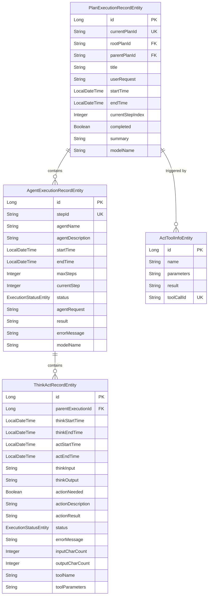
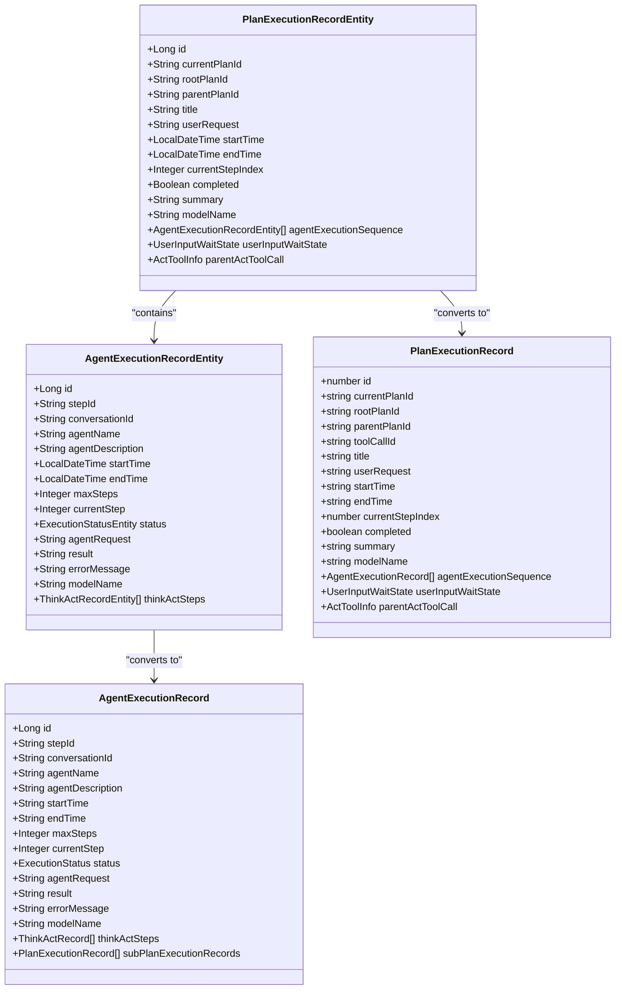
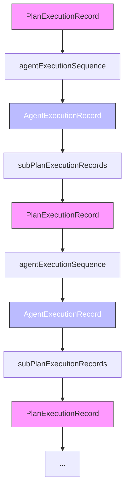
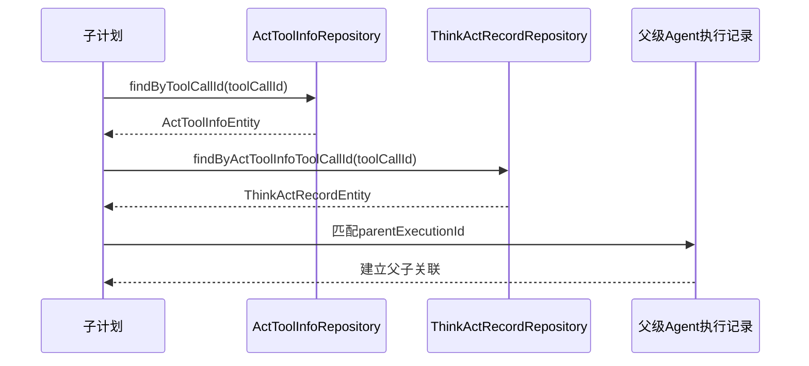
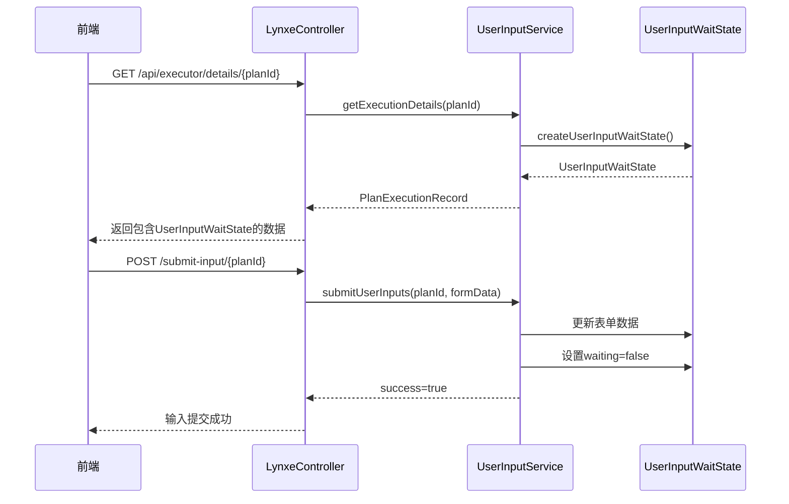

# 前后端数据映射关系

<cite>
**本文档引用的文件**  
- [PlanExecutionRecordEntity.java](file://src/main/java/com/alibaba/cloud/ai/lynxe/recorder/entity/po/PlanExecutionRecordEntity.java)
- [PlanExecutionRecord.java](file://src/main/java/com/alibaba/cloud/ai/lynxe/recorder/entity/vo/PlanExecutionRecord.java)
- [plan-execution-record.ts](file://ui-vue3/src/types/plan-execution-record.ts)
- [AgentExecutionRecordEntity.java](file://src/main/java/com/alibaba/cloud/ai/lynxe/recorder/entity/po/AgentExecutionRecordEntity.java)
- [AgentExecutionRecord.java](file://src/main/java/com/alibaba/cloud/ai/lynxe/recorder/entity/vo/AgentExecutionRecord.java)
- [ActToolInfoEntity.java](file://src/main/java/com/alibaba/cloud/ai/lynxe/recorder/entity/po/ActToolInfoEntity.java)
- [ActToolInfo.java](file://src/main/java/com/alibaba/cloud/ai/lynxe/recorder/entity/vo/ActToolInfo.java)
- [PlanHierarchyReaderService.java](file://src/main/java/com/alibaba/cloud/ai/lynxe/recorder/service/PlanHierarchyReaderService.java)
- [UserInputWaitState.java](file://src/main/java/com/alibaba/cloud/ai/lynxe/runtime/entity/vo/UserInputWaitState.java)
- [UserInputService.java](file://src/main/java/com/alibaba/cloud/ai/lynxe/runtime/service/UserInputService.java)
</cite>

## 目录
1. [前后端字段映射关系](#前后端字段映射关系)
2. [agentExecutionSequence字段转换机制](#agentexecutionsequence字段转换机制)
3. [subPlanExecutionRecords递归结构映射](#subplanexecutionrecords递归结构映射)
4. [parentActToolCall父子计划关联机制](#parentacttoolcall父子计划关联机制)
5. [UserInputWaitState数据传递机制](#userinputwaitstate数据传递机制)

## 前后端字段映射关系

后端`PlanExecutionRecordEntity`与前端`PlanExecutionRecord`之间存在明确的字段映射关系。后端实体类使用Java的`LocalDateTime`类型表示时间，而前端使用字符串格式的时间戳。字段名称转换遵循驼峰命名规则，如后端的`currentPlanId`直接映射到前端的同名字段。

数据类型转换方面，后端的布尔类型`completed`在前端保持为布尔类型，而时间类型`startTime`和`endTime`从`LocalDateTime`转换为ISO 8601格式的字符串。后端的`agentExecutionSequence`字段存储`AgentExecutionRecordEntity`对象列表，在转换为前端数据结构时，被映射为`AgentExecutionRecord`对象数组。

**图表来源**
- [PlanExecutionRecordEntity.java](file://src/main/java/com/alibaba/cloud/ai/lynxe/recorder/entity/po/PlanExecutionRecordEntity.java)
- [AgentExecutionRecordEntity.java](file://src/main/java/com/alibaba/cloud/ai/lynxe/recorder/entity/po/AgentExecutionRecordEntity.java)
- [ActToolInfoEntity.java](file://src/main/java/com/alibaba/cloud/ai/lynxe/recorder/entity/po/ActToolInfoEntity.java)
- [ThinkActRecordEntity.java](file://src/main/java/com/alibaba/cloud/ai/lynxe/recorder/entity/po/ThinkActRecordEntity.java)

**本节来源**
- [PlanExecutionRecordEntity.java](file://src/main/java/com/alibaba/cloud/ai/lynxe/recorder/entity/po/PlanExecutionRecordEntity.java)
- [plan-execution-record.ts](file://ui-vue3/src/types/plan-execution-record.ts)

## agentExecutionSequence字段转换机制

`agentExecutionSequence`字段的转换过程涉及从后端的`AgentExecutionRecordEntity`列表到前端的`AgentExecutionRecord`对象数组的映射。这一转换由`PlanHierarchyReaderService`中的`convertToAgentExecutionRecord`方法实现，该方法将持久化对象（PO）转换为值对象（VO）。

转换过程中，`AgentExecutionRecordEntity`的每个属性都被映射到`AgentExecutionRecord`的对应属性。例如，`stepId`、`agentName`、`startTime`等基本属性直接复制。`thinkActSteps`字段从`ThinkActRecordEntity`列表转换为`ThinkActRecord`对象数组，保持了执行过程的详细记录。

**图表来源**
- [PlanExecutionRecordEntity.java](file://src/main/java/com/alibaba/cloud/ai/lynxe/recorder/entity/po/PlanExecutionRecordEntity.java)
- [AgentExecutionRecordEntity.java](file://src/main/java/com/alibaba/cloud/ai/lynxe/recorder/entity/po/AgentExecutionRecordEntity.java)
- [AgentExecutionRecord.java](file://src/main/java/com/alibaba/cloud/ai/lynxe/recorder/entity/vo/AgentExecutionRecord.java)
- [plan-execution-record.ts](file://ui-vue3/src/types/plan-execution-record.ts)

**本节来源**
- [AgentExecutionRecordEntity.java](file://src/main/java/com/alibaba/cloud/ai/lynxe/recorder/entity/po/AgentExecutionRecordEntity.java)
- [AgentExecutionRecord.java](file://src/main/java/com/alibaba/cloud/ai/lynxe/recorder/entity/vo/AgentExecutionRecord.java)

## subPlanExecutionRecords递归结构映射

`subPlanExecutionRecords`字段实现了递归结构的映射，允许一个计划执行记录包含多个子计划执行记录。这种递归关系在`AgentExecutionRecord`类中定义，其中`subPlanExecutionRecords`字段是`PlanExecutionRecord`对象的列表。

递归映射的实现通过`PlanHierarchyReaderService`的`buildHierarchyRelationships`方法完成。该方法遍历所有计划执行记录，根据`rootPlanId`和`parentPlanId`建立父子关系。当一个计划的`parentPlanId`与其父计划的`currentPlanId`匹配时，该计划被添加到父计划的`subPlanExecutionRecords`列表中。

**图表来源**
- [PlanExecutionRecord.java](file://src/main/java/com/alibaba/cloud/ai/lynxe/recorder/entity/vo/PlanExecutionRecord.java)
- [AgentExecutionRecord.java](file://src/main/java/com/alibaba/cloud/ai/lynxe/recorder/entity/vo/AgentExecutionRecord.java)
- [PlanHierarchyReaderService.java](file://src/main/java/com/alibaba/cloud/ai/lynxe/recorder/service/PlanHierarchyReaderService.java)

**本节来源**
- [AgentExecutionRecord.java](file://src/main/java/com/alibaba/cloud/ai/lynxe/recorder/entity/vo/AgentExecutionRecord.java)
- [PlanHierarchyReaderService.java](file://src/main/java/com/alibaba/cloud/ai/lynxe/recorder/service/PlanHierarchyReaderService.java)

## parentActToolCall父子计划关联机制

`parentActToolCall`字段通过`toolCallId`关联查询`ActToolInfoEntity`实现父子计划的关联。当一个子计划被创建时，其`toolCallId`字段被设置为触发该计划的工具调用ID。在构建计划层次结构时，系统通过这个`toolCallId`查找对应的`ActToolInfoEntity`。

关联查询过程分为三个步骤：首先，通过子计划的`toolCallId`查询`ActToolInfoEntity`；其次，通过`ActToolInfoEntity`的关联关系查找`ThinkActRecordEntity`；最后，通过`ThinkActRecordEntity`的`parentExecutionId`找到对应的`AgentExecutionRecord`，从而建立父子计划的完整关联链。

**图表来源**
- [ActToolInfoEntity.java](file://src/main/java/com/alibaba/cloud/ai/lynxe/recorder/entity/po/ActToolInfoEntity.java)
- [PlanHierarchyReaderService.java](file://src/main/java/com/alibaba/cloud/ai/lynxe/recorder/service/PlanHierarchyReaderService.java)
- [ThinkActRecordEntity.java](file://src/main/java/com/alibaba/cloud/ai/lynxe/recorder/entity/po/ThinkActRecordEntity.java)

**本节来源**
- [PlanHierarchyReaderService.java](file://src/main/java/com/alibaba/cloud/ai/lynxe/recorder/service/PlanHierarchyReaderService.java)
- [ActToolInfoEntity.java](file://src/main/java/com/alibaba/cloud/ai/lynxe/recorder/entity/po/ActToolInfoEntity.java)

## UserInputWaitState数据传递机制

`UserInputWaitState`在前后端之间的数据传递机制通过`UserInputService`实现。当系统需要用户输入时，`UserInputService`的`createUserInputWaitState`方法创建`UserInputWaitState`对象，并设置`waiting`标志为`true`。

前端通过API获取执行详情时，包含`UserInputWaitState`信息。当用户提交输入后，前端通过`/submit-input/{planId}`端点将表单数据发送回后端。`LynxeController`接收请求并调用`UserInputService`的`submitUserInputs`方法处理用户输入，完成后将`waiting`标志设置为`false`，继续执行计划。

**图表来源**
- [UserInputWaitState.java](file://src/main/java/com/alibaba/cloud/ai/lynxe/runtime/entity/vo/UserInputWaitState.java)
- [UserInputService.java](file://src/main/java/com/alibaba/cloud/ai/lynxe/runtime/service/UserInputService.java)
- [LynxeController.java](file://src/main/java/com/alibaba/cloud/ai/lynxe/runtime/controller/LynxeController.java)

**本节来源**
- [UserInputWaitState.java](file://src/main/java/com/alibaba/cloud/ai/lynxe/runtime/entity/vo/UserInputWaitState.java)
- [UserInputService.java](file://src/main/java/com/alibaba/cloud/ai/lynxe/runtime/service/UserInputService.java)
- [LynxeController.java](file://src/main/java/com/alibaba/cloud/ai/lynxe/runtime/controller/LynxeController.java)