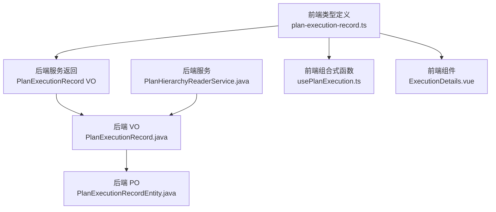
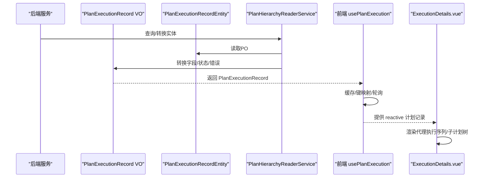
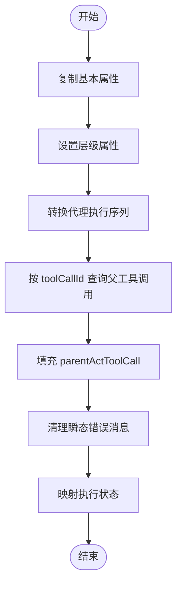
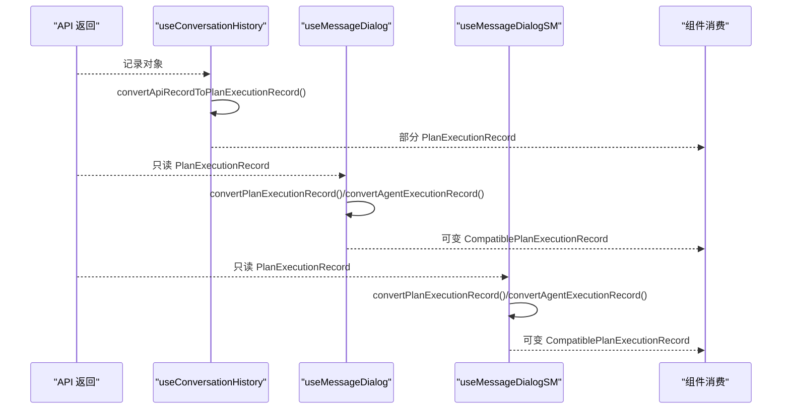
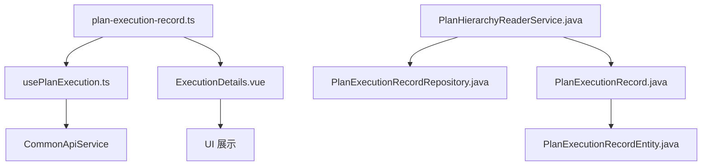

# 前端数据模型

<cite>
**本文引用的文件**
- [plan-execution-record.ts](file://ui-vue3/src/types/plan-execution-record.ts)
- [PlanExecutionRecord.java](file://src/main/java/com/alibaba/cloud/ai/lynxe/recorder/entity/vo/PlanExecutionRecord.java)
- [PlanExecutionRecordEntity.java](file://src/main/java/com/alibaba/cloud/ai/lynxe/recorder/entity/po/PlanExecutionRecordEntity.java)
- [PlanHierarchyReaderService.java](file://src/main/java/com/alibaba/cloud/ai/lynxe/recorder/service/PlanHierarchyReaderService.java)
- [usePlanExecution.ts](file://ui-vue3/src/composables/usePlanExecution.ts)
- [ExecutionDetails.vue](file://ui-vue3/src/components/chat/ExecutionDetails.vue)
- [useConversationHistory.ts](file://ui-vue3/src/composables/useConversationHistory.ts)
- [useMessageDialog.ts](file://ui-vue3/src/composables/useMessageDialog.ts)
- [useMessageDialogSM.ts](file://ui-vue3/src/composables/useMessageDialogSM.ts)
</cite>

## 目录
1. [简介](#简介)
2. [项目结构](#项目结构)
3. [核心组件](#核心组件)
4. [架构总览](#架构总览)
5. [详细组件分析](#详细组件分析)
6. [依赖分析](#依赖分析)
7. [性能考虑](#性能考虑)
8. [故障排查指南](#故障排查指南)
9. [结论](#结论)
10. [附录：字段说明表](#附录字段说明表)

## 简介
本文件聚焦于“计划执行前端数据模型”，系统性梳理并解释前端 TypeScript 接口 PlanExecutionRecord 的设计原理与实现细节，涵盖：
- 核心字段（执行ID、状态、时间戳、执行摘要、步骤序列）的业务语义与用途
- 后端 PlanExecutionRecord 与前端 plan-execution-record.ts 类型定义之间的映射关系与数据转换逻辑
- convertToPlanExecutionRecord 方法在后端的服务层实现与转换规则
- 前端额外添加的 status、progress 等计算字段的生成逻辑与显示用途
- 前端数据模型的完整字段说明表与最佳实践建议

## 项目结构
前端数据模型位于 ui-vue3/src/types/plan-execution-record.ts，后端实体与服务层位于 src/main/java/com/alibaba/cloud/ai/lynxe/recorder。前后端通过 API 返回的 PlanExecutionRecord 结构进行交互，前端在 composable 中对数据进行缓存、轮询与二次加工。

图表来源
- [plan-execution-record.ts](file://ui-vue3/src/types/plan-execution-record.ts#L1-L288)
- [PlanExecutionRecord.java](file://src/main/java/com/alibaba/cloud/ai/lynxe/recorder/entity/vo/PlanExecutionRecord.java#L1-L337)
- [PlanExecutionRecordEntity.java](file://src/main/java/com/alibaba/cloud/ai/lynxe/recorder/entity/po/PlanExecutionRecordEntity.java#L1-L283)
- [PlanHierarchyReaderService.java](file://src/main/java/com/alibaba/cloud/ai/lynxe/recorder/service/PlanHierarchyReaderService.java#L180-L379)
- [usePlanExecution.ts](file://ui-vue3/src/composables/usePlanExecution.ts#L1-L200)
- [ExecutionDetails.vue](file://ui-vue3/src/components/chat/ExecutionDetails.vue#L1-L200)

章节来源
- [plan-execution-record.ts](file://ui-vue3/src/types/plan-execution-record.ts#L1-L288)
- [PlanExecutionRecord.java](file://src/main/java/com/alibaba/cloud/ai/lynxe/recorder/entity/vo/PlanExecutionRecord.java#L1-L337)
- [PlanExecutionRecordEntity.java](file://src/main/java/com/alibaba/cloud/ai/lynxe/recorder/entity/po/PlanExecutionRecordEntity.java#L1-L283)
- [PlanHierarchyReaderService.java](file://src/main/java/com/alibaba/cloud/ai/lynxe/recorder/service/PlanHierarchyReaderService.java#L180-L379)
- [usePlanExecution.ts](file://ui-vue3/src/composables/usePlanExecution.ts#L1-L200)
- [ExecutionDetails.vue](file://ui-vue3/src/components/chat/ExecutionDetails.vue#L1-L200)

## 核心组件
- 前端 PlanExecutionRecord TypeScript 接口：定义了计划执行记录的完整结构，包含基础信息、执行序列、用户输入等待状态、父工具调用信息以及若干前端计算字段（status、progress、progressText、result、error、message、createdAt、updatedAt、metadata）。
- 后端 PlanExecutionRecord VO：承载从数据库实体转换而来的可序列化对象，包含基本属性、当前步骤索引、代理执行序列、用户输入等待状态、模型名、父工具调用信息等。
- 后端 PlanHierarchyReaderService：负责将 PlanExecutionRecordEntity 转换为 PlanExecutionRecord VO，并处理层级关系构建与错误消息清理逻辑。
- 前端 usePlanExecution 组合式函数：负责轮询、缓存、键值映射（rootPlanId/currentPlanId），并将后端返回的记录注入到响应式 Map 中供组件消费。
- 前端组件 ExecutionDetails.vue：展示代理执行序列、子计划树、触发工具调用信息等，基于 PlanExecutionRecord 数据驱动渲染。

章节来源
- [plan-execution-record.ts](file://ui-vue3/src/types/plan-execution-record.ts#L192-L288)
- [PlanExecutionRecord.java](file://src/main/java/com/alibaba/cloud/ai/lynxe/recorder/entity/vo/PlanExecutionRecord.java#L46-L337)
- [PlanHierarchyReaderService.java](file://src/main/java/com/alibaba/cloud/ai/lynxe/recorder/service/PlanHierarchyReaderService.java#L180-L379)
- [usePlanExecution.ts](file://ui-vue3/src/composables/usePlanExecution.ts#L1-L200)
- [ExecutionDetails.vue](file://ui-vue3/src/components/chat/ExecutionDetails.vue#L1-L200)

## 架构总览
后端服务层将数据库实体转换为 VO 对象，前端通过 API 获取 VO 并进一步在本地进行缓存与二次加工，最终由组件消费。

图表来源
- [PlanHierarchyReaderService.java](file://src/main/java/com/alibaba/cloud/ai/lynxe/recorder/service/PlanHierarchyReaderService.java#L180-L379)
- [PlanExecutionRecordEntity.java](file://src/main/java/com/alibaba/cloud/ai/lynxe/recorder/entity/po/PlanExecutionRecordEntity.java#L1-L283)
- [PlanExecutionRecord.java](file://src/main/java/com/alibaba/cloud/ai/lynxe/recorder/entity/vo/PlanExecutionRecord.java#L1-L337)
- [usePlanExecution.ts](file://ui-vue3/src/composables/usePlanExecution.ts#L120-L200)
- [ExecutionDetails.vue](file://ui-vue3/src/components/chat/ExecutionDetails.vue#L1-L200)

## 详细组件分析

### PlanExecutionRecord TypeScript 接口设计
- 执行ID与键映射
  - currentPlanId：后端字段 currentPlanId，前端作为 planId 使用；用于唯一标识当前计划。
  - rootPlanId：根计划ID，用于多级子计划的树形结构定位。
  - parentPlanId：父计划ID，用于父子关系建立。
  - toolCallId：触发该子计划的工具调用ID，用于回溯父工具调用信息。
- 基础信息
  - title：计划标题
  - userRequest：用户原始请求
  - startTime/endTime：执行起止时间
  - currentStepIndex：当前执行步骤索引
  - completed：是否完成
  - summary：执行摘要
  - modelName：实际调用模型名
- 执行序列
  - agentExecutionSequence：代理执行记录数组，每个元素包含代理名称、请求、结果、错误、状态、思考-行动步骤等。
- 用户输入等待状态
  - userInputWaitState：用户输入等待状态，用于交互式流程。
- 父工具调用信息
  - parentActToolCall：父工具调用信息，用于子计划详情展示。
- 前端计算字段（仅前端）
  - status：运行态（pending/running/completed/failed/paused）
  - progress：进度百分比（0-100）
  - progressText：进度文本描述
  - result：详细执行结果
  - error：错误信息
  - message：附加消息
  - createdAt/updatedAt：创建与更新时间戳
  - metadata：附加元数据

章节来源
- [plan-execution-record.ts](file://ui-vue3/src/types/plan-execution-record.ts#L192-L288)

### 后端 PlanExecutionRecord 与前端映射关系
- 字段名称映射
  - 后端 currentPlanId ↔ 前端 currentPlanId
  - 后端 rootPlanId ↔ 前端 rootPlanId
  - 后端 parentPlanId ↔ 前端 parentPlanId
  - 后端 toolCallId ↔ 前端 toolCallId
  - 后端 title ↔ 前端 title
  - 后端 userRequest ↔ 前端 userRequest
  - 后端 startTime/endTime ↔ 前端 startTime/endTime（字符串）
  - 后端 currentStepIndex ↔ 前端 currentStepIndex
  - 后端 completed ↔ 前端 completed
  - 后端 summary ↔ 前端 summary
  - 后端 modelName ↔ 前端 modelName
  - 后端 agentExecutionSequence ↔ 前端 agentExecutionSequence
  - 后端 userInputWaitState ↔ 前端 userInputWaitState
  - 后端 parentActToolCall ↔ 前端 parentActToolCall
- 数据类型转换
  - 时间字段：后端为 LocalDateTime，前端以字符串表示（ISO格式），便于跨语言传输与前端解析。
  - 状态枚举：后端使用 ExecutionStatus（IDLE/RUNNING/FINISHED），前端使用字符串枚举（pending/running/completed/failed/paused），需在转换时进行映射。
  - 错误消息：后端可能保留瞬态系统错误，服务层会根据完成状态与结果清理不必要错误，前端再根据 status/error/message 进行展示。
- 额外字段添加
  - 前端新增 status、progress、progressText、result、error、message、createdAt、updatedAt、metadata 等字段，用于 UI 展示与交互。

章节来源
- [PlanExecutionRecord.java](file://src/main/java/com/alibaba/cloud/ai/lynxe/recorder/entity/vo/PlanExecutionRecord.java#L46-L337)
- [PlanHierarchyReaderService.java](file://src/main/java/com/alibaba/cloud/ai/lynxe/recorder/service/PlanHierarchyReaderService.java#L180-L379)
- [plan-execution-record.ts](file://ui-vue3/src/types/plan-execution-record.ts#L192-L288)

### convertToPlanExecutionRecord 方法实现逻辑
后端服务层将 PlanExecutionRecordEntity 转换为 PlanExecutionRecord VO 的核心逻辑如下：
- 基本属性复制：id、currentPlanId、title、userRequest、startTime、endTime、completed、summary、currentStepIndex、modelName。
- 层级属性设置：rootPlanId、parentPlanId、toolCallId。
- 代理执行序列转换：遍历实体中的代理执行记录集合，逐个转换为 VO，并设置状态、结果、错误等。
- 父工具调用信息：若存在 toolCallId，则查询 ActToolInfo 并填充 parentActToolCall。
- 错误消息清理：当状态为 FINISHED 且存在非空结果时，清理以“System execution error at step”开头的瞬态错误消息，避免误导用户。
- 状态映射：将 ExecutionStatusEntity 映射为 ExecutionStatus 枚举。

图表来源
- [PlanHierarchyReaderService.java](file://src/main/java/com/alibaba/cloud/ai/lynxe/recorder/service/PlanHierarchyReaderService.java#L180-L379)

章节来源
- [PlanHierarchyReaderService.java](file://src/main/java/com/alibaba/cloud/ai/lynxe/recorder/service/PlanHierarchyReaderService.java#L180-L379)

### 前端数据模型字段说明与使用场景
- 执行ID与层级
  - currentPlanId：作为计划唯一标识，用于 API 请求与响应键值映射。
  - rootPlanId：用于树形结构定位与层级关系构建。
  - parentPlanId/toolCallId：用于父子关系与触发链路追踪。
- 基础信息
  - title/userRequest：用于展示计划概览与用户意图。
  - startTime/endTime：用于计算耗时、展示生命周期。
  - currentStepIndex：用于定位当前执行步骤。
  - completed/summary：用于判断完成状态与展示摘要。
  - modelName：用于展示实际调用模型。
- 执行序列
  - agentExecutionSequence：作为步骤详情的主要数据源，驱动 UI 展示与交互。
- 用户输入等待状态
  - userInputWaitState：用于交互式流程提示与表单输入。
- 父工具调用信息
  - parentActToolCall：用于子计划详情展示触发来源。
- 前端计算字段
  - status：统一状态管理，便于 UI 切换样式与文案。
  - progress/progressText：进度条与文本提示，提升用户体验。
  - result/error/message：结果与错误展示，便于问题定位。
  - createdAt/updatedAt：日志与审计信息。
  - metadata：扩展字段，支持未来功能拓展。

章节来源
- [plan-execution-record.ts](file://ui-vue3/src/types/plan-execution-record.ts#L192-L288)

### 前端额外字段的生成逻辑与显示用途
- status 生成逻辑
  - 来源于后端 completed 字段与后端状态映射，前端进一步扩展为 pending/running/completed/failed/paused，用于 UI 状态切换与文案国际化。
- progress 生成逻辑
  - 可能来源于后端 currentStepIndex 与代理执行序列长度的计算，或由前端根据 UI 需求动态生成，用于进度条展示。
- progressText/result/error/message/createdAt/updatedAt/metadata
  - 由前端在组合式函数或组件中补充，用于丰富展示内容与交互反馈。

章节来源
- [usePlanExecution.ts](file://ui-vue3/src/composables/usePlanExecution.ts#L1-L200)
- [ExecutionDetails.vue](file://ui-vue3/src/components/chat/ExecutionDetails.vue#L1-L200)
- [plan-execution-record.ts](file://ui-vue3/src/types/plan-execution-record.ts#L254-L288)

### 前端数据转换与兼容性处理
- API 记录到计划记录的转换
  - 在某些场景下，前端会将 API 返回的记录转换为部分 PlanExecutionRecord，仅保留必要字段（如 currentPlanId、status、rootPlanId、summary、completed、agentExecutionSequence 等），用于快速展示与交互。
- 只读到可变的转换
  - 在对话组件中，前端会将只读记录转换为可变版本，以便在 UI 中进行编辑与交互，同时递归处理代理执行记录与子计划记录的可变化。

图表来源
- [useConversationHistory.ts](file://ui-vue3/src/composables/useConversationHistory.ts#L35-L61)
- [useMessageDialog.ts](file://ui-vue3/src/composables/useMessageDialog.ts#L666-L698)
- [useMessageDialogSM.ts](file://ui-vue3/src/composables/useMessageDialogSM.ts#L601-L633)

章节来源
- [useConversationHistory.ts](file://ui-vue3/src/composables/useConversationHistory.ts#L35-L61)
- [useMessageDialog.ts](file://ui-vue3/src/composables/useMessageDialog.ts#L666-L698)
- [useMessageDialogSM.ts](file://ui-vue3/src/composables/useMessageDialogSM.ts#L601-L633)

## 依赖分析
- 前端类型依赖
  - plan-execution-record.ts 定义了 PlanExecutionRecord、AgentExecutionRecord、ThinkActRecord、ActToolInfo、UserInputWaitState 等接口，形成完整的数据模型层次。
- 前端消费依赖
  - usePlanExecution.ts 依赖 CommonApiService 获取详情，并将结果写入 reactive Map，供组件订阅。
  - ExecutionDetails.vue 依赖 PlanExecutionRecord 接口渲染代理执行序列与子计划树。
- 后端服务依赖
  - PlanHierarchyReaderService 依赖 PlanExecutionRecordRepository、ActToolInfoRepository 等，负责层级关系构建与错误清理。
  - PlanExecutionRecordEntity 与 PlanExecutionRecord.java 分别承担持久化与传输层职责。

图表来源
- [plan-execution-record.ts](file://ui-vue3/src/types/plan-execution-record.ts#L1-L288)
- [usePlanExecution.ts](file://ui-vue3/src/composables/usePlanExecution.ts#L1-L200)
- [ExecutionDetails.vue](file://ui-vue3/src/components/chat/ExecutionDetails.vue#L1-L200)
- [PlanHierarchyReaderService.java](file://src/main/java/com/alibaba/cloud/ai/lynxe/recorder/service/PlanHierarchyReaderService.java#L180-L379)
- [PlanExecutionRecord.java](file://src/main/java/com/alibaba/cloud/ai/lynxe/recorder/entity/vo/PlanExecutionRecord.java#L1-L337)
- [PlanExecutionRecordEntity.java](file://src/main/java/com/alibaba/cloud/ai/lynxe/recorder/entity/po/PlanExecutionRecordEntity.java#L1-L283)

章节来源
- [plan-execution-record.ts](file://ui-vue3/src/types/plan-execution-record.ts#L1-L288)
- [usePlanExecution.ts](file://ui-vue3/src/composables/usePlanExecution.ts#L1-L200)
- [ExecutionDetails.vue](file://ui-vue3/src/components/chat/ExecutionDetails.vue#L1-L200)
- [PlanHierarchyReaderService.java](file://src/main/java/com/alibaba/cloud/ai/lynxe/recorder/service/PlanHierarchyReaderService.java#L180-L379)
- [PlanExecutionRecord.java](file://src/main/java/com/alibaba/cloud/ai/lynxe/recorder/entity/vo/PlanExecutionRecord.java#L1-L337)
- [PlanExecutionRecordEntity.java](file://src/main/java/com/alibaba/cloud/ai/lynxe/recorder/entity/po/PlanExecutionRecordEntity.java#L1-L283)

## 性能考虑
- 轮询策略：usePlanExecution.ts 使用渐进式轮询间隔与最大重试次数，减少无效请求与服务器压力。
- 键映射优化：优先使用 rootPlanId 作为 Map 键，确保树形结构稳定访问；同时兼容 currentPlanId，提升容错能力。
- 数据转换成本：后端服务层一次性完成实体到 VO 的转换与层级关系构建，前端仅做轻量级二次加工，降低前端负担。
- 只读到可变转换：在对话组件中按需转换，避免不必要的深拷贝与重复处理。

[本节为通用指导，无需列出具体文件来源]

## 故障排查指南
- 计划未找到
  - 现象：轮询返回空记录，前端进行重试直至达到最大次数。
  - 处理：检查 API 是否正确返回 rootPlanId/currentPlanId，确认后端是否存在对应记录。
- 状态异常
  - 现象：前端 status 与后端状态不一致。
  - 处理：核对 convertExecutionStatus 映射逻辑与后端状态清理规则。
- 错误消息误导
  - 现象：瞬态系统错误持续显示。
  - 处理：确认后端服务层已根据完成状态与结果清理错误消息。
- 子计划层级缺失
  - 现象：代理执行序列缺少 subPlanExecutionRecords。
  - 处理：检查 buildHierarchyRelationships 逻辑与 ActToolInfo 关联查询。

章节来源
- [usePlanExecution.ts](file://ui-vue3/src/composables/usePlanExecution.ts#L120-L200)
- [PlanHierarchyReaderService.java](file://src/main/java/com/alibaba/cloud/ai/lynxe/recorder/service/PlanHierarchyReaderService.java#L323-L379)

## 结论
PlanExecutionRecord 前端数据模型在保持与后端一致的结构基础上，通过额外的计算字段与转换逻辑，显著提升了 UI 的表现力与交互体验。后端服务层负责严格的实体转换与层级关系构建，前端则专注于轮询、缓存与二次加工，二者协同实现了高效、稳定的计划执行可视化。

[本节为总结性内容，无需列出具体文件来源]

## 附录：字段说明表
- 执行ID与层级
  - currentPlanId：字符串，唯一标识当前计划，前端作为 planId 使用
  - rootPlanId：字符串，根计划ID，用于树形结构定位
  - parentPlanId：字符串，父计划ID
  - toolCallId：字符串，触发该子计划的工具调用ID
- 基础信息
  - title：字符串，计划标题
  - userRequest：字符串，用户原始请求
  - startTime/endTime：字符串（ISO），执行起止时间
  - currentStepIndex：数字，当前执行步骤索引
  - completed：布尔，是否完成
  - summary：字符串，执行摘要
  - modelName：字符串，实际调用模型名
- 执行序列
  - agentExecutionSequence：数组，代理执行记录列表
- 用户输入等待状态
  - userInputWaitState：对象，用户输入等待状态
- 父工具调用信息
  - parentActToolCall：对象，父工具调用信息
- 前端计算字段
  - status：字符串，运行态（pending/running/completed/failed/paused）
  - progress：数字（0-100），进度百分比
  - progressText：字符串，进度文本描述
  - result：字符串，详细执行结果
  - error：字符串，错误信息
  - message：字符串，附加消息
  - createdAt/updatedAt：字符串（ISO），创建与更新时间戳
  - metadata：对象，附加元数据

章节来源
- [plan-execution-record.ts](file://ui-vue3/src/types/plan-execution-record.ts#L192-L288)