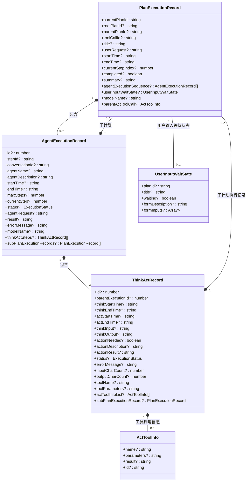

# 前端数据模型定义

<cite>
**本文档引用的文件**
- [plan-execution-record.ts](file://ui-vue3/src/types/plan-execution-record.ts)
- [plan-execution.ts](file://ui-vue3/src/types/plan-execution.ts)
- [agent-execution.ts](file://ui-vue3/src/api/agent-execution.ts)
- [agent-execution-detail.ts](file://ui-vue3/src/types/agent-execution-detail.ts)
- [PlanExecutionRecord.java](file://src/main/java/com/alibaba/cloud/ai/lynxe/recorder/entity/vo/PlanExecutionRecord.java)
- [AgentExecutionRecord.java](file://src/main/java/com/alibaba/cloud/ai/lynxe/recorder/entity/vo/AgentExecutionRecord.java)
- [ThinkActRecord.java](file://src/main/java/com/alibaba/cloud/ai/lynxe/recorder/entity/vo/ThinkActRecord.java)
- [UserInputWaitState.java](file://src/main/java/com/alibaba/cloud/ai/lynxe/runtime/entity/vo/UserInputWaitState.java)
- [ExecutionStatus.java](file://src/main/java/com/alibaba/cloud/ai/lynxe/recorder/entity/enums/ExecutionStatus.java)
- [PlanHierarchyReaderService.java](file://src/main/java/com/alibaba/cloud/ai/lynxe/recorder/service/PlanHierarchyReaderService.java)
- [NewRepoPlanExecutionRecorder.java](file://src/main/java/com/alibaba/cloud/ai/lynxe/recorder/service/NewRepoPlanExecutionRecorder.java)
</cite>

## 目录
1. [引言](#引言)
2. [核心数据模型概述](#核心数据模型概述)
3. [PlanExecutionRecord接口设计原理](#planexecutionrecord接口设计原理)
4. [ExecutionStatus枚举类型映射关系](#executionstatus枚举类型映射关系)
5. [AgentExecutionRecord接口字段解析](#agentexecutionrecord接口字段解析)
6. [ThinkActRecord接口设计目的](#thinkactrecord接口设计目的)
7. [UserInputWaitState接口作用](#userinputwaitstate接口作用)
8. [完整字段说明表](#完整字段说明表)

## 引言
本文档深入解析JManus系统前端数据模型的设计原理，重点阐述PlanExecutionRecord、AgentExecutionRecord、ThinkActRecord等核心TypeScript接口的结构与业务含义。这些接口与后端Java实体类保持严格对应，构成了系统执行记录的核心数据结构。文档将详细解释各字段的层次关系、业务用途以及前后端枚举类型的映射机制。

## 核心数据模型概述

**图示来源**
- [plan-execution-record.ts](file://ui-vue3/src/types/plan-execution-record.ts)

**本节来源**
- [plan-execution-record.ts](file://ui-vue3/src/types/plan-execution-record.ts)
- [plan-execution.ts](file://ui-vue3/src/types/plan-execution.ts)

## PlanExecutionRecord接口设计原理

`PlanExecutionRecord` 接口是系统执行记录的核心数据结构，用于跟踪和记录计划执行的详细信息。该接口设计遵循层次化结构原则，通过 `currentPlanId`、`rootPlanId`、`parentPlanId` 和 `toolCallId` 四个关键字段构建了完整的计划执行树形结构。

`currentPlanId` 字段作为当前计划的唯一标识符，是整个层次结构的基础。`rootPlanId` 字段标识了子计划所属的根计划ID，对于主计划该字段为null。`parentPlanId` 字段标识了父级计划ID，用于构建父子计划的层级关系。`toolCallId` 字段则记录了触发该子计划的工具调用ID，建立了工具调用与计划执行之间的关联。

这种设计实现了多层嵌套的执行结构，支持复杂任务的分解与执行。当一个计划通过工具调用创建子计划时，系统会自动建立这些字段之间的关联关系，形成清晰的执行谱系。例如，一个主计划（root plan）可以包含多个代理执行步骤，每个代理在执行过程中又可能通过工具调用创建子计划，这些子计划通过 `parentPlanId` 指向其父计划，通过 `toolCallId` 记录触发它的工具调用，并通过 `rootPlanId` 始终关联到最初的根计划。

**本节来源**
- [plan-execution-record.ts](file://ui-vue3/src/types/plan-execution-record.ts#L200-L284)
- [NewRepoPlanExecutionRecorder.java](file://src/main/java/com/alibaba/cloud/ai/lynxe/recorder/service/NewRepoPlanExecutionRecorder.java#L797-L833)
- [PlanHierarchyReaderService.java](file://src/main/java/com/alibaba/cloud/ai/lynxe/recorder/service/PlanHierarchyReaderService.java#L96-L391)

## ExecutionStatus枚举类型映射关系

`ExecutionStatus` 枚举类型在前端TypeScript和后端Java之间建立了严格的映射关系，确保了执行状态在系统各组件间的一致性。前端定义的 `ExecutionStatus` 类型为字符串字面量联合类型，包含三个值：`'IDLE'`、`'RUNNING'` 和 `'FINISHED'`。

这三个值直接映射到后端Java的 `com.alibaba.cloud.ai.lynxe.recorder.entity.enums.ExecutionStatus` 枚举类型。后端枚举定义了相同的状态值：`IDLE`、`RUNNING` 和 `FINISHED`。这种一对一的映射确保了状态信息在前后端传输过程中的准确性和一致性。

在后端服务中，`PlanHierarchyReaderService` 类的 `convertExecutionStatus` 方法负责将数据库实体状态转换为前端可用的枚举值。该方法通过switch语句确保了状态的精确转换：`ExecutionStatusEntity.IDLE` 转换为 `ExecutionStatus.IDLE`，`ExecutionStatusEntity.RUNNING` 转换为 `ExecutionStatus.RUNNING`，`ExecutionStatusEntity.FINISHED` 转换为 `ExecutionStatus.FINISHED`。这种设计避免了状态值在传输过程中的歧义和错误，保证了系统状态机的正确运行。

**本节来源**
- [plan-execution-record.ts](file://ui-vue3/src/types/plan-execution-record.ts#L30)
- [ExecutionStatus.java](file://src/main/java/com/alibaba/cloud/ai/lynxe/recorder/entity/enums/ExecutionStatus.java)
- [PlanHierarchyReaderService.java](file://src/main/java/com/alibaba/cloud/ai/lynxe/recorder/service/PlanHierarchyReaderService.java#L306-L320)

## AgentExecutionRecord接口字段解析

`AgentExecutionRecord` 接口记录了代理执行的详细信息，是分析代理行为的核心数据结构。其关键字段具有明确的业务含义：

`agentName` 字段表示创建此记录的代理名称，用于标识执行任务的特定代理实例。`agentDescription` 字段提供了代理的描述信息，帮助用户理解代理的功能和角色。`currentStep` 字段表示当前执行的步骤编号，与 `maxSteps` 字段共同反映了执行进度。

`status` 字段使用 `ExecutionStatus` 枚举值表示执行状态，与后端状态机保持同步。`agentRequest` 字段记录了代理执行的请求内容，是理解代理任务上下文的关键。`thinkActSteps` 字段包含了一系列 `ThinkActRecord` 对象，详细记录了代理的思维-行动循环过程。

`subPlanExecutionRecords` 字段是实现计划嵌套的关键，它包含了当前代理执行过程中创建的所有子计划执行记录。这种设计支持了复杂任务的递归分解，使得一个代理可以在执行过程中启动新的计划，形成树状的执行结构。

**本节来源**
- [plan-execution-record.ts](file://ui-vue3/src/types/plan-execution-record.ts#L120-L168)
- [AgentExecutionRecord.java](file://src/main/java/com/alibaba/cloud/ai/lynxe/recorder/entity/vo/AgentExecutionRecord.java#L166-L300)

## ThinkActRecord接口设计目的

`ThinkActRecord` 接口的设计目的是记录代理在单个执行步骤中的思维-行动循环过程，提供细粒度的执行追踪能力。该接口实现了认知过程的可观察性，使得系统的决策过程透明化。

`thinkInput` 和 `thinkOutput` 字段分别记录了思维过程的输入上下文和输出结果，完整保存了代理的推理过程。`actionNeeded` 字段表示思维过程是否确定需要采取行动，体现了代理的决策逻辑。`actionDescription` 和 `actionResult` 字段则记录了具体行动的描述和执行结果。

时间戳字段（`thinkStartTime`、`thinkEndTime`、`actStartTime`、`actEndTime`）提供了精确的性能分析数据，可用于计算思维和行动阶段的耗时。`inputCharCount` 和 `outputCharCount` 字段统计了输入输出的字符数，为成本核算和性能优化提供了数据支持。

`actToolInfoList` 字段记录了行动阶段调用的工具信息，建立了思维决策与工具执行之间的关联。`subPlanExecutionRecord` 字段支持在思维-行动循环中启动子计划，实现了动态的任务分解能力。

**本节来源**
- [plan-execution-record.ts](file://ui-vue3/src/types/plan-execution-record.ts#L54-L111)
- [ThinkActRecord.java](file://src/main/java/com/alibaba/cloud/ai/lynxe/recorder/entity/vo/ThinkActRecord.java#L159-L297)

## UserInputWaitState接口作用

`UserInputWaitState` 接口在用户交互场景中扮演着关键角色，用于处理计划执行过程中需要用户输入的情况。该接口实现了系统与用户的异步交互机制，使得复杂任务可以在需要人工干预时暂停执行。

`waiting` 字段表示计划是否正在等待用户输入，是控制执行流程的关键标志。`title` 和 `formDescription` 字段提供了展示给用户的界面文本，指导用户完成输入。`formInputs` 字段以键值对数组的形式定义了需要收集的输入字段，支持复杂的表单数据结构。

当系统检测到需要用户输入时，会创建 `UserInputWaitState` 对象并将其关联到 `PlanExecutionRecord` 上。前端界面根据此状态显示相应的输入表单，收集用户输入后通过API将数据提交回系统，继续执行被暂停的计划。这种设计实现了人机协作的工作流，使得系统既能自动化处理常规任务，又能在必要时请求人工介入。

**本节来源**
- [plan-execution-record.ts](file://ui-vue3/src/types/plan-execution-record.ts#L175-L190)
- [UserInputWaitState.java](file://src/main/java/com/alibaba/cloud/ai/lynxe/runtime/entity/vo/UserInputWaitState.java)

## 完整字段说明表

### PlanExecutionRecord字段说明

| 字段名称 | 数据类型 | 可选性 | 业务含义 | 使用场景 |
|---------|--------|-------|--------|--------|
| currentPlanId | string | 必需 | 当前计划的唯一标识符 | 作为计划的主键，用于查询和关联 |
| rootPlanId | string | 可选 | 根计划ID，用于子计划追溯 | 在子计划中标识其所属的根计划 |
| parentPlanId | string | 可选 | 父级计划ID，构建计划层级 | 建立父子计划的层级关系 |
| toolCallId | string | 可选 | 触发此计划的工具调用ID | 记录子计划的创建来源 |
| title | string | 可选 | 计划标题 | 用户界面显示 |
| userRequest | string | 可选 | 用户原始请求 | 保留用户输入的上下文 |
| startTime | string | 可选 | 执行开始时间 | 计算执行时长 |
| endTime | string | 可选 | 执行结束时间 | 计算执行时长 |
| currentStepIndex | number | 可选 | 当前执行步骤索引 | 显示执行进度 |
| completed | boolean | 可选 | 是否完成 | 判断计划执行状态 |
| summary | string | 可选 | 执行摘要 | 快速了解执行结果 |
| agentExecutionSequence | AgentExecutionRecord[] | 可选 | 代理执行序列 | 按步骤展示执行详情 |
| userInputWaitState | UserInputWaitState | 可选 | 用户输入等待状态 | 处理需要用户输入的场景 |
| modelName | string | 可选 | 调用的模型名称 | 记录使用的AI模型 |
| parentActToolCall | ActToolInfo | 可选 | 父级工具调用信息 | 显示触发子计划的工具详情 |

### AgentExecutionRecord字段说明

| 字段名称 | 数据类型 | 可选性 | 业务含义 | 使用场景 |
|---------|--------|-------|--------|--------|
| id | number | 可选 | 记录唯一标识 | 数据库主键 |
| stepId | string | 可选 | 所属步骤ID | 关联执行步骤 |
| conversationId | string | 可选 | 所属对话ID | 关联对话上下文 |
| agentName | string | 可选 | 代理名称 | 识别执行代理 |
| agentDescription | string | 可选 | 代理描述 | 了解代理功能 |
| startTime | string | 可选 | 执行开始时间 | 计算执行时长 |
| endTime | string | 可选 | 执行结束时间 | 计算执行时长 |
| maxSteps | number | 可选 | 最大允许步骤数 | 控制执行深度 |
| currentStep | number | 可选 | 当前执行步骤 | 显示执行进度 |
| status | ExecutionStatus | 可选 | 执行状态 | 监控执行状态 |
| agentRequest | string | 可选 | 代理执行请求 | 保留请求上下文 |
| result | string | 可选 | 执行结果 | 显示最终结果 |
| errorMessage | string | 可选 | 错误信息 | 诊断执行问题 |
| modelName | string | 可选 | 模型名称 | 记录使用模型 |
| thinkActSteps | ThinkActRecord[] | 可选 | 思维-行动步骤 | 详细执行追踪 |
| subPlanExecutionRecords | PlanExecutionRecord[] | 可选 | 子计划执行记录 | 支持计划嵌套 |

### ThinkActRecord字段说明

| 字段名称 | 数据类型 | 可选性 | 业务含义 | 使用场景 |
|---------|--------|-------|--------|--------|
| id | number | 可选 | 记录唯一标识 | 数据库主键 |
| parentExecutionId | number | 可选 | 父级执行记录ID | 关联代理执行 |
| thinkStartTime | string | 可选 | 思维开始时间 | 性能分析 |
| thinkEndTime | string | 可选 | 思维结束时间 | 性能分析 |
| actStartTime | string | 可选 | 行动开始时间 | 性能分析 |
| actEndTime | string | 可选 | 行动结束时间 | 性能分析 |
| thinkInput | string | 可选 | 思维输入 | 保存推理上下文 |
| thinkOutput | string | 可选 | 思维输出 | 查看推理过程 |
| actionNeeded | boolean | 可选 | 是否需要行动 | 决策逻辑判断 |
| actionDescription | string | 可选 | 行动描述 | 了解行动意图 |
| actionResult | string | 可选 | 行动结果 | 查看执行结果 |
| status | ExecutionStatus | 可选 | 状态 | 监控执行状态 |
| errorMessage | string | 可选 | 错误信息 | 诊断执行问题 |
| inputCharCount | number | 可选 | 输入字符数 | 成本核算 |
| outputCharCount | number | 可选 | 输出字符数 | 成本核算 |
| toolName | string | 可选 | 工具名称 | 记录使用工具 |
| toolParameters | string | 可选 | 工具参数 | 保存调用参数 |
| actToolInfoList | ActToolInfo[] | 可选 | 工具调用信息 | 详细工具调用记录 |
| subPlanExecutionRecord | PlanExecutionRecord | 可选 | 子计划执行记录 | 支持动态任务分解 |

**本节来源**
- [plan-execution-record.ts](file://ui-vue3/src/types/plan-execution-record.ts)
- [PlanExecutionRecord.java](file://src/main/java/com/alibaba/cloud/ai/lynxe/recorder/entity/vo/PlanExecutionRecord.java)
- [AgentExecutionRecord.java](file://src/main/java/com/alibaba/cloud/ai/lynxe/recorder/entity/vo/AgentExecutionRecord.java)
- [ThinkActRecord.java](file://src/main/java/com/alibaba/cloud/ai/lynxe/recorder/entity/vo/ThinkActRecord.java)