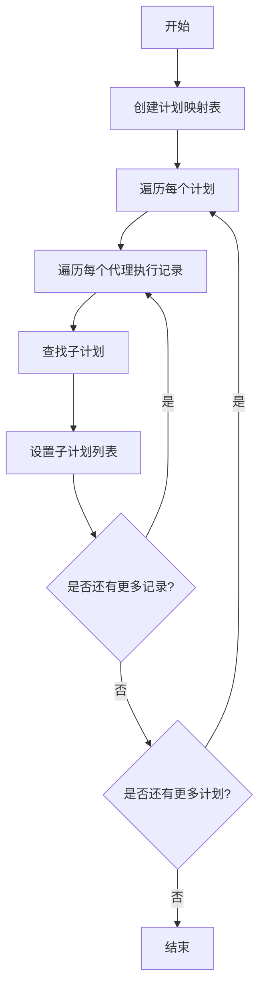
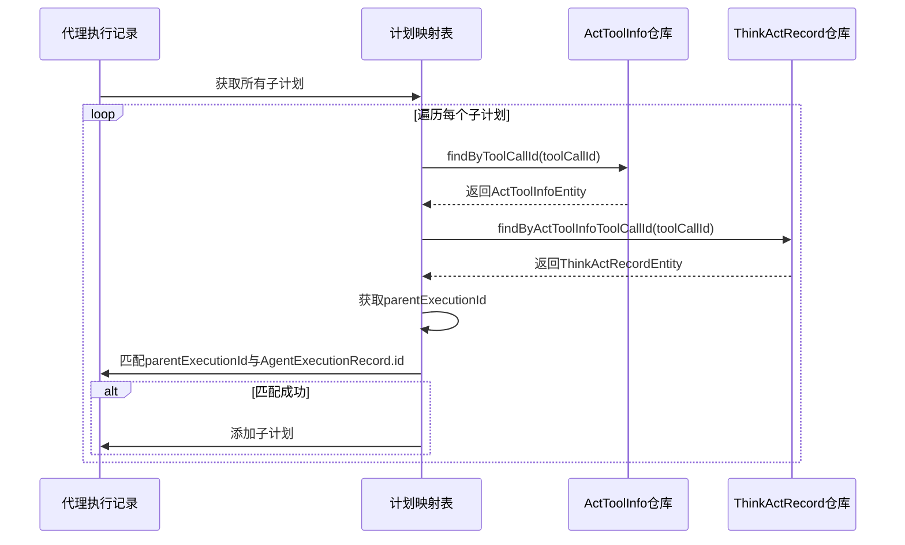

# 数据转换逻辑

<cite>
**本文档引用的文件**   
- [PlanHierarchyReaderService.java](file://src/main/java/com/alibaba/cloud/ai/lynxe/recorder/service/PlanHierarchyReaderService.java)
- [PlanExecutionRecordEntity.java](file://src/main/java/com/alibaba/cloud/ai/lynxe/recorder/entity/po/PlanExecutionRecordEntity.java)
- [PlanExecutionRecord.java](file://src/main/java/com/alibaba/cloud/ai/lynxe/recorder/entity/vo/PlanExecutionRecord.java)
- [AgentExecutionRecordEntity.java](file://src/main/java/com/alibaba/cloud/ai/lynxe/recorder/entity/po/AgentExecutionRecordEntity.java)
- [AgentExecutionRecord.java](file://src/main/java/com/alibaba/cloud/ai/lynxe/recorder/entity/vo/AgentExecutionRecord.java)
- [ActToolInfoEntity.java](file://src/main/java/com/alibaba/cloud/ai/lynxe/recorder/entity/po/ActToolInfoEntity.java)
- [ThinkActRecordEntity.java](file://src/main/java/com/alibaba/cloud/ai/lynxe/recorder/entity/po/ThinkActRecordEntity.java)
- [ActToolInfoRepository.java](file://src/main/java/com/alibaba/cloud/ai/lynxe/recorder/repository/ActToolInfoRepository.java)
- [ThinkActRecordRepository.java](file://src/main/java/com/alibaba/cloud/ai/lynxe/recorder/repository/ThinkActRecordRepository.java)
</cite>

## 目录
1. [PlanExecutionRecordEntity到VO对象的转换](#planexecutionrecordentity到vo对象的转换)
2. [agentExecutionSequence的流式转换过程](#agentexecutionsequence的流式转换过程)
3. [构建计划执行的树状层次结构](#构建计划执行的树状层次结构)
4. [findSubPlansForAgent方法的四步查询流程](#findsubplansforagent方法的四步查询流程)
5. [错误消息清理策略的实现条件](#错误消息清理策略的实现条件)

## PlanExecutionRecordEntity到VO对象的转换

`convertToPlanExecutionRecord`方法负责将`PlanExecutionRecordEntity`实体对象转换为`PlanExecutionRecord`值对象（VO）。该方法首先创建一个新的`PlanExecutionRecord`实例，然后将实体对象的基本属性逐一复制到VO对象中。这些基本属性包括：`id`、`currentPlanId`、`title`、`userRequest`、`startTime`、`endTime`、`completed`、`summary`、`currentStepIndex`和`modelName`。此外，还设置了层次结构相关的属性，如`rootPlanId`、`parentPlanId`和`toolCallId`。

**Section sources**
- [PlanHierarchyReaderService.java](file://src/main/java/com/alibaba/cloud/ai/lynxe/recorder/service/PlanHierarchyReaderService.java#L189-L208)

## agentExecutionSequence的流式转换过程

`convertToPlanExecutionRecord`方法中，`agentExecutionSequence`的转换是通过Java 8的Stream API实现的。具体来说，该方法首先检查`PlanExecutionRecordEntity`中的`agentExecutionSequence`是否为空或不存在，如果存在且非空，则使用`stream()`方法将其转换为流，然后通过`map()`方法将每个`AgentExecutionRecordEntity`映射为`AgentExecutionRecord`，最后使用`collect(Collectors.toList())`将结果收集为一个列表，并设置到`PlanExecutionRecord` VO对象中。这个过程是流式的，意味着它按需处理每个元素，提高了效率和可读性。

**Section sources**
- [PlanHierarchyReaderService.java](file://src/main/java/com/alibaba/cloud/ai/lynxe/recorder/service/PlanHierarchyReaderService.java#L210-L217)

## 构建计划执行的树状层次结构

`buildHierarchyRelationships`方法负责构建计划执行的树状层次结构。该方法首先创建一个以`currentPlanId`为键的`PlanExecutionRecord`映射表，以便快速查找。然后，遍历每个计划的代理执行序列，对于每个代理执行记录，调用`findSubPlansForAgent`方法来查找其子计划，并将这些子计划设置到代理执行记录的`subPlanExecutionRecords`字段中。这样就建立了从父计划到子计划的层次关系，形成了一个树状结构。

**Diagram sources**
- [PlanHierarchyReaderService.java](file://src/main/java/com/alibaba/cloud/ai/lynxe/recorder/service/PlanHierarchyReaderService.java#L333-L363)

## findSubPlansForAgent方法的四步查询流程

`findSubPlansForAgent`方法通过四个步骤来查找特定代理执行记录的子计划：
1. **根据toolCallId查询ActToolInfo**：首先，根据子计划的`toolCallId`从`actToolInfoRepository`中查询对应的`ActToolInfoEntity`。
2. **根据ActToolInfo关系查询ThinkActRecord**：然后，使用`ThinkActRecordRepository`的`findByActToolInfoToolCallId`方法，根据`ActToolInfoEntity`的`toolCallId`查询相关的`ThinkActRecordEntity`。
3. **从ThinkActRecord获取parentExecutionId**：接着，从查询到的`ThinkActRecordEntity`中获取`parentExecutionId`。
4. **匹配parentExecutionId与AgentExecutionRecord.id**：最后，将获取到的`parentExecutionId`与当前计划的代理执行序列中的`AgentExecutionRecord`的`id`进行匹配，如果匹配成功，则该子计划属于该代理执行记录。

**Diagram sources**
- [PlanHierarchyReaderService.java](file://src/main/java/com/alibaba/cloud/ai/lynxe/recorder/service/PlanHierarchyReaderService.java#L378-L466)

## 错误消息清理策略的实现条件

`convertToAgentExecutionRecord`方法中实现了错误消息的清理策略。该策略的实现条件如下：如果代理执行记录的状态为`FINISHED`（已完成），并且有非空的结果，同时错误消息以"System execution error at step"开头，则认为这是一个已恢复的瞬态错误，应该清除错误消息。否则，保留错误消息以供实际失败情况使用。这一策略确保了只有在执行成功完成且结果有效的情况下，瞬态错误消息才会被清除，从而避免了误导性的错误信息显示。

**Section sources**
- [PlanHierarchyReaderService.java](file://src/main/java/com/alibaba/cloud/ai/lynxe/recorder/service/PlanHierarchyReaderService.java#L266-L290)