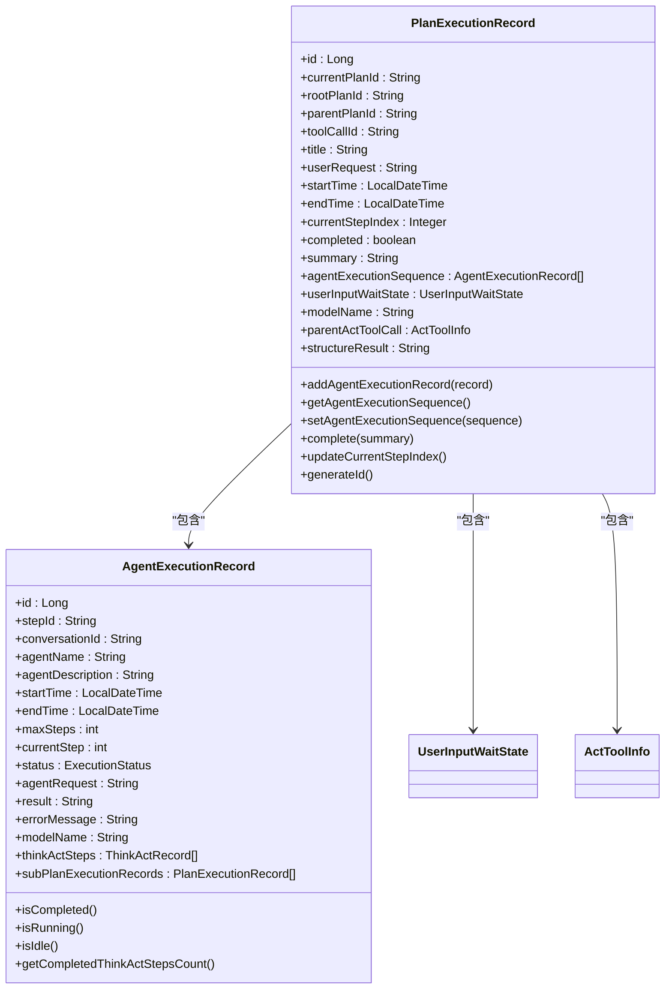
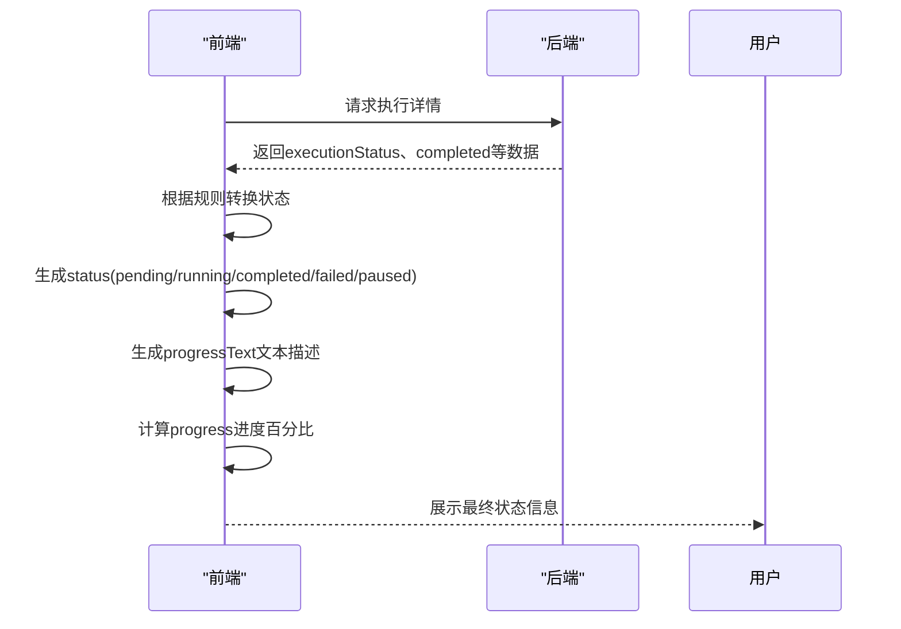
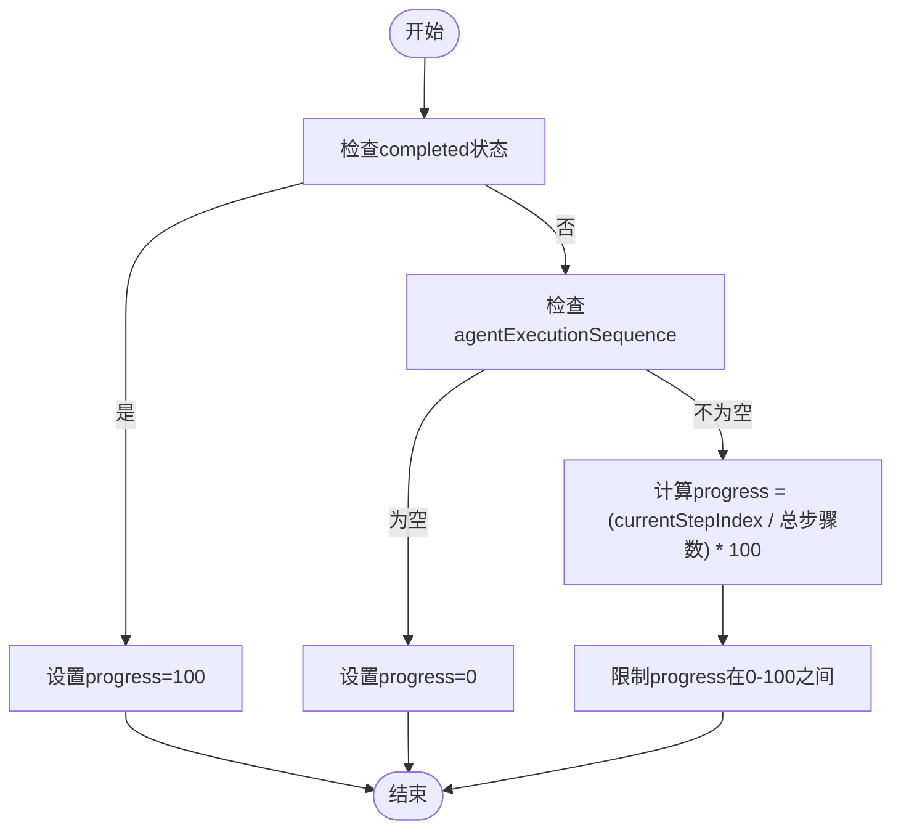

# 计算字段与状态管理

<cite>
**本文档引用的文件**   
- [PlanExecutionRecord.java](file://src/main/java/com/alibaba/cloud/ai/lynxe/recorder/entity/vo/PlanExecutionRecord.java)
- [AgentExecutionRecord.java](file://src/main/java/com/alibaba/cloud/ai/lynxe/recorder/entity/vo/AgentExecutionRecord.java)
- [usePlanExecution.ts](file://ui-vue3/src/composables/usePlanExecution.ts)
- [useRightPanel.ts](file://ui-vue3/src/composables/useRightPanel.ts)
- [plan-execution-record.ts](file://ui-vue3/src/types/plan-execution-record.ts)
- [RightPanel.vue](file://ui-vue3/src/components/right-panel/RightPanel.vue)
- [RecursiveSubPlan.vue](file://ui-vue3/src/components/chat/RecursiveSubPlan.vue)
- [NewRepoPlanExecutionRecorder.java](file://src/main/java/com/alibaba/cloud/ai/lynxe/recorder/service/NewRepoPlanExecutionRecorder.java)
</cite>

## 目录
1. [引言](#引言)
2. [状态字段生成逻辑](#状态字段生成逻辑)
3. [进度计算算法](#进度计算算法)
4. [文本描述生成规则](#文本描述生成规则)
5. [结果展示字段派生](#结果展示字段派生)
6. [核心组件分析](#核心组件分析)

## 引言
本文档详细说明了前端系统中额外添加的计算字段（如status、progress、progressText等）的生成逻辑。这些字段基于后端返回的原始数据进行计算和转换，为用户提供直观的状态展示和进度反馈。文档将深入解析状态转换机制、进度计算算法、文本描述生成规则以及结果展示字段的派生逻辑。

## 状态字段生成逻辑
前端显示状态（pending、running、completed、failed、paused）是根据后端返回的executionStatus、completed等原始数据计算得出的。状态转换逻辑主要在前端组合式函数中实现。

**Section sources**
- [usePlanExecution.ts](file://ui-vue3/src/composables/usePlanExecution.ts#L1-L426)
- [plan-execution-record.ts](file://ui-vue3/src/types/plan-execution-record.ts#L1-L288)

## 进度计算算法
进度百分比progress的计算基于currentStepIndex和总步骤数。系统通过分析执行序列来确定当前进度，当计划完成时进度为100%。

**Section sources**
- [PlanExecutionRecord.java](file://src/main/java/com/alibaba/cloud/ai/lynxe/recorder/entity/vo/PlanExecutionRecord.java#L1-L337)
- [usePlanExecution.ts](file://ui-vue3/src/composables/usePlanExecution.ts#L1-L426)

## 文本描述生成规则
progressText根据当前执行状态生成相应的文本描述。系统通过状态映射将内部状态转换为用户友好的文本信息。

**Section sources**
- [RecursiveSubPlan.vue](file://ui-vue3/src/components/chat/RecursiveSubPlan.vue#L245-L292)
- [RightPanel.vue](file://ui-vue3/src/components/right-panel/RightPanel.vue#L343-L356)

## 结果展示字段派生
result、error、message等展示字段的派生逻辑基于后端返回的执行结果和错误信息。系统会根据执行状态决定显示哪些信息。

**Section sources**
- [AgentExecutionRecord.java](file://src/main/java/com/alibaba/cloud/ai/lynxe/recorder/entity/vo/AgentExecutionRecord.java#L166-L300)
- [NewRepoPlanExecutionRecorder.java](file://src/main/java/com/alibaba/cloud/ai/lynxe/recorder/service/NewRepoPlanExecutionRecorder.java#L260-L302)

## 核心组件分析
### 计划执行记录组件
该组件负责管理计划执行的完整生命周期，包括状态跟踪、进度计算和结果展示。

**Diagram sources **
- [PlanExecutionRecord.java](file://src/main/java/com/alibaba/cloud/ai/lynxe/recorder/entity/vo/PlanExecutionRecord.java#L46-L337)
- [AgentExecutionRecord.java](file://src/main/java/com/alibaba/cloud/ai/lynxe/recorder/entity/vo/AgentExecutionRecord.java#L166-L300)

### 状态管理组件
该组件负责将后端状态转换为前端可识别的状态，并提供相应的文本描述。

**Diagram sources **
- [usePlanExecution.ts](file://ui-vue3/src/composables/usePlanExecution.ts#L1-L426)
- [useRightPanel.ts](file://ui-vue3/src/composables/useRightPanel.ts#L1-L357)

### 进度计算组件
该组件负责根据执行步骤计算进度百分比。

**Diagram sources **
- [PlanExecutionRecord.java](file://src/main/java/com/alibaba/cloud/ai/lynxe/recorder/entity/vo/PlanExecutionRecord.java#L154-L186)
- [usePlanExecution.ts](file://ui-vue3/src/composables/usePlanExecution.ts#L1-L426)