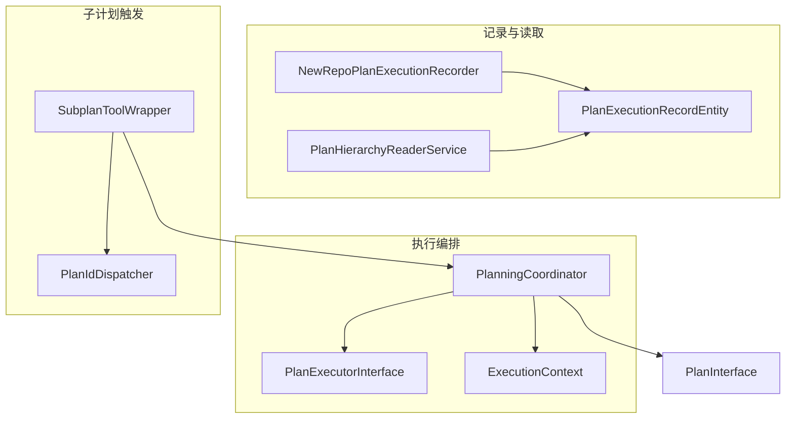
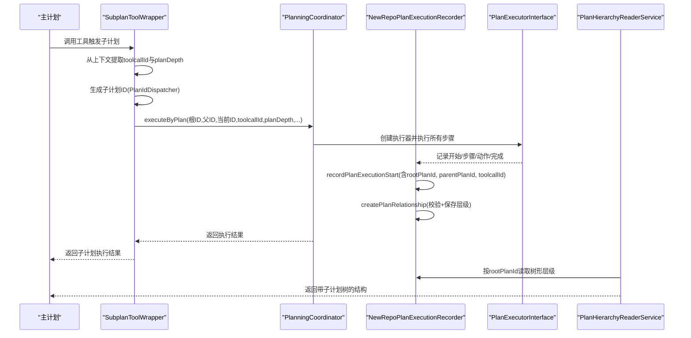
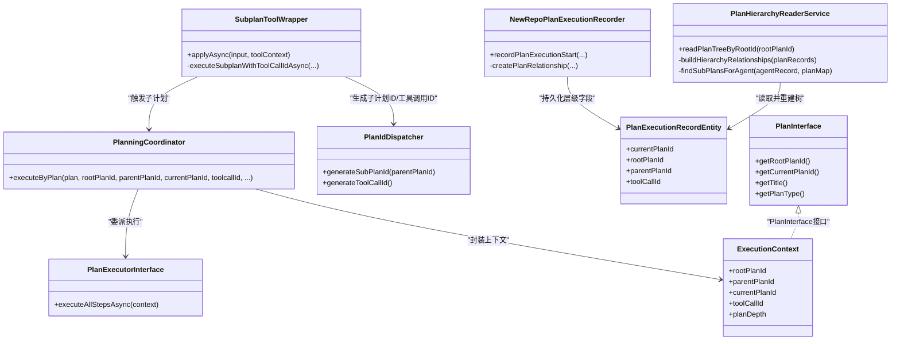
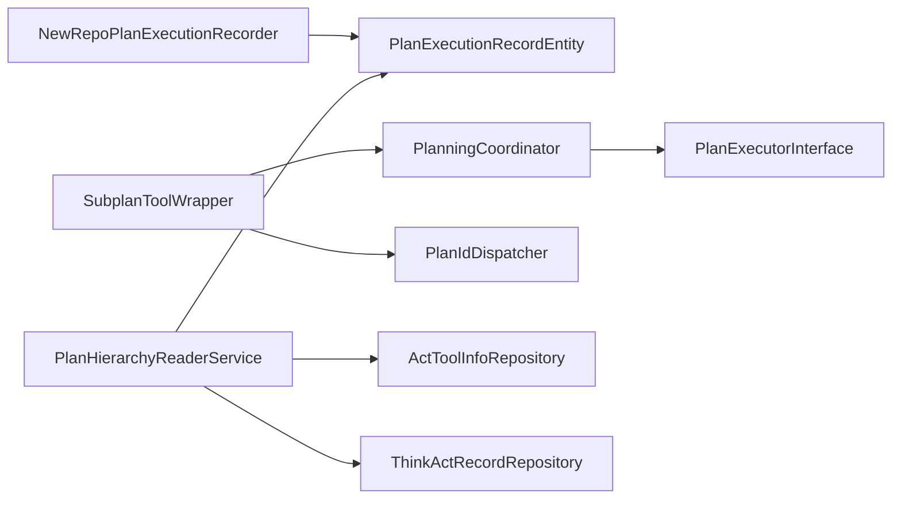

# 层级关系创建

<cite>
**本文引用的文件列表**
- [NewRepoPlanExecutionRecorder.java](file://src/main/java/com/alibaba/cloud/ai/lynxe/recorder/service/NewRepoPlanExecutionRecorder.java)
- [PlanningCoordinator.java](file://src/main/java/com/alibaba/cloud/ai/lynxe/runtime/service/PlanningCoordinator.java)
- [PlanExecutorInterface.java](file://src/main/java/com/alibaba/cloud/ai/lynxe/runtime/executor/PlanExecutorInterface.java)
- [PlanHierarchyReaderService.java](file://src/main/java/com/alibaba/cloud/ai/lynxe/recorder/service/PlanHierarchyReaderService.java)
- [PlanIdDispatcher.java](file://src/main/java/com/alibaba/cloud/ai/lynxe/runtime/service/PlanIdDispatcher.java)
- [SubplanToolWrapper.java](file://src/main/java/com/alibaba/cloud/ai/lynxe/subplan/model/vo/SubplanToolWrapper.java)
- [ExecutionContext.java](file://src/main/java/com/alibaba/cloud/ai/lynxe/runtime/entity/vo/ExecutionContext.java)
- [PlanExecutionRecordEntity.java](file://src/main/java/com/alibaba/cloud/ai/lynxe/recorder/entity/po/PlanExecutionRecordEntity.java)
- [PlanInterface.java](file://src/main/java/com/alibaba/cloud/ai/lynxe/runtime/entity/vo/PlanInterface.java)
</cite>

## 目录
1. [简介](#简介)
2. [项目结构](#项目结构)
3. [核心组件](#核心组件)
4. [架构总览](#架构总览)
5. [详细组件分析](#详细组件分析)
6. [依赖关系分析](#依赖关系分析)
7. [性能考量](#性能考量)
8. [故障排查指南](#故障排查指南)
9. [结论](#结论)

## 简介
本文件围绕“开发计划执行层级关系创建过程”的主题，系统性解析以下关键点：
- 在计划初始化阶段，NewRepoPlanExecutionRecorder 的 createPlanRelationship 方法如何依据执行上下文构建 rootPlanId、parentPlanId 和 toolCallId 的关联关系；
- PlanningCoordinator 在协调主计划与子计划执行时如何维护层级一致性；
- PlanExecutorInterface 在执行过程中如何传递与更新层级信息；
- 从主计划触发到子计划创建的完整流程（含参数传递、ID 生成与状态同步）；
- 异常情况下层级关系的恢复策略。

## 项目结构
本主题涉及的关键模块与文件如下：
- 计划记录与层级：NewRepoPlanExecutionRecorder、PlanHierarchyReaderService、PlanExecutionRecordEntity
- 执行编排：PlanningCoordinator、PlanExecutorInterface、ExecutionContext
- 子计划触发：SubplanToolWrapper、PlanIdDispatcher
- 计划接口模型：PlanInterface

图表来源
- [NewRepoPlanExecutionRecorder.java](file://src/main/java/com/alibaba/cloud/ai/lynxe/recorder/service/NewRepoPlanExecutionRecorder.java#L76-L145)
- [PlanHierarchyReaderService.java](file://src/main/java/com/alibaba/cloud/ai/lynxe/recorder/service/PlanHierarchyReaderService.java#L83-L140)
- [PlanExecutionRecordEntity.java](file://src/main/java/com/alibaba/cloud/ai/lynxe/recorder/entity/po/PlanExecutionRecordEntity.java#L46-L104)
- [PlanningCoordinator.java](file://src/main/java/com/alibaba/cloud/ai/lynxe/runtime/service/PlanningCoordinator.java#L60-L179)
- [PlanExecutorInterface.java](file://src/main/java/com/alibaba/cloud/ai/lynxe/runtime/executor/PlanExecutorInterface.java#L25-L34)
- [SubplanToolWrapper.java](file://src/main/java/com/alibaba/cloud/ai/lynxe/subplan/model/vo/SubplanToolWrapper.java#L339-L350)
- [PlanIdDispatcher.java](file://src/main/java/com/alibaba/cloud/ai/lynxe/runtime/service/PlanIdDispatcher.java#L167-L201)
- [PlanInterface.java](file://src/main/java/com/alibaba/cloud/ai/lynxe/runtime/entity/vo/PlanInterface.java#L35-L83)

章节来源
- [NewRepoPlanExecutionRecorder.java](file://src/main/java/com/alibaba/cloud/ai/lynxe/recorder/service/NewRepoPlanExecutionRecorder.java#L76-L145)
- [PlanHierarchyReaderService.java](file://src/main/java/com/alibaba/cloud/ai/lynxe/recorder/service/PlanHierarchyReaderService.java#L83-L140)
- [PlanningCoordinator.java](file://src/main/java/com/alibaba/cloud/ai/lynxe/runtime/service/PlanningCoordinator.java#L60-L179)
- [PlanExecutorInterface.java](file://src/main/java/com/alibaba/cloud/ai/lynxe/runtime/executor/PlanExecutorInterface.java#L25-L34)
- [SubplanToolWrapper.java](file://src/main/java/com/alibaba/cloud/ai/lynxe/subplan/model/vo/SubplanToolWrapper.java#L339-L350)
- [PlanIdDispatcher.java](file://src/main/java/com/alibaba/cloud/ai/lynxe/runtime/service/PlanIdDispatcher.java#L167-L201)
- [PlanExecutionRecordEntity.java](file://src/main/java/com/alibaba/cloud/ai/lynxe/recorder/entity/po/PlanExecutionRecordEntity.java#L46-L104)
- [PlanInterface.java](file://src/main/java/com/alibaba/cloud/ai/lynxe/runtime/entity/vo/PlanInterface.java#L35-L83)

## 核心组件
- NewRepoPlanExecutionRecorder：负责计划执行记录的创建与层级关系建立；在 recordPlanExecutionStart 中调用 createPlanRelationship 完成 rootPlanId、parentPlanId、toolCallId 的设置与校验。
- PlanningCoordinator：统一入口，接收 rootPlanId、parentPlanId、currentPlanId、toolcallId、planDepth、conversationId 等上下文，构造 ExecutionContext 并委派给 PlanExecutorInterface 执行。
- PlanExecutorInterface：定义执行器接口，PlanExecutorFactory 基于 PlanInterface 动态选择具体执行器。
- PlanHierarchyReaderService：按 rootPlanId 读取树形结构，重建层级关系，用于 UI 或查询展示。
- SubplanToolWrapper：作为工具包装器，从 ToolContext 提取 toolcallId 与 planDepth，生成子计划 ID，并通过 PlanningCoordinator 触发子计划执行。
- PlanIdDispatcher：提供唯一 ID 生成能力，确保子计划 ID 与父计划 ID 不冲突，同时生成 toolCallId、stepId 等。
- PlanExecutionRecordEntity：持久化实体，包含 currentPlanId、rootPlanId、parentPlanId、toolCallId 等层级字段。
- ExecutionContext：执行上下文载体，承载 rootPlanId、parentPlanId、currentPlanId、toolCallId、planDepth、conversationId 等。
- PlanInterface：计划接口，定义 rootPlanId/currentPlanId/title/planType 等通用属性。

章节来源
- [NewRepoPlanExecutionRecorder.java](file://src/main/java/com/alibaba/cloud/ai/lynxe/recorder/service/NewRepoPlanExecutionRecorder.java#L76-L145)
- [PlanningCoordinator.java](file://src/main/java/com/alibaba/cloud/ai/lynxe/runtime/service/PlanningCoordinator.java#L60-L179)
- [PlanExecutorInterface.java](file://src/main/java/com/alibaba/cloud/ai/lynxe/runtime/executor/PlanExecutorInterface.java#L25-L34)
- [PlanHierarchyReaderService.java](file://src/main/java/com/alibaba/cloud/ai/lynxe/recorder/service/PlanHierarchyReaderService.java#L83-L140)
- [SubplanToolWrapper.java](file://src/main/java/com/alibaba/cloud/ai/lynxe/subplan/model/vo/SubplanToolWrapper.java#L339-L350)
- [PlanIdDispatcher.java](file://src/main/java/com/alibaba/cloud/ai/lynxe/runtime/service/PlanIdDispatcher.java#L167-L201)
- [PlanExecutionRecordEntity.java](file://src/main/java/com/alibaba/cloud/ai/lynxe/recorder/entity/po/PlanExecutionRecordEntity.java#L46-L104)
- [ExecutionContext.java](file://src/main/java/com/alibaba/cloud/ai/lynxe/runtime/entity/vo/ExecutionContext.java#L87-L157)
- [PlanInterface.java](file://src/main/java/com/alibaba/cloud/ai/lynxe/runtime/entity/vo/PlanInterface.java#L35-L83)

## 架构总览
下图展示了从主计划触发到子计划创建的端到端流程，涵盖参数传递、ID 生成与状态同步。

图表来源
- [SubplanToolWrapper.java](file://src/main/java/com/alibaba/cloud/ai/lynxe/subplan/model/vo/SubplanToolWrapper.java#L339-L350)
- [PlanningCoordinator.java](file://src/main/java/com/alibaba/cloud/ai/lynxe/runtime/service/PlanningCoordinator.java#L60-L179)
- [NewRepoPlanExecutionRecorder.java](file://src/main/java/com/alibaba/cloud/ai/lynxe/recorder/service/NewRepoPlanExecutionRecorder.java#L76-L145)
- [PlanHierarchyReaderService.java](file://src/main/java/com/alibaba/cloud/ai/lynxe/recorder/service/PlanHierarchyReaderService.java#L83-L140)

## 详细组件分析

### NewRepoPlanExecutionRecorder：层级关系创建与校验
- recordPlanExecutionStart
  - 在创建或更新 PlanExecutionRecordEntity 后，若提供了 rootPlanId，则调用 createPlanRelationship 设置 parentPlanId、rootPlanId、toolCallId，并进行增强校验。
  - 校验规则：
    - 必须提供 currentPlanId 与 rootPlanId；
    - 若提供 parentPlanId，则必须提供 toolcallId；
    - 若提供 parentPlanId，则 rootPlanId 不能等于 currentPlanId；
    - 必须能查到 currentPlanId 对应的记录，否则抛出非法状态异常。
  - 保存成功后记录日志；异常时按类型分类处理并记录错误。

- createPlanRelationship
  - 将传入的 parentPlanId、rootPlanId、toolcallId 写入 PlanExecutionRecordEntity，并持久化保存。
  - 该方法是层级关系建立的核心，确保后续 PlanHierarchyReaderService 能正确重建树形结构。

章节来源
- [NewRepoPlanExecutionRecorder.java](file://src/main/java/com/alibaba/cloud/ai/lynxe/recorder/service/NewRepoPlanExecutionRecorder.java#L76-L145)
- [NewRepoPlanExecutionRecorder.java](file://src/main/java/com/alibaba/cloud/ai/lynxe/recorder/service/NewRepoPlanExecutionRecorder.java#L768-L855)
- [PlanExecutionRecordEntity.java](file://src/main/java/com/alibaba/cloud/ai/lynxe/recorder/entity/po/PlanExecutionRecordEntity.java#L46-L104)

### PlanningCoordinator：层级一致性与上下文传递
- executeByPlan
  - 接收 rootPlanId、parentPlanId、currentPlanId、toolcallId、planDepth、conversationId 等参数；
  - 构造 ExecutionContext，设置 needSummary、conversationId、useConversation、toolCallId、parentPlanId、planDepth 等；
  - 通过 PlanExecutorFactory 创建执行器并异步执行，最终由 PlanFinalizer 进行后处理；
  - 该方法保证了层级信息在执行链路中的贯穿。

- 与 PlanExecutorInterface 的交互
  - 通过接口抽象，不同类型的计划可由工厂选择合适的执行器，但上下文中的 rootPlanId、parentPlanId、currentPlanId、toolCallId、planDepth 等始终一致。

章节来源
- [PlanningCoordinator.java](file://src/main/java/com/alibaba/cloud/ai/lynxe/runtime/service/PlanningCoordinator.java#L60-L179)
- [PlanExecutorInterface.java](file://src/main/java/com/alibaba/cloud/ai/lynxe/runtime/executor/PlanExecutorInterface.java#L25-L34)
- [ExecutionContext.java](file://src/main/java/com/alibaba/cloud/ai/lynxe/runtime/entity/vo/ExecutionContext.java#L87-L157)

### PlanHierarchyReaderService：层级重建与查询
- readPlanTreeByRootId
  - 以 rootPlanId 为键读取所有子计划，转换为 VO 对象；
  - 调用 buildHierarchyRelationships，基于每个计划的 agentExecutionSequence 与 toolCallId 关联子计划，形成树形结构；
  - findSubPlansForAgent 通过 ActToolInfo 与 ThinkActRecord 的 parentExecutionId 关联，确保父子关系准确映射。

- 数据模型要点
  - 根计划：currentPlanId = rootPlanId；
  - 子计划：currentPlanId ≠ rootPlanId，但 rootPlanId 字段指向根计划；
  - toolCallId 仅在子计划上存在，用于回溯触发来源。

章节来源
- [PlanHierarchyReaderService.java](file://src/main/java/com/alibaba/cloud/ai/lynxe/recorder/service/PlanHierarchyReaderService.java#L83-L140)
- [PlanHierarchyReaderService.java](file://src/main/java/com/alibaba/cloud/ai/lynxe/recorder/service/PlanHierarchyReaderService.java#L323-L391)

### SubplanToolWrapper：子计划触发与 ID 生成
- 从 ToolContext 提取 toolcallId 与 planDepth；
- 使用 PlanIdDispatcher.generateSubPlanId 生成子计划 ID，确保与父 ID 不同；
- 通过 PlanningCoordinator.executeByPlan 以 HTTP_REQUEST 方式触发子计划执行，传入 rootPlanId、parentPlanId、currentPlanId、toolcallId、planDepth；
- 子计划执行完成后返回结果。

章节来源
- [SubplanToolWrapper.java](file://src/main/java/com/alibaba/cloud/ai/lynxe/subplan/model/vo/SubplanToolWrapper.java#L339-L350)
- [PlanIdDispatcher.java](file://src/main/java/com/alibaba/cloud/ai/lynxe/runtime/service/PlanIdDispatcher.java#L167-L201)

### PlanIdDispatcher：ID 生成与去重
- generateSubPlanId：使用前缀、纳秒时间戳、随机数与父 ID 哈希组合，保证子计划 ID 与父 ID 绝对不相同；
- generateToolCallId：使用前缀、毫秒时间戳、随机数与线程 ID 组合，确保工具调用 ID 唯一；
- generateStepId/generateThinkActId/generateParallelExecutionId：分别用于步骤、思考-行动周期与并行执行批次的唯一标识生成。

章节来源
- [PlanIdDispatcher.java](file://src/main/java/com/alibaba/cloud/ai/lynxe/runtime/service/PlanIdDispatcher.java#L167-L201)
- [PlanIdDispatcher.java](file://src/main/java/com/alibaba/cloud/ai/lynxe/runtime/service/PlanIdDispatcher.java#L199-L217)
- [PlanIdDispatcher.java](file://src/main/java/com/alibaba/cloud/ai/lynxe/runtime/service/PlanIdDispatcher.java#L223-L265)

### 类关系图（代码级）

图表来源
- [NewRepoPlanExecutionRecorder.java](file://src/main/java/com/alibaba/cloud/ai/lynxe/recorder/service/NewRepoPlanExecutionRecorder.java#L76-L145)
- [PlanHierarchyReaderService.java](file://src/main/java/com/alibaba/cloud/ai/lynxe/recorder/service/PlanHierarchyReaderService.java#L83-L140)
- [PlanningCoordinator.java](file://src/main/java/com/alibaba/cloud/ai/lynxe/runtime/service/PlanningCoordinator.java#L60-L179)
- [PlanExecutorInterface.java](file://src/main/java/com/alibaba/cloud/ai/lynxe/runtime/executor/PlanExecutorInterface.java#L25-L34)
- [SubplanToolWrapper.java](file://src/main/java/com/alibaba/cloud/ai/lynxe/subplan/model/vo/SubplanToolWrapper.java#L339-L350)
- [PlanIdDispatcher.java](file://src/main/java/com/alibaba/cloud/ai/lynxe/runtime/service/PlanIdDispatcher.java#L167-L201)
- [PlanExecutionRecordEntity.java](file://src/main/java/com/alibaba/cloud/ai/lynxe/recorder/entity/po/PlanExecutionRecordEntity.java#L46-L104)
- [ExecutionContext.java](file://src/main/java/com/alibaba/cloud/ai/lynxe/runtime/entity/vo/ExecutionContext.java#L87-L157)
- [PlanInterface.java](file://src/main/java/com/alibaba/cloud/ai/lynxe/runtime/entity/vo/PlanInterface.java#L35-L83)

## 依赖关系分析
- 组件耦合
  - NewRepoPlanExecutionRecorder 与 PlanExecutionRecordEntity 强耦合，负责写入层级字段；
  - PlanningCoordinator 与 PlanExecutorInterface 解耦，通过工厂模式选择执行器；
  - SubplanToolWrapper 依赖 PlanIdDispatcher 与 PlanningCoordinator，负责子计划触发；
  - PlanHierarchyReaderService 依赖 ActToolInfoRepository 与 ThinkActRecordRepository，通过 toolCallId 与 parentExecutionId 建立父子映射。

- 可能的循环依赖
  - 当前未发现直接循环依赖；各模块职责清晰，通过接口与工厂解耦。

- 外部依赖与集成点
  - 数据层：PlanExecutionRecordRepository、AgentExecutionRecordRepository、ActToolInfoRepository、ThinkActRecordRepository；
  - 工具调用 ID 生成：PlanIdDispatcher；
  - 执行器工厂：PlanExecutorFactory（在 PlanningCoordinator 中使用）。

图表来源
- [NewRepoPlanExecutionRecorder.java](file://src/main/java/com/alibaba/cloud/ai/lynxe/recorder/service/NewRepoPlanExecutionRecorder.java#L76-L145)
- [PlanHierarchyReaderService.java](file://src/main/java/com/alibaba/cloud/ai/lynxe/recorder/service/PlanHierarchyReaderService.java#L83-L140)
- [PlanningCoordinator.java](file://src/main/java/com/alibaba/cloud/ai/lynxe/runtime/service/PlanningCoordinator.java#L60-L179)
- [SubplanToolWrapper.java](file://src/main/java/com/alibaba/cloud/ai/lynxe/subplan/model/vo/SubplanToolWrapper.java#L339-L350)
- [PlanIdDispatcher.java](file://src/main/java/com/alibaba/cloud/ai/lynxe/runtime/service/PlanIdDispatcher.java#L167-L201)

## 性能考量
- 记录与保存
  - recordPlanExecutionStart 采用事务包裹，保存 PlanExecutionRecordEntity 后再建立层级关系，避免中间状态不一致；
  - createPlanRelationship 仅做一次保存，复杂度 O(1)，数据库层面通过索引 currentPlanId 与 rootPlanId 查询。
- 层级重建
  - PlanHierarchyReaderService 在读取时先按 rootPlanId 获取全量计划，再通过工具调用 ID 与父执行 ID 关联，整体复杂度与子计划数量线性相关；
  - findSubPlansForAgent 通过 ActToolInfoRepository 与 ThinkActRecordRepository 的查询，建议在数据库侧为 tool_call_id、parent_execution_id 建立索引以提升性能。
- 并行与异步
  - PlanningCoordinator 通过 CompletableFuture 异步执行，避免阻塞主线程；
  - SubplanToolWrapper 在工具层也采用异步执行，减少等待时间。

[本节为通用指导，无需列出具体文件来源]

## 故障排查指南
- 层级关系创建失败
  - 现象：createPlanRelationship 抛出非法参数或非法状态异常；
  - 排查要点：
    - 是否提供了 rootPlanId；
    - 若提供 parentPlanId，是否同时提供了 toolcallId；
    - rootPlanId 与 currentPlanId 是否相等（不允许）；
    - currentPlanId 对应记录是否存在。
  - 参考路径：
    - [NewRepoPlanExecutionRecorder.java](file://src/main/java/com/alibaba/cloud/ai/lynxe/recorder/service/NewRepoPlanExecutionRecorder.java#L768-L855)

- 子计划无法关联到父计划
  - 现象：PlanHierarchyReaderService 无法找到子计划；
  - 排查要点：
    - 子计划是否设置了 toolCallId；
    - ActToolInfoRepository 是否存在对应 toolCallId；
    - ThinkActRecordRepository 的 parentExecutionId 是否与父计划的 AgentExecutionRecord.id 匹配。
  - 参考路径：
    - [PlanHierarchyReaderService.java](file://src/main/java/com/alibaba/cloud/ai/lynxe/recorder/service/PlanHierarchyReaderService.java#L366-L449)

- 子计划 ID 冲突或重复
  - 现象：子计划 ID 与父计划 ID 相同；
  - 排查要点：
    - 是否使用 PlanIdDispatcher.generateSubPlanId 生成子计划 ID；
    - 生成逻辑是否包含父 ID 哈希与前缀差异。
  - 参考路径：
    - [PlanIdDispatcher.java](file://src/main/java/com/alibaba/cloud/ai/lynxe/runtime/service/PlanIdDispatcher.java#L167-L201)

- 工具调用 ID 丢失
  - 现象：子计划未携带 toolcallId；
  - 排查要点：
    - SubplanToolWrapper 是否从 ToolContext 正确提取 toolcallId；
    - 是否在 executeByPlan 中传入 toolcallId。
  - 参考路径：
    - [SubplanToolWrapper.java](file://src/main/java/com/alibaba/cloud/ai/lynxe/subplan/model/vo/SubplanToolWrapper.java#L339-L350)
    - [PlanningCoordinator.java](file://src/main/java/com/alibaba/cloud/ai/lynxe/runtime/service/PlanningCoordinator.java#L60-L179)

## 结论
- NewRepoPlanExecutionRecorder 的 createPlanRelationship 是层级关系建立的核心，通过严格的校验与持久化，确保 rootPlanId、parentPlanId、toolCallId 的一致性；
- PlanningCoordinator 通过 ExecutionContext 统一传递层级信息，PlanExecutorInterface 保持执行器的可替换性；
- SubplanToolWrapper 与 PlanIdDispatcher 协作，保障子计划 ID 与工具调用 ID 的唯一性与可追踪性；
- PlanHierarchyReaderService 利用工具调用 ID 与父执行 ID 的关联，重建完整的树形层级结构；
- 在异常场景下，通过明确的异常类型与日志输出，便于定位问题并恢复。