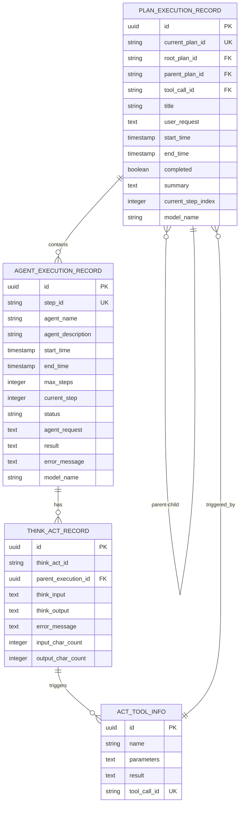

# 层级关系定义

<cite>
**本文档引用的文件**   
- [PlanExecutionRecordEntity.java](file://src/main/java/com/alibaba/cloud/ai/lynxe/recorder/entity/po/PlanExecutionRecordEntity.java)
- [PlanExecutionRecorder.java](file://src/main/java/com/alibaba/cloud/ai/lynxe/recorder/service/PlanExecutionRecorder.java)
- [NewRepoPlanExecutionRecorder.java](file://src/main/java/com/alibaba/cloud/ai/lynxe/recorder/service/NewRepoPlanExecutionRecorder.java)
- [PlanHierarchyReaderService.java](file://src/main/java/com/alibaba/cloud/ai/lynxe/recorder/service/PlanHierarchyReaderService.java)
- [ActToolInfoEntity.java](file://src/main/java/com/alibaba/cloud/ai/lynxe/recorder/entity/po/ActToolInfoEntity.java)
- [ThinkActRecordEntity.java](file://src/main/java/com/alibaba/cloud/ai/lynxe/recorder/entity/po/ThinkActRecordEntity.java)
- [ExecutionContext.java](file://src/main/java/com/alibaba/cloud/ai/lynxe/runtime/entity/vo/ExecutionContext.java)
- [ParallelToolExecutionService.java](file://src/main/java/com/alibaba/cloud/ai/lynxe/runtime/service/ParallelToolExecutionService.java)
</cite>

## 目录
1. [引言](#引言)
2. [核心字段设计目的与语义含义](#核心字段设计目的与语义含义)
3. [分布式执行环境下的唯一性保证机制](#分布式执行环境下的唯一性保证机制)
4. [跨服务调用和异步执行场景中的传递方式](#跨服务调用和异步执行场景中的传递方式)
5. [实体关系图（ER图）](#实体关系图（er图）)
6. [典型场景示例数据](#典型场景示例数据)
7. [结论](#结论)

## 引言

在复杂的计划执行系统中，准确追踪和管理执行过程的层级关系至关重要。本系统通过`PlanExecutionRecordEntity`实体中的`rootPlanId`、`parentPlanId`和`toolCallId`三个核心字段，构建了一个清晰的执行树结构。这些字段不仅定义了计划间的父子关系，还精确地追踪了工具调用链路，为整个执行流程提供了完整的上下文信息。本文档将详细阐述这三个字段的设计原理、语义含义及其在分布式环境下的应用机制。

**Section sources**
- [PlanExecutionRecordEntity.java](file://src/main/java/com/alibaba/cloud/ai/lynxe/recorder/entity/po/PlanExecutionRecordEntity.java)

## 核心字段设计目的与语义含义

### rootPlanId：标识执行树的根节点

`rootPlanId`字段用于标识整个计划执行树的根节点。无论执行流程如何分支或嵌套，所有相关的子计划都共享同一个`rootPlanId`。这使得系统能够将分散的执行记录重新聚合，形成一个完整的执行视图。

- **设计目的**：提供一个全局唯一的标识符，用于追踪从最初用户请求开始的整个执行生命周期。
- **语义含义**：当一个计划是顶层计划时，其`currentPlanId`与`rootPlanId`相等。对于任何子计划，`rootPlanId`始终指向最初发起的根计划ID，从而建立从任意节点回溯到根节点的路径。

### parentPlanId：建立父子计划间的层级关系

`parentPlanId`字段用于建立计划之间的直接父子关系。它明确指出了当前计划是由哪个父计划触发的，从而构建了执行树的层级结构。

- **设计目的**：维护计划执行的直接调用链，清晰地表达哪个计划是哪个计划的“子任务”。
- **语义含义**：如果`parentPlanId`为空，则表示该计划是根计划。否则，它指向直接创建或触发当前计划的那个父计划的`currentPlanId`。

### toolCallId：追踪工具调用链路

`toolCallId`字段用于追踪触发子计划的具体工具调用。当一个计划中的智能体（Agent）决定调用一个工具来完成任务时，该工具调用会被分配一个唯一的`toolCallId`。如果该工具调用本身又启动了一个新的子计划，那么这个子计划的`toolCallId`将被设置为触发它的那个工具调用的ID。

- **设计目的**：建立从子计划到其触发源（即具体的工具调用）的精确链接，实现执行链路的可追溯性。
- **语义含义**：`toolCallId`是连接`PlanExecutionRecordEntity`与`ActToolInfoEntity`的关键。通过这个ID，可以查询到是哪个工具、使用了什么参数、产生了什么结果，最终导致了子计划的产生。

**Section sources**
- [PlanExecutionRecordEntity.java](file://src/main/java/com/alibaba/cloud/ai/lynxe/recorder/entity/po/PlanExecutionRecordEntity.java)
- [ActToolInfoEntity.java](file://src/main/java/com/alibaba/cloud/ai/lynxe/recorder/entity/po/ActToolInfoEntity.java)
- [ThinkActRecordEntity.java](file://src/main/java/com/alibaba/cloud/ai/lynxe/recorder/entity/po/ThinkActRecordEntity.java)

## 分布式执行环境下的唯一性保证机制

在分布式执行环境中，确保`currentPlanId`、`parentPlanId`、`rootPlanId`和`toolCallId`的全局唯一性是维护执行树完整性的基础。

- **ID生成策略**：系统使用`PlanIdDispatcher`服务来生成唯一的ID。该服务结合了时间戳、随机数以及可能的机器标识符，确保在分布式节点上生成的ID不会发生冲突。
- **数据库约束**：在`PlanExecutionRecordEntity`中，`currentPlanId`被定义为数据库级别的唯一约束（`@Column(unique = true)`），这从数据持久层防止了重复计划ID的插入。
- **执行上下文传递**：在计划启动时，`ExecutionContext`对象会携带`currentPlanId`、`rootPlanId`、`parentPlanId`和`toolCallId`。这些信息在跨服务调用时作为上下文的一部分被传递，确保了在整个分布式流程中，层级关系信息的一致性和完整性。

**Section sources**
- [PlanExecutionRecordEntity.java](file://src/main/java/com/alibaba/cloud/ai/lynxe/recorder/entity/po/PlanExecutionRecordEntity.java)
- [ExecutionContext.java](file://src/main/java/com/alibaba/cloud/ai/lynxe/runtime/entity/vo/ExecutionContext.java)

## 跨服务调用和异步执行场景中的传递方式

在跨服务调用和异步执行的复杂场景下，层级关系字段的传递依赖于精心设计的上下文传播机制。

- **跨服务调用**：当一个服务需要调用另一个服务来启动子计划时，它会将`rootPlanId`、`parentPlanId`和`toolCallId`作为请求参数的一部分传递。接收服务在创建新的`PlanExecutionRecordEntity`时，会直接使用这些传入的值，从而无缝地延续执行树的结构。
- **异步执行**：在异步执行场景中（如并行工具调用），`ParallelToolExecutionService`在启动每个工具时，会从父级的`ToolContext`中提取`toolCallId`和`planDepth`。如果父级提供了`toolCallId`，则子任务会继承该ID；否则，会生成一个新的ID。这确保了即使在并行分支中，也能正确地建立与父级的关联。
- **上下文对象**：`ExecutionContext`和`ToolContext`是传递这些关键信息的核心载体。它们作为参数在各个服务和方法间流动，保证了执行上下文的连续性。

**Section sources**
- [ExecutionContext.java](file://src/main/java/com/alibaba/cloud/ai/lynxe/runtime/entity/vo/ExecutionContext.java)
- [ParallelToolExecutionService.java](file://src/main/java/com/alibaba/cloud/ai/lynxe/runtime/service/ParallelToolExecutionService.java)

## 实体关系图（ER图）



**Diagram sources **
- [PlanExecutionRecordEntity.java](file://src/main/java/com/alibaba/cloud/ai/lynxe/recorder/entity/po/PlanExecutionRecordEntity.java)
- [AgentExecutionRecordEntity.java](file://src/main/java/com/alibaba/cloud/ai/lynxe/recorder/entity/po/AgentExecutionRecordEntity.java)
- [ThinkActRecordEntity.java](file://src/main/java/com/alibaba/cloud/ai/lynxe/recorder/entity/po/ThinkActRecordEntity.java)
- [ActToolInfoEntity.java](file://src/main/java/com/alibaba/cloud/ai/lynxe/recorder/entity/po/ActToolInfoEntity.java)

## 典型场景示例数据

以下是一个典型的计划执行场景的示例数据，展示了各字段的值如何反映执行层级。

### 根计划执行记录
```json
{
  "currentPlanId": "plan-root-123",
  "rootPlanId": "plan-root-123",
  "parentPlanId": null,
  "toolCallId": null,
  "title": "生成市场分析报告",
  "userRequest": "请分析Q4市场趋势并生成报告。",
  "startTime": "2025-04-01T10:00:00Z",
  "completed": false
}
```

### 子计划执行记录（由工具调用触发）
```json
{
  "currentPlanId": "plan-sub-456",
  "rootPlanId": "plan-root-123",
  "parentPlanId": "plan-root-123",
  "toolCallId": "call-websearch-789",
  "title": "搜索Q4市场数据",
  "userRequest": "搜索2025年第四季度的市场趋势数据。",
  "startTime": "2025-04-01T10:05:00Z",
  "completed": true
}
```

**说明**：
- 两个计划共享相同的`rootPlanId` (`plan-root-123`)，表明它们属于同一个执行树。
- 子计划的`parentPlanId`指向根计划的`currentPlanId`，建立了直接的父子关系。
- 子计划的`toolCallId` (`call-websearch-789`) 指明了是哪个工具调用导致了它的创建。

**Section sources**
- [PlanExecutionRecordEntity.java](file://src/main/java/com/alibaba/cloud/ai/lynxe/recorder/entity/po/PlanExecutionRecordEntity.java)

## 结论

`rootPlanId`、`parentPlanId`和`toolCallId`这三个字段共同构成了一个强大而灵活的执行层级追踪系统。`rootPlanId`提供了全局的执行上下文，`parentPlanId`定义了直接的父子依赖，而`toolCallId`则精确地记录了执行的触发源。通过在分布式环境中利用上下文对象进行传递，并结合数据库约束和唯一ID生成策略，系统能够可靠地维护复杂的执行树结构。这种设计不仅支持了对执行流程的深度分析和调试，也为用户提供了清晰的执行路径可视化，是整个计划执行系统可观察性和可靠性的基石。