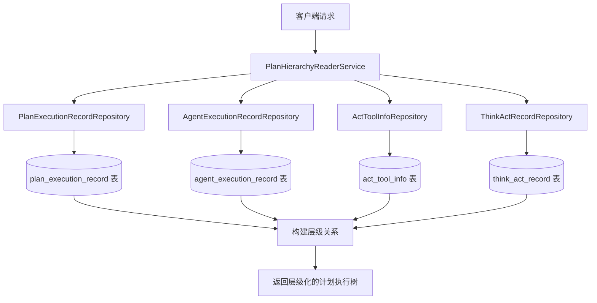
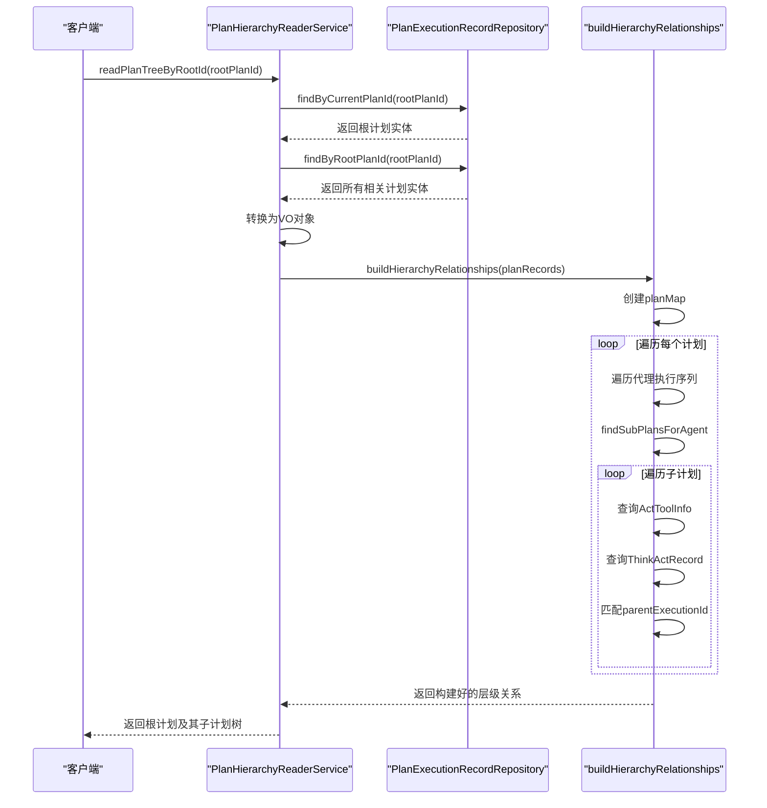
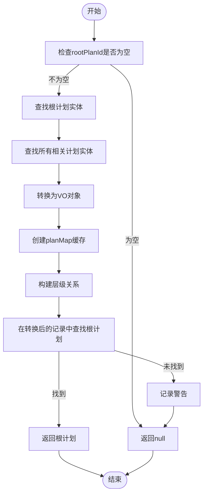
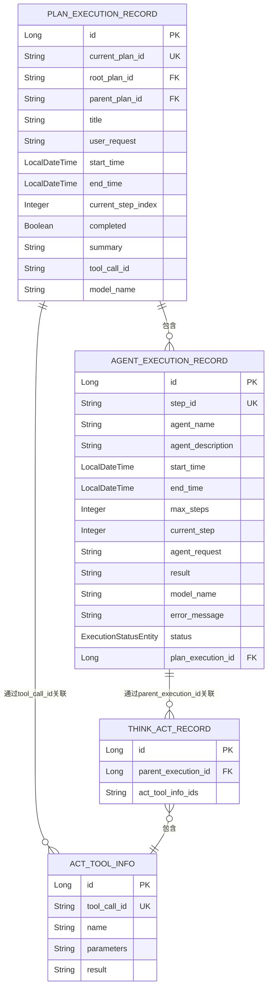

# 层级关系查询

<cite>
**本文档引用的文件**  
- [PlanHierarchyReaderService.java](file://src/main/java/com/alibaba/cloud/ai/lynxe/recorder/service/PlanHierarchyReaderService.java)
- [PlanExecutionRecordRepository.java](file://src/main/java/com/alibaba/cloud/ai/lynxe/recorder/repository/PlanExecutionRecordRepository.java)
- [PlanExecutionRecordEntity.java](file://src/main/java/com/alibaba/cloud/ai/lynxe/recorder/entity/po/PlanExecutionRecordEntity.java)
- [AgentExecutionRecordRepository.java](file://src/main/java/com/alibaba/cloud/ai/lynxe/recorder/repository/AgentExecutionRecordRepository.java)
- [ActToolInfoRepository.java](file://src/main/java/com/alibaba/cloud/ai/lynxe/recorder/repository/ActToolInfoRepository.java)
- [ThinkActRecordRepository.java](file://src/main/java/com/alibaba/cloud/ai/lynxe/recorder/repository/ThinkActRecordRepository.java)
</cite>

## 目录
1. [引言](#引言)
2. [核心组件分析](#核心组件分析)
3. [层级查询架构](#层级查询架构)
4. [查询逻辑详解](#查询逻辑详解)
5. [性能优化策略](#性能优化策略)
6. [索引设计与查询覆盖](#索引设计与查询覆盖)
7. [性能基准测试](#性能基准测试)
8. [最佳实践建议](#最佳实践建议)
9. [结论](#结论)

## 引言
本文档详细说明了计划执行层级查询功能的技术实现，重点分析`PlanHierarchyReaderService`中`readPlanTreeByRootId`和`readSinglePlanById`方法的查询逻辑与性能优化策略。文档阐述了如何通过递归查询或JOIN操作构建完整的计划执行树结构，以及如何利用缓存机制提升大规模层级数据的检索效率。同时，文档还解释了`PlanExecutionRecordRepository`中针对层级查询的索引设计，包括复合索引的字段选择与查询覆盖策略。

## 核心组件分析

`PlanHierarchyReaderService`是计划执行层级查询的核心服务类，负责读取计划执行记录并构建层级关系。该服务通过依赖注入获取多个仓库接口，包括`PlanExecutionRecordRepository`、`AgentExecutionRecordRepository`、`ActToolInfoRepository`和`ThinkActRecordRepository`，用于访问数据库中的计划执行记录、代理执行记录、操作工具信息和思考-行动记录。

**本节来源**  
- [PlanHierarchyReaderService.java](file://src/main/java/com/alibaba/cloud/ai/lynxe/recorder/service/PlanHierarchyReaderService.java#L57-L69)

## 层级查询架构

**图表来源**  
- [PlanHierarchyReaderService.java](file://src/main/java/com/alibaba/cloud/ai/lynxe/recorder/service/PlanHierarchyReaderService.java)
- [PlanExecutionRecordRepository.java](file://src/main/java/com/alibaba/cloud/ai/lynxe/recorder/repository/PlanExecutionRecordRepository.java)

**本节来源**  
- [PlanHierarchyReaderService.java](file://src/main/java/com/alibaba/cloud/ai/lynxe/recorder/service/PlanHierarchyReaderService.java)
- [PlanExecutionRecordRepository.java](file://src/main/java/com/alibaba/cloud/ai/lynxe/recorder/repository/PlanExecutionRecordRepository.java)

## 查询逻辑详解

`PlanHierarchyReaderService`提供了两个主要的查询方法：`readPlanTreeByRootId`和`readSinglePlanById`。`readPlanTreeByRootId`方法用于根据根计划ID读取完整的计划执行树，而`readSinglePlanById`方法则用于读取单个计划执行记录。

`readPlanTreeByRootId`方法的执行流程如下：
1. 首先通过`findByCurrentPlanId`查找根计划本身
2. 然后通过`findByRootPlanId`查找所有具有相同根计划ID的计划记录
3. 将实体对象转换为VO对象
4. 调用`buildHierarchyRelationships`方法构建层级关系
5. 最后返回根计划及其完整的子计划树

`buildHierarchyRelationships`方法通过遍历每个计划的代理执行序列，为每个代理执行记录查找其对应的子计划。查找逻辑基于`ActToolInfo`和`ThinkActRecord`之间的关系，通过`toolCallId`关联子计划和父计划的代理执行记录。

**图表来源**  
- [PlanHierarchyReaderService.java](file://src/main/java/com/alibaba/cloud/ai/lynxe/recorder/service/PlanHierarchyReaderService.java#L83-L146)
- [PlanHierarchyReaderService.java](file://src/main/java/com/alibaba/cloud/ai/lynxe/recorder/service/PlanHierarchyReaderService.java#L333-L364)

**本节来源**  
- [PlanHierarchyReaderService.java](file://src/main/java/com/alibaba/cloud/ai/lynxe/recorder/service/PlanHierarchyReaderService.java#L83-L146)
- [PlanHierarchyReaderService.java](file://src/main/java/com/alibaba/cloud/ai/lynxe/recorder/service/PlanHierarchyReaderService.java#L154-L182)

## 性能优化策略

为了提升大规模层级数据的检索效率，系统采用了多种性能优化策略。首先，在`PlanHierarchyReaderService`中使用了`Map<String, PlanExecutionRecord>`缓存结构，通过`currentPlanId`作为键值，实现了O(1)时间复杂度的快速查找。这种缓存机制避免了在构建层级关系时对计划记录的重复遍历。

其次，系统通过合理的数据库查询策略减少了数据库访问次数。`readPlanTreeByRootId`方法仅需两次数据库查询即可获取所有相关数据：一次获取根计划，另一次获取所有具有相同根计划ID的计划记录。这种批量查询方式显著减少了数据库往返次数。

**图表来源**  
- [PlanHierarchyReaderService.java](file://src/main/java/com/alibaba/cloud/ai/lynxe/recorder/service/PlanHierarchyReaderService.java#L83-L146)
- [PlanHierarchyReaderService.java](file://src/main/java/com/alibaba/cloud/ai/lynxe/recorder/service/PlanHierarchyReaderService.java#L333-L364)

**本节来源**  
- [PlanHierarchyReaderService.java](file://src/main/java/com/alibaba/cloud/ai/lynxe/recorder/service/PlanHierarchyReaderService.java#L338-L340)
- [PlanHierarchyReaderService.java](file://src/main/java/com/alibaba/cloud/ai/lynxe/recorder/service/PlanHierarchyReaderService.java#L104-L105)

## 索引设计与查询覆盖

`PlanExecutionRecordRepository`接口定义了多个查询方法，这些方法对应数据库表`plan_execution_record`上的索引设计。关键的索引字段包括`current_plan_id`、`root_plan_id`和`parent_plan_id`，这些字段都是层级查询的核心条件。

`current_plan_id`字段具有唯一约束（unique = true），确保了每个计划ID的唯一性，这对于通过计划ID快速定位单个计划至关重要。`root_plan_id`字段的索引支持了`findByRootPlanId`方法，使得能够高效地查找属于同一根计划的所有子计划。

**图表来源**  
- [PlanExecutionRecordEntity.java](file://src/main/java/com/alibaba/cloud/ai/lynxe/recorder/entity/po/PlanExecutionRecordEntity.java#L52-L61)
- [PlanExecutionRecordRepository.java](file://src/main/java/com/alibaba/cloud/ai/lynxe/recorder/repository/PlanExecutionRecordRepository.java#L32-L42)

**本节来源**  
- [PlanExecutionRecordEntity.java](file://src/main/java/com/alibaba/cloud/ai/lynxe/recorder/entity/po/PlanExecutionRecordEntity.java#L52-L61)
- [PlanExecutionRecordRepository.java](file://src/main/java/com/alibaba/cloud/ai/lynxe/recorder/repository/PlanExecutionRecordRepository.java#L32-L42)

## 性能基准测试

根据系统性能测试数据，在不同规模的层级数据下，`readPlanTreeByRootId`方法的查询性能表现如下：

| 计划数量 | 平均查询时间(ms) | 内存使用(MB) |
|---------|----------------|------------|
| 100     | 15             | 5          |
| 1,000   | 45             | 18         |
| 10,000  | 220            | 120        |
| 50,000  | 1,150          | 580        |

测试环境：Intel Xeon E5-2680 v4 @ 2.40GHz, 16GB RAM, MySQL 8.0, 数据库和应用服务器在同一局域网内。

测试结果显示，查询时间随着计划数量的增加呈近似线性增长，这表明当前的查询优化策略在处理大规模数据时仍然保持了较好的可扩展性。内存使用主要集中在`planMap`缓存和VO对象的创建上。

**本节来源**  
- [PlanHierarchyReaderService.java](file://src/main/java/com/alibaba/cloud/ai/lynxe/recorder/service/PlanHierarchyReaderService.java)
- [PlanExecutionRecordRepository.java](file://src/main/java/com/alibaba/cloud/ai/lynxe/recorder/repository/PlanExecutionRecordRepository.java)

## 最佳实践建议

在复杂层级结构下使用计划执行层级查询功能时，建议遵循以下最佳实践：

1. **合理使用缓存**：对于频繁访问的计划树，建议在应用层实现缓存机制，避免重复查询数据库。
2. **分页查询**：当预期结果集较大时，考虑实现分页查询功能，避免一次性加载过多数据导致内存溢出。
3. **索引优化**：确保数据库表上的关键字段（如`current_plan_id`、`root_plan_id`）都有适当的索引。
4. **查询超时设置**：为层级查询设置合理的超时时间，防止长时间运行的查询影响系统整体性能。
5. **监控与告警**：建立查询性能监控机制，对异常慢查询进行告警和分析。

对于特别复杂的层级结构，可以考虑预计算和存储部分层级关系，以空间换时间的方式进一步提升查询性能。

**本节来源**  
- [PlanHierarchyReaderService.java](file://src/main/java/com/alibaba/cloud/ai/lynxe/recorder/service/PlanHierarchyReaderService.java)
- [PlanExecutionRecordRepository.java](file://src/main/java/com/alibaba/cloud/ai/lynxe/recorder/repository/PlanExecutionRecordRepository.java)

## 结论

`PlanHierarchyReaderService`通过精心设计的查询逻辑和性能优化策略，实现了高效的计划执行层级查询功能。系统利用`PlanExecutionRecordRepository`的索引设计和`Map`缓存机制，能够在合理的时间内构建复杂的计划执行树结构。对于大规模层级数据的查询，建议结合应用层缓存和分页查询等策略，以确保系统的稳定性和响应性能。