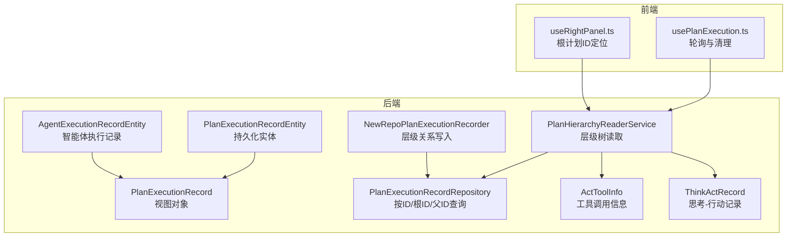
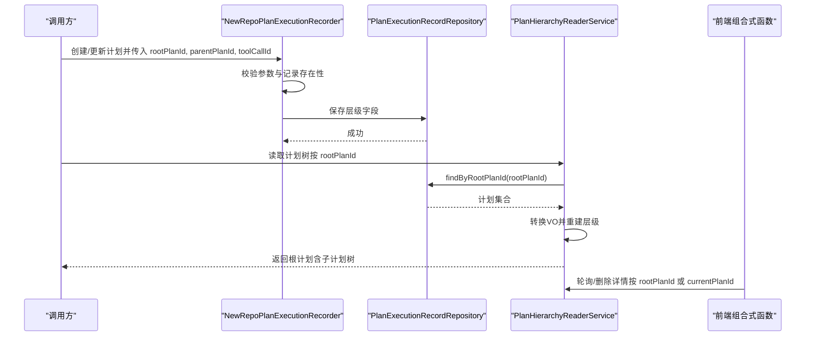
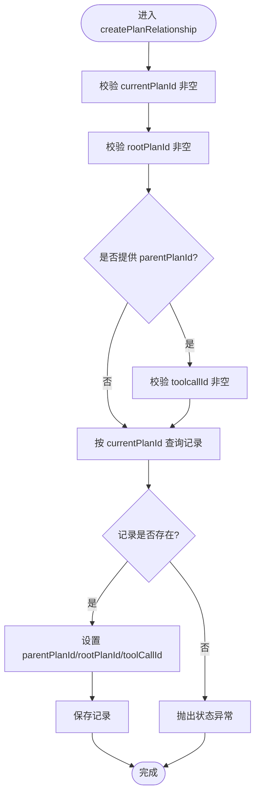
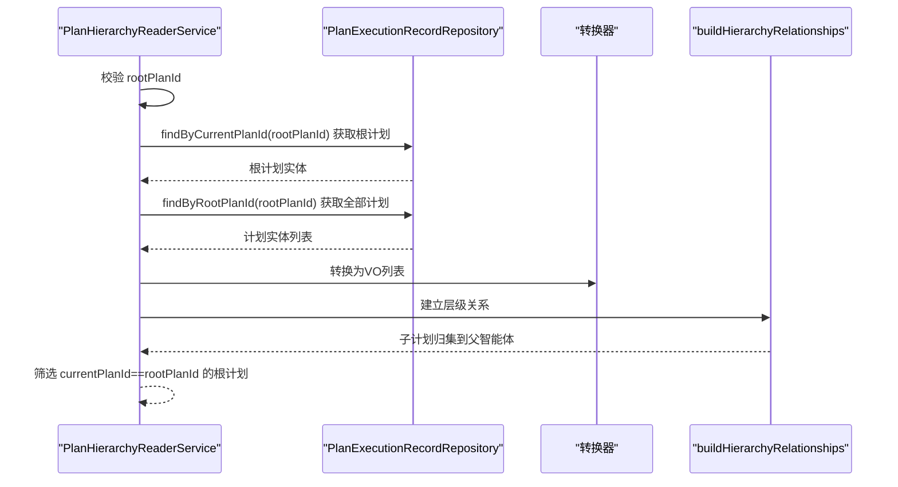
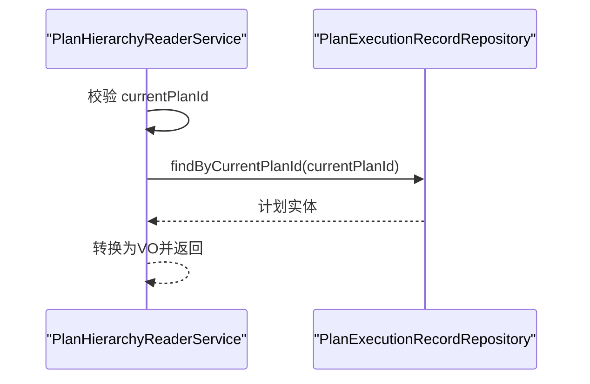
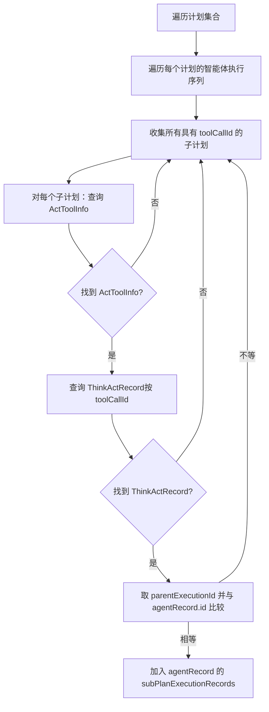
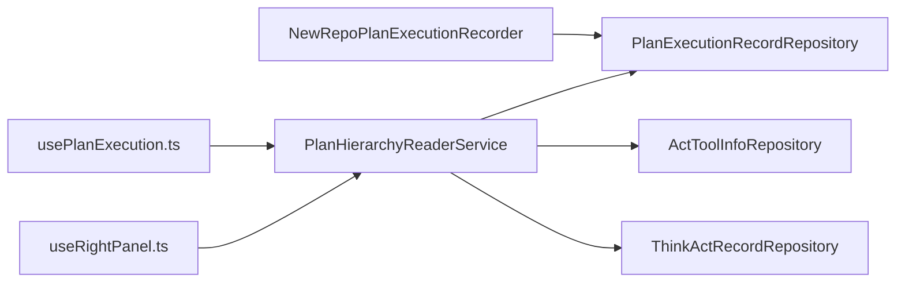
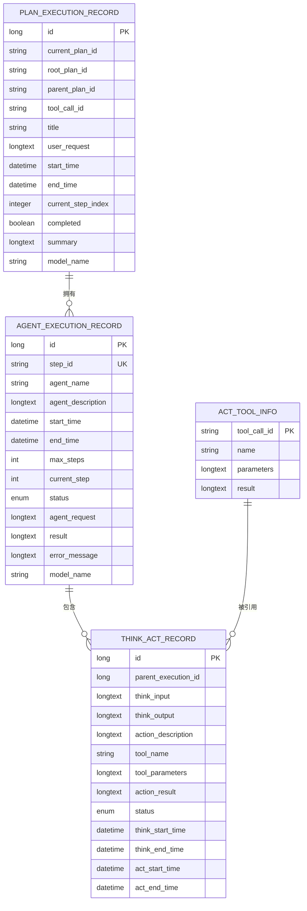

# 执行层级关系

<cite>
**本文引用的文件**
- [PlanExecutionRecordEntity.java](file://src/main/java/com/alibaba/cloud/ai/lynxe/recorder/entity/po/PlanExecutionRecordEntity.java)
- [PlanExecutionRecord.java](file://src/main/java/com/alibaba/cloud/ai/lynxe/recorder/entity/vo/PlanExecutionRecord.java)
- [PlanHierarchyReaderService.java](file://src/main/java/com/alibaba/cloud/ai/lynxe/recorder/service/PlanHierarchyReaderService.java)
- [NewRepoPlanExecutionRecorder.java](file://src/main/java/com/alibaba/cloud/ai/lynxe/recorder/service/NewRepoPlanExecutionRecorder.java)
- [PlanExecutionRecordRepository.java](file://src/main/java/com/alibaba/cloud/ai/lynxe/recorder/repository/PlanExecutionRecordRepository.java)
- [AgentExecutionRecordEntity.java](file://src/main/java/com/alibaba/cloud/ai/lynxe/recorder/entity/po/AgentExecutionRecordEntity.java)
- [ActToolInfo.java](file://src/main/java/com/alibaba/cloud/ai/lynxe/recorder/entity/vo/ActToolInfo.java)
- [ThinkActRecord.java](file://src/main/java/com/alibaba/cloud/ai/lynxe/recorder/entity/vo/ThinkActRecord.java)
- [usePlanExecution.ts](file://ui-vue3/src/composables/usePlanExecution.ts)
- [useRightPanel.ts](file://ui-vue3/src/composables/useRightPanel.ts)
- [LynxeController.java](file://src/main/java/com/alibaba/cloud/ai/lynxe/runtime/controller/LynxeController.java)
</cite>

## 目录
1. [引言](#引言)
2. [项目结构](#项目结构)
3. [核心组件](#核心组件)
4. [架构总览](#架构总览)
5. [详细组件分析](#详细组件分析)
6. [依赖分析](#依赖分析)
7. [性能考虑](#性能考虑)
8. [故障排查指南](#故障排查指南)
9. [结论](#结论)
10. [附录：ER图与示例数据](#附录er图与示例数据)

## 引言
本文件聚焦于“计划执行层级关系”的设计与实现，系统性阐述嵌套计划与子计划的层级结构，明确 rootPlanId、parentPlanId 和 toolCallId 字段的定义与用途；详解 createPlanRelationship 的实现逻辑，说明如何通过这三个字段建立父子关系与调用链路；解析 readPlanTreeByRootId 与 readSinglePlanById 的查询逻辑，阐明如何基于根计划ID构建完整计划树；并给出层级关系的 ER 图与示例数据，最后说明该层级关系在计划监控与执行追溯中的应用场景。

## 项目结构
围绕“执行层级关系”，后端关键模块分布如下：
- 实体层：PlanExecutionRecordEntity（持久化实体）、AgentExecutionRecordEntity（智能体执行记录）
- 视图对象层：PlanExecutionRecord（用于对外展示的VO）、ActToolInfo（工具调用信息）
- 服务层：PlanHierarchyReaderService（层级树读取）、NewRepoPlanExecutionRecorder（层级关系写入与更新）
- 仓储层：PlanExecutionRecordRepository（按ID/根ID/父ID查询）
- 前端组合式函数：usePlanExecution.ts、useRightPanel.ts（前端侧监控与面板展示）

图表来源
- [PlanExecutionRecordEntity.java](file://src/main/java/com/alibaba/cloud/ai/lynxe/recorder/entity/po/PlanExecutionRecordEntity.java#L41-L281)
- [AgentExecutionRecordEntity.java](file://src/main/java/com/alibaba/cloud/ai/lynxe/recorder/entity/po/AgentExecutionRecordEntity.java#L60-L275)
- [PlanExecutionRecord.java](file://src/main/java/com/alibaba/cloud/ai/lynxe/recorder/entity/vo/PlanExecutionRecord.java#L45-L336)
- [PlanHierarchyReaderService.java](file://src/main/java/com/alibaba/cloud/ai/lynxe/recorder/service/PlanHierarchyReaderService.java#L53-L465)
- [NewRepoPlanExecutionRecorder.java](file://src/main/java/com/alibaba/cloud/ai/lynxe/recorder/service/NewRepoPlanExecutionRecorder.java#L46-L855)
- [PlanExecutionRecordRepository.java](file://src/main/java/com/alibaba/cloud/ai/lynxe/recorder/repository/PlanExecutionRecordRepository.java#L1-L55)
- [ActToolInfo.java](file://src/main/java/com/alibaba/cloud/ai/lynxe/recorder/entity/vo/ActToolInfo.java#L1-L138)
- [ThinkActRecord.java](file://src/main/java/com/alibaba/cloud/ai/lynxe/recorder/entity/vo/ThinkActRecord.java#L106-L157)
- [usePlanExecution.ts](file://ui-vue3/src/composables/usePlanExecution.ts#L119-L233)
- [useRightPanel.ts](file://ui-vue3/src/composables/useRightPanel.ts#L69-L104)

章节来源
- [PlanExecutionRecordEntity.java](file://src/main/java/com/alibaba/cloud/ai/lynxe/recorder/entity/po/PlanExecutionRecordEntity.java#L41-L281)
- [PlanHierarchyReaderService.java](file://src/main/java/com/alibaba/cloud/ai/lynxe/recorder/service/PlanHierarchyReaderService.java#L53-L465)
- [NewRepoPlanExecutionRecorder.java](file://src/main/java/com/alibaba/cloud/ai/lynxe/recorder/service/NewRepoPlanExecutionRecorder.java#L46-L855)
- [PlanExecutionRecordRepository.java](file://src/main/java/com/alibaba/cloud/ai/lynxe/recorder/repository/PlanExecutionRecordRepository.java#L1-L55)
- [usePlanExecution.ts](file://ui-vue3/src/composables/usePlanExecution.ts#L119-L233)
- [useRightPanel.ts](file://ui-vue3/src/composables/useRightPanel.ts#L69-L104)

## 核心组件
- PlanExecutionRecordEntity：持久化实体，包含当前计划ID、根计划ID、父计划ID、工具调用ID等层级字段，以及智能体执行序列。
- PlanExecutionRecord：视图对象，用于对外展示，包含层级字段与父工具调用信息。
- PlanHierarchyReaderService：负责按根计划ID读取整棵计划树，并在内存中重建父子关系与子计划列表。
- NewRepoPlanExecutionRecorder：负责在创建或更新计划时写入层级关系，校验参数并保存。
- PlanExecutionRecordRepository：提供按 currentPlanId、rootPlanId、parentPlanId 查询的能力。
- ActToolInfo：封装工具调用名称、参数、结果与唯一ID，用于回溯子计划的触发来源。
- ThinkActRecord：记录思考-行动阶段的起止时间、工具调用与父执行ID，是建立“子计划-父智能体”关系的关键。

章节来源
- [PlanExecutionRecordEntity.java](file://src/main/java/com/alibaba/cloud/ai/lynxe/recorder/entity/po/PlanExecutionRecordEntity.java#L41-L281)
- [PlanExecutionRecord.java](file://src/main/java/com/alibaba/cloud/ai/lynxe/recorder/entity/vo/PlanExecutionRecord.java#L45-L336)
- [PlanHierarchyReaderService.java](file://src/main/java/com/alibaba/cloud/ai/lynxe/recorder/service/PlanHierarchyReaderService.java#L53-L465)
- [NewRepoPlanExecutionRecorder.java](file://src/main/java/com/alibaba/cloud/ai/lynxe/recorder/service/NewRepoPlanExecutionRecorder.java#L46-L855)
- [PlanExecutionRecordRepository.java](file://src/main/java/com/alibaba/cloud/ai/lynxe/recorder/repository/PlanExecutionRecordRepository.java#L1-L55)
- [ActToolInfo.java](file://src/main/java/com/alibaba/cloud/ai/lynxe/recorder/entity/vo/ActToolInfo.java#L1-L138)
- [ThinkActRecord.java](file://src/main/java/com/alibaba/cloud/ai/lynxe/recorder/entity/vo/ThinkActRecord.java#L106-L157)

## 架构总览
层级关系贯穿“写入-读取-展示”全流程：
- 写入阶段：NewRepoPlanExecutionRecorder 在创建计划时，调用 createPlanRelationship 设置 rootPlanId、parentPlanId、toolCallId，并持久化。
- 读取阶段：PlanHierarchyReaderService 按 rootPlanId 获取所有同根计划，转换为VO并重建层级树；同时通过 toolCallId 与 ThinkActRecord 的 parentExecutionId 关联，将子计划归入对应智能体的 subPlanExecutionRecords。
- 展示阶段：前端 usePlanExecution.ts 与 useRightPanel.ts 基于 rootPlanId 或 currentPlanId 定位并轮询详情，完成监控与清理。

图表来源
- [NewRepoPlanExecutionRecorder.java](file://src/main/java/com/alibaba/cloud/ai/lynxe/recorder/service/NewRepoPlanExecutionRecorder.java#L74-L155)
- [PlanExecutionRecordRepository.java](file://src/main/java/com/alibaba/cloud/ai/lynxe/recorder/repository/PlanExecutionRecordRepository.java#L26-L52)
- [PlanHierarchyReaderService.java](file://src/main/java/com/alibaba/cloud/ai/lynxe/recorder/service/PlanHierarchyReaderService.java#L82-L145)
- [usePlanExecution.ts](file://ui-vue3/src/composables/usePlanExecution.ts#L119-L233)

## 详细组件分析

### 字段定义与用途
- rootPlanId：根计划标识，同一棵树内所有节点共享同一 rootPlanId。根计划的 currentPlanId 等于 rootPlanId。
- parentPlanId：父计划标识，仅子计划设置；根计划为空。
- toolCallId：触发该子计划的工具调用ID，用于将子计划与父智能体执行记录关联起来。

这些字段在 PlanExecutionRecordEntity 中以列形式存储，在 PlanExecutionRecord 中作为视图字段暴露。

章节来源
- [PlanExecutionRecordEntity.java](file://src/main/java/com/alibaba/cloud/ai/lynxe/recorder/entity/po/PlanExecutionRecordEntity.java#L55-L104)
- [PlanExecutionRecord.java](file://src/main/java/com/alibaba/cloud/ai/lynxe/recorder/entity/vo/PlanExecutionRecord.java#L54-L61)

### createPlanRelationship 实现逻辑
该方法在 NewRepoPlanExecutionRecorder 中，负责建立/更新计划的层级关系。其校验规则与流程如下：
- 必要性校验：currentPlanId 与 rootPlanId 必须非空。
- 关联性校验：若提供了 parentPlanId，则必须提供 toolcallId；且 rootPlanId 不能等于 currentPlanId。
- 数据一致性：先按 currentPlanId 查询现有记录，不存在则抛出状态异常；存在则设置 parentPlanId、rootPlanId，并可选设置 toolCallId，然后保存。

图表来源
- [NewRepoPlanExecutionRecorder.java](file://src/main/java/com/alibaba/cloud/ai/lynxe/recorder/service/NewRepoPlanExecutionRecorder.java#L781-L853)

章节来源
- [NewRepoPlanExecutionRecorder.java](file://src/main/java/com/alibaba/cloud/ai/lynxe/recorder/service/NewRepoPlanExecutionRecorder.java#L781-L853)

### readPlanTreeByRootId 查询逻辑
该方法由 PlanHierarchyReaderService 提供，按以下步骤构建完整计划树：
- 参数校验：rootPlanId 非空。
- 查找根计划：按 currentPlanId 等于 rootPlanId 精确匹配根计划。
- 批量加载：按 rootPlanId 查询所有同根计划（包含根计划本身）。
- 转换与建树：将实体转换为VO，随后调用 buildHierarchyRelationships 建立层级。
- 返回根计划：从转换后的集合中筛选 currentPlanId 等于 rootPlanId 的记录返回。

图表来源
- [PlanHierarchyReaderService.java](file://src/main/java/com/alibaba/cloud/ai/lynxe/recorder/service/PlanHierarchyReaderService.java#L82-L145)
- [PlanExecutionRecordRepository.java](file://src/main/java/com/alibaba/cloud/ai/lynxe/recorder/repository/PlanExecutionRecordRepository.java#L39-L42)

章节来源
- [PlanHierarchyReaderService.java](file://src/main/java/com/alibaba/cloud/ai/lynxe/recorder/service/PlanHierarchyReaderService.java#L82-L145)
- [PlanExecutionRecordRepository.java](file://src/main/java/com/alibaba/cloud/ai/lynxe/recorder/repository/PlanExecutionRecordRepository.java#L39-L42)

### readSinglePlanById 查询逻辑
该方法仅按 currentPlanId 返回单个计划的VO，不加载子计划树，适合快速定位某个具体计划的元数据与执行摘要。

图表来源
- [PlanHierarchyReaderService.java](file://src/main/java/com/alibaba/cloud/ai/lynxe/recorder/service/PlanHierarchyReaderService.java#L153-L181)
- [PlanExecutionRecordRepository.java](file://src/main/java/com/alibaba/cloud/ai/lynxe/recorder/repository/PlanExecutionRecordRepository.java#L29-L33)

章节来源
- [PlanHierarchyReaderService.java](file://src/main/java/com/alibaba/cloud/ai/lynxe/recorder/service/PlanHierarchyReaderService.java#L153-L181)
- [PlanExecutionRecordRepository.java](file://src/main/java/com/alibaba/cloud/ai/lynxe/recorder/repository/PlanExecutionRecordRepository.java#L29-L33)

### buildHierarchyRelationships 与 findSubPlansForAgent
- buildHierarchyRelationships：对每个计划的智能体执行序列进行遍历，将具备 toolCallId 的子计划归入对应智能体的 subPlanExecutionRecords。
- findSubPlansForAgent：通过 toolCallId 关联 ActToolInfo 与 ThinkActRecord，利用 ThinkActRecord 的 parentExecutionId 与 AgentExecutionRecord.id 匹配，从而确定父子关系。

图表来源
- [PlanHierarchyReaderService.java](file://src/main/java/com/alibaba/cloud/ai/lynxe/recorder/service/PlanHierarchyReaderService.java#L323-L465)

章节来源
- [PlanHierarchyReaderService.java](file://src/main/java/com/alibaba/cloud/ai/lynxe/recorder/service/PlanHierarchyReaderService.java#L323-L465)

### 前端监控与追溯
- usePlanExecution.ts：基于 recordKey（优先 rootPlanId，否则 currentPlanId）轮询计划详情，达到完成态后清理后端执行详情。
- useRightPanel.ts：在复杂执行序列中，通过 stepId 递归查找所属子计划的根计划ID，便于定位与展示。

章节来源
- [usePlanExecution.ts](file://ui-vue3/src/composables/usePlanExecution.ts#L119-L233)
- [useRightPanel.ts](file://ui-vue3/src/composables/useRightPanel.ts#L69-L104)

## 依赖分析
- NewRepoPlanExecutionRecorder 依赖 PlanExecutionRecordRepository 进行持久化与查询。
- PlanHierarchyReaderService 依赖 PlanExecutionRecordRepository、ActToolInfoRepository、ThinkActRecordRepository 进行层级重建与父工具信息回填。
- 前端组合式函数依赖后端服务接口，通过 rootPlanId/currentPlanId 进行监控与清理。

图表来源
- [NewRepoPlanExecutionRecorder.java](file://src/main/java/com/alibaba/cloud/ai/lynxe/recorder/service/NewRepoPlanExecutionRecorder.java#L46-L855)
- [PlanHierarchyReaderService.java](file://src/main/java/com/alibaba/cloud/ai/lynxe/recorder/service/PlanHierarchyReaderService.java#L53-L110)
- [PlanExecutionRecordRepository.java](file://src/main/java/com/alibaba/cloud/ai/lynxe/recorder/repository/PlanExecutionRecordRepository.java#L1-L55)
- [usePlanExecution.ts](file://ui-vue3/src/composables/usePlanExecution.ts#L119-L233)
- [useRightPanel.ts](file://ui-vue3/src/composables/useRightPanel.ts#L69-L104)

章节来源
- [PlanHierarchyReaderService.java](file://src/main/java/com/alibaba/cloud/ai/lynxe/recorder/service/PlanHierarchyReaderService.java#L53-L110)
- [PlanExecutionRecordRepository.java](file://src/main/java/com/alibaba/cloud/ai/lynxe/recorder/repository/PlanExecutionRecordRepository.java#L1-L55)

## 性能考虑
- 批量查询：按 rootPlanId 一次性拉取整棵树，避免多次往返数据库。
- 内存映射：在 buildHierarchyRelationships 中使用 Map(currentPlanId -> PlanExecutionRecord) 加速子计划定位。
- 排序策略：子计划按 startTime 升序排序，便于前端按时间顺序展示。
- 前端轮询：usePlanExecution.ts 使用指数退避与最大重试次数控制，降低无效请求压力。

[本节为通用建议，无需特定文件引用]

## 故障排查指南
- 参数校验失败：当 parentPlanId 非空但未提供 toolcallId，或 rootPlanId 等于 currentPlanId 时会抛出非法参数异常。检查调用方传参与计划创建流程。
- 记录不存在：若按 currentPlanId 无法查到记录，将抛出状态异常。确认计划是否已创建或 ID 是否正确。
- 子计划未归集：若子计划未出现在父智能体的 subPlanExecutionRecords 中，检查 ActToolInfo 与 ThinkActRecord 的 parentExecutionId 是否一致，以及 toolCallId 是否正确传递。

章节来源
- [NewRepoPlanExecutionRecorder.java](file://src/main/java/com/alibaba/cloud/ai/lynxe/recorder/service/NewRepoPlanExecutionRecorder.java#L797-L853)
- [PlanHierarchyReaderService.java](file://src/main/java/com/alibaba/cloud/ai/lynxe/recorder/service/PlanHierarchyReaderService.java#L393-L465)

## 结论
通过 rootPlanId、parentPlanId、toolCallId 三字段，系统实现了清晰的计划层级与调用链路管理。NewRepoPlanExecutionRecorder 负责写入与校验，PlanHierarchyReaderService 负责读取与重建树，前端组合式函数负责监控与清理。该设计既满足了执行追溯的需求，也为可视化展示与运维监控提供了坚实的数据基础。

[本节为总结性内容，无需特定文件引用]

## 附录：ER图与示例数据

### ER图（映射实际代码结构）

图表来源
- [PlanExecutionRecordEntity.java](file://src/main/java/com/alibaba/cloud/ai/lynxe/recorder/entity/po/PlanExecutionRecordEntity.java#L41-L281)
- [AgentExecutionRecordEntity.java](file://src/main/java/com/alibaba/cloud/ai/lynxe/recorder/entity/po/AgentExecutionRecordEntity.java#L60-L275)
- [ThinkActRecord.java](file://src/main/java/com/alibaba/cloud/ai/lynxe/recorder/entity/vo/ThinkActRecord.java#L106-L157)
- [ActToolInfo.java](file://src/main/java/com/alibaba/cloud/ai/lynxe/recorder/entity/vo/ActToolInfo.java#L1-L138)

### 示例数据与查询路径
- 根计划：currentPlanId = rootPlanId，parentPlanId = null，toolCallId = null。
- 子计划A：currentPlanId != rootPlanId，rootPlanId = 根ID，parentPlanId = 根ID，toolCallId = 对应工具调用ID。
- 子计划B：currentPlanId != rootPlanId，rootPlanId = 根ID，parentPlanId = 根ID，toolCallId = 另一个工具调用ID。
- 查询路径：
  - 读取整树：按 rootPlanId 查询所有计划，得到根计划与子计划集合。
  - 重建层级：对每个计划的智能体执行序列，按 toolCallId 与 ThinkActRecord.parentExecutionId 匹配，将子计划归入对应智能体的 subPlanExecutionRecords。
  - 单条查询：按 currentPlanId 查询单个计划，用于快速定位。

章节来源
- [PlanHierarchyReaderService.java](file://src/main/java/com/alibaba/cloud/ai/lynxe/recorder/service/PlanHierarchyReaderService.java#L82-L145)
- [PlanExecutionRecordRepository.java](file://src/main/java/com/alibaba/cloud/ai/lynxe/recorder/repository/PlanExecutionRecordRepository.java#L39-L42)
- [PlanExecutionRecordRepository.java](file://src/main/java/com/alibaba/cloud/ai/lynxe/recorder/repository/PlanExecutionRecordRepository.java#L29-L33)

### 应用场景
- 计划监控：前端通过 rootPlanId 轮询执行详情，直到完成态并清理。
- 执行追溯：通过 toolCallId 与 ThinkActRecord.parentExecutionId 回溯子计划的触发来源与执行顺序。
- 面板展示：useRightPanel.ts 基于 stepId 递归定位根计划ID，支撑复杂执行序列的可视化。

章节来源
- [usePlanExecution.ts](file://ui-vue3/src/composables/usePlanExecution.ts#L119-L233)
- [useRightPanel.ts](file://ui-vue3/src/composables/useRightPanel.ts#L69-L104)
- [PlanHierarchyReaderService.java](file://src/main/java/com/alibaba/cloud/ai/lynxe/recorder/service/PlanHierarchyReaderService.java#L393-L465)