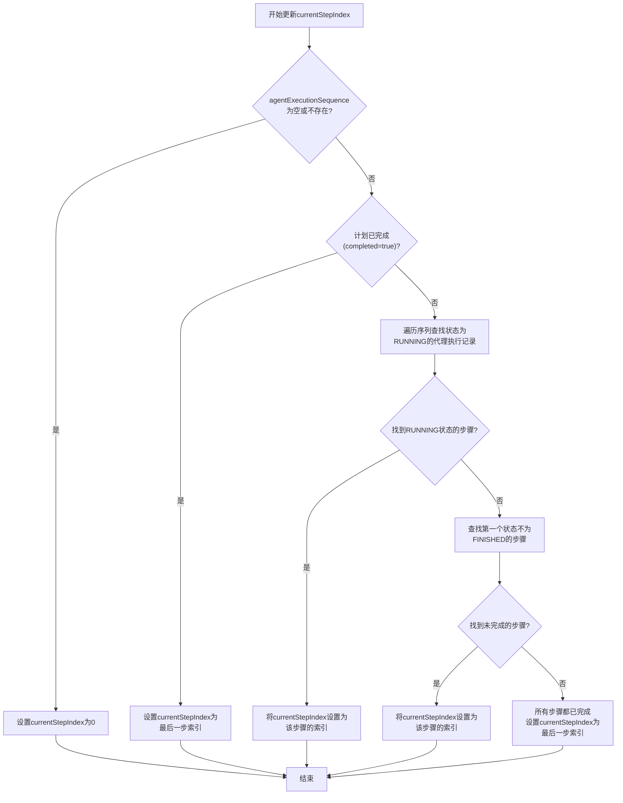
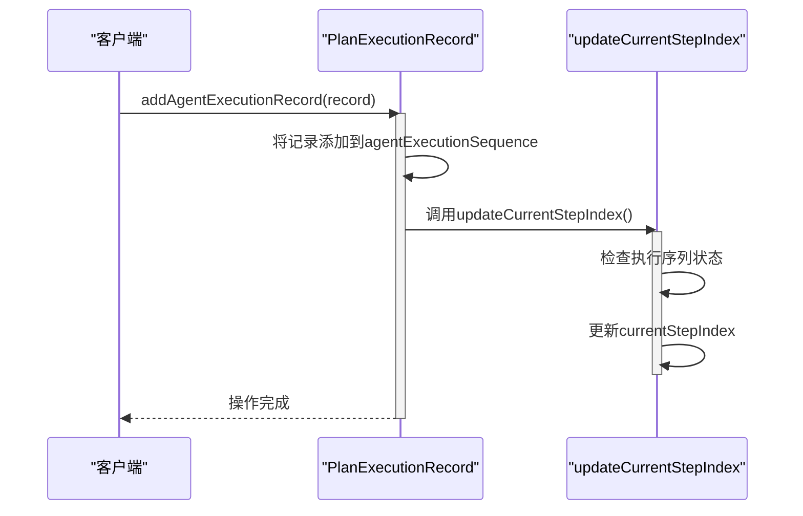
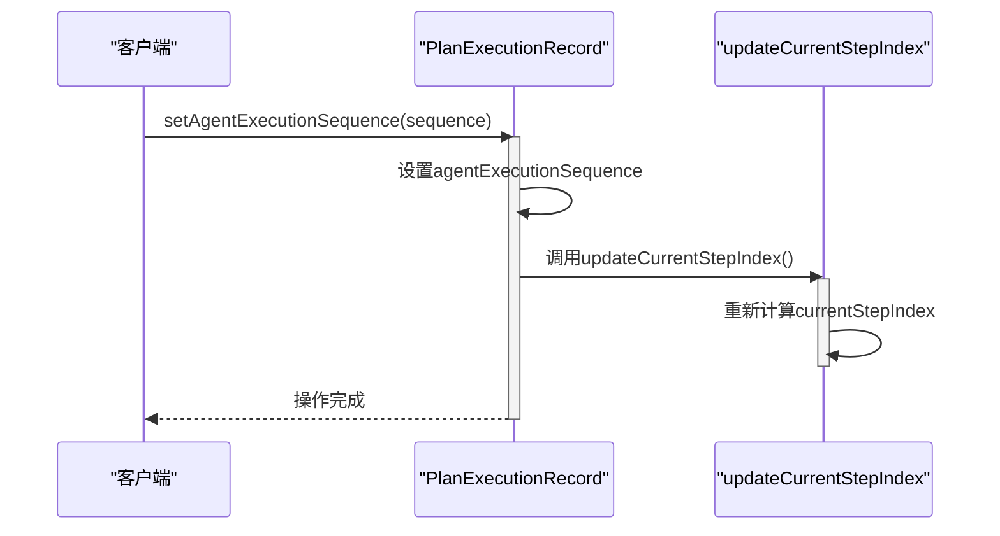
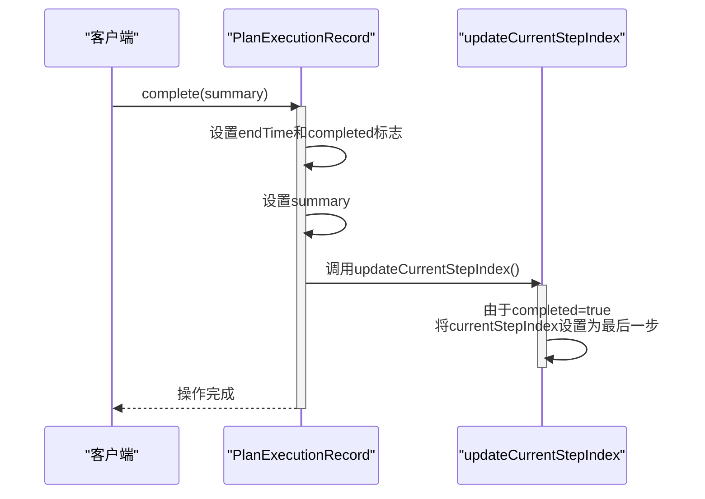
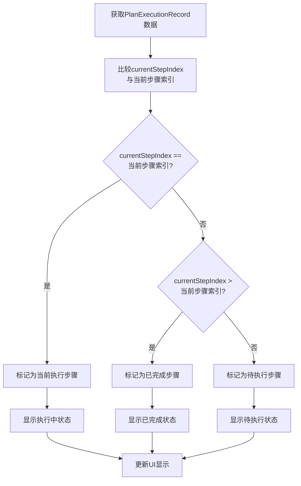
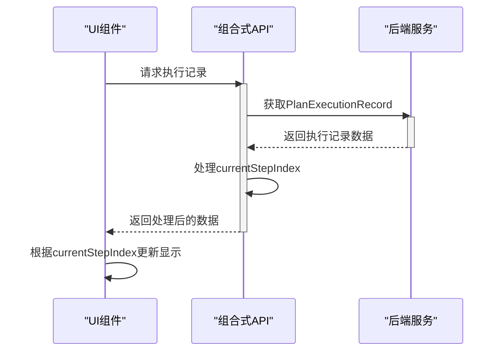
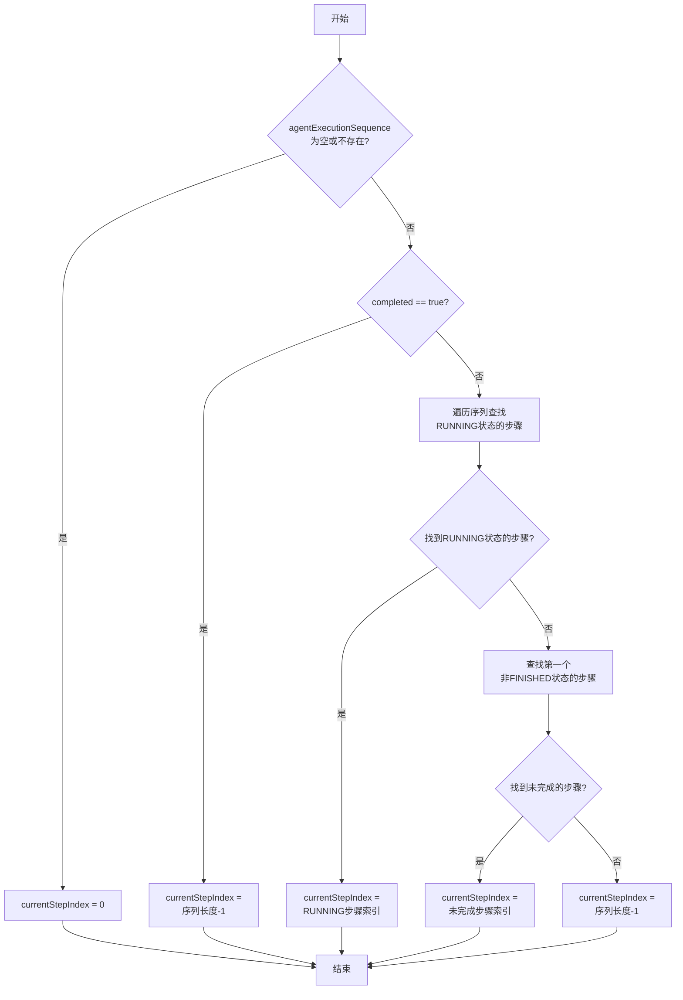

# 当前步骤索引机制

<cite>
**本文档引用的文件**   
- [PlanExecutionRecord.java](file://src/main/java/com/alibaba/cloud/ai/lynxe/recorder/entity/vo/PlanExecutionRecord.java)
- [AgentExecutionRecord.java](file://src/main/java/com/alibaba/cloud/ai/lynxe/recorder/entity/vo/AgentExecutionRecord.java)
- [ExecutionStatus.java](file://src/main/java/com/alibaba/cloud/ai/lynxe/recorder/entity/vo/ExecutionStatus.java)
- [RecursiveSubPlan.vue](file://ui-vue3/src/components/chat/RecursiveSubPlan.vue)
- [RightPanel.vue](file://ui-vue3/src/components/right-panel/RightPanel.vue)
- [useRightPanel.ts](file://ui-vue3/src/composables/useRightPanel.ts)
</cite>

## 目录
1. [引言](#引言)
2. [核心机制分析](#核心机制分析)
3. [updateCurrentStepIndex方法逻辑](#updatecurrentstepindex方法逻辑)
4. [字段自动更新机制](#字段自动更新机制)
5. [前端UI集成](#前端ui集成)
6. [状态转换流程图](#状态转换流程图)
7. [结论](#结论)

## 引言
当前步骤索引机制是系统中用于跟踪和反映计划执行进度的核心指标。该机制通过`currentStepIndex`字段动态标识当前正在执行的步骤，为用户提供清晰的执行状态可视化。本文档深入分析该机制的实现原理，包括`updateCurrentStepIndex()`方法的复杂逻辑、字段的自动更新机制以及与前端UI的集成方式。

## 核心机制分析
当前步骤索引机制的核心是`PlanExecutionRecord`类中的`currentStepIndex`字段，该字段动态反映计划执行的当前进度。该机制通过分析`agentExecutionSequence`中各个代理执行记录的状态来确定当前执行的步骤。

**核心组件关系**
- `PlanExecutionRecord`: 计划执行记录主类，包含`currentStepIndex`字段和`updateCurrentStepIndex()`方法
- `AgentExecutionRecord`: 代理执行记录类，包含执行状态信息
- `ExecutionStatus`: 执行状态枚举，定义了IDLE、RUNNING、FINISHED三种状态

该机制确保了系统能够准确地跟踪执行进度，并在前端UI中实时显示当前执行的步骤。

**Section sources**
- [PlanExecutionRecord.java](file://src/main/java/com/alibaba/cloud/ai/lynxe/recorder/entity/vo/PlanExecutionRecord.java#L79-L80)
- [AgentExecutionRecord.java](file://src/main/java/com/alibaba/cloud/ai/lynxe/recorder/entity/vo/AgentExecutionRecord.java#L214-L220)
- [ExecutionStatus.java](file://src/main/java/com/alibaba/cloud/ai/lynxe/recorder/entity/vo/ExecutionStatus.java#L21-L23)

## updateCurrentStepIndex方法逻辑
`updateCurrentStepIndex()`方法是当前步骤索引机制的核心，负责根据执行状态动态更新`currentStepIndex`字段。该方法的执行逻辑如下：

**Diagram sources**
- [PlanExecutionRecord.java](file://src/main/java/com/alibaba/cloud/ai/lynxe/recorder/entity/vo/PlanExecutionRecord.java#L154-L185)

**Section sources**
- [PlanExecutionRecord.java](file://src/main/java/com/alibaba/cloud/ai/lynxe/recorder/entity/vo/PlanExecutionRecord.java#L154-L185)

## 字段自动更新机制
`currentStepIndex`字段在多个关键操作中被自动更新，确保其始终反映最新的执行状态。

### addAgentExecutionRecord方法
当向`agentExecutionSequence`添加新的代理执行记录时，会自动调用`updateCurrentStepIndex()`方法：

**Diagram sources**
- [PlanExecutionRecord.java](file://src/main/java/com/alibaba/cloud/ai/lynxe/recorder/entity/vo/PlanExecutionRecord.java#L119-L123)

### setAgentExecutionSequence方法
当设置整个代理执行序列时，也会触发`currentStepIndex`的更新：

**Diagram sources**
- [PlanExecutionRecord.java](file://src/main/java/com/alibaba/cloud/ai/lynxe/recorder/entity/vo/PlanExecutionRecord.java#L133-L137)

### complete方法
当计划执行完成时，`complete()`方法会更新`currentStepIndex`：

**Diagram sources**
- [PlanExecutionRecord.java](file://src/main/java/com/alibaba/cloud/ai/lynxe/recorder/entity/vo/PlanExecutionRecord.java#L142-L147)

**Section sources**
- [PlanExecutionRecord.java](file://src/main/java/com/alibaba/cloud/ai/lynxe/recorder/entity/vo/PlanExecutionRecord.java#L119-L147)

## 前端UI集成
当前步骤索引机制与前端UI紧密集成，确保用户界面能够准确显示执行进度。

### 状态显示逻辑
前端组件根据`currentStepIndex`和执行状态来显示步骤信息：

### 组件交互
前端组件通过组合式API与后端数据进行交互：

**Diagram sources**
- [RecursiveSubPlan.vue](file://ui-vue3/src/components/chat/RecursiveSubPlan.vue#L226-L245)
- [RightPanel.vue](file://ui-vue3/src/components/right-panel/RightPanel.vue#L343-L355)
- [useRightPanel.ts](file://ui-vue3/src/composables/useRightPanel.ts#L69-L104)

**Section sources**
- [RecursiveSubPlan.vue](file://ui-vue3/src/components/chat/RecursiveSubPlan.vue#L226-L245)
- [RightPanel.vue](file://ui-vue3/src/components/right-panel/RightPanel.vue#L343-L355)
- [useRightPanel.ts](file://ui-vue3/src/composables/useRightPanel.ts#L69-L104)

## 状态转换流程图
以下是完整的状态转换流程，展示了`updateCurrentStepIndex()`方法的决策过程：

**Diagram sources**
- [PlanExecutionRecord.java](file://src/main/java/com/alibaba/cloud/ai/lynxe/recorder/entity/vo/PlanExecutionRecord.java#L154-L185)

## 结论
当前步骤索引机制通过`currentStepIndex`字段和`updateCurrentStepIndex()`方法的协同工作，实现了对计划执行进度的精确跟踪。该机制具有以下特点：

1. **智能状态判断**：通过多级条件判断，准确识别当前执行的步骤
2. **自动更新**：在关键操作（添加记录、设置序列、完成计划）时自动更新索引
3. **前端集成**：与UI组件紧密集成，提供直观的执行进度显示
4. **状态完整性**：覆盖所有可能的执行状态，包括空序列、已完成、运行中和待执行等场景

该机制确保了系统能够准确反映执行进度，为用户提供清晰的执行状态可视化，是整个计划执行系统的重要组成部分。