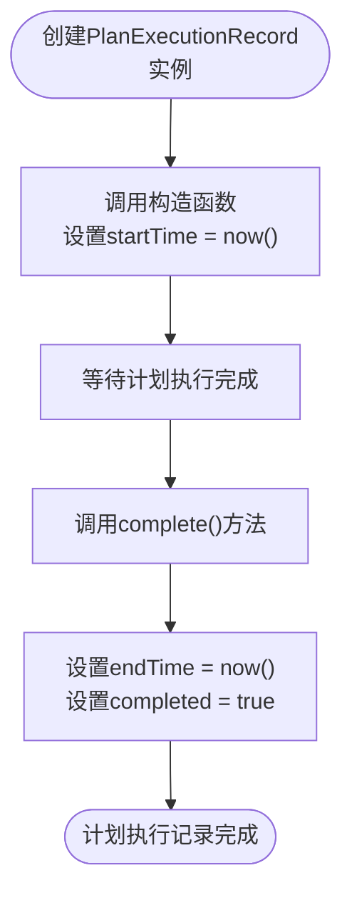
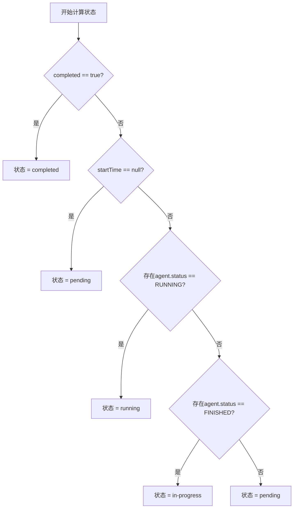
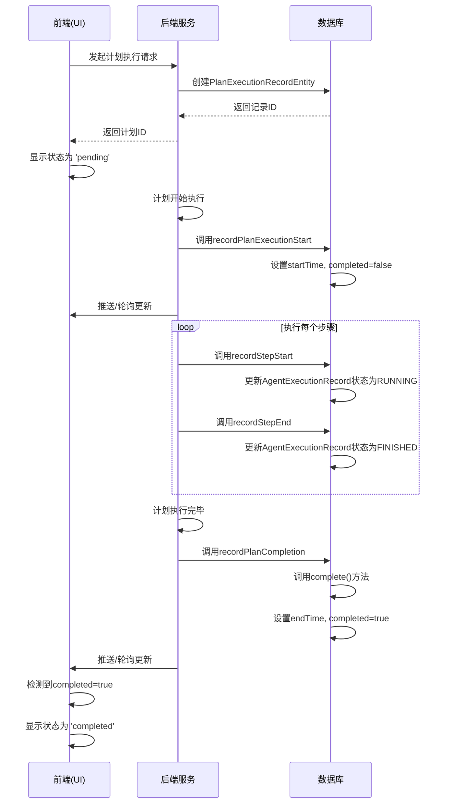

# 执行状态定义

<cite>
**本文档引用的文件**   
- [PlanExecutionRecord.java](file://src/main/java/com/alibaba/cloud/ai/lynxe/recorder/entity/vo/PlanExecutionRecord.java)
- [PlanExecutionRecordEntity.java](file://src/main/java/com/alibaba/cloud/ai/lynxe/recorder/entity/po/PlanExecutionRecordEntity.java)
- [NewRepoPlanExecutionRecorder.java](file://src/main/java/com/alibaba/cloud/ai/lynxe/recorder/service/NewRepoPlanExecutionRecorder.java)
- [ExecutionStatus.java](file://src/main/java/com/alibaba/cloud/ai/lynxe/recorder/entity/vo/ExecutionStatus.java)
- [ExecutionStatusEntity.java](file://src/main/java/com/alibaba/cloud/ai/lynxe/recorder/entity/po/ExecutionStatusEntity.java)
- [RightPanel.vue](file://ui-vue3/src/components/right-panel/RightPanel.vue)
- [RecursiveSubPlan.vue](file://ui-vue3/src/components/chat/RecursiveSubPlan.vue)
</cite>

## 目录
1. [引言](#引言)
2. [completed字段的业务含义](#completed字段的业务含义)
3. [时间戳字段的初始化与更新机制](#时间戳字段的初始化与更新机制)
4. [前端status字段的计算逻辑](#前端status字段的计算逻辑)
5. [执行状态转换流程](#执行状态转换流程)
6. [执行时长计算与监控](#执行时长计算与监控)
7. [结论](#结论)

## 引言
本文档详细阐述了计划执行状态的定义，重点分析了`PlanExecutionRecord`实体中`completed`字段的双重作用，以及`startTime`和`endTime`时间戳的管理机制。同时，文档还解释了前端`status`字段（'pending' | 'running' | 'completed' | 'failed' | 'paused'）的动态计算逻辑，为系统状态监控和用户界面展示提供理论依据。

## completed字段的业务含义
`completed`字段在`PlanExecutionRecord`实体中扮演着核心角色，具有双重业务含义：

1.  **执行完成标志**：该布尔值（`boolean`）直接表示一个计划执行实例是否已经完成。当计划的所有步骤都成功执行完毕后，此字段会被设置为`true`。

2.  **状态判断的核心依据**：该字段是判断计划整体状态的最直接和最权威的依据。后端服务和前端UI都依赖此字段来确定一个计划是处于进行中还是已完成状态。

在`PlanExecutionRecord`的`complete()`方法中，`completed`字段被明确设置为`true`，标志着计划执行的正式结束。此操作是不可逆的，一旦计划被标记为完成，其状态将不再改变。

**Section sources**
- [PlanExecutionRecord.java](file://src/main/java/com/alibaba/cloud/ai/lynxe/recorder/entity/vo/PlanExecutionRecord.java#L142-L148)
- [PlanExecutionRecordEntity.java](file://src/main/java/com/alibaba/cloud/ai/lynxe/recorder/entity/po/PlanExecutionRecordEntity.java#L162-L166)

## 时间戳字段的初始化与更新机制
`startTime`和`endTime`是记录计划执行生命周期的关键时间戳，其管理机制如下：

### 初始化规则
-   **startTime**：在`PlanExecutionRecord`的构造函数中自动初始化。无论是`PlanExecutionRecord`（VO）还是`PlanExecutionRecordEntity`（PO），其无参或带参构造函数都会在实例化时调用`LocalDateTime.now()`来设置`startTime`。这确保了计划从被创建的那一刻起，其开始时间就被准确记录。
-   **endTime**：初始值为`null`。它仅在计划执行完成后才会被赋值。

### 更新机制
-   **startTime**：通常在计划创建后即被设定，后续不会被修改。
-   **endTime**：通过调用`PlanExecutionRecord`实体的`complete()`方法来更新。该方法不仅将`completed`字段设为`true`，还会调用`LocalDateTime.now()`来设置`endTime`，从而精确记录计划完成的时刻。

此机制确保了执行时长（`endTime - startTime`）的计算是准确且可靠的。

**Diagram sources **
- [PlanExecutionRecord.java](file://src/main/java/com/alibaba/cloud/ai/lynxe/recorder/entity/vo/PlanExecutionRecord.java#L106-L113)
- [PlanExecutionRecord.java](file://src/main/java/com/alibaba/cloud/ai/lynxe/recorder/entity/vo/PlanExecutionRecord.java#L142-L148)
- [PlanExecutionRecordEntity.java](file://src/main/java/com/alibaba/cloud/ai/lynxe/recorder/entity/po/PlanExecutionRecordEntity.java#L123-L129)

## 前端status字段的计算逻辑
前端UI展示的`status`字段（如'pending'、'running'、'completed'）并非直接从后端获取的原始字段，而是根据后端返回的`PlanExecutionRecord`数据动态推导出的可读状态。

其计算逻辑主要依赖于以下几个后端字段：
-   `completed` (布尔值)
-   `startTime` (时间戳)
-   `endTime` (时间戳)
-   `agentExecutionSequence`中的`status` (枚举值: IDLE, RUNNING, FINISHED)
-   `errorMessage` (字符串)

具体的推导规则如下：
1.  **completed**: 如果`completed`字段为`true`，则前端状态直接显示为`completed`。
2.  **running**: 如果`completed`为`false`，但`startTime`不为`null`，并且`agentExecutionSequence`中存在任何状态为`RUNNING`的代理，则前端状态为`running`。
3.  **in-progress**: 如果`completed`为`false`，`startTime`不为`null`，且`agentExecutionSequence`中存在状态为`FINISHED`的代理（但没有`RUNNING`的），则表示计划已开始但尚未完成，状态为`in-progress`。
4.  **pending**: 如果`startTime`为`null`，则表示计划尚未开始执行，状态为`pending`。
5.  **failed**: 如果`completed`为`true`，但存在`errorMessage`，则状态为`failed`。
6.  **paused**: 此状态可能由特定的业务逻辑或用户操作触发，可能需要检查`userInputWaitState`等字段。

**Diagram sources **
- [RecursiveSubPlan.vue](file://ui-vue3/src/components/chat/RecursiveSubPlan.vue#L226-L245)
- [RightPanel.vue](file://ui-vue3/src/components/right-panel/RightPanel.vue#L346-L350)

## 执行状态转换流程
计划的执行状态转换是一个由后端服务驱动、前端UI响应的流程。

**Diagram sources **
- [NewRepoPlanExecutionRecorder.java](file://src/main/java/com/alibaba/cloud/ai/lynxe/recorder/service/NewRepoPlanExecutionRecorder.java#L75-L150)
- [NewRepoPlanExecutionRecorder.java](file://src/main/java/com/alibaba/cloud/ai/lynxe/recorder/service/NewRepoPlanExecutionRecorder.java#L607-L645)

## 执行时长计算与监控
`startTime`和`endTime`字段为计算计划执行时长和监控执行进度提供了基础。

-   **执行时长计算**：执行时长可以通过简单的减法运算得到：`duration = endTime - startTime`。这个值可以用于性能分析、计费或向用户展示执行效率。
-   **执行进度监控**：虽然`PlanExecutionRecord`本身不直接存储进度百分比，但可以通过分析`agentExecutionSequence`来估算。例如，进度可以计算为已完成的代理执行记录数除以总代理执行记录数。当`completed`为`true`时，进度为100%。

这些时间字段和状态信息共同构成了一个完整的执行监控体系，使得系统能够实时跟踪计划的执行情况。

**Section sources**
- [PlanExecutionRecord.java](file://src/main/java/com/alibaba/cloud/ai/lynxe/recorder/entity/vo/PlanExecutionRecord.java#L72-L77)
- [PlanExecutionRecord.java](file://src/main/java/com/alibaba/cloud/ai/lynxe/recorder/entity/vo/PlanExecutionRecord.java#L264-L286)

## 结论
`PlanExecutionRecord`实体中的`completed`字段是判断计划执行完成的核心标志，其与`startTime`和`endTime`时间戳共同构成了一个完整的执行生命周期记录。后端通过构造函数和`complete()`方法精确管理这些时间点，而前端则通过一套基于`completed`、`startTime`、`endTime`和代理状态的逻辑，动态计算并展示用户友好的执行状态（如'pending'、'running'、'completed'）。这种前后端分离的设计模式，既保证了数据的准确性，又提供了灵活的用户界面展示能力。