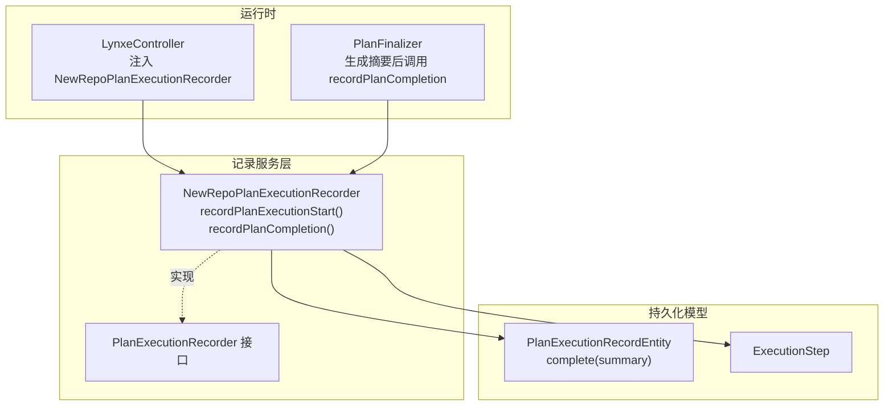
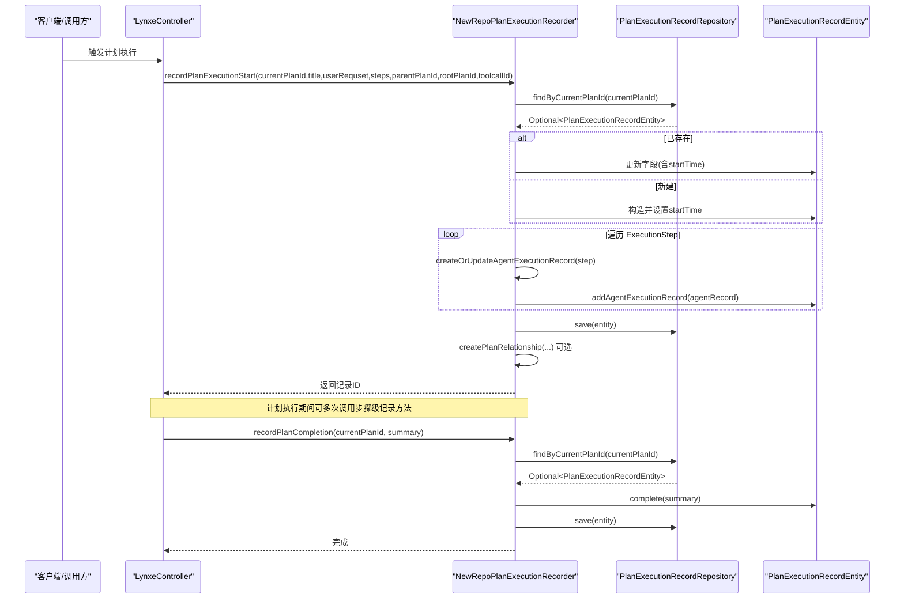
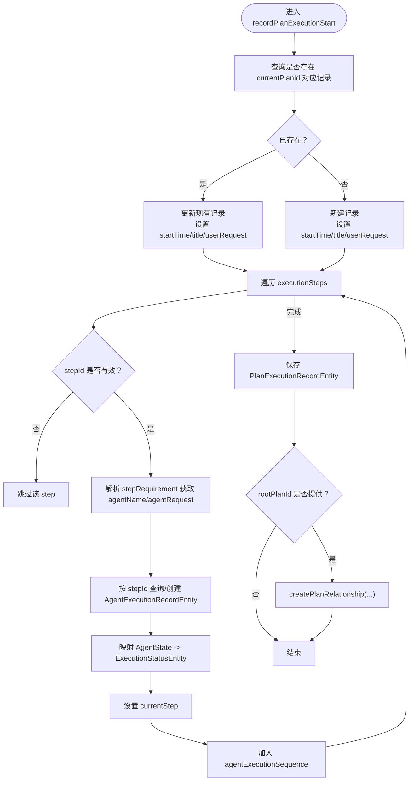
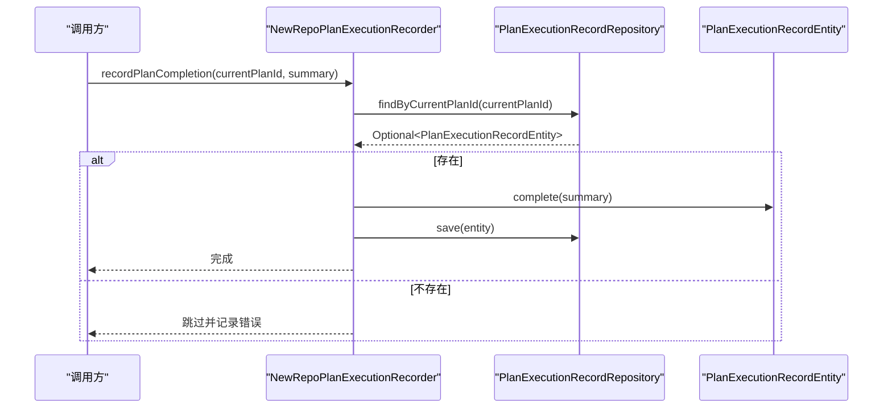
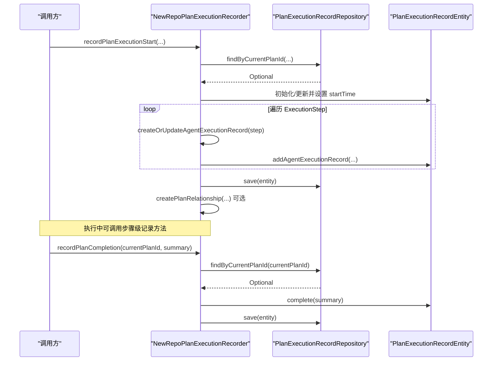
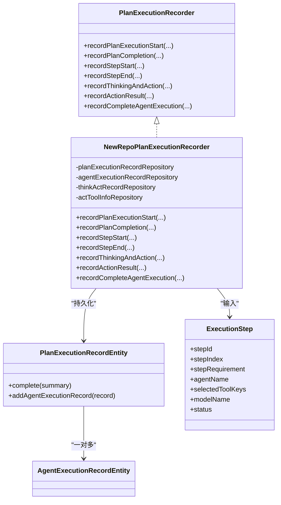

# 执行状态流转

<cite>
**本文引用的文件列表**
- [NewRepoPlanExecutionRecorder.java](file://src/main/java/com/alibaba/cloud/ai/lynxe/recorder/service/NewRepoPlanExecutionRecorder.java)
- [PlanExecutionRecorder.java](file://src/main/java/com/alibaba/cloud/ai/lynxe/recorder/service/PlanExecutionRecorder.java)
- [PlanExecutionRecordEntity.java](file://src/main/java/com/alibaba/cloud/ai/lynxe/recorder/entity/po/PlanExecutionRecordEntity.java)
- [ExecutionStep.java](file://src/main/java/com/alibaba/cloud/ai/lynxe/runtime/entity/vo/ExecutionStep.java)
- [LynxeController.java](file://src/main/java/com/alibaba/cloud/ai/lynxe/runtime/controller/LynxeController.java)
- [PlanFinalizer.java](file://src/main/java/com/alibaba/cloud/ai/lynxe/planning/service/PlanFinalizer.java)
</cite>

## 目录
1. [简介](#简介)
2. [项目结构与角色定位](#项目结构与角色定位)
3. [核心组件](#核心组件)
4. [架构总览](#架构总览)
5. [详细组件分析](#详细组件分析)
6. [依赖关系分析](#依赖关系分析)
7. [性能与并发特性](#性能与并发特性)
8. [故障排查指南](#故障排查指南)
9. [结论](#结论)

## 简介
本文件聚焦于“计划执行状态流转”的实现细节，围绕 NewRepoPlanExecutionRecorder 服务中的 recordPlanExecutionStart 与 recordPlanCompletion 方法展开，阐明二者如何协同管理一次计划（Plan）从启动到完成的生命周期。文档将：
- 解释 recordPlanExecutionStart 如何创建/更新 PlanExecutionRecord 实例并初始化 startTime；
- 阐述执行过程中如何通过 addAgentExecutionRecord（由内部 createOrUpdateAgentExecutionRecord 调用）为每个 ExecutionStep 建立 AgentExecutionRecord；
- 说明 recordPlanCompletion 如何调用 PlanExecutionRecordEntity 的 complete() 设置 endTime 和 completed 标志；
- 提供完整的状态流转时序图，覆盖初始化、执行中、完成三个阶段的关键调用顺序。

## 项目结构与角色定位
- 计划执行记录接口：PlanExecutionRecorder 定义了统一的记录契约，包括启动、步骤级记录、思考-行动记录、动作结果记录、完成等方法。
- 计划执行记录实现：NewRepoPlanExecutionRecorder 是基于 JPA 的实现，负责持久化 PlanExecutionRecordEntity，并维护 AgentExecutionRecordEntity、ThinkActRecordEntity、ActToolInfoEntity 的关联关系。
- 计划实体：PlanExecutionRecordEntity 描述一次计划的生命周期数据（开始/结束时间、是否完成、摘要、代理执行序列等），并提供 complete(summary) 方法用于标记完成。
- 执行步骤：ExecutionStep 表示单步执行信息，包含 stepId、stepIndex、stepRequirement、agentName、selectedToolKeys、modelName、status 等字段。
- 控制器与后处理：LynxeController 注入 NewRepoPlanExecutionRecorder 并在执行流程中触发记录；PlanFinalizer 在生成最终摘要后调用 recordPlanCompletion 完成收尾。

图表来源
- [LynxeController.java](file://src/main/java/com/alibaba/cloud/ai/lynxe/runtime/controller/LynxeController.java#L110-L120)
- [PlanFinalizer.java](file://src/main/java/com/alibaba/cloud/ai/lynxe/planning/service/PlanFinalizer.java#L153-L164)
- [NewRepoPlanExecutionRecorder.java](file://src/main/java/com/alibaba/cloud/ai/lynxe/recorder/service/NewRepoPlanExecutionRecorder.java#L74-L155)
- [PlanExecutionRecorder.java](file://src/main/java/com/alibaba/cloud/ai/lynxe/recorder/service/PlanExecutionRecorder.java#L25-L46)
- [PlanExecutionRecordEntity.java](file://src/main/java/com/alibaba/cloud/ai/lynxe/recorder/entity/po/PlanExecutionRecordEntity.java#L160-L166)
- [ExecutionStep.java](file://src/main/java/com/alibaba/cloud/ai/lynxe/runtime/entity/vo/ExecutionStep.java#L28-L179)

章节来源
- [LynxeController.java](file://src/main/java/com/alibaba/cloud/ai/lynxe/runtime/controller/LynxeController.java#L110-L120)
- [PlanFinalizer.java](file://src/main/java/com/alibaba/cloud/ai/lynxe/planning/service/PlanFinalizer.java#L153-L164)
- [PlanExecutionRecorder.java](file://src/main/java/com/alibaba/cloud/ai/lynxe/recorder/service/PlanExecutionRecorder.java#L25-L46)

## 核心组件
- NewRepoPlanExecutionRecorder
  - recordPlanExecutionStart：创建/更新 PlanExecutionRecordEntity，设置 startTime，解析 ExecutionStep 列表并建立 AgentExecutionRecord 关联，必要时创建层级关系。
  - recordPlanCompletion：根据 currentPlanId 查找记录，调用 complete(summary) 设置完成态，保存。
- PlanExecutionRecordEntity
  - complete(summary)：设置 endTime、completed、summary。
- ExecutionStep
  - 单步执行上下文，包含 stepId、stepIndex、stepRequirement、agentName、selectedToolKeys、modelName、status 等。
- PlanExecutionRecorder 接口
  - 统一的记录契约，定义启动、完成、步骤、思考-行动、动作结果等方法签名。

章节来源
- [NewRepoPlanExecutionRecorder.java](file://src/main/java/com/alibaba/cloud/ai/lynxe/recorder/service/NewRepoPlanExecutionRecorder.java#L74-L155)
- [NewRepoPlanExecutionRecorder.java](file://src/main/java/com/alibaba/cloud/ai/lynxe/recorder/service/NewRepoPlanExecutionRecorder.java#L605-L644)
- [PlanExecutionRecordEntity.java](file://src/main/java/com/alibaba/cloud/ai/lynxe/recorder/entity/po/PlanExecutionRecordEntity.java#L160-L166)
- [ExecutionStep.java](file://src/main/java/com/alibaba/cloud/ai/lynxe/runtime/entity/vo/ExecutionStep.java#L28-L179)
- [PlanExecutionRecorder.java](file://src/main/java/com/alibaba/cloud/ai/lynxe/recorder/service/PlanExecutionRecorder.java#L25-L46)

## 架构总览
下图展示了从控制器到记录服务再到持久化实体的整体调用链路，以及 recordPlanExecutionStart 与 recordPlanCompletion 在生命周期中的位置。

图表来源
- [LynxeController.java](file://src/main/java/com/alibaba/cloud/ai/lynxe/runtime/controller/LynxeController.java#L110-L120)
- [NewRepoPlanExecutionRecorder.java](file://src/main/java/com/alibaba/cloud/ai/lynxe/recorder/service/NewRepoPlanExecutionRecorder.java#L74-L155)
- [NewRepoPlanExecutionRecorder.java](file://src/main/java/com/alibaba/cloud/ai/lynxe/recorder/service/NewRepoPlanExecutionRecorder.java#L605-L644)

## 详细组件分析

### recordPlanExecutionStart：初始化与执行中记录
- 创建/更新逻辑
  - 先按 currentPlanId 查询是否存在记录；若存在则更新，否则新建 PlanExecutionRecordEntity。
  - 初始化 startTime 为当前时间。
  - 设置 title、userRequest 等基本信息。
- 步骤级记录
  - 遍历 executionSteps，对每个 ExecutionStep 调用 createOrUpdateAgentExecutionRecord：
    - 若 stepId 为空则跳过；
    - 从 stepRequirement 中解析出 agentName 与 agentRequest；
    - 按 stepId 查询 AgentExecutionRecordEntity，存在则更新 agentName/agentRequest，不存在则新建；
    - 将 ExecutionStatusEntity 与 AgentState 映射，设置当前 stepIndex；
    - 将生成的 AgentExecutionRecordEntity 添加到 PlanExecutionRecordEntity 的 agentExecutionSequence。
- 层级关系
  - 当 rootPlanId 非空时，调用 createPlanRelationship(currentPlanId, parentPlanId, rootPlanId, toolcallId) 建立父子/根关系，并保存。
- 返回值
  - 成功返回保存后的记录 ID，失败返回 null。

图表来源
- [NewRepoPlanExecutionRecorder.java](file://src/main/java/com/alibaba/cloud/ai/lynxe/recorder/service/NewRepoPlanExecutionRecorder.java#L74-L155)
- [NewRepoPlanExecutionRecorder.java](file://src/main/java/com/alibaba/cloud/ai/lynxe/recorder/service/NewRepoPlanExecutionRecorder.java#L162-L247)
- [NewRepoPlanExecutionRecorder.java](file://src/main/java/com/alibaba/cloud/ai/lynxe/recorder/service/NewRepoPlanExecutionRecorder.java#L781-L853)

章节来源
- [NewRepoPlanExecutionRecorder.java](file://src/main/java/com/alibaba/cloud/ai/lynxe/recorder/service/NewRepoPlanExecutionRecorder.java#L74-L155)
- [NewRepoPlanExecutionRecorder.java](file://src/main/java/com/alibaba/cloud/ai/lynxe/recorder/service/NewRepoPlanExecutionRecorder.java#L162-L247)
- [NewRepoPlanExecutionRecorder.java](file://src/main/java/com/alibaba/cloud/ai/lynxe/recorder/service/NewRepoPlanExecutionRecorder.java#L781-L853)

### addAgentExecutionRecord：执行中记录的桥梁
- 在 recordPlanExecutionStart 内部，对每个 ExecutionStep 会调用 createOrUpdateAgentExecutionRecord(step)，并在成功后通过：
  - planExecutionRecordEntity.addAgentExecutionRecord(agentRecord)
- 将 AgentExecutionRecordEntity 加入到 PlanExecutionRecordEntity 的 agentExecutionSequence 列表中，从而在执行过程中持续累积代理执行记录。

章节来源
- [NewRepoPlanExecutionRecorder.java](file://src/main/java/com/alibaba/cloud/ai/lynxe/recorder/service/NewRepoPlanExecutionRecorder.java#L100-L112)
- [PlanExecutionRecordEntity.java](file://src/main/java/com/alibaba/cloud/ai/lynxe/recorder/entity/po/PlanExecutionRecordEntity.java#L139-L145)

### recordPlanCompletion：完成态标记
- 参数校验
  - currentPlanId 必须非空。
- 查找与更新
  - 通过 PlanExecutionRecordRepository 按 currentPlanId 查询记录；
  - 调用 PlanExecutionRecordEntity.complete(summary) 设置 endTime、completed、summary；
  - 保存记录。
- 返回
  - 成功无返回值，失败记录日志并返回。

图表来源
- [NewRepoPlanExecutionRecorder.java](file://src/main/java/com/alibaba/cloud/ai/lynxe/recorder/service/NewRepoPlanExecutionRecorder.java#L605-L644)
- [PlanExecutionRecordEntity.java](file://src/main/java/com/alibaba/cloud/ai/lynxe/recorder/entity/po/PlanExecutionRecordEntity.java#L160-L166)

章节来源
- [NewRepoPlanExecutionRecorder.java](file://src/main/java/com/alibaba/cloud/ai/lynxe/recorder/service/NewRepoPlanExecutionRecorder.java#L605-L644)
- [PlanExecutionRecordEntity.java](file://src/main/java/com/alibaba/cloud/ai/lynxe/recorder/entity/po/PlanExecutionRecordEntity.java#L160-L166)

### 生命周期时序：从启动到完成
- 启动阶段
  - 调用 recordPlanExecutionStart(currentPlanId, title, userRequset, steps, parentPlanId, rootPlanId, toolcallId)
  - 初始化 startTime，构建/更新 PlanExecutionRecordEntity
  - 遍历 ExecutionStep，逐个创建/更新 AgentExecutionRecord 并加入 agentExecutionSequence
  - 可选：建立层级关系 createPlanRelationship(...)
- 执行阶段
  - 在执行过程中，可能多次调用步骤级记录方法（如 recordStepStart/recordStepEnd、recordThinkingAndAction、recordActionResult、recordCompleteAgentExecution）
- 完成阶段
  - 生成摘要后，调用 recordPlanCompletion(currentPlanId, summary)
  - complete(summary) 设置 endTime、completed、summary，保存

图表来源
- [NewRepoPlanExecutionRecorder.java](file://src/main/java/com/alibaba/cloud/ai/lynxe/recorder/service/NewRepoPlanExecutionRecorder.java#L74-L155)
- [NewRepoPlanExecutionRecorder.java](file://src/main/java/com/alibaba/cloud/ai/lynxe/recorder/service/NewRepoPlanExecutionRecorder.java#L605-L644)

章节来源
- [NewRepoPlanExecutionRecorder.java](file://src/main/java/com/alibaba/cloud/ai/lynxe/recorder/service/NewRepoPlanExecutionRecorder.java#L74-L155)
- [NewRepoPlanExecutionRecorder.java](file://src/main/java/com/alibaba/cloud/ai/lynxe/recorder/service/NewRepoPlanExecutionRecorder.java#L605-L644)

## 依赖关系分析
- NewRepoPlanExecutionRecorder 依赖：
  - PlanExecutionRecordRepository：持久化 PlanExecutionRecordEntity
  - AgentExecutionRecordRepository：持久化 AgentExecutionRecordEntity
  - ThinkActRecordRepository：持久化 ThinkActRecordEntity
  - ActToolInfoRepository：持久化 ActToolInfoEntity
- PlanExecutionRecordEntity 与 AgentExecutionRecordEntity 为一对多关系，通过外键 plan_execution_id 关联。
- ExecutionStep 作为输入参数参与 recordPlanExecutionStart 的步骤解析与 AgentExecutionRecord 的创建/更新。

图表来源
- [PlanExecutionRecorder.java](file://src/main/java/com/alibaba/cloud/ai/lynxe/recorder/service/PlanExecutionRecorder.java#L25-L108)
- [NewRepoPlanExecutionRecorder.java](file://src/main/java/com/alibaba/cloud/ai/lynxe/recorder/service/NewRepoPlanExecutionRecorder.java#L49-L61)
- [PlanExecutionRecordEntity.java](file://src/main/java/com/alibaba/cloud/ai/lynxe/recorder/entity/po/PlanExecutionRecordEntity.java#L97-L105)
- [ExecutionStep.java](file://src/main/java/com/alibaba/cloud/ai/lynxe/runtime/entity/vo/ExecutionStep.java#L28-L179)

章节来源
- [PlanExecutionRecorder.java](file://src/main/java/com/alibaba/cloud/ai/lynxe/recorder/service/PlanExecutionRecorder.java#L25-L108)
- [NewRepoPlanExecutionRecorder.java](file://src/main/java/com/alibaba/cloud/ai/lynxe/recorder/service/NewRepoPlanExecutionRecorder.java#L49-L61)
- [PlanExecutionRecordEntity.java](file://src/main/java/com/alibaba/cloud/ai/lynxe/recorder/entity/po/PlanExecutionRecordEntity.java#L97-L105)
- [ExecutionStep.java](file://src/main/java/com/alibaba/cloud/ai/lynxe/runtime/entity/vo/ExecutionStep.java#L28-L179)

## 性能与并发特性
- 事务性
  - recordPlanExecutionStart 使用 @Transactional 包裹，确保创建/更新 PlanExecutionRecordEntity 与 AgentExecutionRecordEntity 的一致性。
  - recordPlanCompletion 同样使用 @Transactional，保证 complete() 与保存的一致性。
- 数据库写入
  - 保存 PlanExecutionRecordEntity 与相关实体时，采用 JPA 的 cascade 与懒加载策略，避免不必要的 N+1 查询。
- 日志与异常
  - 方法内广泛使用日志记录关键路径与异常，便于问题定位与审计。
- 并发建议
  - 多线程场景下，建议在上层控制同一 planId 的并发写入，避免重复创建或状态竞争。
  - 对于大量 ExecutionStep 的批量处理，可在业务层分批提交以降低单次事务压力。

章节来源
- [NewRepoPlanExecutionRecorder.java](file://src/main/java/com/alibaba/cloud/ai/lynxe/recorder/service/NewRepoPlanExecutionRecorder.java#L74-L155)
- [NewRepoPlanExecutionRecorder.java](file://src/main/java/com/alibaba/cloud/ai/lynxe/recorder/service/NewRepoPlanExecutionRecorder.java#L605-L644)

## 故障排查指南
- recordPlanExecutionStart 返回 null
  - 可能原因：创建/保存失败、输入参数非法（如 currentPlanId 为空）、异常被捕获并记录日志。
  - 排查要点：检查数据库连接、事务配置、实体映射、输入参数合法性。
- recordPlanCompletion 未生效
  - 可能原因：currentPlanId 为空或不存在对应记录；complete() 调用前未正确初始化。
  - 排查要点：确认 recordPlanExecutionStart 已成功保存；核对 currentPlanId 与 rootPlanId 的传递。
- 层级关系未建立
  - 可能原因：rootPlanId 为空；createPlanRelationship 校验失败（如 parentPlanId 与 toolcallId 不匹配）。
  - 排查要点：检查增强校验规则与传参；查看日志中的 IllegalArgumentException 或 IllegalStateException。
- 步骤记录不完整
  - 可能原因：stepId 为空或未按顺序创建；AgentExecutionRecord 未正确映射状态。
  - 排查要点：确认 ExecutionStep 的 stepId 生成与传递；检查 convertAgentStateToExecutionStatus 的映射。

章节来源
- [NewRepoPlanExecutionRecorder.java](file://src/main/java/com/alibaba/cloud/ai/lynxe/recorder/service/NewRepoPlanExecutionRecorder.java#L74-L155)
- [NewRepoPlanExecutionRecorder.java](file://src/main/java/com/alibaba/cloud/ai/lynxe/recorder/service/NewRepoPlanExecutionRecorder.java#L605-L644)
- [NewRepoPlanExecutionRecorder.java](file://src/main/java/com/alibaba/cloud/ai/lynxe/recorder/service/NewRepoPlanExecutionRecorder.java#L781-L853)

## 结论
- recordPlanExecutionStart 负责计划生命周期的“初始化”，包括记录创建/更新、startTime 设置、步骤解析与代理执行记录的累积。
- recordPlanCompletion 负责“收尾”，通过 complete(summary) 将计划标记为完成并持久化摘要。
- 二者配合，辅以步骤级记录与层级关系建立，形成从启动到完成的完整状态流转闭环。
- 在实际部署中，建议结合日志与监控，关注事务边界、参数校验与异常处理，确保状态一致性与可观测性。