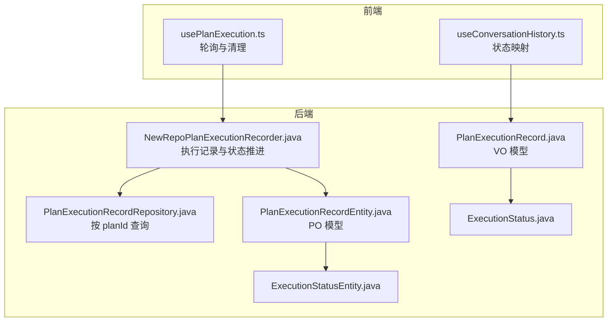
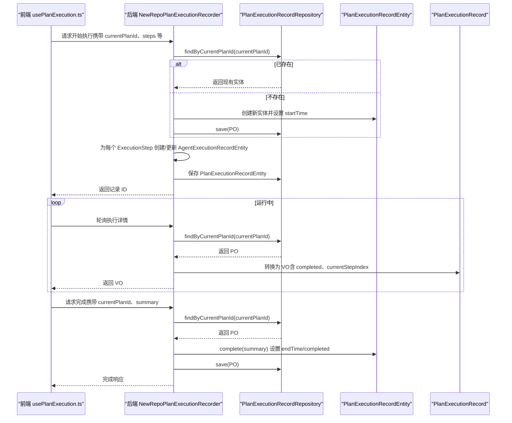
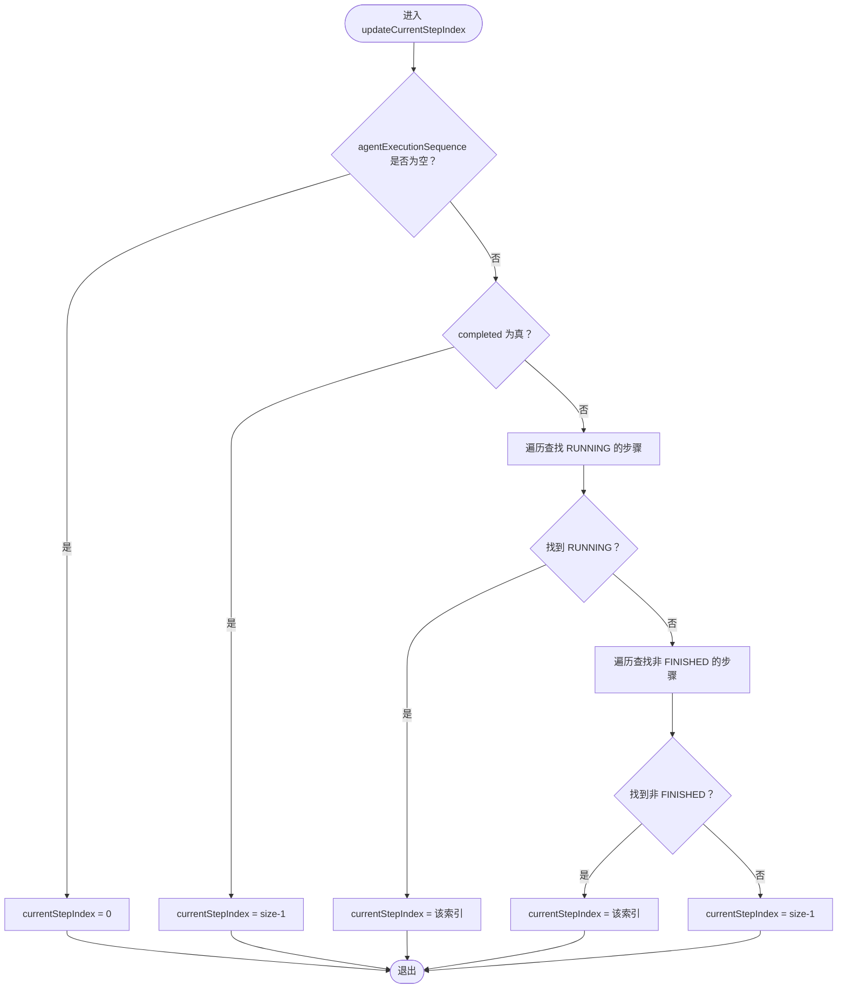
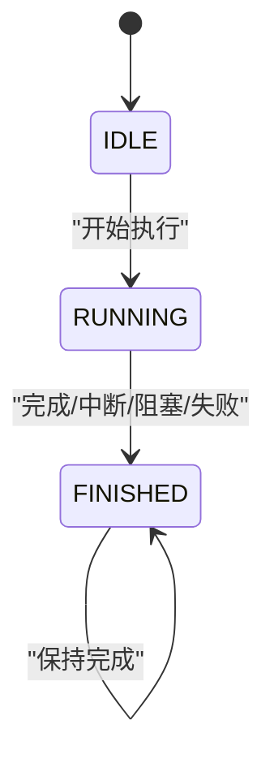
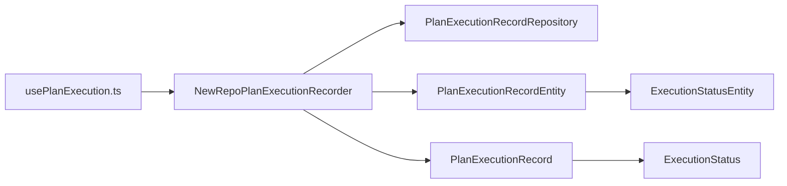

# 执行状态管理

<cite>
**本文引用的文件列表**
- [NewRepoPlanExecutionRecorder.java](file://src/main/java/com/alibaba/cloud/ai/lynxe/recorder/service/NewRepoPlanExecutionRecorder.java)
- [PlanExecutionRecord.java](file://src/main/java/com/alibaba/cloud/ai/lynxe/recorder/entity/vo/PlanExecutionRecord.java)
- [PlanExecutionRecordEntity.java](file://src/main/java/com/alibaba/cloud/ai/lynxe/recorder/entity/po/PlanExecutionRecordEntity.java)
- [PlanExecutionRecordRepository.java](file://src/main/java/com/alibaba/cloud/ai/lynxe/recorder/repository/PlanExecutionRecordRepository.java)
- [ExecutionStatus.java](file://src/main/java/com/alibaba/cloud/ai/lynxe/recorder/entity/vo/ExecutionStatus.java)
- [ExecutionStatusEntity.java](file://src/main/java/com/alibaba/cloud/ai/lynxe/recorder/entity/po/ExecutionStatusEntity.java)
- [AgentExecutionRecord.java](file://src/main/java/com/alibaba/cloud/ai/lynxe/recorder/entity/vo/AgentExecutionRecord.java)
- [usePlanExecution.ts](file://ui-vue3/src/composables/usePlanExecution.ts)
- [useConversationHistory.ts](file://ui-vue3/src/composables/useConversationHistory.ts)
</cite>

## 目录
1. [简介](#简介)
2. [项目结构与定位](#项目结构与定位)
3. [核心组件](#核心组件)
4. [架构总览](#架构总览)
5. [详细组件分析](#详细组件分析)
6. [依赖关系分析](#依赖关系分析)
7. [性能与一致性考量](#性能与一致性考量)
8. [故障排查指南](#故障排查指南)
9. [结论](#结论)

## 简介
本文件聚焦于“计划执行状态管理”的完整生命周期：从开始、运行到完成的流转过程，系统化梳理 recordPlanExecutionStart 与 recordPlanCompletion 的实现逻辑，解释 completed 字段的业务含义与状态判断，说明 startTime 和 endTime 的设置规则，阐述 currentStepIndex 的动态更新机制（包括在添加代理执行记录与完成计划时的策略），并提供状态流转的时序图与状态机图，帮助开发者与产品人员理解并正确使用该状态管理机制。

## 项目结构与定位
- 后端状态管理由 NewRepoPlanExecutionRecorder 服务类负责，贯穿计划执行的全链路记录与状态推进。
- 前端通过 usePlanExecution.ts 对后端执行记录进行轮询与清理，基于 completed 字段驱动 UI 行为。
- 数据模型层包含 VO（视图对象）与 PO（持久化对象），分别用于对外展示与数据库存储；两者均包含 completed、startTime、endTime、currentStepIndex 等关键字段。

图表来源
- [NewRepoPlanExecutionRecorder.java](file://src/main/java/com/alibaba/cloud/ai/lynxe/recorder/service/NewRepoPlanExecutionRecorder.java#L75-L150)
- [PlanExecutionRecordRepository.java](file://src/main/java/com/alibaba/cloud/ai/lynxe/recorder/repository/PlanExecutionRecordRepository.java#L26-L55)
- [PlanExecutionRecord.java](file://src/main/java/com/alibaba/cloud/ai/lynxe/recorder/entity/vo/PlanExecutionRecord.java#L103-L150)
- [PlanExecutionRecordEntity.java](file://src/main/java/com/alibaba/cloud/ai/lynxe/recorder/entity/po/PlanExecutionRecordEntity.java#L110-L170)
- [ExecutionStatus.java](file://src/main/java/com/alibaba/cloud/ai/lynxe/recorder/entity/vo/ExecutionStatus.java#L18-L26)
- [ExecutionStatusEntity.java](file://src/main/java/com/alibaba/cloud/ai/lynxe/recorder/entity/po/ExecutionStatusEntity.java#L18-L26)
- [usePlanExecution.ts](file://ui-vue3/src/composables/usePlanExecution.ts#L138-L172)
- [useConversationHistory.ts](file://ui-vue3/src/composables/useConversationHistory.ts#L35-L61)

章节来源
- [NewRepoPlanExecutionRecorder.java](file://src/main/java/com/alibaba/cloud/ai/lynxe/recorder/service/NewRepoPlanExecutionRecorder.java#L75-L150)
- [PlanExecutionRecordRepository.java](file://src/main/java/com/alibaba/cloud/ai/lynxe/recorder/repository/PlanExecutionRecordRepository.java#L26-L55)
- [PlanExecutionRecord.java](file://src/main/java/com/alibaba/cloud/ai/lynxe/recorder/entity/vo/PlanExecutionRecord.java#L103-L150)
- [PlanExecutionRecordEntity.java](file://src/main/java/com/alibaba/cloud/ai/lynxe/recorder/entity/po/PlanExecutionRecordEntity.java#L110-L170)
- [ExecutionStatus.java](file://src/main/java/com/alibaba/cloud/ai/lynxe/recorder/entity/vo/ExecutionStatus.java#L18-L26)
- [ExecutionStatusEntity.java](file://src/main/java/com/alibaba/cloud/ai/lynxe/recorder/entity/po/ExecutionStatusEntity.java#L18-L26)
- [usePlanExecution.ts](file://ui-vue3/src/composables/usePlanExecution.ts#L138-L172)
- [useConversationHistory.ts](file://ui-vue3/src/composables/useConversationHistory.ts#L35-L61)

## 核心组件
- NewRepoPlanExecutionRecorder：后端执行记录与状态推进的核心服务，负责：
  - 记录计划开始：recordPlanExecutionStart
  - 记录步骤开始/结束：recordStepStart、recordStepEnd
  - 记录思考与行动：recordThinkingAndAction
  - 记录动作结果：recordActionResult
  - 完成代理执行：recordCompleteAgentExecution
  - 记录计划完成：recordPlanCompletion
- PlanExecutionRecord（VO）与 PlanExecutionRecordEntity（PO）：承载执行记录的数据模型，包含 completed、startTime、endTime、currentStepIndex 等字段。
- ExecutionStatus（VO 枚举）与 ExecutionStatusEntity（PO 枚举）：统一表示执行状态（IDLE、RUNNING、FINISHED）。
- 前端 usePlanExecution.ts：对执行记录进行轮询、清理与 UI 状态映射；useConversationHistory.ts 将 completed 映射为“running/completed”。

章节来源
- [NewRepoPlanExecutionRecorder.java](file://src/main/java/com/alibaba/cloud/ai/lynxe/recorder/service/NewRepoPlanExecutionRecorder.java#L75-L150)
- [PlanExecutionRecord.java](file://src/main/java/com/alibaba/cloud/ai/lynxe/recorder/entity/vo/PlanExecutionRecord.java#L103-L150)
- [PlanExecutionRecordEntity.java](file://src/main/java/com/alibaba/cloud/ai/lynxe/recorder/entity/po/PlanExecutionRecordEntity.java#L110-L170)
- [ExecutionStatus.java](file://src/main/java/com/alibaba/cloud/ai/lynxe/recorder/entity/vo/ExecutionStatus.java#L18-L26)
- [ExecutionStatusEntity.java](file://src/main/java/com/alibaba/cloud/ai/lynxe/recorder/entity/po/ExecutionStatusEntity.java#L18-L26)
- [usePlanExecution.ts](file://ui-vue3/src/composables/usePlanExecution.ts#L138-L172)
- [useConversationHistory.ts](file://ui-vue3/src/composables/useConversationHistory.ts#L35-L61)

## 架构总览
后端以 NewRepoPlanExecutionRecorder 为中心，围绕 PlanExecutionRecord（VO）与 PlanExecutionRecordEntity（PO）构建执行状态的持久化与展示层。前端通过 usePlanExecution.ts 轮询后端执行记录，依据 completed 字段决定 UI 行为与清理时机。

图表来源
- [NewRepoPlanExecutionRecorder.java](file://src/main/java/com/alibaba/cloud/ai/lynxe/recorder/service/NewRepoPlanExecutionRecorder.java#L75-L150)
- [PlanExecutionRecordRepository.java](file://src/main/java/com/alibaba/cloud/ai/lynxe/recorder/repository/PlanExecutionRecordRepository.java#L26-L55)
- [PlanExecutionRecord.java](file://src/main/java/com/alibaba/cloud/ai/lynxe/recorder/entity/vo/PlanExecutionRecord.java#L103-L150)
- [PlanExecutionRecordEntity.java](file://src/main/java/com/alibaba/cloud/ai/lynxe/recorder/entity/po/PlanExecutionRecordEntity.java#L110-L170)
- [usePlanExecution.ts](file://ui-vue3/src/composables/usePlanExecution.ts#L138-L172)

## 详细组件分析

### 1) 计划开始：recordPlanExecutionStart
- 功能要点
  - 若当前 currentPlanId 已存在，则更新；否则新建 PlanExecutionRecordEntity（PO）。
  - 设置 startTime 为当前时间。
  - 遍历传入的 ExecutionStep 列表，为每个步骤创建或更新 AgentExecutionRecordEntity，并加入到 PlanExecutionRecordEntity 的 agentExecutionSequence 中。
  - 可选地建立层级关系（rootPlanId、parentPlanId、toolcallId），并进行增强校验。
  - 保存实体并返回记录 ID。
- 关键行为
  - startTime 在创建时设置。
  - agentExecutionSequence 会随着步骤的添加而增长。
  - currentStepIndex 由 PlanExecutionRecord.updateCurrentStepIndex 动态计算（见下文）。

章节来源
- [NewRepoPlanExecutionRecorder.java](file://src/main/java/com/alibaba/cloud/ai/lynxe/recorder/service/NewRepoPlanExecutionRecorder.java#L75-L150)
- [PlanExecutionRecordEntity.java](file://src/main/java/com/alibaba/cloud/ai/lynxe/recorder/entity/po/PlanExecutionRecordEntity.java#L110-L170)

### 2) 步骤开始/结束：recordStepStart / recordStepEnd
- recordStepStart
  - 通过 stepId 查找 AgentExecutionRecordEntity（PO）。
  - 设置状态为 RUNNING，设置 startTime 为当前时间。
  - 更新 stepIndex 与 agent 描述（若提供）。
  - 保存实体。
- recordStepEnd
  - 通过 stepId 查找 AgentExecutionRecordEntity（PO）。
  - 设置状态为 FINISHED，设置 endTime 为当前时间。
  - 更新 stepIndex 与 agent 描述（若提供）。
  - 保存实体。

章节来源
- [NewRepoPlanExecutionRecorder.java](file://src/main/java/com/alibaba/cloud/ai/lynxe/recorder/service/NewRepoPlanExecutionRecorder.java#L293-L386)

### 3) 思考与行动：recordThinkingAndAction
- 通过 stepId 获取 AgentExecutionRecordEntity（PO）。
- 创建 ThinkActRecordEntity 并填充 think/input/output/error 等字段。
- 将 ThinkActRecordEntity 加入 AgentExecutionRecordEntity 的 thinkActSteps 列表，并保存。
- 返回 ThinkActRecord 的 ID。

章节来源
- [NewRepoPlanExecutionRecorder.java](file://src/main/java/com/alibaba/cloud/ai/lynxe/recorder/service/NewRepoPlanExecutionRecorder.java#L388-L450)

### 4) 动作结果：recordActionResult
- 遍历 ActToolParam 列表，按 toolCallId 查找 ActToolInfoEntity（PO）。
- 若存在则更新参数与结果；否则创建新实体并保存。
- 用于补充工具调用的最终结果。

章节来源
- [NewRepoPlanExecutionRecorder.java](file://src/main/java/com/alibaba/cloud/ai/lynxe/recorder/service/NewRepoPlanExecutionRecorder.java#L452-L520)

### 5) 完成代理执行：recordCompleteAgentExecution
- 通过 stepId 查找 AgentExecutionRecordEntity（PO）。
- 根据 step 的 AgentState 转换为 ExecutionStatusEntity（IDLE/RUNNING/FINISHED）。
- 若未设置 endTime，则设置为当前时间。
- 更新 stepIndex、result、errorMessage、agentRequest 等字段。
- 保存实体。

章节来源
- [NewRepoPlanExecutionRecorder.java](file://src/main/java/com/alibaba/cloud/ai/lynxe/recorder/service/NewRepoPlanExecutionRecorder.java#L522-L604)

### 6) 计划完成：recordPlanCompletion
- 通过 currentPlanId 查找 PlanExecutionRecordEntity（PO）。
- 调用 complete(summary)：设置 endTime、completed=true、summary。
- 保存实体。

章节来源
- [NewRepoPlanExecutionRecorder.java](file://src/main/java/com/alibaba/cloud/ai/lynxe/recorder/service/NewRepoPlanExecutionRecorder.java#L606-L645)
- [PlanExecutionRecordEntity.java](file://src/main/java/com/alibaba/cloud/ai/lynxe/recorder/entity/po/PlanExecutionRecordEntity.java#L160-L166)

### 7) completed 字段的业务含义与状态判断
- completed 字段用于标记计划是否已完成。
- 在 recordPlanCompletion 中被置为 true，并设置 endTime。
- 前端 useConversationHistory.ts 将 completed 映射为“completed/running”，用于 UI 展示。
- 前端 usePlanExecution.ts 在检测到 completed=true 且存在 summary 或达到最大轮询次数后，执行清理流程（删除执行详情、取消跟踪、清理计数等）。

章节来源
- [PlanExecutionRecord.java](file://src/main/java/com/alibaba/cloud/ai/lynxe/recorder/entity/vo/PlanExecutionRecord.java#L140-L148)
- [PlanExecutionRecordEntity.java](file://src/main/java/com/alibaba/cloud/ai/lynxe/recorder/entity/po/PlanExecutionRecordEntity.java#L160-L166)
- [useConversationHistory.ts](file://ui-vue3/src/composables/useConversationHistory.ts#L35-L61)
- [usePlanExecution.ts](file://ui-vue3/src/composables/usePlanExecution.ts#L138-L172)

### 8) 时间戳设置规则：startTime 与 endTime
- 计划开始：recordPlanExecutionStart 在创建 PO 时设置 startTime。
- 步骤开始：recordStepStart 设置 AgentExecutionRecordEntity 的 startTime。
- 步骤结束：recordStepEnd 设置 AgentExecutionRecordEntity 的 endTime。
- 代理执行完成：recordCompleteAgentExecution 若未设置 endTime 则设置为当前时间。
- 计划完成：recordPlanCompletion 设置 PlanExecutionRecordEntity 的 endTime 并置 completed=true。

章节来源
- [NewRepoPlanExecutionRecorder.java](file://src/main/java/com/alibaba/cloud/ai/lynxe/recorder/service/NewRepoPlanExecutionRecorder.java#L75-L150)
- [NewRepoPlanExecutionRecorder.java](file://src/main/java/com/alibaba/cloud/ai/lynxe/recorder/service/NewRepoPlanExecutionRecorder.java#L293-L386)
- [NewRepoPlanExecutionRecorder.java](file://src/main/java/com/alibaba/cloud/ai/lynxe/recorder/service/NewRepoPlanExecutionRecorder.java#L522-L604)
- [NewRepoPlanExecutionRecorder.java](file://src/main/java/com/alibaba/cloud/ai/lynxe/recorder/service/NewRepoPlanExecutionRecorder.java#L606-L645)
- [PlanExecutionRecordEntity.java](file://src/main/java/com/alibaba/cloud/ai/lynxe/recorder/entity/po/PlanExecutionRecordEntity.java#L110-L170)

### 9) currentStepIndex 的动态更新机制
- 添加代理执行记录时：PlanExecutionRecord.addAgentExecutionRecord 会调用 updateCurrentStepIndex。
- 完成计划时：PlanExecutionRecord.complete 会调用 updateCurrentStepIndex。
- updateCurrentStepIndex 的判定逻辑：
  - 若计划已 completed：currentStepIndex 设为 agentExecutionSequence.size()-1。
  - 否则：遍历 agentExecutionSequence，找到第一个 RUNNING 的步骤作为当前步骤；若无 RUNNING，则找到第一个非 FINISHED 的步骤；若全部 FINISHED，则设为最后一个步骤。
- 因此，currentStepIndex 反映了“当前正在运行的步骤”或“最近一次未完成的步骤”，并在完成后固定为最后一步。

图表来源
- [PlanExecutionRecord.java](file://src/main/java/com/alibaba/cloud/ai/lynxe/recorder/entity/vo/PlanExecutionRecord.java#L150-L186)

章节来源
- [PlanExecutionRecord.java](file://src/main/java/com/alibaba/cloud/ai/lynxe/recorder/entity/vo/PlanExecutionRecord.java#L150-L186)

### 10) 状态机与流转图
- 状态集合：IDLE、RUNNING、FINISHED（VO 与 PO 枚举一致）。
- 状态转换规则（由后端推进）：
  - 开始：NOT_STARTED -> IDLE；IN_PROGRESS -> RUNNING；COMPLETED/INTERRUPTED/BLOCKED/FAILED -> FINISHED。
  - 结束：RUNNING/FINISHED 保持 FINISHED。
- 计划级状态：
  - 通过 recordPlanCompletion 将 completed 置为 true，并设置 endTime，从而驱动前端 UI 与轮询清理。

图表来源
- [ExecutionStatus.java](file://src/main/java/com/alibaba/cloud/ai/lynxe/recorder/entity/vo/ExecutionStatus.java#L18-L26)
- [ExecutionStatusEntity.java](file://src/main/java/com/alibaba/cloud/ai/lynxe/recorder/entity/po/ExecutionStatusEntity.java#L18-L26)
- [NewRepoPlanExecutionRecorder.java](file://src/main/java/com/alibaba/cloud/ai/lynxe/recorder/service/NewRepoPlanExecutionRecorder.java#L255-L275)

## 依赖关系分析
- NewRepoPlanExecutionRecorder 依赖 PlanExecutionRecordRepository 进行按 currentPlanId 的查询与保存。
- VO（PlanExecutionRecord）与 PO（PlanExecutionRecordEntity）共享字段语义，VO 提供 updateCurrentStepIndex 等业务逻辑，PO 提供 JPA 映射。
- 前端 usePlanExecution.ts 依赖后端执行记录接口，依据 completed 与 summary 决定轮询与清理。

图表来源
- [NewRepoPlanExecutionRecorder.java](file://src/main/java/com/alibaba/cloud/ai/lynxe/recorder/service/NewRepoPlanExecutionRecorder.java#L75-L150)
- [PlanExecutionRecordRepository.java](file://src/main/java/com/alibaba/cloud/ai/lynxe/recorder/repository/PlanExecutionRecordRepository.java#L26-L55)
- [PlanExecutionRecord.java](file://src/main/java/com/alibaba/cloud/ai/lynxe/recorder/entity/vo/PlanExecutionRecord.java#L103-L150)
- [PlanExecutionRecordEntity.java](file://src/main/java/com/alibaba/cloud/ai/lynxe/recorder/entity/po/PlanExecutionRecordEntity.java#L110-L170)
- [ExecutionStatus.java](file://src/main/java/com/alibaba/cloud/ai/lynxe/recorder/entity/vo/ExecutionStatus.java#L18-L26)
- [ExecutionStatusEntity.java](file://src/main/java/com/alibaba/cloud/ai/lynxe/recorder/entity/po/ExecutionStatusEntity.java#L18-L26)
- [usePlanExecution.ts](file://ui-vue3/src/composables/usePlanExecution.ts#L138-L172)

章节来源
- [PlanExecutionRecordRepository.java](file://src/main/java/com/alibaba/cloud/ai/lynxe/recorder/repository/PlanExecutionRecordRepository.java#L26-L55)
- [PlanExecutionRecord.java](file://src/main/java/com/alibaba/cloud/ai/lynxe/recorder/entity/vo/PlanExecutionRecord.java#L103-L150)
- [PlanExecutionRecordEntity.java](file://src/main/java/com/alibaba/cloud/ai/lynxe/recorder/entity/po/PlanExecutionRecordEntity.java#L110-L170)
- [usePlanExecution.ts](file://ui-vue3/src/composables/usePlanExecution.ts#L138-L172)

## 性能与一致性考量
- 事务性：recordPlanExecutionStart 使用 @Transactional，确保计划记录与层级关系创建的一致性。
- 查询与保存：按 currentPlanId 查询与保存，避免重复创建；步骤级别的 AgentExecutionRecordEntity 也按 stepId 查询与更新，减少不必要的写放大。
- 前端轮询：usePlanExecution.ts 在检测到 completed=true 且有 summary 或达到最大轮询次数后清理，降低无效请求与资源占用。
- 时间戳：仅在状态变化时设置，避免频繁写入。

[本节为通用建议，不直接分析具体文件]

## 故障排查指南
- 计划未找到
  - 现象：recordPlanCompletion 报告找不到 currentPlanId。
  - 排查：确认 recordPlanExecutionStart 是否成功返回 ID，且 currentPlanId 传参一致。
- 状态异常
  - 现象：前端显示“running”但后端 completed=true。
  - 排查：检查 completed 字段映射逻辑与轮询清理时机；确认 recordPlanCompletion 是否被调用。
- 当前步骤不正确
  - 现象：currentStepIndex 与预期不符。
  - 排查：确认 agentExecutionSequence 的状态是否正确（RUNNING/FINISHED），以及 updateCurrentStepIndex 的判定分支是否符合预期。
- 时间戳缺失
  - 现象：endTime 为空。
  - 排查：确认 recordStepEnd、recordCompleteAgentExecution、recordPlanCompletion 是否按顺序调用。

章节来源
- [NewRepoPlanExecutionRecorder.java](file://src/main/java/com/alibaba/cloud/ai/lynxe/recorder/service/NewRepoPlanExecutionRecorder.java#L606-L645)
- [PlanExecutionRecord.java](file://src/main/java/com/alibaba/cloud/ai/lynxe/recorder/entity/vo/PlanExecutionRecord.java#L150-L186)
- [usePlanExecution.ts](file://ui-vue3/src/composables/usePlanExecution.ts#L138-L172)

## 结论
本状态管理体系通过 NewRepoPlanExecutionRecorder 将计划执行的开始、运行与完成串联起来，借助 VO/PO 的统一字段与状态枚举，保证前后端对执行状态的理解一致。completed、startTime、endTime、currentStepIndex 等关键字段在服务层与模型层均有明确的设置与更新规则，配合前端轮询与清理策略，形成闭环的执行状态可视化与治理能力。建议在扩展新状态或新增字段时，遵循现有模式，确保 VO/PO 字段语义一致与状态转换清晰。